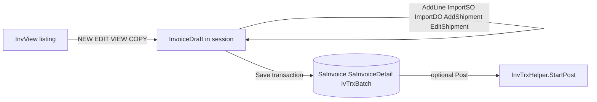
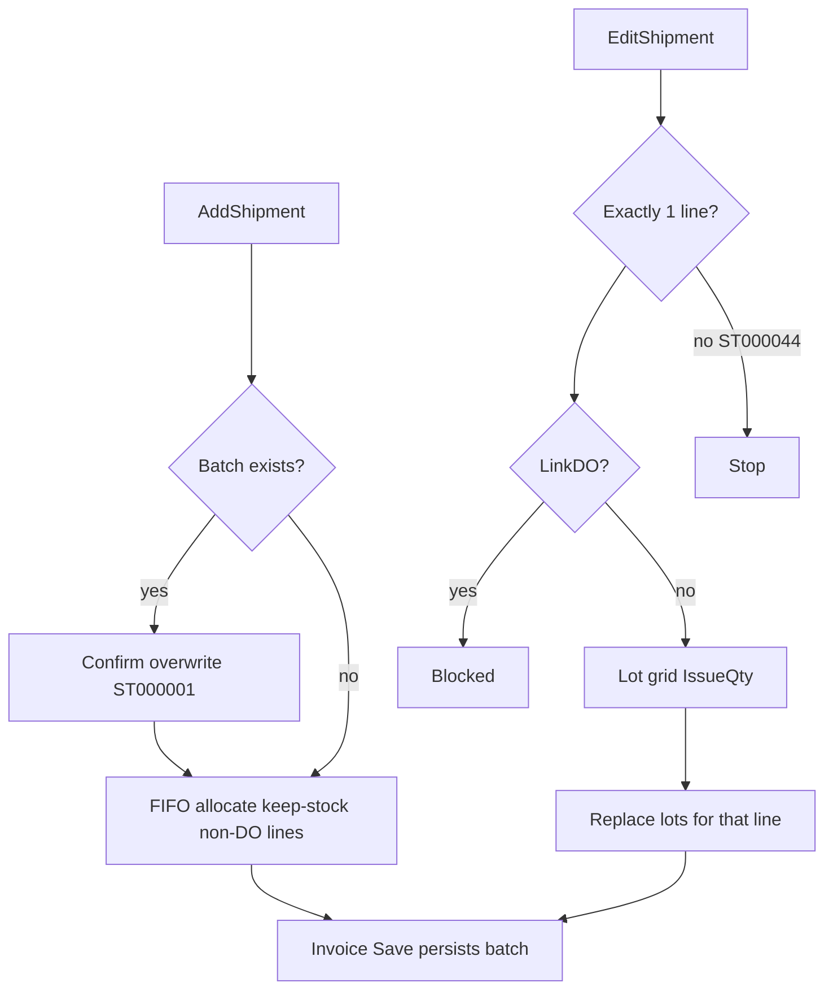

## INVOICE Header

| Field | Value | Field | Value |
|---|---|---|---|
| **DATE*** | `03/09/2026` | **STATUS*** | `OPEN` |
| **PREFIX** | | **TYPE** | `INV` |
| **INV NO.*** | `AUTO` | **DO NO.*** | `AUTO` |
| **DEPARTMENT** | | **PROJECT ID** | |

### Fields

- **DATE***: `03/09/2026`
- **PREFIX**: Dropdown
- **INV NO.***: `AUTO`
- **DEPARTMENT**: Dropdown
- **STATUS***: `OPEN`
- **TYPE**: `INV`
- **DO NO.***: `AUTO`
- **PROJECT ID**: Dropdown

## CUSTOMER INFO

### Customer

| Field | Value |
|---|---|
| **CUST CODE*** | Input + Dropdown + Search |
| **Customer Details** | Text input |

### Tabs

- **BILLING ADDRESS**
- **SHIPPING ADDRESS**
- **PAYMENT INFO**
- **REMARK**

### Billing Address

| Field | Value |
|---|---|
| **CUST NAME** | Input |
| **ADDRESS** | Input |
| | Input |
| | Input |
| | Input |
| **TEL** | Input |

### Location / Contact

| Field | Value |
|---|---|
| **POSTAL** | Input |
| **CITY** | Input |
| **STATE** | Input |
| **COUNTRY** | Input |
| **FAX** | Input |

## CUSTOMER INFO

### Customer

| Field | Value |
|---|---|
| **CUST CODE*** | Input + Dropdown + Search |
| **Customer Details** | Text input |

### Tabs

- **BILLING ADDRESS**
- **SHIPPING ADDRESS**
- **PAYMENT INFO**
- **REMARK**

### Billing Address

| Field | Value |
|---|---|
| **CUST NAME** | Input |
| **ADDRESS** | Input |
| | Input |
| | Input |
| | Input |
| **TEL** | Input |

### Location / Contact

| Field | Value |
|---|---|
| **POSTAL** | Input |
| **CITY** | Input |
| **STATE** | Input |
| **COUNTRY** | Input |
| **FAX** | Input |

## CUSTOMER INFO

### Customer

| Field | Value |
|---|---|
| **CUST CODE*** | Input + Dropdown + Search |
| **Customer Details** | Text input |

### Tabs

- **BILLING ADDRESS**
- **SHIPPING ADDRESS**
- **PAYMENT INFO**
- **REMARK**

### Payment Info

| Field | Value | Field | Value |
|---|---|---|---|
| **CURRENCY** | Input | **SALESMAN** | Dropdown |
| **CURRENCY RATE** | `1` | **SHIP VIA** | Dropdown |
| **PAYMENT TERM** | Dropdown | **PO NO.** | Input |
| **TAX GROUP** | Dropdown | **HS CODE** | Input |
| **COUNTRY OF PORT** | Input | **TYPE OF PACKAGE** | Input |
| **MODE OF SHIPMENT** | Input | | |

> **Note:** `TYPE OF PACKAGE` appears to be crossed out/marked in the original screen.

## INVOICE Items

## INVOICE ITEM

### Item Details

| Field | Value |
|---|---|
| **LINE*** | `1` |
| **PRO CODE** | Dropdown |
| **PROD DESC*** | Text area |
| **ORDER QTY*** | `0` + Dropdown |
| **UNIT PRICE*** | `0` |
| **WAREHOUSE** | Dropdown |
| **DISC PERCENT** | `0 / 0 / 0 / 0 / 0 %` |
| **REMAIN CUST DISCOUNT** | Checkbox |
| **DISC AMOUNT** | `0 / 0 $` |
| **USE AMOUNT DISCOUNT** | Checkbox |

### Sales / Delivery Reference

| Field | Value |
|---|---|
| **SO NO** | Input |
| **LINE** | Input |
| **REL** | Input |
| **Add** | Button |
| **DELIVERY ORDER** | Input |
| **LINE** | Input |
| **Add** | Button |
| **PROD BARCODE** | Input |
| **CUST PROD CODE** | Input |

### Standard Quantity / Packaging

| Field | Value |
|---|---|
| **STD PACKSIZE*** | `0` |
| **STD QTY*** | `0` |
| **Additional Quantity** | Input |

### Tax / Accounting

| Field | Value |
|---|---|
| **TAX GROUP** | Dropdown |
| **INCLUSIVE** | Checkbox |
| **ITEM GL CODE** | `501-1015` + Dropdown |
| **CLASSIFICATION CODE** | Dropdown |

### Actions

- **ADD**
- **DELETE**
- **ADD SHIPMENT**
- **EDIT SHIPMENT**
- **VIEW SHIPMENT**
- **VALIDATE PRICES**

---

## Invoice Item Grid

### Column Chooser

| # | Column |
|---:|---|
|  | Select |
| # | Line No. |
|  | Sort |
| SO NO | Sales Order No. |
| SO LI... NO | SO Line No. |
| CUST PO | Customer PO |
| DO NO | Delivery Order No. |
| ITEM CODE | Item Code |
| ITEM DESC | Item Description |
| BARCODE | Barcode |
| GL CODE | GL Code |
| QTY | Quantity |
| U... | Unit |
| STD QTY | Standard Quantity |
| STD U... | Standard Unit |
| UNIT PRICE | Unit Price |
| AMOUNT | Amount |
| DISCOUNT | Discount |
| TAX | Tax |
| TAX AMOUNT | Tax Amount |
| NET AMOUNT | Net Amount |
| LOCAL AMOUNT | Local Amount |
| SHIP QTY | Shipment Quantity |
| WAREH... | Warehouse |

**Grid Status:** `NO DATA TO DISPLAY`

### Grid Total

| Description | Value |
|---|---:|
| **TOTAL** | `0` |
| Quantity | `0` |
| Amount | `0.00` |
| Discount | `0.00` |
| Tax Amount | `0.00` |
| Net Amount | `0.00` |
| Local Amount | `0.00` |

---

## Invoice Tax Summary

| Field | Value |
|---|---:|
| **TOTAL EXCL TAX** | Input |
| **TOTAL TAX** | Input |
| **TOTAL INCL TAX** | Input |

here are the rule from previous web form ERP system, u can refer or suggest the best:
---
name: Invoice Blazor Spec
overview: Complete business-rule specification extracted from ASP.NET Web Forms Invoice Entry (.NET 4.8) so the new Blazor ERP can reproduce add/edit/delete invoice, line logic, save/post, and add/edit shipment without changing meaning.
todos:
  - id: draft-model
    content: "Blazor InvoiceDraft: header, lines, one SP shipment batch; session/cache keyed by user+draftId"
    status: pending
  - id: status-machine
    content: Implement NEW/OPEN/NEW/POSTED/CLOSED gates matching InvView + Edit lock
    status: pending
  - id: line-engine
    content: Port AddRow / SO import / DO import / mix locks / discountable / tax-type / min-price / qty caps
    status: pending
  - id: calc-engine
    content: "Shared InvoiceCalculator: discount JOIN/cascade, tax inclusive, adaptive rounding, DecPoint totals"
    status: pending
  - id: save-post
    content: Save transaction + numbering lock; optional Post with GL/period/DO/shipment completeness checks
    status: pending
  - id: shipment
    content: AddShipment FIFO overwrite + Edit lots; SO_Line_No=invoice Line; persist only on invoice Save
    status: pending
isProject: false
---

# Invoice + Shipment Business Spec (Web Forms → Blazor)

This is a **specification only**. No code in this repo. Source of truth is the current Wincom ERP V5.5 invoice screen.

## 1. Architecture to keep

The Web Forms screen is a **session-backed working document**, not row-by-row CRUD.



Blazor must keep a draft (scoped service / server cache keyed by user + draftId) until Save. Shipment lots live on the same draft.

**Tables**
- Header/lines: `SaInvoice`, `SaInvoiceDetail`
- Shipment: `IvTrxBatch`, `IvTrxBatchDetail` (`TrxType=SP`)
- Stock lots: `IvBalLoc`
- Sources: `SaSO`/`SaSODetail`, `SaDO`/`SaDODetail`
- Masters: `SaCust`, `IvMas`/`IvMasPack`, `SaTaxGroup`, `AdPara`, `AdSmNumDate`

---

## 2. Status lifecycle

| Status | Meaning | Set by |
|---|---|---|
| OPEN | Being created or edited (pessimistic lock) | New/Copy UI; Edit immediately writes OPEN |
| NEW | Saved, unposted | Save always writes NEW |
| POSTED | Posted to stock/AR/GL | `NeedPostHelper.PostInvNoLock` |
| CLOSED | After later processing | Print control treats POSTED or CLOSED as printable |

Listing gates in [InvView.aspx.cs](ERP/SalesForms/InvView.aspx.cs):
- **Edit** only if `NEW` (`ST000079`)
- **Delete** only if `NEW` and not posted (`ST000078`, `ST000075`)
- **Post** needs Post right
- **Rollback** only if posted
- **Print** (if `AdUser.PrintControl`) only POSTED/CLOSED

Edit mode (`updateStatus`): set OPEN unless already posted. Cancel restores NEW.

---

## 3. Entry modes

Query: `InvoiceEntry.aspx?ID={InvNo}&Type={NEW|EDIT|VIEW|COPY}`

**NEW:** InvNo=`AUTO`, DONo=`AUTO`, date=now, status OPEN, empty lines.

**EDIT:** Load header, details, SP batches where `TrxType='sp'` and `(DoNo=id or InvNo=id)`. Set OPEN. Recalc discountable flag.

**VIEW:** All actions disabled.

**COPY:** New AUTO invoice, today’s date. Copy lines but **break links**: `LinkDO=false`, `DONo=""`, `DOLine=1`, `SONo=""`, `SOLine=1`, `CustRel=1`. Ref4 customs from SO/DO stay blank.

Company/Branch/Location always from login session.

---

## 4. Customer / header rules

On customer change:
1. Fill bill-to / deliver-to from `SaCust`:
   - `AppInvoice=true` → bill-to = main address; else `InvName`/`InvAddress*`
   - `AppShip=true` → deliver-to = main address; else `ShipName`/`ShipAddress*`
2. Load PayCode, Currency, TaxGroup, Salesman, ContactPerson, InvPrefix, DecPoint, DiscountMethod, DiscountSeq
3. Recapture FX from `sySaCurrRate` for invoice date + currency
4. **Delete all lines and shipment batches**
5. Clear remarks, Ref1–Ref3, custom import/export
6. If `AdPara.PrefixControl=1`, prefix = customer `InvPrefix`

**FX:** default **blank** (not 1). Add blocked if empty/0. Save: required; if currency ≠ `AdPara.HMCurrCode` and rate=1 → `ST000005`. Date change recaptures rate.

**Warehouse priority when loading an item:**
1. `AdUserDefault.Warehouse` for `PageCode=INV`
2. Else item `DefWarehouse`
3. Else `AccBranch.SalesWH`

**Ref4 (e-invoice):** `[IMPORT]:xxx,[EXPORT]:yyy`. SO/DO copy does **not** copy Ref4.

After adding a DO, lock customer code/name/search.

---

## 5. Line add / edit / delete

### Client add (`OnAddItemClick`)
- Qty ≠ 0, StdQty ≠ 0
- Currency rate valid
- Groups `vgSave` + `vgAdd`
- Wait until product callback finished; barcode Enter counts as add

**Qty / pack / catch-weight (client):**
- `StdQty = OrderQty * StdPackSize` (4 dp)
- If catch-weight: `WtQty = StdQty * DefCatchWt`
- Reverse: `StdQty = WtQty / CatchWt`, `OrderQty = StdQty / StdPackSize`

### Server `AddRow()` — must keep

1. Item required (`ST000028`)
2. Currency rate not empty/0 (`ST000006`)
3. Customer required (`ST000008`)
4. Qty vs source if `AdPara.InvFullControl=false`:
   - From SO: qty ≤ SO `BalanceQty` (`ST000017`); SO line required if SO selected
   - From DO+SO: qty ≤ DO qty (`ST000016`)
   - From DO only: qty ≤ that DO line
5. **Discountable mix** (first line sets invoice type):
   - Invoice discountable → cannot add non-discountable
   - Invoice non-discountable → cannot add discountable
   - `IvMas.IsDiscountable=true` means **not** discountable (legacy name)
6. **Min price:** convert unit price to home currency vs `IvMasPack.MinPrice`. Below min needs password (`ST000054`)
7. All lines inclusive **or** all exclusive (`ST000032`)
8. If any line `LinkDO=true`, cannot add keep-stock item
9. StdQty required (`ST000015`)
10. Item GL required (`ST000030`) — item `SellingGLCode` else `AdPara.SalesGLCode1`
11. Line no = `MAX(Line)+1` (edit reuses existing Line)

**Edit line:** load into product panel. If `AdUser.FromDOEditControl=true`, DO-sourced lines cannot be edited (`ST000058`). If shipment exists for ICode+line, lock qty/icode.

**Delete line:** must select (`ST000035`). Delete session detail + matching `IvTrxBatchDetail` (`InvNo+ICode+SO_Line_No`). Drop empty batch header. Rebuild header DONo (`AUTO` if none). Re-round tax.

**Change customer:** delete all lines + batches.

---

## 6. Three ways to add lines

**A. Manual / barcode** — user picks item, UOM, qty, price, discounts.

**B. From SO** (`AddRowINVSODtl`)
- Only `BalanceQty > 0`
- Qty = remaining balance (or listing `InvQty`)
- Copy SO price, tax, discounts, UOM, remarks, CustPO, warehouse, classification
- Copy header remarks/ship/paycode/tax/salesman/project from SO
- **If invoice already has a DO line → reject** (`ST000014`)
- Modes: all remaining, selected lines, or partial qty

**C. From DO** (`AddRowDOInvDtl`)
- Copy DO lines with `LinkDO=true`
- Price from linked SO else item selling price
- Copy DO remarks/refs (not Ref4)
- **If invoice already has keep-stock or SO-only lines → reject** (`ST000013`)
- Duplicate DO line (same DO+ICode+Qty+Desc+Remarks) skipped
- After DO add, lock customer

**Mixing rule:** DO invoice = DO lines only (plus non-stock extras that are not keep-stock). SO/direct invoice = SO and/or keep-stock, **no DO**.

---

## 7. Pricing (`AdPara.UseItemMaster`)

| Value | Source |
|---|---|
| 1 | Item master |
| 2 | Customer group price |
| 3 | Customer product price + **MOQ** |
| 4 | Customer product, then group, then master |

Mode 3: on qty/UOM change pick highest `MOQ <= OrderQty`. None → price 0, Add disabled (`ST000031`).

UOM change: pack size from UOM table; `StdQty = OrderQty * StdCustPSize`.

Min-price override and credit bypass share SHA1 customer password + `CreditLimitTimeOutMinute`.

---

## 8. Discount

Customer: `DiscountMethod` JOIN or SPLIT, `DiscountSeq`.

Line is PERCENTAGE (`ItemDiscount2..6`) or AMOUNT (`ItemDiscount`/`ItemDiscount1`) — mutually exclusive.

**Calculator** (`SalesDicountHelper.CalculateDiscount`):
- Percents 1–6 **cascade** on remaining price
- Then add amount discounts
- JOIN: sum all percent rates, apply once: `P * (sum%)/100` + amounts

Qty-based item discount from `SaDisGroupItem` (ICode, date, qty band) if any discount items exist.

`AdPara.DiscountFromGross=true` → store line Discount as 0.

`OrderType="EXCLD DIS"` → that net is excluded from gross then added back into total.

---

## 9. Tax and amounts

```
taxPercent = SaTaxGroup of line TaxGroup (else customer TaxGroup if Taxable)

if Inclusive: unitPriceExTax = UnitPrice / (1 + tax%/100)
else:          unitPriceExTax = UnitPrice

Amount    = Round(Qty * unitPriceExTax, 2)
discount  = CalculateDiscount(...)   // per unit
NetAmount = Round(Qty * unitPriceExTax, 2) - Round(Qty * discount, 2)
            [inclusive: divide discount by (1+tax%)]

if Inclusive: TaxAmt = Round((UnitPrice - discount) * Qty, SalesTaxDec) - NetAmount
else:         TaxAmt = Round(NetAmount * tax%/100, SalesTaxDec)

DiscountAmt = Amount - NetAmount  (unless DiscountFromGross)
LocalAmount = Round(NetAmount * CurrRate, 2)  // AwayFromZero
```

Then:
- After add/delete: `InvTrxHelper.TableRounding` on TaxAmt/NetAmount
- Before save: `InvTrxHelper.TaxAdaptiveRounding`
- Header Taxes/TotAmnt rebuilt from details after adaptive rounding

**Totals:** Gross = sum Net except EXCLD DIS. If customer `DecPoint=false` round 2 dp; if true round **0 dp**. `Total = Gross - headerDiscount + Excluded + Taxes`.

Save tally: header total must equal `sum(NetAmount+TaxAmt)` of details.

---

## 10. Save (`SaveInv`)

Wrapped in `TrxPostingHelper` lock (~90s) so two users cannot take the same number.

Fail if:
1. No lines (`ST000033`)
2. Currency missing / foreign rate=1
3. Credit/term fails unless bypass — gated by `AdPara.CheckCreditLimitInv` (default true)
4. Header ≠ detail total
5. Missing GL when `SalesPostTotal=false` (`ST000020`)
6. ShipQty > StdQty (`ST000019`)
7. Date outside `AdPara.CurrentMonth/Year`
8. Already posted (`ST000052`)
9. Numbering not set (`ST000037`/`ST000012`)
10. InvNo still AUTO

**Credit/term (`SaCust.CreditTermControl`):**

| Value | Check |
|---|---|
| Credit | `(invTotal + DebtorAgingInfo.Total + advPayment) > CreditLimit` |
| TermDay | oldest outstanding IN age > term Days |
| TermMonth | aging from 1st of next month after oldest voucher |
| CreditDay | credit + term days |
| CreditMonth | credit + term months |

CreditLimit=0 skip amount. Days=0 skip term. Bypass: SHA1 password + timeout.

**Header:** addresses uppercased; Status=NEW even if user chose Post; DONo = unique DOs from lines or generated; Created/UserID on new, Updated/UpdatedUID on edit; DeliveryStatus=false, ExportStatus=false.

**One SQL transaction:** SaInvoice, SaInvoiceDetail, AdSmNum/AdSmNumDate, IvTrxBatch/Detail, AdTrackNum. Post is **after** commit.

On save, stamp generated InvNo/DONo onto all SP details; set batch `RefNo` from `"Shipment"` to InvNo; copy line unit price into batch `Cost`.

---

## 11. Numbering

**Invoice:** prefix = `InvType + InvPrefix` (usually INV + user/customer prefix). `CCommon.GenerateAutoNumberWithDateEx`. Collision check. Sequence bump only if original was AUTO.

**DO on invoice:**
- If any line has DONo → use unique comma list
- Else if `GenerateDOinInv=false` → DONo = InvNo
- Else generate DO number and bump DO sequence

---

## 12. Post (optional after save)

User confirm: *Do you want to POST this Invoice?*

Then: re-check blank GL; Post right; not already posted; `InvTrxHelper.StartPost`:
- Invoice month/year cannot be before CurrentMonth/Year
- Linked DOs must already be posted
- Shipment warehouse must match line warehouse
- Batch `TrxDtTime` must equal InvDate
- Keep-stock non-SERVICE non-LinkDO: **ship qty must equal StdQty**
- Then `CPosting.PostInventoryTransaction("SP", ...)` then AR/GL (`SalesPostTotal` total vs detail)

If post fails, invoice **stays NEW**.

---

## 13. Delete invoice (listing only)

Entry page never deletes a saved invoice; it only deletes session lines.

From InvView:
1. Delete right
2. Not posted
3. Status NEW
4. `InvTrxHelper.DeleteInvoice`: delete SaInvoice header, related IvTrxBatch, track Deleted. Detail delete is commented — **cascade from header FK expected**
5. Audit log

---

## 14. Shipment (critical)

Shipment is **not** a line field. It is one SP batch on the draft.



### Join key (do not get this wrong)

| Batch field | Meaning |
|---|---|
| `SO_Line_No` | **Invoice Line number** (not SO line) |
| `SO_No` | Line SONo |
| `PreRevNo` | Invoice line SOLine |
| `FrWarehouse/FrLocation/FrLot` | Lot identity (LocCode is required) |
| `FrStdQty` / `FrWtQty` | Issued qty |
| `TrxType` | SP |
| Header `RefNo` | `"Shipment"` until save, then InvNo |

Grid ShipQty = `SUM(FrStdQty)` for InvNo+SP+ICode+SO_Line_No. Red if ≠ StdQty.

### Which lines

| Line | Add | Edit | Required at Post |
|---|---|---|---|
| Direct/SO, keep-stock, not SERVICE | Auto-allocate | Yes | ShipQty **==** StdQty |
| LinkDO / DONo filled | Skip | Blocked | No (DO already shipped) |
| KeepStock=false | Skip | Open, usually no lots | No |
| SERVICE | Skip | — | No |

### Add Shipment (`ShipmentHelper.AddShipment`)

1. Need lines (`ST000036`)
2. BatchNo = existing SP for this InvNo, else new via `BatchNoHelper.RetrieveAndUpdateBatchNo`
3. Wipe this batch’s SP rows for InvNo; delete duplicate other-batch SP for same InvNo
4. For each current line with **empty DONo**:
   - Need = StdQty (4 dp), WH = FrWarehouse
   - Lots from `IvBalLoc`: status ACTIVE/REPROCESS/CONSIGMENT, StdQty>0, TransDate<=InvDate, Company/Branch/Location, **order TransDate, LotNo (always FIFO)**
   - No lots + keep-stock → ST000051, skip line (partial add allowed)
   - Need > stock → ST000059, skip line
   - Else walk lots FIFO; LocCode is part of identity; decrement in-memory balances
5. Ensure batch header: TrxType=SP, Status=NEW, RefNo=Shipment, TrxDtTime=InvDate
6. CostPrice forced to 0

Overwrite confirm if batch already exists (`ST000001`).

### Edit Shipment (`SPShipment`)

- Exactly one line; LinkDO blocked
- Resolve BatchNo with `CheckBatchNoEx`; if HdrDONo is AUTO match `DONo=AUTO OR InvNo` so a second batch is not created
- Lot grid from IvBalLoc: ICode + warehouse + TransDate<=InvDate; **LIFO if CostMethod=LIFO else FIFO**
- Only IssueQty/IssueWtQty editable
- Prefill from existing SP rows, else auto-fill FIFO until StdQty
- Apply: IssueQty cannot exceed lot on-hand; **sum may be less than StdQty**; replace rows for BatchNo+ICode+SO_Line_No

**Qty by moment**
- Add: allocate up to StdQty; skip short lines
- Edit: may be less than StdQty; never more than lot on-hand
- Save: ShipQty **≤** StdQty (`ST000019`)
- Post: keep-stock non-DO **must equal** StdQty

**Quirks to preserve unless product decides otherwise**
- Add always FIFO; Edit uses CostMethod for LIFO
- Edit lot query is ICode+warehouse+date only (no company/branch/location); Add **does** filter company/branch/location
- One batch per invoice; re-add replaces, never appends a second BatchNo

---

## 15. AdPara / master switches

| Setting | Effect |
|---|---|
| UseItemMaster | Price source 1–4 |
| DiscountFromGross | Store line discount 0 |
| SalesItemTaxInclusive | Default inclusive |
| SalesGLCode1 | Fallback GL |
| UseWeight | Catch-weight UI |
| ShowMoreDicounts | Extra % columns |
| InvFullControl | false = enforce SO/DO qty caps |
| GenerateDOinInv | Auto DO number |
| CheckCreditLimitInv | Credit/term on save |
| HMCurrCode | Home currency |
| SalesTaxDec | Tax decimals |
| CurrentMonth/Year | Period lock |
| PrefixControl | Customer prefix |
| SalesPostTotal | Skip per-line GL if true |
| CostMethod | LIFO vs FIFO on **edit** lots |

Customer: CreditLimit, CreditTermControl, PayCode, Currency, TaxGroup, Taxable, DecPoint, DiscountMethod, DiscountSeq, GroupDiscount, AppShip, AppInvoice, InvPrefix, SRepCode.

User: SellPriceView, FromDOEditControl, PrintControl, AdUserDefault prefix/warehouse.

---

## 16. Blazor domain mapping (spec, not implementation)

Keep the same commands:

- `LoadCustomer` → wipe lines + lots
- `LoadProduct` / `ChangeQty` / `ChangeUom`
- `AddLine` / `UpdateLine` / `DeleteLines`
- `ImportFromSo` / `ImportFromDo`
- `AddShipment` / `GetLotsForEdit` / `ApplyShipmentEdit`
- `Save(post, creditBypass)`
- Status: `NEW ↔ OPEN → NEW → POSTED`

Suggested draft:

```
InvoiceDraft
  Header, Customer, Lines[]
  ShipmentBatch?   // 0 or 1
    Lots[]  keyed by InvoiceLineNo + ICode + WH + Loc + Lot
```

Must-not-lose: DO/SO mix lock, discountable mix, inclusive/exclusive mix, min-price override, credit-term bypass, AUTO numbering, OPEN edit-lock, shipment vs qty, header/detail tally after adaptive tax, `SO_Line_No` = invoice Line.

---

## 17. Error codes to keep (user-facing)

ST000001 overwrite shipment, ST000003 credit limit, ST000004/005/006 currency, ST000007/008/026 customer, ST000012/037 numbering, ST000013/014 mix DO/SO, ST000015/016/017 qty, ST000019/059/051 shipment stock, ST000020 GL, ST000025 InvNo used, ST000027 credit, ST000028 item, ST000030 GL, ST000031 MOQ, ST000032 tax type, ST000033 no data, ST000034 no SO items, ST000035 no line selected, ST000036 no items to ship, ST000038/043 password, ST000044 select 1 line, ST000052 posted, ST000054 min price, ST000055 UOM, ST000058 cannot edit DO line, ST000066 rollback, ST000075/078/079 listing gates.

