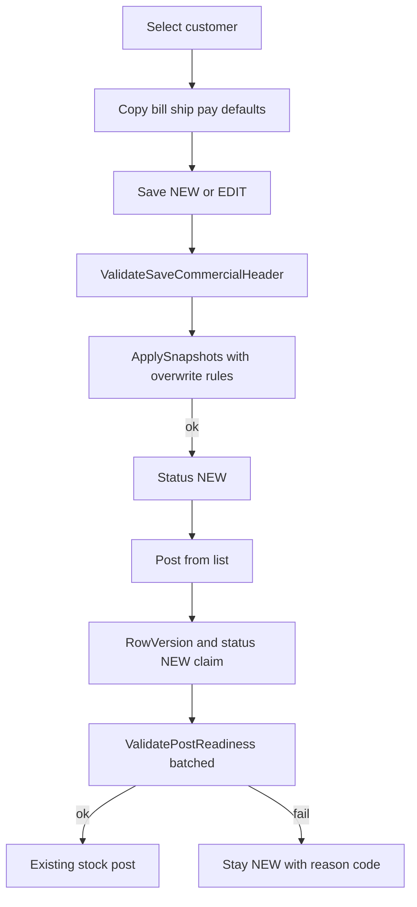

# Invoice save, populate, and post gates — hardened v2 (Architect 9.4 → ≥9.6)

Customer select already copies bill/ship/payment defaults in [`GetCustomerDefaultsAsync`](ErpWeb.Core/Sales/SaInvoiceService.cs). This work adds **required-field gates**, **document snapshots**, and a **Post completeness check**. It does **not** post journals to an Account database. Post remains stock posting, but fails closed if AR/e-invoice data is missing.



---

## 0. Prerequisite — TaxGlCode before Post gate (blocker 8)

**Ship order:**

1. `scripts/alter-sataxgroup-gl.sql` + EF `SaTaxGroup.TaxGlCode` + tax group popup field in [`SaTaxGroupList.razor`](ErpWeb.UI/Sales/Masters/SaTaxGroupList.razor)
2. `scripts/alter-sacust-tin.sql` + customer TinNo UI
3. `scripts/alter-sainvoice-post-snapshots.sql` + invoice/detail EF
4. Then enable `ValidatePostReadiness` in `PostOneAsync`

Do **not** flip on the Post gate while `TaxGlCode` has no master UI — operators cannot fix Post failures otherwise.

---

## 1. Save vs Post (do not mix)

### Save — `ValidateSaveCommercialHeader` (blocker 6)

Name the save gate explicitly (not a vague “require commercial header”):

```csharp
void ValidateSaveCommercialHeader(SaInvoiceDocument dto)
{
    // After backfill of InvName/InvAddress1/InvCountry from customer defaults when blank
    if (string.IsNullOrWhiteSpace(dto.InvName)) throw FieldRequired(nameof(dto.InvName));
    if (string.IsNullOrWhiteSpace(dto.InvAddress1)) throw FieldRequired(nameof(dto.InvAddress1));
    if (string.IsNullOrWhiteSpace(dto.InvCountry)) throw FieldRequired(nameof(dto.InvCountry));
    // existing: customer, date, pay term, currency/FX, ≥1 line, item, qty, warehouse for stock,
    // tax group when customer taxable
}
```

Align UI `CanSave` in [`SaInvoice.razor.cs`](ErpWeb.UI/Sales/Transactions/SaInvoice.razor.cs) with tax-group-when-taxable. Show `FieldError` on Billing (name/address/country) and Payment (pay term/tax).

### CompanyCode on Save/Post — IDOR (blocker 3)

Every load/mutate by invoice number must filter company:

```csharp
void EnsureCompanyContext()
{
    if (string.IsNullOrWhiteSpace(_ctx.CompanyCode))
        throw new InvalidOperationException("Company context required.");
}

var inv = await _db.SaInvoices
    .FirstOrDefaultAsync(x => x.CompanyCode == _ctx.CompanyCode && x.InvNo == invNo, ct)
    ?? throw NotFound();
```

Apply on Get/Save/PostOneAsync/list keyed actions. Never load by `InvNo` alone.

### Post — completeness before stock

Fail with stable reason codes (blocker 6) **before** shipment/stock in [`PostOneAsync`](ErpWeb.Core/Sales/SaInvoiceService.cs):

| Code | Condition |
|---|---|
| `POST_AR_GL_MISSING` | snapshotted `ArGlCode` blank |
| `POST_LINE_SALES_GL_MISSING` | any stock/sellable line missing `SellingGlCode` |
| `POST_TAX_GL_MISSING` | taxes present (see §4) and tax group `TaxGlCode` blank |
| `POST_BUYER_ADDRESS` | missing InvName/Address1/City/Postal/Country |
| `POST_BUYER_CONTACT` | both InvTel and InvEmail blank/whitespace |
| `POST_BUYER_ID` | both BuyerTin and BuyerBrn blank/whitespace after Trim |
| `POST_LINE_CLASSIFICATION` | required line missing Classification (see freeline rules) |
| `POST_SALESMAN_INVALID` | salesman missing, unknown, or **inactive** |
| `POST_DUE_DATE_MISSING` | DueDate null |
| `POST_CONCURRENCY` | status≠NEW or RowVersion mismatch |

```csharp
return SaInvoicePostingItemResult.Failed(invNo, reasonCode, userMessage);
```

Leave status NEW. Do not write AR/GL batches.

---

## 2. Snapshot overwrite rules (blocker 1)

**Server-owned vs user-owned at Save:**

| Field | Rule |
|---|---|
| `DueDate` | **Always** recompute: `InvDate + (SaPaymentTerm.Days ?? 0)` when pay code resolves; if pay-term row missing → Days=0 still set DueDate (= InvDate) |
| `ArGlCode`, KPI (`CustType`, `CustGroupCode`, `AreaCode`, `IndustryCode`, `ChannelCode`), `BuyerRegType`, `GstregNo` | **Always** refresh from **current** customer on every save |
| `BuyerTin` | If null/whitespace → copy `SaCust.TinNo`; else **preserve** invoice value |
| `BuyerBrn` | **Same parity as BuyerTin** — if null/whitespace → copy `SaCust.CustBrn`; else **preserve** |
| `InvEmail` | Same as BuyerTin: fill from `SaCust.Email` only when invoice email blank; else preserve |
| Line `Classification` | On save: if line Classification blank → copy from `IvStockMaster.Classification`; if user/line already has value → **preserve** |
| Bill/ship/pay/remark/PO name-address fields on request | User-edited; backfill InvName/Address1/Country only when blank, then validate |

```csharp
void ApplySnapshots(SaInvoice inv, SaCust cust, IReadOnlyDictionary<string, IvStockMaster> itemsByCode, ...)
{
    inv.DueDate = inv.InvDate.Date.AddDays(payTermDays); // 0 if term missing
    inv.ArGlCode = cust.GlCode;
    // always KPI...
    if (string.IsNullOrWhiteSpace(inv.BuyerTin)) inv.BuyerTin = cust.TinNo;
    if (string.IsNullOrWhiteSpace(inv.BuyerBrn)) inv.BuyerBrn = cust.CustBrn; // preserve parity with Tin
    if (string.IsNullOrWhiteSpace(inv.InvEmail)) inv.InvEmail = cust.Email;
    foreach (var line in inv.Details)
    {
        if (string.IsNullOrWhiteSpace(line.Classification)
            && itemsByCode.TryGetValue(line.ItemCode, out var sm)
            && !string.IsNullOrWhiteSpace(sm.Classification))
            line.Classification = sm.Classification;
    }
}
```

---

## 3. Post concurrency — single pattern + claim rollback (9.4 leftover)

**One pattern only** (do not offer ExecuteUpdate *or* RowVersion alternatives). Use the invoice’s existing EF `RowVersion` (same as other SaInvoice optimistic updates):

```csharp
// PostOneAsync — single UoW / explicit transaction
await using var tx = await _db.Database.BeginTransactionAsync(ct);

var inv = await _db.SaInvoices
    .Include(x => x.Details)
    .FirstOrDefaultAsync(x => x.CompanyCode == _ctx.CompanyCode && x.InvNo == invNo, ct)
    ?? throw NotFound();

if (inv.Status != InvoiceStatus.New)
    return Failed(invNo, "POST_CONCURRENCY", "Invoice is not NEW.");

// Optional: accept client RowVersion if API passes it; otherwise use tracked entity token
_db.Entry(inv).Property(x => x.RowVersion).OriginalValue = expectedRowVersion; // when provided

var readiness = await ValidatePostReadinessAsync(inv, ct);
if (!readiness.Ok)
{
    await tx.RollbackAsync(ct); // claim never advanced — status stays NEW
    return Failed(invNo, readiness.Code, readiness.Message);
}

// Stock post mutates inv (status → POSTED) then SaveChanges
await RunExistingStockPostAsync(inv, ct);
try
{
    await _db.SaveChangesAsync(ct); // DbUpdateConcurrencyException if raced
    await tx.CommitAsync(ct);
}
catch (DbUpdateConcurrencyException)
{
    await tx.RollbackAsync(ct);
    return Failed(invNo, "POST_CONCURRENCY", "Invoice changed during post.");
}
```

**Rollback rule:** if `ValidatePostReadiness` fails, **rollback/dispose transaction** — do not leave a half-claimed posting flag. Status remains NEW. Concurrent second Post hits concurrency exception or non-NEW → `POST_CONCURRENCY`.

## 4. Tax epsilon + named freeline detector (9.4 leftovers)

```csharp
// Money dust: treat |taxes| < 0.01m as no tax (matches 2-dp invoice money)
public const decimal TaxEpsilon = 0.01m;
static bool HasTax(decimal taxes) => Math.Abs(taxes) >= TaxEpsilon;
// TaxGlCode required only when HasTax(header.Taxes)
```

**Named detector** (do not hand-wave “whatever the service uses”):

```csharp
/// <summary>
/// Freeline / non-stock: no inventory item code (null/whitespace ItemCode)
/// OR explicit line flag IsFreeline == true when that column exists.
/// Stock/inventory lines are everything else with a resolvable ItemCode.
/// </summary>
static bool IsFreeline(SaInvoiceDetail line) =>
    line.IsFreeline == true
    || string.IsNullOrWhiteSpace(line.ItemCode);
```

| Line kind | Classification at Post |
|---|---|
| `!IsFreeline(line)` (stock) | **Required** non-whitespace |
| `IsFreeline(line)` | **Not required** |
| `SellingGlCode` | Required when line contributes sales amount (stock + charged freelines with amount ≠ 0); skip zero-amount freelines |

Wire `ValidatePostReadiness` to call `IsFreeline` only — no inline duplicate predicates.

## 5. Whitespace TIN/BRN + inactive salesman (blocker 5)

```csharp
static string? Norm(string? s) => string.IsNullOrWhiteSpace(s) ? null : s.Trim();

var tin = Norm(inv.BuyerTin);
var brn = Norm(inv.BuyerBrn);
if (tin is null && brn is null) return Fail(POST_BUYER_ID);

// Salesman at Post: must resolve SaSalesRep for company with IsActive != false
var rep = repsByCode.GetValueOrDefault(Norm(inv.SalesmanCode));
if (rep is null || rep.IsActive == false) return Fail(POST_SALESMAN_INVALID);
```

Whitespace-only TIN/BRN counts as missing. Inactive rep fails Post even if code exists.

---

## 6. Batched readiness — no N+1 (blocker 7)

`ValidatePostReadinessAsync` loads once:

```csharp
var itemCodes = inv.Details.Select(d => d.ItemCode).Where(...).Distinct().ToList();
var taxCodes = /* header tax group */ ;
var repCodes = new[] { inv.SalesmanCode }.Where(c => !string.IsNullOrWhiteSpace(c)).ToList();

var items = await _db.IvStockMasters.AsNoTracking()
    .Where(x => itemCodes.Contains(x.ItemCode) /* + company if applicable */)
    .ToDictionaryAsync(...);
var taxGroup = await _db.SaTaxGroups.AsNoTracking()
    .FirstOrDefaultAsync(x => x.TaxGrCode == inv.TaxGrCode, ct);
var reps = await _db.SaSalesReps.AsNoTracking()
    .Where(x => x.CompanyCode == _ctx.CompanyCode && repCodes.Contains(x.SrepCode))
    .ToDictionaryAsync(...);
```

No per-line `FirstOrDefaultAsync` inside loops.

---

## 7. Populate + Payment UI (unchanged intent)

Keep `AppInvoice` / `AppShip` mapping. Extend `SaInvoiceCustomerDefaults` / `ApplyDefaults` for Salesman + Email. Addresses only on customer change. `InvAddress4` current rule.

Payment: salesman `IvCodeComboBox` from active `SaSalesRep` via `GetLookupsAsync`; DueDate read-only; pay code `IvMsCode` PAYCODE; days from `SaPaymentTerm` when code exists.

---

## 8. Schema / EF

Scripts (alter pattern like `alter-sacust-industry-channel.sql`):

- `scripts/alter-sainvoice-post-snapshots.sql`
- `scripts/alter-sacust-tin.sql`
- `scripts/alter-sataxgroup-gl.sql`

EF: `SaInvoiceConfiguration`, `SaInvoiceDetailConfiguration`, `SaCustConfiguration`, `SaTaxGroupConfiguration`. Map via document DTO + `ApplyHeader`.

Masters: `SaCust.TinNo` nvarchar(20) nullable; `SaTaxGroup.TaxGlCode` nvarchar(20) nullable + UI (§0).

---

## 9. Tests (blocker 9 + prior)

[`SaInvoiceServiceTests.cs`](ErpWeb.Tests/SaInvoiceServiceTests.cs):

| Case | Assert |
|---|---|
| Save backfill | succeeds; fails if name/address1/country still empty after backfill |
| AppInvoice/AppShip | defaults honored |
| Snapshots | DueDate/ArGlCode/KPI stored; BuyerTin/BuyerBrn/Email/Classification preserve-when-set |
| Pay-term missing | DueDate = InvDate (0 days) |
| Post Abs(Taxes) < TaxEpsilon (0.01) | **skips** TaxGlCode requirement |
| Post Abs(Taxes) >= TaxEpsilon | fails `POST_TAX_GL_MISSING` without TaxGlCode |
| One stock line blank classification | fails `POST_LINE_CLASSIFICATION` |
| `IsFreeline` blank classification | Post allowed |
| BuyerBrn preserve | non-blank invoice BRN not overwritten by CustBrn |
| Concurrent post / readiness fail | rollback; status NEW; `POST_CONCURRENCY` on race |
| Whitespace TIN and BRN | fails `POST_BUYER_ID` |
| Inactive salesman | fails `POST_SALESMAN_INVALID` |
| Cross-company InvNo | Save/Post not found (IDOR) |
| Concurrent post | second Post → `POST_CONCURRENCY` / stays consistent |
| Seed | CUST01 etc. + SR/ZR include Country, GlCode, Tin\|Brn, Classification, TaxGlCode, sales rep, pay-term days |

---

## 10. Out of scope

- AR/GL Account DB writer
- MyInvois / IRBM API
- Credit-limit / period lock
- Customer extra-address picker / Billing tab
- Making TIN required on customer master save

---

## Acceptance

TaxGlCode UI+schema before Post gate; snapshot overwrite with BuyerTin/BuyerBrn/Email/Classification preserve parity; **single** RowVersion+transaction post pattern with readiness-fail rollback; `HasTax` via TaxEpsilon 0.01m; named `IsFreeline`; CompanyCode IDOR; whitespace/inactive fail-closed; named save gate + reason codes; batched readiness; tests green.
