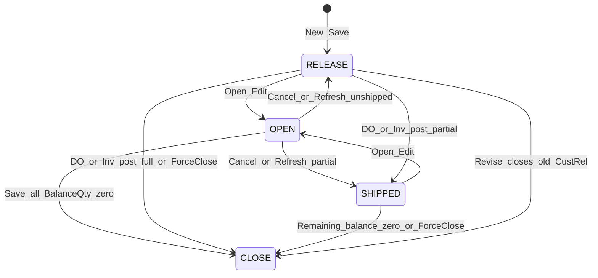
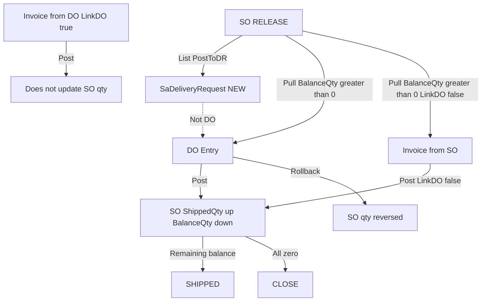

# Sales Order Behavioral Specification (source analysis)

**Artifact type:** this Cursor plan is **source analysis** of the current ASP.NET WebForms SO implementation. It is **not** permission to change SO/DO/Invoice code.

**Execution task (only):** generate [docs/SO-Business-Logic-Spec.md](docs/SO-Business-Logic-Spec.md) from this analysis. That markdown file is the published behavioral specification / compatibility contract.

Source of truth is the current **ASP.NET WebForms** standard forms and helpers (not company clones such as Phletora/MH, and not a Blazor rewrite). Concurrency notes describe WebForms session + callback + DB state; they also apply as a contract if SO is later ported to Blazor Server.

Staff-architect re-review: **APPROVED 9.6/10** after precision hardening. **Compatibility behavior and remediation behavior are separate change streams.** Do not fix P1-A through P1-E while publishing the baseline.

**Publication rules:** every matrix row gets Evidence = Proven | Inferred | Unknown. Do not convert Unknown or known gaps into assumed correct behavior. Do not silently fix gaps in the spec text.

**P1 findings (label exactly these IDs in the spec; they are not remediations):**
- **P1-A** Direct URL authorization bypass (entry login-only).
- **P1-B** Stale Edit can overwrite downstream shipment quantities **if** the update path permits stale application values to replace current database values; no explicit rowversion/token is present. Race is Proven; exact overwrite result is conditional/Unknown (DataAdapter conflict mode Unknown).
- **P1-C** SAVESO is a cooperative DB posting flag; request-thread wait + 3-min steal.
- **P1-D** Credit bypass: failed password can leave `getByPassValue=1` for the next Save.
- **P1-E** Qty_On_Ord warehouse mismatch. Save: Item A, line Warehouse W2, StdQty=10 → Qty_On_Ord +10 at W2. Close: Item A DefWarehouse W1 → Qty_On_Ord −10 at W1. Result: W2 remains +10; W1 is reduced (floor 0 if it would go negative). Final numbers depend on the existing IvBalance rows.

**Primary sources**
- List: [ERP/SalesForms/SOView.aspx.cs](ERP/SalesForms/SOView.aspx.cs), [ERP/SalesForms/SOView.aspx](ERP/SalesForms/SOView.aspx)
- Entry: [ERP/SalesForms/SalesOrderStd.aspx.cs](ERP/SalesForms/SalesOrderStd.aspx.cs), [ERP/SalesForms/SalesOrderStd.aspx](ERP/SalesForms/SalesOrderStd.aspx)
- List actions: [ERPCommonUI/SalesForms/HelperClass/SOHelper.cs](ERPCommonUI/SalesForms/HelperClass/SOHelper.cs)
- Status/delete: [ERPClasses/BL/SalesOrderBL.cs](ERPClasses/BL/SalesOrderBL.cs)
- DO effect: [ERPCommonUI/SalesForms/HelperClass/DOTrxHelper.cs](ERPCommonUI/SalesForms/HelperClass/DOTrxHelper.cs), [ERP/SalesForms/DOEntry.aspx.cs](ERP/SalesForms/DOEntry.aspx.cs)
- Invoice effect: [ERPCommonUI/SalesForms/HelperClass/InvTrxHelper.cs](ERPCommonUI/SalesForms/HelperClass/InvTrxHelper.cs), [ERP/SalesForms/InvoiceEntry.aspx.cs](ERP/SalesForms/InvoiceEntry.aspx.cs)

**Document key:** `SaSO` / `SaSODetail` are identified by `SONo` + `CustRel` (revision). DO/Invoice look up the latest `CustRel` via `SalesOrderBL.GetCurrCustRel`.

**Qty identity (all downstream docs use this):**
`BalanceQty = OrderQty + ReturnQty - ShippedQty` (entry add uses `OrderQty + AdjustQty - ShippedQty`).

---

## 1. Status machine

Two layers — do not collapse them in a future rewrite:

- **Business lifecycle:** RELEASE / SHIPPED / CLOSE
- **Edit overlay:** OPEN — a database-persisted edit-lock **marker** written when Edit opens. It is not a SQL row lock, distributed mutex, or optimistic-concurrency token.

OPEN is not a shipment or fulfillment state. Cancel / Refresh / Save restore a business lifecycle state. The state diagram may show RELEASE → OPEN → RELEASE; that is overlay enter/leave, not a fulfillment cycle.

| Status | Meaning | Who writes it |
|---|---|---|
| OPEN | Overlay edit lock (not fulfillment) | Entry `BindData` on Type=Edit calls `UpdateSOStatus(..., "OPEN")` immediately |
| RELEASE | Fully unshipped, not editing | Save `GetSOStatusEx`; list Refresh if still unshipped |
| SHIPPED | Any line partial or mixed shipped | DO post, Invoice post (`LinkDO=false`), Save, Refresh |
| CLOSE | No remaining balance, or force-close, or superseded revision | Close SO; DO/Invoice when all `BalanceQty=0`; Revise of old `CustRel` |

**Status derivation** (`SalesOrderBL.GetSOStatus` / `GetSOStatusEx`): per line `"1"` = `BalanceQty==OrderQty`, `"2"` = partial, `"0"` = `BalanceQty==0`. Any `"2"` or mix of `"1"`+`"0"` → SHIPPED; all `"1"` → RELEASE; all `"0"` → CLOSE; no lines → RELEASE.

**List gate (must match code, not intuition)**
- Edit blocked: CLOSE, CLOSED, OPEN. **SHIPPED is allowed.**
- Revise blocked: CLOSE, CLOSED, OPEN, **SHIPPED**.
- Close blocked: CLOSE, CLOSED, OPEN.
- Delete allowed: **RELEASE only**.

---

## 2. List operations ([SOView.aspx.cs](ERP/SalesForms/SOView.aspx.cs))

Screen ID `200.3.1`. Entry page `SalesOrderStd.aspx`. Grid `vgridSO`. If `AdPara.SelfViewEdit=True` and user is not in a default group, only own `UserID` rows.

There is **no SO rollback button**. `OnRollbackItem` is dead code (not in `CustomCallback`). Quantity comes back only when DO or Invoice is rolled back.

| Button | Right | Rule | Effect |
|---|---|---|---|
| NEW | New | — | `SalesOrderStd.aspx?ID=&Type=New&RevID=0` |
| EDIT | Edit | Not CLOSE/CLOSED/OPEN | Opens Edit; entry then sets OPEN in DB |
| VIEW | Access | — | Read-only popup |
| DELETE | Delete | All selected RELEASE; no `SaDeliveryRequest` for SO+CustRel | `SalesOrderBL.DeleteSO` deletes **header only** + audit. Does not delete `SaSODetail`. Does not reverse `Qty_On_Ord` |
| COPY | New | One row, no status check | `Type=Copy` |
| REVISE | Edit | One row; not CLOSE/CLOSED/OPEN/SHIPPED | `Type=Revise` |
| CLOSE | Post | Not CLOSE/CLOSED/OPEN; JS confirm | `SOHelper.CloseSO` |
| POST TO DR | Post | `PostToDR` must be false | `SOHelper.PosttoDR` — creates **Delivery Request**, not DO |
| REFRESH | Edit | — | Unlocks leftover OPEN only (`SOHelper.Refresh` loads `Status='OPEN'`) |
| PRINT | Print | One SO | Report from `AdReportID` / `SalesOrderView` |

**Refresh:** if any line `OrderQty > BalanceQty` → SHIPPED else RELEASE. Recovers abandoned Edit locks. List then always shows “Item(s) refreshed” even if helper failed (documented behavior).

---

## 3. Close SO and Post to DR ([SOHelper.cs](ERPCommonUI/SalesForms/HelperClass/SOHelper.cs))

**CloseSO**
1. Header `Status=CLOSE`, `Updated`, `UpdatedUID`.
2. Subtract each line **full `StdQty` / `WtQty`** from `IvBalance.Qty_On_Ord` on item **default warehouse** (floor 0). Not remaining balance.
3. If `PostToDR=true`, related DRs: IN PROCESS + `PrSchDR` → abort; CLOSED/CANCELLED skip; not NEW → abort; NEW → `Closed`.
4. Transaction: `SaSO` + `SaDeliveryRequest` + `IvBalance`.

**PosttoDR (one DR per SO line)**
- Load only unposted SO (`PostToDr=0 or null`).
- Line `DelDate` year must be >= 2020.
- Duplicate DR no. rejected by `checkAutoNumbering` against **that helper instance’s in-memory** `dtDR` only (same-worker / same request). Cross-worker duplicate detection: **Unknown**. DB unique constraint on `DeliveryNo`: **Unknown**. Do not assume global uniqueness.
- DR `OrderQty = Round(OrderQty * StdCustPSize, 4)`, `UOM=StdUOM`, `Status=NEW`, stores `SONo`, `CustRel`, `SOLine`, `BalanceQty=StdQty`, `ProjID` if column exists.
- Sets SO `PostToDR=true`. **Does not change SO Status.**
- Transaction: DR + numbering + track + SaSO.

`PosttoDR_BySOItem` exists (uses `BalanceQty`, does not set `PostToDR`) but is **not used by this list**.

---

## 4. Entry modes and UI lock ([SalesOrderStd.aspx.cs](ERP/SalesForms/SalesOrderStd.aspx.cs))

| Type | Behavior |
|---|---|
| New | Date=now, SONo=AUTO, Rel=1, Type=NORMAL, Status OPEN on UI only, empty lines |
| Edit | Load HDR+DTL; `SalesOrderBL.UpdateSOStatus(..., "OPEN")` via `ExecuteQuery` during `BindData` — **independent of the later Save `SqlTransaction`**. OPEN write timing is Proven. Whether `ExecuteQuery` auto-commits on its own connection is Inferred; ambient isolation is Unknown. If `ShippedQty<>0`, customer controls locked |
| View | All read-only; grid shows Shipped/Return/Balance |
| Revise | Display Rel = old+1; clone lines with new CustRel; successful save **closes previous CustRel** |
| Copy | AUTO, Rel 1, OPEN, PostToDR=false; copy lines with ShippedQty=0, ReturnQty=0, BalanceQty=OrderQty, QuoNo cleared |

Cancel (Edit only): restore status via `GetSOStatus`. Closing the browser without Cancel leaves OPEN until list Refresh.

AdPara/user flags: `UseItemMaster` (pricing; `"3"` = MOQ), `DiscountFromGross`, `SalesItemTaxInclusive`, `ShowMoreDicounts`, `CustPOControl`, `SalesTaxDec`, user `SellPriceView`, user `DeptCd`.

---

## 5. Line validation (add / edit / delete)

**Client (aspx):** order qty ≠ 0, std qty ≠ 0, Cust PO required, `vgAdd`/`vgSave`.

**CHECKITEM (`CheckCondition`)**
- Optional `SoCheckItemCodeAndDesc=TRUE`: ICode+IDesc must match `IvMas`.
- `existDO` = any `SaDODetail` for this SO+Rel **or** header Status=SHIPPED.
- Add into existing line + DO → **block insert**.
- Add into existing line, no DO → confirm insert (shift later lines via delete+reinsert; PK is SONo+Line+CustRel).
- Edit changing line no + DO → **block replace**.
- Edit changing line no, target exists, no DO → confirm switch.

**AddRow**
1. Item exists in `IvMas`.
2. Non-home currency: `SaCurrRate` for SO date required; convert price to home for min-price check.
3. Unit price cannot be below `IvMasPack.MinPrice` unless password bypass (`SalesCommonHelper.CheckByPass`).
4. Duplicate line unless insert/replace bypass.
5. Discountable and non-discountable items cannot mix on one SO (`IvMas.IsDiscountable=true` means **not** discountable).
6. `ShippedQty > OrderQty + AdjustQty` → reject; shipped lines have qty controls disabled.
7. Customer required.
8. No mix of tax inclusive and exclusive (`InvTrxHelper.CheckSameTaxType`).
9. Write qty/price/discount/tax; document `TableRounding`.
10. Store line `Warehouse` (used by Qty_On_Ord).

**Delete line:** blocked if `ShippedQty > 0`. Change customer: wipe all lines; disabled once anything is shipped.

**Pricing:** normal = customer/item UOM price. Mode 3 = highest MOQ ≤ order qty, else block Add. Item discount from `SalesDicountHelper.GetItemDiscount`. Customer group discount from `SaCustomerBL.GetCustDiscount`.

---

## 6. Save transaction

`Save` wraps `SaveSO` with `TrxPostingHelper` (`CheckAnyActiveTrx` then `SetTrxPosting("SAVESO","SAVESO", guid)`), always `UnSet` in `finally`. Proven wait is **20 x 3s = 60s** plus 200ms (comment in SO entry that says 90s is wrong). This is a **cooperative DB posting flag**, not a lock — see section 15.

1. At least one detail (`CheckRecordAlreadyAdd`).
2. Customer required.
3. Cust PO never empty.
4. If `CustPOControl`: same CustPO+CustCode cannot exist on another SO.
5. Recalc totals; credit/term `SalesCommonHelper.CheckTermControl` on net+tax unless bypass (message remaps “Invoice” → “Sales Order”).
6. Adaptive tax rounding; header Taxes/TotAmnt from details.
7. AUTO number `GenerateAutoNumberWithDateEx("SO", ...)`; duplicate SONo rejected; sequence for New or Edit/Copy while still AUTO.
8. Status overwritten by `GetSOStatusEx` from in-memory details.
9. `UpdateQtyOnOrder` then one SQL transaction: `SaSO` + `SaSODetail` + numbering + `IvBalance` + optional `SaQuaAttach_Std`.
10. Audit HDR/DTL. If Revise, `SalesOrderBL.CloseSO` on previous Rel.

**Qty_On_Ord:** `delta = new StdQty - original StdQty` (previous CustRel if Revise) applied to `IvBalance` for **line Warehouse** (fallback `IvMas.DefWarehouse`). Missing balance row is inserted. Deleted lines and revise-removed lines reverse their std qty. Close SO subtracts full original StdQty. List Delete does not reverse Qty_On_Ord.

Failed save rolls back the save transaction; the OPEN overlay from opening Edit **remains**. **P1-E** on Qty_On_Ord warehouse: Save uses line Warehouse; Close uses DefWarehouse.

---

## 7. Effect on DO and Invoice

**DO consume:** [DOEntry.aspx.cs](ERP/SalesForms/DOEntry.aspx.cs) `AddRowINVSODtl` loads `SaSODetail` with `BalanceQty>0`. Default DO qty = remaining balance. `checkqty` uses latest CustRel; DO qty cannot exceed remaining.

**DO Post** ([DOTrxHelper.cs](ERPCommonUI/SalesForms/HelperClass/DOTrxHelper.cs))
- `ShippedQty += DO.Qty`; `BalanceQty = OrderQty + ReturnQty - ShippedQty`; if BalanceQty &lt; 0 abort entire post.
- Sum remaining BalanceQty &gt; 0 → SHIPPED else CLOSE.
- Writes SaDO + SaSO + SaSODetail + inventory in one transaction.

**DO Rollback**
- `ShippedQty -= DO.Qty`; `BalanceQty += DO.Qty`.
- Then same `updateSOStatus`: remaining &gt; 0 → SHIPPED else **CLOSE**. It never writes RELEASE. Full rollback of a never-partial SO can leave header CLOSE while lines are fully restored.

**Invoice consume:** same `BalanceQty>0` pull. Discounts copied from SO line.

**Invoice Post**
- Updates SO qty **only if `LinkDO=false`** (direct from SO). Invoice-from-DO must not double-count.
- All BalanceQty=0 → CLOSE else SHIPPED.
- Then inventory + AR/GL; may set linked DO to POSTED.

**Invoice Rollback**
- Reverse qty only if `LinkDO=false`. Formula uses `BalanceQty = OrderQty - ReturnQty - UpdatedShippedQty` (ReturnQty sign differs from DO).
- `IsSOCanbeRollback` currently sets **SHIPPED in both branches** (CLOSE path is dead).

**SO vs existing DO:** if `SaDODetail` exists, entry cannot insert or swap line numbers. Unshipped lines can still be edited when list Edit is allowed (SHIPPED). Shipped lines cannot be deleted.

---

## 8. Validation catalog (must all remain true)

1. Composite key `SONo` + `CustRel`.
2. OPEN is a database-persisted edit-lock marker written when Edit opens. It is not a SQL row lock, distributed mutex, or optimistic-concurrency token. It is not written at Save.
3. Cust PO mandatory; optional unique per customer.
4. Credit/term on save; min price vs `IvMasPack.MinPrice`; both overridable by password.
5. No mixed tax inclusive/exclusive; no mixed discountable/non-discountable.
6. Cannot ship more than remaining; cannot delete shipped line; cannot change customer after any shipment.
7. Post to DR ≠ Post DO.
8. Invoice from DO (`LinkDO=true`) must not update SO qty again.
9. Close SO does not reverse DO/Invoice shipped qty; it does reduce Qty_On_Ord and may close NEW DRs; blocked if DR IN PROCESS.
10. List Delete does not delete details and does not reverse Qty_On_Ord.
11. SO list has no rollback.

---

## 9. Documented lifecycle gaps (spec notes, not fixes)

These are current-code facts to record in the spec so testers and future changes do not assume otherwise:

- List Delete: header only; Qty_On_Ord uncleared. Orphaned `SaSODetail` remains. DO/Invoice pull queries `SaSODetail` by SONo+CustRel and `BalanceQty>0` **without joining `SaSO`**. A deleted header must not be treated as a valid source unless downstream queries independently exclude orphans — **they currently do not**. Evidence: Proven (delete SQL + DOEntry consume SQL).
- DO rollback never restores RELEASE.
- Invoice rollback status helper always SHIPPED.
- List Refresh success message overwrites helper failure.
- `OnRollbackItem` in SOView is unused.

---

## 10. Glossary

- **SO identity:** `SONo` + `CustRel`. `CustRel` is the revision number, not a customer id.
- **OPEN overlay:** header `Status='OPEN'` written when Edit opens. Database-persisted edit-lock marker only. Not a SQL row lock, not a user mutex, not an optimistic-concurrency token.
- **DR:** `SaDeliveryRequest` created by list Post-to-DR. Not a Delivery Order.
- **DO:** `SaDO` / `SaDODetail`. Consumes remaining `BalanceQty`.
- **LinkDO:** invoice-line flag. `true` = line came from DO (do not update SO qty again). `false` = direct from SO.
- **Qty_On_Ord:** `IvBalance` commitment of SO std qty. Separate from `ShippedQty`/`BalanceQty`.
- **SAVESO posting flag:** cooperative database convention on a single `trxPosting` row (`active` / `starton` / `refno`). Not a SQL lock, not a distributed mutex, not SO-specific. In-process `lock()` objects do not span IIS workers; cross-process serialization depends only on that DB row.
- **Bypass password:** `SaCust.PWord` (SHA1), time-windowed by `SaCust.PWordTime` + `CreditLimitTimeOutMinute`. Not a user-role override.
- **SelfViewEdit:** `AdPara` flag; non-default-group users see only own `UserID` rows on the list.
- **Documented invariant:** business rule we record. **Code-enforced:** current code actually checks it. **Known gap:** documented but not (or only partially) enforced.

---

## 11. Business Invariants

Classify every rule. Do not treat a documented rule as currently true.

- **INV-Q1 `BalanceQty >= 0`.** Documented. Code-enforced at DO post and Invoice post (`LinkDO=false`) — abort if computed balance &lt; 0. Entry add rejects `ShippedQty > OrderQty + AdjustQty`. Known gap: Invoice rollback formula uses a different ReturnQty sign than DO rollback; list Delete/Close do not recompute balance.
- **INV-Q2 `ShippedQty <= OrderQty + ReturnQty`.** Documented equivalent of INV-Q1 at post. Code-enforced on DO/Invoice post. Known gap: not re-validated on SO Save of already-shipped lines except the add-line check.
- **INV-S1 Header status corresponds to detail balances.** Documented via `GetSOStatus`/`GetSOStatusEx`. Code-enforced on Save and Cancel. Known gaps: OPEN is an overlay marker, not a balance state; DO rollback writes SHIPPED or CLOSE never RELEASE; Invoice rollback always SHIPPED; Refresh only repairs OPEN.
- **INV-K1 `SONo` + `CustRel` uniqueness.** Documented. Assumed PK of `SaSO`/`SaSODetail` (code uses that composite everywhere). **Unknown** whether the physical unique index exists in every tenant DB — record as unknown unless a schema script is cited at write time.
- **INV-K2 Line uniqueness `SONo` + `CustRel` + `Line`.** Documented. Code-enforced on AddRow unless insert/replace bypass. Known gap: insert/replace is delete+reinsert because in-place Line update hits PK.
- **INV-O1 `Qty_On_Ord` reconciles with open SO std qty.** **P1-E.** Documented intent. Code-enforced as **delta vs previous saved StdQty** on Save, and **full StdQty subtract** on Close. Known gaps: list Delete does not reverse Qty_On_Ord; Close subtracts full original StdQty not remaining balance; **Save uses line Warehouse; Close uses item DefWarehouse**.

  Testable example (conditional on existing IvBalance): Save Item A, Warehouse W2, StdQty=10 → Qty_On_Ord +10 at W2. Close Item A DefWarehouse W1 → Qty_On_Ord −10 at W1 (floor 0). W2 can remain +10 while W1 is reduced. Final numeric value depends on the existing row. Evidence: Proven (code paths); persistent discrepancy rate Unknown.
- **INV-C1 One active revision for downstream docs.** Documented. DO `checkqty` uses `GetCurrCustRel` (max CustRel). Code does not stop DO from pointing at an old CustRel already stored on a DO line.
- **INV-D1 No over-consume of remaining balance by DO/Invoice.** Code-enforced at post. Consume filter is `BalanceQty>0` at entry pull time (stale if another doc posts between pull and post).
- **INV-T1 No mixed tax inclusive/exclusive on one SO.** Code-enforced on AddRow.
- **INV-T2 No mixed discountable / non-discountable on one SO.** Code-enforced on AddRow. Naming trap: `IvMas.IsDiscountable=true` means **not** discountable.
- **INV-P1 Cust PO required.** Code-enforced on Save and client add. Optional uniqueness (`CustPOControl`) is code-enforced when AdPara flag is on.
- **INV-P2 Unit price >= MinPrice unless bypass.** Code-enforced on AddRow vs `IvMasPack.MinPrice` in home currency.
- **INV-P3 Credit/term must pass unless bypass.** Code-enforced on Save via `CheckTermControl` unless `getByPass=true`.

---

## 12. UI vs server validation

Record each check once as UI-only, server-only, or both. UI-only is not a security control.

- Order qty / std qty != 0 — **UI only** (`SalesOrderStd.aspx` OnAddItemClick). Server AddRow does not re-check zero qty.
- Cust PO empty — **both** (add UI + Save server).
- Cust PO uniqueness — **server** (add callback + Save), gated by `CustPOControl`.
- `vgAdd` / `vgSave` DevExpress group — **UI only**.
- Item exists in IvMas — **server**.
- Min price / currency rate — **server**.
- Duplicate line / DO line insert-replace — **server**.
- Mixed tax / mixed discountability — **server**.
- Shipped qty vs order qty — **server**; qty controls disabled **UI+server** when ShippedQty &gt; 0.
- Credit/term — **server** on Save.
- List status gates (CLOSE/OPEN/SHIPPED) — **server** in SOView callbacks. Direct entry URL **does not** repeat them (section 13).
- List rights (`enGroupRight`) — **server** on SOView. Entry page **does not** call `IsValidAccessRight`.
- Dirty-add flag (`dirtyflagAdd`) — **UI only** (reduces double add-click). Save has no equivalent debounce.

---

## 13. Authentication, authorization, and object-level access

Keep these three controls separate in the spec. Do not collapse them into one “security” paragraph.

- **Authentication:** entry and list redirect if `IsLogin != true`. Proven.
- **Authorization (screen/function):** list callbacks call `IsValidAccessRight` / `enGroupRight` on screen `200.3.1`. Entry (`SalesOrderStd`) does **not**. Proven.
- **Object-level authorization / IDOR:** list status gates and SelfViewEdit are not repeated on the entry URL. A logged-in user who can guess or obtain `SONo`+`CustRel` can load that object. Proven. **P1-A.**

List screen ID `200.3.1`. Rights via `CUser.CheckUserRight2` on `enGroupRight` after `OpenAccessRight`. Entry (`SalesOrderStd`) only checks login (`IsLogin`); **no screen-right check, no status re-gate, no SelfViewEdit filter.**

**Authorization matrix (current code).** Evidence = Proven unless noted.

- **NEW** — UI button. Server `enGroupRight.New`. Entry Type=New via URL has no New right check.
- **EDIT** — UI row button. Server Edit + status not CLOSE/CLOSED/OPEN. Direct `SalesOrderStd.aspx?Type=Edit&ID=...&RevID=...` bypasses list status and Edit right; still sets OPEN in DB if the row loads. **P1-A.**
- **VIEW** — UI. Server Access. Direct Type=View bypasses Access; ViewMode is UI-only if the page loads. **P1-A.**
- **DELETE** — UI confirm. Server Delete + RELEASE + no DR. No entry-page equivalent.
- **COPY** — UI one-row. Server New. Direct Type=Copy bypasses New right. **P1-A.**
- **REVISE** — UI one-row. Server Edit + not CLOSE/CLOSED/OPEN/SHIPPED. Direct Type=Revise bypasses that; save still closes previous CustRel. **P1-A.**
- **CLOSE** — UI confirm. Server Post + not CLOSE/CLOSED/OPEN. Uses `enGroupRight.Post`, **not** `Closed`.
- **POST TO DR** — UI. Server Post + PostToDR false. Uses Post, not a DR-specific right.
- **REFRESH** — UI. Server Edit (not `enGroupRight.Refresh`). Recovers any OPEN row the user can see; SelfViewEdit may hide others.
- **PRINT** — UI one-row. Server Print.

**SelfViewEdit** is a list query filter only. Direct URL to another user’s SO is not blocked on entry. **P1-A.**

**Password bypass** ([SalesCommonHelper.CheckByPass](ERPCommonUI/SalesForms/HelperClass/SalesCommonHelper.cs), [SaCustomerBL.GetPassword](ERPClasses/BL/SaCustomerBL.cs))

- Who: anyone who knows `SaCust.PWord` for that customer. Not a user-group / supervisor right. Proven.
- Hash: SHA1 via `FormsAuthentication.HashPasswordForStoringInConfigFile`. **Legacy cryptographic weakness — finding only, not a remediation in this work.** Proven.
- Window: `CheckIsPasswordOver` — empty `PWordTime` or now > `PWordTime + CreditLimitTimeOutMinute` (web.config) fails. Proven.
- Min-price bypass: `panelProd` `BYPASS:` sets `hdUnitPriceOverride='True'` **only if password succeeds**. Scoped to subsequent AddRow until reset. Not audited in CheckByPass. Proven.
- Credit bypass **P1-D:** grid `BYPASS:` on success immediately `Save(true)` skipping `CheckTermControl`. Client `onByPassOKCLClick` sets `getByPassValue=1` **before** the callback returns. If password fails, Save is not called from BYPASS, but the next manual Save still sends `getByPassValue=1` and **skips credit/term**. Flag resets to 0 only after successful save (`cpSaved`). Replay within the page session is therefore possible. Not audited. Proven from [SalesOrderStd.aspx](ERP/SalesForms/SalesOrderStd.aspx) lines around `onByPassOKCLClick` and Save `getByPassValue`.

**Direct URL / object-level access (P1-A, Proven)**

A logged-in user can open `SalesOrderStd.aspx?ID={SONo}&Type=Edit|View|Revise|Copy&RevID={n}` and load any SO the query can read. List rights, status gates, and SelfViewEdit do not apply. Edit still writes OPEN. This is a known gap, not a planned fix in this documentation work.

SQL in `OpenDatatable` concatenates `strID`/`strRevNo` after a quote-replace; still string-built SQL. **Known SQL injection surface / unsafe dynamic SQL construction; exploitability not assessed in this documentation task.** Evidence: Proven (construction); exploitability Unknown.

---

## 14. Concurrency and failure matrix

Proven from [TrxPostingHelper.cs](ERPClasses/Utility/TrxPostingHelper.cs) and SO entry. Do not invent row-level locking. Every row: Evidence = Proven | Inferred | Unknown.

**Row contract (required in the published spec):** each race states TX-A boundary, TX-B boundary, shared tables, possible last writer, and conflict type = logical | physical DB locking | stale application state.

- **Two users Edit same SO.** TX-A: `UpdateSOStatus` ExecuteQuery (OPEN), independent of Save. TX-B: same. Shared: `SaSO.Status`. Second list Edit blocked; direct URL Edit writes OPEN again. Save TX: `SaSO`+`SaSODetail`+`IvBalance` (+ numbering). Last Save **may** win if the DataAdapter update does not enforce original-value concurrency; exact conflict behavior is **Unknown**. No rowversion. Conflict type: stale application state + possible physical update. Evidence: Proven (list gate + URL + independent OPEN update); adapter conflict mode Unknown.
- **Edit then browser crash.** OPEN remains (already committed via ExecuteQuery). List Refresh restores RELEASE or SHIPPED from balances. Evidence: Proven.
- **Edit vs DO Post. P1-B.** TX-A Save: `SaSO`/`SaSODetail`/`IvBalance` (+ numbering). TX-B DO Post: `SaDO`/`SaSO`/`SaSODetail`/inventory (`CPosting`). Shared: `SaSO`, `SaSODetail`, `IvBalance`. OPEN is not checked by DO post. Editor holds session copy while DO updates shipped qty. Stale Edit **can overwrite** downstream shipment quantities **if** the update path permits stale application values to replace current database values; no explicit rowversion/token. Race Proven; exact overwrite result conditional/Unknown. Conflict type: stale application state. Physical lock order Unknown.
- **Edit vs Invoice Post. P1-B.** Same as DO for `LinkDO=false` (shared `SaSO`/`SaSODetail`). Invoice-from-DO does not update SO qty but may set CLOSE/SHIPPED. Evidence: Proven for LinkDO split; race outcome Unknown.
- **Close vs DO Post.** TX-A CloseSO: `SaSO`+`SaDeliveryRequest`+`IvBalance` (no posting flag). TX-B DO Post: `SaDO`+`SaSO`+`SaSODetail`+inventory. Shared: `SaSO`, `IvBalance`. Neither checks the other in-flight. Last SaSO status writer Unknown. Qty_On_Ord (Close, DefWarehouse) vs shipped qty (DO) are independent fields. Conflict type: logical + stale/independent TX. Evidence: Inferred from absence of cross-checks.
- **Close vs Invoice Post.** Same pattern as Close vs DO for `LinkDO=false`. Evidence: Inferred; outcome Unknown.
- **Close vs PostToDR.** TX-A CloseSO: `SaSO`+DR+`IvBalance`. TX-B PosttoDR: DR+numbering+track+`SaSO` (no posting flag). Shared: `SaSO`, `SaDeliveryRequest`. Interleaving can leave DRs on a CLOSED SO or Close aborting on IN PROCESS. Evidence: Inferred; exact interleaving Unknown.
- **Two PostToDR.** TX: each helper’s in-memory `dtDR` then one SQL TX of DR+numbering+track+SaSO. `checkAutoNumbering` is **same-instance in-memory only**. Cross-worker duplicate: Unknown. DB unique on DeliveryNo: Unknown. Conflict type: logical (flag) + possible physical insert. Evidence: Proven structure; parallel IIS outcome Unknown.
- **Two Revise.** TX: two Saves inserting `SONo`+new `CustRel`. Shared PK. Evidence: Inferred PK collision; exact error Unknown.
- **Revise vs downstream DO/Invoice post.** TX-A Revise Save: insert new CustRel `SaSO`/`SaSODetail`/`IvBalance`, then `CloseSO` on old Rel. TX-B DO/Inv Post: updates old Rel `SaSODetail` shipped qty + header status. Shared: old Rel `SaSO`/`SaSODetail`/`IvBalance`. Revise does not write OPEN on old Rel. Related to **P1-B**. Conflict type: stale application state (cloned lines) + independent TX. Evidence: Inferred; exact shipped-qty / GetCurrCustRel / Qty_On_Ord outcome **Unknown**.
- **Save timeout / deadlock.** Save `sqlTrans.Rollback()`. Posting flag unset in `finally`. OPEN overlay remains (already committed). No retry. Evidence: Proven.
- **Double-click Save.** No server debounce. Cooperative flag wait then Set. Duplicate AUTO SONo rejected vs existing SaSO. Evidence: Proven wait/flag; duplicate sequence increment Unknown.
- **Server restart during Edit.** Session lost. OPEN already committed. Evidence: Proven.

**Posting flag vs other modules. P1-C.** `CheckAnyActiveTrx` waits on `trxPostings.FirstOrDefault().active` regardless of `trxtype`. SO save waits behind Invoice post, DO post, PO save, etc. This is a cooperative application convention, not a distributed lock.

**Stale-flag steal. P1-C.** If `starton` is older than **3 minutes**, CheckAnyActiveTrx overwrites timestamps and **returns without waiting**, even if the previous worker is still running. Parallel commits possible after 3 minutes. Evidence: Proven.

This is WebForms, not Blazor circuits. If SO is rewritten in Blazor Server, circuit dispose vs OPEN overlay is a new unknown; the DB OPEN behavior above still applies.

---

## 15. Performance and contention (proven vs unknown)

**SAVESO cooperative DB posting flag (P1-C, Proven)**

Do not call this a distributed lock or a global mutex in the published spec. It is a **cooperative database posting flag**: one `trxPosting` row, `active`/`starton`/`refno`, plus in-process `Thread.Sleep` polling.

- Not SO-specific, not user-specific, not company-specific.
- Unrelated SO saves **do** wait on each other. SO save **does** wait on INV/DO/PO posting that uses the same helper.
- Wait: loop 20 times x `Thread.Sleep(3000)` = **60 seconds**, then 200ms. SO comment “max 90s” is incorrect.
- Three CLR locks (`obj`, `obj2`, `obj3`) for Check / Set / UnSet — they do **not** share one mutex. Check vs Set can interleave. These CLR locks are **per AppDomain only**.
- Cross-IIS-worker / multi-server: in-process locks do not apply. Serialization depends only on the DB row, and CheckAnyActiveTrx’s `lock(obj)` does not span servers. Not a robust distributed lock.
- After wait, SetTrxPosting always sets `active=true` on that single row (no “still busy” re-check).
- UnSet matches `refno == guid`. If steal/overwrite changed refno, UnSet of the original guid is a no-op and the row can remain active until 3-min steal.

**IvBalance (proven from code, not measured)**
- Save loops every SO line, `Select` on in-memory `IvBalance`, then one `da.Update` of the whole table in the same transaction as SaSO/SaSODetail.
- Close SO uses **DefWarehouse**; Save uses **line Warehouse**. Same item can hit different rows.
- DO/Invoice post also update `IvBalance` via `CPosting` in their own transactions. **Unknown:** SQL isolation level, lock order vs SO Save, deadlock frequency. Do not invent.

**Large SO (proven structure, unknown timings)**
- Qty_On_Ord is per-line in-memory then one adapter update.
- PosttoDR creates **one DR row per SO line**, each with numbering + TrackNumber, then one transaction.
- **Unknown:** duration vs line count; no paging; full `Select * from SaSO` / `IvBalance` / `SaDeliveryRequest` in CloseSO/PosttoDR helpers (Close loads entire SaSO and IvBalance).

**Indexes (unknown unless schema cited at write time)**

Do not assume they exist. Verify in this priority order (highest first):

1. `SaSO(SONo, CustRel)`
2. `SaSODetail(SONo, CustRel, Line)`
3. `IvBalance(ICode, Warehouse)`
4. `SaDeliveryRequest(DeliveryNo)`
5. `SaSO(CustPO, CustCode)` (CustPOControl uniqueness query)

Then: `SaDODetail(SONo, CustRel, SOLine)`, `SaInvoiceDetail(SONo, CustRel, SOLine, LinkDO)`, `trxPosting`. Mark each Found / Not found / Unknown in the spec.

**Failure under load (proven / unknown)**
- SQL exception → rollback save, no retry.
- Deadlock → same, unknown victim frequency.
- Lock timeout → unknown (`CommandTimeout` not set in these helpers).
- Thread.Sleep wait holds an ASP.NET request thread for up to 60s — proven; IIS thread-pool impact **unknown**.

---

## 16. Regression test matrix

Do **not** label a whole row Proven because most of it is Proven. Each published row must split:

- **Deterministic** — current-code outcome that is Proven
- **Known gap** — Proven defective/surprising outcome (must not be “fixed” in the spec)
- **Environment-dependent / Unknown** — isolation, DataAdapter, CPosting Qty_On_Ord, indexes, last-writer

Examples (all rows in the spec file follow this shape):

- **New + Save** — Deterministic: Status RELEASE; BalanceQty=OrderQty; Qty_On_Ord += StdQty on line warehouse; no DR. Unknown: physical index used.
- **Edit + Save** — Deterministic: Save TX writes SaSO/SaSODetail/IvBalance; status from GetSOStatusEx. Known gap: none unless concurrent post. Unknown: whether stale session overwrites concurrent DO qty (P1-B, DataAdapter).
- **Edit + Cancel** — Deterministic: GetSOStatus restore; Qty_On_Ord unchanged. OPEN overlay cleared only by that update.
- **Browser abandon + Refresh** — Deterministic: OPEN already committed. Known gap: UI always shows success after Refresh. Unknown: helper failure path vs overwritten cpMsg.
- **Partial / full DO post** — Deterministic: ShippedQty/BalanceQty/status SHIPPED or CLOSE. Unknown: CPosting effect on Qty_On_Ord.
- **DO rollback** — Deterministic: qty reversed. Known gap: status SHIPPED or CLOSE, never RELEASE.
- **Invoice from SO / rollback** — Deterministic: LinkDO=false updates SO qty. Known gap: rollback status always SHIPPED.
- **Invoice from DO** — Deterministic: LinkDO=true does not update SO qty. Unknown: concurrent Close last-writer on status.
- **Revise + Save** — Deterministic: new Rel inserted; old Rel CloseSO. Unknown: Revise vs in-flight DO (P1-B family).
- **Close** — Deterministic: Status CLOSE; Qty_On_Ord − full StdQty on **DefWarehouse** (P1-E). Known gap: warehouse may differ from Save. Unknown: existing IvBalance numeric result (floor 0).
- **Post-to-DR** — Deterministic: one DR per line in this request; PostToDR=true; SO status unchanged. Known gap: uniqueness is in-memory same-instance only. Unknown: cross-worker / DB unique.
- **Delete** — Deterministic: header deleted. Known gap: details and Qty_On_Ord remain; DO/Invoice consume SQL does not join SaSO so orphans remain selectable. Proven.
- **Mixed tax / discountability** — Deterministic: reject add.
- **Min-price bypass** — Deterministic: add after successful password; no CheckByPass audit.
- **Credit bypass (P1-D)** — Deterministic: Save(true) skips term. Known gap: failed password still sets client getByPassValue=1 for next Save.

Also test: SHIPPED editable from list; SHIPPED not revisable; OPEN not editable from list; shipped line cannot be deleted; customer locked after shipment; line insert blocked if DO exists.

---

## 17. Known unknowns

Do not fill these with guesses in the spec; list them as Unknown.

- Physical unique/PK indexes on SaSO, SaSODetail, IvBalance, SaDeliveryRequest in all tenant databases.
- SqlDataAdapter conflict mode (overwrite vs throw) on concurrent SaSODetail updates.
- Isolation level of `CSys.OpenCon` / adapter updates.
- Whether Qty_On_Ord is reduced when DO/Invoice posts (code path reviewed does not; CPosting internals not fully traced for Qty_On_Ord).
- Deadlock rate between SO Save and DO/Inv post on IvBalance.
- Whether `SaCust.PWord` is intended as customer-portal password vs supervisor override (code uses it as both min-price and credit bypass).
- Menu/screen right for `SalesOrderStd.aspx` itself (entry has no this.ID rights check).
- Whether `ExecuteQuery` for OPEN (`UpdateSOStatus`) always auto-commits on its own connection (Inferred typical ADO; ambient transaction Unknown).
- DataAdapter original-value / conflict mode (second Save may overwrite **or** fail).
- Cross-worker DR uniqueness and DB unique constraint on `DeliveryNo`.
- Behavior if two IIS workers each have their own `TrxPostingHelper` static locks but share `trxPosting` DB row (static lock is per AppDomain; DB flag is cross-process). Cross-process serialization **depends only on the DB row**. This is **not** a distributed mutex.

---

## 18. Migration non-goals

This publication must **not**:

- Repair P1-A through P1-E
- Redesign status or convert OPEN into a framework lock
- Replace SAVESO with distributed locking
- Normalize rollback to RELEASE
- Infer missing indexes
- Silently change validation timing
- Treat orphaned `SaSODetail` after header delete as already excluded downstream
- Modify any SO/DO/Invoice source code

---

## 19. Deliverable (publication only)

Generate [docs/SO-Business-Logic-Spec.md](docs/SO-Business-Logic-Spec.md) from this **source-analysis plan**. The markdown file is the frozen behavioral specification. This plan is not an implementation plan for product code.

Include sections 1–18, P1-A–E with the strengthened P1-B/P1-E wording, two-layer status, concurrency TX boundaries, granular regression Evidence, and non-goals.

Hard rules:
- Preserve findings exactly. Do not convert known gaps or Unknowns into assumed correct behavior.
- Last Save **may** win; never unconditional “last Save wins.”
- OPEN write is a separate `ExecuteQuery`; Save TX is separate. Isolation of ExecuteQuery: Unknown.
- DR duplicate check is in-memory same-instance only.
- Compatibility and P1 remediation are **separate change streams**.

After this spec is written, freeze the baseline. No further broad rewrite.