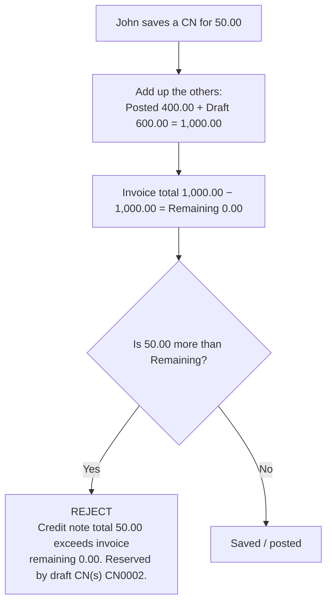

# Credit Note Reservations — purpose, behaviour and worked examples

> **Audience:** support staff, finance, and developers.
> **Companion documents:** [sales_trans_enhancement_plan.md](sales_trans_enhancement_plan.md) — R9 (draft reservations) and E7 (report-only screen) · [sales_trans_logic.md](sales_trans_logic.md) §11.1 · [cdn-logic.md](cdn-logic.md) — legacy CN specification.
> **Route:** `/sales/cn-reservations` · **Menu code:** `SA_CN_RESERVATIONS` (Sales → Transactions → **CN Reservations**)

---

## Table of contents

1. [The short answer](#1-the-short-answer)
2. [The mental model — "reserved" is arithmetic, not a lock](#2-the-mental-model--reserved-is-arithmetic-not-a-lock)
3. [The business problem it solves](#3-the-business-problem-it-solves)
4. [Worked example — one invoice, four moments](#4-worked-example--one-invoice-four-moments)
5. [Getting blocked — and how the screen explains it](#5-getting-blocked--and-how-the-screen-explains-it)
6. [The over-reserved warning](#6-the-over-reserved-warning)
7. [Screen reference](#7-screen-reference)
8. [Where the numbers come from](#8-where-the-numbers-come-from)
9. [What "reserved" is NOT](#9-what-reserved-is-not)
10. [Relationship to the R9 indicator and `CDN_REMAINING`](#10-relationship-to-the-r9-indicator-and-cdn_remaining)
11. [What the screen deliberately does not do](#11-what-the-screen-deliberately-does-not-do)
12. [Troubleshooting playbook](#12-troubleshooting-playbook)
13. [Deployment and access](#13-deployment-and-access)
14. [Source map and tests](#14-source-map-and-tests)

---

## 1. The short answer

The screen is a **read-only diagnostic** that answers one question:

> **Which posted invoices already have their remaining balance held by credit notes — and which of those holdings are still unposted drafts?**

It exists because **a draft credit note silently reserves part of an invoice's balance**, and before this screen there was no way to see that across the system.

There are two complementary surfaces, both part of the same feature:

| | **R9 indicator** (on the Credit Note entry screen) | **E7 report** (this screen) |
|---|---|---|
| Scope | **One** invoice, while editing a CN | **All** invoices for the company + branch |
| Presentation | `Reserved by draft CN(s) … Remaining …` beside the Invoice field | One table row per held invoice |
| Answers | *"Why can't I save this credit note?"* | *"What is held across the system right now?"* |
| Mutates anything? | No | **No** |

---

## 2. The mental model — "reserved" is arithmetic, not a lock

This is the single idea that makes everything else obvious:

> **"Reserved" is not a lock. It is just arithmetic.**

The system never places a physical hold on an invoice, and there is no reservation table. Every time anyone **saves or posts** a credit note, it simply adds up **all other credit notes** against that invoice — **posted ones and unsaved drafts alike** — and compares the total against the invoice amount.

That one fact explains every surprising behaviour:

| Behaviour | Why |
|---|---|
| A draft "holds" money without anyone doing anything | Because the draft is included in the sum |
| Deleting that draft instantly frees the money | The next sum simply no longer includes it — **there is nothing to clean up** |
| An abandoned draft blocks other users indefinitely | Nothing expires and nothing times out; it is counted until deleted or posted |
| Posting a draft changes nothing about the arithmetic | Posted and draft amounts are both counted before *and* after |

**Consequence:** reservations are **self-healing**. There is no release step, no background job, and no cleanup routine. Drop the draft and the balance returns.

---

## 3. The business problem it solves

Credit notes are validated against an invoice's remaining balance by `SaCdnCalc.EvaluateRemaining`, which is a **blind sum** — it does not care whether the other credit notes have been posted or are still sitting in someone's unsaved draft:

```
Invoice total        100.00
Posted CN            -40.00
NEW draft CN         -30.00   ← holds balance even though nobody has posted it
─────────────────────────────
Remaining             30.00
```

So if user A saves a draft for the full amount, user B gets a rejection naming the blocking draft — but that error is **per-invoice** and only appears when you happen to hit it.

Even with that error, there was no way to answer the operational questions:

- How many invoices are currently held, and by how much?
- Which drafts are abandoned (user left, forgot to delete, can never be posted)?
- Is anything **over-reserved**, which should be impossible?

**That cross-invoice view is the entire purpose of this screen.** It is the report-only half of decision **D6** — *"E7 is report-only, no auto-cancel."*

---

## 4. Worked example — one invoice, four moments

**Setup:** invoice `INV2609-0001` for **Ali Trading**, total **1,000.00**. Watch the CN Reservations grid as events occur.

### Moment 1 — nothing exists yet

Sarah has not created any credit note.

| Invoice | Posted CN | Draft CN | Remaining | Reservation |
|---|---|---|---|---|
| *(not listed)* | | | | |

👉 The invoice **does not appear at all**. The screen only lists invoices that have **at least one** credit note (draft or posted).

### Moment 2 — Sarah saves a draft (she does *not* post it)

She creates `CN0001` for **400.00** and clicks Save.

| Invoice | Posted CN | Draft CN | Remaining | Reservation |
|---|---|---|---|---|
| INV2609-0001 | 0.00 | **400.00** | **600.00** | Reserved by draft CN(s) **CN0001**. |

👉 **This is the whole point of the screen.** 400.00 is not posted, is not final, and may never be posted — yet **600.00 is all that is left** for everyone else. That fact is visible nowhere else.

### Moment 3 — Sarah posts `CN0001`

| Invoice | Posted CN | Draft CN | Remaining | Reservation |
|---|---|---|---|---|
| INV2609-0001 | **400.00** | 0.00 | 600.00 | *(blank)* |

👉 Still listed (it has a posted credit note), but **no draft is holding anything**. Tick **Drafts only** and this row disappears — exactly what you want when hunting for risky rows.

### Moment 4 — Sarah starts a second draft

She creates `CN0002` for **600.00** and saves it.

| Invoice | Posted CN | Draft CN | Remaining | Reservation |
|---|---|---|---|---|
| INV2609-0001 | 400.00 | **600.00** | **0.00** | Reserved by draft CN(s) **CN0002**. |

`400 + 600 = 1,000` = the invoice total. The invoice is **completely used up** — even though 600 of it belongs to a draft.

---

## 5. Getting blocked — and how the screen explains it

John now tries to raise a credit note for **50.00** against the same invoice.



**Full R9 message text:**

```
Credit note total 50.00 exceeds invoice remaining 0.00. Reserved by draft CN(s) CN0002.
```

John's problem: **he does not know who or what `CN0002` is.** It is a draft, so it does not appear in any list of credit notes he would normally look at.

He opens **Sales → Transactions → CN Reservations** and filters:

- Customer code: Ali's code
- ✅ **Drafts only**

…and sees the Moment 4 row. Now he knows: *"`CN0002` is holding 600.00."*

That draft is then either posted, or deleted. Either way the balance frees up:

| Invoice | Posted CN | Draft CN | Remaining | Reservation |
|---|---|---|---|---|
| INV2609-0001 | 400.00 | 0.00 | **600.00** | *(blank)* |

👉 John's 50.00 now fits easily. **No cleanup, no release step, no lock to clear** — the arithmetic simply no longer includes the deleted draft.

---

## 6. The over-reserved warning

This state **should be impossible**, because the check in §5 blocks it. Suppose the data nevertheless says:

| Invoice | Posted CN | Draft CN | Remaining | Reservation |
|---|---|---|---|---|
| INV2609-0009 (1,000.00) | 600.00 | 450.00 | **−50.00** | Reserved by draft CN(s) CN0011. |

`600 + 450 = 1,050` against a 1,000.00 invoice — **more credit than the invoice is worth**.

The screen:

- marks the row **over-reserved**,
- shows **Remaining = −50.00**,
- **sorts it to the top** of the grid,
- raises the **"N over-reserved"** warning chip in the header.

**How to read it:** this is a genuine anomaly worth investigating. It normally means the data was written **before the R6 rounding fix** — where the save and post paths disagreed about decimal places (`decPoint`), so a credit note could slip past one check but not the other — or it indicates a rounding edge.

> The screen **does not fix** this. It only tells you where to look. Correcting it is a finance/data decision.

---

## 7. Screen reference

### Header

| Element | Meaning |
|---|---|
| **Report only** chip | Reminder that the screen cannot change anything |
| Count chip | Number of held invoices returned |
| **N over-reserved** chip | Only shown when at least one row is over-reserved |

### Filters

| Control | Behaviour |
|---|---|
| **Customer code** | Free text, **debounced 300 ms** so a keystroke does not fire a query per character |
| **Drafts only** | Show only invoices where at least one **NEW** credit note holds balance. **The main operational filter** — hides legitimate posted credits and surfaces abandoned drafts |
| **Over-reserved only** | Show only rows where `Posted CN + Draft CN > Invoice total`. **The anomaly filter** |
| **REFRESH** | Re-runs the query |

### Columns

| Column | Meaning |
|---|---|
| **Invoice** / **Date** | The posted invoice being held |
| **Customer** / **Name** | `CustCode` and `CustName` from the invoice |
| **Invoice total** | `SaInvoice.TotAmnt` — the ceiling credit notes cannot exceed |
| **Posted CN** | Σ `TotAmnt` of **POSTED** credit notes against this invoice — real, committed credit |
| **Draft CN** | Σ `TotAmnt` of **NEW** credit notes against this invoice — **invisible reservations** |
| **Remaining** | `Invoice total − Posted CN − Draft CN`. **Can be negative** (see §6) |
| **Reservation** | `Reserved by draft CN(s) CN0001, CN0002.` — the actual draft numbers |

Rows are sorted **over-reserved first**, then by invoice number ascending, so problems surface at the top.

---

## 8. Where the numbers come from

`ISaCdnService.GetReservationReportAsync(SaCdnReservationReportQuery)` — read-only, no locking, no writes.

### Included

- **Credit notes only** (`Type = CN`). Debit notes do not consume invoice balance.
- The credit note must have a **non-empty `InvNo`**.
- Credit note status **`NEW` or `POSTED`** — both count, which is the entire point.
- The referenced invoice must exist and be **`POSTED`**.

### Excluded (silently)

| Excluded | Why |
|---|---|
| Debit notes | They do not consume an invoice's balance |
| Credit notes with a blank `InvNo` | Standalone credits — no invoice to hold |
| Credit notes whose invoice is missing or **not POSTED** (e.g. rolled back after the CN was created) | The posted-invoice filter drops them |
| Rows beyond `Take` — default **200**, hard cap **500** | Truncation is visible as a `TotalCount` vs row-count mismatch |

### Formulas

```
ReservedTotal = PostedCnTotal + DraftCnTotal
Remaining     = InvoiceTotal − PostedCnTotal − DraftCnTotal
OverReserved  = ReservedTotal > InvoiceTotal
```

### Per-invoice indicator (R9)

`ISaCdnService.GetInvoiceReservationsAsync(invNo, excludeDocNo?)` returns `SaCdnInvoiceReservationSummary`:

| Field | Meaning |
|---|---|
| `InvoiceTotal` | Invoice `TotAmnt` |
| `PostedCnTotal` | Σ POSTED CN amounts |
| `DraftCnTotal` | Σ NEW CN amounts |
| `Remaining` | `InvoiceTotal − PostedCnTotal − DraftCnTotal` |
| `DraftCnNos` | The NEW credit note numbers |
| `DraftIndicator` | `Reserved by draft CN(s) …` — **empty string** when no draft holds balance |

`excludeDocNo` lets the entry screen exclude the document currently being edited, so it does not report itself as a reservation.

---

## 9. What "reserved" is NOT

| It is NOT… | Because… |
|---|---|
| A database lock | Nothing is locked. The screen uses `AsNoTracking()` and takes no row locks, so it can never block a save or cause a deadlock |
| A permanent hold | Delete or post the draft and the hold is gone immediately |
| Reserved only by **posted** credit notes | **Drafts count too** — that is the whole reason the screen exists |
| Something you must "release" | There is no release step. It is recalculated on every save and post |
| A Debit Note concept | **CN only.** Debit notes do not consume an invoice's balance |
| A stored reservation table | There is no reservation table. It is derived live every time |

---

## 10. Relationship to the R9 indicator and `CDN_REMAINING`

Three surfaces, one rule. They deliberately share a single formatter (`SaCdnCalc.FormatDraftReservation`) so the wording can never drift apart.

| Surface | Trigger | Text |
|---|---|---|
| **`CDN_REMAINING`** validation | Save / update / post of a CN that would exceed the remaining balance | `Credit note total X exceeds invoice remaining Y. Reserved by draft CN(s) CN0001, CN0002.` |
| **R9 indicator** | Opening/editing a CN with an `InvNo` | `Reserved by draft CN(s) CN0001. Remaining 600.00.` |
| **E7 report** | Opening this screen | Row in the grid |

**The authoritative gate is always `CDN_REMAINING`.** The indicator and the report are explanations, not enforcement. This matters: the indicator is *advisory* and refreshed on a best-effort basis, so never treat it as the source of truth for whether a save will succeed.

---

## 11. What the screen deliberately does not do

| Not done | Rationale |
|---|---|
| ❌ Auto-cancel / expire stale drafts | Decision **D6** — report only, no automatic mutation |
| ❌ Bulk delete or post | Same |
| ❌ Row locking | A diagnostic must never block transactional work |
| ❌ Export button | It uses a plain `DxGrid`, not the full `CommonDataGridEx` used by list pages |
| ❌ Paging UI | Filter instead; `TotalCount` tells you if you are seeing a truncated view |

---

## 12. Troubleshooting playbook

### "I can't raise a credit note — it says the balance is gone"

1. Read the CN number in the error: `Reserved by draft CN(s) CN0007.`
2. Open **CN Reservations**, set **Drafts only**, filter by the customer.
3. Find the row naming `CN0007` and note the amount in **Draft CN**.
4. Either **post** `CN0007` (if it is legitimate) or **delete** it (only `NEW` credit notes can be deleted).
5. Retry the original credit note.

### "A credit note is stuck and won't post"

A `NEW` credit note can be permanently unpostable if it was created before the **R6** fix — the save path used the customer's `DecPoint` (0 dp) while the post path hard-coded 2 dp, so for a `DecPoint = true` customer a draft could be **accepted at save and always rejected at post**. Such a draft keeps holding balance forever.

Find it with **Drafts only**; the remedy is to delete it and re-enter it.

### "Why is this invoice showing at all?"

The report lists **any** invoice with at least one `NEW` or `POSTED` credit note. A row with `Draft CN = 0.00` and an empty **Reservation** column is a *clean* invoice — untick **Drafts only** to see them, or ignore them.

### "The count doesn't match the rows I see"

You are seeing a truncated view (`Take` default 200, max 500). Narrow the filters.

---

## 13. Deployment and access

- **No SQL script is required.** This feature is code-only; it adds no columns and no tables.
- The page is registered in `ErpWeb/Menus/menus.xml` as `SA_CN_RESERVATIONS` (`/sales/cn-reservations`). Deploy the menu file; `MenuSyncService` creates the menu row at startup.
- Grant the `SA_CN_RESERVATIONS` menu code to the roles that need it. Because it is read-only and diagnostic, it is reasonable to grant it to whoever handles credit-note support rather than restricting it to the same group as credit-note entry — that is a policy decision, not a technical one.
- The service requires the **Access** permission on the CN document type (`CanAsync(SaCdnTypes.CreditNote, PermissionCodes.Access, …)`).

---

## 14. Source map and tests

### Source

| Concern | File |
|---|---|
| Report + indicator service | `ErpWeb.Core/Sales/SaCdnService.cs` — `GetReservationReportAsync`, `GetInvoiceReservationsAsync` |
| Message + indicator text | `ErpWeb.Core/Sales/SaCdnCalc.cs` — `EvaluateRemaining`, `FormatDraftReservation` |
| DTOs | `ErpWeb.Core/Sales/ISaCdnService.cs` — `SaCdnReservationReportQuery`, `SaCdnReservationReportRow`, `SaCdnReservationReportPage`, `SaCdnInvoiceReservationSummary`, `SaCdnReservationLine` |
| Reservation query | `ErpWeb.Model/Repositories/Sales/SaCdnRepository.cs` — `ListOtherCreditNotesAsync` |
| Report screen | `ErpWeb.UI/Sales/Transactions/SaCdnReservations.razor` / `.razor.cs` |
| R9 indicator | `ErpWeb.UI/Sales/Transactions/SaCdn.razor` / `.razor.cs` |

### Tests

| Test | Pins |
|---|---|
| `Cdn_remaining_error_names_draft_reservations` | The `CDN_REMAINING` message names the blocking draft |
| `Cdn_invoice_reservations_reports_draft_and_posted_holdings` | Posted/draft split, remaining, indicator text |
| `Cdn_reservation_report_lists_held_invoices` | Report rows, `Drafts only`, `OverReservedOnly` |
| `Draft_reservation_text_is_empty_without_drafts` | Formatter edge cases (null, empty, whitespace, duplicates, ordering) |
| `Over_credit_error_appends_the_draft_reservation` | Error text composition |
| `Cdn_post_and_save_agree_on_decpoint_rounding` | Save and post use the same `decPoint` (R6 regression guard) |

All in `ErpWeb.Tests/SaCdnServiceTests.cs`.
