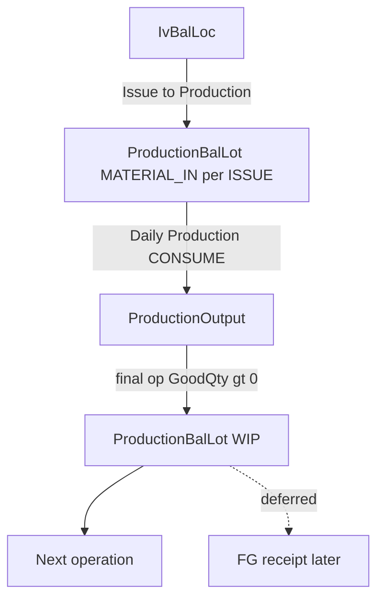

# Daily Production — canonical plan (fifth / final consolidation)

Self-contained implementation specification. Replaces all prior revision chat context. Confirm → **APPROVED FOR IMPLEMENTATION**.

---

## 1. Architecture



**In scope**

- Freeze route OutputType / Yield / OutputBaseUom / conversion into WO snapshot (hash V3)
- Expand `ProductionMaterialMovement` for production CONSUME without inventory batch
- `ProductionBalLot` + `ProductionBalLotMovement` (Qty stored; movements audit)
- Issue to Production creates MATERIAL_IN per ISSUE contribution
- Daily Production draft/post/rollback (MANUAL purchased/external + INTERNAL_ROUTE_WIP)
- WIP_STOCKED / FINISHED_GOODS staging lots; WIP_NONSTOCK record-only
- Balance-by-lot inquiry; Daily Production list/entry; menus

**Deferred**

- BACKFLUSH, PICK_LIST, SEPARATE_PRODUCT_DEFINITION
- FG inventory receipt (`IvBalLoc`)
- Non-100% yield execution
- Automatic WO COMPLETED/CLOSED
- WIP accounting cost
- Material Return UI/service (any future RETURN must update ProductionBalLot)
- ProductionBalLot ADJUST posting (ADJUST_IN/OUT later)
- WIP contribution layers (prefix-balance after reversal collapse used instead)

[`WipItemBalLoc`](ErpWeb.Model/Entities/Production/WipItemBalLoc.cs) unused.

---

## 2. ProductionMaterialMovement redesign

Current entity/config require inventory lineage and unique `(PostingLinkId, InventoryBatchDetailId, MovementType)`; type check lacks `CONSUME_REVERSAL` — see [`ProductionMaterialMovementConfiguration`](ErpWeb.Model/Configurations/Production/ProductionMaterialMovementConfiguration.cs).

### Fields

Make nullable: `FromBalLocId`, `InventoryBatchId`, `InventoryBatchNo`, `InventoryBatchDetailId`, `InventoryTrxLineNo`.

Add: `ProductionBalLotId`, `ProductionBalLotMovementId`, `ProductionOutputId`.

WH/Loc/Lot/ItemStatus: empty string when not inventory-originated.

### Constraints / indexes

- `CK_PrMaterialMovement_Type` includes `CONSUME_REVERSAL`
- ISSUE / ISSUE_REVERSAL / RETURN: inventory batch detail + FromBalLoc required
- CONSUME / CONSUME_REVERSAL: ProductionBalLotId + ProductionOutputId required; inventory null for INTERNAL_ROUTE_WIP
- Unique filtered: `(PostingLinkId, InventoryBatchDetailId, MovementType)` WHERE InventoryBatchDetailId IS NOT NULL
- Unique filtered: `(PostingLinkId, ProductionBalLotMovementId, MovementType)` WHERE ProductionBalLotMovementId IS NOT NULL

### Net formulas (shared helper)

```text
EffectiveIssue    = SUM(ISSUE) - SUM(ISSUE_REVERSAL)
EffectiveConsumed = SUM(CONSUME) - SUM(CONSUME_REVERSAL)
```

Update GetWorkspace, Lifecycle, Rollback in Material Issue + Daily Production.

### Issue rollback dependency (BLOCKER)

Preserve and extend current [`Rollback.cs`](ErpWeb.Core/Production/ProductionMaterialIssueService.Rollback.cs) safety. Block Issue rollback when the ISSUE has **any** of:

- effective unreversed **CONSUME** (CONSUME with no matching CONSUME_REVERSAL)
- **RETURN** (Return reversal not implemented → always blocks)
- **ADJUST** (no adjustment-reversal contract → always blocks)

Not “unreversed CONSUME only.”

Lineage: CONSUME.OriginalMovementId → ISSUE; CONSUME_REVERSAL.OriginalMovementId → CONSUME.

### Runtime Issue rollback (MATERIAL_IN)

For OriginalIssueBaseQty = issue.BaseQty:

- Allowed only when `CurrentLot.BaseQty == OriginalIssueBaseQty` (repo rounding) **and** no effective CONSUME / RETURN / ADJUST dependency
- Write bal-lot ISSUE_REVERSAL; set Qty/BaseQty/TotalCost = 0; **do not delete** the lot row

---

## 3. ProductionBalLot schema

Table: live production pile (like `IvBalLoc`).

| Field | Notes |
|---|---|
| Uid | PK |
| CompanyCode, BranchCode | tenant |
| Kind | MATERIAL_IN \| WIP |
| ItemCode, Description | denormalized |
| Qty, Uom | display |
| BaseQty, BaseUom | authoritative |
| ConversionFactorToBase | frozen for the pile |
| TotalCost | MATERIAL_IN exact; WIP = 0 this slice |
| AverageUnitCost | MATERIAL_IN = TotalCost/BaseQty when BaseQty>0; WIP unused |
| WorkOrderId | required |
| WorkOrderNo | denormalized display |
| WorkOrderMaterialId | MATERIAL_IN |
| OriginalIssueMovementId | MATERIAL_IN identity |
| SourceIvBalLocId | display/lineage |
| WarehouseCode, LocationCode, LotNo | display/lineage |
| ProducingRouteStepId | WIP |
| WorkOrderOperationId | WIP produce op (nullable) |
| OutputType | WIP denormalized |
| WorkCentreCode, ProcessCode | WIP display |
| LastMovementDate | latest **effective** movement |
| RowVersion | concurrency |

**MATERIAL_IN unique:** Company, Branch, Kind, WorkOrderId, WorkOrderMaterialId, OriginalIssueMovementId

**WIP unique:** Company, Branch, Kind, WorkOrderId, ProducingRouteStepId, ItemCode, LotNo

Lock: UPDLOCK/HOLDLOCK on lock-or-insert.

**ADJUST:** not supported on ProductionBalLot this milestone.

### Reconciliation helper (tests/diagnostics)

```text
ProductionBalLot.BaseQty == sum(effective signed BalLotMovement.BaseQty)
```

MATERIAL_IN: TotalCost ≥ 0; Qty/BaseQty never exceed original ISSUE contribution.

---

## 4. ProductionBalLotMovement schema

Audit only. Does not define the balance by itself.

| Field | Notes |
|---|---|
| Uid | PK |
| ProductionBalLotId | FK |
| MovementType | ISSUE, ISSUE_REVERSAL, PRODUCE, PRODUCE_REVERSAL, CONSUME, CONSUME_REVERSAL, RETURN (future) |
| Qty, Uom, BaseQty, BaseUom | |
| UnitCost, TotalCost | |
| WorkOrderId | |
| WorkOrderMaterialId? | |
| WorkOrderOperationId? | |
| RouteStepId? | |
| ProductionOutputId? | |
| PostingLinkId | |
| OriginalMovementId? | movement being reversed |
| DocumentType, DocumentNo | |
| MovementDate | effective |
| CreatedDate, CreatedBy | system |

### Signed BaseQty helper

```text
ISSUE / PRODUCE                    +BaseQty
ISSUE_REVERSAL / PRODUCE_REVERSAL  -BaseQty
CONSUME / RETURN                   -BaseQty
CONSUME_REVERSAL / RETURN_REVERSAL +BaseQty
```

Prefix replay and LastMovementDate use **BaseQty** only (not display Qty).

### Effective movements (BLOCKER — reversal collapse)

Before prefix replay or LastMovementDate:

1. Load all movements for the lot
2. For each reversal with valid OriginalMovementId, remove **both** the original and its reversal from the working set
3. Remaining rows = **effective** movements
4. Sort by MovementDate, CreatedDate, UID

Example: Produce A +100, Consume −100, ConsumeReversal +100 → effective empty of that consume → rollback Produce A allowed.

---

## 5. ProductionOutput schema

| Field | Notes |
|---|---|
| Uid | PK |
| CompanyCode, BranchCode | |
| DocumentNo | DP… from running number |
| Status | NEW \| POSTED \| REVERSED |
| WorkOrderId, RouteStepId, WorkOrderOperationId | |
| ProductionDate | MovementDate / effective |
| ShiftCode, PlannedMachineCode, ActualMachineCode, Operator | |
| GoodQty, ScrapQty, RejectQty, HoldQty | |
| OutputUom, OutputItemCode, OutputType, OutputLotNo | |
| SnapshotRevision, SnapshotHash | |
| PostingRequestId | stable; matches OUTPUT_POST link |
| PostedDate, PostedBy, ReversedDate, ReversedBy | |
| RowVersion | |

---

## 6. Constants

```text
ProductionMaterialMovementTypes.ConsumeReversal = CONSUME_REVERSAL

ProductionPostingCommandTypes.OutputPost / OutputRollback
ProductionDocumentTypes.ProductionOutput
ProductionAuditEventTypes.OutputPosted / OutputRolledBack

ProductionBalLotKinds.MaterialIn / Wip
ProductionBalLotMovementTypes.Issue, IssueReversal, Produce, ProduceReversal, Consume, ConsumeReversal

RunningNumberKeys.ProductionDailyOutput = PR_DAILY_OUTPUT
```

Menu: `PLN_DAILY_PRODUCTION`, `PLN_PRODUCTION_BALANCE`.

---

## 7. Snapshot V3

### Builder

- Load item masters including route `OutputItemCode` (and in `BuildFromRevisionAsync` items must include them)
- Missing OutputItemCode master → fail (never default OutputBaseUom = OutputUom)
- `BuildRouteStep`: copy OutputType, YieldPercent (=100 new), OutputUom, OutputBaseQty; **OutputBaseUom = item.StdUom**

### Calculator

Only `OutputConversionFactorToBase` via `IUomConversionService` (1 if UOMs equal); missing conversion fails.

### Hash / Release

- New SnapshotHashVersion V3 (format stays 3); V1/V2 writers unchanged
- **Release requires SnapshotHashVersion == Current (V3)**; V2 draft → Refresh first
- Released V2 without OutputType/factor → Daily Production rejects

### Readiness

- OutputType known; YieldPercent 100 (new); OutputBaseUom; factor > 0
- INTERNAL_ROUTE_WIP → producer OutputType == WIP_STOCKED
- Exactly one terminal FG: `OutputItemCode == ProductCode && FINISHED_GOODS`
- Terminal OutputBaseUom == WorkOrder.OutputUom

### Refresh diff

Include OutputItemCode, OutputType, OutputBaseQty, OutputUom, OutputBaseUom, OutputConversionFactorToBase, YieldPercent.

---

## 8. Quantity and material formulas

```text
ProcessedThisPost = Good + Scrap + Reject + Hold

StandardThisPost =
  RequestedForProductionQty(
    FrozenRequiredQty,
    Operation.PlannedOutputQty,
    ProcessedThisPost)

MaxThisPost = StandardThisPost * (1 + TolerancePercent / 100)
VarianceThisPost = ConsumeQty - StandardThisPost
```

`StandardThisPost` is the analytical BOM for this Daily Production document only. Do not show full WO `RequiredQty` as the consume target.

DP tolerance is per document line — not Issue-to-Production cumulative remaining. A later DP cannot exceed its own `MaxThisPost` to catch up an earlier under-consume.

`0 <= ConsumeQty <= MaxThisPost`. Variance requires a controlled reason (`DAMAGE` / `MACHINE` / `HUMAN` / `YIELD` / `SHORTAGE_ADJUST` / `OTHER`). `LEGACY_UNCLASSIFIED` is backfill-only.

Handoff consume is locked to `ProcessedThisPost`. Persist `WorkOrderMaterialID = NULL` + `HandoffFromOperationID`; UI read identity is `SyntheticMaterialId(prior)`.

Use frozen WO material RequiredQty (already includes ScrapPercent once). No second scrap. No Setup/OperationLoss in formula.

Workspace, Create, Update, and Post share `ProductionOutputMaterialSupport`. Availability preview is `IssueQtyForBaseQty(SUM(BaseQty), ConversionFactorToBase)` as-of `ProductionDate` (same future-stock rule as Post).

### Guards

```text
OperationGoodRemaining = max(PlannedOutputQty - GoodQty, 0)
GoodThisPost <= OperationGoodRemaining

# Final FG only (WO OutputUom):
GoodForWorkOrder = GoodThisPost * OutputConversionFactorToBase
# same for Scrap/Reject/Hold
WorkOrderGoodRemaining = OpenProductionQty(PlannedQty, GoodQty, ApprovedVarianceQty)
GoodForWorkOrder <= WorkOrderGoodRemaining
```

### Header projections

Only when `IsFinalOperation && OutputType == FINISHED_GOODS`: add converted Good/Scrap/Reject/Hold to WO. Intermediate stages stay on operation + documents + lots.

### RemainingQty (Option A)

```text
Operation.RemainingQty = PlannedOutputQty - GoodQty
WorkOrder.RemainingQty = OpenProductionQty(...)
```

Do **not** mutate InputQty.

### Output lot

Only final op + GoodQty > 0 + WIP_STOCKED|FINISHED_GOODS. Good=0 reject/scrap still posts document and consumes material; no lot.

### Supply routing

| IssueMethod / SupplySource | Behavior |
|---|---|
| MANUAL + PURCHASED / EXTERNAL_SUPPLY | Consume MATERIAL_IN |
| any + INTERNAL_ROUTE_WIP | Consume WIP of ProducingRouteStepId |
| BACKFLUSH / PICK_LIST / SEPARATE_PRODUCT_DEFINITION | Reject |

Allocate in **BaseQty**; reject bad UOM conversion. MATERIAL_IN cost: reduce TotalCost proportionally (`consumedBase/lotBase * TotalCost`). WIP cost columns stay 0.

Daily Production does not bypass Issue IP tolerance on Issue documents. DP consume uses its own per-document max.

Actual `ConsumeQty` drives FIFO allocation and produced WIP/FG cost. `StandardQty` is analytical only.

WO `ConsumedQty` is effective CONSUME − CONSUME_REVERSAL. `VarianceQty` is effective consumed minus standard-to-date from POSTED `PrProductionOutputMaterial` rows. Post rebuilds with `IncludeCurrentPost`; rollback with `ExcludeCurrentRollback` so the helper does not depend on a flushed header status.

Create replay of the same `PostingRequestId` succeeds only when the normalized header and material payload match.

Path B backfill uses original CONSUME (not effective zero after reversal) and reconstructs handoff from `PrProductionBalLotMovement` CONSUME with a null Work Order material id.

---

## 9. IProductionOutputService

```text
CreateAsync / UpdateAsync / DeleteAsync   (NEW only)
PostAsync / RollbackAsync
SearchAsync / GetAsync
SearchEligibleOperationsAsync / GetWorkspaceAsync(operationId, productionDate)
GetDocumentWorkspaceAsync   (saved facts; historical for POSTED/REVERSED)
```

`IProductionMaterialConsumeVarianceInquiryService` is ACCESS-only (`PLN_MAT_CONSUME_VAR`). Quantity summaries always group by component + UOM. Reason-only and Work Order-only summaries are counts.

### PostingLink lifecycle

**Create:** OUTPUT_POST link Status=DRAFT; PostingRequestId; ProductionDocumentType=PRODUCTION_OUTPUT; DocumentNo; SnapshotRevision/Hash; WorkOrderId.

**Post:** reuse same link; under lock DRAFT → PENDING → SUCCEEDED. Validation failure before mutation: remain/restore DRAFT. Idempotent same PostingRequestId returns existing success (no double lot mutation).

**Rollback:** new OUTPUT_ROLLBACK PENDING → SUCCEEDED; OriginalPostingLinkId = OUTPUT_POST; mark original link REVERSED; ProductionOutput REVERSED (keep history).

---

## 10. Posting sequence

Shared lock order: PostingLink/Output → WO → RouteStep → Operation → Materials by UID → source lots by UID → destination WIP.

1. Reuse OUTPUT_POST link
2. Lock WO (RELEASED/IN_PROGRESS, revision+hash V3 fields present)
3. Lock RouteStep + Operation
4. Validate date, quantities, machine, lot, OutputType, Yield, final-op, FG UOM match
5. ProcessedThisPost; Good / GoodForWorkOrder guards
6. Material requirements; lock lots; MovementDate ≤ production; BaseQty allocate
7. Subtract piles; BalLotMovement CONSUME + MaterialMovement CONSUME
8. Mark ProductionOutput POSTED
9. If final && GoodQty > 0 && stocked/FG: PRODUCE (qty only)
10. Rebuild operation (not InputQty); net ConsumedQty; FG header converted; RemainingQty
11. First output RELEASED → IN_PROGRESS; audit OUTPUT_POSTED; SUCCEEDED; commit

### WIP PRODUCE rollback (prefix after collapse)

1. Collapse reversal pairs → effective movements
2. Exclude target PRODUCE
3. Replay signed **BaseQty** in MovementDate/CreatedDate/UID order
4. If running BaseQty < 0 → block; else PRODUCE_REVERSAL

Chronology: MovementDate vs CreatedDate; LastMovementDate = latest **effective** movement.

---

## 11. Opening script

BaseQty-authoritative per ISSUE contribution:

```text
RemainingBaseQty =
  Issue.BaseQty
  - effective IssueReversal.BaseQty
  - effective Return.BaseQty
  - effective Consume.BaseQty

RemainingQty = RemainingBaseQty / Issue.ConversionFactorToBase  (IvQty.Round)
RemainingTotalCost = RemainingBaseQty * Issue.UnitCost
```

- Fully reversed → omit active pile
- Unattributable CONSUME / RETURN / ADJUST → **stop and report** (do not invent)
- ADJUST with undefined direction → stop (no ProductionBalLot ADJUST yet)
- Dev may clear production execution data instead; document choice

---

## 12. UI

### Production balance by lot

Pattern [`IvBalanceLot.razor`](ErpWeb.UI/Inventory/Inquiry/IvBalanceLot.razor). Default Qty > 0. Columns: Kind, Item, Description, Lot, Work Order, Work Centre, Process, Qty, UOM, Warehouse, Bin, Last Movement. Drill: movements for that lot only. Read-only.

### Daily Production

Pattern [`PrMaterialIssueList`](ErpWeb.UI/Planning/WorkOrders/PrMaterialIssueList.razor) / Entry.

Search: Work Order, Product, Work Centre, Process, Output Item, Machine.

Entry: Production Date, Shift, Machine, Operator, Good/Scrap/Reject/Hold, Output Lot.

Material grid: material, supply/issue, WO BOM required, standard this post, max incl. tolerance, consume now (editable real / locked handoff), signed variance, reason / OTHER detail, current available, remaining after, UOM, status. Reset restores editable lines to standard. Production date refreshes availability.

Post / Rollback.

---

## 13. Implementation order

1. Snapshot V3 + readiness + refresh diff + Release requires V3  
2. Material movement nullable lineage + CONSUME_REVERSAL + nets + Issue dependency CONSUME|RETURN|ADJUST + signed helper  
3. ProductionBalLot / Movement / Output schemas + PR_DAILY_OUTPUT + reconcile helper  
4. Issue MATERIAL_IN create + zero-on-rollback + opening script  
5. ProductionOutput draft + OUTPUT_POST DRAFT link  
6. Daily Production post  
7. Rollback with effective-collapse WIP prefix  
8. Inquiry + UI + menus  
9. Tests 1–50  

---

## 14. Tests

1–40 from prior revisions (FG conversion, terminal uniqueness, dual CONSUME, nets, Good=0 no lot, InputQty, hash V1/V2, etc.)

41. Produce A → Consume → CONSUME_REVERSAL → rollback Produce A **allowed**  
42. Issue rollback blocked by effective RETURN  
43. Issue rollback blocked by ADJUST  
44. Opening uses BaseQty; reconstructs display Qty from issue conversion  
45. Opening stops on unattributable RETURN  
46. Opening stops on ADJUST  
47. MATERIAL_IN rollback requires CurrentBaseQty == OriginalIssueBaseQty  
48. OUTPUT_POST link carries DocumentType/No + snapshot fingerprint  
49. Output rollback → ProductionOutput REVERSED; history preserved  
50. BalLot.BaseQty reconciles to effective signed movement BaseQty  

Plus: Produce A / Consume / Produce B → rollback A blocked; Produce A / B / Consume → rollback A allowed; missing route item master fails snapshot; refresh shows OutputType change; V2 cannot Release; Issue rollback zeros lot not delete; PostingLink create once / rollback new link.

---

## Approval

Scores: 7.8 → 8.6 → 9.2 → 9.4 → 9.5 → this consolidation targets **9.8–10 / APPROVED FOR IMPLEMENTATION** on user confirm.
