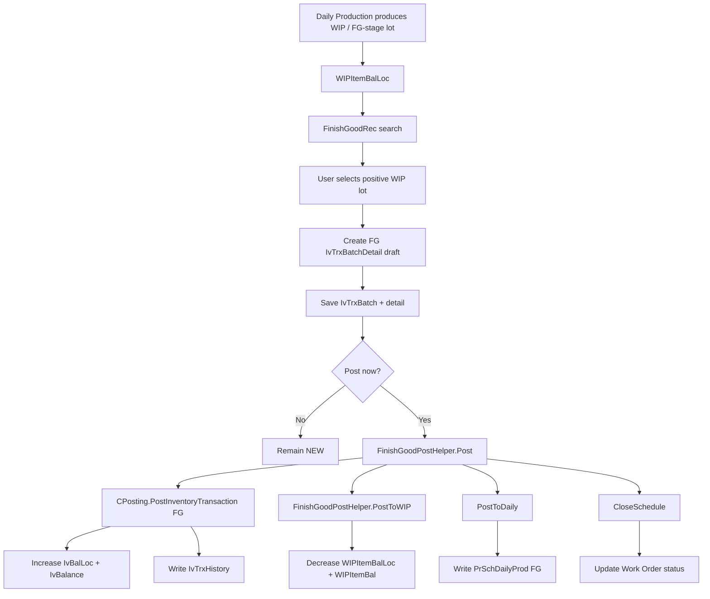
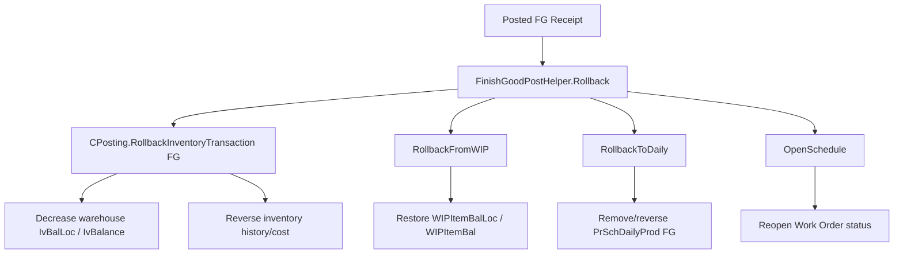
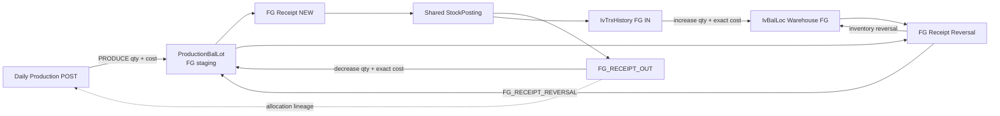

# Finished Good Receipt — Deep Reverse-Engineering Study
## ERPOrigin Web Forms → `net10projectTemplate` Blazor Server (`production`)

**Study date:** 2026-10-04  
**Legacy repository:** `mokth/ERPOrigin`, branch `master`  
**Legacy code snapshot observed:** `1282097754401af2b36ba7a0ab46cc83574e6253`  
**Target repository:** `mokth/net10projectTemplate`, branch `production`  
**Target branch head observed:** `1af97876c807e38d429a24677e620798cb2bc8f2`

---

# 1. Purpose of this study

This document reverse-engineers how the old ERP handles **Finished Good Receipt (FG Receipt)** and translates the **business concept and posting logic** into a design suitable for the current Blazor Server ERP.

The primary legacy files requested were:

- `ProductionPlan/ProdPlan/FinishGoodRec.aspx`
- `ProductionPlan/ProdPlan/FinishGoodRec.aspx.cs`
- `ProductionPlan/ProdPlan/FinishGoodRecView.aspx`
- `ProductionPlan/ProdPlan/FinishGoodRecView.aspx.cs`

The study also follows the important helpers and lower-level posting/costing code called by those pages, including:

- `ProductionPlan/Helper/FinishGoodPostHelper.cs`
- `ProductionPlan/Helper/ProdTrxBaseHelper.cs`
- `ProductionPlan/Helper/TrxBatchHelper.cs`
- `ProductionPlan/HelperEx/NeedPostHelper.cs`
- `ERPClasses/Classes/CPosting.cs`
- `ERPClasses/BL/IvBalLocCostBL.cs`
- `ERPClasses/BL/WIPItemBalLocBL.cs`
- related WIP lookup/helper usages under `ProductionPlan`
- the inventory batch, inventory balance, history, WIP balance, work-order, daily-production and costing tables manipulated by the posting engine.

The target Blazor Server implementation was compared against the current `production` branch, especially:

- `ErpWeb.Core/Production/ProductionOutputService.Posting.cs`
- `ErpWeb.Core/Production/ProductionOutputService.Rollback.cs`
- `ErpWeb.Core/Production/ProductionStockWriter.cs`
- `ErpWeb.Core/Production/ProductionContributionAllocator.cs`
- `ErpWeb.Core/Production/ProductionBalanceInquiryService.cs`
- `ErpWeb.Core/StockLedger/StockPostingCoordinator.cs`
- `ErpWeb.Core/StockLedger/StockMovementRegistry.cs`
- `ErpWeb.Core/Inventory/IvInventoryPostingService.cs`
- `ErpWeb.Core/Inventory/IIvInventoryPostingService.cs`
- `ErpWeb.Model/Entities/Production/ProductionBalLot.cs`
- `ErpWeb.Model/Entities/Production/ProductionBalLotMovement.cs`
- `ErpWeb.Model/Entities/Production/ProductionMovementAllocation.cs`
- `ErpWeb.Model/Entities/Production/ProductionPostingLink.cs`
- `ErpWeb.Model/Entities/Production/ProductionDomainConstants.cs`
- `ErpWeb.Model/Entities/Inventory/IvTrxBatch.cs`
- `ErpWeb.Model/Entities/Inventory/IvTrxBatchDetail.cs`
- `ErpWeb.Model/Entities/Inventory/IvTrxHistory.cs`
- `plans/production_stock_ledger_implementation_plan.md`

---

# 2. Executive conclusion

The old ERP's Finished Good Receipt is fundamentally a **transfer between two stock domains**:

```text
Production WIP balance
        │
        │ Finished Good Receipt
        ▼
Warehouse Inventory
```

It is **not** merely an inventory receipt.

A correct FG Receipt performs two stock legs together:

1. **Decrease the finished/WIP production lot**
2. **Increase the warehouse inventory lot**

The old ERP does this through separate mutable balance tables:

```text
WIPItemBalLoc / WIPItemBal       ↓
IvBalLoc / IvBalance             ↑
```

and attempts to keep those changes atomic through one SQL transaction.

The new ERP already has a much better foundation:

```text
ProductionBalLot
ProductionBalLotMovement
ProductionMovementAllocation
StockPosting
IvBalLoc
IvTrxHistory
ProductionPostingLink
```

Therefore the new implementation should **copy the old business concept, not the old technical implementation**.

The recommended target workflow is:

```text
Daily Production final output
        │
        ▼
ProductionBalLot
Kind = WIP
OutputType = FINISHED_GOODS
Qty / BaseQty / TotalCost / AverageUnitCost
        │
        │ FG Receipt
        │
        ├── FG_RECEIPT_OUT from production balance
        │
        └── FG inventory receipt into IvBalLoc
                │
                ▼
        Warehouse Finished Goods
```

The biggest architectural recommendation is:

> **FG Receipt must transfer the exact existing cost carried by the production balance lot into warehouse inventory. It should not recalculate manufacturing cost from BOM/labour/overhead at receipt time.**

The current target production service already calculates and carries output cost into `ProductionBalLot.TotalCost` and `AverageUnitCost`. That makes the source production lot the natural valuation authority for FG Receipt.

---

# 3. High-level old ERP workflow

The complete old workflow is approximately:



Rollback does the opposite:



---

# 4. The role of each of the four requested legacy pages

## 4.1 `FinishGoodRec.aspx`

This is the **entry-page markup and client-side interaction layer**.

Its responsibilities include:

- Work Order search
- Work Centre search/filter
- Process search/filter
- Product/output item search
- displaying available WIP stock
- selecting WIP lots
- validating selected quantity against WIP quantity
- adding selected WIP into the FG Receipt detail grid
- editing destination warehouse/location/lot/receipt quantity
- deleting draft lines
- saving
- asking whether to post immediately
- cancelling
- navigating back to the FG Receipt list.

Important user interaction:

```text
Search WIP
    ↓
Select lot
    ↓
Enter receipt qty
    ↓
Apply
    ↓
FG Receipt detail line created
    ↓
Save
    ↓
Optional Post
```

The client prevents a receipt quantity greater than the displayed WIP quantity.

That is useful for operator feedback, but it is **not sufficient stock control**. The real quantity check is repeated during posting.

---

## 4.2 `FinishGoodRec.aspx.cs`

This is the main **CRUD / draft creation / WIP-selection server-side logic**.

It manages several in-memory `DataTable`s such as:

- `dtBatch`
- `dtBatchDtl`
- `dtDaily`
- `dtWIPItemBalLoc`
- `dtPrShift`
- numbering tables
- parameter tables.

It uses Session to preserve the draft grid state.

The important responsibilities are:

1. initialize NEW transaction
2. load existing transaction
3. switch an existing draft to OPEN for editing
4. search available WIP
5. convert a selected WIP lot into `IvTrxBatchDetail`
6. calculate/display draft FG cost
7. save header/details
8. optionally invoke posting.

---

## 4.3 `FinishGoodRecView.aspx`

This is the list-page UI.

It exposes commands such as:

- New
- Edit
- View
- Delete
- Post
- Rollback
- Refresh
- Print

and displays saved Finished Good Receipt transactions.

---

## 4.4 `FinishGoodRecView.aspx.cs`

This is the list-page transaction controller.

Its important behavior is:

- delete only unposted documents
- post selected FG Receipts
- rollback posted FG Receipts
- refresh OPEN documents
- navigate to Edit/View
- update some post-receipt expiry information.

This page does **not** contain the actual stock posting engine. It delegates to:

```text
FinishGoodPostHelper
```

which in turn calls:

```text
CPosting
```

for the Inventory side.

---

# 5. Legacy Finished Good Receipt CRUD

## 5.1 Create / NEW

When creating a new transaction:

- a new inventory batch number is obtained
- transaction date defaults to current date/time
- RefNo initially behaves as AUTO
- status is NEW
- default shift/time/operator context is loaded.

The FG Receipt is stored using the common inventory transaction tables:

```text
IvTrxBatch
IvTrxBatchDetail
```

with:

```text
TrxType = "FG"
```

So even in the old system, FG Receipt is conceptually an Inventory transaction with additional production-side behavior.

---

## 5.2 Read / View

Existing batches are loaded from:

```text
IvTrxBatch
IvTrxBatchDetail
```

The detail row contains both:

### Source production information

- Work Order / `ScheCode`
- Release No / `RelNo`
- Work Centre
- Process
- source item
- source WIP lot
- source lot revision
- source quantity/UOM
- source WIP transaction identity fields.

### Destination inventory information

- warehouse
- location
- destination lot
- receive quantity
- receive UOM
- inventory status
- expiry date
- remarks.

This is important:

> The old `IvTrxBatchDetail` is being used as both the inventory receipt line and the production-source snapshot.

The new system should not overload inventory fields with production lineage this way.

---

# 6. Legacy edit behavior

When an existing draft is opened for edit, the old system changes:

```text
BatchStatus → OPEN
```

through `PrdTrxBatchHelper.UpdateBatchStatus`.

When editing is cancelled, status is restored toward NEW.

This was effectively a primitive editing-state mechanism.

For the new Blazor implementation, there is no need to reproduce `OPEN`.

The current architecture already has:

- row version
- explicit database transactions
- posting links
- strong state checks.

Recommended new-state model:

```text
NEW
POSTED
```

and for immutable posting history:

```text
primary posting generation
reversal posting generation
```

If a visible document status is required after rollback:

```text
NEW / POSTED
```

is still enough if rollback reopens the draft for correction.

---

# 7. Legacy Delete behavior

On the list page, deletion is allowed only when the document is not posted.

The lower-level `ProdTrxBaseHelper.DeleteBatch` physically deletes:

```sql
DELETE IvTrxBatch
DELETE IvTrxBatchDetail
```

and creates audit information around the deleted data.

Conceptually this is valid for an unposted draft.

Recommended new rule:

```text
NEW       → may delete
POSTED    → may not delete
POSTED    → must Rollback first
```

For posted stock documents, the new ERP should preserve immutable stock/posting facts permanently.

---

# 8. How the old ERP picks WIP for Finished Good Receipt

This is one of the most important pieces of the old flow.

The entry page searches:

```sql
SELECT *
FROM vprd_WipFinishLots
WHERE StdQty > 0
```

with optional filters for:

- Work Order / `ScheCode`
- Work Centre / `WCCode`
- Work Centre item / `WCICode`
- Process / `ProcessCode`.

Therefore the fundamental eligibility rule is:

> Only WIP lots with remaining positive stock can be selected for FG Receipt.

The underlying WIP lot identity contains values such as:

```text
ICode
WCCode
ProcessCode
LotNo
RevNo
StdQty
WtQty
ScheCode
RelNo
WCICode
StdUom
WtUom
ProdCode
TransactionDate
```

The lot is not identified by item alone.

It is identified by a manufacturing context:

```text
Work Order
+ Release
+ Work Centre
+ Process
+ WIP/output item
+ Lot
+ Lot revision
```

---

# 9. Creating a detail line from the selected WIP lot

`FinishGoodRec.aspx.cs` uses `InsertWIPItem(...)` to turn the selected WIP lot into an FG transaction line.

The line stores destination information such as:

```text
ToWarehouse
ToLocation
ToLot
ToStdQty
ToStdUOM
ToWtQty
ToWtUOM
```

and source information such as:

```text
ScheCode
RelNo
PreWCenter
PreProcess
PreICode
PreLotNo
PreRevNo
PreQty
PreQtyUOM
PreWt
PreWtUOM
PreScheCode
WCICode
```

The code then looks up the exact source row in `WIPItemBalLoc` and copies that WIP identity into the receipt line.

This snapshot is what later allows `FinishGoodPostHelper.PostToWIP()` to find and reduce the exact source WIP lot.

---

# 10. Why the source WIP snapshot matters

Suppose the same output item exists as:

| Work Order | WC | Process | Item | Lot | Qty |
|---|---|---|---|---|---:|
| WO001 | WC1 | P20 | FG001 | LOT-A | 30 |
| WO001 | WC1 | P20 | FG001 | LOT-B | 20 |
| WO002 | WC1 | P20 | FG001 | LOT-A | 40 |

`FG001` is not enough to identify the production stock.

Even:

```text
FG001 + LOT-A
```

is not necessarily enough.

The source manufacturing context must be preserved.

The new ERP already has a better identity through `ProductionBalLot.Uid`.

Therefore the new FG line should store:

```text
SourceProductionBalLotId
```

as the authoritative source.

Human-readable fields should be snapshots for audit/display, not the authoritative key.

---

# 11. Draft quantity validation

The legacy UI checks:

```text
Receipt Qty <= WIP Qty
Receipt Weight <= WIP Weight
```

before adding the line.

Posting repeats the validation.

This is correct conceptually.

The new ERP must keep the same two-layer strategy:

### Entry-time validation

Fast user feedback using current displayed availability.

### Post-time validation

Authoritative lock + re-read inside the SQL transaction.

Never trust the quantity originally displayed by the browser.

---

# 12. Legacy Save behavior

`Save(needPost)` does the following:

1. validates at least one line
2. validates transaction period
3. verifies the batch is not already POSTED
4. creates or updates `IvTrxBatch`
5. stores:
   - `TrxType = "FG"`
   - `BatchStatus = "NEW"`
   - transaction date
   - user/company/branch/location
   - ref number
6. adds shift/operator/time data to the details
7. updates lot number sequence
8. writes the header/details and running-number tables inside one SQL transaction
9. commits the draft
10. if the user requested posting, calls `ProdNeedPostHelper.PostFG(...)`.

This means:

> Save and Post are separate lifecycle operations.

That is a good business pattern and should remain in the Blazor system.

---

# 13. Old posting wrapper

`ProdNeedPostHelper.PostFG` provides a wrapper around the actual posting engine.

Its flow is:

```text
Check POST access
    ↓
Wait for other posting
    ↓
Create GUID lock token
    ↓
Set PRDFG posting lock
    ↓
Check batch not already POSTED
    ↓
FinishGoodPostHelper.Post(...)
    ↓
Release posting lock
```

The old system uses a relatively coarse `TrxPostingHelper` lock.

The new system should **not** copy this.

The current target already has:

```text
StockPostingCoordinator
BranchStockTransactionLock
RequestId / fingerprint
StockPosting identity
period/freeze guards
SQL transaction
```

which is substantially stronger.

---

# 14. Legacy Finished Good posting engine

The core posting logic is in:

```text
ProductionPlan/Helper/FinishGoodPostHelper.cs
```

For each selected FG batch, the old system roughly performs:

```text
1. Post inventory FG receipt
2. Reduce WIP production stock
3. Write FG production-completion history
4. Update Work Order / schedule status
5. Commit everything
```

The important call sequence is:

```text
CPosting.PostInventoryTransaction("FG", ...)
FinishGoodPostHelper.PostToWIP(...)
FinishGoodPostHelper.PostToDaily(...)
FinishGoodPostHelper.CloseSchedule(...)
```

The result is saved through one SQL transaction spanning the affected production and inventory tables.

---

# 15. Posting — Inventory side

`CPosting.PostInventoryTransaction("FG")` dispatches to the Finished Good posting path.

For a stock-controlled item it performs logic equivalent to:

```text
destination IvBalLoc +Qty
aggregate IvBalance +Qty
costing state updated
IvTrxHistory inserted
batch status → POSTED
```

The destination inventory balance key includes dimensions such as:

```text
Company
Branch
Item
Warehouse
Location
Lot
Lot revision
Item status
```

If the destination inventory lot already exists, quantity is increased.

If it does not exist, a new inventory balance row is created.

---

# 16. Posting — Production WIP side

`FinishGoodPostHelper.PostToWIP()` finds the source WIP lot using the source identity saved on the FG detail.

Conceptually:

```text
Work Order
+ Release
+ Work Centre
+ Process
+ WC Item
+ WIP Item
+ Lot
+ Revision
+ UOM
```

It then validates again:

```text
receive qty <= current WIP qty
```

and reduces:

```text
WIPItemBalLoc.StdQty
WIPItemBal.StdQty
```

The old ERP has both:

- detailed WIP-by-lot balance
- aggregate WIP item balance.

Both are updated.

This dual mutable state is a maintenance/reconciliation risk.

The target architecture is better because it can use:

```text
ProductionBalLot          = current projection
ProductionBalLotMovement  = immutable movement history
```

rather than maintaining two independent production quantity stores.

---

# 17. Full versus partial WIP depletion in the legacy system

The old logic supports partial receipt.

Example:

```text
WIP source lot = 100
FG receipt      = 40
```

After posting:

```text
WIP remaining   = 60
Inventory FG    = +40
```

For a complete depletion, the WIP lot becomes zero.

There is also a legacy `Completed` behavior that may zero out the entire source WIP lot and use the original lot quantity as the completed quantity.

This must **not be copied blindly** into the new ERP.

The new FG Receipt should always move:

```text
exact requested/posted quantity
```

unless the business has an explicit separate command such as:

```text
Receive Remaining Balance
```

The old `Completed` shortcut mixes operational completion with physical stock transfer.

---

# 18. Posting — Daily production / manufacturing history

After WIP is transferred to Inventory, the old code writes an FG record to:

```text
PrSchDailyProd
```

including information such as:

- Work Order
- release
- Work Centre
- process
- output item
- quantity
- weight
- lot
- warehouse/location
- batch/ref/line
- FG transaction type.

This lets old reports treat FG receipt as part of production progress.

In the new ERP, this should **not** require a duplicate pseudo-daily-production row if the production ledger already provides the same information.

The new system already has:

```text
ProductionOutput
ProductionBalLotMovement
ProductionPostingLink
StockPosting
```

The FG Receipt should add an explicit production stock movement:

```text
FG_RECEIPT_OUT
```

and link it to the warehouse receipt.

That is a cleaner source for inquiry and audit.

---

# 19. Posting — Work Order status

The old `CloseSchedule()` may change the Work Order/schedule status depending on total finished-good completion.

The broad business concept is:

```text
FG quantity received reaches production requirement
    ↓
Work Order may become CLOSED/COMPLETED
```

However, this responsibility should be reconsidered in the new ERP.

Your current production module already updates Work Order production quantities during **Daily Production**.

Therefore Finished Good Receipt should normally represent:

```text
physical ownership/location transfer
Production → Warehouse
```

not a second production-output event.

Recommended rule:

> Do not increment Work Order `GoodQty` again during FG Receipt.

Otherwise the same output would be counted twice:

```text
Daily Production GoodQty
+ FG Receipt GoodQty
```

Work Order completion should remain controlled by Daily Production and the Work Order completion service.

FG Receipt may contribute to a separate metric such as:

```text
QtyReceivedToWarehouse
QtyPendingWarehouseReceipt
```

if operationally useful.

---

# 20. Old posting table-impact summary

| Area | Legacy table | Post effect |
|---|---|---|
| Document | `IvTrxBatch` | status becomes POSTED |
| Document | `IvTrxBatchDetail` | source/destination FG detail retained |
| Warehouse stock | `IvBalLoc` | destination lot quantity increases |
| Warehouse stock | `IvBalance` | aggregate inventory increases |
| Inventory history | `IvTrxHistory` | FG movement added |
| Inventory costing | `IvBalLocCost` | cost state updated |
| WIP detail | `WIPItemBalLoc` | source WIP lot decreases |
| WIP aggregate | `WIPItemBal` | aggregate WIP decreases |
| Production history | `PrSchDailyProd` | FG completion row added |
| Work Order | `PrSchMas` | status/progress may change |
| Delivery linkage | `SaDeliveryRequest` | may change depending on completion |

---

# 21. Critical business invariant in posting

The physical quantity invariant is:

```text
production balance decrease
=
warehouse inventory increase
```

for the same Finished Good item and base UOM.

For example:

```text
Before:
Production FG staging = 25 EA
Warehouse FG          = 10 EA

Receive 8 EA

After:
Production FG staging = 17 EA
Warehouse FG          = 18 EA
```

No Finished Good quantity is created by the receipt.

It is transferred.

This invariant should be enforced transactionally in the new system.

---

# 22. Legacy rollback

Rollback is initiated from `FinishGoodRecView`.

The list page:

1. verifies rollback permission
2. verifies the transaction is POSTED
3. obtains the old posting lock
4. calls `FinishGoodPostHelper.Rollback(...)`
5. releases the lock.

The core rollback sequence is conceptually:

```text
Rollback inventory receipt
Restore production WIP
Remove/reverse production FG history
Reopen Work Order/schedule
```

---

# 23. Rollback — Inventory side

The old `CPosting.RollbackInventoryTransaction("FG")`:

- checks that the destination inventory stock can be removed
- reduces the warehouse FG balance
- updates aggregate inventory
- rolls back related costing/history
- returns the FG batch toward NEW.

An important rule emerges here:

> If the received Finished Good has already been used/sold/transferred and insufficient stock remains, rollback is blocked.

That rule must remain in the new ERP.

Example:

```text
Receive FG 10
Sell 7
Current stock from the relevant slice effectively insufficient to reverse 10

Rollback FG Receipt → reject
```

The new inventory posting service already contains rollback quantity and chronology protection that can support this.

---

# 24. Rollback — Production WIP side

`RollbackFromWIP()` restores the quantity that posting removed.

Conceptually:

```text
WIPItemBalLoc += receipt quantity
WIPItemBal    += receipt quantity
```

For legacy lines marked Completed, the restoration can be based on production-history quantity rather than simply `ToStdQty`.

The target system should be simpler:

```text
restore exactly the BaseQty and cost recorded by the original FG_RECEIPT_OUT movement
```

Never infer rollback quantity from the current document or recalculate it.

---

# 25. Rollback — production history and Work Order

The old code also reverses/removes the corresponding `PrSchDailyProd` FG record and reopens schedule status.

The new ERP should preserve audit facts rather than delete them.

Recommended target behavior:

```text
Original FG receipt posting remains immutable
+
append FG receipt reversal
```

This gives a complete timeline:

```text
2026-10-05 FG_RECEIPT_OUT     -10
2026-10-08 FG_RECEIPT_REVERSAL +10
```

instead of making the original movement disappear.

---

# 26. Old month/period rollback protection

The old rollback code compares the transaction period to the current accounting/parameter period and blocks rollback across a closed period.

The concept is correct.

The implementation is too local and coarse.

The target already has:

```text
IvPeriodCloseGuard
StockPostingCoordinator period/freeze guards
Stock business-effective date
```

Those should be the single period authority.

Recommended rule:

> A rollback is a new current/open-period reversal event. Do not rewrite the original historical period.

---

# 27. Legacy cost calculation — deep dive

Costing is one of the most important differences between the old and new architecture.

The draft FG line calculates cost using:

```text
IvBalLocCostBL.GetFGCostPriceEx(...)
```

The method builds a Finished Good manufacturing cost from:

1. BOM material cost
2. labour cost
3. overhead cost.

---

# 28. Old material-cost formula

The BOM query uses scheduled Work Order data from tables such as:

```text
PrSchBOM
PrSchWCenter
```

for default BOM components.

The approximate component requirement per FG unit is:

```text
ReqQty
=
(BOM StdQty / Work-Centre ScheQty)
× Work-Centre StdPackSize
```

Material cost is obtained from previously posted **Issue to Production** inventory history:

```text
IvTrxHistory
TrxType = 'IP'
ScheCode = Work Order
```

using the issue-history `UnitPrice`.

Each material's FG-unit contribution is:

```text
Material contribution
=
ReqQty × issued material UnitPrice
```

The total material portion is the sum of those contributions.

---

# 29. Old labour-cost formula

Labour comes from:

```text
PrSchLabour
```

The old logic converts labour into a per-output cost roughly as:

```text
Labour per FG
=
LabourCost / WorkOrder ScheduledQty
```

and sums the labour contributions.

---

# 30. Old overhead formula

Overhead comes from the finished item's:

```text
IvMas.OverHeadCost
```

and is included as another per-unit manufacturing contribution.

---

# 31. Old FG total-cost formula

Conceptually:

```text
FG unit cost
=
Material cost per FG
+ Labour cost per FG
+ Overhead cost per FG
```

Then:

```text
FG receipt total cost
=
FG unit cost × Receipt Qty
```

The legacy code rounds the total to four decimals.

The entry screen then calculates approximately:

```text
UnitPrice = FG total cost / Receipt Qty
```

---

# 32. Fixed-cost override in the old ERP

The old helper:

```text
IvBalLocCostBL.CaptureFixCostPrice(...)
```

can replace the calculated FG unit cost with the configured fixed/new cost from `IvMasPack.NewCost` when the inventory costing method is fixed cost.

So legacy behavior may be:

```text
calculated manufacturing cost
       ↓
fixed-cost method?
       ├─ No → use calculated unit cost
       └─ Yes → replace with configured NewCost
```

This is a significant accounting policy.

For the new ERP, if fixed/standard cost is required, the difference between:

```text
actual WIP cost
and
standard/fixed warehouse FG cost
```

must not silently disappear.

It should become an explicit production/cost variance.

---

# 33. Legacy draft versus posting cost mismatch

There are two related legacy cost routines:

```text
GetFGCostPriceEx
GetFinishGoodCostEx
```

The first is used while creating/displaying the draft.

The posting engine can calculate Finished Good costing again.

This creates a possible inconsistency:

```text
Draft calculated cost
≠
Posted calculated cost
```

if:

- material cost changed
- issue history changed
- labour changed
- overhead changed
- scheduled definition changed
- old SQL logic resolves cost differently.

The new ERP should avoid this ambiguity.

---

# 34. Legacy cost issue: hard-coded release number

The entry calculation calls the FG cost method with a release number effectively fixed to:

```text
"1"
```

while the actual source detail stores the WIP `RelNo`.

If a Work Order can have a non-1 release/revision, this is a potential costing defect.

This is another reason not to directly port the formula code.

---

# 35. Better costing model in the current Blazor production branch

The current target branch already carries cost **inside the production stock lot**.

`ProductionBalLot` contains:

```text
TotalCost
AverageUnitCost
Qty
BaseQty
```

and Daily Production posting accumulates consumed production cost.

In `ProductionOutputService.Posting.cs`, material/WIP consumption cost is removed from source lots and accumulated as:

```text
totalConsumedCost
```

Then the produced WIP/FG-stage lot receives:

```text
TotalCost = totalConsumedCost
AverageUnitCost = totalConsumedCost / produced BaseQty
```

This is exactly what Finished Good Receipt needs.

Therefore:

> Finished Good Receipt should normally be a **cost transfer**, not a new cost calculation.

---

# 36. Recommended target cost flow

Example:

```text
RM issued/consumed cost = RM 150
        ↓
Daily Production produces 10 FG-stage units
        ↓
ProductionBalLot:
Qty       = 10
TotalCost = RM 150
AvgCost   = RM 15
```

FG Receipt of 6:

```text
Production:
Qty       10 → 4
Cost      150 → 60

Inventory:
Qty       +6
Value     +90
Unit cost 15
```

FG Receipt of remaining 4:

```text
Production:
Qty       4 → 0
Cost      60 → 0

Inventory:
Qty       +4
Value     +60
```

Total transferred:

```text
Production cost out = RM 150
Inventory cost in   = RM 150
```

No cost is created or lost.

---

# 37. Final-depletion rounding rule

This rule is critical.

When partially consuming a production balance, proportional cost may be used.

But on final depletion:

```text
if remaining BaseQty after receipt == 0
```

the receipt must take:

```text
exact remaining TotalCost
```

not:

```text
rounded unit cost × quantity
```

Otherwise small value residues can remain on a zero-quantity WIP lot.

Your current `ProductionOutputService` already applies this concept during consumption.

FG Receipt should use the same rule.

---

# 38. Production contribution lineage in the target repo

The target repo already has:

```text
ProductionContributionAllocator
ProductionMovementAllocation
```

This is very valuable for FG Receipt.

A single `ProductionBalLot` can potentially contain multiple production contributions:

```text
Produce A: 5 units cost 50
Produce B: 5 units cost 70
Current lot: 10 units cost 120
```

If FG Receipt receives 6 units, simple current average cost gives:

```text
6 × 12 = 72
```

but exact contribution lineage might require:

```text
5 from Produce A = 50
1 from Produce B = 14
Total = 64
```

depending on the valuation policy.

`ProductionMovementAllocation` can persist:

```text
ReceiptMovementId
OutboundMovementId
BaseQty
StockPostingId
```

so the system knows exactly which production receipt contribution was consumed.

This is superior to the old ERP.

---

# 39. Recommended valuation authority

Use the following hierarchy:

### Preferred

```text
sealed Production `PRODUCE` movement cost
+ persisted contribution allocation
```

### Acceptable for homogeneous single-cost pile

```text
ProductionBalLot.TotalCost / BaseQty
```

with exact final depletion.

### Legacy/migration fallback only

Old BOM/labour/overhead reconstruction.

If the system cannot determine a reliable cost:

```text
ValuationStatus = UNVALUED
```

and the valued FG receipt should be blocked rather than silently posted at zero.

This aligns with the existing production-stock-ledger design in the target branch.

---

# 40. What should happen to labour and overhead?

Daily Production should be the place where manufacturing cost is accumulated.

A long-term costing model may be:

```text
Material consumption
+ Labour
+ Machine/conversion
+ Overhead
± Production variance
=
Produced WIP/FG-stage cost
```

FG Receipt should then do only:

```text
Production FG-stage value
→
Warehouse FG inventory value
```

This prevents labour or overhead from being applied twice.

---

# 41. Current target architecture is already prepared for FG Receipt

The current `production` branch contains:

## Production quantity/value

```text
ProductionBalLot
ProductionBalLotMovement
```

## Production lineage

```text
ProductionMovementAllocation
```

## Idempotent posting

```text
ProductionPostingLink
StockPosting
StockPostingCoordinator
```

## Warehouse stock

```text
IvBalLoc
IvTrxBatch
IvTrxBatchDetail
IvTrxHistory
```

## Inventory posting

```text
IIvInventoryPostingService
IvInventoryPostingService
```

## Existing inventory transaction type

```csharp
IvTrxTypes.FinishedGoods = "FG";
```

## Existing production movement code

```csharp
ProductionBalLotMovementTypes.FgReceiptOut = "FG_RECEIPT_OUT";
```

This means FG Receipt was already anticipated in the stock-ledger design.

---

# 42. Important gap: `FG_RECEIPT_OUT` exists but no implemented workflow

`StockMovementRegistry` includes:

```text
FG_RECEIPT_OUT
Direction = -1
```

but the repository does not currently contain a complete Finished Good Receipt service/UI.

Therefore the missing functionality is primarily the **orchestration layer** joining:

```text
Production balance OUT
+
Inventory FG receipt IN
```

under one `StockPosting`.

---

# 43. Recommended target document design

The cleanest implementation is to continue using the existing inventory document as the user-facing receipt document:

```text
IvTrxBatch
TrxType = FG
```

because:

- the old ERP already follows this pattern
- `IvTrxTypes.FinishedGoods` already exists
- the destination is warehouse inventory
- the inventory posting infrastructure already understands stock-in behavior.

However, the production source lineage should **not** be stuffed into legacy `Pre*` columns.

Use an explicit production-side link.

Recommended structure:

```text
IvTrxBatch               FG Receipt header
IvTrxBatchDetail         Warehouse receipt line
ProductionPostingLink    Cross-module posting identity
PrFgReceiptSource        Production source/allocation metadata
ProductionMovementAllocation  Exact contribution lineage
```

---

# 44. Proposed `PrFgReceiptSource` entity

A small source-link table is recommended.

Possible fields:

```text
Uid bigint
CompanyCode
BranchCode

InventoryBatchNo
InventoryTrxLineNo

ProductionPostingLinkId

ProductionBalLotId
WorkOrderId
RouteStepId
WorkOrderOperationId

ItemCode
SourceLotIdentity
SourcePhysicalLotNo
SourceUom
SourceBaseUom
ConversionFactorToBase

ReceiptQty
ReceiptBaseQty

PostedUnitCost
PostedTotalCost
ValuationStatus
CostBasisVersion

CreatedDate
CreatedBy
RowVersion
```

The authoritative source should be:

```text
ProductionBalLotId
```

The snapshots make the document auditable even if master descriptions later change.

---

# 45. Why a source-link table is better than adding everything to `IvTrxBatchDetail`

`IvTrxBatchDetail` represents warehouse/inventory movement.

A Finished Good source contains production-specific dimensions:

- Work Order
- route step
- operation
- Work Centre
- process
- production pool
- production lot identity
- producing movement lineage
- production cost basis.

Putting all of this into inventory detail would couple Production and Inventory too tightly.

An explicit source link keeps:

```text
Inventory concerns → Inventory entities
Production concerns → Production entities
```

while connecting them through stable IDs.

---

# 46. Proposed posting command types

Extend:

```text
ProductionPostingCommandTypes
```

with:

```text
FG_RECEIPT_POST
FG_RECEIPT_ROLLBACK
```

Extend:

```text
ProductionDocumentTypes
```

with something like:

```text
FG_RECEIPT
```

This keeps idempotency and audit semantics explicit.

---

# 47. Proposed production reversal movement type

Currently:

```text
FG_RECEIPT_OUT
```

exists, but there is no inverse code in the registry.

For immutable V2 history, add:

```text
FG_RECEIPT_REVERSAL
```

with:

```text
FG_RECEIPT_OUT       Direction -1
FG_RECEIPT_REVERSAL  Direction +1
```

and inverse pairing.

This is preferable to:

- deleting the original movement
- changing the original movement
- reusing `PRODUCE`
- reusing `CONSUME_REVERSAL`.

The business event should remain obvious in the stock card.

---

# 48. Target source-lot eligibility

The old source query:

```text
vprd_WipFinishLots WHERE StdQty > 0
```

should become an explicit EF query against `ProductionBalLot`.

Recommended eligibility:

```text
Company = current company
Branch = current branch
Kind = WIP
BaseQty > 0
OutputType = FINISHED_GOODS
StockStatus = AVAILABLE
Work Order valid
producing route/operation valid
valuation known when valued FG receipt is required
```

Depending on your Work Order design, also ensure the lot comes from:

```text
final operation / final output route
```

and not an intermediate handoff WIP.

---

# 49. Target search/filter UX

The old page supports Work Order / Work Centre / Product / Process searches.

The new page should keep that operator-friendly concept.

Recommended search filters:

```text
Work Order
Finished Good Item
Work Centre
Process
Production Lot
Production Date
```

Optional advanced filters:

```text
Production Location
Stock Status
Machine
```

Search results should show:

| Column | Purpose |
|---|---|
| Work Order | production source |
| Finished Good | item |
| Work Centre | source stage |
| Process | source operation |
| Production lot | traceability |
| Available Qty | selectable qty |
| UOM | source UOM |
| Production date | chronology |
| Avg cost | only with View Cost permission |
| Total cost | only with View Cost permission |

---

# 50. Draft reservation consideration

Two users may create drafts against the same production lot.

Example:

```text
Available = 100

User A draft = 70
User B draft = 60
```

The combined drafts exceed stock.

You have two choices:

## Option A — no hard reservation

Allow drafts to coexist and revalidate on Post.

One post succeeds; the other may fail.

This is simple and safe.

## Option B — draft reservation

Subtract other NEW FG drafts from displayed available quantity.

This provides better UX.

The existing Material Issue module already has a draft-reservation pattern that can be reused conceptually.

Even with reservation display, posting must still lock and revalidate.

---

# 51. Recommended NEW / edit lifecycle

## New

```text
Select source production lot
Enter receipt qty
Select warehouse/location/lot
Save as NEW
```

## Edit

Allowed only while:

```text
BatchStatus = NEW
```

The source lot may be changed only after revalidation.

Use `RowVersion` rather than the old OPEN flag.

## Delete

Allowed only while NEW.

Delete:

```text
FG IvTrxBatch
FG IvTrxBatchDetail
PrFgReceiptSource
draft ProductionPostingLink
```

in one transaction.

Never delete a sealed stock posting.

---

# 52. Recommended Post algorithm

The target posting should use **one DbContext and one SQL transaction** for both stock domains.

Pseudo-flow:

```text
PostFinishedGoodReceipt(batchNo, requestId)
```

### Phase 1 — Authorization and scope

Validate:

```text
Access
Post permission
Company
Branch
User
```

### Phase 2 — Lock document

Lock:

```text
IvTrxBatch FG
IvTrxBatchDetail
PrFgReceiptSource
```

Reject unless:

```text
TrxType = FG
BatchStatus = NEW
```

### Phase 3 — Begin shared stock posting

Use:

```text
StockPostingCoordinator.BeginInTransactionAsync
```

with:

```text
CommandType = FG_RECEIPT_POST
SourceModule = PRODUCTION
SourceDocumentType = FG_RECEIPT
SourceDocumentId
SourceDocumentNo
DocumentRevision
EffectiveAt
fingerprint
```

This replaces the old global `TrxPostingHelper` lock.

### Phase 4 — Lock production sources

Lock all source `ProductionBalLot` rows in deterministic order using SQL Server:

```sql
UPDLOCK, HOLDLOCK
```

Validate:

```text
tenant
item
source lot identity
OutputType
status
BaseQty available
no future stock
no stale snapshot
```

### Phase 5 — Build contribution allocation

For each FG line:

```text
receipt BaseQty demand
```

allocate against available production `PRODUCE` contributions using:

```text
ProductionContributionAllocator
```

Persist the result through:

```text
ProductionMovementAllocation
```

### Phase 6 — Freeze cost

Before changing balances, calculate the exact cost to move.

For each allocation:

```text
allocated value
=
value belonging to the allocated production contribution
```

For the last depletion of a balance/contribution:

```text
take exact remaining cost
```

Record:

```text
PostedUnitCost
PostedTotalCost
ValuationStatus
CostBasisVersion
```

### Phase 7 — Prepare inventory line cost

Set the inventory FG detail's posted value.

The inventory history must receive the same transferred value.

Required invariant:

```text
Production value out
=
Inventory value in
```

### Phase 8 — Post warehouse stock-in

Call the in-transaction Inventory stock-in service for:

```text
expectedTrxType = FG
```

The current `PostStockInInTransactionAsync(...)` / core stock-in logic is close to what is needed.

Generalize method comments/tests where they currently describe only MR/CR.

### Phase 9 — Apply production stock-out

Use the production writer or a dedicated FG writer to create:

```text
ProductionBalLotMovement
MovementType = FG_RECEIPT_OUT
```

and reduce:

```text
ProductionBalLot.BaseQty
ProductionBalLot.Qty
ProductionBalLot.TotalCost
```

Update:

```text
AverageUnitCost =
TotalCost / BaseQty
```

or zero when fully depleted.

### Phase 10 — Cross-link history

Persist links between:

```text
Production movement
Inventory history
ProductionMovementAllocation
StockPosting
FG source line
```

This creates full genealogy:

```text
Daily Production PRODUCE
    ↓
FG_RECEIPT_OUT
    ↓
Warehouse IvTrxHistory FG
```

### Phase 11 — Complete posting

Update:

```text
IvTrxBatch → POSTED
ProductionPostingLink → SUCCEEDED
audit event
```

Seal:

```text
StockPosting
```

and commit once.

---

# 53. Important change required in `ProductionStockWriter`

The current writer calculates:

```text
movement TotalCost
=
BaseQty × Balance.AverageUnitCost
```

That is not sufficient for every FG receipt scenario.

For exact partial/final valuation, FG Receipt needs to be able to supply a **frozen planned value**.

Recommended enhancement:

```csharp
ProductionStockLeg
{
    ...
    decimal? UnitCost;
    decimal? TotalCost;
}
```

or introduce a production-value leg/valuation service that supplies the exact amount.

The writer should enforce:

```text
quantity direction
+ exact source value removal
```

and final depletion should transfer exact remaining value.

---

# 54. Do not let Inventory recalculate the FG manufacturing value

The target Inventory stock-in core currently works with line cost fields.

For FG:

```text
UnitPrice / CostPrice / Cost
```

must come from the production cost transfer plan.

Inventory should not:

- look up current item master cost
- look up today's average cost
- reconstruct BOM
- reconstruct labour
- reconstruct overhead.

The receipt value is already determined by Production.

---

# 55. Recommended rollback algorithm

Rollback must be a **new reversal posting**, not destructive history editing.

Pseudo-flow:

```text
RollbackFinishedGoodReceipt(batchNo, reversalRequestId, reason)
```

### Phase 1

Check:

```text
Rollback permission
tenant
original FG batch POSTED
original StockPosting sealed
```

### Phase 2

Begin:

```text
FG_RECEIPT_ROLLBACK
```

as a new `StockPosting` referencing:

```text
ReversesPostingId = original posting
```

### Phase 3

Lock:

```text
warehouse FG balance slices
production source balance lots
original production movements
original inventory history
original contribution allocations
```

### Phase 4 — Validate downstream dependencies

Warehouse rollback must fail if removing the received FG would violate current stock or chronology.

Examples:

```text
FG sold
FG transferred
FG consumed by another document
closed-period restriction
later stock movement that makes historical rewrite unsafe
```

Use the current inventory rollback/chronology rules.

### Phase 5 — Reverse Inventory leg

Use:

```text
RollBackStockInInTransactionAsync(...)
```

with shared posting context.

The V2 inventory history should append reversal rows.

### Phase 6 — Restore Production leg

For each original:

```text
FG_RECEIPT_OUT
```

append:

```text
FG_RECEIPT_REVERSAL
```

with:

```text
same BaseQty
same exact original TotalCost
OriginalMovementId = original FG_RECEIPT_OUT
```

Restore:

```text
ProductionBalLot.BaseQty
ProductionBalLot.Qty
ProductionBalLot.TotalCost
```

### Phase 7 — Reverse allocations

For each original `ProductionMovementAllocation`, append an allocation reversal pointing to:

```text
ReversesAllocationId
```

so the original production contribution becomes available again exactly once.

### Phase 8

Update:

```text
posting link
batch state
audit
```

commit atomically.

---

# 56. Rollback cost must never be recalculated

This is a major improvement over the legacy system.

Suppose:

```text
FG Receipt posted:
10 units
total cost RM 150
```

After posting, master cost changes to RM 18.

Rollback must restore:

```text
10 units
RM 150
```

not:

```text
10 × RM 18 = RM 180
```

The original posting fact is the authority.

---

# 57. Dependency rule with Daily Production rollback

Once an FG Receipt consumes a Daily Production output lot:

```text
Daily Production PRODUCE
        ↓
FG_RECEIPT_OUT
```

Daily Production rollback must be blocked.

The target code already contains logic that blocks rollback of produced WIP when later effective consumption exists.

FG Receipt should participate in the same dependency graph through its movement allocation.

Correct sequence:

```text
Rollback FG Receipt first
then
Rollback Daily Production
```

This is very important for production genealogy.

---

# 58. Work Order behavior in the target system

The old ERP lets FG receipt participate in schedule closure.

The target should separate:

### Production completion

Driven by:

```text
Daily Production / ProductionOutput
```

### Warehouse receipt completion

Driven by:

```text
Finished Good Receipt
```

Recommended derived quantities per Work Order:

```text
ProducedGoodQty
ReceivedToWarehouseQty
PendingFgReceiptQty
```

where:

```text
PendingFgReceiptQty
=
eligible final production output
- warehouse FG receipts
+ FG receipt reversals
```

This is more transparent than using FG Receipt to modify Work Order GoodQty again.

---

# 59. Lot identity strategy

The old ERP has separate:

```text
source WIP lot
destination inventory lot
```

The new UI should preserve this distinction.

Example:

```text
Production lot: WO001-FG-0007
Warehouse lot: FG241004001
```

or the business may choose to carry the same physical lot number.

Do not assume they must be identical.

Store both explicitly.

If the company wants the production physical lot carried into Inventory, provide:

```text
Use Source Lot
```

as a controlled option.

---

# 60. Duplicate-lot behavior

The old UI performs strong duplicate destination-lot checks.

The target should define the real business rule rather than copying the old restriction.

Possible policy:

### Lot-controlled FG

The same lot number may legitimately receive multiple partial quantities if it represents one physical production lot.

### Serialized/unique batch policy

Duplicate may be forbidden.

Therefore duplicate validation should be based on the finished item's lot policy, not a universal "lot already exists = error".

---

# 61. Expiry-date behavior

The old list page updates expiry-related data after posting using Work Order/product warranty information.

This creates a weakness:

```text
stock posting commits
then
expiry update occurs separately
```

The target should calculate/validate destination lot expiry **before or during the same posting transaction**.

If warranty rules derive expiry from:

```text
production date
manufacture date
Work Order date
```

the result should be snapshotted on the inventory lot during the FG posting.

---

# 62. Current target Inventory stock-in service reuse

The current target already has:

```text
PostStockInInTransactionAsync(...)
RollBackStockInInTransactionAsync(...)
DeleteNewStockInBatchInTransactionAsync(...)
```

The core stock-in method:

- locks the batch
- checks open period
- checks NEW/POSTED state
- validates stock master
- creates/locks destination lot
- creates/locks `IvBalLoc`
- validates stock date/chronology
- updates balance
- writes `IvTrxHistory`
- posts/rolls back status.

This should be reused for FG rather than creating a second inventory posting engine.

Required work is mainly:

- formally support `IvTrxTypes.FinishedGoods`
- ensure FG cost is supplied from Production
- add FG-specific tests
- preserve one shared `StockPostingContext`.

---

# 63. One transaction is non-negotiable

A Finished Good Receipt must not allow this failure state:

```text
Production WIP reduced
but
Inventory FG receipt failed
```

or:

```text
Inventory FG added
but
Production WIP not reduced
```

Both stock legs must commit together.

Use:

```text
same AppDbContext
same database transaction
same StockPosting
```

for:

```text
ProductionBalLot update
ProductionBalLotMovement
ProductionMovementAllocation
IvBalLoc update
IvTrxHistory
IvTrxBatch status
ProductionPostingLink
audit
```

---

# 64. Concurrency rules

Recommended lock order:

1. FG document/header
2. Work Order if required
3. source production balances sorted by Uid
4. production contribution movements sorted by posting sequence/line
5. destination Inventory stock slices in canonical order
6. posting/link rows.

All posts touching the same branch already pass through the stock-posting coordination mechanism.

This prevents double consumption.

Example:

```text
Source production lot = 10

User A posts 7
User B posts 7
```

Correct outcome:

```text
one wins
other re-reads remaining 3
other fails
```

Never:

```text
remaining = -4
```

---

# 65. Idempotency rules

Each post request needs a stable:

```text
PostingRequestId
```

and semantic fingerprint.

Retrying the same request after a timeout should return the original result.

Example:

```text
POST request succeeds in SQL
HTTP response lost
user retries
```

The second request must not create another 10-unit receipt.

`StockPostingCoordinator` already provides the correct foundation.

---

# 66. Future-stock / chronology rule

Your Inventory module now enforces no future stock usage.

FG Receipt needs the equivalent on both sides.

At posting:

```text
Source ProductionBalLot.LastStockEventEffectiveAt
must not be after receipt effective time
```

and destination inventory chronology must also be valid.

Do not permit an October 1 receipt to consume a production lot that only exists from October 3.

---

# 67. Period-close rule

Post and rollback must use the common period authority.

Posting into a closed period:

```text
reject
```

Rollback should be represented as a new open-period reversal when appropriate.

Do not rewrite historical October stock because a user pressed Rollback in November.

---

# 68. Access control

Suggested permissions:

```text
Access
Add
Edit
Delete
Post
Rollback
ViewCost
```

`ViewCost` matters because the source production lot now contains potentially sensitive manufacturing value.

Search results and details should hide:

```text
AverageUnitCost
TotalCost
```

unless the user has that permission.

Posting itself still uses the cost internally.

---

# 69. Suggested Blazor UI structure

Follow the repository's standard Inventory transaction list/entry pattern.

Suggested pages:

```text
ErpWeb.UI/Planning/WorkOrders/PrFinishedGoodReceiptList.razor
ErpWeb.UI/Planning/WorkOrders/PrFinishedGoodReceiptList.razor.cs

ErpWeb.UI/Planning/WorkOrders/PrFinishedGoodReceiptEntry.razor
ErpWeb.UI/Planning/WorkOrders/PrFinishedGoodReceiptEntry.razor.cs
```

Possible route naming can be adjusted to the existing menu convention.

---

# 70. Entry-page workflow

Recommended operator flow:

```text
Find finished production
    ↓
Select one or more production lots
    ↓
Enter quantity to receive
    ↓
Choose warehouse/location
    ↓
Choose/create destination lot
    ↓
Review cost/quantity
    ↓
Save Draft
    ↓
Post
```

Search should be separate from the receipt detail, similar to the operator-friendly Daily Production search already used in your new module.

---

# 71. Entry header

Suggested header information:

```text
FG Receipt No
Status
Receipt Date/Time
Reference No
Work Order (if one document is restricted to one WO)
Remark
Created / Modified
Posted
```

A strong recommendation is:

> One FG Receipt document should contain Finished Good output from one Work Order unless a real business requirement exists for mixed Work Orders.

This simplifies cost genealogy and audit.

---

# 72. Entry detail grid

Recommended columns:

### Production source

```text
Work Order
Work Centre
Process
FG item
Production lot
Available Qty
Receipt Qty
UOM
```

### Inventory destination

```text
Warehouse
Location
Destination Lot
Status
Expiry
```

### Cost, permission-controlled

```text
Unit Cost
Total Cost
Valuation Status
```

---

# 73. List page

Suggested columns:

```text
FG Receipt No
Date
Work Order
Finished Good
Qty
Warehouse
Status
Posted Date
Posted By
```

Actions:

```text
New
View
Edit          NEW only
Delete        NEW only
Post          NEW only
Rollback      POSTED only
Print
```

---

# 74. Proposed target service files

A practical implementation layout:

```text
ErpWeb.Core/Production/
    IProductionFinishedGoodReceiptService.cs
    ProductionFinishedGoodReceiptService.cs
    ProductionFinishedGoodReceiptService.Draft.cs
    ProductionFinishedGoodReceiptService.Read.cs
    ProductionFinishedGoodReceiptService.Posting.cs
    ProductionFinishedGoodReceiptService.Rollback.cs
    ProductionFinishedGoodReceiptAllocation.cs
```

Models/entities:

```text
ErpWeb.Model/Entities/Production/
    ProductionFinishedGoodReceiptSource.cs
```

Configuration:

```text
ErpWeb.Model/Configurations/Production/
    ProductionFinishedGoodReceiptSourceConfiguration.cs
```

SQL:

```text
scripts/create-production-finished-good-receipt.sql
```

UI:

```text
ErpWeb.UI/Planning/WorkOrders/
    PrFinishedGoodReceiptList.razor
    PrFinishedGoodReceiptList.razor.cs
    PrFinishedGoodReceiptList.razor.css
    PrFinishedGoodReceiptEntry.razor
    PrFinishedGoodReceiptEntry.razor.cs
    PrFinishedGoodReceiptEntry.razor.css
```

Tests:

```text
ErpWeb.Tests/Production/Transaction/
    ProductionFinishedGoodReceiptTests.cs
    ProductionFinishedGoodReceiptCostTests.cs
    ProductionFinishedGoodReceiptSqlServerTests.cs
```

---

# 75. Changes likely required in existing target files

## `ProductionDomainConstants.cs`

Add:

```text
FG receipt document type
FG receipt post/rollback command types
FG_RECEIPT_REVERSAL
```

## `StockMovementRegistry.cs`

Add inverse relationship.

## `ProductionStockWriter.cs`

Support exact frozen value for a stock leg or provide a dedicated value-aware FG transfer path.

## `IIvInventoryPostingService.cs`

Generalize stock-in comments/contracts to formally include FG.

## `IvInventoryPostingService.cs`

Confirm/generalize FG behavior and add tests.

## DI / menu / navigation

Register service and pages according to existing Production/Planning patterns.

---

# 76. Production value-allocation algorithm

For each source production lot:

1. find effective `PRODUCE` contributions
2. subtract quantities already allocated by active outbound movements
3. order remaining contributions by:
   - EffectiveAt
   - PostingSequence
   - PostingLineNo
   - movement id
4. allocate FG Receipt demand
5. calculate exact cost for allocated contribution quantity
6. create `FG_RECEIPT_OUT`
7. persist `ProductionMovementAllocation`.

Pseudo example:

```text
Contribution A:
5 EA
RM 50

Contribution B:
5 EA
RM 70

Receipt demand:
6 EA
```

Allocation:

```text
A → 5 EA
B → 1 EA
```

The cost must come from the frozen contribution values rather than today's master cost.

---

# 77. Cost conservation invariant

For every posted FG receipt:

```text
Σ Production FG_RECEIPT_OUT TotalCost
=
Σ Inventory FG receipt history value
```

and:

```text
Σ Production FG_RECEIPT_OUT BaseQty
=
Σ Inventory FG receipt BaseQty
```

If either equality fails:

```text
rollback transaction
```

This is a very strong accounting/control rule.

---

# 78. Worked end-to-end example

Assume:

```text
Work Order WO1001
FG001
Final Production lot PLOT001
Production Qty = 100 EA
Production TotalCost = RM 1,250
Average = RM 12.50
```

## Receipt 1

User receives:

```text
40 EA
```

Posting:

```text
Production:
100 → 60
RM 1,250 → RM 750

Inventory:
0 → 40
+ RM 500
```

Movement:

```text
FG_RECEIPT_OUT
BaseQty = 40
TotalCost = RM 500
```

Inventory history:

```text
FG
ToQty = 40
Unit cost = 12.50
Value = RM 500
```

## Receipt 2

Receive:

```text
60 EA
```

Because this is final depletion:

```text
take exact remaining RM 750
```

After:

```text
Production Qty = 0
Production Cost = 0

Warehouse Qty = 100
Warehouse value added total = RM 1,250
```

---

# 79. Rollback example

Using Receipt 1:

```text
40 EA
RM 500
```

If all 40 still exist in the inventory slice and chronology permits rollback:

```text
Inventory:
-40
-RM 500

Production:
+40
+RM 500
```

Create:

```text
FG_RECEIPT_REVERSAL
```

linked to:

```text
original FG_RECEIPT_OUT
```

No manufacturing cost formula is rerun.

---

# 80. Rollback-block example

After receiving 40:

```text
20 sold
```

If rollback of the entire 40 would invalidate inventory:

```text
Rollback → rejected
```

Message should identify the reason, e.g.:

```text
Finished Good Receipt cannot be rolled back because downstream warehouse movements consume the received stock.
```

The user must reverse downstream transactions first.

---

# 81. Daily Production rollback dependency example

```text
Daily Production:
PRODUCE 100 FG-stage

FG Receipt:
FG_RECEIPT_OUT 40
```

Trying to rollback the original Daily Production while FG Receipt remains active:

```text
reject
```

Correct order:

```text
1. Rollback FG Receipt
2. Rollback Daily Production
```

`ProductionMovementAllocation` provides the exact provenance needed to enforce this.

---

# 82. Legacy behavior that should be preserved conceptually

Preserve:

- Finished Good Receipt is a transfer from production WIP/FG stage to warehouse inventory.
- user selects from positive production balance only
- source production lot identity must be preserved
- partial receipt is allowed
- posting must re-check current source quantity
- source stock decreases when warehouse stock increases
- stock changes must be atomic
- rollback restores production stock and removes warehouse stock
- rollback is blocked when downstream inventory makes it unsafe
- accounting period controls apply
- Work Order/production context remains traceable
- destination warehouse/location/lot are operator-controlled within master rules.

---

# 83. Legacy behavior that should NOT be copied technically

Do not copy:

- `DataTable` transaction engine
- Session-backed draft tables
- raw string SQL construction
- global `TrxPostingHelper` serialization
- OPEN edit status
- duplicated mutable WIP aggregate/detail balances
- destructive history rollback
- physical deletion of posted movement facts
- cost recomputation during rollback
- draft/post manufacturing-cost recomputation mismatch
- hard-coded release number
- post-commit expiry update
- hidden dependency on `vprd_WipFinishLots`
- overloaded `Pre*` inventory detail fields as production lineage.

---

# 84. Legacy risk: two mutable WIP balances

The old system writes both:

```text
WIPItemBalLoc
WIPItemBal
```

If one update succeeds and the other is missed by any legacy path, balances can drift.

The target should keep one live production balance projection:

```text
ProductionBalLot
```

validated against immutable movements.

---

# 85. Legacy risk: cost changes between draft and posting

Because cost can be calculated more than once, the value shown when saving may not be the eventual posted value.

The target UI should clearly distinguish:

```text
Estimated Cost
```

from:

```text
Posted Cost
```

or preferably calculate from the current production source pile and freeze the exact posted amount during posting.

---

# 86. Legacy risk: fixed-cost override hides variance

If actual production cost is RM 15/unit but fixed cost is RM 12/unit:

old style:

```text
warehouse gets RM 12
actual RM 15 disappears from direct trace
```

Preferred future design:

```text
WIP actual cost out = RM 15
Warehouse standard cost in = RM 12
Production variance = RM 3
```

The quantity transfer remains 1:1 while the value ledger explains the difference.

If the new ERP is not yet implementing variance accounting, do not silently discard it.

---

# 87. Legacy risk: `Completed` zeroes a pile

The old helper can treat the line's Completed flag as a signal to clear the WIP lot.

This combines two different concepts:

```text
production operation complete
and
stock physically received
```

The new system should keep them separate.

FG Receipt transfers only the explicitly posted amount.

---

# 88. Legacy risk: rollback modifies history state

Modern ERP auditability should use append-only reversals.

Never make a historical post appear as if it never happened.

The stock card should show:

```text
original receipt
later reversal
```

with dates and users.

---

# 89. Legacy risk: local month comparison

A simple current-month comparison is not enough for modern stock integrity.

The target already has better:

```text
period close guard
stock chronology
posting sequence
business effective date
```

Use those consistently for FG Receipt.

---

# 90. Recommended acceptance-test matrix

| Test | Scenario | Required result |
|---|---|---|
| FG01 | Create draft from eligible final FG production lot | NEW draft saved, no stock changes |
| FG02 | Edit NEW draft | Allowed with rowversion |
| FG03 | Delete NEW draft | Header/detail/source links removed, no stock facts |
| FG04 | Edit POSTED | Rejected |
| FG05 | Delete POSTED | Rejected |
| FG06 | Post 40 from production 100 | production -40, inventory +40 |
| FG07 | Two partial receipts 40 + 60 | production reaches exact zero |
| FG08 | Receipt exceeds production qty | rejected before mutation |
| FG09 | Two users concurrently consume same source | no overspend |
| FG10 | Retry same PostingRequestId | no duplicate posting |
| FG11 | Same RequestId with different payload | rejected |
| FG12 | Source lot future-dated | rejected |
| FG13 | Closed period post | rejected |
| FG14 | Destination lot-controlled item without valid lot | rejected |
| FG15 | Costed source RM150/10, receive 6 | correct transferred value |
| FG16 | Final depletion | exact remaining cost moved, no residue |
| FG17 | Mixed produce contributions | allocation lineage preserved |
| FG18 | Unknown source valuation | valued receipt blocked |
| FG19 | Fixed/standard cost mode | variance explicitly accounted or feature blocked |
| FG20 | Rollback before downstream inventory use | warehouse reversed, production restored |
| FG21 | Rollback after FG sold/consumed | rejected |
| FG22 | Rollback in closed period | rejected / current open-period reversal according to policy |
| FG23 | Rollback after cost master changed | exact original value restored |
| FG24 | Rollback then repost corrected qty | new posting generation, original remains |
| FG25 | Daily Production rollback while FG receipt active | rejected |
| FG26 | Rollback FG, then rollback Daily Production | succeeds in correct order |
| FG27 | Failure after inventory update before production update | whole SQL transaction rolls back |
| FG28 | Failure after production update before commit | whole transaction rolls back |
| FG29 | Stock ledger reconciliation | production out qty/value = inventory in qty/value |
| FG30 | Cost permission absent | costs hidden in UI but posting still correct |

---

# 91. SQL Server concurrency tests are essential

Because the critical correctness relies on:

```text
UPDLOCK
HOLDLOCK
transaction ordering
unique posting identities
```

SQLite-only tests are not sufficient.

At minimum add SQL Server integration scenarios for:

- concurrent post against same `ProductionBalLot`
- same PostingRequest replay
- competing destination-lot creation
- rollback racing a downstream inventory transaction
- FG post racing period close
- transaction failure injection.

---

# 92. Suggested implementation sequence

## Phase 1 — schema/domain

- add FG command/document/reversal constants
- add source-link entity/table
- ensure movement allocation can serve FG outbound movement
- enhance value-aware production stock writer.

## Phase 2 — service draft/read

- search eligible production lots
- create/update/delete NEW FG batch
- list/detail read models
- draft availability display.

## Phase 3 — posting

- one stock coordinator transaction
- production lock/allocation
- exact cost plan
- Inventory FG stock-in
- `FG_RECEIPT_OUT`
- cross-links
- reconciliation.

## Phase 4 — rollback

- Inventory stock-in reversal
- `FG_RECEIPT_REVERSAL`
- allocation reversals
- dependency checks.

## Phase 5 — UI

- list
- entry
- source picker
- cost visibility
- Post/Rollback actions.

## Phase 6 — SQL Server tests and reconciliation

Only after all invariants pass should the feature be enabled in production.

---

# 93. Integration with the current production-stock-ledger plan

The target repository's existing production-stock-ledger plan already anticipates this feature.

It states, in substance, that:

- valued FG receipt should follow proper cost-transfer support
- unknown value must not be treated as zero
- production quantity/value history should be immutable
- reversals must be linked events
- source/destination values must reconcile
- material → WIP/handoff → FG receipt should carry value exactly once
- partial FG receipts must leave no rounding residue
- cost-master changes must not change historical reversal values.

The proposed design in this study follows that direction.

---

# 94. Important difference between old ERP and new ERP

## Old

Finished Good cost is reconstructed near receipt time:

```text
BOM issue history
+ labour
+ overhead
→ FG cost
```

## New recommended model

Manufacturing cost is accumulated as production happens:

```text
material consumption
+ conversion cost
→ ProductionBalLot value
```

Then FG Receipt performs:

```text
Production value
→ Warehouse value
```

This is the more reliable ERP accounting model because the receipt becomes a pure transfer rather than another cost-calculation event.

---

# 95. Final recommended business contract

A Finished Good Receipt should mean:

> "Transfer a specified quantity of completed, available Finished Good production stock from a specific production balance lot into a specified warehouse/location/lot, carrying the exact production value and full production genealogy with it."

It should **not** mean:

> "Calculate a Finished Good from the BOM again."

---

# 96. Proposed lifecycle in one diagram



---

# 97. Definition of "production balance lot" in the new design

The legacy WIP table:

```text
WIPItemBalLoc
```

maps conceptually to:

```text
ProductionBalLot
```

but the new object is stronger because it carries:

- tenant
- Work Order
- route
- operation
- item
- lot identity
- quantity/base quantity
- UOM conversion
- production location/status
- total cost
- average unit cost
- movement history
- posting chronology
- contribution provenance.

Therefore **do not recreate `WIPItemBalLoc` in the new ERP**.

Use `ProductionBalLot`.

---

# 98. Mapping legacy concepts to target entities

| Legacy | Target |
|---|---|
| `WIPItemBalLoc` | `ProductionBalLot` |
| `WIPItemBal` | no separate required balance; derive/reconcile |
| WIP transaction history | `ProductionBalLotMovement` |
| FG WIP reduction | `FG_RECEIPT_OUT` |
| WIP rollback | `FG_RECEIPT_REVERSAL` |
| `IvTrxBatch` FG | `IvTrxBatch` FG |
| `IvTrxBatchDetail` | `IvTrxBatchDetail` |
| source `Pre*` fields | dedicated production source-link |
| `IvTrxHistory` | `IvTrxHistory` V2 |
| global posting lock | `StockPostingCoordinator` |
| posted-reference audit | `StockPosting` / `ProductionPostingLink` |
| legacy cost reconstruction | source production movement value |
| destructive rollback | append-only reversal |
| `PrSchDailyProd` FG receipt history | production stock movement + posting link |
| hidden `vprd_WipFinishLots` | explicit EF eligible-lot query |

---

# 99. Minimum production-readiness requirements

The FG Receipt feature should not be considered production-ready until all of these are true:

- source production quantity cannot go negative
- warehouse and production legs are atomic
- source and destination base quantity reconcile
- source and destination value reconcile
- final depletion leaves zero cost residue
- production contribution lineage is persisted
- Daily Production rollback is blocked by active FG receipt dependency
- rollback restores exact original quantity and cost
- warehouse downstream activity prevents unsafe rollback
- V2 history is append-only
- idempotent retry is proven
- period/future-stock rules are enforced
- tenant/branch isolation is enforced
- SQL Server concurrency tests pass
- View Cost permission is respected
- reconciliation inquiry can detect any imbalance.

---

# 100. Final recommendation

The old ERP provides a sound core business idea:

```text
Finished Good Receipt
=
move completed production stock
from Production WIP/FG staging
to Inventory
```

but its implementation reflects an older DataTable/Web Forms architecture and should not be ported literally.

The target `production` branch is already in a strong position:

- `ProductionOutputService` produces a costed FG-stage production lot.
- `ProductionBalLot` is the new WIP/production balance.
- `ProductionBalLotMovement` supplies immutable production stock history.
- `ProductionMovementAllocation` can preserve exact contribution lineage.
- `StockPostingCoordinator` provides idempotency, locking and period/freeze control.
- `IvTrxTypes.FinishedGoods = "FG"` already exists.
- `FG_RECEIPT_OUT` already exists in the production movement vocabulary.
- `IvInventoryPostingService` already has reusable in-transaction stock-in/rollback infrastructure.

The correct next implementation is therefore a dedicated **Finished Good Receipt orchestration service and Blazor UI** joining these existing pieces.

The core transaction should be:

```text
FG Receipt POST

lock source production lot/contributions
        ↓
freeze exact quantity + value allocation
        ↓
Inventory FG stock-in
        +
Production FG_RECEIPT_OUT
        +
ProductionMovementAllocation
        +
StockPosting / PostingLink
        ↓
one SQL commit
```

Rollback should be:

```text
FG Receipt ROLLBACK

new reversal StockPosting
        ↓
Inventory stock-in reversal
        +
FG_RECEIPT_REVERSAL
        +
allocation reversal
        ↓
restore exact original quantity + value
        ↓
one SQL commit
```

That preserves the useful old ERP business behavior while fitting the current Blazor ERP's much stronger stock-ledger and production architecture.

---

# Appendix A — Legacy source dependency map

```text
FinishGoodRec.aspx
    └─ FinishGoodRec.aspx.cs
        ├─ WIP search: vprd_WipFinishLots
        ├─ WIP source: WIPItemBalLoc
        ├─ IvTrxBatch / IvTrxBatchDetail
        ├─ IvBalLocCostBL.GetFGCostPriceEx
        ├─ IvBalLocCostBL.CaptureFixCostPrice
        ├─ PrdTrxBatchHelper
        └─ ProdNeedPostHelper.PostFG
            └─ FinishGoodPostHelper.Post
                ├─ CPosting.PostInventoryTransaction("FG")
                │   ├─ IvBalLoc
                │   ├─ IvBalance
                │   ├─ IvTrxHistory
                │   ├─ IvBalLocCost
                │   └─ IvMas
                ├─ PostToWIP
                │   ├─ WIPItemBalLoc
                │   └─ WIPItemBal
                ├─ PostToDaily
                │   └─ PrSchDailyProd
                └─ CloseSchedule
                    ├─ PrSchMas
                    └─ SaDeliveryRequest

FinishGoodRecView.aspx
    └─ FinishGoodRecView.aspx.cs
        ├─ Delete → ProdTrxBaseHelper.DeleteBatch
        ├─ Post → FinishGoodPostHelper.Post
        └─ Rollback → FinishGoodPostHelper.Rollback
            ├─ CPosting.RollbackInventoryTransaction("FG")
            ├─ RollbackFromWIP
            ├─ RollbackToDaily
            └─ OpenSchedule
```

---

# Appendix B — Target source dependency map

```text
PrFinishedGoodReceiptEntry/List
        ↓
IProductionFinishedGoodReceiptService
        ↓
ProductionFinishedGoodReceiptService
        ├─ ProductionBalLot
        ├─ ProductionBalLotMovement
        ├─ ProductionContributionAllocator
        ├─ ProductionMovementAllocation
        ├─ ProductionPostingLink
        ├─ StockPostingCoordinator
        ├─ IProductionStockWriter
        └─ IIvInventoryPostingService
              ├─ IvTrxBatch
              ├─ IvTrxBatchDetail
              ├─ IvBalLoc
              └─ IvTrxHistory
```

---

# Appendix C — Key old-versus-new costing rule

```text
OLD:
At FG Receipt:
BOM + IP cost + Labour + Overhead
→ calculate FG cost again

NEW:
At Daily Production:
material/conversion consumption
→ value ProductionBalLot

At FG Receipt:
ProductionBalLot value
→ Inventory value
```

The second model is the recommended implementation.
