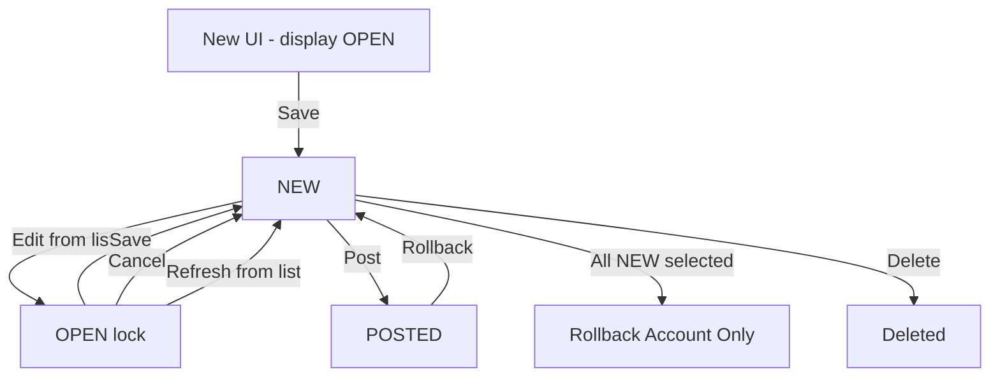
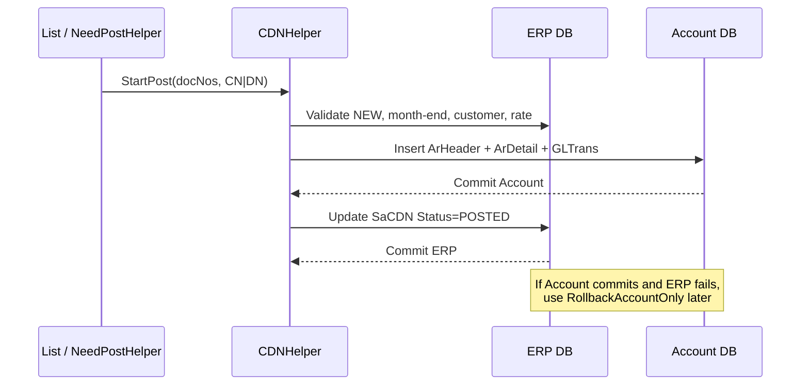

# Sales Credit / Debit Note Logic

Source of truth for porting WebForms Sales CN/DN to Blazor ERP.

Studied from:

- List: `ERP/SalesForms/CDNView.aspx.cs` (CN, screen `200.3.3`)
- List: `ERP/SalesForms/DNView.aspx.cs` (DN, screen `200.3.4`)
- Entry: `ERP/SalesForms/CNEntry.aspx.cs` (shared)
- Posting: `ERPCommonUI/SalesForms/HelperClass/CDNHelper.cs`
- BL: `ERPClasses/BL/CNDNBL.cs`, `AccCNDNBL.cs`
- Status: `ERPClasses/Utility/BatchStatusHelper.cs`
- Save+Post: `ERPCommonUI/Helper/NeedPostHelper.cs`
- Adapters: `ERPClasses/Classes/CAdapter.cs` (`SetSaCDN`, `SetSaCDNDetail`)
- List view: `ERPSQL_DB/SQLView/vgridCDN.txt`

CN and DN share one entry screen and one ERP header/detail pair. List pages only differ by `Type`. Save stays in the ERP database. Posting writes AR + GL in the **Account** database. Status `OPEN` is an edit lock, not a business state.

---

## 1. Screens and how they connect

| Screen | File | Screen ID | What it is |
|---|---|---|---|
| Credit Note list | `CDNView.aspx` | `200.3.3` | Grid of `vgridCDN` where `Type='CN'` |
| Debit Note list | `DNView.aspx` | `200.3.4` | Same grid, `Type='DN'` |
| Shared entry | `CNEntry.aspx` | CN=`200.3.3`, DN=`200.3.4` | Query: `?DOCType=CN\|DN&Type=New\|Edit\|View&ID={DocNo}` |

Both lists inherit `CommonListForm` and open the same entry:

- New CN: `CNEntry.aspx?DOCType=CN&Type=New`
- New DN: `CNEntry.aspx?DOCType=DN&Type=New`
- Edit/View: `&ID={DocNo}&Type=Edit|View`

DN entry hides Customer Return (`CNHeader.HideCustReturn()`).

**List source:** `vgridCDN` = `SaCDN` left join `vSaCustAcc` (short name). Filter by `Type`.

**Two databases:**

| Database | Tables |
|---|---|
| **ERP** | `SaCDN`, `SaCDNDetail`, numbering, invoice, item, attachments |
| **Account** | `SaCust`, `SaTaxGroup`, `SaCurrRate`, `ArCreditNoteHeader/Detail`, `ArDebitNoteHeader/Detail`, `GLTrans` |

That split is why posting and rollback are two-phase, and why “rollback account only” exists.

---

## 2. Business meaning

**Credit Note (CN)** reduces what the customer owes (sales return / allowance). Default item GL is `AdPara.SalesGLCode2` (return/discount). If `InvNo` is filled, the CN knocks off that invoice in AR.

**Debit Note (DN)** increases what the customer owes (extra charge). Default item GL is `AdPara.SalesGLCode1` (sales). Customer Return is not used.

**Stock is not moved.** Month-end is **not** checked on save (comment: CN/DN is not stock). It **is** checked on post and rollback.

---

## 3. Status lifecycle

```
UI New  → screen shows OPEN, nothing in DB
Save    → Status = NEW          (ERP only)
Edit    → Status = OPEN         (lock; others cannot edit)
Cancel  → Status = NEW
Refresh → OPEN → NEW            (abandoned edit)
Post    → POSTED                (ERP + Account)
Rollback→ NEW                   (ERP + delete Account)
```

| Status | Meaning | Allowed |
|---|---|---|
| **NEW** | Saved, not posted | Edit, Delete, Post. Rollback only if leftover AR rows (“account only”) |
| **OPEN** | Someone is editing | Refresh back to NEW. Not edit, delete, or post |
| **POSTED** | In AR + GL | View, print, e-invoice. Rollback if not knocked off and not e-submitted |
| **POST / OPEN** (edit check) | Treated as locked | Edit denied |

Edit from list is blocked if status is `POST`, `OPEN`, or `POSTED`. Opening Edit immediately writes `OPEN` (`UpdateEdit`). If that row is already `POSTED`, it still returns success with “Access denied” and does **not** change status.

New mode sets `CNHeader.Status = "OPEN"` on screen, but Save always writes `Status = "NEW"`. The OPEN on new is display-only until save.



---

## 4. List CRUD, post, rollback

Buttons: NEW, DELETE, PRINT, REFRESH, POST, ROLLBACK, plus e-invoice if submission type ≠ `NO`.

Rights: New / Edit / Delete / Access / Print / Post / Rollback.

E-invoice rights: Submit / Cancel / ReSubmit (`EInvoiceScreenID.CREDIT_NOTE` / `DEBIT_NOTE`).

### 4.1 Create

Opens entry. No DB insert until Save.

### 4.2 Read

Linq: `db.vgridCDNs.Where(x => x.Type == "CN"|"DN")`. View does not change status.

### 4.3 Update

Edit only if not POST/OPEN/POSTED. Sets `OPEN`, then entry Save writes `NEW` again.

### 4.4 Delete (`CDNHelper.DeleteDoc`)

- All selected must be **NEW**
- SQL: `DELETE FROM SaCDN WHERE DocNo=… AND Type=…`
- **Does not delete `SaCDNDetail`.** Port as header+detail in one transaction unless a DB cascade is confirmed.
- Audit: `CN/DN HDR` + `DTL` action `DELETE`

### 4.5 Refresh

Only **OPEN** → **NEW** (unlock abandoned edits).

### 4.6 Post (max 3 docs)

List: `CDNHelper.StartPost(keys, "CN"|"DN", company, branch, loc, user)`.

From Save+Post: `NeedPostHelper.PostCreditNote` / `PostDebitNote` — waits for a free posting slot (`TrxPostingHelper`), then same `StartPost`.

**StartPost checks:**

1. Doc exists in `SaCDN`
2. ERP month-end: `DocDate` not before `AdPara.CurrentMonth/CurrentYear`
3. Account closed: not before monthly close (`AccBranchBL.GetMonthlyClosing`) and not `<= ClosingYear`
4. Status must be **NEW**
5. Customer exists in Account `SaCust`
6. Currency rate exists in `SaCurrRate` for doc date (`HomeCurPerUnit`)

Then:

1. Open ERP + Account connections
2. Set ERP status **POSTED** in memory
3. **Commit Account first** (`Ar*Header`, `Ar*Detail`, `GLTrans`)
4. Then commit ERP `SaCDN` status

If step 3 succeeds and step 4 fails, AR exists while ERP is still NEW → **Rollback Account Only**.

`AdPara.SalesPostTotal`:

- `false` → one AR/GL line per item
- `true` → group by `ItemGLCode + TaxGroup + LMW` (`IvMasPack.LMW`)

### 4.7 Rollback (max 3 docs)

| Selection | Path |
|---|---|
| All **POSTED** | Full rollback: ERP → NEW, delete AR+GL |
| All **NEW** | `RollbackAccountOnly` — clean leftover AR |
| Mix | Error: all must be POSTED |

Blocked if e-invoice status is **Valid** or **Submitted**.

Full rollback also:

- Same month-end / account-close checks
- **Knock-off:** CN cannot rollback if another `GLTrans` has `MatchNo=CNNo`, `MatchType='CN'`, `VoucherNo <> CNNo`. DN uses `AccCNDNBL` with `MatchType='DN'`

**Existing GL rollback bug:** after loading GL rows, only **the first** `GLTrans` row is `Delete()`d. Header + all AR details are deleted. When porting, delete **all** GL lines for that voucher.



---

## 5. Entry CRUD and line logic

Session: `CDNDtl{sessionGuid}` holds `SaCDNDetail` in memory. Header is `SaCDN`.

### 5.1 New

Date=today, DocNo=`AUTO`, UI status OPEN, type=`DOCType`, rate=1, empty lines.

### 5.2 Load (Edit/View)

Header from `SaCDN`; lines from `SaCDNDetail`. Customer discount group from Account `SaCust` + ERP `SaDisGroup`.

### 5.3 Line add (`AddRow`)

Validations:

- Item code required
- Currency rate ≥ 0 (rate `< 0` rejected; `0` is allowed here, blocked on Save)
- All lines same tax inclusive/exclusive (`InvTrxHelper.CheckSameTaxType`)
- **CN + InvNo:** invoice outstanding via `sp_outStandingInv`. If invoice is **paid off** (`CheckIsInvPaid` returns true):
  - No e-invoice → **block** “This Invoice has pay off”
  - E-invoice on → allow
- After amounts: CN total must not exceed invoice **BalanceAmt** (`CheckIsExceedBalance`, 2 dp)

Then:

1. Tax % from `SaTaxGroup` (item tax, else customer if `SaCust.Taxable`)
2. If inclusive: `unitPrice = UnitPrice / (1 + tax%/100)`
3. Discount via `SalesDicountHelper` (JOIN vs SPLIT, % vs amount)
4. `Amount = Qty * unitPrice` (2 dp, or 0 dp if `SaCust.DecPoint`)
5. `NetAmount = Qty * (unitPrice - discount)` (inclusive discount is tax-stripped)
6. Tax exclusive: `TaxAmt = NetAmount * tax%/100`; inclusive: tax = (qty × (list − discount)) − NetAmount
7. `CostPrice` from nearest `IvBalLoc.UnitPrice` vs header date (else selling price)
8. Document tax rounding: `InvTrxHelper.TableRounding`

**Barcode:** same math, exclusive only, qty += 1 if same item already on the CN.

**Copy invoice (`AddAllInvRow`):** copies `SaInvoiceDetail` amounts as-is. GL still defaults: DN=`SalesGLCode1`, CN=`SalesGLCode2`. Balance check after all lines.

**Load selected invoice line (`LoadSelectInvRow`):** copies one `SaInvoiceDetail` line into the item editor (not yet added until user clicks Add).

**Customer return (CN only, `AddCR`):** from `IvTrxHistory` by batch. Skip `ReturnType = 'Re-Supply'`. Price/discount from latest `SaSODetail` if `SO_No` exists.

**UOM change:** `SalesCommonHelper.GetUnitPriceByUOM` → price + pack size; `StdQty = Qty * pack`.

### 5.4 Copy posted invoice header (`GetSelectedInvoice`)

Loads from `SaInvoice` where `Status='POSTED'`:

- InvNo, DONo, ProjID
- Customer code/name/addresses/tax/term/currency/rate/salesman/remarks
- Discount method/seq from `vSaCust`

### 5.5 Save (`Save(needPost)`)

1. Rate must be set; if currency ≠ `AdPara.HMCurrCode`, rate cannot be 1
2. At least one detail row (`CCommon.CheckRecordAlreadyAdd`)
3. Recalc totals; `TaxAdaptiveRounding`; header tax/total from details
4. Header vs detail total must match (`IsTotalAmountTally`)
5. If DocNo=`AUTO`: `CCommon.GenerateAutoNumberWithDateEx(Type+Prefix, AdSmNumDate, year, month)` then bump sequence
6. Write header **Status = NEW** (always, even if UI showed OPEN)
7. Stamp company/branch/location, customer, amounts, salesman, dept, project
8. NEW: remap `SaSalesAttach` from `DocNo='AUTO'` to real number
9. One ERP transaction: `SaCDN` + `SaCDNDetail` + `AdSmNum` + `AdSmNumDate`
10. If Save+Post (`SAVE:yes`): `NeedPostHelper.PostCreditNote/PostDebitNote`
11. Audit log header + detail changes

**Month-end is intentionally not validated on save.**

Numbering prefix:

```
strPrefix = CNHeader.CNType + CNHeader.CNPrefix
```

Example: Type `CN` + prefix `A` → `NumCd = CNA` in `AdSmNumDate`.

### 5.6 Cancel

- Edit → status back to NEW
- New → delete attachments uploaded under `AUTO`

---

## 6. Amounts (copy exactly)

```
Amount     = Qty × exclusiveUnitPrice
NetAmount  = Qty × (exclusiveUnitPrice − discountPerUnit)
TaxAmt     = exclusive: NetAmount × tax%
             inclusive: Qty × (listPrice − discount) − NetAmount
GrossAmnt  = Σ NetAmount          (header, ex tax)
Taxes      = Σ TaxAmt
TotAmnt    = GrossAmnt + Taxes    (what posts to AR)
Local*     = amount × CurrRate    (2 dp, AwayFromZero)
```

`SaCust.DecPoint = true` → round money to 0 decimals (whole currency).

Tax percent is **0** when `SaCust.DecPoint = true` (tax lookup skipped).

### Inclusive unit price

```
exclusiveUnitPrice = UnitPrice / (1 + taxPercent / 100)
```

### Inclusive net when discount exists

```
NetAmount = Qty × (exclusiveUnitPrice − (discount / (1 + taxPercent / 100)))
```

### Discount fields on the line

| Column | Meaning |
|---|---|
| `IDiscountType` | `AMOUNT` or `PERCENTAGE` |
| `ItemDiscount`, `ItemDiscount1` | amount discounts |
| `ItemDiscount2`…`6` | % discounts (UI Disc, Disc1…Disc4) |

`SalesDicountHelper.CalculateDiscount` uses customer `DiscountMethod` (`JOIN` / `SPLIT`) plus customer % and item discounts.

### Pricing source (`AdPara.UseItemMaster`)

| Value | Lookup |
|---|---|
| `1` | Master item price |
| `2` | Customer group price |
| `4` | Customer product, then group, then master |
| else | Customer product price |

### Cost price (`IvBalLoc`)

1. `TransDate <= header date`, order by date desc (nearest past)
2. If none: `TransDate >= header date`, order by date asc (nearest future)
3. If still none: use selling `UnitPrice`

---

## 7. Posting to Account

AR header GL = customer **`SaCust.TaxGrCode`** (debtor control), not sales tax.

Department posted = `SaCDN.Dept`, or `ProjID` if `web.config PostProjAsDept=TRUE`.

Analysis (`LMW`) from `IvMasPack`.

Local amounts = base × `SaCDN.CurrRate` (not live `SaCurrRate` at post time — rate is taken from the document).

### 7.1 Credit Note GL (`VoucherType='CN'`)

| Line | DebitCredit | GL | Amount |
|---|---|---|---|
| Debtor | **C** | customer TaxGrCode | `TotAmnt` |
| Each item | **D** | `ItemGLCode` | `NetAmount` |
| Each tax | **D** | `SaTaxGroup.GLCode` | `TaxAmt` (skip if no tax GL) |
| 1-sen adjust | C or D | first line tax GL | ΣDebit − ΣCredit |

Knock-off: if `InvNo` filled → `MatchType='IN'`, `MatchNo=InvNo`; else `MatchType='CN'`, `MatchNo=DocNo`.

AR tables: `ArCreditNoteHeader` (`CreditNo`), `ArCreditNoteDetail` (`CreditNoteNo`, `ChargeCode='STOCK'`).

Header mapping (detail-post path):

| AR header | From |
|---|---|
| CreditNo | SaCDN.DocNo |
| Type | `AR` |
| TxnDate | DocDate |
| Term | numeric from PayCode |
| DebtorCode | CustCode |
| CompanyName | CustName |
| Address1–3 | InvAddress1–3 |
| GLCode | SaCust.TaxGrCode |
| CurrencyCode / ExRate | Currency / CurrRate |
| BaseAmount | TotAmnt |
| LocalAmount | TotAmnt × CurrRate |
| Remark | Remarks, else `"Sales Credit Note"` |
| Status | `POSTED` |
| ExternalDocNo | ExternalDocNo |
| IsOpeningBalance | 0 |

Detail mapping:

| AR detail | From |
|---|---|
| CreditNoteNo | DocNo |
| ItemNo | Line |
| InvoiceNo | header InvNo |
| ChargeCode | `STOCK` |
| GLCode | ItemGLCode |
| BaseAmount | NetAmount |
| LocalAmount | NetAmount × CurrRate |
| LocalTaxAmount | TaxAmt × CurrRate |
| TaxGroup | line TaxGroup |
| UOM | SellingUOM |
| DepartmentCode | Dept or ProjID |
| AnalysisCode | LMW |
| Remark | IDesc |

### 7.2 Debit Note GL (`VoucherType='DN'`) — signs flipped

| Line | DebitCredit | GL |
|---|---|---|
| Debtor | **D** | customer TaxGrCode |
| Item | **C** | ItemGLCode |
| Tax | **C** | tax GL |

Detail posting currently sets `MatchType='CN'` and `MatchNo=DN DocNo` (self-match, not invoice). Copy as-is unless knock-off is deliberately changed.

AR tables: `ArDebitNoteHeader` (`DebitNo`), `ArDebitNoteDetail`.

### 7.3 `SalesPostTotal = true`

- Uses `AdPara.SalesGLCode1` as fallback sales GL
- One AR/GL row per `ItemGLCode + TaxGroup + LMW` group
- Local-amount remainder applied to the last group so Σ local = header local total

---

## 8. Validation cheat sheet for Blazor

### Save

- Login company/branch/location
- Customer exists
- ≥1 line
- Currency rate > 0; foreign currency rate ≠ 1
- Header total = Σ(NetAmount+TaxAmt)
- Auto number unique; `AdSmNumDate` must exist for `NumCd = Type+Prefix`
- Mixed inclusive/exclusive tax forbidden
- CN + InvNo: not over invoice outstanding (and not fully paid unless e-invoice)

### Post

- Status NEW
- ERP month not closed
- Account month/year not closed
- Currency rate in `SaCurrRate`
- Max 3 documents
- Post right + posting mutex

### Rollback

- All POSTED, or all NEW (account-only)
- Not Valid/Submitted e-invoice
- No knock-off on other vouchers
- Month/account not closed
- Max 3

### Delete

- All NEW only

### E-invoice (list)

- Submit: not Valid/Submitted; Invalid/Cancelled must use Re-submit
- Cancel: must be Valid
- Re-submit: only Invalid/Cancelled
- Status poll: `SaCDN.IRBMStatus='SUBMITTED'`

---

## 9. Tables and fields

### 9.1 ERP `SaCDN` (header) — PK `DocNo`

| Field | Type | Role |
|---|---|---|
| DocNo | nvarchar(20) PK | Number (`AUTO` until save) |
| DocDate | datetime | Trx date |
| Status | nvarchar(10) | NEW / OPEN / POSTED |
| Type | nvarchar(20) | **CN** or **DN** |
| Prefix | nvarchar(5) | User prefix; numbering key = Type+Prefix |
| InvNo | nvarchar(20) | Optional original invoice |
| DONo | nvarchar(200) | Optional DO |
| RefNo | nvarchar(20) | Reference |
| ExternalDocNo | nvarchar(20) | External / e-invoice |
| CustCode | nvarchar(20) | Customer |
| CustName | nvarchar(60) | |
| InvAddress1–4 | nvarchar(40) | Bill-to |
| City, State | nvarchar(30) | |
| PostalCode | nvarchar(10) | |
| Country | nvarchar(30) | |
| Tel, Fax | nvarchar(30) | |
| PayCode | nvarchar(20) | Term (numeric days extracted for AR) |
| Currency | nvarchar(5) | |
| CurrRate | float | Doc rate |
| TaxGrCode | nvarchar(10) | Customer tax group (header) |
| Remarks | nvarchar(1000) | |
| GrossAmnt | float | Σ NetAmount |
| Taxes | float | Σ TaxAmt |
| TotAmnt | float | Gross + tax (posts to AR) |
| SalesRep | nvarchar(10) | |
| Dept | nvarchar(20) | Posted as DepartmentCode |
| ProjID | nvarchar(20) | Optional PostProjAsDept |
| CompanyCode | nvarchar(2) | Tenant |
| BranchCode | nvarchar(2) | |
| LocationCode | nvarchar(2) | |
| UserID | nvarchar(10) | Created by |
| Created | datetime | |
| UpdatedUID | nvarchar(10) | |
| Updated | datetime | |
| ExportStatus | bit | |
| IRBMSubmitID | nvarchar(30) | MyInvois submission |
| IRBMUUID | nvarchar(30) | |
| IRBMORIUUID | nvarchar(30) | Original invoice UUID |
| IRBMStatus | nvarchar(30) | |
| IRBMError | nvarchar(250) | |
| IRBMSentOn | datetime | |
| IRBMValidOn | datetime | |
| IRNMCancelOn | datetime | |

`CAdapter.SetSaCDN` update/insert WHERE is `DocNo` only (no Type in PK). Queries always also filter `Type`.

### 9.2 ERP `SaCDNDetail` — PK `(DocNo, Line)`

| Field | Type | Role |
|---|---|---|
| DocNo | nvarchar(20) | |
| Line | smallint | |
| ICode | nvarchar(20) | |
| IDesc | nvarchar(1000) | Posted as AR detail remark |
| CustICode | nvarchar(20) | |
| CustPO | nvarchar(30) | |
| Qty | float | Selling qty |
| SellingUOM | nvarchar(5) | |
| StdQty | float | Stock qty |
| StdUOM | nvarchar(5) | |
| StdCustPSize | float | Pack size |
| WtQty | float | Catch weight |
| WtUOM | nvarchar(5) | |
| UnitPrice | float | List / entered price |
| Amount | float | Qty × exclusive unit |
| Discount | float | Amount − NetAmount |
| NetAmount | float | After discount, before tax |
| TaxAmt | float | |
| TaxGroup | nvarchar(10) | Line tax |
| IsInclusive | bit | |
| ItemGLCode | nvarchar(10) | Posted to AR/GL |
| ItemDiscount | float | Amount disc 1 |
| ItemDiscount1 | float | Amount disc 2 |
| ItemDiscount2 | float | % disc 1 |
| ItemDiscount3 | float | % disc 2 |
| ItemDiscount4 | float | % disc 3 |
| ItemDiscount5 | float | % disc 4 |
| ItemDiscount6 | float | % disc 5 |
| IDiscountType | nvarchar(10) | `AMOUNT` / `PERCENTAGE` |
| IDiscountType1 | nvarchar(10) | unused, stored empty |
| CostPrice | decimal | From `IvBalLoc` (not posted) |
| Classification | nvarchar(3) | e-invoice class |
| Remarks | nvarchar(1000) | |

Computed in grid only (not stored): `LocalAmount = CurrRate×NetAmount`, `AmountWTax = NetAmount+TaxAmt`.

### 9.3 List view `vgridCDN`

```sql
SELECT ROW_NUMBER() OVER (ORDER BY DocDate, DocNo) AS RowIndex,
       DocDate, DocNo, Type, InvNo, DONo, a.CustCode, a.CustName, Status,
       a.SalesRep, a.UserID, a.Created, a.UpdatedUID, a.Updated,
       TotAmnt, GrossAmnt, a.Dept, a.ProjID,
       a.InvAddress1, a.InvAddress2, a.InvAddress3, a.InvAddress4,
       Taxes, RefNo, b.CustShortName, a.ExternalDocNo,
       a.Tel, a.PostalCode, a.State, a.City, a.Country, a.Fax,
       a.Currency, a.CurrRate, a.TaxGrCode, a.PayCode, a.Remarks,
       a.IRBMSubmitID, a.IRBMORIUUID, a.IRBMUUID,
       a.IRBMSentOn, a.IRBMValidOn, a.IRBMError, a.IRBMStatus
FROM SaCDN AS a
LEFT OUTER JOIN vSaCustAcc AS b
  ON a.CustCode = b.CustCode
 AND a.CompanyCode = b.CompanyCode
 AND a.BranchCode = b.BranchCode
```

### 9.4 Account tables (on post)

| Table | Key | Module |
|---|---|---|
| `ArCreditNoteHeader` | CreditNo + Company + Branch | CN |
| `ArCreditNoteDetail` | CreditNoteNo + ItemNo | CN |
| `ArDebitNoteHeader` | DebitNo + Company + Branch | DN |
| `ArDebitNoteDetail` | DebitNoteNo + ItemNo | DN |
| `GLTrans` | VoucherNo + ItemNo | `ModuleType='AR'`, `VoucherType='CN'\|'DN'` |

### 9.5 Lookups / numbering / attachments

| Table | DB | Use |
|---|---|---|
| SaCust | Account | Customer, addresses, tax, terms, DecPoint, Taxable, discount |
| SaTaxGroup | Account | Tax % and tax GL |
| SaCurrRate / sySaCurrRate | Acc / ERP view | Rate by date |
| IvMas, IvMasPack | ERP | Item, SellingGLCode, Classification, LMW |
| IvBalLoc | ERP | CostPrice |
| SaInvoice / SaInvoiceDetail | ERP | Copy invoice |
| IvTrxHistory | ERP | Customer return batch |
| SaSODetail | ERP | Return price from SO |
| SaDisGroup | ERP | Group discount % |
| AdPara | ERP | Defaults, GLs, `SalesPostTotal`, month-end |
| AdSmNumDate | ERP | Auto number by Type+Prefix+year+month |
| SaSalesAttach | ERP | Files; NEW uses DocNo=`AUTO` |
| vgridCDN | ERP view | List |
| SaDocSubmission | ERP | e-invoice portal longId |

Default GLs: **DN → `AdPara.SalesGLCode1`**, **CN → `AdPara.SalesGLCode2`**. If item has `SellingGLCode`, that wins.

### 9.6 `AdPara` flags used

| Field | Effect |
|---|---|
| UseItemMaster | Price lookup path |
| DiscountFromGross | Header/UI discount base |
| SalesItemTaxInclusive | Default inclusive flag |
| SalesTaxDec | Tax decimal places |
| SalesGLCode1 | DN default GL |
| SalesGLCode2 | CN default GL |
| UseWeight | Show catch-weight |
| ShowMoreDicounts | Extra % discount columns |
| SalesPostTotal | Line vs grouped AR/GL post |
| HMCurrCode | Home currency (rate=1 check) |
| CurrentMonth / CurrentYear | ERP month-end (post/rollback) |

---

## 10. E-invoice (list only)

Enabled when `ClientSecretStore.getSubmissionType() != "NO"`.

| Action | Rule |
|---|---|
| E-SUBMIT | Not Valid/Submitted. Invalid/Cancelled must Re-submit |
| E-RESUBMIT | Only Invalid/Cancelled |
| E-CANCEL | Must be Valid |
| E-STATUS | Poll all `SaCDN` where `IRBMStatus='SUBMITTED'` and matching Type |
| UUID click | Valid/Cancelled → portal share URL; Invalid → error page; Submitted → refresh status |

Submit payload (`SubmitInfo`):

- compCode, branchCode, locCode, userId, custCode, docNo
- docType = creditnote (CN) / debit note equivalent on DN view
- oriInvNo = `InvNo`
- oriInvUUID left blank in current CN code

Rollback is blocked while IRBM status is Valid or Submitted.

---

## 11. Suggested Blazor modules (same behavior)

1. **CndnList** — filter `Type`, status, rights, max-3 post/rollback
2. **CndnEntry** — header/lines in memory; Save → NEW; Edit lock OPEN
3. **CndnAmountService** — tax inclusive, discount JOIN/SPLIT, rounding, adaptive tax
4. **CndnPostingService** — Account first, then ERP status; `SalesPostTotal` both paths; CN vs DN sign flip
5. **CndnRollbackService** — knock-off check; delete **all** GL rows; account-only path
6. **NumberingService** — `AdSmNumDate` with `NumCd = CN/DN + Prefix`
7. **InvoiceBalanceService** — `sp_outStandingInv` + exceed-balance

Keep CN and DN as one document type with `Type` and opposite GL signs, not two schemas.

---

## 12. Quirks to decide when porting

1. Delete currently drops **header only** — delete details too.
2. Rollback currently deletes **one** GL row — delete all for that voucher.
3. Account commit **before** ERP status — keep the two-phase design or wrap both DBs in a saga.
4. `CheckIsInvPaid` = true means **fully paid** (not in outstanding), not “has a payment”.
5. Save skips month-end; post/rollback do not.
6. DN GL `MatchType` is `'CN'` in line posting — copy as-is or fix knock-off.
7. `OPEN` is a pessimistic lock, not a workflow state.
8. CN `StartPost` uses `GetHomeCurrUnit` against Account `SaCurrRate`; entry rate comes from ERP view `sySaCurrRate`.
9. `CAdapter` SaCDN delete/update keys on `DocNo` only (no Type).
10. Max 3 documents per post/rollback.
11. Mixed inclusive/exclusive tax not allowed on one document.
12. Customer Return is CN-only; skip `ReturnType = 'Re-Supply'`.

---

## 13. Code map

| Concern | Class / method |
|---|---|
| CN list actions | `MRP.SalesForms.CDNView` |
| DN list actions | `MRP.SalesForms.DNView` |
| Entry save/lines | `MRP.SalesForms.CNEntry` |
| Post / rollback / delete | `MRP.SalesForms.HelperClass.CDNHelper` |
| Invoice paid / exceed / knock-off | `ERPClasses.BL.CNDNBL` |
| DN knock-off | `ERPClasses.BL.AccCNDNBL.CheckSalesDNCanRollBack` |
| Status helpers | `MRP.Utility.BatchStatusHelper` (`enDocument.CNDN`) |
| Save then post | `NeedPostHelper.PostCreditNote` / `PostDebitNote` |
| Tax rounding | `InvTrxHelper.TableRounding` / `TaxAdaptiveRounding` |
| Discount | `SalesDicountHelper.CalculateDiscount` |
| Numbering | `CCommon.GenerateAutoNumberWithDateEx` / `UpdateSequenceNoWithDateEx` |
| CRUD SQL | `CAdapter.SetSaCDN` / `SetSaCDNDetail` |
| AR/GL adapters | `CAdapter.SetArCreditNoteHeader/Detail`, `SetArDebitNoteHeader/Detail`, `SetGLTrans` |
