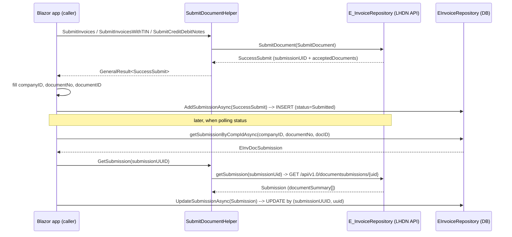

# EInvDocSubmission — Creation & Update Logic

> Purpose: document how the `EInvDocSubmission` table is **created** (on submit) and **updated** (on status poll), so this logic can be copied into another Blazor Server app.
>
> `EInvDocSubmission` is the e-invoice submission history. One record is written for every submission (invoice, CN/DN, self-billed invoice, self-billed CN/DN), then updated when the e-invoice status is fetched, keyed by `submissionUUID` + `uuid`.

---

## 1. The two implementations (important distinction)

There are **two parallel implementations** of `EInvDocSubmission` in this solution:

| Layer | Entity | Context | Repository | Purpose |
|---|---|---|---|---|
| `MPosERP.eInvoiceLib` (the library) | `BL/Entity/SaDocSubmission.cs` | `BL/DataContext/EInvoiceContext.cs` | `BL/Repository/EInvoiceRepository.cs` | **Self-contained** e-invoice logic — this is what you copy |
| `MPosERP.Business` (main ERP app) | `MPosERP.Data/Models/Sales/EinvDocSubmission.cs` | `MPosFNBDEVContext` | `Repository/Sales/EinvDocSubmissionReposiory.cs` | Richer variant with extra columns (`direction`, `supplierTIN`, `buyerTIN`, etc.) |

The library version is the minimal, portable one. This document focuses on it, then notes the differences.

---

## 2. Table schema (entity)

The library entity `MPosERP.eInvoiceLib/BL/Entity/SaDocSubmission.cs`:

```csharp
[Table("EInvDocSubmission", Schema = "dbo")]
public partial class EInvDocSubmission
{
    [Key]
    [DatabaseGenerated(DatabaseGeneratedOption.Identity)]
    public int ID { get; set; }
    public string? uuid { get; set; }              // LHDN document UUID (26 chars)
    public string? submissionUUID { get; set; }     // submission UID (batch id)
    public string? longId { get; set; }             // shareable long id
    public string? internalId { get; set; }         // your invoice/code number
    public string? typeName { get; set; }           // e.g. "invoice"
    public string? typeVersionName { get; set; }    // e.g. "1.0"
    public string? issuerTin { get; set; }
    public string? issuerName { get; set; }
    public string? receiverId { get; set; }
    public string? receiverName { get; set; }
    public DateTime? dateTimeIssued { get; set; }
    public DateTime? dateTimeReceived { get; set; }
    public DateTime? dateTimeValidated { get; set; }
    public decimal? totalSales { get; set; }
    public decimal? totalDiscount { get; set; }
    public decimal? netAmount { get; set; }
    public decimal? total { get; set; }
    public string? status { get; set; }             // Submitted / Valid / Invalid / Cancelled
    public DateTime? cancelDateTime { get; set; }
    public DateTime? rejectRequestDateTime { get; set; }
    public string? documentStatusReason { get; set; }
    public string? createdByUserId { get; set; }
    public string? document { get; set; }           // raw JSON of the document
    // --- transaction linkage (set by your app, not by LHDN) ---
    public string? companyID { get; set; }
    public string? documentNo { get; set; }
    public int? documentID { get; set; }
    public string? documentType { get; set; }       // "POS" in the register flow; drives the trigger
}
```

The **business-layer** entity (`MPosERP.Data/Models/Sales/EinvDocSubmission.cs`) maps the same table but uses PascalCase properties with explicit `[Column]` attributes, plus extra columns:

`supplierTIN`, `supplierName`, `buyerName`, `buyerTIN`, `receiverTIN`, `receiverIDType`, `submissionChannel`, `intermediaryName`, `intermediaryTIN`, `intermediaryROB`, `issuerID`, `issuerIDType`, `documentCurrency`, `direction`.

---

## 3. The DbContext

`MPosERP.eInvoiceLib/BL/DataContext/EInvoiceContext.cs`:

```csharp
public class EInvoiceContext : DbContext
{
    public virtual DbSet<EInvDocSubmission> EInvDocSubmissions { get; set; }

    protected override void OnModelCreating(ModelBuilder modelBuilder)
    {
        modelBuilder.Entity<EInvDocSubmission>(entity =>
        {
            entity.ToTable(tb => tb.HasTrigger("tr_EInvDocSubmission_ForInsert"));
        });
    }
}
```

Note the **trigger registration** — EF must be told about `tr_EInvDocSubmission_ForInsert` because that trigger writes back to `POSSalesOrder` (see §8). If you copy this, either register the trigger in `OnModelCreating` or remove it if the new DB has no such trigger.

---

## 4. CREATE — `AddSubmissionAsync`

`MPosERP.eInvoiceLib/BL/Repository/EInvoiceRepository.cs` (lines 198–234):

```csharp
public async Task AddSubmissionAsync(SuccessSubmit submit)
{
    try
    {
        EInvDocSubmission doc = new EInvDocSubmission();
        doc.submissionUUID = submit.submissionUID;
        doc.companyID      = submit.companyID;
        doc.documentID     = submit.documentID;
        doc.documentNo     = submit.documentNo;
        doc.documentType   = "POS";                    // <-- hardcoded here

        if (submit.acceptedDocuments.Count > 0)
        {
            doc.uuid       = submit.acceptedDocuments[0].uuid;
            doc.internalId = submit.acceptedDocuments[0].invoiceCodeNumber;
        }

        using (var db = await CreateDbContext())
        {
            var found = await db.EInvDocSubmissions
                .Where(x => x.submissionUUID == doc.submissionUUID && x.uuid == doc.uuid)
                .FirstOrDefaultAsync();

            if (found == null)
            {
                doc.status         = "Submitted";
                doc.dateTimeIssued = DateTime.Now;
                db.Add(doc);
                await db.SaveChangesAsync();
            }
        }
    }
    catch (Exception ex) { _logger.LogError(ex.Message, ex); }
}
```

**Key points:**

- Called **only after a successful submit** (the LHDN API accepted the document).
- Record is keyed by `(submissionUUID, uuid)` — this pair is the "natural key" used everywhere.
- Dedup: if a record with that pair already exists, nothing is inserted.
- Only 5 fields come from the submit transaction (`submissionUUID`, `companyID`, `documentID`, `documentNo`, `documentType`) plus `uuid` + `internalId` from the first **accepted** document.

The input model `SuccessSubmit` (`Model/Document/SubmitDocument.cs`):

```csharp
public class SuccessSubmit
{
    public string submissionUID { get; set; }
    public string? companyID { get; set; }
    public string? documentNo { get; set; }
    public int? documentID { get; set; }
    public List<AcceptedDocuments> acceptedDocuments { get; set; }
    public List<RejectedDocuments> rejectedDocuments { get; set; }
}

public class AcceptedDocuments
{
    public string uuid { get; set; }               // LHDN UUID
    public string invoiceCodeNumber { get; set; }  // your code number
}
```

> ⚠️ `companyID`, `documentNo`, `documentID` are **not** returned by the LHDN submit API — the calling app must fill them in after receiving `SuccessSubmit`. See the caller example in §7.

---

## 5. UPDATE — `UpdateSubmissionAsync`

`MPosERP.eInvoiceLib/BL/Repository/EInvoiceRepository.cs` (lines 282–333):

```csharp
public async Task UpdateSubmissionAsync(Submission submit)
{
    string uuid = "";
    if (submit.documentSummary.Count > 0)
        uuid = submit.documentSummary[0].uuid;

    using (var db = await CreateDbContext())
    {
        var found = await db.EInvDocSubmissions
            .Where(x => x.submissionUUID == submit.submissionUid && x.uuid == uuid)
            .FirstOrDefaultAsync();

        if (found != null)
        {
            var d = submit.documentSummary[0];
            found.issuerName            = d.issuerName;
            found.cancelDateTime        = d.cancelDateTime;
            found.createdByUserId       = d.createdByUserId;
            found.dateTimeIssued        = d.dateTimeIssued;
            found.dateTimeReceived      = d.dateTimeReceived;
            found.dateTimeValidated     = d.dateTimeValidated;
            found.document              = d.document;
            found.documentStatusReason  = d.documentStatusReason;
            found.internalId            = d.internalId;
            found.issuerTin             = d.issuerTin;
            found.longId                = d.longId;
            found.netAmount             = d.netAmount;
            found.receiverId            = d.receiverId;
            found.receiverName          = d.receiverName;
            found.rejectRequestDateTime = d.rejectRequestDateTime;
            found.total                 = d.total;
            found.totalDiscount         = d.totalDiscount;
            found.totalSales            = d.totalSales;
            found.typeName              = d.typeName;
            found.typeVersionName       = d.typeVersionName;
            found.status                = d.status;
            await db.SaveChangesAsync();
        }
    }
}
```

**Key points:**

- Called **after fetching the submission status** from LHDN.
- Lookup is again by `(submissionUUID, uuid)`.
- `uuid` and `submissionUUID` are **not** re-written (they are the lookup key); everything else from `documentSummary[0]` is copied onto the tracked entity.

The status model `Submission` / `DocumentSummary` (`Model/Document/Submission.cs`) is the deserialized response of `GET /api/v1.0/documentsubmissions/{submissionUid}`.

---

## 6. Lookup helpers

```csharp
// By (submissionID, uuid)
public async Task<EInvDocSubmission?> getSubmissionAsync(string submissionID, string uuid)
    => await db.EInvDocSubmissions
        .Where(x => x.submissionUUID == submissionID && x.uuid == uuid)
        .FirstOrDefaultAsync();

// By transaction key, with fallback to internalId
public async Task<EInvDocSubmission?> getSubmissionByCompIdAsync(string companyID, string documentNo, int docID)
{
    var doc = await db.EInvDocSubmissions
        .Where(x => x.companyID == companyID && x.documentNo == documentNo && x.documentID == docID)
        .FirstOrDefaultAsync();

    if (doc == null)
        doc = await db.EInvDocSubmissions
            .Where(x => x.internalId == documentNo)
            .FirstOrDefaultAsync();
    return doc;
}
```

---

## 7. The full end-to-end flow (with the calling app)

The concrete call order lives in `MPos.EInvReg/Register/RegistrationForm.razor.cs`.

**Submit (create):**

```csharp
var task = eServices.SubmitInvoicesWithTIN(docs, doc.Supplier.TinNo);
var result = await task;
if (result.result != null)
{
    submitStatus = result.result;
    submitStatus.documentNo = documentNo;      // app fills these — LHDN doesn't return them
    submitStatus.companyID = companyID;
    submitStatus.documentID = info.DocID;
    await repo.AddSubmissionAsync(submitStatus);   // CREATE
}
```

**Status check (update):**

```csharp
var submission = await repo.getSubmissionByCompIdAsync(companyID, documentNo, _posSalesOrderObj.ID);
if (submission != null && submission.status.ToLower() == "submitted")
{
    var result = await eServices.GetSubmission(submission.submissionUUID);
    if (result.IsSuccess)
    {
        await repo.UpdateSubmissionAsync(result.result);  // UPDATE by (submissionUUID, uuid)
        var docStatus = result.result.overallStatus.ToLower();
        // branch: "valid" | "invalid" | "cancelled" | "submitted" | "inprogress"
    }
}
```

Flow diagram:



---

## 8. The database trigger (must not be forgotten)

`SQLDatabase_Changes/SQLAlterTable.txt`:

```sql
ALTER TABLE EInvDocSubmission ADD documentType nvarchar(3)

CREATE TRIGGER [dbo].[tr_EInvDocSubmission_ForInsert]
   ON [dbo].[EInvDocSubmission]
   AFTER INSERT, Update
AS
BEGIN
    DECLARE @documentType nvarchar(3);
    SELECT @documentType = inserted.documentType FROM INSERTED;

    IF (@documentType = 'POS')
    BEGIN
        UPDATE POSSalesOrder
        SET IRBMUUID    = inserted.uuid,
            IRBMSubmitID = inserted.submissionUUID,
            IRBMStatus   = inserted.[status],
            IRBMSentOn   = inserted.dateTimeIssued,
            IRBMValidOn  = inserted.dateTimeValidated
        FROM inserted
        WHERE inserted.documentID IS NOT NULL
          AND POSSalesOrder.ID = inserted.documentID
    END
END
```

On **both insert and update**, when `documentType = 'POS'`, the trigger propagates `uuid`, `submissionUUID`, `status`, `dateTimeIssued`, `dateTimeValidated` back into `POSSalesOrder` (via `documentID`). This is why the entity registers the trigger in `OnModelCreating`.

---

## 9. Document types (invoice / CN / DN / self-billed)

`MPosERP.eInvoiceLib/Model/InputData/DocumentHeader.cs`:

```csharp
public enum EInvoiceDocumentType
{
    invoice,       // 01 Invoice
    creditnote,    // 02 Credit Note
    debitnote,     // 03 Debit Note
    sb_invoice,    // 11 Self-billed Invoice
    sb_creditnote, // 12 Self-billed Credit Note
    sb_debitnote,  // 13 Self-billed Debit Note
}
```

The **submit entry points** (in `ISubmitDocumentHelper` / `SubmitDocumentHelper`):

| Method | Use for | Generator | LHDN code |
|---|---|---|---|
| `SubmitInvoices` / `SubmitInvoicesWithTIN` | normal invoice | `GenerateInvoice` | `01` |
| `SubmitCreditDebitNotes` | CN/DN | `GenerateCreditNote` | `02` (CN), `03` (DN), `04` (Refund) |

The type code is set inside `GenerateInvoice.createInvoiceContent()` (`_ = "01"`) and `GenerateCreditNote.Generate()` (picks `02`/`03`/`04` based on `DocumentType`). Self-billed documents reuse the same generators with a different `InvoiceTypeCode`.

**Important for your copy:** `EInvoiceRepository.AddSubmissionAsync` hardcodes `documentType = "POS"`. If the new app handles invoices/CN/DN/self-billed, set `documentType` from the transaction type (or an appropriate value) — otherwise the trigger in §8 will misbehave.

---

## 10. DI wiring (exactly what to copy)

From `MPos.EInvReg/Program.cs`:

```csharp
builder.Services.AddScoped<IConnStringService, ConnStringService>();

var sqlConnectionString = builder.Configuration.GetConnectionString("DefaultConnection");
builder.Services.AddDbContextFactory<EInvoiceContext>(options =>
    options.UseSqlServer(sqlConnectionString, o => o.EnableRetryOnFailure()));

builder.Services.AddHttpClient();

// e-invoice services (Scoped for per-request isolation)
builder.Services.AddScoped<IClientSecretStore, ClientSecretStore>();
builder.Services.AddScoped<IE_InvoiceRepository, E_InvoiceRepository>();   // LHDN API calls
builder.Services.AddScoped<ISubmitDocumentHelper, SubmitDocumentHelper>();  // submit orchestration
builder.Services.AddScoped<IEInvoiceRepository, EInvoiceRepository>();      // DB persistence (the table)
```

Note the **two different** `*EInvoiceRepository` types:

- `IE_InvoiceRepository` / `E_InvoiceRepository` → talks to the LHDN REST API (`MPosERP.eInvoiceLib/Repository/E_InvoiceRepository.cs`).
- `IEInvoiceRepository` / `EInvoiceRepository` → talks to the DB (`MPosERP.eInvoiceLib/BL/Repository/EInvoiceRepository.cs`).

Also note `EInvoiceRepository` uses `IDbContextFactory<EInvoiceContext>` and overrides the connection string at runtime via `_constrServ.GetConnectionString()` in `CreateDbContext()`:

```csharp
protected async Task<EInvoiceContext> CreateDbContext()
{
    var db = _dbFactory.CreateDbContext();
    db.Database.SetConnectionString(await _constrServ.GetConnectionString());
    return db;
}
```

This matters if the new app is multi-tenant / multi-company (the connection string is resolved per request).

---

## 11. Differences in the Business-layer variant (for reference)

`MPosERP.Business/Repository/Sales/EinvDocSubmissionReposiory.cs` has richer "upsert" helpers that populate more columns:

- `PopulateSaDocSubmission(DocumentSummary data)` — maps **all** `DocumentSummary` fields (including `totalExcludingTax`, `receiverTIN`, `issuerID`, `direction`, etc.), then finds by `Uuid` and inserts/copies.
- `PopulateDocValidation(DocumentValidatation data)` — same shape for the "document detail" API.
- `PopulateRecentDocument(RecentDocument doc)` — bulk upsert by UUID from the "recent documents" API.
- `DownloadDocuments(SearchDocumentInput query)` — paginated pull of recent docs into the table.

⚠️ **Bug to be aware of** if you copy this variant — `PopulateSaDocSubmission` has inverted logic:

```csharp
var found = db.EinvDocSubmissions.Where(x => x.Uuid == sub.Uuid).FirstOrDefault();
if (found != null)
{
    db.EinvDocSubmissions.Add(sub);      // adds a duplicate when record EXISTS
}
else
{
    found = CopyProperties.Copy<EinvDocSubmission>(sub, found); // copies onto null -> throws
}
```

This should be `if (found == null) Add(...) else Copy(...)`. The library's `AddSubmissionAsync`/`UpdateSubmissionAsync` do **not** have this bug — they correctly branch on `found == null`. If you copy the business variant, fix this.

---

## 12. Copy checklist for the new Blazor Server app

1. **Entity** — copy `EInvDocSubmission` (`SaDocSubmission.cs`), adjust columns to match your DB.
2. **DbContext** — copy `EInvoiceContext` and register it with `AddDbContextFactory` (keep the trigger registration or drop it).
3. **Models** — copy `SuccessSubmit`, `AcceptedDocuments`, `RejectedDocuments`, `Submission`, `DocumentSummary`.
4. **Repository** — copy `IEInvoiceRepository` + `EInvoiceRepository` (`AddSubmissionAsync`, `UpdateSubmissionAsync`, `getSubmissionAsync`, `getSubmissionByCompIdAsync`).
5. **DI** — register `IConnStringService`, `EInvoiceContext` factory, `IClientSecretStore`, `IE_InvoiceRepository`, `ISubmitDocumentHelper`, `IEInvoiceRepository` as scoped.
6. **Call sites** — after `SubmitInvoicesWithTIN`/`SubmitCreditDebitNotes`: fill `companyID`/`documentNo`/`documentID` into `SuccessSubmit`, then `AddSubmissionAsync`. After `GetSubmission(submissionUid)`: call `UpdateSubmissionAsync`.
7. **SQL** — create the `EInvDocSubmission` table, and (optionally) the `tr_EInvDocSubmission_ForInsert` trigger if you need write-back to a source document table.
8. **Set `documentType` correctly** per transaction type instead of hardcoding `"POS"`.

---

## Appendix: file index

| File | Role |
|---|---|
| `MPosERP.eInvoiceLib/BL/Entity/SaDocSubmission.cs` | `EInvDocSubmission` entity (library) |
| `MPosERP.eInvoiceLib/BL/DataContext/EInvoiceContext.cs` | DbContext + trigger registration |
| `MPosERP.eInvoiceLib/BL/Repository/EInvoiceRepository.cs` | Create/update/lookup of the table |
| `MPosERP.eInvoiceLib/Interface/IEInvoiceRepository.cs` | Interface for the above |

---

# Implemented in ErpWeb (2026-09-21)

ErpWeb now **owns** `dbo.EInvDocSubmission` and writes it from the e-Invoice lifecycle. Sections 1–12
above describe the **legacy** MPosERP implementation and remain as the record of the original column
names and behaviour; where they differ from what ErpWeb does, this section wins.

Plan of record: `plans/plan-einvDocSubmissionHistory.prompt.md`.
Phase 0 evidence: `docs/einvoice-history-phase0-findings.txt` (probe: `scripts/discover-einvdocsubmission.sql`).
Migration: `scripts/alter-einvdocsubmission-einvoice.sql` (additive, idempotent, applied to dev `ERPWeb`).

## What changed versus the legacy writer

| Legacy (sections 1–12) | ErpWeb |
|---|---|
| A second EF model in `ErpWeb.EInvoiceLib` mapped the table | That mapping, its `HasTrigger` registration and the four submission repository methods are **removed**. `ErpWeb.Model` + `AppDbContext` is the single EF owner. Token access and the LHDN API client are untouched |
| `documentType` hard-coded `"POS"` | `EInvoiceDocumentTypes`: **`INV` / `CN` / `DN`** (self-billed `SBI`/`SBC`/`SBD` are recognised but not wired) |
| A `tr_EInvDocSubmission_ForInsert` trigger was declared | **No trigger, and none declared.** Phase 0 probed `sys.triggers` and found none — the legacy declaration was stale. If a trigger is ever added, the EF configuration must declare `HasTrigger` or every INSERT fails with Msg 334 |
| `status` written as `"Submitted"`, then the raw API string | The `EInvoiceStatuses` constants (UPPERCASE) for new rows. Legacy Title-case rows stay readable: reads go through `EInvoiceStatuses.Normalize`, which is case-insensitive |
| `documentID` populated from the caller | **Never written.** No identity key exists on `SaInvoice`/`SaCdn`, and the legacy fallback lookup `internalId == documentNo` was not a valid identity |
| Writes happened inside the caller's save, with a silent `catch` | A dedicated writer on its **own** `DbContext`, called **after** the business commit, that never throws and logs a Warning (see *Failure behaviour*) |
| Timestamps written as local `DateTime.Now` | **UTC** throughout |

## The rules this table follows

1. **One row per submitted document within one submission.** A batch of N accepted documents creates
   N rows sharing one `submissionUUID`.
2. **Only accepted documents are recorded.** A rejected document carries no `uuid`/`internalId`, and the
   rejection is already recorded by `SaEInvoiceLog` plus the document's own `IRBMStatus`/`IRBMOutcome`.
   A submission in which everything was rejected writes **no** row, and **`REJECTED` never appears in
   this table's `status`**.
3. **Key = `(companyID, submissionUUID, documentType, documentNo)`**, enforced by the unique index
   `UX_EInvDocSubmission_Submission`. `documentType`/`documentNo` are needed because a batched
   `SubmitManyAsync` shares one `submissionUUID` and can mix CN + DN or accepted + rejected.
4. **The company code IS the tenant.** There is no separate tenant column: tenancy is the 5-character
   company code against one shared database, so the key above already contains the tenant. A
   re-submission after a rejection/cancellation gets a **new** `submissionUUID` and therefore an
   **additional** row — so the *current* row for a document is the **highest `ID`** for
   `(companyID, documentType, documentNo)`, which is what `IX_EInvDocSubmission_Document` serves.
   **Do not write "one row per document number".**
5. **`document` (the raw signed payload) is never written**, matching the `SaEInvoiceLog` security
   contract. The 14 payload-capture columns (`supplierTIN`, `buyerTIN`, `direction`, …) that the legacy
   entity never mapped *are* mapped and are populated from the submission response.

## Where the rows are written

All four hooks live in `ErpWeb.Core/EInvoice/SaEInvoiceService.cs` and call
`ErpWeb.Core/EInvoice/EInvoiceSubmissionWriter.cs`. Each one runs **after** the caller's
`SaveChangesAsync`, never before it.

| Hook | Method | Effect |
|---|---|---|
| Submit / Retry / SubmitMany | `RecordSubmitAsync` | Inserts one row per accepted document |
| Refresh | `ApplyStatusAsync` (detail payload) | Updates in place |
| Recover | `ApplyStatusAsync` (summary payload) | Upserts — establishes the row when a submit never recorded one |
| Cancel (successful only) | `ApplyStatusAsync` (`cancelOnUtc`) | `status = CANCELLED` + `cancelDateTime` |
| Repair (`RepairSubmissionAsync`, from the E-UUID click) | delegates to **Refresh** → `ApplyStatusAsync` | Inserts the row when it was never written, otherwise updates in place |

The key used by the update hooks is built from the **ERP document** (its `IRBMSubmitID`), never from a
value inside the API payload, so a stale or mismatched response cannot write into another submission's
row.

**One deliberate exception** — see [Repair on the E-UUID click](#repair-on-the-e-uuid-click) below.
When the ERP document has **no** `IRBMSubmitID` at all there is nothing to disagree with, so the API's
own `submissionUid` is adopted (and written back onto the document). `documentType`, `documentNo` and
`companyID` always remain ERP-derived, so the worst case for a bad payload is a wrongly-keyed new row,
never an overwritten correct one.

## Status and timestamps

`status` is the **document-level** status; `OverallStatus` is the **submission-level** status.

| Event | `status` | `OverallStatus` |
|---|---|---|
| Submit accepted | `SUBMITTED` (or `SUBMITTED` for the whole submission when every document was accepted) | `SUBMITTED` |
| Refresh (`submitted`/`valid`/`invalid`/`cancelled`) | mapped by `SaEInvoiceStatusMap` | unchanged |
| Recover | mapped by the same `SaEInvoiceStatusMap` | the API's `overallStatus`, upper-cased and stored **verbatim** |
| Cancel successful | `CANCELLED` | filled only when it was still empty |
| Rejected | **no row** | — |
| Transport failure | row untouched | — |

`OverallStatus` is deliberately **not** constrained to `EInvoiceStatuses.All`: it is the API's own
vocabulary (`submitted`/`inprogress`/`valid`/`invalid`/`cancelled`), it is diagnostic, and no state
machine may act on it. Timestamps are **UTC**: `CreatedOn` = first ErpWeb write, `LastSyncedOn` = last
successful MyInvois sync, `dateTimeIssued` = provisional on submit and superseded by the API value.
Display-time conversion stays with `CurrentDateService`. **`EInvoiceStatuses` is the authority for the
status vocabulary; this document is secondary.**

## Failure behaviour and concurrency

- **A history failure can never fail an e-Invoice action.** The writer owns its own `DbContext`, runs
  after the business commit, never throws, and logs a Warning naming the document and submission. The
  trade-off is that the row is not atomic with the business commit — acceptable because the row is
  *derivable*: Refresh/Recover rebuild it from the document's `IRBMSubmitID`/`IRBMUUID`. A rolled-back or
  concurrency-aborted action therefore never leaves a phantom row.
- **A blank value from the API never erases stored history.** Only non-null, non-blank incoming values
  are copied, because different MyInvois responses carry different subsets of fields. Over-long values
  are truncated to the column width rather than failing the write.
- **The unique index is the authority, not the code.** Two concurrent writes can both read "no row" and
  both insert; the writer detects the duplicate-key violation
  (`SqlErrorClassifier.IsUniqueViolation`), re-reads the winner's row on a fresh context and applies the
  same updates. The operator never sees a race.

## Schema notes worth knowing before you query this table

- `ID` is `int IDENTITY` and is the primary key (`PK_EInvDocSubmission`). Phase 0 found the legacy table
  was a **heap with no primary key at all**; the constraint was added with the migration.
- The live date columns (`dateTimeIssued`, `dateTimeReceived`, `dateTimeValidated`, `cancelDateTime`,
  `rejectRequestDateTime`) are **`datetime`**, not `datetime2`. `document` is the deprecated **`text`**
  LOB. `documentType` is only `nvarchar(3)`. `status` is **NOT NULL with no default**, so every insert
  must set it.
- Five columns were added by ErpWeb: `BranchCode`, `OverallStatus`, `DocumentCount`, `CreatedOn`,
  `LastSyncedOn`. `documentCount` is the number of documents the submission carried (the ERP batch size
  on submit; the API's value on recover — the two are not reconciled).

| `MPosERP.eInvoiceLib/Model/Document/SubmitDocument.cs` | `SuccessSubmit`, `AcceptedDocuments`, `RejectedDocuments` |
| `MPosERP.eInvoiceLib/Model/Document/Submission.cs` | `Submission`, `DocumentSummary` |
| `MPosERP.eInvoiceLib/Model/InputData/DocumentHeader.cs` | `DocumentHeader`, `EInvoiceDocumentType` |
| `MPosERP.eInvoiceLib/SubmitDoc/SubmitDocumentHelper.cs` | Submit orchestration (invoice / CN / DN) |
| `MPosERP.eInvoiceLib/Repository/E_InvoiceRepository.cs` | LHDN REST API client |
| `MPos.EInvReg/Program.cs` | DI wiring |
| `MPos.EInvReg/Register/RegistrationForm.razor.cs` | Caller example (create + update) |
| `MPosERP.Business/Repository/Sales/EinvDocSubmissionReposiory.cs` | Business-layer variant |
| `MPosERP.Data/Models/Sales/EinvDocSubmission.cs` | Business-layer entity |
| `SQLDatabase_Changes/SQLAlterTable.txt` | Table alteration + trigger SQL |

---

# Repair on the E-UUID click (ErpWeb, 2026-09-21)

Clicking the **E-UUID** cell on the sales invoice list opens the LHDN MyInvois portal tab **and**
repairs this table. The repair exists for two real failures seen in production:

1. **The row was never written.** The submission succeeded at MyInvois but the local document kept no
   `IRBMSubmitID`, so the history write had no key and silently skipped.
2. **The row has drifted.** LHDN has moved the document on (typically `SUBMITTED` → `VALID`, or a
   cancellation) and the local row still holds the old state.

## The call chain

```
SaInvoiceList.onSelectColHandle
  └─ EInvoicePortalLinkOpener.OpenAndRepairAsync
       ├─ ISaEInvoiceService.GetPortalLinkAsync(uuid)      → opens the portal tab
       └─ ISaEInvoiceService.RepairSubmissionAsync(uuid)   → repairs the history
            └─ RefreshAsync(key)      (delegated once, never duplicated)
                 ├─ GetDocumentDetail(uuid)
                 ├─ submission-id recovery when the document has none
                 ├─ ERP write-back  (SaInvoice/SaCdn IRBM*)
                 └─ EInvoiceSubmissionWriter.ApplyStatusAsync  → insert or update this row
```

The repair is **UUID-addressed** because a UUID is all the grid cell has. It resolves the document
itself: the registry is read first (`Uuid` match, current row = highest `ID`, the same rule
`GetPortalLinkAsync` uses), then `SaInvoice`/`SaCdn` are matched on `IRBMUUID` **or** `IRBMORIUUID` — the
second one matters because a re-submission moves the superseded UUID onto the "ori" column.

It **delegates to `RefreshAsync`** rather than reimplementing it. `RefreshAsync` already performs the
whole sequence above, so there is exactly one MyInvois synchronisation path, one place where the status
map is applied, and one `Refresh` audit row.

## The re-entry invariant (do not remove)

> **At most ONE repair and at most ONE portal-link retry per click.**

The normal path resolves the link, opens the tab, and only then repairs — so the click stays instant and
a repair failure can never block the portal. When the link cannot be built at all (missing row, or a
document that is not viewable yet) the repair runs first and the link is retried **once**, because that
is exactly the state the repair fixes. The retry re-resolves the link; it never repairs again. Pinned by
`EInvoicePortalLinkOpenerTests.The_repair_runs_at_most_once_when_the_link_stays_unresolvable`.

## Refusals (nothing is written)

| Condition | Behaviour |
|---|---|
| The UUID is not linked to any ERP document in this company | reported, no MyInvois call |
| The caller lacks `SUBMIT` on the owning menu | reported, no MyInvois call |
| The row names a **different branch** | reported, nothing written — the ERP write-back resolves the document by `(CompanyCode, BranchCode, InvNo)`, so a cross-branch write is not attempted |
| The document is self-billed (`SBI`/`SBC`/`SBD`) | reported as not enabled — the Purchase self-bill payload is not wired |
| Neither the ERP document nor the API supplies a submission id | reported, no row |

All of these come back as `SaEInvoiceSubmissionRepairResult.NotApplicable`/`Skipped` rather than an
error: opening the portal is the click's primary job, so a repair that could not run must not turn the
click red. A **legacy row with a blank `BranchCode`** carries no branch claim and is repaired normally.

## Which signal says "the row was repaired"

`SaEInvoiceResult.Succeeded` mirrors `RefreshAsync` — "a recognised MyInvois status was applied". It is
**not** the same as "the row was written". `HistoryWrite` (`EInvoiceHistoryWriteResult`:
`NotAttempted` / `Inserted` / `Updated` / `Skipped` / `Failed`) is the authoritative signal, and
`Skipped` vs `Failed` are kept distinct because they mean different things to an operator ("there is no
submission id to record" vs "the write itself failed").

`EInvoicePortalLinkOpener` sets `StateChanged` — "reload your grid" — when the refresh applied a status
**or** the row was inserted/updated, because the grid's E-Inv / E-Status columns come from the document,
not from this table.

## What a `Refresh` audit row means

A row in `SaEInvoiceLog` with `Action = 'Refresh'` means **"a synchronisation was requested, and this is
what MyInvois answered"**. It does **not** mean "LHDN data changed". Every E-UUID click writes one, so
an operator clicking the same UUID five times produces five identical rows. That is deliberate
traceability of who asked and when; suppressing an unchanged row is a possible future refinement, not a
current behaviour.

## Limitations worth knowing

- **This is not a mirror.** The writer copies non-null values only, so a field that was *cleared* at
  MyInvois is not cleared locally, and `status` only moves for values `SaEInvoiceStatusMap` recognises.
  "Update" means fill/overwrite, never erase.
- **A duplicate row is possible and intentional.** If the API supplies a `submissionUid` that differs
  from the row already stored for the same document, a **new** row is inserted (the re-submission rule)
  and the current row stays "the highest `ID`".
- **The click timeout does not cover the HTTP call.**
  `EInvoiceOptions.RepairPersistenceTimeoutSeconds` bounds only the persistence work, because
  `ISubmitDocumentHelper.GetDocumentDetail(string)` takes no cancellation token. Adding one is logged
  tech debt.
- **`documentID` is still never written** — `SaInvoice` has no identity key to put there.

# Sales Credit / Debit Note list parity (ErpWeb, 2026-09-22)

Plan of record: `plans/plan-saCdnEInvoiceParity.prompt.md`.

The batch e-Invoice surface that shipped on `SaInvoiceList` now exists on the CN/DN list
(`SaCdnList`, routes `/sales/credit-notes` and `/sales/debit-notes`) as well. **No new MyInvois code was
written** — `SaEInvoiceService` was already document-type agnostic, so this feature is a UI plus a query
plumbing change.

## What CN/DN already had (do not "re-add" it)

- `SaEInvoiceService.AuthorizeAsync` maps `CN -> MenuCodes.SalesCreditNote`, `DN -> MenuCodes.SalesDebitNote`.
- `LoadStateAsync` has a `CreditNote`/`DebitNote` case loading `db.SaCdns` and enforcing `cdn.Type`.
- `ResolveKeyByUuidAsync` already falls back to `db.SaCdns` on `IrbmUuid` **or** `IrbmOriUuid`, so the
  E-UUID history repair is type-agnostic.
- `SaCdn` carries the whole e-Invoice column set (`IRBMStatus`, `IRBMOutcome`, `IRBMUUID`, `IRBMORIUUID`,
  `IRBMSubmitID`, `IRBMSentOn`, `IRBMValidOn`, `IRBMError`, `IRNMCancelOn`).
- `SaCdnService` already refuses edit/delete while the e-Invoice status is locked.
- The CN/DN **entry** page already hosted `<SaEInvoicePanel>`.

## What was added

- **List columns**: `E-Inv` (`IrbmStatus`), `E-UUID` (`IrbmUuid`, link) and `E-Status` (`IrbmStatus`).
  `E-Inv` and `E-Status` deliberately render the **same** value — that is what the invoice list has
  always done; the only difference is the explicit `DataType = "string"` on the latter. There is no
  separate "submission exists" property.
- **Toolbar**: `SUBMIT` / `E-STATUS` / `CANCEL`, gated on the page's own menu (`SA_CN` / `SA_DN`) plus
  `PermissionCodes.Submit` / `Cancel`.
- **E-UUID click** → `EInvoicePortalLinkOpener.OpenAndRepairAsync`, so the CN/DN list shares the invoice
  list's one-repair/one-link-retry invariant.
- **Confirmation** with a mandatory, 300-character-limited cancellation reason, a per-row results popup,
  a progress strip with a Stop button, and the `IsEInvoiceBusy` re-entry guard.
- **`ISaEInvoiceService.RefreshSubmittedAsync(SaCdnListQuery, ...)`** — the CN/DN twin of the invoice
  no-selection E-STATUS mode. The family comes from `scope.Type`, which selects both the document family
  **and** the authorizing menu: a CN run can never touch a DN row.
- **`SaCdnQueryMapper`** — the ONE `SaCdnListQuery -> SaCdnSearchArgs` translation, mirroring
  `SaInvoiceQueryMapper`, so "what the grid shows" and "what gets refreshed" cannot drift apart. The grid
  and the refresh-all both go through it.
- **`SaEInvoiceLimits`** (`ErpWeb.Core.EInvoice`) now owns the two caps; `SaInvoiceLimits.MaxEInvoice*`
  forwards to it and a test pins the equality, so the two families cannot silently diverge.

## The shared refresh-all driver

`RunRefreshAllAsync(documentType, candidates, progress, ct)` serves BOTH families. Its contracts:

- Cap is pre-flight: an over-cap run costs one query and **zero** MyInvois calls.
- Blank `IRBMUUID` → `Skipped` with reason `Missing IRBMUUID`, never sent; never escalated to `Recover`.
- Chunks of `SaEInvoiceLimits.MaxBatchSelection` handed to the public `RefreshManyAsync`, so the
  interactive cap, per-chunk authorization and per-document semantics are unchanged.
- Cancellation is honoured **between** chunks only, and the partial aggregate is returned.
- **Failure semantics** (added with this work): one document failing never stops its chunk or a later
  chunk; a refused chunk converts the current chunk **and every remaining key** into `Failed` items; an
  exception that escapes the batch primitive is caught once per chunk and converted the same way instead
  of reaching the page and discarding completed work. That guard is the only intentional behaviour change
  to the invoice path, and the invoice refresh-all tests were kept unedited to prove it.

## Permissions

`SUBMIT` / `CANCEL` are now part of the `SA_CN` / `SA_DN` grant set in both
`scripts/init-menu-access.sql` (fresh databases) and the new, idempotent
`scripts/init-sales-cdn-einvoice-permissions.sql` (existing databases).

**Measured on dev `ERPWeb` (2026-09-22):** the four `MenuPermission` rows were ALREADY present and
active, so the new script is a verified clean no-op there (applied twice, 0 rows inserted, exit 0). The
fresh-database path is what was genuinely missing.

`MenuPermission` only makes the permission *available*: a role still needs a `dbo.RoleMenuPermission` row
with `IsAllowed = 1` (that table has no `IsActive`) before a user can submit. That grant is deliberately
manual — see the deployment runbook in the plan.

## Live data facts measured (dev `ERPWeb`, 2026-09-22)

- `dbo.SaCDN` holds **0 rows**, so the refresh-all has no candidate volume to exercise manually yet.
- `SaCDN.IRBMStatus` and the database are both `SQL_Latin1_General_CP1_CI_AS`, so the candidate predicate
  is **plain equality** and no function wraps the column (the index stays usable).

## Also fixed while here

`SaCdnService.SearchAsync` reported `LineCount = x.Details?.Count ?? 0`, but the repository query never
`Include`s `Details`, so the grid's "Lines" column was **always 0**. It now runs the same explicit grouped
count the invoice list uses, pinned by a regression test.

## Not covered

Self-billed (`SBI`/`SBC`/`SBD`) payload mapping, a `Recover` button on either list (the invoice list has
none either), and the same treatment for the Purchase CN/DN lists.

# Self-billed list parity with the sales lists (ErpWeb, 2026-09-23)

Plan of record: `plans/plan-poSbEInvoiceParity.prompt.md`.

`PoSbInvoiceList` and `PoSbCdnList` now behave — and read — like `SaInvoiceList` / `SaCdnList` on the
e-Invoice surface. **No new MyInvois call path was written:** the three families reuse the shipped
`RunRefreshAllAsync` driver verbatim, so the pre-flight cap, the blank-`IRBMUUID` skip rule, the chunk
boundary, the per-chunk refusal handling and the partial-aggregate-on-cancel semantics are the same code
the invoice and CN/DN lists already exercise.

**Sales is the reference; the self-billed lists were the deviation.** The one accepted divergence is that
the self-billed lists have no `POST` / `ROLLBACK`: there is no ERP finalisation step, because the
e-Invoice state *is* their lifecycle.

## The gap that was closed

`E-STATUS` with **nothing selected** was the missing mode. On the sales lists it refreshes every
`SUBMITTED` row the grid is showing (legacy `GetEStatus()`); on the self-billed lists it answered
`"No Record Selected!"`. Two smaller divergences went with it:

- **`E-INV` was the wrong caption.** The sales toolbar and the ERP-wide convention is `SUBMIT`. The
  caption is also the click handler's `case` key, so it had to be renamed in **all four** places per page
  (button, re-entry guard, click switch, `SetEInvoiceButtonsEnabled`).
- **The E-UUID click was hand-rolled twice** per page instead of calling the shared
  `EInvoicePortalLinkOpener.HandleUuidClickAsync`, and the `LHDN` row action fell back to the portal for a
  non-INVALID row where sales refuses. Both now match sales, so the "at most one repair and one link
  retry per click" invariant has exactly one implementation.

Also aligned: the submit confirm button style (`Primary`, was `Success`), the `LHDN` icon and tooltip,
the `E-STATUS`/`SUBMIT` tooltips, the selection-retention-on-partial-failure rule, the `IsSubmitting`
busy state during a batch, the permission check order (permission before "No Record Selected!"), and the
refusal to open a confirm popup when no selected row is eligible.

## `PoSbQueryApplier` — the ONE filter definition

The sales design's load-bearing invariant is *"what the grid shows" == "what gets refreshed"*, enforced by
one shared translation (`SaInvoiceQueryMapper` / `SaCdnQueryMapper`) feeding the repository the grid uses.
The self-billed lists have **no repository** — `PoSbInvoiceService.SearchAsync` and
`PoSbCdnService.SearchAsync` query `AppDbContext` directly.

`ErpWeb.Core/Purchase/PoSbQueryApplier.cs` is the self-billed equivalent: two `Apply` overloads holding
the tenant predicates, every list filter (ERP status and e-Invoice status are separate columns and stay
separate), the free-text search and the default sort. Both `SearchAsync` methods were rewired onto it and
the refresh-all loader uses the same two methods, so a new filter field added in one place cannot silently
diverge. Its guard is `PoSbServiceTests` (36 green, unedited).

## `RefreshSubmittedAsync` — the self-billed overload

`ISaEInvoiceService` gained a third refresh-all overload beside the invoice and CN/DN ones, and
`SaEInvoiceService` gained `LoadSbRefreshCandidatesAsync` beside `LoadCdnRefreshCandidatesAsync`. Both
delegate to `RunRefreshAllAsync`.

**Deviation from the plan, deliberate:** the family is an explicit `documentType` parameter rather than
being derived from `scope.Type`. The self-billed invoice list's grid query carries no type — the page *is*
the family — so deriving it would have meant treating a blank `Type` as "invoice", an implicit rule a
future third family would silently break. `PoSbQuery.Type` stays the ERP `CN`/`DN` token it has always
been (`CN` -> SBC, `DN` -> SBD, `SBI` -> SBI).

Authorization is checked **once**, before any query, on the family's own menu
(`PurchaseSbInvoice` / `PurchaseSbCreditNote` / `PurchaseSbDebitNote`) with `PermissionCodes.Submit`. It
deliberately does **not** require `Access`: the list screen already requires `Access` to be read at all, so
demanding it again would lock out a Submit-only role. That is also why the candidate query goes through
`PoSbQueryApplier` rather than through `IPoSbInvoiceService.SearchAsync`, which checks `Access` — pinned by
`RefreshSubmittedSb_works_for_a_submit_only_role_without_the_access_right`, which fails if the
implementation is ever rerouted that way.

A blank or unknown family is a **validation refusal**, never a throw.

## Tests

`ErpWeb.Tests/SaEInvoiceSbRefreshAllTests.cs` — 21 tests: family isolation across all three families
(including SBD, which shares `PoSbCdn` with SBC), the per-family menu check, the Submit-only authorization,
candidate set == the grid's query, status pinned to `SUBMITTED`, branch scoping, the pre-flight cap with
zero MyInvois calls, the note-family wording in the over-cap refusal, the cap boundary via
`StopOnFirstReport`, chunk progress boundaries, blank-UUID skip, chunk-boundary cancellation, an unknown
type refusal, and read-only proof (nothing submitted or cancelled).

`EInvoiceTestHost` gained `SeedSubmittedSbInvoicesAsync` / `SeedSubmittedSbNotesAsync` (the per-row seeders
are far too slow for a 200-candidate set), a `BuildSbCdn` factory extracted from `SeedSbCdnAsync` so the
single-row and bulk shapes cannot drift, and `irbmStatus` / `irbmUuid` parameters on `SeedSbCdnAsync`.

## Not covered here

- **A `Recover` button on any list** — the sales lists do not have one either; adding it to sales first.
- **The Purchase CN/DN lists** (`PoCdnList`) — a different family from the self-billed notes.
- **No browser smoke** of the new progress strip, the Stop button or the renamed toolbar was run in this
  change; the suite does not compile `.razor`, so `dotnet build ErpWeb.UI` is the only automated proof.
- **No live-DB check** of the self-billed refresh-all — the dev database's self-billed tables hold only
  development rows, and the collation question is the same one already answered for the sales tables
  (`SQL_Latin1_General_CP1_CI_AS`, so the e-Invoice status predicate is plain equality).


