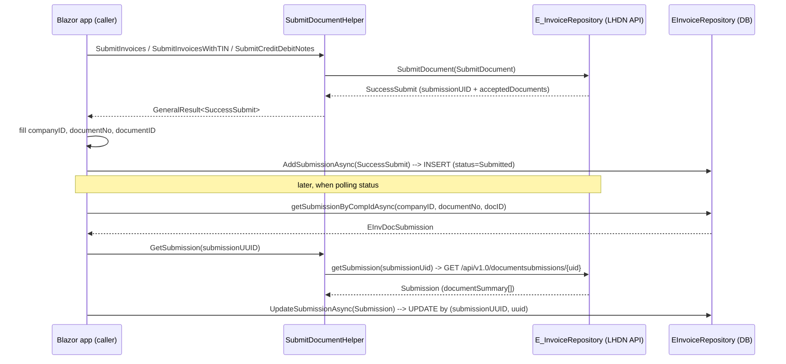

# EInvDocSubmission — Creation & Update Logic

> Purpose: document how the `EInvDocSubmission` table is **created** (on submit) and **updated** (on status poll), so this logic can be copied into another Blazor Server app.
>
> `EInvDocSubmission` is the e-invoice submission history. One record is written for every submission (invoice, CN/DN, self-billed invoice, self-billed CN/DN), then updated when the e-invoice status is fetched, keyed by `submissionUUID` + `uuid`.

---

## 1. The two implementations (important distinction)

There are **two parallel implementations** of `EInvDocSubmission` in this solution:

| Layer | Entity | Context | Repository | Purpose |
|---|---|---|---|---|
| `MPosERP.eInvoiceLib` (the library) | `BL/Entity/SaDocSubmission.cs` | `BL/DataContext/EInvoiceContext.cs` | `BL/Repository/EInvoiceRepository.cs` | **Self-contained** e-invoice logic — this is what you copy |
| `MPosERP.Business` (main ERP app) | `MPosERP.Data/Models/Sales/EinvDocSubmission.cs` | `MPosFNBDEVContext` | `Repository/Sales/EinvDocSubmissionReposiory.cs` | Richer variant with extra columns (`direction`, `supplierTIN`, `buyerTIN`, etc.) |

The library version is the minimal, portable one. This document focuses on it, then notes the differences.

---

## 2. Table schema (entity)

The library entity `MPosERP.eInvoiceLib/BL/Entity/SaDocSubmission.cs`:

```csharp
[Table("EInvDocSubmission", Schema = "dbo")]
public partial class EInvDocSubmission
{
    [Key]
    [DatabaseGenerated(DatabaseGeneratedOption.Identity)]
    public int ID { get; set; }
    public string? uuid { get; set; }              // LHDN document UUID (26 chars)
    public string? submissionUUID { get; set; }     // submission UID (batch id)
    public string? longId { get; set; }             // shareable long id
    public string? internalId { get; set; }         // your invoice/code number
    public string? typeName { get; set; }           // e.g. "invoice"
    public string? typeVersionName { get; set; }    // e.g. "1.0"
    public string? issuerTin { get; set; }
    public string? issuerName { get; set; }
    public string? receiverId { get; set; }
    public string? receiverName { get; set; }
    public DateTime? dateTimeIssued { get; set; }
    public DateTime? dateTimeReceived { get; set; }
    public DateTime? dateTimeValidated { get; set; }
    public decimal? totalSales { get; set; }
    public decimal? totalDiscount { get; set; }
    public decimal? netAmount { get; set; }
    public decimal? total { get; set; }
    public string? status { get; set; }             // Submitted / Valid / Invalid / Cancelled
    public DateTime? cancelDateTime { get; set; }
    public DateTime? rejectRequestDateTime { get; set; }
    public string? documentStatusReason { get; set; }
    public string? createdByUserId { get; set; }
    public string? document { get; set; }           // raw JSON of the document
    // --- transaction linkage (set by your app, not by LHDN) ---
    public string? companyID { get; set; }
    public string? documentNo { get; set; }
    public int? documentID { get; set; }
    public string? documentType { get; set; }       // "POS" in the register flow; drives the trigger
}
```

The **business-layer** entity (`MPosERP.Data/Models/Sales/EinvDocSubmission.cs`) maps the same table but uses PascalCase properties with explicit `[Column]` attributes, plus extra columns:

`supplierTIN`, `supplierName`, `buyerName`, `buyerTIN`, `receiverTIN`, `receiverIDType`, `submissionChannel`, `intermediaryName`, `intermediaryTIN`, `intermediaryROB`, `issuerID`, `issuerIDType`, `documentCurrency`, `direction`.

---

## 3. The DbContext

`MPosERP.eInvoiceLib/BL/DataContext/EInvoiceContext.cs`:

```csharp
public class EInvoiceContext : DbContext
{
    public virtual DbSet<EInvDocSubmission> EInvDocSubmissions { get; set; }

    protected override void OnModelCreating(ModelBuilder modelBuilder)
    {
        modelBuilder.Entity<EInvDocSubmission>(entity =>
        {
            entity.ToTable(tb => tb.HasTrigger("tr_EInvDocSubmission_ForInsert"));
        });
    }
}
```

Note the **trigger registration** — EF must be told about `tr_EInvDocSubmission_ForInsert` because that trigger writes back to `POSSalesOrder` (see §8). If you copy this, either register the trigger in `OnModelCreating` or remove it if the new DB has no such trigger.

---

## 4. CREATE — `AddSubmissionAsync`

`MPosERP.eInvoiceLib/BL/Repository/EInvoiceRepository.cs` (lines 198–234):

```csharp
public async Task AddSubmissionAsync(SuccessSubmit submit)
{
    try
    {
        EInvDocSubmission doc = new EInvDocSubmission();
        doc.submissionUUID = submit.submissionUID;
        doc.companyID      = submit.companyID;
        doc.documentID     = submit.documentID;
        doc.documentNo     = submit.documentNo;
        doc.documentType   = "POS";                    // <-- hardcoded here

        if (submit.acceptedDocuments.Count > 0)
        {
            doc.uuid       = submit.acceptedDocuments[0].uuid;
            doc.internalId = submit.acceptedDocuments[0].invoiceCodeNumber;
        }

        using (var db = await CreateDbContext())
        {
            var found = await db.EInvDocSubmissions
                .Where(x => x.submissionUUID == doc.submissionUUID && x.uuid == doc.uuid)
                .FirstOrDefaultAsync();

            if (found == null)
            {
                doc.status         = "Submitted";
                doc.dateTimeIssued = DateTime.Now;
                db.Add(doc);
                await db.SaveChangesAsync();
            }
        }
    }
    catch (Exception ex) { _logger.LogError(ex.Message, ex); }
}
```

**Key points:**

- Called **only after a successful submit** (the LHDN API accepted the document).
- Record is keyed by `(submissionUUID, uuid)` — this pair is the "natural key" used everywhere.
- Dedup: if a record with that pair already exists, nothing is inserted.
- Only 5 fields come from the submit transaction (`submissionUUID`, `companyID`, `documentID`, `documentNo`, `documentType`) plus `uuid` + `internalId` from the first **accepted** document.

The input model `SuccessSubmit` (`Model/Document/SubmitDocument.cs`):

```csharp
public class SuccessSubmit
{
    public string submissionUID { get; set; }
    public string? companyID { get; set; }
    public string? documentNo { get; set; }
    public int? documentID { get; set; }
    public List<AcceptedDocuments> acceptedDocuments { get; set; }
    public List<RejectedDocuments> rejectedDocuments { get; set; }
}

public class AcceptedDocuments
{
    public string uuid { get; set; }               // LHDN UUID
    public string invoiceCodeNumber { get; set; }  // your code number
}
```

> ⚠️ `companyID`, `documentNo`, `documentID` are **not** returned by the LHDN submit API — the calling app must fill them in after receiving `SuccessSubmit`. See the caller example in §7.

---

## 5. UPDATE — `UpdateSubmissionAsync`

`MPosERP.eInvoiceLib/BL/Repository/EInvoiceRepository.cs` (lines 282–333):

```csharp
public async Task UpdateSubmissionAsync(Submission submit)
{
    string uuid = "";
    if (submit.documentSummary.Count > 0)
        uuid = submit.documentSummary[0].uuid;

    using (var db = await CreateDbContext())
    {
        var found = await db.EInvDocSubmissions
            .Where(x => x.submissionUUID == submit.submissionUid && x.uuid == uuid)
            .FirstOrDefaultAsync();

        if (found != null)
        {
            var d = submit.documentSummary[0];
            found.issuerName            = d.issuerName;
            found.cancelDateTime        = d.cancelDateTime;
            found.createdByUserId       = d.createdByUserId;
            found.dateTimeIssued        = d.dateTimeIssued;
            found.dateTimeReceived      = d.dateTimeReceived;
            found.dateTimeValidated     = d.dateTimeValidated;
            found.document              = d.document;
            found.documentStatusReason  = d.documentStatusReason;
            found.internalId            = d.internalId;
            found.issuerTin             = d.issuerTin;
            found.longId                = d.longId;
            found.netAmount             = d.netAmount;
            found.receiverId            = d.receiverId;
            found.receiverName          = d.receiverName;
            found.rejectRequestDateTime = d.rejectRequestDateTime;
            found.total                 = d.total;
            found.totalDiscount         = d.totalDiscount;
            found.totalSales            = d.totalSales;
            found.typeName              = d.typeName;
            found.typeVersionName       = d.typeVersionName;
            found.status                = d.status;
            await db.SaveChangesAsync();
        }
    }
}
```

**Key points:**

- Called **after fetching the submission status** from LHDN.
- Lookup is again by `(submissionUUID, uuid)`.
- `uuid` and `submissionUUID` are **not** re-written (they are the lookup key); everything else from `documentSummary[0]` is copied onto the tracked entity.

The status model `Submission` / `DocumentSummary` (`Model/Document/Submission.cs`) is the deserialized response of `GET /api/v1.0/documentsubmissions/{submissionUid}`.

---

## 6. Lookup helpers

```csharp
// By (submissionID, uuid)
public async Task<EInvDocSubmission?> getSubmissionAsync(string submissionID, string uuid)
    => await db.EInvDocSubmissions
        .Where(x => x.submissionUUID == submissionID && x.uuid == uuid)
        .FirstOrDefaultAsync();

// By transaction key, with fallback to internalId
public async Task<EInvDocSubmission?> getSubmissionByCompIdAsync(string companyID, string documentNo, int docID)
{
    var doc = await db.EInvDocSubmissions
        .Where(x => x.companyID == companyID && x.documentNo == documentNo && x.documentID == docID)
        .FirstOrDefaultAsync();

    if (doc == null)
        doc = await db.EInvDocSubmissions
            .Where(x => x.internalId == documentNo)
            .FirstOrDefaultAsync();
    return doc;
}
```

---

## 7. The full end-to-end flow (with the calling app)

The concrete call order lives in `MPos.EInvReg/Register/RegistrationForm.razor.cs`.

**Submit (create):**

```csharp
var task = eServices.SubmitInvoicesWithTIN(docs, doc.Supplier.TinNo);
var result = await task;
if (result.result != null)
{
    submitStatus = result.result;
    submitStatus.documentNo = documentNo;      // app fills these — LHDN doesn't return them
    submitStatus.companyID = companyID;
    submitStatus.documentID = info.DocID;
    await repo.AddSubmissionAsync(submitStatus);   // CREATE
}
```

**Status check (update):**

```csharp
var submission = await repo.getSubmissionByCompIdAsync(companyID, documentNo, _posSalesOrderObj.ID);
if (submission != null && submission.status.ToLower() == "submitted")
{
    var result = await eServices.GetSubmission(submission.submissionUUID);
    if (result.IsSuccess)
    {
        await repo.UpdateSubmissionAsync(result.result);  // UPDATE by (submissionUUID, uuid)
        var docStatus = result.result.overallStatus.ToLower();
        // branch: "valid" | "invalid" | "cancelled" | "submitted" | "inprogress"
    }
}
```

Flow diagram:



---

## 8. The database trigger (must not be forgotten)

`SQLDatabase_Changes/SQLAlterTable.txt`:

```sql
ALTER TABLE EInvDocSubmission ADD documentType nvarchar(3)

CREATE TRIGGER [dbo].[tr_EInvDocSubmission_ForInsert]
   ON [dbo].[EInvDocSubmission]
   AFTER INSERT, Update
AS
BEGIN
    DECLARE @documentType nvarchar(3);
    SELECT @documentType = inserted.documentType FROM INSERTED;

    IF (@documentType = 'POS')
    BEGIN
        UPDATE POSSalesOrder
        SET IRBMUUID    = inserted.uuid,
            IRBMSubmitID = inserted.submissionUUID,
            IRBMStatus   = inserted.[status],
            IRBMSentOn   = inserted.dateTimeIssued,
            IRBMValidOn  = inserted.dateTimeValidated
        FROM inserted
        WHERE inserted.documentID IS NOT NULL
          AND POSSalesOrder.ID = inserted.documentID
    END
END
```

On **both insert and update**, when `documentType = 'POS'`, the trigger propagates `uuid`, `submissionUUID`, `status`, `dateTimeIssued`, `dateTimeValidated` back into `POSSalesOrder` (via `documentID`). This is why the entity registers the trigger in `OnModelCreating`.

---

## 9. Document types (invoice / CN / DN / self-billed)

`MPosERP.eInvoiceLib/Model/InputData/DocumentHeader.cs`:

```csharp
public enum EInvoiceDocumentType
{
    invoice,       // 01 Invoice
    creditnote,    // 02 Credit Note
    debitnote,     // 03 Debit Note
    sb_invoice,    // 11 Self-billed Invoice
    sb_creditnote, // 12 Self-billed Credit Note
    sb_debitnote,  // 13 Self-billed Debit Note
}
```

The **submit entry points** (in `ISubmitDocumentHelper` / `SubmitDocumentHelper`):

| Method | Use for | Generator | LHDN code |
|---|---|---|---|
| `SubmitInvoices` / `SubmitInvoicesWithTIN` | normal invoice | `GenerateInvoice` | `01` |
| `SubmitCreditDebitNotes` | CN/DN | `GenerateCreditNote` | `02` (CN), `03` (DN), `04` (Refund) |

The type code is set inside `GenerateInvoice.createInvoiceContent()` (`_ = "01"`) and `GenerateCreditNote.Generate()` (picks `02`/`03`/`04` based on `DocumentType`). Self-billed documents reuse the same generators with a different `InvoiceTypeCode`.

**Important for your copy:** `EInvoiceRepository.AddSubmissionAsync` hardcodes `documentType = "POS"`. If the new app handles invoices/CN/DN/self-billed, set `documentType` from the transaction type (or an appropriate value) — otherwise the trigger in §8 will misbehave.

---

## 10. DI wiring (exactly what to copy)

From `MPos.EInvReg/Program.cs`:

```csharp
builder.Services.AddScoped<IConnStringService, ConnStringService>();

var sqlConnectionString = builder.Configuration.GetConnectionString("DefaultConnection");
builder.Services.AddDbContextFactory<EInvoiceContext>(options =>
    options.UseSqlServer(sqlConnectionString, o => o.EnableRetryOnFailure()));

builder.Services.AddHttpClient();

// e-invoice services (Scoped for per-request isolation)
builder.Services.AddScoped<IClientSecretStore, ClientSecretStore>();
builder.Services.AddScoped<IE_InvoiceRepository, E_InvoiceRepository>();   // LHDN API calls
builder.Services.AddScoped<ISubmitDocumentHelper, SubmitDocumentHelper>();  // submit orchestration
builder.Services.AddScoped<IEInvoiceRepository, EInvoiceRepository>();      // DB persistence (the table)
```

Note the **two different** `*EInvoiceRepository` types:

- `IE_InvoiceRepository` / `E_InvoiceRepository` → talks to the LHDN REST API (`MPosERP.eInvoiceLib/Repository/E_InvoiceRepository.cs`).
- `IEInvoiceRepository` / `EInvoiceRepository` → talks to the DB (`MPosERP.eInvoiceLib/BL/Repository/EInvoiceRepository.cs`).

Also note `EInvoiceRepository` uses `IDbContextFactory<EInvoiceContext>` and overrides the connection string at runtime via `_constrServ.GetConnectionString()` in `CreateDbContext()`:

```csharp
protected async Task<EInvoiceContext> CreateDbContext()
{
    var db = _dbFactory.CreateDbContext();
    db.Database.SetConnectionString(await _constrServ.GetConnectionString());
    return db;
}
```

This matters if the new app is multi-tenant / multi-company (the connection string is resolved per request).

---

## 11. Differences in the Business-layer variant (for reference)

`MPosERP.Business/Repository/Sales/EinvDocSubmissionReposiory.cs` has richer "upsert" helpers that populate more columns:

- `PopulateSaDocSubmission(DocumentSummary data)` — maps **all** `DocumentSummary` fields (including `totalExcludingTax`, `receiverTIN`, `issuerID`, `direction`, etc.), then finds by `Uuid` and inserts/copies.
- `PopulateDocValidation(DocumentValidatation data)` — same shape for the "document detail" API.
- `PopulateRecentDocument(RecentDocument doc)` — bulk upsert by UUID from the "recent documents" API.
- `DownloadDocuments(SearchDocumentInput query)` — paginated pull of recent docs into the table.

⚠️ **Bug to be aware of** if you copy this variant — `PopulateSaDocSubmission` has inverted logic:

```csharp
var found = db.EinvDocSubmissions.Where(x => x.Uuid == sub.Uuid).FirstOrDefault();
if (found != null)
{
    db.EinvDocSubmissions.Add(sub);      // adds a duplicate when record EXISTS
}
else
{
    found = CopyProperties.Copy<EinvDocSubmission>(sub, found); // copies onto null -> throws
}
```

This should be `if (found == null) Add(...) else Copy(...)`. The library's `AddSubmissionAsync`/`UpdateSubmissionAsync` do **not** have this bug — they correctly branch on `found == null`. If you copy the business variant, fix this.

---

## 12. Copy checklist for the new Blazor Server app

1. **Entity** — copy `EInvDocSubmission` (`SaDocSubmission.cs`), adjust columns to match your DB.
2. **DbContext** — copy `EInvoiceContext` and register it with `AddDbContextFactory` (keep the trigger registration or drop it).
3. **Models** — copy `SuccessSubmit`, `AcceptedDocuments`, `RejectedDocuments`, `Submission`, `DocumentSummary`.
4. **Repository** — copy `IEInvoiceRepository` + `EInvoiceRepository` (`AddSubmissionAsync`, `UpdateSubmissionAsync`, `getSubmissionAsync`, `getSubmissionByCompIdAsync`).
5. **DI** — register `IConnStringService`, `EInvoiceContext` factory, `IClientSecretStore`, `IE_InvoiceRepository`, `ISubmitDocumentHelper`, `IEInvoiceRepository` as scoped.
6. **Call sites** — after `SubmitInvoicesWithTIN`/`SubmitCreditDebitNotes`: fill `companyID`/`documentNo`/`documentID` into `SuccessSubmit`, then `AddSubmissionAsync`. After `GetSubmission(submissionUid)`: call `UpdateSubmissionAsync`.
7. **SQL** — create the `EInvDocSubmission` table, and (optionally) the `tr_EInvDocSubmission_ForInsert` trigger if you need write-back to a source document table.
8. **Set `documentType` correctly** per transaction type instead of hardcoding `"POS"`.

---

## Appendix: file index

| File | Role |
|---|---|
| `MPosERP.eInvoiceLib/BL/Entity/SaDocSubmission.cs` | `EInvDocSubmission` entity (library) |
| `MPosERP.eInvoiceLib/BL/DataContext/EInvoiceContext.cs` | DbContext + trigger registration |
| `MPosERP.eInvoiceLib/BL/Repository/EInvoiceRepository.cs` | Create/update/lookup of the table |
| `MPosERP.eInvoiceLib/Interface/IEInvoiceRepository.cs` | Interface for the above |

---

# Implemented in ErpWeb (2026-09-21)

ErpWeb now **owns** `dbo.EInvDocSubmission` and writes it from the e-Invoice lifecycle. Sections 1–12
above describe the **legacy** MPosERP implementation and remain as the record of the original column
names and behaviour; where they differ from what ErpWeb does, this section wins.

Plan of record: `plans/plan-einvDocSubmissionHistory.prompt.md`.
Phase 0 evidence: `docs/einvoice-history-phase0-findings.txt` (probe: `scripts/discover-einvdocsubmission.sql`).
Migration: `scripts/alter-einvdocsubmission-einvoice.sql` (additive, idempotent, applied to dev `ERPWeb`).

## What changed versus the legacy writer

| Legacy (sections 1–12) | ErpWeb |
|---|---|
| A second EF model in `ErpWeb.EInvoiceLib` mapped the table | That mapping, its `HasTrigger` registration and the four submission repository methods are **removed**. `ErpWeb.Model` + `AppDbContext` is the single EF owner. Token access and the LHDN API client are untouched |
| `documentType` hard-coded `"POS"` | `EInvoiceDocumentTypes`: **`INV` / `CN` / `DN`** (self-billed `SBI`/`SBC`/`SBD` are recognised but not wired) |
| A `tr_EInvDocSubmission_ForInsert` trigger was declared | **No trigger, and none declared.** Phase 0 probed `sys.triggers` and found none — the legacy declaration was stale. If a trigger is ever added, the EF configuration must declare `HasTrigger` or every INSERT fails with Msg 334 |
| `status` written as `"Submitted"`, then the raw API string | The `EInvoiceStatuses` constants (UPPERCASE) for new rows. Legacy Title-case rows stay readable: reads go through `EInvoiceStatuses.Normalize`, which is case-insensitive |
| `documentID` populated from the caller | **Never written.** No identity key exists on `SaInvoice`/`SaCdn`, and the legacy fallback lookup `internalId == documentNo` was not a valid identity |
| Writes happened inside the caller's save, with a silent `catch` | A dedicated writer on its **own** `DbContext`, called **after** the business commit, that never throws and logs a Warning (see *Failure behaviour*) |
| Timestamps written as local `DateTime.Now` | **UTC** throughout |

## The rules this table follows

1. **One row per submitted document within one submission.** A batch of N accepted documents creates
   N rows sharing one `submissionUUID`.
2. **Only accepted documents are recorded.** A rejected document carries no `uuid`/`internalId`, and the
   rejection is already recorded by `SaEInvoiceLog` plus the document's own `IRBMStatus`/`IRBMOutcome`.
   A submission in which everything was rejected writes **no** row, and **`REJECTED` never appears in
   this table's `status`**.
3. **Key = `(companyID, submissionUUID, documentType, documentNo)`**, enforced by the unique index
   `UX_EInvDocSubmission_Submission`. `documentType`/`documentNo` are needed because a batched
   `SubmitManyAsync` shares one `submissionUUID` and can mix CN + DN or accepted + rejected.
4. **The company code IS the tenant.** There is no separate tenant column: tenancy is the 5-character
   company code against one shared database, so the key above already contains the tenant. A
   re-submission after a rejection/cancellation gets a **new** `submissionUUID` and therefore an
   **additional** row — so the *current* row for a document is the **highest `ID`** for
   `(companyID, documentType, documentNo)`, which is what `IX_EInvDocSubmission_Document` serves.
   **Do not write "one row per document number".**
5. **`document` (the raw signed payload) is never written**, matching the `SaEInvoiceLog` security
   contract. The 14 payload-capture columns (`supplierTIN`, `buyerTIN`, `direction`, …) that the legacy
   entity never mapped *are* mapped and are populated from the submission response.

## Where the rows are written

All four hooks live in `ErpWeb.Core/EInvoice/SaEInvoiceService.cs` and call
`ErpWeb.Core/EInvoice/EInvoiceSubmissionWriter.cs`. Each one runs **after** the caller's
`SaveChangesAsync`, never before it.

| Hook | Method | Effect |
|---|---|---|
| Submit / Retry / SubmitMany | `RecordSubmitAsync` | Inserts one row per accepted document |
| Refresh | `ApplyStatusAsync` (detail payload) | Updates in place |
| Recover | `ApplyStatusAsync` (summary payload) | Upserts — establishes the row when a submit never recorded one |
| Cancel (successful only) | `ApplyStatusAsync` (`cancelOnUtc`) | `status = CANCELLED` + `cancelDateTime` |

The key used by the update hooks is built from the **ERP document** (its `IRBMSubmitID`), never from a
value inside the API payload, so a stale or mismatched response cannot write into another submission's
row.

## Status and timestamps

`status` is the **document-level** status; `OverallStatus` is the **submission-level** status.

| Event | `status` | `OverallStatus` |
|---|---|---|
| Submit accepted | `SUBMITTED` (or `SUBMITTED` for the whole submission when every document was accepted) | `SUBMITTED` |
| Refresh (`submitted`/`valid`/`invalid`/`cancelled`) | mapped by `SaEInvoiceStatusMap` | unchanged |
| Recover | mapped by the same `SaEInvoiceStatusMap` | the API's `overallStatus`, upper-cased and stored **verbatim** |
| Cancel successful | `CANCELLED` | filled only when it was still empty |
| Rejected | **no row** | — |
| Transport failure | row untouched | — |

`OverallStatus` is deliberately **not** constrained to `EInvoiceStatuses.All`: it is the API's own
vocabulary (`submitted`/`inprogress`/`valid`/`invalid`/`cancelled`), it is diagnostic, and no state
machine may act on it. Timestamps are **UTC**: `CreatedOn` = first ErpWeb write, `LastSyncedOn` = last
successful MyInvois sync, `dateTimeIssued` = provisional on submit and superseded by the API value.
Display-time conversion stays with `CurrentDateService`. **`EInvoiceStatuses` is the authority for the
status vocabulary; this document is secondary.**

## Failure behaviour and concurrency

- **A history failure can never fail an e-Invoice action.** The writer owns its own `DbContext`, runs
  after the business commit, never throws, and logs a Warning naming the document and submission. The
  trade-off is that the row is not atomic with the business commit — acceptable because the row is
  *derivable*: Refresh/Recover rebuild it from the document's `IRBMSubmitID`/`IRBMUUID`. A rolled-back or
  concurrency-aborted action therefore never leaves a phantom row.
- **A blank value from the API never erases stored history.** Only non-null, non-blank incoming values
  are copied, because different MyInvois responses carry different subsets of fields. Over-long values
  are truncated to the column width rather than failing the write.
- **The unique index is the authority, not the code.** Two concurrent writes can both read "no row" and
  both insert; the writer detects the duplicate-key violation
  (`SqlErrorClassifier.IsUniqueViolation`), re-reads the winner's row on a fresh context and applies the
  same updates. The operator never sees a race.

## Schema notes worth knowing before you query this table

- `ID` is `int IDENTITY` and is the primary key (`PK_EInvDocSubmission`). Phase 0 found the legacy table
  was a **heap with no primary key at all**; the constraint was added with the migration.
- The live date columns (`dateTimeIssued`, `dateTimeReceived`, `dateTimeValidated`, `cancelDateTime`,
  `rejectRequestDateTime`) are **`datetime`**, not `datetime2`. `document` is the deprecated **`text`**
  LOB. `documentType` is only `nvarchar(3)`. `status` is **NOT NULL with no default**, so every insert
  must set it.
- Five columns were added by ErpWeb: `BranchCode`, `OverallStatus`, `DocumentCount`, `CreatedOn`,
  `LastSyncedOn`. `documentCount` is the number of documents the submission carried (the ERP batch size
  on submit; the API's value on recover — the two are not reconciled).

| `MPosERP.eInvoiceLib/Model/Document/SubmitDocument.cs` | `SuccessSubmit`, `AcceptedDocuments`, `RejectedDocuments` |
| `MPosERP.eInvoiceLib/Model/Document/Submission.cs` | `Submission`, `DocumentSummary` |
| `MPosERP.eInvoiceLib/Model/InputData/DocumentHeader.cs` | `DocumentHeader`, `EInvoiceDocumentType` |
| `MPosERP.eInvoiceLib/SubmitDoc/SubmitDocumentHelper.cs` | Submit orchestration (invoice / CN / DN) |
| `MPosERP.eInvoiceLib/Repository/E_InvoiceRepository.cs` | LHDN REST API client |
| `MPos.EInvReg/Program.cs` | DI wiring |
| `MPos.EInvReg/Register/RegistrationForm.razor.cs` | Caller example (create + update) |
| `MPosERP.Business/Repository/Sales/EinvDocSubmissionReposiory.cs` | Business-layer variant |
| `MPosERP.Data/Models/Sales/EinvDocSubmission.cs` | Business-layer entity |
| `SQLDatabase_Changes/SQLAlterTable.txt` | Table alteration + trigger SQL |
