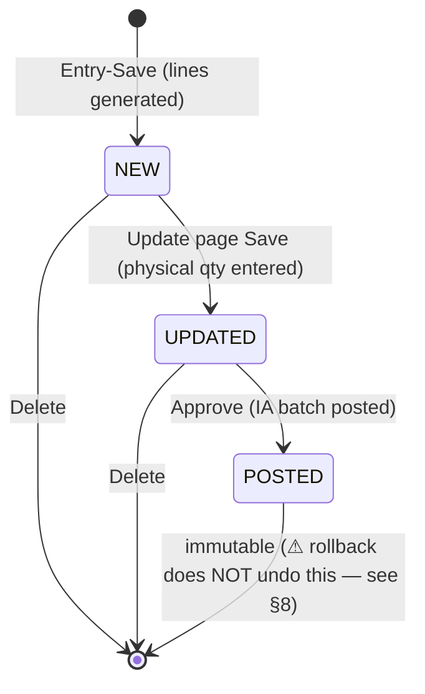

# ERP Cycle Count (Stock Take) — Deep Logic Study

> **Source (legacy):** `c:\wincom\ERPV55\ERP_5.5` — ASP.NET WebForms + DevExpress
> **Target:** Blazor Server (`ErpWeb` host / `ErpWeb.Core` / `ErpWeb.Model` / `ErpWeb.UI`)
> **Scope:** the **Inventory** cycle count (`MRP.Inventory.CycleCount`). The Production variant
> (`ProductionPlan\ProdPlan\CycleCount`, table `IvProdCyCntHdr`) is **explicitly out of scope** for now.
> **Status:** study only — no code written. Two items (§7 Posting, §8 Rollback) are the core of this doc.
> **Reported:** verified against source, 2026-09-24.

---

## Table of Contents

1. [Concept in one paragraph](#1-concept-in-one-paragraph)
2. [Code map](#2-code-map)
3. [Data model](#3-data-model)
4. [Document numbering](#4-document-numbering)
5. [Lifecycle & status machine](#5-lifecycle--status-machine)
6. [Screen-by-screen logic](#6-screen-by-screen-logic)
7. [Posting engine](#7-posting-engine)
8. [Rollback](#8-rollback)
9. [Formula summary](#9-formula-summary)
10. [Quirks, defects & traps (do NOT copy blindly)](#10-quirks-defects--traps-do-not-copy-blindly)
11. [Blazor port blueprint](#11-blazor-port-blueprint)
12. [Open questions / decisions needed](#12-open-questions--decisions-needed)
13. [Appendix — views & reconciliation queries](#13-appendix--views--reconciliation-queries)

---

## 1. Concept in one paragraph

Cycle Count is a **physical stock verification** document. You define a *scope* (warehouse, item
class/subclass/type/category/status, location, item list), the system **snapshots the live location
balances** (`IvBalLoc`) into a working table `IvCyCnt` as at the document's effective date, a human
enters **physical quantities**, then an **Approve/Post** action converts the differences into a normal
inventory-adjustment batch (`IvTrxBatch` + `IvTrxBatchDetail`, `TrxType='IA'`, posted through the
`IACLC` path) which writes down/up stock in `IvBalLoc` / `IvBalance`, inserts `IvTrxHistory` audit rows
and updates costing (`IvBalLocCost`).

**In other words: the module is a thin front-end that generates an IA (adjustment) batch.** Everything
after "Approve" is the shared inventory posting engine. That single fact drives both the posting
design *and* every rollback problem described in §8.

---

## 2. Code map

| File | Role |
|---|---|
| `ERP\Inventory\CycleCount\CycleCountView.aspx(.cs)` | **List / hub**. `this.ID = "100.6.1"`, `KeyFieldName = "CY_ID"`, bound to view `vgridIvCyCntHdr` via `LinqServerModeDataSource`. 6 action buttons. |
| `ERP\Inventory\CycleCount\CycleCountEntry.aspx(.cs)` | **Create / Edit / View** document + **Generate** lines from `IvBalLoc`. |
| `ERP\Inventory\CycleCount\CycleCountUpdate.aspx(.cs)` | **Enter physical qty** (grid batch edit) + bulk "UPDATE ITEM QTY" helper. |
| `ERP\Inventory\CycleCount\PostCycCountHelper.cs` | **The posting logic** (`StartPost` strict, `StartPost2` permissive, `DeleteCycle`). |
| `ERP\Inventory\CycleCount\ProductListMs.aspx(.cs)` | Item-code lookup popup (`vprd_IvItemLists`). |
| `ERPCommonUI\Helper\MRHelper.cs` | `SetIvTrxBatch()` (ln 156-163) and `PostCycleCount()` (ln 166). Hooks cycle count into the shared poster. |
| `ERPClasses\Classes\CPosting.cs` | `case "IACLC"` (ln 87) → `PostIATransaction(..., needChkQty:false)` (ln 3981); `RollbackIATransaction` (ln 6122); `RollbackInventoryTransaction` (ln ~226). |
| `ERPClasses\Classes\CAdapter.cs` | `SetIvCyCntHdr` (ln 344), `SetIvCyCnt` (ln 16834), `SetIvCyCntUpdOnly` (ln 16974). |
| `ERPClasses\Classes\CCommon.cs` | `enNumberingType.CYC` (= **30**), `ValidateDate` (ln 1252). |
| `ERPClasses\BL\AdParaBL.cs` | `IsUseWeight()` (ln 42), `CurrentMonth()` (ln 133), `CurrentYear()` (ln 145). |
| `ERPCommonUI\Helper\InvTrxBaseHelper.cs` | `OpenPostTableEx(batchNo)` (ln 392) — loads the posting tables. |
| `ERP\Inventory\FinishGood\AjustmentView.aspx(.cs)` | **Inventory Adjustment list** (`ID = "100.2.8"`, `hdBatchType="IA"`). **This is where a cycle-count batch is rolled back.** |
| `ERPClasses\BL\ERPListViewData.designer.cs` | `vgridIvCyCntHdr` entity (ln 4199) — **stale** (no `ItemType`, no `LocCode`). |

---

## 3. Data model

### 3.1 `IvCyCntHdr` — the document header

Key: `CY_ID` (PK, nvarchar 15).

| Column | Meaning |
|---|---|
| `CY_ID` | Doc no ("CYC…" or manual entry). |
| `StartCount` | **Effective / "COUNT AS AT" date** — the pivot for the snapshot *and* the batch trx date. |
| `EndCount` | Completed date (mostly unused; hidden on Entry). |
| `CountBy` | Person in charge (combo from `AdUser`). |
| `ICodeFr`, `ICodeTo` | Item range — **`ICodeTo` is stored but never used** (see §10 #2). |
| `ClassCode`, `SubClassCode`, `ItemStatus`, `WHCode`, `LocCode`, `ItemType`, `Remark` | Scope criteria, stored for re-edit / re-print. |
| `Status` | `NEW` / `UPDATED` / `POSTED`. |
| `Created`, `UserID`, `Updated`, `UpdatedUID`, `CompanyCode`, `BranchCode` | Audit + tenant. |
| `ApprovedBy`, `ApprovedDate` | Set at post time only. |

> There is **no `BatchNo` column** — the document↔batch link is implicit via `IvTrxBatch.RefNo = CY_ID`.

### 3.2 `IvCyCnt` — snapshot + physical lines

Composite key (page grid `KeyFieldName`, and the adapter key):
**`CY_ID; ICode; WHCode; LocCode; LotNo; Stat`**

| Column | Source / meaning |
|---|---|
| `LocQty` / `Std_UOM` | **System qty snapshot** ← `IvBalLoc.StdQty` / `IvBalLoc.StdUOM` |
| `WtLocQty` / `Wt_UOM` | System weight snapshot ← `IvBalLoc.CatchWtQty` / `CatchWtUOM` |
| `Physical_Qty` / `WtPhysical_Qty` | **Counted qty.** NULL = not counted ⇒ excluded from posting |
| `Stat` | Item status ← `IvBalLoc.IStatus` |
| `ClassCode`, `SubClassCode`, `IDesc`, `Barcode` | Denormalised for display/filter |
| `CMonth`, `CYear`, `CYGenDt` | Period stamp from `AdPara`; `CYGenDt` = **last day of the AdPara current month** |
| `Status`, `Updated`, `UserID` | Line audit |

### 3.3 Supporting tables

- **Read:** `IvBalLoc` (live balance per item/wh/loc/lot/status — the source of truth), `IvMas`,
  `IvMasPack` (Category), `IvWarehouse`, `IvClass`, `IvSubClass`, `IvCategory`, `IvType`.
- **Write on post:** `IvTrxBatch`, `IvTrxBatchDetail`, `IvBalLoc`, `IvBalance`, `IvTrxHistory`,
  `IvBalLocCost`, `IvMas` (+ `IvCyCntHdr`).
- **Write on rollback:** `IvTrxBatch`, `IvBalLoc`, `IvBalance`, `IvTrxHistory`,
  `IvTrxHistoryRollback`, `IvBalLocCost`, `IvMas` (table list is compile-time fixed in
  `MRHelper.UpdateRec`).

### 3.4 Views

`vgridIvCyCntHdr` (list), `vCycCountRepSum`, `vRpt_CycleCount`, `vCycleCount_Accuracy`,
`vCycleCountCombine`, `vgridIvTrxBatchIA` (adjustment list incl. cycle-count batches).

---

## 4. Document numbering

- Enum member `enNumberingType.CYC` = **30** (`CCommon.cs`).
- Sequence tables: `AdSmNum` (plain number) and `AdSmNumDate` (per-month/year).
- `AUTO` →
  - if `AdSmNumDate` has **no** row for `CYC` ⇒ `CCommon.GenerateAutoNumber(CYC, GetNumbering())`
  - else ⇒ `CCommon.GenerateAutoNumberWithDate("CYC", dtSmNumDate, dtAdPara, year, month)`
  - then `CCommon.UpdateSequenceNoWithDate(...)` and `UpateItemRefno()` rewrites the detail rows' `CY_ID` from `'AUTO'` to the real number.
- The numbering **date is `StartCount`**, not today.
- `checkAutoNumbering()` guards against a collision with an existing `CY_ID`.

**Dead code:** `UpdateNumberingTable()` (which would increment `AdSmNum.Seq`) is defined but **never
called** — only `AdSmNumDate` advances.

---

## 5. Lifecycle & status machine



Guard rules (enforced on the **list** page):

| Action | Guard |
|---|---|
| Edit (`CycleCountEntry?Type=Edit`) | Status must be `NEW` |
| Update qty (`CycleCountUpdate`) | Status must **not** be `POSTED` |
| Delete | Status must be `NEW` **or** `UPDATED` |
| Approve | all selected rows must be `UPDATED` (client-side JS check) |

Rights are checked per button via
`IsValidAccessRight(CCommon.enGroupRight.{Access,New,Edit,Delete,Print,Post,Rollback}, …)`.
**The Entry page has no rights check at all** — only a login check (`SessionManager.SessionObject.IsLogin`).

---

## 6. Screen-by-screen logic

### 6.1 `CycleCountView` — list / hub

Buttons (index → action):

| # | Button | Behaviour |
|---|---|---|
| 1 | `NEW` | → `CycleCountEntry.aspx?Type=New` |
| 2 | `DELETE` | `OnDeleteItem` → `PostCycCountHelper.DeleteCycle(cyId)` (only NEW/UPDATED) |
| 3 | `PRINT` | report by `AdReportID` (module `CycleCountView`); SinJim uses a custom report |
| 4 | `UPDATE` | → `CycleCountUpdate.aspx?ID=…&Type=Edit` (blocked when `POSTED`) |
| 5 | `PRINT VR` | variance report (`OnPrintDev`, DevExpress viewer) |
| 6 | `APPROVE` | `OnPostItem` → `PostCycCountHelper.StartPost(...)` |

Data source:
```csharp
e.QueryableSource = db.vgridIvCyCntHdrs.OrderByDescending(x => x.CY_ID);
```

### 6.2 `CycleCountEntry` — Generate (the snapshot)

Scope filter built by `GetBalLocFilter()` on top of `BALLOC_SELECT`:

```sql
SELECT IvBalLoc.*, IvMas.IClass, IvMas.ISubClass, IvMas.Barcode,
       IvMasPack.Category, IvMas.IType
FROM IvBalLoc
INNER JOIN IvMas     ON IvBalLoc.ICode = IvMas.ICode
INNER JOIN IvMasPack ON IvMasPack.ICode = IvMas.ICode
WHERE 1=1
  [AND IvBalLoc.WHCode IN (...)]
  [AND IClass     IN (...)]
  [AND ISubClass  IN (...)]
  [AND IvBalLoc.IStatus IN (...)]
  [AND Category   IN (...)]
  [AND IType      IN (...)]
  [AND IvBalLoc.ICode IN (...)]      -- txtICodeFr, semicolon list
  [AND IvBalLoc.LocCode IN (...)]
  AND TransDate <= '<StartCount yyyy-MM-dd>'
  AND IStatus <> 'SCRAPS'
```

Notes:

- Multi-value controls are `;`-separated lists converted by `getInList()`.
- **`TransDate <= StartCount`** = the "as at" snapshot rule (only movements up to the count date).
- `SCRAPS` status is always excluded.
- `ICodeFr` is treated as an **IN-list**; the range clause (`ICode >= … AND ICode <= …`) is **commented
  out**, so **`ICodeTo` is effectively dead**.
- **No `ORDER BY`** — line order is whatever SQL returns.

Each returned `IvBalLoc` row becomes one `IvCyCnt` row:

```
LocQty   = IvBalLoc.StdQty        Std_UOM = IvBalLoc.StdUOM
WtLocQty = IvBalLoc.CatchWtQty    Wt_UOM  = IvBalLoc.CatchWtUOM
Stat     = IvBalLoc.IStatus       ClassCode/SubClassCode = IvMas
Barcode  = IvMas.Barcode
CMonth/CYear = AdPara.CurrentMonth/CurrentYear
CYGenDt  = last day of the AdPara month/year
Status   = 'NEW'                  Physical_Qty = NULL (not counted)
```

The working set lives in **`Session["CYCLEITEMS"]`** (`DataTable`). Generate always calls
`DeleteAllRow()` first → a **full regenerate** (any previously entered physical qty is lost).

**Save** (`callpanel_Callback → "SAVE" → Save()`):

1. `CCommon.ValidateDate(StartCount, AdPara.CurrentMonth(), AdPara.CurrentYear())` → blocks back-dating
   into a closed period (`"The date you entered was abandoned, please enter date for current period! (ST000048)"`).
2. Resolve `RefNo` (numbering, §4) then `UpateItemRefno()`.
3. Build/update the header row, then one transaction:
   `SetIvCyCntHdr` → `SetIvCyCnt` → `SetAdSmNumDate`.

### 6.3 `CycleCountUpdate` — physical quantity entry

- Header fields disabled (`DisableAllFormLayoutControls`); the session is nulled on `!IsPostBack`, so
  the page **always reloads fresh from the DB**.
- Grid: `KeyFieldName="CY_ID;ICode;WHCode;LocCode;LotNo;Stat"`, `SettingsEditing Mode="Batch"`.
  Only `Physical_Qty` / `WtPhysical_Qty` are editable; everything else is `ReadOnly` **and** force-disabled
  in `OnItemBatchEditStartEditing` (ICode, Barcode, WHCode, LotNo, ClassCode, Stat, LocQty, Std_UOM,
  WtLocQty, Wt_UOM, SubClassCode, LocCode).
- Weight columns hidden when `AdParaBL.IsUseWeight() == false`.
- **Save** sets header `Status='UPDATED'`, `Updated`, `UpdatedUID`, and persists **only**
  `Status, Physical_Qty, WtPhysical_Qty, Updated, UserID` per line — via `SetIvCyCntUpdOnly`
  (**no insert, no delete**).

**Bulk "UPDATE ITEM QTY"** (`UpdateQty()`): enter one item code + one total qty, then distribute it
across that item's lots:

- `systemQty = SUM(LocQty)` for `CY_ID + ICode` (all lots).
- `latestLot` = MAX(LotNo) among rows with `LocQty <> 0`, else MAX(LotNo) overall.
- `isLessQty = qty < systemQty`; sort lots **ASC** if `!isLessQty`, else **DESC**.
- Walk the rows: subtract each row's `LocQty` from the running remainder; the *latest* lot absorbs the
  remainder (`Physical = LocQty + remainder`, clamped ≥ 0); zero-`LocQty` rows are zeroed except the
  latest lot when `systemQty == 0`.

> This is convoluted and uses string comparisons (`row["LocQty"].ToString() == "0"`). **Do not port
> verbatim** — rewrite as an explicit FIFO/LIFO allocation with a preview (§11).

### 6.4 View mode

Same Entry page with `Type=View`: `btnApply`/`btnApplyCancel`/`btnGenerate` hidden, all form controls
`ClientEnabled = false`, grid read-only.

### 6.5 `ProductListMs`

Popup lookup over `vprd_IvItemLists`. On pick it fills **both** `txtICodeFr` and `txtICodeTo`
(hence the dead range field).

---

## 7. Posting engine

Entry point: `CycleCountView.OnPostItem(ids)` (APPROVE button) → `new PostCycCountHelper().StartPost(...)`.

### 7.1 Guards

- **Rights:** `IsValidAccessRight(CCommon.enGroupRight.Post, …)`.
- **Client-side:** exactly 1 row selected; that row's `Status` must be `UPDATED`.
- **Month-end:** `StartCount` period vs `AdPara.CurrentMonth/CurrentYear` →
  `"Month End Already Done For Cycle No … !"` and abort.

### 7.2 Line selection (`OpenTable`)

```sql
SELECT * FROM IvCyCnt
WHERE (locQty != Physical_Qty)
  AND (Physical_Qty >= 0 OR WtPhysical_Qty >= 0)
  AND cy_id = '<CYNO>'
```

Semantics: **un-counted lines (NULL `Physical_Qty`) and lines equal to the system qty are skipped** —
only true variances are adjusted. (`locQty != NULL` is UNKNOWN in T-SQL, so NULL rows drop out via the
first predicate.)

> **Performance defect:** it also loads `IvMas` **and `IvBalLoc` entirely**
> (`Select * from IvMas`, `Select * from IvBalLoc`) — see §10 #1.

### 7.3 Adjustment math (`AddAjustRecods`)

For each variance line, look up the **live** `IvBalLoc` by
`ICode + WHCode + LotNo + IStatus + LocCode`; a missing row is a hard error
(`"Balance Lot does not exist <icode> lot <lot>"`), then `locqty = IvBalLoc.StdQty`.

```csharp
phyqty  = Physical_Qty  ?? 0    // NULL already excluded
if (phyqty  > 0) adjustQty  = locqty - phyqty;   // shortage ⇒ +, overage ⇒ −
else if (phyqty == 0) adjustQty = locqty;        // knock the line off to zero

phywt = WtPhysical_Qty ?? 0;  locwt = WtLocQty;
if (phywt > 0) adjustWT = locwt - phywt;
else if (phywt > 0) { adjustWT = locwt; }        // ⚠ DEAD BRANCH — never reached (bug)
```

> **Important nuance:** `AdjustStdQty` is computed against **live `IvBalLoc.StdQty`**, while the
> history row's `FrStdQty` is the **snapshot `IvCyCnt.LocQty`**. They can differ if stock moved between
> Generate and Post.

The `IvTrxBatchDetail` row is then built:

| Field | Value |
|---|---|
| `TrxType` | `'IA'` |
| `ToWarehouse` / `ToLocation` / `ToLot` | the cycle line's `WHCode` / `LocCode` / `LotNo` |
| `FrStdQty` / `FrWtQty` | **snapshot** `IvCyCnt.LocQty` / `WtLocQty` |
| `FrStdUOM` / `FrWtUOM` | snapshot UOMs |
| `AdjustStdQty` / `AdjustWtQty` | as computed above |
| `ProcessCode` | `IvMas.IType` |
| `IStatus` | `IvCyCnt.Stat` |
| `NewIStatus` | **`"MI"` (hardcoded)** |
| `Remarks` | `"CYCLE COUNT ADJUSTMENT"` |
| `UnitPrice` | from live `IvBalLoc.UnitPrice` (0 if not found) |

**Why `NewIStatus = "MI"`?** In `PostIATransaction` the set
`{SC, VR, SP, MI, ITF, IP}` selects the **decrement** branch
(`UpdateInventoryBalLoc(..., false, false, …)` + `UpdateInventoryBalLocCosting(..., false, …)`).
So a positive `AdjustStdQty` **subtracts** stock — the classic write-down. (An overage produces a
negative delta, which effectively adds.) This is also the branch that skips the
qty-available/future-stock checks.

### 7.4 Batch creation (`GenerateAdjBatch`)

| `IvTrxBatch` field | Value |
|---|---|
| `BatchNo` | `BatchNoHelper.RetrieveAndUpdateBatchNo()` |
| `TrxDtTime` | **`IvCyCntHdr.StartCount`** (01-2019 change: not `Today`) |
| `TrxType` | `'IA'` |
| `BatchStatus` | `'NEW'` |
| `UserID` / `Updated` | current user / now |
| `CompanyCode` / `BranchCode` / `LocationCode` | session values |
| `RefNo` | **`CY_ID`** ← the only document↔batch link |

### 7.5 Post (`PostAdj` → `MRHelper.PostCycleCount`)

```
PostAdj(batchNo)
 ├─ IvCyCntHdr row: Status='POSTED', ApprovedBy=_userID, ApprovedDate=now   (in memory)
 ├─ mrHlp.SetIvTrxBatch(dtBatch, dtBatchDtl, dtIvCyCntHdr)
 └─ mrHlp.PostCycleCount("IA", batchNo, _userID, _comp, _branh)
      ├─ OpenConnection()
      ├─ OpenPostTableEx(batchNo)
      │    loads: IvBalance, IvBalLoc, IvTrxHistory(WHERE 1=2), IvTrxHistoryRollback(1=2),
      │           AdPara, IvType (KeepStock), SaCurrRate, IvMas, IvBalLocCost
      ├─ CPosting.PostInventoryTransaction("IACLC", BatchNo, …)
      │    └─ PostIATransaction(..., needChkQty: false)
      │         ├─ CheckItemAvailable(batch)             → item master sanity
      │         ├─ batch header BatchStatus = 'POSTED'
      │         ├─ ⚠ SKIPS CheckQuantityAvailableByBranch and CheckIsFutureStock
      │         └─ per line (keepStock from IvType):
      │              NewIStatus='MI' ⇒ UpdateInventoryBalLoc(..., false, false, …)
      │                                 UpdateInventoryBalLocCosting(..., false, …)
      │                                 UpdateInventoryHistoryCost(...)
      └─ UpdateRec(sqlTrans)   with _trxtype = "CLCYLE"
           writes: IvTrxBatch, IvBalLoc, IvBalance, IvTrxHistory, IvMas, IvBalLocCost,
                   IvTrxBatchDetail  +  **IvCyCntHdr** (⇒ persisted POSTED)
```

`_trxtype = "CLCYLE"` is set **inside `PostCycleCount` only** — that is the *only* reason
`IvCyCntHdr` is written during posting. Remember this for §8.

### 7.6 The "0-cost item" two-pass flow (`CheckUP`) — the oddest behaviour

- `StartPost` uses `AddAjustRecods`, which **aborts the whole post if any line's unit price is 0**:
  ```csharp
  int uprice = Convert.ToInt32(drBatchDtl["UnitPrice"]);   // ⚠ int truncation: 0.75 ⇒ 0
  _checkUP = uprice.ToString();
  if (uprice != 0) { dtBatchDtl.Rows.Add(drBatchDtl); return true; }
  return false;   // aborts everything
  ```
- `_checkUP` is exposed as a property and read by the list page's JS.
- `OnGridEndCallBack`: if `cpCheckUP == "0"` → `confirm("Cycle count consist of 0 cost item adjusted,
  proceed to approve???")` → if **Yes**, calls `"POST2:"` → `OnPostItem2` → **`StartPost2`**, which uses
  `AddAjustRecods2` (adds lines **regardless** of cost).
- If the user declines, nothing is posted and `Errmsg` is typically **empty** ⇒ **silent failure**.

This is the legacy design for "adjustments that would zero out the value of a zero-cost item".

### 7.7 Delete

```csharp
PostCycCountHelper.DeleteCycle(cyid)
  DELETE FROM IvCyCnt   WHERE Cy_ID = @cyid
    AND Cy_ID IN (SELECT Cy_ID FROM IvCyCntHdr WHERE Status IN ('NEW','UPDATED'));
  DELETE FROM IvCyCntHdr WHERE Status IN ('NEW','UPDATED') AND CY_ID = @cyid;
```

Raw SQL, **no transaction**, **no tenant filter** (acceptable only because `CY_ID` is the PK).

---

## 8. Rollback

### 8.1 There is no ROLLBACK button on any Cycle Count screen

`CycleCountView.SetButtonInfo()` has NEW / DELETE / PRINT / UPDATE / PRINT VR / APPROVE — **no rollback**.
That is not an oversight you can fix by adding a button; the real reason is:

> The cycle-count posting produces an ordinary `IvTrxBatch` row with `TrxType='IA'`, so it surfaces on
> the **Inventory ▸ Adjustment** screen and is rolled back **there**.

- Screen: `ERP\Inventory\FinishGood\AjustmentView.aspx`
  (`this.ID = "100.2.8"`, `hdBatchType.Value = "IA"`, entry page `AdjustmentIA.aspx`).
- Data source = view `ERPSQL_DB\SQLView\vgridIvTrxBatchIA.txt`:

  ```sql
  ALTER VIEW [dbo].[vgridIvTrxBatchIA] AS
    SELECT h.[BatchNo], h.[TrxDtTime], h.[BatchStatus], h.[RefNo], h.[Updated], h.[UserID],
           h.[UpdatedUID], h.[Created], h.[TrxType],
           ProdCode = (SELECT TOP 1 ICode FROM IvTrxBatchDetail x WHERE h.BatchNo = x.BatchNo),
           ProdDesc = SUBSTRING((SELECT DISTINCT ', ' + IDesc FROM IvTrxBatchDetail x
                                 WHERE h.BatchNo = x.BatchNo AND x.IDesc <> ''
                                 FOR XML path(''), elements), 2, 1000),
           CAST(h.DailyJONG AS bit) AS DailyJONG,
           h.[CompanyCode], h.[BranchCode], h.[LocationCode],
           '' AS Remarks, '' AS ToWarehouse, '' AS FrWarehouse
    FROM IvTrxBatch h
    WHERE h.TrxType = 'IA'
  ```

  **There is no clause excluding cycle-count batches** ⇒ they appear and are rollback-able like any
  manual adjustment.

- `AjustmentView` button set: NEW, DELETE, PRINT, REFRESH, **POST**, **ROLLBACK**.

### 8.2 The rollback chain

```
AjustmentView.OnRollbackItem(batchNos)
 ├─ rights: CCommon.enGroupRight.Rollback
 ├─ TrxPostingHelper.CheckAnyActiveTrx()              // global posting lock, wait ≤ 90 s
 ├─ TrxPostingHelper.SetTrxPosting("IA", "IA", guid)
 ├─ guard: every selected batch must be POSTED (BatchStatusHelper.CheckIsPosted)
 │         else "All items must be in POSTED Status to be Rollback!"
 ├─ guard: max 3 batches per rollback
 ├─ collects RefNo per batch from vgridIvTrxBatches (company/branch/location scoped)
 └─ MRHelper.Rollback("IA", batchNos, refNos, user, comp, branch)
      ├─ OpenConnection()
      ├─ OpenPostTable(true /* isRollback */, batchNo) + OpenTrxHistory(Batch)
      ├─ ⚠ month-end guard on batch.TrxDtTime vs AdPara
      │      → "Month End Already Done For Batch No …" and abort
      ├─ CPosting.RollbackInventoryTransaction("IA", …) → RollbackIATransaction()
      │    ├─ CheckItemAvailable(batch)
      │    ├─ CheckRollbackQuantityAvailableByBranch("IA", comp, branch, loc, batchNo, …)
      │    │      for TrxType=="IA" it keys on ToLot / ToWarehouse / ToLocation + IStatus
      │    │      shortfall ⇒ "Please check quantity for(Format - BatchNo:LotNo:ItemCode): …"
      │    ├─ batch header BatchStatus = "NEW", Updated = now
      │    ├─ per line, NewIStatus='MI' ⇒ DeleteInventoryBalLoc(..., AdjustStdQty, AdjustWtQty,
      │    │                                  …, false, false, user, "1")
      │    │      false = "not a decrease" ⇒ stdQtybalance = oStdQty + AdjustStdQty   (adds delta back)
      │    │      throws "Insufficient quantity in stock (For item code …)" if it would have to subtract
      │    ├─ RollbackInventoryBalLocCosting(..., false)
      │    └─ DeleteInventoryHistory(BatchNo, TrxDate, "IA", "NEW", RefNo, … → IvTrxHistoryRollback)
      ├─ deletes the original IvTrxHistory rows matching BatchNo + RefNo
      ├─ PrepareTablesForLog()  → UpdateRec(sqlTrans)
      │      _trxtype = "IA"  ❌ NOT "CLCYLE"
      │      writes IvTrxBatch, IvBalLoc, IvBalance, IvTrxHistory(Rollback), IvMas, IvBalLocCost
      │      ** does NOT write IvCyCntHdr **
      └─ AuditLogRollback("IA BATCH", …, "ROLLBACK")   // audits batch/detail/balance/balloc/history/cost
```

**Direction verification** — `DeleteInventoryBalLoc` (`CPosting.cs:8098`):

```csharp
double oStdQty = CCommon.RoundingToDouble(Convert.ToDouble(drIvBalLoc["StdQty"]), 4);
double oWtQty  = CCommon.RoundingToDouble(Convert.ToDouble(drIvBalLoc["CatchWtQty"]), 4);
if (IsLotQtyIncreaseOrDecrease) {                 // decrease
    stdQtybalance = oStdQty - StdQty;
    if (stdQtybalance < 0) throw new Exception("Insufficient quantity in stock (For item code …)");
} else {                                          // ← the MI branch on rollback
    stdQtybalance = oStdQty + StdQty;
    wtQtybalance  = oWtQty  + WtQty;
}
```

So rollback **adds the adjustment back**, exactly mirroring the post which subtracted it.
It also deliberately does **not** restore `TransDate`, `UnitPrice` or `Remarks` (comments at
`CPosting.cs:8168-8180`).

### 8.3 Net effect

| Artifact | Post | Rollback |
|---|---|---|
| `IvTrxBatch.BatchStatus` | `NEW` → `POSTED` | `POSTED` → **`NEW`** (re-postable) |
| `IvBalLoc.StdQty` / `CatchWtQty` | ∓ delta | restored (+ delta) |
| `IvBalLocCost` | updated | rolled back |
| `IvTrxHistory` | inserted | **rows deleted** + reversal rows in `IvTrxHistoryRollback` |
| `IvBalLoc.TransDate` / `UnitPrice` / `Remarks` | set | **not restored** (by design) |
| `IvMas` | updated | restored |
| **`IvCyCntHdr.Status` / `ApprovedBy` / `ApprovedDate`** | set to `POSTED` | **unchanged — stays `POSTED`** ❌ |
| `IvCyCnt.Physical_Qty` | unchanged | unchanged |

### 8.4 The defects this exposes (critical for the port)

1. **The cycle-count document is never un-posted.** `MRHelper.Rollback` sets `_trxtype = "IA"`, so the
   `if (_trxtype == "CLCYLE")` branch in `UpdateRec` — the only place that writes `IvCyCntHdr` during a
   batch operation — is **skipped**. After a rollback the document still reads `POSTED`, with
   `ApprovedBy`/`ApprovedDate` intact, and Edit / Update / Approve remain blocked. Recovery requires
   manual SQL.
2. **Two posting entry points, only one updates the header.**
   `MRHelper.Post()` (the Adjustment screen's POST button) *does* detect cycle-count batches:

   ```csharp
   DataRow[] brow = dtIvTrxBatch2.Select("BatchNo='" + b + "'");
   if (brow.Length > 0) {
       string refno = brow[0]["Refno"].ToString();
       DataTable dtCyc = BaseADOERP.GetData("Select * from IvCyCntHdr where CY_ID='" + refno + "'");
       if (dtCyc.Rows.Count > 0) isCycCountRecord = true;
   }
   …
   CPosting.PostInventoryTransaction((isCycCountRecord) ? "IACLC" : batchType, BatchNo, …);
   ```

   So it correctly re-posts with the *no-qty-check* `IACLC` path — **but `_trxtype` stays `"IA"`, so it
   also never sets the header to `POSTED`.**
3. **Double-post risk.** Via the Adjustment route the batch becomes `POSTED` while the header stays
   `UPDATED`. The Cycle Count APPROVE button only requires `UPDATED` (client-side JS), so it can
   generate a **second** IA batch and post the adjustment twice. Nothing reconciles header status
   against batch status.
4. **The document ↔ batch link is implicit only** — `IvTrxBatch.RefNo = IvCyCntHdr.CY_ID`. There is no
   `BatchNo` on `IvCyCntHdr` and the Cycle Count screens never display the batch number.
5. **Rollback reverses the *stored delta*, not the count.** It uses `AdjustStdQty` from the batch
   detail; it does not re-read `Physical_Qty` or re-compare live stock. Reversing a stale adjustment can
   therefore produce a wrong result. The only protections are
   `CheckRollbackQuantityAvailableByBranch` and the non-negativity throw inside `DeleteInventoryBalLoc`.
6. **Month-end freezes rollback too** — once `AdPara` advances past `TrxDtTime`, the cycle-count
   adjustment can no longer be undone; the only remedy is a manual counter-adjustment.
7. **No dependency check** — nothing verifies the stock the cycle count moved has not since been
   consumed by later transactions.
8. **Hardcoded `RevNo = "1"`** in both post and rollback (`user, "1"`) for the `IvBalLoc` match.
9. **Rollback audit is generic** (`"IA BATCH"`, action `"ROLLBACK"`) — it does not record that a cycle
   count was rolled back, and resets no CC field.

---

## 9. Formula summary

$$
\text{AdjustQty} =
\begin{cases}
\text{LiveBalLoc.StdQty} - \text{PhysicalQty} & \text{PhysicalQty} > 0 \\[2pt]
\text{LiveBalLoc.StdQty}                     & \text{PhysicalQty} = 0 \\[2pt]
\text{(line skipped)}                        & \text{PhysicalQty is NULL \textbf{or} } = \text{snapshot LocQty}
\end{cases}
$$

$$
\text{AdjustWt} =
\begin{cases}
\text{LiveBalLoc.CatchWtQty} - \text{PhysicalWt} & \text{PhysicalWt} > 0 \\[2pt]
0 & \text{otherwise — \textbf{bug}: never zeroes the weight}
\end{cases}
$$

Effective stock movement = an **IA adjustment batch** dated `StartCount`, applied through the
**decrement branch** (`NewIStatus='MI'`), with **no negative-stock / future-stock validation** because
`PostIATransaction` is called with `needChkQty: false`.

---

## 10. Quirks, defects & traps (do NOT copy blindly)

| # | Issue | Where |
|---|---|---|
| 1 | Whole-table loads (`SELECT * FROM IvMas`, `IvBalLoc`) on every post | `PostCycCountHelper.OpenTable` |
| 2 | `ICodeTo` stored but never used in the filter (range SQL commented out) | `GetBalLocFilter` |
| 3 | Weight knock-off branch is `else if (phywt > 0)` — should be `== 0`; weight is never zeroed | `AddAjustRecods(2)` |
| 4 | `Convert.ToInt32(UnitPrice)` truncates ⇒ any price < 1 counts as "zero cost" | `AddAjustRecods` |
| 5 | Silent failure when a 0-cost line aborts the post (`Errmsg` empty) | `StartPost` / `PostAdj` |
| 6 | `CheckUP` reflects only the **last** evaluated line, not "any line" | `AddAjustRecods` |
| 7 | Dead code: `test` var, `SaveBatch()`, `UpdateNumberingTable()`, `Print__old` | multiple |
| 8 | Delete command uses `LocCode = @LocCode` instead of `@OldLocCode` | `CAdapter.SetIvCyCnt` |
| 9 | Working set in `Session["CYCLEITEMS"]` / `"CYCLEITEMSUPT"` — lost on timeout, one tab per user, races with the DB copy | Entry / Update |
| 10 | No rights check on `CycleCountEntry` (deep-link bypass) | Entry |
| 11 | Entry/Update never re-validate that the DB copy still matches the session copy | Entry / Update |
| 12 | Snapshot `LocQty` vs live `StdQty` mismatch between adjustment and history row | `AddAjustRecods` |
| 13 | Bulk qty allocator is a fragile string-comparison waterfall | `CycleCountUpdate.UpdateQty` |
| 14 | No `RowVersion` / concurrency — last writer wins on header and lines | all saves |
| 15 | `SetIvCyCntHdr` UPDATE has **no tenant filter** (`WHERE CY_ID=@OldCY_ID`) | `CAdapter.cs:405` |
| 16 | `vgridIvCyCntHdr` Linq entity is stale (no `ItemType`, no `LocCode`) | `ERPListViewData.designer.cs:4199` |
| 17 | **Rollback never resets `IvCyCntHdr`** (see §8.4) | `MRHelper.Rollback` |
| 18 | Reposting from Adjustment leaves the header `UPDATED` while the batch is `POSTED` | `MRHelper.Post` |
| 19 | Rollback reverses a stored delta, not the count; no dependency check | `RollbackIATransaction` |
| 20 | Month-end blocks both post-rollback and any correction | `MRHelper.Rollback` |

---

## 11. Blazor port blueprint

Target conventions (per existing ports): `ErpWeb` host / `ErpWeb.Core` / `ErpWeb.Model` / `ErpWeb.UI`;
list shells such as `SaRefListPageBase` / `SaKeyedRefListPageBase` / `SaCodeRefListPageBase`;
tenant stamping via `InventoryLeftoverSite.Apply`; `RowVersion` + `expectedFingerprint`; `MenuCodes` +
`PermissionCodes`; DDL in manual, idempotent `scripts/*.sql` (never at startup).

### 11.1 Entities / tables

- `IvCyCntHdr`, `IvCyCnt` — keep the names for reporting compatibility.
  - Add `RowVersion` to both.
  - Add a unique index on `IvCyCnt (CY_ID, ICode, WHCode, LocCode, LotNo, Stat)`.
  - **Add `PostedBatchNo`** (and `RolledBackBy` / `RolledBackOn` / `RollbackReason`) to `IvCyCntHdr`.
  - Either implement a real `ICodeFr`–`ICodeTo` range or remove `ICodeTo` from the UI.

### 11.2 Service layer — `ICycleCountService`

| Method | Notes |
|---|---|
| `GenerateAsync(scope, asAtDate, ct)` | Same filter SQL but add `ORDER BY ICode, WHCode, LocCode, LotNo, Stat`; `AsNoTracking()` projection; do **not** load whole tables. |
| `SaveDraftAsync(cyId?, header, lines, expectedFingerprint)` | **Persist as you go** instead of `Session`. |
| `UpdatePhysicalAsync(cyId, lines, expectedFingerprint)` | Optimistic concurrency via `RowVersion` / fingerprint. |
| `PostAsync(cyId, allowZeroCost, ct)` | **Single** posting entry point (§11.3). |
| `RollbackAsync(cyId, reason, ct)` | **First-class** rollback (§11.4). |
| `DeleteAsync(cyId, ct)` | Only `NEW` / `UPDATED`, inside a transaction. |

Reuse the existing inventory posting service for the `IA` / `IACLC` batch — do **not** re-implement
`MRHelper` / `CPosting`.

### 11.3 Posting rules

1. Exactly **one** component may post a cycle-count batch, and it must write
   `IvCyCntHdr.Status = POSTED` + `PostedBatchNo` **in the same transaction** as the inventory posting.
2. Replace the `StartPost` / `StartPost2` + `CheckUP` dance with a structured two-step:
   - `PostAsync(cyId, allowZeroCost: false)` → returns
     `PostPreviewResult { ZeroCostLines[] }` if any line has `UnitPrice <= 0`;
   - UI shows a proper confirm dialog listing those lines;
   - `PostAsync(cyId, allowZeroCost: true)` → proceeds.
3. Use `decimal` for price and `<= 0` for the test — never `Convert.ToInt32`.
4. State machine enforced **server-side**: post requires `UPDATED` **and** `PostedBatchNo IS NULL`.
5. Block the Adjustment screen from posting cycle-count batches
   (`WHERE NOT EXISTS (SELECT 1 FROM IvCyCntHdr h WHERE h.CY_ID = b.RefNo)`), or route it through
   `ICycleCountService`.

### 11.4 Rollback rules

`RollbackAsync(cyId, reason)` atomically:

1. reverses the linked IA batch through the shared posting service;
2. resets `IvCyCntHdr.Status` → `UPDATED` (or a new `ROLLED_BACK`);
3. clears `PostedBatchNo`, sets `RolledBackBy` / `RolledBackOn` / `RollbackReason`.

Further decisions to make deliberately:

- Add a `ROLLED_BACK` status so a rolled-back count can be corrected and re-posted unambiguously.
- Decide the month-end policy: block rollback (legacy) **or** allow rollback and emit a compensating
  entry.
- Add a **reconciliation monitor** comparing `IvCyCntHdr.Status` with the linked
  `IvTrxBatch.BatchStatus` — legacy data **will** contain divergences (see Appendix 13.2).

### 11.5 Screens (map 1:1)

1. `CycleCountList.razor` — list shell; buttons NEW / DELETE / PRINT / UPDATE QTY / APPROVE /
   **ROLLBACK** (new), visibility driven by `MenuCodes` + `PermissionCodes`.
2. `CycleCountEntry.razor` — header + scope criteria + Generate; grid read-only; Save.
3. `CycleCountUpdate.razor` — batch-edit grid, only physical qty editable; drop the legacy bulk
   allocator in favour of an explicit allocation dialog with a preview (FIFO default, lot selectable).
4. Read-only mode = same components with `IsReadOnly`.

### 11.6 Things to design deliberately (not inherit)

- Adjustment basis: **live `IvBalLoc`** (current behaviour) vs **snapshot `LocQty`** — pick one and
  document it; do not mix (legacy mixes).
- Weight: fix the `== 0` branch and guard on `UseWeight`.
- Price: `decimal` + `<= 0`; decide whether zero-cost blocks the post or only warns.
- Concurrency: `RowVersion` on both tables.

---

## 12. Open questions / decisions needed

| # | Question | Why it matters |
|---|---|---|
| 1 | Post against **live balances** or the **snapshot** taken at Generate? | Legacy mixes the two (adjusts live, stores snapshot in history) — pick and document. |
| 2 | Is "zero-cost blocks posting" a real business rule, or an artefact? Warn-and-continue instead? | Determines whether `ZeroCost` needs a two-step confirm. |
| 3 | Real item **range** (`ICodeFr`–`ICodeTo`) or keep the multi-select IN-list? | `ICodeTo` is currently dead. |
| 4 | Should `Stat` be part of line identity (legacy yes) or should status changes go through the `CS` transaction? | Affects the PK/unique index. |
| 5 | Do you need **recounts** / multiple counting passes per document? | Legacy is single-pass. |
| 6 | Printed outputs: do you need `repCycCountWithQtySum` / `repCycCountWOQtySum` / variance ("PRINT VR") equivalents? | Report parity. |
| 7 | Rollback policy after month-end: block, or allow with a compensating entry? | Legacy blocks. |
| 8 | Should a rolled-back cycle count be re-editable and re-postable (`ROLLED_BACK` status)? | Legacy has no path at all. |

---

## 13. Appendix — views & reconciliation queries

### 13.1 Reported views (legacy)

```sql
-- ERPSQL_DB\SQLView\vCycCountRepSum.txt   (summary)
ALTER VIEW [dbo].[vCycCountRepSum] AS
SELECT c.CY_ID, RTRIM(LTRIM(c.WHCode)) AS WHCode, c.ICode, c.LocCode, c.LotNo,
       ISNULL(a.UnitPrice,0) AS UnitPrice,
       SUM(c.WtLocQty) WtLocQty, SUM(c.LocQty) LocQty,
       MAX(c.Wt_UOM) Wt_UOM, MAX(c.Std_UOM) Std_UOM,
       MAX(m.IDesc) IDesc, MAX(m.IClass) ClassCode, MAX(m.ISubclass) SubClassCode
FROM dbo.IvCyCnt c
INNER JOIN IvMas m ON c.ICode = m.ICode
LEFT JOIN IvBalLoc AS a ON a.ICode = c.ICode AND a.LotNo = c.LotNo AND a.WHCode = c.WHCode
GROUP BY c.CY_ID, c.WHCode, c.LocCode, c.ICode, c.LotNo, a.UnitPrice;
GO
```

```sql
-- ERPSQL_DB\SQLView\vRpt_CycleCount .txt   (detail + accuracy)
ALTER VIEW [dbo].[vRpt_CycleCount] AS
SELECT a.CY_ID, a.ICodeFr, a.ICodeTo, a.ClassCode, a.SubClassCode, a.Status,
       b.WHCode AS Dtl_WHCode, a.StartCount, a.EndCount, a.CountBy,
       b.ICode, b.LocCode, b.LotNo, b.LocQty, b.Physical_Qty, b.Std_UOM, b.WtPhysical_Qty,
       c.IDesc, a.WHCode, d.IQty, d.VQty, d.Accuracy
FROM IvCyCntHdr a
LEFT JOIN IvCyCnt b ON a.CY_ID = b.CY_ID
LEFT JOIN IvMas c ON b.ICode = c.ICode
LEFT JOIN [vCycleCount_Accuracy] d ON d.CY_ID = a.CY_ID AND d.WHCode = b.WHCode;
GO
```

```sql
-- ERPSQL_DB\SQLView\vCycleCountCombine.txt   (inventory + production cycle counts)
CREATE VIEW vCycleCountCombine AS
SELECT CY_ID, StartCount, Status, UserID, Created, 'CyCnt' AS Type FROM IvCyCntHdr
UNION ALL
SELECT CY_ID, StartCount, Status, UserID, Created, 'ProdCyCnt' AS Type FROM IvProdCyCntHdr;
```

> `vCycleCount_Accuracy` is referenced by `vRpt_CycleCount` but its definition is **not** in this repo —
> obtain it from the live DB before porting (it provides `IQty`, `VQty`, `Accuracy`).

### 13.2 Reconciliation queries (use before migrating)

**A. Find the batch that posted a cycle count:**
```sql
SELECT b.BatchNo, b.BatchStatus, b.TrxDtTime, b.Created, b.UserID
FROM IvTrxBatch b
WHERE b.TrxType = 'IA'
  AND b.RefNo = @CY_ID;
```

**B. Documents whose header status disagrees with their batch (the §8.4 divergences):**
```sql
SELECT h.CY_ID, h.Status AS HdrStatus, h.ApprovedBy, h.ApprovedDate,
       b.BatchNo, b.BatchStatus AS BatchStatus, b.TrxDtTime
FROM IvCyCntHdr h
LEFT JOIN IvTrxBatch b ON b.TrxType = 'IA' AND b.RefNo = h.CY_ID
WHERE h.Status = 'POSTED' AND (b.BatchNo IS NULL OR b.BatchStatus <> 'POSTED')
   OR h.Status = 'UPDATED' AND b.BatchStatus = 'POSTED';
```

**C. Cycle counts that were rolled back (batch back to NEW) but still look POSTED:**
```sql
SELECT h.CY_ID, h.Status, b.BatchNo, b.BatchStatus, b.Updated
FROM IvCyCntHdr h
JOIN IvTrxBatch b ON b.TrxType = 'IA' AND b.RefNo = h.CY_ID
WHERE h.Status = 'POSTED' AND b.BatchStatus = 'NEW'
ORDER BY b.Updated DESC;
```

**D. Variance per document (what the count actually asked for):**
```sql
SELECT CY_ID, ICode, WHCode, LocCode, LotNo, Stat,
       LocQty, Physical_Qty,
       (LocQty - ISNULL(Physical_Qty, LocQty)) AS VarianceQty
FROM IvCyCnt
WHERE CY_ID = @CY_ID
  AND (LocQty <> Physical_Qty)
ORDER BY ICode, WHCode, LocCode, LotNo, Stat;
```

---

*End of study. Source verified 2026-09-24. Companion implementation plan to follow in
`C:\wincom\net10projects\plans\`.*

---

## Implemented in ErpWeb (2026-09-24)

The cycle count is now a first-class Inventory document. It snapshots live `IvBalLoc` piles into its
own staging tables, records physical quantities, and at POST computes each variance against **live**
stock and generates an **ADJ batch** posted through the existing `IIvInventoryPostingService`. No new
posting engine, no new posting table, no new transaction type, and no change to how stock moves.

### Files

| Kind | Path |
| --- | --- |
| Entity | `ErpWeb.Model/Entities/Inventory/IvStockCountHdr.cs`, `IvStockCountLine.cs` |
| Configuration | `ErpWeb.Model/Configurations/Inventory/IvStockCountHdrConfiguration.cs`, `IvStockCountLineConfiguration.cs` |
| Service | `ErpWeb.Core/Inventory/IIvStockCountService.cs`, `IvStockCountService.cs`, `IvStockCountStatuses.cs` |
| UI | `ErpWeb.UI/Inventory/Transactions/IvStockCountList.razor(.cs/.css)`, `IvStockCount.razor(.cs/.css)` |
| Scripts | `scripts/create-iv-stock-count.sql`, `scripts/init-inv-stock-count-menu.sql` |
| Tests | `ErpWeb.Tests/IvStockCountServiceTests.cs` (SQLite), `IvStockCountSqlServerConcurrencyTests.cs` (SQL Server) |
| Engine edit | `ErpWeb.Core/Inventory/IvInventoryPostingService.cs` - `PostInventoryADJCoreAsync` extracted, `TestHookAfterAdjStockUpdate` / `TestHookAfterAdjHistory` added, `PostStockAdjustmentInTransactionAsync` added |
| Generate query | `ErpWeb.Model/Repositories/Inventory/IvStockCommonRepository.cs` - `ListStockCountCandidatesAsync` |

### Lifecycle

`DRAFT -> COUNTED -> POSTED -> ROLLED_BACK (-> COUNTED -> POSTED)`, plus `CANCELLED` from any
non-POSTED state, and row deletion from `DRAFT`. Count entry stays open while the sheet is `DRAFT`,
`COUNTED` or `ROLLED_BACK` — `COUNTED` means "counted so far" and is a working state, **not** frozen
evidence (a long sheet is normally keyed in over several days); the freeze is `POSTED`, matching every
other document in this ERP. Amendments before posting show up as `RecountCount` + `CountedBy`/
`CountedOn`; after posting the correction path is `Rollback` + re-count. `CANCELLED` is terminal. A
sheet whose counted lines all net to zero posts as `POSTED` with **no batch** - a valid, auditable
outcome distinct from "not posted".

### Semantic changes from the legacy module

1. **The delta is computed at POST against live stock**, not frozen at Generate. `SystemQty` is
   evidence and is shown in the post preview; a line that moved in the meantime is flagged stale
   (`IvStockCountHdr.PostedStaleLines`) and posting asks for one explicit confirmation. Posting is
   never blocked by staleness.
2. **`TrxDtTime = CountDate`.** The physical-count business date becomes the batch date, so it is also
   written into `IvBalLoc.TransDate` by the stock-move helpers - a back-dated count re-dates the pile
   and can move it in FIFO order. Bounded by `IvStockCountLimits.MaxBackdateDays` (default 7), refused
   when the date is in the future.
3. **The count generates an `ADJ` batch with `RefNo = CountNo`** (`CC`-prefixed - never `SC`, which is
   the Scrap transaction type token). One posting path, one rollback path, the Stock Adjustment list
   unchanged.
4. **Two rollback routes are allowed on purpose** (the count screen and the Stock Adjustment list).
   Safety comes from detection, not prohibition: `IvStockCountService.RecoverAsync` repairs the header,
   and `IIvInventoryReconciliationService` reports `STOCK_COUNT_BATCH_NOT_POSTED`,
   `STOCK_COUNT_UNPOSTED_VARIANCE` and `STOCK_COUNT_BATCH_STILL_POSTED`.

### Deliberately NOT ported

- the `TransDate <= StartCount` "as at" Generate filter (`TransDate` is mutable, so the filter is
  unsound; the scope is "the piles that exist now" and an uncounted new pile is simply skipped);
- the weight / catch-weight axis and the `UseWeight` option;
- the zero-cost `CheckUP` two-pass dance and its client-side `confirm()` prompts (replaced by a
  server-computed `PreviewPostAsync`);
- the `ICodeTo` range and the legacy `Session` working set;
- the "UPDATE ITEM QTY" FIFO waterfall - replaced by `SetItemCountAsync`, which refuses an item-level
  write when the item owns more than one pile in the sheet (an item can legitimately live in several
  warehouse/location/lot piles);
- the "the Adjustment list is the rollback home" model;
- the month-end lock (the Blazor system has no `AdPara` period state).

### Verification queries (Appendix 13.2, adapted)

```sql
-- Sheet vs batch vs stock, for one count number
SELECT h.CountNo, h.Status, h.PostedBatchNo, h.PostedStaleLines, b.BatchStatus, b.TrxDtTime
FROM dbo.IvStockCountHdr h
LEFT JOIN dbo.IvTrxBatch b
       ON b.CompanyCode = h.CompanyCode AND b.BranchCode = h.BranchCode AND b.BatchNo = h.PostedBatchNo
WHERE h.CompanyCode = @Company AND h.BranchCode = @Branch AND h.CountNo = @CountNo;

-- Variance evidence per line (still intact after the post: the sheet is never mutated)
SELECT LineNo, ICode, WHCode, LocCode, LotNo, SystemQty, PhysicalQty,
       (SystemQty - ISNULL(PhysicalQty, SystemQty)) AS SnapshotVariance, CountedBy, CountedOn
FROM dbo.IvStockCountLine
WHERE StockCountId = (SELECT ID FROM dbo.IvStockCountHdr
                      WHERE CompanyCode = @Company AND BranchCode = @Branch AND CountNo = @CountNo)
ORDER BY LineNo;

-- Posted adjustment lines for that count
SELECT TrxLineNo, ICode, FromBalLocId, FrStdQty, ToBalLocId, ToStdQty, UnitPrice, Remarks
FROM dbo.IvTrxHistory
WHERE CompanyCode = @Company AND BranchCode = @Branch AND TrxType = 'ADJ' AND RefNo = @CountNo
ORDER BY TrxLineNo;
```

### Known gaps / follow-ups

- The Phase 0a grid prototype (2 000 / 5 000 line count-entry responsiveness) was **not** measured;
  the count grid pages at 50 rows, which bounds the rendered window, and `IvStockCountLimits.MaxCountLines`
  (20 000) is the backstop. `MaxCountLines` itself has no unit test because exercising it needs a
  20 001-row candidate set.
- The count screen edits `PhysicalQty` inline (one `DxSpinEdit` per rendered row) and offers "Enter by
  item" for scan-driven entry; a scan gun on a 10 000-line sheet still needs the prototype above.
- `CapturedCounts`/variance reports and ABC count scheduling remain out of scope.
