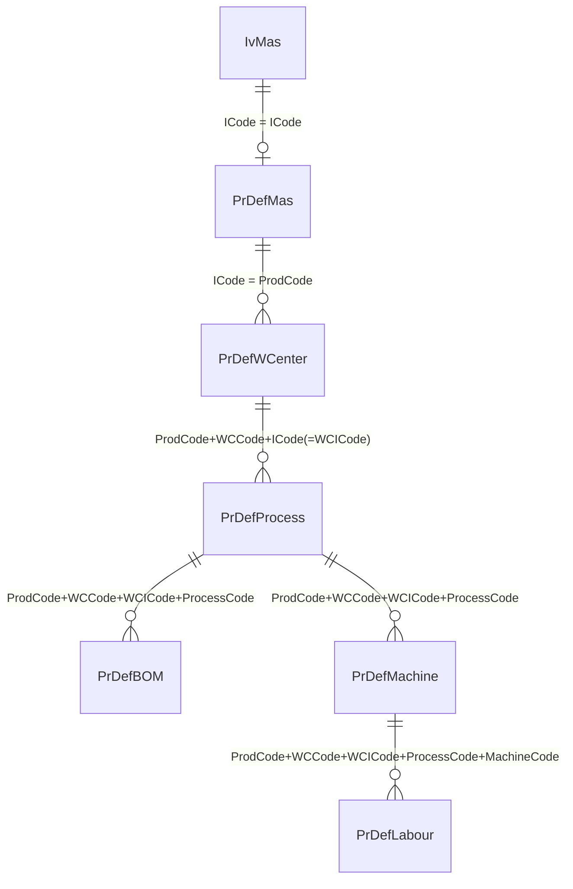

# Production Product Definition UI

## 1. Overview

The **Product Definition** screen defines how a finished/semi-finished product is manufactured.

The page is divided into:

1. Product Information
2. Work Center
3. Process
4. BOM
5. Machine
6. Labour

The lower section uses tabs:

- CENTER
- PROCESS
- BOM
- MACHINE
- LABOUR

---

# 2. Product Information

## Section Title

`PRODUCT INFO`

## Layout

Use a two-column form layout.

### Left Column

| Field | Type | Required | Example | Notes |
|---|---|---:|---|---|
| Product Def Code | Lookup / Text | Yes | `DUMMYPROD` | Lookup/search button beside field |
| Std Batch Size | Numeric | Yes | `1` | Standard production batch quantity |
| Std UOM | Read-only / Lookup | No | `PCS` | UOM associated with product |
| Work Order Prefix | Dropdown | No | | Prefix used when generating Work Order number |

### Product Definition Action

Button:

`UPDATE`

Located beside Product Def Code.

Used to load/update the selected Product Definition.

---

### Right Column

| Field | Type | Required | Example |
|---|---|---:|---|
| Description | Text | Yes | `DUMMY PRODUCT TO TEST` |
| Remark | Multiline Text | No | |
| View BOM | Button | No | `VIEW BOM` |

### View BOM Button

Button:

`VIEW BOM`

Purpose:

Display the complete BOM structure/tree for the selected Product Definition.

---

# 3. Navigation Tabs

Tabs displayed below Product Information:

| Sequence | Tab |
|---:|---|
| 1 | CENTER |
| 2 | PROCESS |
| 3 | BOM |
| 4 | MACHINE |
| 5 | LABOUR |

Only one tab is active at a time.

The active tab should be visually highlighted.

---

# 4. CENTER Tab

## Purpose

Defines the Work Centers involved in manufacturing the product.

A Product Definition can contain one or multiple Work Centers.

## Grid

| Column | Type | Example | Description |
|---|---|---|---|
| Add | Action | `+` | Add new Work Center |
| Delete | Action | `X` | Remove row |
| Work Center | Lookup | `WC1` | Work Center code |
| Seq No | Numeric | `10` | Processing sequence |
| Center Product | Item Lookup | `DUMMYPROD` | Product produced by this center |
| Description | Read-only Text | `DUMMY PRODUCT TO TEST` | Center product description |
| Class | Lookup/Text | `OT` | Work Center/Product classification |
| Pack Size | Numeric | `1` | Output pack/batch size |
| Std UOM | Read-only / Lookup | `PCS` | Standard output UOM |

## Example

| Work Center | Seq No | Center Product | Description | Class | Pack Size | Std UOM |
|---|---:|---|---|---|---:|---|
| WC1 | 10 | DUMMYPROD | DUMMY PRODUCT TO TEST | OT | 1 | PCS |

## Sequence Behaviour

`Seq No` determines the Work Center execution order.

Example:

```text
10 -> Cutting
20 -> Assembly
30 -> Packing


the data link
Product Definition
  - Work Center
      - 1 to * Workd Process
          - link to BOM or No Bom
          - link to 1 Machine
      - link to 1 labour

old ERP table design

#Product Def table in old ERP

CREATE TABLE [dbo].[PrDefMas](
	[ICode] [nvarchar](20) NOT NULL,  ---> this the the Product Code (from stock master)
	[IDesc] [nvarchar](200) NULL,  ---> item desc from stock master
	[StdBatchSize] [float] NULL,  --> default to 1, not sure still need to use this or not
	[StdUOM] [nvarchar](5) NULL,  --> from stock master
	[Active] [bit] NULL,
	[TotalTime] [float] NULL,
	[Created] [datetime] NULL,
	[Updated] [datetime] NULL,
	[UserID] [nvarchar](10) NULL,       ===> make the audit columns same as current project
	[UpdatedUID] [nvarchar](10) NULL,
	[CompCode] [nvarchar](10) NULL,
	[BranchCode] [nvarchar](10) NULL,
	[LocCode] [nvarchar](10) NULL,
	[Remark] [nvarchar](1000) NULL,
	[Prefix] [nvarchar](10) NULL,
	[DRNo] [nvarchar](20) NULL,
	[ActPrdCode] [varchar](20) NULL,
 CONSTRAINT [PK_PrDefMas] PRIMARY KEY CLUSTERED 
(
	[ICode] ASC
)WITH (PAD_INDEX = OFF, STATISTICS_NORECOMPUTE = OFF, IGNORE_DUP_KEY = OFF, ALLOW_ROW_LOCKS = ON, ALLOW_PAGE_LOCKS = ON, OPTIMIZE_FOR_SEQUENTIAL_KEY = OFF) ON [PRIMARY]
) ON [PRIMARY]
GO


#Work center table in old erp
CREATE TABLE [dbo].[PrDefWCenter](
	[ProdCode] [nvarchar](20) NOT NULL,
	[WCCode] [nvarchar](20) NOT NULL,  ---> center code
	[ICode] [nvarchar](20) NOT NULL,  --> output item code from this "center" ( the itemcode from stock master also)
	[IDesc] [nvarchar](200) NULL,  --> item desc from stock master
	[Class] [nvarchar](10) NULL,  --item class from stokc master
	[SeqNo] [int] NULL,
	[SCode] [nvarchar](20) NULL,
	[StdPackSize] [float] NULL,
	[StdUOM] [nvarchar](5) NULL,
	[CompCode] [nvarchar](10) NULL,
	[BranchCode] [nvarchar](10) NULL,
	[LocCode] [nvarchar](10) NULL,
 CONSTRAINT [PK_PrDefWCenter] PRIMARY KEY CLUSTERED 
(
	[ProdCode] ASC,
	[WCCode] ASC,
	[ICode] ASC
)WITH (PAD_INDEX = OFF, STATISTICS_NORECOMPUTE = OFF, IGNORE_DUP_KEY = OFF, ALLOW_ROW_LOCKS = ON, ALLOW_PAGE_LOCKS = ON, OPTIMIZE_FOR_SEQUENTIAL_KEY = OFF) ON [PRIMARY]
) ON [PRIMARY]
GO
 

#work process table in old erp
CREATE TABLE [dbo].[PrDefProcess](
	[ProdCode] [nvarchar](20) NOT NULL,
	[WCCode] [nvarchar](20) NOT NULL,   ---> center code
	[WCICode] [nvarchar](20) NOT NULL,  --> the PrDefWCenter.ICode
	[ProcessCode] [nvarchar](10) NOT NULL, --> Work Process code
	[SeqNo] [int] NULL,
	[SetupLostQty] [float] NULL,
	[OperationLostQty] [float] NULL,
	[FinalProcess] [bit] NULL,
	[SCode] [nvarchar](20) NULL,
	[CompCode] [nvarchar](10) NULL,
	[BranchCode] [nvarchar](10) NULL,
	[LocCode] [nvarchar](10) NULL,
	[Remark] [nvarchar](250) NULL,
 CONSTRAINT [PK_PrDefProcess] PRIMARY KEY CLUSTERED 
(
	[ProdCode] ASC,
	[WCCode] ASC,
	[WCICode] ASC,
	[ProcessCode] ASC
)WITH (PAD_INDEX = OFF, STATISTICS_NORECOMPUTE = OFF, IGNORE_DUP_KEY = OFF, ALLOW_ROW_LOCKS = ON, ALLOW_PAGE_LOCKS = ON, OPTIMIZE_FOR_SEQUENTIAL_KEY = OFF) ON [PRIMARY]
) ON [PRIMARY]
GO

#BOMN table in old erp
CREATE TABLE [dbo].[PrDefBOM](
	[ProdCode] [nvarchar](20) NOT NULL,
	[WCCode] [nvarchar](20) NOT NULL,
	[WCICode] [nvarchar](20) NOT NULL,  --> the PrDefWCenter.ICode
	[ProcessCode] [nvarchar](10) NOT NULL,--> process code
	[ICode] [nvarchar](20) NOT NULL,
	[IName] [nvarchar](200) NULL,
	[StdQty] [float] NULL,
	[StdUOM] [nvarchar](5) NULL,
	[Warehouse] [nvarchar](10) NULL,
	[BomDefault] [bit] NULL,
	[CompCode] [nvarchar](10) NULL,
	[BranchCode] [nvarchar](10) NULL,
	[LocCode] [nvarchar](10) NULL,
	[WIPBomDefault] [bit] NULL,
	[tolerance] [smallint] NULL,
	[levelID] [nvarchar](5) NULL,
	[UID] [int] IDENTITY(1,1) NOT NULL,
 CONSTRAINT [PK_PrDefBOM] PRIMARY KEY CLUSTERED 
(
	[ProdCode] ASC,
	[WCCode] ASC,
	[WCICode] ASC,
	[ProcessCode] ASC,
	[ICode] ASC
)WITH (PAD_INDEX = OFF, STATISTICS_NORECOMPUTE = OFF, IGNORE_DUP_KEY = OFF, ALLOW_ROW_LOCKS = ON, ALLOW_PAGE_LOCKS = ON, OPTIMIZE_FOR_SEQUENTIAL_KEY = OFF) ON [PRIMARY]
) ON [PRIMARY]
GO

ALTER TABLE [dbo].[PrDefBOM] ADD  CONSTRAINT [DF__PrDefBOM__WIPBom__51DFA92C]  DEFAULT ((0)) FOR [WIPBomDefault]
GO

#work Machine table in old erp
CREATE TABLE [dbo].[PrDefMachine](
	[ProdCode] [nvarchar](20) NOT NULL,
	[WCCode] [nvarchar](20) NOT NULL, the PrDefWCenter.WCCode
	[WCICode] [nvarchar](20) NOT NULL, --> the PrDefWCenter.ICode
	[ProcessCode] [nvarchar](10) NOT NULL,
	[MachineCode] [nvarchar](10) NOT NULL,
	[MachineName] [nvarchar](30) NULL,
	[CycleTime] [float] NOT NULL,
	[ConversionTime] [float] NULL,
	[StartupTime] [float] NULL,
	[QueueTime] [float] NULL,
	[SeqNo] [int] NULL,
	[MacDefault] [bit] NULL,
	[CompCode] [nvarchar](10) NULL,
	[BranchCode] [nvarchar](10) NULL,
	[LocCode] [nvarchar](10) NULL,
	[CycleTimeCal] [float] NULL,
	[CycleTimeInvd] [float] NULL,
	[NoMachine] [int] NULL,
 CONSTRAINT [PK_PrDefMachine] PRIMARY KEY CLUSTERED 
(
	[ProdCode] ASC,
	[WCCode] ASC,
	[WCICode] ASC,
	[ProcessCode] ASC,
	[MachineCode] ASC
)WITH (PAD_INDEX = OFF, STATISTICS_NORECOMPUTE = OFF, IGNORE_DUP_KEY = OFF, ALLOW_ROW_LOCKS = ON, ALLOW_PAGE_LOCKS = ON, OPTIMIZE_FOR_SEQUENTIAL_KEY = OFF) ON [PRIMARY]
) ON [PRIMARY]
GO


#work Labour table in old erp
CREATE TABLE [dbo].[PrDefLabour](
	[ProdCode] [nvarchar](20) NOT NULL,
	[WCCode] [nvarchar](20) NOT NULL,
	[WCICode] [nvarchar](20) NOT NULL,
	[ProcessCode] [nvarchar](10) NOT NULL,
	[MachineCode] [nvarchar](10) NOT NULL,
	[LabourCode] [nvarchar](50) NOT NULL,
	[LabourCost] [float] NULL,
	[CompCode] [nvarchar](10) NULL,
	[BranchCode] [nvarchar](10) NULL,
	[LocCode] [nvarchar](10) NULL,
 CONSTRAINT [PK_PrDefLabour] PRIMARY KEY CLUSTERED 
(
	[ProdCode] ASC,
	[WCCode] ASC,
	[WCICode] ASC,
	[ProcessCode] ASC,
	[MachineCode] ASC,
	[LabourCode] ASC
)WITH (PAD_INDEX = OFF, STATISTICS_NORECOMPUTE = OFF, IGNORE_DUP_KEY = OFF, ALLOW_ROW_LOCKS = ON, ALLOW_PAGE_LOCKS = ON, OPTIMIZE_FOR_SEQUENTIAL_KEY = OFF) ON [PRIMARY]
) ON [PRIMARY]
GO


# Product Definition — Database Linking & Column Usage from Old ERP system

Source of truth used for this note:

- Designer mapping: `ERPClasses/BL/ErpDataClasses.dbml`
- Save adapters: `ERPClasses/Classes/CAdapter.cs`, `ProductionPlan/BL/CAdapter.cs`
- Read BL: `ERPClasses/BL/ProdDefBL.cs`
- Editor page: `ProductionPlan/ProdPlan/ProdDefination.aspx.cs`

Scope: the six current definition tables

- `PrDefMas`
- `PrDefWCenter`
- `PrDefProcess`
- `PrDefBOM`
- `PrDefMachine`
- `PrDefLabour`

---

## 1. Relationship overview



There is **one physical FK** declared in the designer (`PrDefMas.ICode -> child.ProdCode`,
`DeleteRule=CASCADE`), repeated for WCenter, Process, Machine and Labour. The deeper links
(WCenter -> Process -> BOM/Machine -> Labour) are **not** DB FK constraints — they are logical
links implemented by application joins on composite keys.

---

## 2. The join keys (the important part)

| Link | Join condition |
|---|---|
| Item -> header | `IvMas.ICode = PrDefMas.ICode` |
| Header -> route | `PrDefMas.ICode = PrDefWCenter.ProdCode` |
| Route -> operation | `PrDefWCenter.ProdCode = PrDefProcess.ProdCode` **AND** `PrDefWCenter.WCCode = PrDefProcess.WCCode` **AND** `PrDefWCenter.ICode = PrDefProcess.WCICode` |
| Operation -> material | `PrDefProcess.ProdCode/WCCode/WCICode/ProcessCode = PrDefBOM.<same 4>` |
| Operation -> machine | `PrDefProcess.ProdCode/WCCode/WCICode/ProcessCode = PrDefMachine.<same 4>` |
| Machine -> labour | `PrDefMachine.ProdCode/WCCode/WCICode/ProcessCode/MachineCode = PrDefLabour.<same 5>` |

The single most-missed detail: **the work-center's `ICode` is propagated to children as `WCICode`**.
That is:

```text
PrDefWCenter.ICode
    = PrDefProcess.WCICode
    = PrDefBOM.WCICode
    = PrDefMachine.WCICode
    = PrDefLabour.WCICode
```

It is the *output / intermediate item* produced by that route node, not display text — the whole
chain depends on this rename.

Confirmed from `ProdDefBL.GetPrDefProcessV2` / `GetPrDefBOmV2` / `GetPrDefMachineV2`
(`ERPClasses/BL/ProdDefBL.cs:19-96`):

```sql
from PrDefProcess p
left join PrDefWCenter w
     on p.ProdCode = w.ProdCode and p.WCCode = w.WCCode and p.WCICode = w.ICode
```

---

## 3. Table-by-table: key + column usage

### `PrDefMas` — definition header (1 row per product)

**PK:** `ICode`

| Column | Usage |
|---|---|
| `ICode` | Product/item code; links to `IvMas.ICode` and to all children via `ProdCode` |
| `IDesc` | Item description (copied from `IvMas`) |
| `StdBatchSize` | **Output base batch** — drives `CentreQty = WOQty x CentrePackSize / StdBatchSize` and the BOM formula |
| `StdUOM` | Unit of measure |
| `Active` | `1` = definition activated; set `0` when saved without BOM/machine setup (`SetActiveStatus`) |
| `TotalTime` | Cached total route time |
| `Prefix` | Work-order number prefix (added 2017, not in DBML) |
| `Remark`, `DRNo`, `ActPrdCode` | Free remark / delivery-request linkage / actual product code (drift: not all in DBML) |
| `Created`, `Updated`, `UserID`, `UpdatedUID` | Audit stamps |
| `CompCode`, `BranchCode`, `LocCode` | Tenant scope — **written but generally not used to filter reads** |

### `PrDefWCenter` — route node / work centre step

**PK:** `(ProdCode, WCCode, ICode)`

| Column | Usage |
|---|---|
| `ProdCode` | FK -> `PrDefMas.ICode` (the definition this route belongs to) |
| `WCCode` | Work-centre code -> `PrWorkCentre` |
| `ICode` | **Output/intermediate item** for this centre; echoed as `WCICode` in all child tables |
| `IDesc`, `Class`, `StdUOM` | Cached item description / item class / UOM |
| `SeqNo` | Route stage order — the sequencing driver for scheduling (ascending = forward, descending = back-schedule) |
| `StdPackSize` | Pack/batch size for this centre; `NormalizedCentrePack = StdPackSize / PrDefMas.StdBatchSize` |
| `SCode` | Subcontract / supplier code |
| `CompCode`, `BranchCode`, `LocCode` | Scope columns |

### `PrDefProcess` — operation under a route node

**PK:** `(ProdCode, WCCode, WCICode, ProcessCode)`

| Column | Usage |
|---|---|
| `ProdCode`, `WCCode` | Link up to `PrDefWCenter` |
| `WCICode` | Equals `PrDefWCenter.ICode` (the output item) |
| `ProcessCode` | Operation code -> `PrProcess` |
| `SeqNo` | Operation order inside the centre |
| `SetupLostQty`, `OperationLostQty` | Scrap/loss quantities for setup and run |
| `FinalProcess` | Marks the operation that completes the centre (validation requires >=1 per work centre) |
| `SCode` | Subcontract/supplier code |
| `Remark` | Operation remark (drift: exists in table/adapter, missing from DBML) |
| `CompCode`, `BranchCode`, `LocCode` | Scope columns |

### `PrDefBOM` — material attached to an operation

**PK:** `(ProdCode, WCCode, WCICode, ProcessCode, ICode)`

| Column | Usage |
|---|---|
| `ProdCode`, `WCCode`, `WCICode`, `ProcessCode` | Link to `PrDefProcess` |
| `ICode` | Component item code -> `IvMas.ICode` |
| `IName` | Component description (cached) |
| `StdQty` | Component qty per base batch; consumed as `round(StdQty / CentreStdPackSize x CentreQty, 4)` |
| `StdUOM` | Component UOM |
| `Warehouse` | Default issue warehouse |
| `BomDefault` | Primary BOM line flag |
| `WIPBomDefault` | WIP-component default flag |
| `tolerance`, `levelID` | Qty tolerance % / multi-level tree level (drift: not in DBML) |
| `CompCode`, `BranchCode`, `LocCode` | Scope columns |

### `PrDefMachine` — machine/resource option for an operation

**PK:** `(ProdCode, WCCode, WCICode, ProcessCode, MachineCode)`

| Column | Usage |
|---|---|
| The 4 operation columns | Link to `PrDefProcess` |
| `MachineCode` / `MachineName` | Machine -> `PrMachine` / cached name |
| `CycleTime` | Seconds per cycle; basis of run-time calc |
| `ConversionTime`, `StartupTime`, `QueueTime` | Additional time components in the machine-time formula |
| `SeqNo` | Machine group/sequence; default machines in the same sequence run in parallel |
| `MacDefault` | Marks the default/selected machine |
| `CycleTimeInvd`, `CycleTimeCal`, `NoMachine` | Extension columns present in some forks (drift vs DBML) |
| `CompCode`, `BranchCode`, `LocCode` | Scope columns |

Formula (confirmed in the WO generator):

```text
MachineSeconds =
      CycleTime / CentreStdPackSize
      x (CentreQty / countOfDefaultMachinesInSameSeq)
    + ConversionTime
    + StartupTime
    + QueueTime
```

### `PrDefLabour` — labour standard for a machine

**PK:** `(ProdCode, WCCode, WCICode, ProcessCode, MachineCode, LabourCode)`

| Column | Usage |
|---|---|
| The 5 machine columns | Link to `PrDefMachine` |
| `LabourCode` | Labour/operator code -> `PrOperator` |
| `LabourCost` | Cost per output unit; `WorkOrderLabourCost = LabourCost x WorkOrderQty` |
| `CompCode`, `BranchCode`, `LocCode` | Scope columns |

---

## 4. Things to watch out for

- **Only the header FK is real.** The DB cascade is `PrDefMas -> (WCenter/Process/Machine/Labour)`.
  Everything below that is application-enforced; deleting a work centre/process in the UI manually
  cascades to Process/BOM/Machine (see `DeleteProcess`, `DeleteBOM` in `ProdDefination.aspx.cs`).
- **`WCICode` vs `ICode`.** In `PrDefWCenter` the column is `ICode`; in every child table the same
  value is stored as `WCICode`. A join that mixes them will silently return nothing.
- **Tenant columns don't isolate.** `CompCode`, `BranchCode`, `LocCode` are written on save, but
  `ProdDefBL` reads filter only by `ProdCode`/`ICode`.
- **Designer drift.** `ErpDataClasses.dbml` omits columns the runtime uses:
  `PrDefMas.Prefix/DRNo/ActPrdCode`, `PrDefProcess.Remark`, `PrDefBOM.tolerance/levelID`, and the
  `PrDefMachine` extension columns. Also `PrDefWCenter.IDesc` is 60 in DBML but 200 in the actual
  table. Treat the live schema (or the adapters) as authoritative.
- **`inner join` vs `left join` bug.** The original `GetPrDefProcess/BOm/Machine` used `inner join`
  on `PrDefWCenter`, so orphaned child rows existed in the DB but never showed in the UI. That was
  fixed by the `V2` methods switching to `left join` (`ProdDefBL.cs`, tasks 250509052379 /
  250318072325 / 250724074010).

---

## 5. Column dictionaries (as declared in DBML)

### PrDefMas

| Column | DbType | PK |
|---|---|---|
| `ICode` | NVarChar(20) NOT NULL | Yes |
| `IDesc` | NVarChar(200) | |
| `StdBatchSize` | Float | |
| `StdUOM` | NVarChar(5) | |
| `Active` | Bit | |
| `TotalTime` | Float | |
| `Created` | DateTime | |
| `Updated` | DateTime | |
| `UserID` | NVarChar(10) | |
| `UpdatedUID` | NVarChar(10) | |
| `CompCode` | NVarChar(10) | |
| `BranchCode` | NVarChar(10) | |
| `LocCode` | NVarChar(10) | |
| `Remark` | NVarChar(1000) | |

### PrDefWCenter

| Column | DbType | PK |
|---|---|---|
| `ProdCode` | NVarChar(20) NOT NULL | Yes |
| `WCCode` | NVarChar(20) NOT NULL | Yes |
| `ICode` | NVarChar(20) NOT NULL | Yes |
| `IDesc` | NVarChar(60) | |
| `Class` | NVarChar(10) | |
| `SeqNo` | Int | |
| `StdPackSize` | Float | |
| `StdUOM` | NVarChar(5) | |
| `SCode` | NVarChar(20) | |
| `CompCode` | NVarChar(10) | |
| `BranchCode` | NVarChar(10) | |
| `LocCode` | NVarChar(10) | |

### PrDefProcess

| Column | DbType | PK |
|---|---|---|
| `ProdCode` | NVarChar(20) NOT NULL | Yes |
| `WCCode` | NVarChar(20) NOT NULL | Yes |
| `WCICode` | NVarChar(20) NOT NULL | Yes |
| `ProcessCode` | NVarChar(10) NOT NULL | Yes |
| `SeqNo` | Int | |
| `SetupLostQty` | Float | |
| `OperationLostQty` | Float | |
| `FinalProcess` | Bit | |
| `SCode` | NVarChar(20) | |
| `CompCode` | NVarChar(10) | |
| `BranchCode` | NVarChar(10) | |
| `LocCode` | NVarChar(10) | |

### PrDefBOM

| Column | DbType | PK |
|---|---|---|
| `ProdCode` | NVarChar(20) NOT NULL | Yes |
| `WCCode` | NVarChar(20) NOT NULL | Yes |
| `WCICode` | NVarChar(20) NOT NULL | Yes |
| `ProcessCode` | NVarChar(10) NOT NULL | Yes |
| `ICode` | NVarChar(20) NOT NULL | Yes |
| `IName` | NVarChar(200) | |
| `StdQty` | Float | |
| `StdUOM` | NVarChar(5) | |
| `Warehouse` | NVarChar(10) | |
| `BomDefault` | Bit | |
| `CompCode` | NVarChar(10) | |
| `BranchCode` | NVarChar(10) | |
| `LocCode` | NVarChar(10) | |
| `WIPBomDefault` | Bit | |

### PrDefMachine

| Column | DbType | PK |
|---|---|---|
| `ProdCode` | NVarChar(20) NOT NULL | Yes |
| `WCCode` | NVarChar(20) NOT NULL | Yes |
| `WCICode` | NVarChar(20) NOT NULL | Yes |
| `ProcessCode` | NVarChar(10) NOT NULL | Yes |
| `MachineCode` | NVarChar(10) NOT NULL | Yes |
| `MachineName` | NVarChar(30) | |
| `CycleTime` | Float NOT NULL | |
| `ConversionTime` | Float | |
| `StartupTime` | Float | |
| `QueueTime` | Float | |
| `SeqNo` | Int | |
| `MacDefault` | Bit | |
| `CompCode` | NVarChar(10) | |
| `BranchCode` | NVarChar(10) | |
| `LocCode` | NVarChar(10) | |

### PrDefLabour

| Column | DbType | PK |
|---|---|---|
| `ProdCode` | NVarChar(20) NOT NULL | Yes |
| `WCCode` | NVarChar(20) NOT NULL | Yes |
| `WCICode` | NVarChar(20) NOT NULL | Yes |
| `ProcessCode` | NVarChar(10) NOT NULL | Yes |
| `MachineCode` | NVarChar(10) NOT NULL | Yes |
| `LabourCode` | NVarChar(50) NOT NULL | Yes |
| `LabourCost` | Float | |
| `CompCode` | NVarChar(10) | |
| `BranchCode` | NVarChar(10) | |
| `LocCode` | NVarChar(10) | |

---

## 6. Related tables (for context)

- Revision family: `PrDefRevMas`, `PrDefRevWCenter`, `PrDefRevProcess`, `PrDefRevBOM`,
  `PrDefRevMachine`, `PrDefRevLabour` — mirror the six live tables plus `Revision`.
- Work-order snapshot family: `PrSchMas`, `PrSchWCenter`, `PrSchProcess`, `PrSchBOM`,
  `PrSchMachine`, `PrSchLabour` — expanded per-WO copy with calculated quantities and dates.
- Attachment: `PrdDefAttach` — identity `UID`, keyed by `ProdCode` + `Revision`.

See `product-definition-legacy-analysis.md` (sections B and C) and
`product-definition-target-design.md` for the full narrative, downstream consumers and the
modernisation target model.
