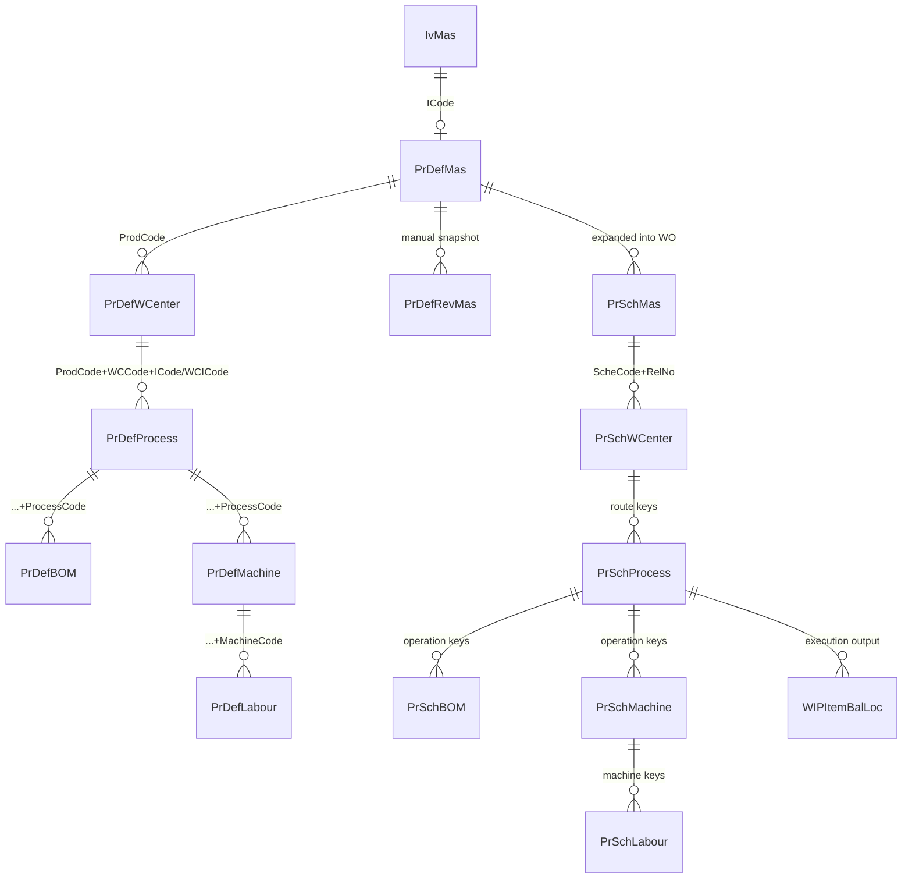
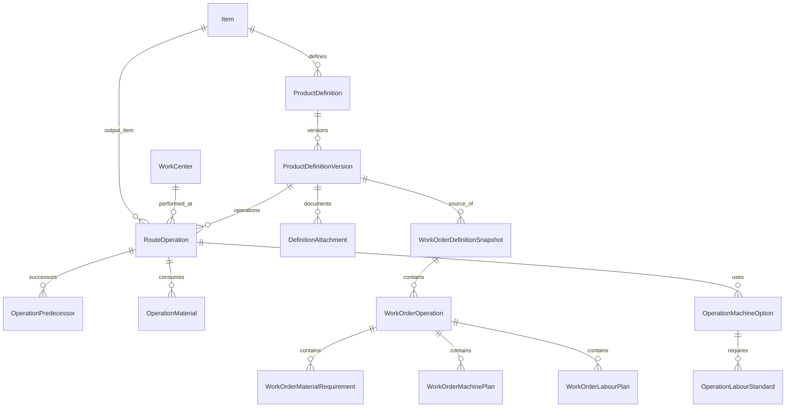

# Product Definition Modernization — Complete Plan

**Scope:** Legacy ERP Product Definition, revisioning, production planning, work-order snapshots, WIP execution, finished-goods posting and costing  
**Legacy entry point:** `ProductionPlan/ProdPlan/ProdDefinationRevView.aspx.cs`  
**Document purpose:** A single implementation-ready reference combining evidence-based legacy analysis, target Blazor architecture, migration mapping and phased delivery planning.  
**Status:** Planning baseline; no ERP source implementation is included in this document.

## How to use this document

- Part I is the evidence baseline. Statements marked `UNCONFIRMED` require live-database, production-data or stakeholder validation.
- Part II is the proposed target architecture and domain contract.
- Part III maps legacy structures and behavior into the target model and migration controls.
- Part IV is the executable delivery sequence, including tests and acceptance criteria.
- Resolve the Phase 0 decisions before freezing schemas or implementing calculation services.

## Contents

1. [Part I — Legacy Reverse Engineering](#part-i--legacy-reverse-engineering)
2. [Part II — Target Architecture and Domain Design](#part-ii--target-architecture-and-domain-design)
3. [Part III — Legacy-to-Target Migration Map](#part-iii--legacy-to-target-migration-map)
4. [Part IV — Phased Implementation Plan](#part-iv--phased-implementation-plan)

---
## Part I — Legacy Reverse Engineering

### Document status and scope

This is Phase 1 of the Product Definition migration study. The investigation started at `ProductionPlan/ProdPlan/ProdDefinationRevView.aspx.cs` and followed the live editor, revision helper, work-order snapshot, material issue, daily production/WIP, finished-goods posting, costing SQL, MRP views, reports, DBML mappings, and SQL scripts across the solution.

Confidence labels used below:

- **CONFIRMED** — directly supported by code or checked-in SQL.
- **PARTIALLY CONFIRMED** — the data or one path exists, but not every variant behaves identically.
- **UNCONFIRMED** — the repository does not prove the behavior; live-schema or process evidence is required.

The workspace contains many customer-specific forks. Findings describe the standard `ProductionPlan` path unless a customization is named. There is no accessible live database catalog, so DBML and checked-in SQL prove application expectations, but not every deployed FK, index, default, trigger, or later schema alteration.

### A. Executive summary

The legacy Product Definition is a combined **routing + operation resource + process-level BOM** for an inventory item. It is not simply a product-level BOM.

```text
IvMas item
  └─ PrDefMas product definition (one current mutable version)
      └─ PrDefWCenter route step/output item
          └─ PrDefProcess operation
              ├─ PrDefBOM component requirement
              └─ PrDefMachine eligible/default virtual resource
                  └─ PrDefLabour labour code and per-unit cost
```

The work-center row contains both `WCCode` and `ICode`. `WCCode` identifies the organizational/resource center; `ICode` is propagated as `WCICode` through processes, BOM, machines, labour, work-order snapshots, WIP balances, and finished-goods paths. Therefore `WCICode` is operationally the output/intermediate item for that center, not merely display metadata. The code does not automatically infer the next component from the prior output; execution explicitly consumes a previous WIP lot using `PreICode`, `PreWCenter`, `PreProcess`, and `PreLotNo`.

Saving a work order copies the current `PrDef*` definition into `PrSch*` tables. Existing work orders subsequently load the `PrSch*` snapshot, which protects routing and BOM history from most later definition edits. However, legacy costing still has paths that read live `PrDefLabour`, so historical cost is not fully isolated.

Revision control exists, but as a manual archive/restore mechanism. `REVISE` copies all six live tables to `PrDefRev*` with the next integer revision. It does not create draft/effective/approved states, and `RESTORE` deletes the current live definition then inserts the archived rows. Work orders do not store a source Product Definition revision ID.

Sequence numbers are used for ordering and schedule calculation. Same-sequence processes/machines are grouped and machine rows in a group are treated in parallel for elapsed-time selection. Same-sequence work centers are **not safely implemented as a synchronization barrier**. Daily production validates that its source is one of the immediately previous sequence's centers/processes and that a source WIP lot exists; it does not require all peers in a same-sequence group to complete. In addition, the standard and automatic schedulers select a distinct table containing only `SeqNo` and then read `WCCode`, a runtime defect. Parallel-center semantics must therefore be classified as **PARTIALLY CONFIRMED / unsafe**, not assumed correct.

Core formulas confirmed in the work-order generator are:

```text
CentreQty = WorkOrderQty × CentreStdPackSize / ProductStdBatchSize

BOMRequiredQty = round(
    BOMStdQty / CentreStdPackSize × CentreQty,
    4)

MachineSeconds =
    CycleTimeSeconds / CentreStdPackSize
    × (CentreQty / CountOfDefaultMachinesInSameMachineSequence)
    + ConversionTimeSeconds
    + StartupTimeSeconds
    + QueueTimeSeconds

WorkOrderLabourCost = DefinitionLabourCost × WorkOrderQty
```

The BOM formula simplifies to `BOMStdQty × WorkOrderQty / ProductStdBatchSize`. This confirms support for “1 material produces 5 products”: set `PrDefMas.StdBatchSize = 5` and component `PrDefBOM.StdQty = 1` for that base batch.

### B. Domain model

| Concept | Actual legacy object | Meaning |
|---|---|---|
| Item/product | `IvMas` | Inventory identity, type, class, UOM, warehouse, item status, catch weight and overhead attributes. |
| Product Definition | `PrDefMas` | Current mutable definition header for one `ICode`; includes base/output batch size, UOM, active flag, prefix and audit fields. |
| Work Central | `PrDefWCenter` | Route node identified by `(ProdCode, WCCode, ICode)`; `ICode` is the route node's output/intermediate item. |
| Work Process | `PrDefProcess` | Operation under a specific central/output item; sequence, loss quantities, final-process marker and remark. |
| BOM material | `PrDefBOM` | Component attached to product + central + central output + process. |
| Machine | `PrDefMachine` | Machine/resource option attached to an operation; default selection, sequence and times. |
| Labour | `PrDefLabour` | Labour code and cost attached to a specific operation and machine. |
| Revision | `PrDefRevMas`, `PrDefRevWCenter`, `PrDefRevProcess`, `PrDefRevBOM`, `PrDefRevMachine`, `PrDefRevLabour` | Manual immutable-looking copy, but deletable and restorable; each row gains `Revision`. |
| Work-order snapshot | `PrSchMas`, `PrSchWCenter`, `PrSchProcess`, `PrSchBOM`, `PrSchMachine`, `PrSchLabour` | Expanded per-work-order copy with calculated quantities and dates. |
| WIP | `WIPItemBal`, `WIPItemBalLoc` | Aggregate and lot-specific in-process inventory keyed by WO, item, central, process and lot/revision. |

#### Actual relationship diagram



Only the `PrDefMas`-to-child associations are declared in the reviewed DBML. The deeper lines above are application joins and composite-key usage; deployed database FKs are **UNCONFIRMED**.

### C. Database map

#### Current definition tables

| Table | Application key | Important fields | Evidence |
|---|---|---|---|
| `PrDefMas` | `ICode` | `IDesc`, `StdBatchSize`, `StdUOM`, `Active`, `TotalTime`, `Prefix`, `Remark`, `CompCode`, `BranchCode`, `LocCode`, audit fields | `ERPClasses/BL/ErpDataClasses.dbml:116`; `ProductionPlan/BL/CAdapter.cs:12` |
| `PrDefWCenter` | `(ProdCode, WCCode, ICode)` | `IDesc`, `Class`, `SeqNo`, `StdPackSize`, `StdUOM`, `SCode`, scope fields | `ERPClasses/BL/ErpDataClasses.dbml:535`; `ERPClasses/Classes/CAdapter.cs:31090` |
| `PrDefProcess` | `(ProdCode, WCCode, WCICode, ProcessCode)` | `SeqNo`, `SetupLostQty`, `OperationLostQty`, `FinalProcess`, `SCode`, `Remark`, scope fields | `ERPClasses/BL/ErpDataClasses.dbml:552`; runtime adapter at `ERPClasses/Classes/CAdapter.cs:28162` |
| `PrDefBOM` | `(ProdCode, WCCode, WCICode, ProcessCode, ICode)` | `IName`, `StdQty`, `StdUOM`, `Warehouse`, `BomDefault`, `WIPBomDefault`, `tolerance`, `levelID`, scope fields | `ERPClasses/BL/ErpDataClasses.dbml:1352`; editor at `ProdDefination.aspx.cs:1121`; trigger script |
| `PrDefMachine` | `(ProdCode, WCCode, WCICode, ProcessCode, MachineCode)` | `MachineName`, `CycleTime`, `ConversionTime`, `StartupTime`, `QueueTime`, `SeqNo`, `MacDefault`, `CycleTimeInvd`, `CycleTimeCal`, `NoMachine`, scope fields | `ERPSQL_DB/DataTable/PrDefMachine.txt`; adapter at `ERPClasses/Classes/CAdapter.cs:29836` |
| `PrDefLabour` | `(ProdCode, WCCode, WCICode, ProcessCode, MachineCode, LabourCode)` | `LabourCost`, scope fields | `ERPClasses/BL/ErpDataClasses.dbml:2547`; adapter at `ERPClasses/Classes/CAdapter.cs:31257` |
| `PrdDefAttach` | identity `UID` expected | `ProdCode`, `Revision`, `ImageURL`, `filename` | `ProdDefAttachment.aspx.cs:60`; `ProductionPlan/BL/CAdapter.cs:125` |

Schema drift is real: DBML omits fields that runtime adapters/pages use (`PrDefMas.Prefix`, `PrDefProcess.Remark`, `PrDefBOM.tolerance`, `PrDefBOM.levelID`, and machine extension columns). Migration must use the live catalog, not DBML alone.

#### Revision tables

The revision family mirrors the six current tables and adds `Revision`. `PrDefRevMas` has composite key `(ICode, Revision)` in `ProductionDataClasses.dbml`. The helper copies columns by identical name, proving that child revision tables mirror their current counterparts plus `Revision`. Exact deployed keys/FKs/indexes/defaults for five child tables are **UNCONFIRMED** because only `PrDefRevMas` is mapped in the checked DBML.

#### Downstream tables

| Family | Purpose |
|---|---|
| `PrSchMas`, `PrSchWCenter`, `PrSchProcess`, `PrSchBOM`, `PrSchMachine`, `PrSchLabour` | Work-order header and definition snapshot. |
| `PrSchMacMain` | Flattened machine scheduling projection. |
| `PrSchDR` | Delivery-request allocations. |
| `IvTrxBatch`, `IvTrxBatchDetail`, `IvTrxHistory` | Draft/posted production and inventory transactions. |
| `WIPItemBal`, `WIPItemBalLoc` | WIP quantities and lineage. |
| `PrSchDailyHdr`, `PrSchDailyProcess`, `PrSchDailyProd` | Daily execution/output records. |
| `IvBalance`, `IvBalLoc`, `IvBalLocCost`, `IvFGCostHis` | Inventory quantity/cost and FG cost history. |
| `PrShift`, `PrShiftGroup`, `PrShiftCalendar`, `PrCalendar`, `PrHoliday`, `PrPreventive` | Working calendar, shift, holiday and maintenance inputs. |

#### Views, procedure and trigger confirmed in source control

| Object | Use |
|---|---|
| `vPrDefBOM` | Legacy flattened definition view; machine/labour scalar subqueries use `= NULL` and are therefore defective. |
| `vprd_ProdDefination` | Product/BOM/center/machine/labour inquiry. |
| `vprd_ProductList` | Active inventory-linked definitions. |
| `vBOMListByProdDx` and customer variants | BOM listing/cost reporting. |
| `vPrMRPProcess_Buy`, `vPrMRPProcess_Make`, `vPrMRPProcess_SubItem` | MRP demand classification/explosion. |
| `vDailyOutputCosting`, `vprd_DailyEfficiencyProd`, `vPRT_DailyItemProdCT` | Cost, efficiency and cycle-time reporting. |
| `vgridDelRequest`, `vprd_DeliveryReqList`, sales/outstanding-material views | Demand and quotation/sales planning. |
| `spFGCostHisBOM` | Builds FG material/labour/overhead cost history. |
| `UpdatePrDefBOM` | Audits updates to selected BOM fields into `AdSalesAudit`. It assumes one inserted/deleted row, so multi-row updates are not safely audited. |

No definition-related sequence object was found. Revision numbering uses `MAX(Revision)+1`, which is race-prone. Except for `PK_PrDefMachine`, checked-in SQL does not establish the full index/default/FK catalog; those items remain **UNCONFIRMED pending a live `sys.*` export**.

### D. UI map

| Page | Purpose and behavior |
|---|---|
| `ProdDefinationView.aspx(.cs)` | Main list; New, Delete, Print, Copy, Revise, Active, Unused. Revision is manual and accepts a remark. Activation re-runs structural validation. |
| `ProdDefination.aspx(.cs)` | Current definition editor. Header plus Center, Process, BOM, Machine, Labour tabs; batch edits are held in ASP.NET Session `DataTable`s and saved in one SQL transaction. Supports New/Edit/View/Copy. |
| `ProdDefinationRevView.aspx(.cs)` | Revision list keyed by `ICode;Revision`; View, Delete, Print and destructive Restore. This is the user-requested starting file. |
| `ProdDefinationRev.aspx(.cs)` | Read-only revision details and attachment launch. Defect: labour load queries `PrDefLabour` instead of `PrDefRevLabour` and applies a `Revision` predicate to the live table. |
| `ProdDefAttachment.aspx(.cs)` | Upload/delete files against product + revision. File deletion path differs from upload path and errors are swallowed. |
| `ProdDefWithLevel.aspx(.cs)`, `ProdDefWithLevelBOM.aspx(.cs)` | Tree/multi-level BOM variant using `levelID`; auto-generates routing/BOM rows and marks the last process final. |
| `ProdDefinationDR.aspx(.cs)` | Delivery-request-specific variant. |
| `BOMEditList.aspx(.cs)` | Cross-product direct BOM editing. |
| `LookUp/ProdBOMTreeView*.aspx(.cs)` | BOM and scheduled-BOM tree inspection/edit support. |
| `Master/ImportPrdDef*.aspx(.cs)` | Spreadsheet/import paths that can replace definition records. |

Header fields are product code, item-derived description/UOM, standard batch/pack size, work-order prefix, and remark. Detail grids expose the fields described in the database map. Lookups come from `IvMas`, `PrWorkCentre`, `PrProcess`, `PrMachine`, `IvWarehouse`, and `PrOperator`.

WebForms-only behavior not to preserve: session `DataTable` state, callback string protocols, controls that silently mutate dependent grids, direct SQL in pages, duplicated page variants, report URLs built by string concatenation, and confirmation dialogs that allow invalid definitions to be saved as inactive.

### E. Business rules

1. A Product Definition code must refer to an inventory item. If BOM control is enabled, save requires an active FG item (`IvMasBL.IsActiveFG`). Without BOM control, list filters permit broader item types.
2. At least one process anywhere must have `FinalProcess=true`; full validation requires at least one final process for each work center.
3. Every work center must have a process.
4. Every process must have a matching machine to activate a definition. The work-order generator has a special `checkStockProcess` exception for configured stock processes.
5. BOM and machine collections must be nonempty for active status. The user can explicitly continue with missing setup; the definition is then saved `Active=false`.
6. Duplicate rows are blocked in memory by the relevant composite key, generally by returning silently.
7. Copy duplicates all children and rewrites `ProdCode`; when a central output equals the old product code, child `WCICode`s are changed to the new product.
8. Deleting a work center/process cascades manually through session tables; DB cascade is only confirmed from `PrDefMas` to selected children in DBML.
9. Definition rows carry `CompCode`, `BranchCode`, and `LocCode`, but most reads filter only by product code. These columns do not currently provide reliable tenant isolation.

### F. Central sequencing

`PrDefWCenter.SeqNo` orders route stages. Scheduling extracts distinct sequence values and iterates ascending when planning from a start date and descending when back-scheduling from a completion date.

For a central:

```text
NormalizedCentrePack = Centre.StdPackSize / Product.StdBatchSize
CentreScheduledQty   = WorkOrderQty × NormalizedCentrePack
```

Same-sequence centers are intended to be peers, but current behavior is not a proper fork/join:

- `DailyProductionStd.checkPrevProcess()` identifies the immediately lower center sequence using `Max(SeqNo) where SeqNo < current` and accepts the selected source if its `WCCode` is among that group.
- It does not aggregate peer completion quantities or require all peers to complete.
- WIP-lot existence and available quantity are the actual execution gate.
- The standard and automatic scheduling implementations contain the `SeqNo`/`WCCode` `DataTable` defect described above.

**Classification:** KEEP the sequence concept; KEEP BUT REFACTOR into explicit predecessor edges or sequence-group barriers. Do not claim the legacy system guarantees “all parallel centrals complete before next sequence.”

### G. Process sequencing and `FinalProcess`

Processes are keyed to a central output and ordered by `SeqNo`. `checkPrevProcess()` requires the immediately lower sequence within the same center; if there is no prior process, a `STOCK` source is allowed. Multiple processes at the same sequence are structurally possible. There is no `Optional`, `Subcontract`, `Rework`, or `QC` field on `PrDefProcess`; such meanings are **UNCONFIRMED** and may be encoded by process codes or customer variants.

`FinalProcess` behavior is narrower than the initial hypothesis:

- It is copied into `PrSchProcess` and then transaction/daily-production rows.
- Product Definition validation treats it as the terminator marker for each center.
- Daily execution reads it from the **work-order snapshot**, not live definition.
- It influences completed/finished routing selection and whether output is treated as final for the route.
- It does not itself post inventory, calculate labour/machine cost, or release a next central. Those effects happen in posting helpers based on transaction data and WIP availability.
- Work-order closure is independently based on posted FG `GoodQty >= PrSchMas.ScheQty` plus a transaction `Completed` flag.

Therefore: `FinalProcess` marks an operation as a center/route output boundary; it is not a complete workflow engine.

### H. Machine logic

Definition fields and units shown by the editor:

| Field | Unit/use |
|---|---|
| `CycleTime` | Seconds at definition entry; scaled by center pack and planned quantity. |
| `ConversionTime` | Seconds, added once per scheduled machine row. Exact business meaning is not named beyond “conversion.” |
| `StartupTime` | Seconds, added once. |
| `QueueTime` | Seconds, included in the legacy `minMac` elapsed calculation. Newer AIMac scheduler documentation treats it as delay rather than busy time, exposing inconsistent semantics. |
| `SeqNo` | Machine stage group within the process. |
| `MacDefault` | Only default machines drive initial schedule; non-default machines are copied as alternatives without calculated dates. |
| `CycleTimeInvd`, `CycleTimeCal`, `NoMachine` | Present in checked-in table script but not standard editor/DBML; semantics **UNCONFIRMED**. |

For each same-sequence set of default machines, quantity is divided by machine count. The scheduler selects the longest resulting machine time to move the process cursor. Distinct machine sequence groups advance serially. Duration is converted from seconds to rounded whole minutes, then fitted through machine calendars, shift groups/breaks and preventive downtime. Dates are not simple elapsed dates.

Important weaknesses: use of `double`/SQL `float`, integer conversions that truncate/round differently, mutable shared date cursors, duplicated scheduling implementations, and inconsistent queue-time semantics.

### I. Labour logic

The standard model has only `LabourCode` and `LabourCost`, attached to a machine. There is no worker count, skill, rate type, setup/run split, actual hours, capacity, or overtime field in the standard definition.

During work-order generation:

```text
PrSchLabour.LabourCost = PrDefLabour.LabourCost × WorkOrderQty
```

This proves a per-output-unit standard labour cost, not `workers × hours × rate`. Labour is used for planned cost; worker assignment/capacity is **UNCONFIRMED**. `spFGCostHisBOM` later sums live `PrDefLabour.LabourCost` for the product and multiplies it by FG quantity, which can make historical FG cost depend on a changed live definition and can double-count if multiple machine alternatives carry the same labour.

### J. BOM logic

BOM is attached at **Product + Work Center + Central Output Item + Process + Material Item**. `BomDefault` selects material lines copied/issued by the normal work-order path. `WIPBomDefault=false` is used by material-issue queries to exclude WIP-default lines from warehouse issue.

Confirmed fields: component item/name, standard quantity/UOM, default warehouse, BOM default, WIP default, tolerance, `levelID`, and company/branch/location columns. No standard fields were found for substitute group, effective/expiry date, issue method, explicit scrap %, yield %, component sequence, or per-line cost.

`StdBatchSize` is the output base quantity. Consequently the model supports ratios without forcing decimal-per-one quantities:

```text
Product.StdBatchSize = 5
Component.StdQty     = 1
WO quantity          = 100
Required component   = 1 × 100 / 5 = 20
```

Tolerance is copied to `PrSchBOM`, but is explicitly not added to planned requirement after a 2022 change. Issue screens use the work-order snapshot for required quantity but still join live `PrDefBOM` for some display/basis fields; this is a historical-consistency leak.

Circular-BOM validation was not found in the standard editor. Multi-level `levelID` exists, but its semantic integrity and maximum depth are **UNCONFIRMED**.

### K. Quantity flow

Execution is lot-based and supports partial movement:

1. A production transaction selects an existing source lot from `WIPItemBalLoc` (or `STOCK` for first input).
2. It records `Pre*` lineage and creates output `ToStdQty`, scrap quantity, output lot/revision, operation, machine, operator and time.
3. Posting adds the output quantity to the destination WIP lot and subtracts `OnHoldQty + ScrapStdQty` from the source WIP lot.
4. Posting rejects negative source balances; rollback restores source and removes output.
5. Multiple transactions/lots permit partial completion.

For a 100-unit order with 98 good and 2 scrap at a preceding process, the next process receives the **available produced WIP lot quantity**, not automatically the original 100. Scrap is additionally consumed from source WIP. The planned `PrSchWCenter.ScheQty` remains the target quantity; it is not automatically reduced to 98.

Reject quantity is captured in daily production fields, but the standard snippet maps values through generic transaction fields (`Cost`/`UnitPrice`) before writing `GoodScrapQty`/`GoodRejectQty`; this is technical debt. Rework routing and approved overproduction policy are **UNCONFIRMED**. FG closure permits `goodQty >= planned`, so overproduction can close a WO; no tolerance/approval gate was confirmed.

### L. Costing

| Cost bucket | Legacy behavior |
|---|---|
| Material | Inventory issue/FG transaction cost comes from inventory lot/cost records and is written to history; `spFGCostHisBOM` uses issued `IPS` lines and `UnitPrice`. |
| Labour | Definition stores per-unit `LabourCost`; WO snapshot multiplies by WO quantity. FG cost procedure instead reads live definition and multiplies sum by FG receipt quantity. |
| Machine | Timing is stored; no standard machine-rate field or confirmed machine-cost formula exists. |
| Overhead | `spFGCostHisBOM` reads `IvMas.OverHeadCost` and multiplies by FG quantity. |
| Subcontract | Separate subsystem exists, but no field links a standard process as subcontract in this model. |
| Variance | Actual-vs-standard production variance calculation is **UNCONFIRMED**. |

`vDailyOutputCosting` exposes material/labour/overhead and cycle time for reporting. No direct GL posting from Product Definition was confirmed.

### M. Scheduling

Legacy work-order scheduling uses machine calendars, default shift group, shift working minutes/breaks, per-machine `PrShiftCalendar`, and `PrPreventive` downtime. It supports forward and backward planning.

The code rounds computed seconds to whole minutes before traversing working days. It advances across working dates and shift windows and adds preventive down minutes. Machine availability is required for the selected year. The newer `AIMacCalculate` subsystem additionally loads `PrCalendar`, `PrHoliday`, shifts and maintenance, but it is a parallel implementation and is not proven to be the only production scheduler.

No work-center capacity other than multiple default-machine quantity splitting is defined. Machine utilization reports derive planned quantity from available shift seconds divided by cycle time.

### N. Work-order dependency

The work order uses a snapshot:

- New/reprocessed WO: `WorkOrder.GetProDefMas()` loads `PrDef*`, filtering normal BOM/machines to defaults.
- `ProcessNewWithTime()` expands quantities/times and fills `PrSch*` `DataTable`s.
- Save persists the header and all snapshot families in one transaction and creates `PrSchMacMain`.
- Existing WO: `GetProcessTable()` reads `PrSch*`, not `PrDef*`.

Changes to Product Definition therefore do not normally rewrite saved work-order routing/BOM. However, work orders can be manually reprocessed/edited, and some issue/cost SQL joins live `PrDefBOM`/`PrDefLabour`. The new design must store the source revision and freeze all costing bases on release.

### O. Revision and change management

`ReviseProduct()` computes `MAX(Revision)+1`, copies all current rows to `PrDefRev*`, and replaces the revision header remark with the supplied revision remark. There is no effective date, approval, draft, active-version pointer, obsolete state, change order, or optimistic concurrency. Revision rows can be deleted. Restore deletes all live rows and inserts the selected archived snapshot inside a SQL transaction.

Critical defects/risks:

- Concurrent revisions can receive the same number.
- Restore is overwrite-in-place and does not first archive the displaced current version.
- Revision restore is not linked to existing work orders.
- Revision detail labour page queries the wrong table.
- Attachments are associated with a numeric revision, but current revision `0` conventions are not formalized.

### P. Validation rules

#### Confirmed

- At least one final process globally; full/activation validation requires one for each center.
- Every center has a process.
- Every process has a machine for activation (stock-process exception exists during WO scheduling).
- BOM and machine collections nonempty for active definition.
- Product must be an allowed/active inventory item according to BOM-control setting.
- Labour code cannot be empty.
- Composite duplicates for center/process/BOM/machine/labour are silently rejected in session data.
- Source WIP lot must belong to the WO and have enough standard/weight quantity.
- Default machine must exist in machine calendar for scheduling.

#### Missing or weak

- No positive `StdBatchSize`, `StdPackSize`, BOM quantity or cycle-time validation is consistently enforced server-side; division-by-zero is possible.
- No exactly-one-final-process rule; multiple finals are allowed.
- No sequence uniqueness/group semantics validation.
- No circular BOM detection.
- No UOM conversion compatibility validation.
- No proof that component/warehouse/machine/process remains active at save.
- No effective-date overlap or revision-approval validation.
- No all-parallel-predecessor completion rule.
- No controlled overproduction, scrap/yield, or rework limits.
- Validation can be bypassed by saving an inactive definition, which is useful as a draft approximation but poorly modeled.

### Q. Dependency map

| Module | How it uses Product Definition | Representative evidence |
|---|---|---|
| Work orders/manual/DR/automatic | Copies route, BOM, machines and labour to `PrSch*`; calculates dates/quantities | `WorkOrder.aspx.cs:2095`, `:2774`; `GenerateWorkOrderHelper.cs:282` |
| Material issue | Uses `PrSchBOM` requirements/defaults and occasionally live `PrDefBOM` | `IssueProdHelper.cs:96`, `:169` |
| Daily production/WIP | Uses `PrSchProcess`, central/process sequence and `FinalProcess`; writes WIP lineage | `DailyProductionStd.aspx.cs:1089`, `:1109`; `DailyProdPostHelper.cs` |
| FG receipt/inventory | Consumes WIP, posts inventory, closes WO by posted FG quantity | `FinishGoodPostHelper.cs:325`, `:403` |
| Costing | Labour/overhead/material cost history and production cost views | `spFGCostHisBOM.txt`; `vDailyOutputCosting.txt` |
| MRP/material planning | Explodes BOM and classifies make/buy/subitems | `vPrMRPProcess_*.txt`; `MRPProcessHelper.cs` |
| Capacity/scheduling | Cycle times, default machines, shifts/calendars, maintenance | `WorkOrder.aspx.cs:3032`; `AIMacCalculate/CalendarHelper.cs` |
| Sales/quotation/delivery request | Material estimates, availability and WO demand links | `vgridDelRequest.txt`, sales/quotation variants found solution-wide |
| Purchasing | Raw-material requirement and supplier where-used views | `vPOSupplier2.txt`, `RawMatCalWithSO.aspx.cs` |
| Inventory/master item | BOM maintenance, FG reversal, issue, disassembly/repack variants | `ERP/Inventory/*`, customer MasterItem variants |
| Subcontract | Separate Product Definition and issue/receipt paths | `ProductionPlan/ProdPlan/SubCon/*` |
| QA/WIP transfer | Uses WO/process/WIP lineage rather than live definition directly | `ProductionPlan/ProdPlan/QA/*`, `WipLotWorkOrerTransfer.aspx.cs` |
| Reports/dashboards/AI | Product/BOM, work-order, machine efficiency and assistant queries | `ERPSQL_DB/SQLView/*`, `ERPAIChat/*` |

Solution-wide search found direct references in the standard ERP plus customer forks including BWP, CSD, Dura, ESW, Genesis, Hasmit, HMIJ, IEP, IPrecision, Ispire, LengChong, LubriMax, MCoffee, MMKL, NWest, Obtech, Phletora, Pristine, SinJim, TestHub, VPrecision, Wniaga, AbleSpeed, ACMI, GTMAX, Mozzat, MyTech, PaceStar, TownView and others. These forks contain divergent formulas/fields and must be treated as tenant-specific extensions during migration, not blindly merged into the core model.

### R. Problems and technical debt

1. Direct string-built SQL is widespread, including user-controlled product/revision/report values.
2. Business logic lives in pages and mutable session `DataTable`s.
3. Six-table aggregate integrity is application-managed; deeper DB FKs are absent from DBML.
4. Runtime schema differs from DBML.
5. `float`/`double` is used for quantities, times and costs.
6. Sequence grouping is ambiguous and contains a concrete scheduler defect.
7. Live-definition joins leak into work-order issue/cost behavior.
8. Revisioning is manual archive/restore, not controlled lifecycle management.
9. Multiple scheduler, product-definition and customer-specific copies have drifted.
10. Audit logging swallows failures; BOM trigger is unsafe for multi-row updates.
11. Report view `vPrDefBOM` uses `column = NULL`, so machine/labour scalar values never match.
12. Naming (`Central`, `Center`, `WCenter`, `Defination`) and status strings are inconsistent.

### S. Keep / refactor / enhance / remove matrix

| Feature | Existing behavior | Recommendation | Reason |
|---|---|---|---|
| Definition aggregate | Product owns routing, operation BOM/resources | KEEP | Correct SME manufacturing concept. |
| WO snapshot | `PrDef*` expanded into `PrSch*` | KEEP BUT REFACTOR | Essential history; add source version and immutability. |
| Central output `WCICode` | Identifies WIP/semi-finished output | KEEP | Supports multi-stage production and lot lineage. |
| Central/process sequence | Numeric route ordering | KEEP BUT REFACTOR | Preserve data; make dependencies explicit. |
| Same-sequence groups | Partial parallel behavior, no join barrier | ENHANCE | Implement explicit fork/join and quantity policy. |
| `FinalProcess` | Output-boundary marker | KEEP BUT REFACTOR | Rename/define exact semantics; prohibit ambiguous multiples unless supported. |
| Base batch quantity | `StdBatchSize` normalizes BOM | KEEP | Supports practical batch ratios. |
| BOM at operation | Product+central+process assignment | KEEP | Enables issue timing and traceability. |
| Default/alternate BOM/machine | Flags select initial WO resources | KEEP BUT REFACTOR | Model primary/alternate groups explicitly. |
| Machine calendar scheduling | Shift/calendar/maintenance aware | KEEP BUT REFACTOR | Valuable, but consolidate engines and unit handling. |
| Labour cost per unit | One cost value per machine/labour | KEEP initially, ENHANCE later | Preserve current results; add rate/hour model only when configured. |
| Manual revision archive | Copy/restore integer revisions | ENHANCE | Replace with draft/approved/effective immutable versions. |
| Session `DataTable` aggregate | Page state and persistence | REMOVE | Replace with application/domain transaction boundary. |
| Raw SQL concatenation | Reads/deletes/report filters | REMOVE | Security and correctness risk. |
| Invalid-save-as-inactive | User can bypass completeness | KEEP BUT REFACTOR | Model explicit Draft state and publish validation. |
| Customer forks | Separate copied implementations | INVESTIGATE | Extract extension policies after tenant-by-tenant diff. |

### End-to-end data flow and evidence

| Arrow | Data moved | Storage/method | Controlling rule/calculation |
|---|---|---|---|
| Product Definition → routing | Header item/base batch to route nodes | `PrDefMas` → `PrDefWCenter`; editor save transaction | Composite keys; active/publish validation. |
| Routing → process | `WCCode`, output `WCICode`, sequence | `PrDefProcess`; editor grids | Process belongs to exact central output. |
| Process → machine/labour | Operation key to resource rows | `PrDefMachine`, `PrDefLabour` | Defaults selected for scheduling; labour attached to machine. |
| Process → BOM requirement | Operation key and component ratio | `PrDefBOM` | `StdQty` per `StdBatchSize`; default flags. |
| Definition → WO | Full current definition plus calculated quantities/dates | `WorkOrder.ProcessNewWithTime()` → `PrSch*` | Center/BOM/machine/labour formulas above. |
| WO → execution | Snapshot route/process and planned qty | `PrSchProcess`, daily production UI | Immediate previous sequence identity + source lot availability. |
| BOM → material consumption | Snapshot component requirement and selected lots | `PrSchBOM` → `IvTrxBatchDetail` → `IvTrxHistory` | Partial issue; remaining requirement/stock limits. |
| Execution → WIP | Output item/qty/lot and `Pre*` lineage | `WIPItemBalLoc`, daily rows | Add output; subtract source plus scrap; no negative balance. |
| WIP → finished/semi-finished output | Final-operation output | Daily/FG posting helpers | `FinalProcess` marks boundary; explicit FG receipt posts inventory. |
| Output → production cost | Issued material, labour, overhead | `IvFGCostHis`, inventory cost tables | Inventory unit price; labour/overhead per FG qty; historical leak noted. |
| FG → inventory | Posted receipt quantity/lot/cost | `IvBalance`, `IvBalLoc`, `IvTrxHistory` | Posting/reversal transaction; close when posted FG good qty reaches WO qty. |

### Evidence register for critical conclusions

#### Finding: revisions are physical snapshots and restore overwrites live rows

Evidence:

- Page: `ProdDefinationRevView.aspx(.cs)`
- Method: `RestoreRevision()` at line 148
- Helper: `ProdDefHelper.ReviseProduct()` at line 35 and `RestoreRevision()` at line 76
- Tables: all six `PrDefRev*` and six live `PrDef*`
- Logic: copy every same-named column plus `Revision`; restore deletes live rows then inserts archived rows in one transaction.

#### Finding: work orders use a definition snapshot

Evidence:

- Page: `WorkOrder.aspx.cs`
- Methods: `GetProDefMas()` line 2095, `ProcessNewWithTime()` line 2774, `GetProcessTable()` line 2176
- Tables: `PrDef*` source, `PrSch*` destination
- Logic: a new WO reads current definition and persists expanded rows; existing WO reads schedule tables.

#### Finding: `WCICode` is an operational WIP/output item

Evidence:

- Schema: `PrDefWCenter.ICode`; child `WCICode` columns
- Execution: `DailyProdHelper.cs:267` writes destination `WCICode`, lines 347–383 write previous item/operation lineage
- Storage: `WIPItemBalLoc` queries include item, center, process, lot and WO
- Logic: output is added under the destination item and source WIP is consumed.

#### Finding: same-sequence work centers are not a proven all-complete parallel join

Evidence:

- Page: `DailyProductionStd.aspx.cs`
- Method: `checkPrevProcess()` line 1109
- Logic: chooses `Max(SeqNo) < current` and accepts a matching source center/process; no peer aggregate completion test.
- Scheduler defect: `WorkOrder.aspx.cs:2886–2895`; the call to the overloaded `SelectDistinct` helper at `CFunction.cs:225–244` can only project `SeqNo` (or bind as a sort-only call with no projection columns). In neither case is `WCCode` available, yet the next loop reads it.
- Status: **PARTIALLY CONFIRMED** grouping; all-branch barrier is not implemented.

#### Finding: base-batch BOM ratio is supported

Evidence:

- Header field: `PrDefMas.StdBatchSize`
- Work-order method: `ProcessNewWithTime()` lines 2913–2915 and 3004–3016
- Formula: `BOMStdQty × WorkOrderQty / ProductStdBatchSize`, rounded to four decimals.

#### Finding: historical costing is not fully protected

Evidence:

- Procedure: `ERPSQL_DB/StorePro/spFGCostHisBOM.txt`
- Logic: at FG costing time, `SUM(LabourCost) FROM PrDefLabour WHERE ProdCode=@ProdCode`
- Missing data: no source revision predicate and no `PrSchLabour` read.

### Required follow-up evidence before migration execution

1. Export live SQL catalog for all `PrDef*`, `PrDefRev*`, `PrSch*`, WIP and cost tables: columns, PK/FK, unique/index, defaults, checks and triggers.
2. Capture representative production data for same-sequence centers/processes, multiple default machines, WIP-default BOM and revisions.
3. Run trace scenarios for 100 planned / 98 good / 2 scrap, reject, rollback, overproduction and parallel branches.
4. Identify which customer fork is the authoritative target behavior.
5. Confirm the new Blazor solution/repository and its existing tenant, item, warehouse, inventory-posting and audit abstractions.

---

## Part II — Target Architecture and Domain Design

### Design goals

The target keeps the proven domain—versioned product routing, operation BOM, machine/labour standards, WO snapshot and WIP lineage—while removing WebForms/session-table coupling. The design is intentionally SME-sized: one aggregate editor, explicit version lifecycle, reusable calculation services, and a controlled integration with work orders and inventory.

The workspace does not contain the target Blazor Server application, so namespaces and paths below are proposed contracts, not claims about existing project conventions.

### Architecture

```text
Blazor Server UI
  └─ Application commands/queries
      ├─ ProductDefinition aggregate/domain policies
      ├─ Routing/sequence engine
      ├─ Requirement/timing/cost engines
      └─ WorkOrder snapshot factory
          └─ EF Core repositories + SQL Server
```

Blazor components contain display state only. Aggregate validation, calculations, publication, revision selection and snapshot creation are application/domain services. Inventory posting remains behind the inventory subsystem; Product Definition must not update stock directly.

### Entity model



#### Core entities

`ProductDefinition`

- Stable identity, `TenantId`, `CompanyId`, `ProductItemId`.
- Current approved version pointer and lifecycle metadata.
- Does not hold mutable routing details.

`ProductDefinitionVersion`

- `Id`, definition ID, human revision code/integer, status (`Draft`, `InReview`, `Approved`, `Obsolete`), effective from/to, output base quantity/UOM, WO prefix, remark, row version.
- Approved versions are immutable. A change creates a new draft.

`RouteOperation`

- Replaces the ambiguous split of central/process while preserving both concepts: `WorkCenterId`, `CentralOutputItemId`, `CentralSequence`, `ProcessId`, `ProcessSequence`, `OperationCode`, final/output-boundary flag, setup/operation loss standard, instructions, QC/subcontract/rework flags when enabled.
- Retain a route-node identity so two centers at the same sequence remain distinct.

`OperationPredecessor`

- Explicit edge from predecessor operation to successor.
- `DependencyType`: finish-to-start initially; future types only when required.
- `JoinPolicy`: `AllPredecessors`, `AnyPredecessor`, or `QuantityAvailable`; default `AllPredecessors` for true parallel joins.
- Generated from sequences during migration, then user-editable in an advanced routing view.

`OperationMaterial`

- Component item, quantity, component UOM, BOM output/base quantity, issue warehouse policy, issue timing, primary/alternate group, scrap/wastage %, yield basis, effective range and sequence.
- Keep both definition quantity and normalized base quantity for traceability.

`OperationMachineOption`

- Machine/resource, priority, primary/alternate, parallel capacity count, cycle quantity/time, setup, conversion, queue, move and wait durations with explicit unit/value types.

`OperationLabourStandard`

- Labour type/skill, worker count, setup hours, run hours per cycle/output, rate source, standard rate and cost basis.
- Migration can use `CostPerOutputUnit` only, preserving current `LabourCost` exactly until richer data is configured.

### Proposed SQL tables

Use schema `prd` (adapt to target conventions):

- `prd.ProductDefinition`
- `prd.ProductDefinitionVersion`
- `prd.RouteOperation`
- `prd.OperationPredecessor`
- `prd.OperationMaterial`
- `prd.OperationMachineOption`
- `prd.OperationLabourStandard`
- `prd.DefinitionAttachment`
- `prd.DefinitionChangeLog`
- Existing/new WO snapshot tables under `prd.WorkOrder*`

All business quantities/costs use `decimal`, not `float`:

- quantity `decimal(19,6)`
- percentages `decimal(9,6)`
- money `decimal(19,4)` or the ERP's shared money type
- duration stored as integer seconds or `decimal(19,6)` minutes with an explicit unit
- concurrency `rowversion`

Unique constraints:

- definition: `(TenantId, CompanyId, ProductItemId)`
- version: `(ProductDefinitionId, RevisionNo)`
- operation code within version
- material identity/group within operation
- machine identity within operation
- labour identity within machine option
- predecessor edge `(SuccessorOperationId, PredecessorOperationId)`

Checks require positive output base quantity, nonnegative times/costs/scrap, non-self predecessor, valid effective interval and exactly one chosen UOM per quantity.

### Tenant/company/branch/warehouse scope

| Entity | Scope | Rationale |
|---|---|---|
| Product Definition/version | Tenant + company | Product setup and costing are company-owned; tenant is mandatory isolation. |
| Item/UOM | Reuse target item-master scope | Do not duplicate ownership. |
| Work center/machine/calendar | Company + plant/branch when facilities differ | Physical capacity and calendars are facility-specific. |
| Route operation | Definition company plus optional plant/branch applicability | Avoid copying every definition merely for branch unless routing differs. |
| BOM material | Version company | Component ratio is product engineering data. |
| Default issue warehouse/location | Branch/plant policy reference | Warehouse is execution policy, not ownership of BOM engineering data. |
| Labour rate | Company/branch effective-dated rate table | Rate may vary by facility; snapshot rate on WO. |

Every query must include tenant isolation through EF global filters plus explicit company authorization. Legacy `CompCode`/`BranchCode`/`LocCode` values cannot be trusted as isolation because legacy reads often omit them.

### EF Core mapping

- Aggregate ownership/cascade from version to route details while draft.
- Restrict deletion of approved versions and versions referenced by WOs.
- Restrict item/work-center/machine deletion; allow inactive references for history.
- Use owned value objects for `Quantity`, `Money`, and `Duration` only if the target codebase already supports them; otherwise explicit scalar columns are simpler.
- Configure all composite business uniqueness in database indexes, not only FluentValidation.
- Use `rowversion` on editable roots.
- Apply `DeleteBehavior.Restrict` across shared masters and `Cascade` only inside an unapproved definition version.

### Application services

| Service | Responsibilities |
|---|---|
| `ProductDefinitionQueryService` | List/detail/version comparison/where-used. |
| `ProductDefinitionCommandService` | Create draft, edit aggregate, copy, submit, approve, obsolete. |
| `ProductDefinitionValidationService` | Structural, UOM, circularity, resource, sequence and publish validation. |
| `RoutingGraphService` | Build/validate DAG, infer edges from migrated sequence groups, topological order, fork/join eligibility. |
| `MaterialRequirementCalculator` | Base-batch normalization, scrap/yield and rounding. |
| `OperationTimeCalculator` | Cycle/setup/queue/move/wait and parallel resource duration. |
| `ProductionCalendarService` | Apply shifts, holidays, downtime and plant calendars. |
| `StandardCostCalculator` | Material, labour, machine, overhead and subcontract buckets. |
| `WorkOrderSnapshotFactory` | Select effective approved version; atomically create immutable WO snapshot. |
| `DefinitionMigrationService` | Import legacy rows, preserve keys/raw values, issue reconciliation report. |

### DTOs and view models

- `ProductDefinitionListDto`
- `ProductDefinitionVersionDto`
- `ProductDefinitionEditorModel`
- `RouteOperationEditorModel`
- `OperationMaterialEditorModel`
- `OperationMachineEditorModel`
- `OperationLabourEditorModel`
- `DefinitionValidationResultDto`
- `DefinitionComparisonDto`
- `StandardCostBreakdownDto`
- `SchedulePreviewDto`

Commands carry version/concurrency tokens. Never bind EF entities directly to Blazor grids.

### Blazor pages/components

- `/production/product-definitions` — searchable list with status/effective revision.
- `/production/product-definitions/{id}` — summary and approved history.
- `/production/product-definitions/{id}/versions/{versionId}/edit` — draft editor.
- Tabs/components: General, Routing, Materials, Machines, Labour, Cost Preview, Schedule Preview, Attachments, Audit.
- `/compare?left=&right=` — revision comparison.
- `/where-used/{itemId}` — component and intermediate-item usage.

The routing tab should show a compact ordered list by default and an optional dependency graph for parallel paths. Users should not need to edit raw predecessor IDs for ordinary sequential routes.

### Sequence engine

Migration rule for legacy order:

1. Group central rows by `SeqNo`.
2. Create predecessor edges from every operation boundary in sequence group N to every entry operation in the next group, with `AllPredecessors` join by default.
3. Within a central, group processes by `SeqNo` similarly.
4. Require an acyclic graph and at least one terminal output operation.
5. Allow a deliberate `AnyPredecessor` or quantity-availability policy only with explicit configuration.

Runtime release rules:

```text
OperationReady =
  all required predecessor completion conditions are met
  AND required input WIP/material is available
  AND resource/release constraints are met
```

Completion condition must specify quantity basis (`full planned`, `minimum transfer batch`, or `any positive transfer`) and how scrap/reject affects it. This removes the legacy ambiguity.

### Material formula

Compatibility mode preserves legacy results:

```text
RequiredQty = Round(
    PlannedOutputQty × ComponentQty / BomOutputBaseQty,
    component rounding policy)
```

Enhanced mode:

```text
GrossRequiredQty =
    PlannedGoodOutputQty
    × ComponentQty
    / BomOutputBaseQty
    / YieldFactor
    × (1 + ScrapPercent)
```

The selected formula version and inputs are copied to the WO material snapshot. UOM conversion occurs through the item/UOM service before rounding.

### Timing engine

Represent definitions explicitly:

```text
RunSeconds = ceil(PlannedQty / QtyPerCycle / ParallelMachineCount) × CycleSeconds
BusySeconds = SetupSeconds + ConversionSeconds + RunSeconds
ElapsedSeconds = QueueSeconds + WaitSeconds + BusySeconds + MoveSeconds
```

Legacy compatibility uses its continuous ratio rather than `ceil` until business acceptance tests approve the change. Queue time is elapsed delay, not machine busy time. Calendar service converts working seconds to timestamps using facility shifts, holidays and downtime. Persist raw inputs, calculated duration and algorithm version on the WO snapshot.

### Costing engine

Return a typed breakdown:

```text
Material = sum(required or actual quantity × inventory/standard unit cost)
Labour   = setup labour + run labour, or migrated per-unit cost × quantity
Machine  = setup/run hours × machine rate
Overhead = configured basis × rate
Subcontract = quoted/PO cost
Total = sum(buckets)
```

At WO release, snapshot standards and rates. Actual cost uses posted immutable material, labour, machine and subcontract transactions. Never read a mutable live definition when costing historical output.

### Revision strategy

- Draft versions are mutable and never drive released WOs.
- Approval validates and freezes the version.
- Effective date selects the version for new WOs; explicit override requires permission and audit.
- Existing WOs keep their snapshot and source version ID.
- Restore becomes “create new draft from old version,” never overwrite current data.
- Attachments belong to versions.
- Obsolete versions remain queryable.

### Validation

Publish validation includes:

- product active and company-compatible;
- positive base/output quantity and valid UOM conversion;
- at least one operation and terminal output;
- graph acyclic and all non-entry operations reachable;
- explicit join policy for parallel groups;
- component active, nonduplicate unless alternate group, positive quantity;
- no circular BOM across approved effective versions;
- default warehouse valid for applicable facility;
- at least one primary machine or operation explicitly resource-free/stock/subcontract;
- nonnegative timing; machine/calendar applicability;
- labour cost/rate basis valid;
- effective dates do not overlap another approved version unless version-selection rules permit it.

### Historical and integration guarantees

`WorkOrderSnapshotFactory` performs one transaction that stores source version ID, all operation/material/resource standards, formulas/algorithm versions, UOM conversions, standard costs and planned dates. Once released, snapshots are immutable except through a versioned WO change order. Inventory/WIP transactions reference snapshot line IDs, preserving exact lineage.

---

## Part III — Legacy-to-Target Migration Map

### Migration principles

1. Migrate data without silently “fixing” business values.
2. Preserve legacy composite keys in staging/cross-reference columns.
3. Convert `float` to `decimal` through controlled rounding and reconcile totals.
4. Import current definitions as an approved baseline version only after validation; invalid current records become drafts with migration issues.
5. Import archived revisions as immutable historical versions in numeric order.
6. Existing work orders retain their `PrSch*` snapshots; do not rebuild them from definitions.
7. Customer-specific extensions are opt-in mappings after tenant-level analysis.

### Table-to-table mapping

| Legacy | Target | Action | Notes |
|---|---|---|---|
| `PrDefMas` | `prd.ProductDefinition` + baseline `prd.ProductDefinitionVersion` | Split/migrate | Stable item identity on root; batch/UOM/remark/prefix/version data on version. |
| `PrDefWCenter` | `prd.RouteOperation` route-node fields | Normalize | Preserve `WCCode`, output `ICode`, central sequence and pack ratio. Multiple process rows create operations under one route node. |
| `PrDefProcess` | `prd.RouteOperation` operation fields | Merge | Preserve process sequence, loss quantities, final marker and remark. |
| `PrDefBOM` | `prd.OperationMaterial` | Migrate | Preserve process attachment, `StdQty`, UOM, warehouse, default flags, tolerance and `levelID` as legacy metadata. |
| `PrDefMachine` | `prd.OperationMachineOption` | Migrate/refactor | Preserve all times and default/sequence; explicit seconds. Carry extension fields to staging until semantics confirmed. |
| `PrDefLabour` | `prd.OperationLabourStandard` | Migrate compatibility basis | `LabourCost` becomes `CostPerOutputUnit`; link to migrated machine option. |
| `PrDefRevMas` | `prd.ProductDefinitionVersion` | Migrate history | Revision integer retained; status `LegacyArchived`; no effective/approval claim. |
| `PrDefRevWCenter/Process/BOM/Machine/Labour` | Version-owned route details | Migrate history | Same transformations as current tables. |
| `PrdDefAttach` | `prd.DefinitionAttachment` | Migrate | Resolve product + revision; checksum/file existence report. |
| `PrSch*` | target WO snapshot tables | Preserve/migrate independently | Historical transaction snapshot, not Product Definition version rows. |
| `WIPItemBal*`, inventory/cost tables | target WIP/inventory migration | Separate workstream | Retain snapshot/lot references. |

### Column mapping

#### Header

| Legacy column | Target | Transformation |
|---|---|---|
| `PrDefMas.ICode` | `ProductDefinition.ProductItemId` | Resolve by tenant/company item code; retain `LegacyProductCode`. |
| `IDesc` | no authoritative duplicate or `Version.DescriptionSnapshot` | Item master remains source; snapshot for history if required. |
| `StdBatchSize` | `Version.OutputBaseQuantity` | Convert to `decimal(19,6)`; reject/flag zero. |
| `StdUOM` | `Version.OutputUomId` | Resolve UOM code. |
| `Active` | root/version state | Active valid rows → approved candidate; inactive → draft/obsolete after review. |
| `Prefix` | `Version.WorkOrderPrefix` or numbering policy | Retain until central numbering service mapping is confirmed. |
| `Remark` | `Version.Remark` | Preserve. |
| `CompCode` | `CompanyId` | Resolve company; detect duplicate product definitions across scopes. |
| `BranchCode`, `LocCode` | applicability/policy metadata | Do not add blindly to root; use only when records differ by facility. |
| audit fields | created/modified audit | Resolve users where possible; preserve raw legacy IDs. |

#### Routing/process

| Legacy column | Target | Transformation |
|---|---|---|
| `WCCode` | `RouteOperation.WorkCenterId` | Resolve scoped work center. |
| `PrDefWCenter.ICode` / child `WCICode` | `RouteOperation.OutputItemId` | Resolve intermediate/FG item; preserve exact code. |
| center `SeqNo` | `CentralSequence` | Preserve; generate predecessor groups. |
| process `SeqNo` | `ProcessSequence` | Preserve; generate intra-center predecessors. |
| `ProcessCode` | `ProcessId`/`OperationCode` | Resolve process master. |
| `StdPackSize` | `LegacyCentreOutputBaseQty` | Preserve for compatibility and validate against header base. |
| `SetupLostQty`, `OperationLostQty` | loss standards | Preserve as quantity until business semantics are confirmed. |
| `FinalProcess` | `IsOutputBoundary` | Preserve; flag zero/multiple finals for review. |
| `SCode` | legacy metadata | **INVESTIGATE** before target promotion. |

#### BOM

| Legacy column | Target | Transformation |
|---|---|---|
| `ICode` | `ComponentItemId` | Resolve item. |
| `StdQty` | `ComponentQuantity` | Decimal conversion; `BomOutputBaseQuantity = header StdBatchSize` in compatibility mapping. |
| `StdUOM` | `ComponentUomId` | Resolve and validate item conversion. |
| `Warehouse` | default issue warehouse policy | Resolve by company/branch; do not make engineering ownership warehouse-specific. |
| `BomDefault` | primary selection | True → primary; false → alternate/unselected pending group review. |
| `WIPBomDefault` | issue source/timing | Map to WIP-issued flag; exact semantics require scenario confirmation. |
| `tolerance` | `IssueTolerancePercent` | Preserve; legacy planning did not add it to requirement. |
| `levelID` | `LegacyLevel` | Preserve for reconciliation; derive actual graph from item relationships. |

#### Machine/labour

| Legacy column | Target | Transformation |
|---|---|---|
| `MachineCode` | `MachineId` | Resolve scoped resource. |
| `CycleTime` | `CycleSeconds` | Preserve numeric value as seconds. |
| `ConversionTime` | `ConversionSeconds` | Preserve. |
| `StartupTime` | `SetupSeconds` initially | Preserve legacy name/raw value too. |
| `QueueTime` | `QueueSeconds` | Preserve as elapsed delay; compatibility algorithm flag. |
| machine `SeqNo` | `ResourceSequence` | Preserve group. |
| `MacDefault` | `IsPrimary` | Preserve. |
| `NoMachine` | `ParallelMachineCount` candidate | **INVESTIGATE**; do not activate until verified. |
| `LabourCode` | `LabourTypeId` | Resolve/create scoped labour type. |
| `LabourCost` | `CostPerOutputUnit` | Preserve; do not reinterpret as hourly rate. |

### Class/service mapping

| Legacy class/method | Target service/method | Action |
|---|---|---|
| `ProdDefination.aspx.cs` session-grid methods | `ProductDefinitionCommandService` | Replace page-owned aggregate mutation. |
| `ProDefinationBL.GetPrDef*` | query/repository projections | Replace concatenated SQL with parameterized EF queries. |
| `CAdapter.SetPrDef*` | EF mappings/unit of work | Remove manual adapters. |
| `ProdDefHelper.ReviseProduct` | `CreateDraftFromVersionAsync` + `ApproveAsync` | Replace archive copy. |
| `ProdDefHelper.RestoreRevision` | `CreateDraftFromVersionAsync(oldVersion)` | Never overwrite approved current version. |
| `WorkOrder.ProcessNewWithTime` | `WorkOrderSnapshotFactory` + timing/material calculators | Split and unit test. |
| `GenerateWorkOrderHelper.ProcessNewWithTime` | same shared factory | Remove duplicate algorithm. |
| `DailyProductionStd.checkPrevProcess` | `OperationReadinessService` | Use graph edges and completion/quantity policy. |
| `IssueProdHelper` | WO material query/issue service | Consume snapshot only. |
| `spFGCostHisBOM` live labour lookup | `ProductionCostService` | Cost from WO snapshot and posted actuals. |

### Page mapping

| WebForms page | Blazor destination |
|---|---|
| `ProdDefinationView.aspx` | `Pages/Production/ProductDefinitions/Index.razor` |
| `ProdDefination.aspx` | `.../Edit.razor` with child tab components |
| `ProdDefinationRevView.aspx` | definition detail/version history panel |
| `ProdDefinationRev.aspx` | version read-only/detail/compare page |
| `ProdDefAttachment.aspx` | `DefinitionAttachments.razor` |
| `ProdDefWithLevel*.aspx` | routing/BOM tree visualization within editor |
| `BOMEditList.aspx` | controlled bulk material editor/import review |
| import pages | background import + validation/reconciliation workflow |

### Calculation mapping

| Legacy calculation | Target | Compatibility rule |
|---|---|---|
| Center quantity ratio | `MaterialAndRouteQuantityCalculator` | Reproduce exactly for migrated definitions. |
| BOM requirement, 4 decimals | `MaterialRequirementCalculator` | Preserve formula; item rounding policy can supersede only after approval. |
| Default-machine split | `OperationTimeCalculator` | Preserve continuous split; flag differences from capacity-based/ceiling model. |
| Shift/maintenance traversal | `ProductionCalendarService` | Consolidate old and AIMac paths; golden-master tests. |
| Labour cost × WO qty | `StandardCostCalculator` compatibility mode | Preserve as per-unit cost. |
| FG close at good qty ≥ plan | WO completion policy | Preserve initially with explicit overproduction policy and audit. |

### Data-quality and reconciliation rules

Produce issue rows for:

- zero/null batch or pack size;
- orphan child composite keys;
- missing/inactive item, UOM, warehouse, process, center or machine;
- no final process or multiple finals per center;
- duplicate sequence ambiguity;
- circular BOM;
- machine time below zero or missing calendar;
- conflicting `CompCode` ownership;
- revision row shape mismatch;
- attachment missing on disk;
- current definition differing from latest archive without documented revision.

Reconciliation totals:

- counts by table/product/revision;
- sum of component quantities by product/version;
- route/process/machine/labour row counts;
- formula golden results for selected WO quantities;
- hash of canonicalized aggregate before and after migration;
- existing WO snapshot counts unchanged.

### Rollout strategy

1. Read-only extract to staging with raw JSON and source keys.
2. Resolve masters/scopes and generate issue report.
3. Import revision history and current draft/baseline.
4. Run formula and route reconciliation.
5. Pilot selected products/tenants in shadow-read mode.
6. Freeze legacy definition edits for cutover window.
7. Delta import, approve reconciled versions, enable new WO snapshot creation.
8. Keep legacy definitions read-only for audit; never delete source data during initial rollout.

---

## Part IV — Phased Implementation Plan

### Preconditions

Before coding, identify the target Blazor solution and shared conventions for tenant context, item/UOM masters, inventory posting, authorization, auditing, file storage and testing. Paths below use a proposed clean architecture:

```text
src/Erp.Domain/Production/ProductDefinitions/
src/Erp.Application/Production/ProductDefinitions/
src/Erp.Infrastructure/Persistence/
src/Erp.Web/Pages/Production/ProductDefinitions/
tests/Erp.Domain.Tests/Production/ProductDefinitions/
tests/Erp.IntegrationTests/Production/ProductDefinitions/
```

No implementation should start against invented project names; adapt the file list once the actual target repository is supplied.

### Phase 0 — schema and behavior baseline

Files/artifacts:

- `docs/product-definition-live-schema.json`
- `docs/product-definition-golden-scenarios.md`
- migration extraction SQL under the target migration project

Work:

- Export live columns, constraints, indexes, triggers and row counts.
- Select golden products: simple BOM, multi-center, same-sequence centers, multi-process, multi-machine, WIP BOM, multi-level BOM and archived revisions.
- Record expected WO expansion, dates, material quantity, WIP movement and costs.

Acceptance:

- Every legacy column is classified/mapped or explicitly excluded.
- Parallel behavior and customer-fork authority are signed off.
- Golden scenarios include 100 planned / 98 good / 2 scrap and rollback.

### Phase 1 — core Product Definition and versioning

Create:

- domain entities `ProductDefinition`, `ProductDefinitionVersion`
- status/value types and repository contracts
- EF configurations and migration
- create/list/detail application queries/commands
- domain and integration tests

Rules:

- unique product definition per tenant/company/item;
- drafts mutable, approved versions immutable;
- positive base quantity, valid UOM;
- optimistic concurrency.

Acceptance:

- CRUD for drafts works under tenant/company filters.
- cross-tenant access tests fail safely.
- approved row cannot be edited/deleted.

### Phase 2 — work centers and route operations

Create:

- `RouteOperation`, work-center/output-item references
- `RouteOperationConfiguration`
- editor DTO/validator and routing tab component

Rules:

- preserve separate central and process sequences;
- output item required at route boundary;
- work center/resource scope compatible with version company/facility.

Acceptance:

- legacy `(WCCode, WCICode, ProcessCode)` can round-trip through import/export.
- duplicate operation identity rejected by service and DB.

### Phase 3 — sequence/dependency engine

Create:

- `OperationPredecessor`
- `RoutingGraphService`
- graph validator/topological sorter
- readiness policy contracts
- sequence preview/graph component

Methods:

- `BuildFromLegacySequences`
- `ValidateAcyclic`
- `GetExecutionLayers`
- `CanReleaseOperation`

Tests:

- simple chain A→B→C;
- A→(B,C)→D all-predecessor join;
- quantity-available transfer;
- cycles, orphan nodes, equal process sequences.

Acceptance:

- graph output is deterministic.
- D cannot release until configured join condition is satisfied.

### Phase 4 — BOM/materials

Create:

- `OperationMaterial`, alternate-group/issue policy types
- `MaterialRequirementCalculator`
- BOM editor and where-used query
- circular-BOM validator

Methods:

- `CalculateLegacyCompatibleRequirement`
- `CalculateEnhancedRequirement`
- `ValidateUomConversion`
- `FindCircularDependencies`

Tests:

- base 5/component 1/output 100 = 20;
- four/six-decimal rounding policies;
- tolerance retained but excluded in compatibility mode;
- alternates and WIP issue source.

Acceptance:

- imported legacy requirements match golden results exactly.
- cycle and invalid UOM publication blocked.

### Phase 5 — machines and timing

Create:

- `OperationMachineOption`, duration value type
- `OperationTimeCalculator`
- `ProductionCalendarService` adapter to target shifts/holidays/downtime
- schedule preview component

Methods:

- `CalculateLegacyDuration`
- `CalculateCapacityDuration`
- `AddWorkingDuration`
- `ScheduleRoutingGraph`

Tests:

- one/multiple default machines;
- same/different machine sequences;
- setup/conversion/queue units;
- shift break, holiday, overnight shift, maintenance, forward/backward schedule.

Acceptance:

- compatibility mode matches golden legacy dates within documented rounding.
- queue time is reported separately from busy time.

### Phase 6 — labour

Create:

- `OperationLabourStandard`
- labour type/rate references or adapters
- labour editor and validation

Rules:

- migrated `LabourCost` remains cost per output unit;
- richer worker/hour model is optional and cannot silently reinterpret migrated values.

Acceptance:

- migrated WO standard labour equals legacy `LabourCost × WOQty`.
- alternate machines do not double-count labour unless explicitly configured.

### Phase 7 — costing

Create:

- `StandardCostCalculator`
- `StandardCostBreakdownDto`
- persisted cost snapshot fields/version
- actual-vs-standard query service

Rules:

- separate material, labour, machine, overhead, subcontract and other buckets;
- use inventory costing service for material actuals;
- no live-definition reads for historical WO/FG cost.

Acceptance:

- source rates/quantities and algorithm version are auditable.
- change to current definition does not change old WO cost.

### Phase 8 — revision lifecycle and attachments

Create:

- commands `CreateDraftFromVersion`, `Submit`, `Approve`, `Obsolete`
- version comparison query/UI
- attachment storage service/component
- authorization policies and audit events

Rules:

- approval is transactional and freezes version;
- effective intervals validated;
- “restore” creates a new draft;
- attachments version-owned.

Acceptance:

- concurrent revision creation cannot duplicate revision number.
- full field/child diff available between versions.

### Phase 9 — complete Blazor UI

Create/modify:

- index, detail/history, editor, compare and where-used pages
- reusable tabs for routing, materials, machines, labour, previews, attachments and audit
- unsaved-change and validation-summary behavior

Acceptance:

- user can create a draft, resolve validation, preview requirements/schedule/cost, approve and compare.
- accessibility, authorization and server-side validation tests pass.
- no business formula exists in `.razor` code-behind.

### Phase 10 — work-order integration

Create:

- `WorkOrderSnapshotFactory`
- version selector by company/item/effective date
- immutable snapshot entities/mappings
- WO change-order workflow if required

Snapshot includes:

- source definition/version ID;
- route graph and operation outputs;
- material quantities/UOM conversions/warehouses;
- machine/labour standards and rates;
- calculated dates/cost buckets;
- formula/calendar/cost algorithm versions.

Acceptance:

- changing/obsoleting a definition cannot alter released WO data.
- WO creation is atomic and idempotent.
- issue/execution queries use snapshot rows only.

### Phase 11 — production execution integration

Modify target execution services:

- operation readiness/release
- material issue/return
- WIP output/transfer/scrap/reject/rework
- FG receipt/reversal and WO completion

Rules:

- WIP movements reference predecessor/successor snapshot operation IDs;
- no negative WIP;
- partial transfer and minimum transfer batch explicit;
- parallel joins follow stored policy;
- reversals are compensating transactions, not deletes.

Acceptance:

- 100 planned, 98 good, 2 scrap yields 98 available downstream and retains target 100 unless replanned.
- all-predecessor join blocks correctly.
- rollback restores WIP/inventory/status atomically.

### Phase 12 — migration tooling

Create:

- legacy staging entities/tables
- extract/import command-line or background job
- cross-reference and issue tables
- reconciliation report

Methods:

- `ExtractLegacyDefinitions`
- `TransformDefinitionAggregate`
- `ImportVersions`
- `ValidateImportedAggregate`
- `ReconcileCountsAndCalculations`

Acceptance:

- restartable/idempotent import;
- no source writes;
- row/count/hash/formula reconciliation signed off;
- invalid rows isolated without losing raw data.

### Phase 13 — testing, rollout and observability

Tests:

- domain unit tests for every formula/rule;
- SQL integration tests for scope/constraints/concurrency;
- component tests for editor flows;
- end-to-end WO snapshot, issue, WIP, FG, cost and reversal;
- golden-master comparison against selected legacy products;
- performance tests for large multi-level BOMs and route graphs.

Operational work:

- structured audit events;
- calculation diagnostics with input/output/version;
- migration and publication dashboards;
- feature flags per tenant/company;
- read-only legacy fallback during pilot.

Acceptance:

- zero unexplained golden-scenario variance;
- tenant isolation/security review passes;
- support team can explain any requirement/date/cost from persisted inputs;
- rollback plan tested.

### Recommended delivery slices

1. **Foundation:** Phases 0–3, read-only legacy import and route display.
2. **Engineering definition:** Phases 4–9, approve versioned definitions.
3. **Planning:** Phase 10 plus material/time/cost snapshot previews.
4. **Execution:** Phase 11 with inventory/WIP integration.
5. **Cutover:** Phases 12–13 tenant-by-tenant.

Do not enable new WO creation until the snapshot factory, material formula, sequence graph and historical-cost protections have passed the golden scenarios.

