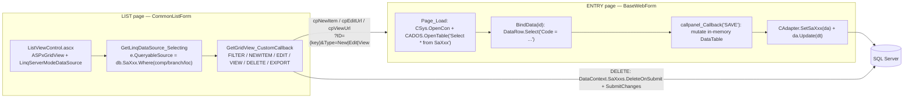

# Sales Reference Master — Legacy Logic + Port Plan

Source of truth for the **Sales → Master** reference/lookup tables when porting the WebForms
(`C:\wincom\ERPV55\ERP_5.5`) implementation to the Blazor Server app (`C:\wincom\net10projects`).

**Legacy studied from** (all read, not inferred):

- Entries: `ERP/SalesForms/Master/{CustGroup, CustSubGroup, CustomerCustType, CustomerSOType, ShiaViaEntry, CustomerShippingLeadTime, CustomerSalesman, AreaCodeEx, LMW, CustomerComment, ProjectEntry}.aspx.cs`
- Batch grids: `ERP/SalesForms/Master/{TaxGroupView, PaymentTermView, CurrencyView, CurrRateView}.aspx.cs`
- Lists: `ERP/SalesForms/{CustGroupView, AreaCodeViewEx, CustomerShippingLeadTimeViewEx}.aspx.cs`, `ERP/SalesForms/Master/ShipViaView.aspx(.cs)`
- Framework: `ERP/Controls/{CommonListForm.aspx.cs, ListViewControl.ascx(.cs)}`, `ERPClasses/Classes/{CAdapter.cs, CSys.cs, CUser.cs, CCommon.cs}`, `StdLib/CADOS.cs`, `ERPUITools/Controls/CommonHelper.cs`, `ERPCommonUI/Helper/InputValidation.cs`, `ERPClasses/AuditLog/AuditLogHelper.cs`
- Consumers: `ERPCommonUI/SalesForms/Controls/{CustomerInfo, DOCustomerInfo, InvCustomerInfo, QuCustomerInfo_Std, SOItemInfo, CNItemInfo}.ascx`, `CustProfile/{CustProfInfo, CustProfPayInfo}.ascx`, `SalesOrder_Std.aspx.cs`, `Quatation_Std.aspx.cs`, `HelperClass/{InvTrxHelper, SalesCommonHelper, ConvSoToInvHelper}.cs`

**Blazor target conventions were read before writing this plan** (`ISaSalesRefService`, `SaRefListPageBase`, `SaCodeRefListPageBase`, `InventoryTenantContext.InventoryLeftoverSite`, `AppDbContext` sales entities/configs, `MenuCodes`, `menus.xml`, `scripts/init-sales-masters.sql`).

**Scope:** the flat code-reference family. The parent→child item masters (`SaItemCust`, `IvCustPrice`/`IvCustPriceGroup`, `SaDisGroupItem`, `IvCustPriceGroupItems` UI) are **out of scope** — see §7.4.

**Status — revision 7 (2026-09-15): implementation-ready.** §8 decisions are **closed** (a four-item owner
veto window remains and it does **not** block coding); §9 is the exact schema of record, with no
placeholders; §10 is the shared tenancy/concurrency/audit/delete contract; §11 is the phase plan; §16 lists
the only outstanding owner confirmations. Review history is consolidated in §17.

> This is a reference-data port: the six tables are flat code lists with **no business logic** — the only
> real logic in the set is the `SaLMW` date-window rule (§9.3). Everything else is CRUD, tenancy and
> concurrency, and all three now have exactly one contract (§10).

---

## Table of contents

1. Inventory — the 15 reference tables
2. Legacy architecture
3. The three CRUD shapes
4. CRUD semantics, verified
5. Business sense — who consumes each table (incl. 5.1 port strategy per master)
6. Legacy defect register (do not port)
7. Blazor state — what exists, what is missing
8. **Decisions — resolved** (was "Locked decisions"; incl. 8.1 implementation gate)
9. **Exact schema contracts** (six tables; 9.4 is the DDL of record)
10. **Shared contract** — tenancy, concurrency, audit, delete, permissions (incl. 10.7 consumer-side validation)
11. Plan — phases and steps
12. Menus, permissions, deployment order
13. Test matrix
14. Verification checklist
15. Verified facts and closed questions
16. Owner confirmations outstanding (non-blocking veto window)
17. Review history (passes 2–6)

---

## 1. Inventory — the 15 reference tables

| Legacy table | Entry form | List form | DB | Business key (as coded) | Extra columns |
|---|---|---|---|---|---|
| `SaShipVia` | `Master/ShiaViaEntry.aspx` | `Master/ShipViaView.aspx` | ERP | `ShipViaCode` | `Active` (**no** Comp/Branch/Loc — D3) |
| `SaCustGroup` | `Master/CustGroup.aspx` | `CustGroupView.aspx` | ERP | `CustGroupCode` | Comp/Branch/Loc |
| `SaCustSubGroup` | `Master/CustSubGroup.aspx` | `CustSubGroupView.aspx` | ERP | `CustSubGroupCode` | Comp/Branch/Loc; **description column is `CustGroupDesc`** (copy-paste from `SaCustGroup`, verified `CustSubGroup.aspx.cs` L88/L109) |
| `SaCustType` | `Master/CustomerCustType.aspx` | `CustTypeViewEx.aspx` | ERP | `CustTypeCode` | `Active` |
| `SaSOType` | `Master/CustomerSOType.aspx` | `SOTypeViewEx.aspx` | ERP | `SOTypeCode` | `Active`, `FOCAuto` (written from a **numeric text box** as text; insert never stamps `Created`/`UserID` — D11) |
| `SaComment` | `Master/CustomerComment.aspx` | `CommentViewEx.aspx` | ERP | `CommID` | `Active`, **`Module`**, Comp/Branch/Loc, plus a legacy **identity `ID`** column (selected by `CustomerInfo.ascx`: `[ID],[CommID],[Comment],[Active]`) |
| `SaSalesRep` | `Master/CustomerSalesman.aspx` | `SalesmanViewEx.aspx` | **Account** | `SRepCode` | `Active`, `CommissionRate` |
| `SaShippingLeadTime` | `Master/CustomerShippingLeadTime.aspx` | `CustomerShippingLeadTimeViewEx.aspx` | ERP | `LeadTimeCode` | `Days` (int), `Type` (**`INTERNAL`/`EXTERNAL`** + blank — T1 closed), `Active`; **description column is `Description`** |
| `SaTaxGroup` | `Master/TaxGroupView.aspx` (self-contained batch grid) | – | **Account** | `TaxGrCode` | `Percentage`, `GLCode`, `Compound` |
| `SaPaymentTerm` | `Master/PaymentTermView.aspx` (batch grid) | – | **Account** | `PayCode` | `Days`, `Active` |
| `SaCurrency` | `Master/CurrencyView.aspx` (batch grid) | – | **Account** | `CurrCode` | `Active` |
| `SaCurrRate` | `Master/CurrRateView.aspx` (batch grid) | – | **Account** | `CurrCode` + `SDate`/`EDate` | date-effective |
| `IvAreaCode` | `Master/AreaCodeEx.aspx` | `SalesForms/AreaCodeViewEx.aspx` | ERP | `AreaCode` | `latitude`, `longitude` |
| `SaProject` | `Master/ProjectEntry.aspx` | `ProjectViewID.aspx` | ERP | `ProjID` | child `SaPrjAttachment` |
| `SaLMW` | `Master/LMW.aspx` | `LMWView.aspx` | ERP | `LicenseNo` + `CustCode` | licence + system date ranges; **no `Active`** (verified: `LMW.aspx.cs` bind/save never touches it) |

Naming quirk: several *list* pages live in `SalesForms/` root while their *entry* page is in
`SalesForms/Master/` (`CustGroupView`, `AreaCodeViewEx`, `CustomerShippingLeadTimeViewEx`,
`CustTypeViewEx`, `SOTypeViewEx`, `CommentViewEx`, `SalesmanViewEx`). Only `ShipViaView` sits beside
its entry page.

---

## 2. Legacy architecture



| Concern | Legacy mechanism |
|---|---|
| Page base | Lists inherit `CommonListForm : BaseWebForm`; entries inherit `BaseWebForm` |
| Identity | `SessionManager.SessionObject` → hidden fields `hdUserID/hdCompany/hdBranch/hdLocation`; `SessionID` is the `SessionIDCK` cookie |
| List data | `LinqServerModeDataSource` server-mode over `ErpDataClassesDataContext` entity sets |
| Entry data | `Select * from SaXxx` (whole table, all tenants) into a `DataTable` |
| Writes | `CAdapter.SetSaXxx(ref da)` builds `Insert/Update/DeleteCommand` from column-mapped `SqlParameter`s; `da.Update(dt)` |
| Transactions | The six in-scope flat masters never open one (`CustGroup.aspx.cs`, `LMW.aspx.cs`: **zero** `BeginTransaction` calls). But the claim "only item masters use transactions" is false: `BeginTransaction` appears in **27 files** under `SalesForms/` — transaction documents (`CNEntry`, `DOEntry`, `InvoiceEntry`, `CBPostToAcc`, …) **and two master screens**: `ProjectEntry.aspx.cs:248` (Shape 3, child grid) and `CustomerItems.aspx.cs:197` |
| Rights | `CUser.CheckUserRight2` / `CUser.GetUserEntryRights` against `vUserRight(ID, ScreenID, Rights)` |
| Screen ID | `this.ID = "200.1.22"`, resolved via `CommonHelper.GetScreenID(Request, this.ID)` — **`?ID=` overrides it** |
| Entry-page override | `CommonHelper.GetEntryPage(Request, defaultEntryPage)` — **`?EntryPage=Xxx` overrides it** |

---

## 3. The three CRUD shapes

### Shape 1 — entry form + list page (11 of 15 tables)

1. `Page_Init` reads `?ID=` and `?Type=` (`New` / `Edit` / `View`).
2. `Page_Load`: login check → hidden fields ← session → `CSys.OpenCon` → `OpenTable()` → `con.Close()` → if not postback: hide Save/Cancel when `Type == "View"`, then `BindData(strID)`.
3. Lookup popup (`ASPxPopupControl` + `callpanelType`) is bound to the **same in-memory `DataTable`**. `OnClickFind` → `PerformCallback("POP")` → `cpPOP = 1` → JS `grid.ApplyFilter("Code='...'")` → `popview.Show()`. Row double-click copies values client-side: `grid.GetRowValues(index, "Code;Desc;Active", cb)`.
4. `SAVE` → `ASPxClientEdit.ValidateGroup("vgSave")` → `callpanel.PerformCallback("SAVE")` → mutate `DataTable` → `UpdateRec()` → `da.Update(dt)` → `cpMsg = "Item(s) saved!"`.
5. `CANCEL` → `window.open("../XxxView.aspx", '_self')`.

### Shape 2 — self-contained inline batch grid (`SaTaxGroup`, `SaPaymentTerm`, `SaCurrency`, `SaCurrRate`)

- One page, one editable grid. Handlers: `grid_BatchUpdate`, `grid_RowInserting`, `grid_RowUpdating`, `grid_RowDeleting`, `grid_InitNewRow`, `grid_CustomCallback("SAVE"|"FILTER")`.
- Grid edits mutate a **Session-cached** `DataTable` (`SESSION_NAME = "SACURRENCYDT"` etc.), re-queried on first load (`Session[SESSION_NAME] = null` then `OpenTable()`).
- `SAVE` → `CAdapter.SetSaXxx(da)` + `da.Update(dtWC)`.
- This is the **only** shape with real rights enforcement (below).
- Extra behaviours: `CurrRateView` filters by date range + currency (`FilterGrid`), exports via `gridExport.WriteXlsToResponse(true)`, and stamps `Status = "NEW"` on new rows (`grid_InitNewRow`).

### Shape 3 — entry with child grid

`SaProject` → `SaPrjAttachment` (`dtSaAtth`, grid callbacks keyed `ID=...`). Same as Shape 1 plus a child `DataTable`.

---

## 4. CRUD semantics, verified

### 4.1 Create

```csharp
// CustGroup.aspx.cs — the canonical shape, identical in every Shape-1 entry page
dr = dtCustGroup.Select("CustGroupCode = '" + txtCode.Text.Replace("'", "''") + "'");
if (dr.Length == 0) drType = dtCustGroup.NewRow();   // the "new vs edit" decision
else                drType = dr[0];

drType["CustGroupCode"] = txtCode.Text.ToUpper();
drType["CustGroupDesc"] = txtDesc.Text.ToUpper();
drType["CompanyCode"]  = hdCompany.Value;
drType["BranchCode"]   = hdBranch.Value;
drType["LocationCode"] = hdLocation.Value;

if (dr.Length == 0) { drType["UserID"] = hdUserID.Value; drType["Created"] = DateTime.Now; }
else                { drType["UpdatedUID"] = hdUserID.Value; drType["Updated"] = DateTime.Now; }

if (dr.Length == 0) dtCustGroup.Rows.Add(drType);    // DataRowState = Added
UpdateRec();                                         // da.Update(dtCustGroup)
```

Facts to carry over:

- Existence is decided **in the in-memory table**, never against the DB.
- Every code and description is **upper-cased** on save.
- Tenant columns are stamped from the session-hidden fields, not from UI.
- Audit columns are split: insert → `UserID` + `Created`; update → `UpdatedUID` + `Updated`.

### 4.2 Read

- **List**: server-mode LINQ filtered by session tenant, e.g. `db.SaCustGroups.Where(x => x.CompanyCode == hdComp.Value && x.BranchCode == hdBranchCode.Value && x.LocationCode == hdLocCode.Value)` (`CustGroupView.aspx.cs`). `ShipViaView` is the exception: `e.QueryableSource = db.SaShipVias;` — no filter at all.
- **Entry**: whole table `DataTable` + `DataRow.Select("<Key> = '<id>'")`, values `.ToString().ToUpper()`.
- `Type == "View"` only sets `btnSave.Visible = false; btnCancel.Visible = false;` — nothing server-side.

### 4.3 Update

- Same code path as create with `dr.Length > 0`.
- `da.Update(dt)` sends only rows whose `RowState != Unchanged`; the adapter matches on the **Original** key:

```csharp
T = com.Parameters.Add("@OldCustGroupCode", SqlDbType.NVarChar, 10, "CustGroupCode");
T.SourceVersion = DataRowVersion.Original;
com.CommandText = "Update SaCustGroup Set ... WHERE (CustGroupCode = @OldCustGroupCode)";
```

- Consequence: editing the code **renames the record**, and the code editor is *not* disabled in edit mode (`LMW.aspx.cs` is the exception — it disables the licence keys).
- `con` was already closed in `Page_Load`; the adapter implicitly re-opens and closes. **No explicit transaction.**
- `da.UpdateCommand.Parameters.Clear()` is called *after* `da.Update(...)` in `CustomerItems`/`CustPriceGroupItems` — harmless, since `SetSaXxx` rebuilds the commands on every `UpdateRec()`.

### 4.4 Delete / deactivate

Five distinct behaviours, all deliberate (pass 1 said "three" — see §14 R15):

| Behaviour | Where | Detail |
|---|---|---|
| Hard delete, creator-only | **only** `CustGroupView.aspx.cs`, `CustSubGroupView.aspx.cs`, `LMWView.aspx.cs` | `if (list[0].UserID == hdUserID) DeleteOnSubmit(...) else cpErr = "You have prohibited to access this function!"` then `SubmitChanges(FailOnFirstConflict)` |
| Hard delete, **no** creator check | `CommentViewEx`, `SOTypeViewEx`, `CustTypeViewEx`, `CustomerShippingLeadTimeViewEx` (`.OnDeleteItem` → `DeleteOnSubmit` unguarded) | Delete needs only `enGroupRight.Delete` |
| Soft deactivate, hard delete when already inactive | `ShipViaView.aspx.cs` (creator check **commented out**), batch grids | `if (Active) Active = false; else DeleteOnSubmit(...)` |
| Deactivate **+** creator-only hard delete | `SalesmanViewEx.aspx.cs` (`Active = false` first, then the creator test) | Fourth distinct shape; template for `SaSalesRep` |
| Reactivate | `CommentViewEx`, `SOTypeViewEx`, `CustTypeViewEx`, `CustomerShippingLeadTimeViewEx`, `SalesmanViewEx` (`OnRefreshItem` → `Active = true`; the `Active` flag is passed as `GetParaByKey("Avtive", para)` — sic) | Five list pages, not one |

Entry pages never delete. Shape-1/2 entries stage only in memory, so "Cancel" = navigate away.

### 4.5 Validation actually implemented

| Rule | Source |
|---|---|
| All codes/descriptions upper-cased | every entry page |
| Required code (`RequiredField` + `ValidateGroup("vgSave")`) | entry markup (`CustGroup.aspx`) |
| Forbidden chars `; ? : @ & = + $ , % '`, no leading/trailing space | `InputValidation.ValidateInput` (`ERPCommonUI/Helper/InputValidation.cs`), used only by batch-grid insert/update |
| Duplicate key ⇒ silently treated as update, never an error | every `DataRow.Select` existence test |
| Date-range overlap rejected — **but not the one the name suggests** | `LMW.aspx.cs` `drcheckDate` (L171) selects rows where `CustCode` matches **and** the `SystemStartDate`/`SystemEndDate` windows overlap → *same customer, any other licence*. The row being edited is excluded by the same-`LicenseNo` clause, and the **licence-date comparison is commented out** (L169). See §8 **D-8** |
| `Active` gate on load | `CustomerSalesman.aspx.cs` loads `SaSalesRep WHERE Active='True'`, so inactive reps cannot be re-opened |
| Composite-key rename | `SetLMWID` — WHERE `LicenseNo` + `CustCode` |
| Edit locks the key fields | `LMW.aspx.cs` disables **three** controls in `Type=Edit` — `txtLicenseID`, `txtCustCode`, `txtLicenseNo` (not just the licence keys) |
| No validation on the licence date order | `LMW.aspx.cs` never compares `LicenseStartDate` vs `LicenseEndDate` or the system pair; only overlap is checked |
| Insert-without-`Created` | `CustomerSOType.aspx.cs` sets `Updated = Now` on both branches and `UserID` only on insert — so a new `SaSOType` row has `Updated` but **no `Created`** (D11) |

### 4.6 Rights model (port the bitmask, not the plumbing)

`vUserRight(ID, ScreenID, Rights)` — one bitmask per user per screen:

| Bit | Value | `enGroupRight` / `EntryAccessRights` |
|---|---|---|
| 1 | Access | `CanAccess` |
| 2 | New | `CanAddNew` |
| 4 | Edit | `CanEdit` |
| 8 | Delete | `CanDelete` |
| 16 | Post / Closed | `CanPost` |
| 32 | Print | `CanPrint` |
| 64 | Rollback | `CanRollback` |

Screen IDs observed: `200.1.14` (ShippingLeadTime), `200.1.21` (AreaCode), `200.1.22` (CustGroup),
`200.1.29` (ShipVia), `700.1.9` (TaxGroup + Currency + CurrRate + PaymentTerm — **shared, all four**).
Denial message everywhere: `"You have prohibited to access this function!"`.

Verify note (pass 4): `vUserRight` and both helpers are confirmed — `CUser.cs` L107
(`CheckUserRight2(int GroupRight, string UserName, DataTable dtUserRight, string ID)`), L305
(`GetUserEntryRights`) and L311 (`Select * from vUserRight Where ID = … AND ScreenID = …`). The screen IDs
are declared by the **list pages and batch grids**, not by the entry forms: in `SalesForms/Master/` only
`ShipViaView.aspx.cs` (a list page, L26) declares one at all. That is precisely why the entry half of **D6**
is unguarded — there is no screen ID there to check against.

### 4.7 Audit

`AuditLogHelper` is **skip-by-default** (`static bool skip = true`; `LogAudit` returns immediately) and is
only switched on from `ERP/default.aspx.cs` when `appSettings["NeedAuditlog"] == "yes"`.
**No flat reference table calls it** — only the item-master family via `SalesMasterHelper.AuditLog`.
Reference-data audit in Blazor is therefore a *new* requirement, not a port.

---

## 5. Business sense — who consumes each table

Most consumers filter `Active='True'` (or `Active = 1`) plus company/branch — **but not all**: every
`SaComment` data source filters `Active` only, with no company/branch predicate
(`CustomerInfo.ascx` even selects just `[ID],[CommID],[Comment],[Active]`).

| Reference data | Consumer (verified) | Effect |
|---|---|---|
| `SaShipVia` | `CustomerInfo.ascx`, `DOCustomerInfo.ascx`, `InvCustomerInfo.ascx`, `QuCustomerInfo_Std.ascx`: `SELECT ShipViaCode, ShipViaDesc FROM SaShipVia WHERE Active=1` | Ship-via combo on SO/DO/INV/QUO headers |
| `SaComment` | `SOItemInfo`, `DOItemInfo`, `InvItemInfo`, `CNItemInfo`, `CustomerInfo`, `DOCustomerInfo`, `InvCustomerInfo` (+ `*SB`/`_Std` variants): `Select * from SaComment where active=1` — **11 data sources in 9 files, and none of them filters `Module`** | Canned document/item remarks. `Module` is written on save (`?Module=` from the list URL) but is **not read by any consumer** — dead legacy data, so it is **not created** in the new table (§8 **D-4**) |
| `SaPaymentTerm` | `vSaPaymentTerm where Active='True'`; `SalesCommonHelper`, `InvTrxHelper` load the row for `PayCode` → `Days` | Credit term + due-date / ageing |
| `SaTaxGroup` | `SOItemInfo`, `InvItemInfo`, `CNItemInfo`: `Active='True' AND Compound=0|1 AND CompanyCode AND BranchCode`; `SalesOrder_Std.aspx.cs:263` | Tax code + `Percentage`; `Compound` drives two pickers |
| `SaCurrency` / `SaCurrRate` | `SalesOrder_Std.aspx.cs:1771` → `SaCurrRate WHERE CurrCode=… AND SDate<=soDate AND EDate>=soDate`; `ConvSoToInvHelper` → `sySaCurrRate.HomeCurPerUnit` | **Date-effective** rate at document date; home-currency conversion |
| `SaCustGroup` / `SaCustSubGroup` | `CustProfInfo.ascx` (company/branch filtered) | Customer classification for reporting / group discount |
| `SaCustType` | `CustProfInfo.ascx` | Customer type classification |
| `SaShippingLeadTime` | `CustomerProfile.aspx` `ddlInLeadTime` / `ddlExLeadTime` from `LeadTimeCode WHERE Active=1` | Default in/out lead time (`Days`) per customer |
| `SaSalesRep` | Customer profile + `CommissionRate` | Salesman attribution / commission |
| `SaSOType` | SO header; `FOCAuto` column is maintained but **every consuming check is commented out** in `InvoiceEntry*.aspx.cs` | Type code live; FOC auto-amount rule is dead code |
| `SaProject` | `ProjID` referenced by SO/DO/CN (`left outer join SaItemCust c on p.ProjID=c.ProjID`) | Project tagging |
| `IvAreaCode` | Customer/supplier address area; `latitude`/`longitude` maintained through an external Nominatim call (`AreaCodeEx.GetCoordinates`) | Area routing / coverage + map pin |
| `SaLMW` | Customer-licensed personnel (Malaysia LMW) keyed `LicenseNo` + `CustCode` with licence/system validity windows | Licence compliance per customer/person |

### 5.1 Port strategy — every master needs a consumer decision

Legacy consumer evidence (above) proves these tables *were* referenced. It does **not** prove the Blazor app
references them: `SaSo`/`SaCust` have no ship-via, SO-type, comment or lead-time column, and
`SaCust.SubGroupCode` is still a free-text box (`SaCustEntry.razor` L317, T3). A master with no consumer is a
standalone CRUD screen — acceptable, but it must be a decision rather than an accident, and the plan must not
describe it as "ported" when its consumer is not ported.

| Master | Legacy consumers (§5) | Blazor consumer today | Decision | Deferred work (separate step, not this plan) |
|---|---|---|---|---|
| `SaCustSubGroup` | `CustProfInfo.ascx` | `SaCust.SubGroupCode`, free text | **Build + wire + validate** (D-6): convert `SubGroupCode` to a lookup **and** validate it on customer save (§10.7). Without both, the master is unreachable or is decoration | sub-group reporting on `SaCust` |
| `SaShipVia` | 4 customer-info controls (SO/DO/INV/QUO headers) | none | **Build, consumer deferred** (D-2): the master is the prerequisite | `SaSo.ShipViaCode` + header combo |
| `SaSOType` | SO header; `FOCAuto` rule dead | none | **Build, consumer deferred** (D-3): no `SaSo` type column in this phase | `SaSo.SOTypeCode` |
| `SaComment` | 11 data sources across 9 files (SO/DO/INV/CN item + header) | none (`Remarks` is free text) | **Build, consumer deferred** (D-4): `Module` not created | canned-comment picker on item/document entry |
| `SaShippingLeadTime` | `CustomerProfile.aspx` in/out lead-time defaults | none (`SaCust` has no lead-time columns) | **Build, consumer deferred** (D-5) | `SaCust.InLeadTime` / `ExLeadTime` |
| `SaLMW` | licence compliance (Malaysia LMW) | none | **Build** (D-7): a standalone compliance register is the use case; no document wiring expected | – |

**Rule:** a row above may only be re-described as "ported" after its consumer column exists. Until then the
master ships as a standalone reference screen and the deferred consumer is an entry in that consumer's own
plan. No master in this set is delayed by the missing consumer — building the master first is deliberate
(the consumer change is the riskier one and gets its own plan).

---

## 6. Legacy defect register (do not port)

Each item gives the port rule. `D#` ids are stable for review references.

| # | Defect (legacy) | Port rule |
|---|---|---|
| **D1** | `CAdapter` update/delete `WHERE` matches **only the code** while the table carries Company/Branch/Location — `SetSaCustGroup`, `SetSaCustType`, `SetSaSOType`, `SetSaCustSubGroup`, `SetSaShippingLeadTime` **and `SetSaComment` (WHERE `CommID = @OldReasonCode`, CAdapter.cs L10898)** | Composite key `(CompanyCode, Code)` minimum; tenant always in the predicate. Never match on code alone |
| **D2** | New-vs-edit decided from a `DataTable` loaded with `Select * from SaXxx` (all tenants, first match wins) | Decide in the repository: `GetAsync(tenant, code) == null` ⇒ insert, else update |
| **D3** | `SaShipVia` has **no tenancy at all**: adapter inserts only code/desc/active/audit, list has no filter, entry company stamping is commented out | Fixed, not inherited: company-scoped PK (§8 **D-2**) |
| **D4** | No transaction on flat-master saves; a multi-row `da.Update` can partially fail | One `SaveChanges` in one transaction; all-or-nothing |
| **D5** | No concurrency token | Level A `RowVersion` on all six new tables (§8 **D-10**) with a token gate on update/delete. Note Blazor already ships Level-B fingerprint masters, so this is a convention choice, not a gap — see §7.1 and §7.2a |
| **D6** | `Type=View` is cosmetic (buttons hidden only) and entry pages perform **no rights check at all** — grep for `GetUserEntryRights|IsValidAccessRight` under `SalesForms/Master` matches only `TaxGroupView`, `CurrencyView`, `CurrRateView`, `PaymentTermView` and the list pages | `[Authorize]`/`EnsurePermissionAsync` on every mutation; View mode is a read-only component |
| **D7** | `?ID=` overrides the screen ID used for rights; `?EntryPage=` swaps the entry form | Screen ID is a constant on the component; variant entry forms from a server-side allow-list |
| **D8** | Raw SQL string concatenation everywhere; `InputValidation` exists but is barely used | Parameterised EF/Dapper; character rules as validators |
| **D9** | Whole-table loads (`Select * from SaXxx`) and `Select * from AdUser Order By ID` per postback just to read one flag | Query the tenant slice; read the user flag once per circuit/claim |
| **D10** | Connection lifetime inconsistent (`con.Close()` before adapter use, `Parameters.Clear()` after `Update`, never disposed) | DI-scoped `DbContext`; no manual connections |
| **D11** | Copied-and-diverged logic: `SaCurrRate` overlap validation commented out; `CustomerCustType` sets `UserID` on update while others set `UpdatedUID`; `CustomerSOType` never stamps `Created`/`UserID` on insert; `SetSaComment` update has a **no-op self-assignment `BranchCode = BranchCode`** (CAdapter.cs L10897) so branch edits silently never persist | One canonical audit contract for all masters |
| **D12** | `CustomerItems.aspx.cs` and `CustPriceGroupItems.aspx.cs` share session key `"SACUSTITEMSSALES"` | (Item-family phase) never share cache keys |
| **D13** | Screen ID `700.1.9` shared by four unrelated powers | One menu/permission code per master (Blazor already does this — `SA_PAY_TERM`, `SA_TAX_GROUP`, …) |

---

## 7. Blazor state — what exists, what is missing

### 7.1 Already implemented — do not re-create

| Legacy master | Blazor service methods | Blazor UI page | Entity / config |
|---|---|---|---|
| `SaCustType` | `ListCustTypesAsync` … `DeleteCustTypesAsync` | `Sales/Masters/SaCustTypeList.razor(.cs)` | `CustomerProfile/SaCustType.cs` + `Configurations/Sales/SaCustTypeConfiguration.cs` |
| `SaCustGroup` | `ListCustGroupsAsync` … | `SaCustGroupList.razor(.cs)` | `CustomerProfile/SaCustGroup.cs` + config |
| `IvAreaCode` | `ListAreasAsync` … | `SaAreaList.razor(.cs)` | `Sales/IvAreaCode.cs` + config |
| `SaCountry` (new) | `ListCountriesAsync` … | `SaCountryList.razor(.cs)` | `Sales/SaCountry.cs` + config |
| `SaCurrency` | `ListCurrenciesAsync` … `SetCurrencyActiveAsync` | `SaCurrencyList.razor(.cs)` | `Sales/SaCurrency.cs` + config |
| `SaCurrRate` | `ListCurrRatesAsync` … (keyed) | `SaCurrRateList.razor(.cs)` | `Sales/SaCurrRate.cs` + config |
| `SaDisGroup` | `ListDisGroupsAsync` … (keyed `GroupName`+`PayCode`) | `SaDisGroupList.razor(.cs)` | `CustomerProfile/SaDisGroup.cs`, `SaDisCust.cs` + configs |
| `SaPaymentTerm` | `ListPaymentTermsAsync` … (fingerprint on save) | `SaPaymentTermList.razor(.cs)` | `Sales/SaPaymentTerm.cs` + config |
| `SaSalesRep` | `ListSalesRepsAsync` … (fingerprint on save) | `SaSalesRepList.razor(.cs)` | `Sales/SaSalesRep.cs` + config |
| `SaTaxGroup` | `ListTaxGroupsAsync` … (fingerprint on save) | `SaTaxGroupList.razor(.cs)` | `Sales/SaTaxGroup.cs` + config |
| Customer profile | `SaCustService` | `SaCustList` / `SaCustEntry` | `CustomerProfile/SaCust.cs`, `SaCustAdd.cs`, `SaCustContact.cs` |
| Project reference | (Admin master) | `Admin/Master/MsProjectList.razor` | `MsProject.cs` + `MsDept.cs` |

Shells available for a new master:

| Shell | Purpose |
|---|---|
| `ErpWeb.UI/Admin/Master/SaRefListPageBase.cs` | Sales code-reference list + popup with **row-version keys**: toolbar NEW / (ACTIVATE / DEACTIVATE only when `SupportsActivate => true`) / DELETE / EXPORT, row VIEW / EDIT, `EnsurePermissionAsync`, `SelectedRows`, `ReloadListAsync` |
| `ErpWeb.UI/Admin/Master/SaKeyedRefListPageBase.cs` | Composite-key variant (used by `SaCurrRateList`, `SaDisGroupList`). **TKey is an unconstrained class parameter, so an N-part key class is already supported** (T2 closed) — but this shell has **no** ACTIVATE/DEACTIVATE toolbar at all |
| `ErpWeb.UI/Sales/Masters/SaCodeRefListPageBase.cs` | Sales list pages that delete **by code without row-version** |
| `ErpWeb.UI/Admin/Master/MsRefListPageBase.cs` | Admin master reference (`MsDept`, `MsProject`) |
| `ErpWeb.UI/Admin/Master/AdSmNumListPageBase.cs` | Numbering screens |

Cross-cutting conventions to follow (all verified in code):

- **Tenant stamping**: `InventoryLeftoverSite.Apply(entity, writeScope)` in `ErpWeb.Core/Inventory/InventoryTenantContext.cs` — sets `BranchCode` and `LocationCode` (`BranchCode` only for `PoSupplier`). Overloads already exist for `SaCustType`, `SaCustGroup`, `IvAreaCode`, `SaCurrency`, `SaPaymentTerm`, `SaSalesRep`, `SaTaxGroup`, `SaDisGroup`. **Add an overload for each new master**; never accept company/branch/location from the route or body.
- **Scope helpers**: `IInventoryTenantContext.TryCompanyScope()` / `TryBranchScope()` / `TryWriteScope()`. Fail-closed CompanyCode is mandatory (`EnsureCompanyContext()`).
- **Concurrency — two levels already in use, pick one per master**:
  *Level A* = DB `RowVersion` (live DB: `SaCustType`, `SaCustGroup`, `SaCust` only) → list row carries the
  token, `SaRefListPageBase.ToKeyToken` = `Key(code, row.RowVersion)`.
  *Level B* = no `RowVersion`; a **value fingerprint** is passed as `expectedFingerprint` and re-checked
  on a *tracked* reload — this is what `SaPaymentTerm`, `SaSalesRep`, `SaTaxGroup` do; the header of
  `ErpWeb.Core/Sales/SaMasterFingerprint.cs` says exactly that: "deterministic concurrency fingerprints
  for sales masters **without RowVersion**". A fingerprint is **not** a row version and must not be
  described as one.
  The signatures differ, and this is easy to get wrong: Level A services take **no** concurrency
  argument — `SaveCustGroupAsync(vm, isNew)` with `byte[]? RowVersion` on the edit VM — while Level B
  services take `SavePaymentTermAsync(vm, isNew, string? expectedFingerprint)`. All six new masters are
  Level A (§8 **D-10**), so their save methods follow the `SaveCustGroupAsync` shape.
- **Code normalisation**: `NormalizeCode` = `Trim()` + `ToUpperInvariant()`.
- **Duplicate on create**: explicit `AnyAsync(x => x.CompanyCode == ctx.CompanyCode && x.Code == code)` → duplicate error (never a silent upsert — **D2**).
- **Delete**: `CanDelete…Async` → `DeleteCheckResult`, then `Delete…Async`; list page shows the confirm dialog. `UNIQUE`/FK in the DB is the final authority.
- **Result contract**: `IvMasterOperationResult<T>` + `IvMasterErrorCode` (from `ErpWeb.Core/Inventory/IvMasterResults.cs`), keys as `IvMasterKeyToken`.
- **Permissions**: `ErpWeb.Core/Menus/PermissionCodes.cs` (`Add`, `Edit`, `Delete`, `Export`, `Access`) + `MenuCodes`; pages wrapped in `<MenuAuthorize MenuCode="…">`.
- **Routes**: kebab-case under `/sales/…` (`@page "/sales/customer-types"`).
- **Schema**: `scripts/*.sql`, **manual deploy only, never at startup**, idempotent (`IF OBJECT_ID(...) IS NULL`, `IF COL_LENGTH(...) IS NULL`), `RowVersion rowversion NOT NULL` in the CREATE.

### 7.2 Blazor key/shape summary for the sales masters already built

| Table | Blazor PK | `Active` | Tenant stamp | Concurrency (live DB) |
|---|---|---|---|---|
| `IvAreaCode` | `(CompanyCode, AreaCode)` | no | Branch + Location | **B** — no `RowVersion` |
| `SaCountry` | `(CountryCode)` global | no | – | **B** |
| `SaCurrency` | `(CompanyCode, CurrCode)` | yes | Branch + Location | **B** — no `RowVersion` |
| `SaCustType` | `(CompanyCode, CustTypeCode)` | yes | Branch + Location | **A** — `RowVersion` |
| `SaCustGroup` | `(CompanyCode, CustGroupCode)` | no | Branch + Location | **A** — `RowVersion` |
| `SaDisGroup` | `(CompanyCode, GroupName, PayCode)` | no | Branch + Location | **B** |
| `SaPaymentTerm` | `(CompanyCode, PayCode)` | yes | Branch + Location | **B** — value fingerprint |
| `SaSalesRep` | `(CompanyCode, SRepCode)` | yes | Branch + Location | **B** — value fingerprint |
| `SaTaxGroup` | `(CompanyCode, TaxGrCode)` | **no** | Branch + Location | **B** — value fingerprint |
| `SaCurrRate` | `(SDate, EDate, CurrCode)` — **no company column** | `Status bit` | – | **B** |

Concurrency column verified against the live DB on 2026-09-15 (§7.2a) — A/B is a real, load-bearing
distinction, not a detail: it decides whether the list row token is a `rowversion` or a computed
fingerprint.

Three deviations from legacy to keep in mind (**D1** applied, and reversals):

1. Tenancy moved into the **PK** (`CompanyCode, Code`); legacy had the code alone.
2. Blazor `SaTaxGroup` has **no `Active`** column, while every legacy consumer filtered `Active='True'`
   (`SOItemInfo.ascx`, `InvItemInfo.ascx`, `CNItemInfo.ascx`). Tax-group deactivation is therefore
   impossible in Blazor — confirm this is intended before wiring tax lookups.
3. Blazor `SaCurrRate` is **global** (`SDate, EDate, CurrCode`, no `CompanyCode`), while legacy filtered
   by company/branch. Cross-company rate bleed is possible if two companies use the same currency code.

### 7.2a Live-DB evidence (read directly from `ERPWeb` on `.\SQLEXPRESS`, 2026-09-15)

| Table | Exists in live DB | RowVersion | Active | CompanyCode |
|---|---|---|---|---|
| `SaCustType` | yes | **yes** (Level A) | yes | yes |
| `SaCustGroup` | yes | **yes** (Level A) | no | yes |
| `SaCust` | yes | **yes** | yes | yes |
| `IvAreaCode` | yes | no | no | yes |
| `SaCountry` | yes | no | no | **no** (global) |
| `SaCurrency` | yes | no | yes | yes |
| `SaDisGroup` / `SaDisCust` | yes | no | no | yes |
| `SaCurrRate` | yes | no | no | **no** (global) |
| `SaPaymentTerm` | yes | no | yes | yes |
| `SaSalesRep` | yes | no | yes | yes |
| `SaTaxGroup` | yes | no | **no** | yes |
| `SaShipVia`, `SaSOType`, `SaComment`, `SaCustSubGroup`, `SaShippingLeadTime`, `SaLMW` | **absent** | – | – | – |

Consequences for this plan:

- The six targets are genuinely **new** tables — `CREATE TABLE IF OBJECT_ID(...) IS NULL` is the right
  shape for them (no legacy table to migrate), but the pre-check must be re-run at deploy time because
  this evidence is a point-in-time observation, not a guarantee.
- `SaCurrRate` in the live DB is **`Status bit NOT NULL`**, which supersedes the Phase-0 note that called
  it `nvarchar(20)` free text (`ErpWeb/docs/sales-master-phase0-findings.md`).
- **Script/live drift is real**: live `SaCurrRate.CurrCode`, `UserID` and `UpdatedUID` are
  `nvarchar(40)`, while `scripts/init-sales-masters.sql` declares `nvarchar(20)`. `IF OBJECT_ID IS NULL`
  never converges an existing table, so any length change must be its own idempotent `COL_LENGTH` guard.
  Apply this lesson to the six new tables: verify after apply, do not assume the script is the schema.

### 7.3 Gaps — legacy masters with no Blazor counterpart

| Legacy master | Needed because | Blazor status |
|---|---|---|
| `SaCustSubGroup` | `SaCust.SubGroupCode` exists on the Blazor customer entity | **Missing** (entity, config, DbSet, DDL, service, UI, menu). **T3 closed: `SaCustEntry.razor` binds it as a plain `DxTextBox` (free text), not a lookup** — so the master plus a converted lookup is the change (**D-6**), not the master alone |
| `SaSOType` | SO type classification + `FOCAuto` | **Missing.** Blazor `SaSo` has **no** type column — decide whether the field is needed at all (`FOCAuto` consumer logic is dead — see §5) |
| `SaComment` | Canned remarks + `active=1` pickers | **Missing.** Blazor `SaSo`/`SaCust` have no comment master reference (`Remarks` is free text) |
| `SaShipVia` | Ship-via on SO/DO/INV/QUO headers | **Missing.** Blazor `SaSo`/`SaCust` have **no** ship-via column |
| `SaShippingLeadTime` | In/out lead-time defaults per customer | **Missing.** Blazor `SaCust` has **no** `InLeadTime`/`ExLeadTime` columns |
| `SaLMW` | Customer-licensed personnel with validity ranges | **Missing** |
| `SaDisGroupItem` | Item-level discount lines | **Missing** — belongs to the item-family phase |
| `SaItemCust`, `IvCustPrice`, `IvCustPriceGroup` | Customer-item mapping, price groups | **Missing** — item-family phase (§7.4) |

Also present but **not** to be used: `ErpWeb.Model/Entities/CustomerProfile/SaCustomerType.cs` maps a legacy
table `SaCustomerType` (global key, no company). `SaCustType` + `SaCustTypeConfiguration` is the live one.
**Closed in pass 4:** a whole-solution `*.cs` grep finds `SaCustomerType` in exactly **two** places, both
inside that file (the `[Table]` attribute and the class declaration) — no `DbSet`, no config, no consumer.
It is dead code and can be deleted outright (Step 3.1).

### 7.4 Out of scope (item-family phase)

`SaItemCust` (customer part no / UOM / MOQ / unit price / `Status='NEW'` refresh flow),
`IvCustPrice` (`CustPriceGroupItems.aspx`, `Session`-staged grid + `da.Update` in a
`SqlTransaction` + `AuditLogHelper`), `IvCustPriceGroup`, `SaDisGroupItem`
(`CustomerItemDiscount.aspx`, ID-based staging), `CustomerItems.aspx` price-visibility rules
(`AdUser.SellPriceView`, `AdUserGroupDefault.CPriceViewOnly`). These need their own spec because
their semantics (status lifecycle, transaction + audit, child-grid callbacks, matrix of
price-visibility rights) differ from the flat family. **Do not mix them into this plan.**

---

## 8. Decisions — resolved

Pass 4 and pass 5 kept this section titled "Locked decisions" while §13 still listed the same items as open
questions — so a developer could not tell which state was real. That loop is closed here. **Every item below
is decided, with a rationale.** Items marked *default taken* are implemented as written unless the owner
objects **before the phase containing them starts** (§16); they never block work.

| # | Decision | Rationale / evidence | Status |
|---|---|---|---|
| **D-1** | Scope = the six masters: `SaCustSubGroup`, `SaShipVia`, `SaSOType`, `SaComment`, `SaShippingLeadTime`, `SaLMW`; physical tables, not `IvMsCode` code-types; item family separate (§7.4). | §7.3 / §7.4 — legacy has its own columns and screens; `IvMsCode` has no audit columns and is global-only | **Final** |
| **D-2** | `SaShipVia` is **company-scoped**: `PK (CompanyCode, ShipViaCode)`, `Active`, tenant-stamped. Legacy was global with no tenancy at all (D3). | Consistency with every implemented Blazor sales master; a global ship-via list cannot be maintained per company. Deliberate fix of D3 | **Final** |
| **D-3** | `SaSOType` is built with `SOTypeCode` + `SOTypeDesc` + `Active`. **`FOCAuto` is not created.** No `SaSo` type column in this phase. | The table is new ⇒ no legacy data to preserve, and every `FOCAuto` consumer in `InvoiceEntry*.aspx.cs` is commented out. Reviving it later is one nullable `ALTER` | *Default taken* |
| **D-4** | `SaComment` = `CommID` + `Comment` (`nvarchar(1000)`) + `Active`. **`Module` is not created**, and the legacy identity `ID` column is not ported. | `Module` is written from `?Module=` but read by **zero** consumers (11 data sources, no `Module` filter). Shipping a column the app can never set correctly is worse than not shipping it | *Default taken* |
| **D-5** | `SaShippingLeadTime` keeps `Days` (`int`) and `Type` (`nvarchar(10)`); the **only** non-null values ever stored in `Type` are `INTERNAL` and `EXTERNAL`, and `null` / empty / whitespace input all normalise to `NULL` (§9.2). Description column is `LeadTimeDesc`. | T1 closed (`CustomerShippingLeadTime.aspx` L125-129). New empty table ⇒ the legacy copy-paste column names are not worth inheriting (§9.5) | **Final** |
| **D-6** | `SaCustSubGroup` is built **and** `SaCustEntry`'s `SubGroupCode` box becomes a lookup in the same step; `SaCust` save **validates the code server-side** (blank allowed) — §10.7; description column is `CustSubGroupDesc`. | T3 closed — the field is free text today, so the master alone unblocks nothing. The popup is one component, and the server-side check is required because a lookup widget is not a validation boundary | *Default taken* |
| **D-7** | `SaLMW` key = `PK (CompanyCode, LicenseNo, CustCode)`; all four date columns are `date NOT NULL`. | §9.2/§9.3 — required dates make the overlap rule total (no NULL semantics to invent) | **Final** |
| **D-8** | `SaLMW` overlap rule = **system window, same company + same customer, across all licence rows other than the one being edited**, inclusive endpoints (`Existing.Start <= New.End AND Existing.End >= New.Start`). Licence windows are **not** overlap-checked — only ordered — and must **contain** the system window. | Legacy `drcheckDate` (L171) enforces exactly the system window per customer; the licence-date comparison is commented out (L169). Containment added because a system window outside the licence is meaningless. This is the "intended" reading of P8, made explicit | *Default taken* |
| **D-9** | The `SaLMW` overlap check runs inside a **`Serializable` transaction that re-reads the conflicting rows**, backed by the index in §9.4, with a SQL Server two-writer integration test. A serialization/deadlock failure returns a reload-and-retry message, never a silent insert. | Range overlap cannot be enforced by a unique index (§9.3) — a check-then-insert race is otherwise guaranteed | **Final** |
| **D-10** | Concurrency = **Level A `RowVersion`** on all six masters (was P10). Update loads the entity *tracked*, compares the VM token, and saves; delete requires the token too. The three Level-B fingerprint masters are **not** retro-fitted here. | Matches `SaCustType`/`SaCustGroup`; the shipped pattern is `SaSalesRefService.SaveCustTypeAsync` (L195-206) | **Final** |
| **D-11** | Business keys are **not editable**. A changed key is rejected with `"Code cannot be changed."` | Already the shipped behaviour (`SaSalesRefService.SaveCustTypeAsync` L187 `KeysEqual`, L478/L701/L891/L1096 for the others); the new masters copy it. A rename, if ever required, is its own operation with reference migration | **Final** |
| **D-12** | Audit contract: **insert** sets `Created` + `UserID` + `Updated` + `UpdatedUID`; **update** sets only `Updated` + `UpdatedUID` and leaves `Created`/`UserID` untouched. Time comes from `ICurrentDateService.Now`, i.e. **company-local time** (`Company.TimeZoneId`, fallback `Asia/Kuala_Lumpur`) — never `DateTime.Now`/`UtcNow` directly. A missing **or invalid** `TimeZoneId` falls back to `Asia/Kuala_Lumpur` and no exception escapes the timestamp path. | Verbatim what `SaveCustTypeAsync` does (L161-164 insert, L205-206 update). The fallback is already implemented, not assumed: `CurrentDateService.ResolveTimeZoneId` returns the default for a blank company/id, and `ResolveTimeZone` swallows `TimeZoneNotFoundException` **and** `InvalidTimeZoneException` into the same default | **Final** |
| **D-13** | **No DB foreign keys** on the six tables in this phase. Delete authority = service `CanDelete*Async` reference check (`DeleteCheckResult`) + `PermissionCodes.Delete`, then hard delete. The step that adds a consumer column also adds that FK and extends the reference check. | §10.5 — five of six have no consumer column to point a FK at; a FK with no referrer is decoration | **Final** |
| **D-14** | No creator-only delete (the legacy rule is dropped). | It existed only to compensate for missing reference checks; `DeleteCheckResult` is the real gate | **Final** |
| **D-15** | One menu code + one permission set per master (`SA_CUST_SUB_GROUP`, `SA_SHIP_VIA`, `SA_SO_TYPE`, `SA_COMMENT`, `SA_SHIP_LEAD_TIME`, `SA_LMW` — replaces legacy screen `700.1.9` shared by four masters). **EXPORT is in scope for all six masters** (revision 7 — no longer conditional), and the `EXPORT` permission is checked at the **server execution point**, not only on the toolbar. | D13; §10.6. The shell already ships an EXPORT button and legacy had `ListViewControl.ExportGrid`, so an optional export would leave a visible button unbacked | **Final** |
| **D-16** | No audit-trail table for reference masters in this phase (legacy has none — §4.7). RowVersion + user stamps only; a `SaveChanges` interceptor can be added later. | Parity first | **Final** |
| **D-17** | Out of scope, tracked separately, **not** blocking: `SaTaxGroup.Active`, `SaCurrRate` global scope (§7.2), Level-A retro-fit of the three Level-B masters, reference-master audit trail. | Scope creep; each touches SO/DO/INV behaviour | **Final** |
### 8.1 Implementation gate

Start coding when the table below is green. Every row is satisfied **by this document** — the gate no longer
blocks on unanswered questions, which is what stalled revisions 4 and 5.

| Gate | State |
|---|---|
| Six-master scope fixed | ✅ D-1 |
| Consumer / defer decision for every master | ✅ §5.1 |
| Exact schema + DDL of record, no placeholders | ✅ §9.1–§9.4 |
| `FOCAuto` / `Module` / legacy `ID` handling | ✅ D-3, D-4 (not created) |
| Audit insert/update contract + timezone | ✅ D-12 |
| Scope identity (company/branch/location) per master | ✅ §9.1 |
| Business-key edit policy | ✅ D-11 |
| FK / reference / delete strategy | ✅ D-13, §10.5 |
| `SaLMW` date semantics | ✅ §9.3 |
| `SaLMW` concurrency-safe overlap strategy | ✅ D-9, §10.4 |
| Concurrency level for all six masters | ✅ D-10 |
| Tests for the above (incl. concurrency, tenant, key token, route authz) | ✅ §13 TC27–TC32 |
| Owner veto window (D-3, D-4, D-6, D-8) | ⏳ informational — **does not block** (§16) |

---

## 9. Exact schema contracts

Nothing here is a sketch. Every type, length, nullability, default and index is final, and §9.4 is the
artifact of record — copy it into `scripts/init-sales-master-refs.sql` verbatim. **No column type, length or
name may be chosen during implementation.**

### 9.1 Scope identity vs physical key

| Master | Scope identity (visibility) | Physical PK | CompanyCode | Branch/Location |
|---|---|---|---|---|
| `SaCustSubGroup` | Company | `(CompanyCode, CustSubGroupCode)` | in key | stamped, **not** in key |
| `SaShipVia` | Company | `(CompanyCode, ShipViaCode)` | in key | stamped, **not** in key |
| `SaSOType` | Company | `(CompanyCode, SOTypeCode)` | in key | stamped, **not** in key |
| `SaComment` | Company | `(CompanyCode, CommID)` | in key | stamped, **not** in key |
| `SaShippingLeadTime` | Company | `(CompanyCode, LeadTimeCode)` | in key | stamped, **not** in key |
| `SaLMW` | Company + customer | `(CompanyCode, LicenseNo, CustCode)` | in key | stamped, **not** in key |

**Consequence, stated once so it stops being rediscovered:** `BranchCode`/`LocationCode` are informational
stamps on all six (who created/owns the row), exactly as on the shipped `SaCustType`/`SaCustGroup`. They are
**not** part of any key, so one company cannot hold the same code twice, in different branches. That is
intended and matches every implemented Blazor sales master (§7.2).

### 9.2 Column matrix

Standard block — present on **all six** tables and not repeated per table:

| Column | SQL type | Null | Blazor property | Note |
|---|---|---|---|---|
| `CompanyCode` | `nvarchar(10)` | NOT NULL | `CompanyCode` | from claims only |
| `BranchCode` | `nvarchar(10)` | NULL | `BranchCode` | `InventoryLeftoverSite.Apply` |
| `LocationCode` | `nvarchar(20)` | NULL | `LocationCode` | `InventoryLeftoverSite.Apply` |
| `Created` | `datetime2` | NULL | `CreatedDate` | insert only (D-12) |
| `Updated` | `datetime2` | NULL | `ModifiedDate` | insert + update (D-12) |
| `UserID` | `nvarchar(20)` | NULL | `CreatedBy` | insert only |
| `UpdatedUID` | `nvarchar(20)` | NULL | `ModifiedBy` | insert + update |
| `RowVersion` | `rowversion` | NOT NULL | `RowVersion` | Level A (D-10) |

**Code normalisation, whitespace and uniqueness (one rule for all six).** `NormalizeCode` = `Trim()` +
`ToUpperInvariant()`. Leading/trailing whitespace is **trimmed silently** — it is never stored, and it is not an
error (TC16 asserts the trimmed value, this is the single behaviour; the plan previously said "trim" and
"reject" in different places). A value that is empty after trimming is rejected for required fields. Uniqueness
is decided by the database inside the caller's company — application normalisation is a convenience, not the
integrity boundary, so duplicate tests (TC1/TC2) and TC30 must run against the **deployment** database
collation rather than assuming case sensitivity either way.

**Nullable-vs-required (one rule for all six).** Description columns are `NULL` in the DDL to match the shipped
sales-master schema (`SaCustType`, `SaCustGroup`, `SaPaymentTerm` are all nullable there), but the **service
requires** a non-blank description on create and update and returns a field-level validation error. The DDL is
permissive, the service is strict — do not "fix" either side without the other. Columns the service genuinely
treats as optional stay nullable on both sides (`Days`, `Type`, `LicenseType`, `LicenseID`, `Name`, `IC`,
`Position`, `CustName`).

**`SaCustSubGroup`** — no `Active` (matches `SaCustGroup`, its Blazor sibling)

| Column | SQL type | Null | Blazor property | Validation |
|---|---|---|---|---|
| `CustSubGroupCode` | `nvarchar(20)` | NOT NULL | `CustSubGroupCode` | required, ≤20, `NormalizeCode` (trim + upper), no business-key edit (D-11) |
| `CustSubGroupDesc` | `nvarchar(100)` | NULL | `CustSubGroupDesc` | required by the service (DDL nullable — see the rule above), ≤100, upper-cased |

**`SaShipVia`**

| Column | SQL type | Null | Default | Blazor property | Validation |
|---|---|---|---|---|---|
| `ShipViaCode` | `nvarchar(20)` | NOT NULL | – | `ShipViaCode` | required, ≤20, `NormalizeCode`, key immutable |
| `ShipViaDesc` | `nvarchar(100)` | NULL | – | `ShipViaDesc` | required by the service (DDL nullable — see the rule above), ≤100, upper-cased |
| `Active` | `bit` | NOT NULL | `1` | `IsActive` | activate/deactivate toolbar enabled |

**`SaSOType`** — no `FOCAuto` (D-3)

| Column | SQL type | Null | Default | Blazor property | Validation |
|---|---|---|---|---|---|
| `SOTypeCode` | `nvarchar(20)` | NOT NULL | – | `SOTypeCode` | required, ≤20, `NormalizeCode`, key immutable |
| `SOTypeDesc` | `nvarchar(100)` | NULL | – | `SOTypeDesc` | required by the service (DDL nullable — see the rule above), ≤100, upper-cased |
| `Active` | `bit` | NOT NULL | `1` | `IsActive` | activate/deactivate toolbar enabled |

**`SaComment`** — no `Module`, no legacy `ID` identity (D-4). `Comment` is a legal T-SQL column name but must
be written as `[Comment]` in hand-written SQL.

| Column | SQL type | Null | Default | Blazor property | Validation |
|---|---|---|---|---|---|
| `CommID` | `nvarchar(20)` | NOT NULL | – | `CommID` | required, ≤20, `NormalizeCode`, key immutable |
| `Comment` | `nvarchar(1000)` | NULL | – | `Comment` | required by the service (DDL nullable — see the rule above), ≤1000, upper-cased (legacy uppercased it; keep parity for picker display) |
| `Active` | `bit` | NOT NULL | `1` | `IsActive` | activate/deactivate toolbar enabled |

**`SaShippingLeadTime`** — description column is `LeadTimeDesc` (D-5)

| Column | SQL type | Null | Default | Blazor property | Validation |
|---|---|---|---|---|---|
| `LeadTimeCode` | `nvarchar(20)` | NOT NULL | – | `LeadTimeCode` | required, ≤20, `NormalizeCode`, key immutable |
| `LeadTimeDesc` | `nvarchar(100)` | NULL | – | `LeadTimeDesc` | required by the service (DDL nullable — see the rule above), ≤100, upper-cased |
| `Days` | `int` | NULL | – | `Days` | `NULL` = "not specified" (blank input is stored as `NULL`, not `0`); when supplied, `0 ≤ Days ≤ 3650` |
| `Type` | `nvarchar(10)` | NULL | – | `Type` | `null`, empty **and** whitespace input are all normalised to `NULL`; only `INTERNAL` / `EXTERNAL` are stored non-null (T1 / D-5) |
| `Active` | `bit` | NOT NULL | `1` | `IsActive` | activate/deactivate toolbar enabled |

**`SaLMW`** — no `Active` (legacy has none; verified `LMW.aspx.cs`). All four date columns are `date`, not
`datetime`: the windows are day-granular, and this removes the time-component ambiguity from the overlap rule.

| Column | SQL type | Null | Blazor property | Validation |
|---|---|---|---|---|
| `LicenseNo` | `nvarchar(40)` | NOT NULL | `LicenseNo` | **part of PK**, `NormalizeCode`, key immutable (D-11) |
| `CustCode` | `nvarchar(30)` | NOT NULL | `CustCode` | **part of PK**, `NormalizeCode`, key immutable; width matches `SaDisCust.CustCode` |
| `LicenseID` | `nvarchar(40)` | NULL | `LicenseID` | optional |
| `LicenseType` | `nvarchar(20)` | NULL | `LicenseType` | free text (legacy `Type`; renamed — §9.5) |
| `LicenseStartDate` | `date` | NOT NULL | `LicenseStartDate` | `<= LicenseEndDate` (new guard, legacy never checked) |
| `LicenseEndDate` | `date` | NOT NULL | `LicenseEndDate` | see above |
| `SystemStartDate` | `date` | NOT NULL | `SystemStartDate` | `<= SystemEndDate`; contained in the licence window (D-8) |
| `SystemEndDate` | `date` | NOT NULL | `SystemEndDate` | see above |
| `Name` | `nvarchar(100)` | NULL | `Name` | optional |
| `IC` | `nvarchar(30)` | NULL | `IC` | optional |
| `Position` | `nvarchar(50)` | NULL | `Position` | optional |
| `CustName` | `nvarchar(200)` | NULL | `CustName` | optional |

### 9.3 `SaLMW` date-range semantics (final)

```
Occupancy            : [SystemStartDate, SystemEndDate] — both endpoints INCLUSIVE
Overlap(New, Existing) := Existing.SystemStartDate <= New.SystemEndDate
                       AND Existing.SystemEndDate   >= New.SystemStartDate
Comparison scope     : same CompanyCode AND same CustCode AND LicenseNo <> the row being saved
Edited row           : excluded by LicenseNo (the key can never change — D-11)
Adjacent ranges      : ALLOWED — New.SystemStartDate = Existing.SystemEndDate + 1 day is not an overlap
NULL handling        : none to define — all four date columns are NOT NULL
Ordering             : LicenseStartDate <= LicenseEndDate, SystemStartDate <= SystemEndDate  (error)
Containment          : LicenseStartDate <= SystemStartDate AND SystemEndDate <= LicenseEndDate  (error)
NOT checked          : licence-window overlap between two licences (legacy's licence check is commented
                       out at LMW.aspx.cs L169; two licences may legitimately run in parallel)
Error message        : "An LMW licence for this customer overlaps the system validity window " +
                       "{existing.LicenseNo} ({existing.SystemStartDate:d}–{existing.SystemEndDate:d})."
```

The formula above is only valid because both endpoints are non-null and inclusive — that is why the columns
are `date NOT NULL` rather than nullable `datetime` (D-7).

### 9.4 DDL of record — `scripts/init-sales-master-refs.sql`

Six new tables ⇒ `init-` naming (not `alter-`), the same header banner and `IF OBJECT_ID(...) IS NULL` guard
as `scripts/init-sales-masters.sql`, **manual deploy only, never at startup**.

```sql
-- Sales reference masters. Verified ABSENT from ERPWeb on 2026-09-15 (re-check at deploy — §7.2a).
-- Manual deploy only — do NOT run at app startup.
-- Target: same database as ConnectionStrings:DefaultConnection
SET NOCOUNT ON;
GO

IF OBJECT_ID(N'dbo.SaCustSubGroup', N'U') IS NULL
BEGIN
    CREATE TABLE dbo.SaCustSubGroup (
        CompanyCode       nvarchar(10)  NOT NULL,
        CustSubGroupCode  nvarchar(20)  NOT NULL,
        CustSubGroupDesc  nvarchar(100) NULL,
        BranchCode        nvarchar(10)  NULL,
        LocationCode      nvarchar(20)  NULL,
        Created           datetime2     NULL,
        Updated           datetime2     NULL,
        UserID            nvarchar(20)  NULL,
        UpdatedUID        nvarchar(20)  NULL,
        RowVersion        rowversion    NOT NULL,
        CONSTRAINT PK_SaCustSubGroup PRIMARY KEY (CompanyCode, CustSubGroupCode)
    );
END
GO

IF OBJECT_ID(N'dbo.SaShipVia', N'U') IS NULL
BEGIN
    CREATE TABLE dbo.SaShipVia (
        CompanyCode   nvarchar(10)  NOT NULL,
        ShipViaCode   nvarchar(20)  NOT NULL,
        ShipViaDesc   nvarchar(100) NULL,
        Active        bit           NOT NULL CONSTRAINT DF_SaShipVia_Active DEFAULT (1),
        BranchCode    nvarchar(10)  NULL,
        LocationCode  nvarchar(20)  NULL,
        Created       datetime2     NULL,
        Updated       datetime2     NULL,
        UserID        nvarchar(20)  NULL,
        UpdatedUID    nvarchar(20)  NULL,
        RowVersion    rowversion    NOT NULL,
        CONSTRAINT PK_SaShipVia PRIMARY KEY (CompanyCode, ShipViaCode)
    );
END
GO

IF OBJECT_ID(N'dbo.SaSOType', N'U') IS NULL
BEGIN
    CREATE TABLE dbo.SaSOType (
        CompanyCode   nvarchar(10)  NOT NULL,
        SOTypeCode    nvarchar(20)  NOT NULL,
        SOTypeDesc    nvarchar(100) NULL,
        Active        bit           NOT NULL CONSTRAINT DF_SaSOType_Active DEFAULT (1),
        BranchCode    nvarchar(10)  NULL,
        LocationCode  nvarchar(20)  NULL,
        Created       datetime2     NULL,
        Updated       datetime2     NULL,
        UserID        nvarchar(20)  NULL,
        UpdatedUID    nvarchar(20)  NULL,
        RowVersion    rowversion    NOT NULL,
        CONSTRAINT PK_SaSOType PRIMARY KEY (CompanyCode, SOTypeCode)
    );
END
GO

IF OBJECT_ID(N'dbo.SaComment', N'U') IS NULL
BEGIN
    CREATE TABLE dbo.SaComment (
        CompanyCode   nvarchar(10)   NOT NULL,
        CommID        nvarchar(20)   NOT NULL,
        [Comment]     nvarchar(1000) NULL,
        Active        bit            NOT NULL CONSTRAINT DF_SaComment_Active DEFAULT (1),
        BranchCode    nvarchar(10)   NULL,
        LocationCode  nvarchar(20)   NULL,
        Created       datetime2      NULL,
        Updated       datetime2      NULL,
        UserID        nvarchar(20)   NULL,
        UpdatedUID    nvarchar(20)   NULL,
        RowVersion    rowversion     NOT NULL,
        CONSTRAINT PK_SaComment PRIMARY KEY (CompanyCode, CommID)
    );
END
GO

IF OBJECT_ID(N'dbo.SaShippingLeadTime', N'U') IS NULL
BEGIN
    CREATE TABLE dbo.SaShippingLeadTime (
        CompanyCode    nvarchar(10)  NOT NULL,
        LeadTimeCode   nvarchar(20)  NOT NULL,
        LeadTimeDesc   nvarchar(100) NULL,
        Days           int           NULL,
        Type           nvarchar(10)  NULL,
        Active         bit           NOT NULL CONSTRAINT DF_SaShippingLeadTime_Active DEFAULT (1),
        BranchCode     nvarchar(10)  NULL,
        LocationCode   nvarchar(20)  NULL,
        Created        datetime2     NULL,
        Updated        datetime2     NULL,
        UserID         nvarchar(20)  NULL,
        UpdatedUID     nvarchar(20)  NULL,
        RowVersion     rowversion    NOT NULL,
        CONSTRAINT PK_SaShippingLeadTime PRIMARY KEY (CompanyCode, LeadTimeCode),
        CONSTRAINT CK_SaShippingLeadTime_Days CHECK (Days IS NULL OR (Days >= 0 AND Days <= 3650)),
        CONSTRAINT CK_SaShippingLeadTime_Type CHECK (Type IS NULL OR Type IN (N'INTERNAL', N'EXTERNAL'))
    );
END
GO

IF OBJECT_ID(N'dbo.SaLMW', N'U') IS NULL
BEGIN
    CREATE TABLE dbo.SaLMW (
        CompanyCode      nvarchar(10)  NOT NULL,
        LicenseNo        nvarchar(40)  NOT NULL,
        CustCode         nvarchar(30)  NOT NULL,
        LicenseID        nvarchar(40)  NULL,
        LicenseType      nvarchar(20)  NULL,
        LicenseStartDate date          NOT NULL,
        LicenseEndDate   date          NOT NULL,
        SystemStartDate  date          NOT NULL,
        SystemEndDate    date          NOT NULL,
        Name             nvarchar(100) NULL,
        IC               nvarchar(30)  NULL,
        Position         nvarchar(50)  NULL,
        CustName         nvarchar(200) NULL,
        BranchCode       nvarchar(10)  NULL,
        LocationCode     nvarchar(20)  NULL,
        Created          datetime2     NULL,
        Updated          datetime2     NULL,
        UserID           nvarchar(20)  NULL,
        UpdatedUID       nvarchar(20)  NULL,
        RowVersion       rowversion    NOT NULL,
        CONSTRAINT PK_SaLMW PRIMARY KEY (CompanyCode, LicenseNo, CustCode),
        CONSTRAINT CK_SaLMW_LicenseDates CHECK (LicenseStartDate <= LicenseEndDate),
        CONSTRAINT CK_SaLMW_SystemDates  CHECK (SystemStartDate  <= SystemEndDate),
        CONSTRAINT CK_SaLMW_Contained    CHECK (LicenseStartDate <= SystemStartDate
                                            AND SystemEndDate   <= LicenseEndDate)
    );
END
GO

-- Supports the overlap range scan AND gives the Serializable plan a range-lock target (D-9).
IF NOT EXISTS (SELECT 1 FROM sys.indexes WHERE name = N'IX_SaLMW_Overlap' AND object_id = OBJECT_ID(N'dbo.SaLMW'))
    CREATE NONCLUSTERED INDEX IX_SaLMW_Overlap
        ON dbo.SaLMW (CompanyCode, CustCode, SystemStartDate, SystemEndDate)
        INCLUDE (LicenseNo);
GO

-- Post-apply verification (paste the result into the script header comment):
--   SELECT t.name, c.name, ty.name AS type_name, c.max_length, c.is_nullable
--   FROM sys.tables t JOIN sys.columns c ON c.object_id = t.object_id
--        JOIN sys.types ty ON ty.user_type_id = c.user_type_id
--   WHERE t.name IN (N'SaCustSubGroup', N'SaShipVia', N'SaSOType', N'SaComment',
--                    N'SaShippingLeadTime', N'SaLMW')
--   ORDER BY t.name, c.column_id;
```

The CHECK constraints are belt-and-braces: the service is the primary guard (it can return a field-level
message), the constraints stop any non-service write — including a DBA patch — from breaking D-5/D-8.

### 9.5 Deliberate deviations from the legacy schema

| Legacy | New | Why |
|---|---|---|
| `SaCustSubGroup.CustGroupDesc` | `CustSubGroupDesc` | Legacy copy-paste bug from `SaCustGroup`; the new table is empty, so there is nothing to preserve |
| `SaShippingLeadTime.Description` | `LeadTimeDesc` | Same reasoning — an unambiguous name beats bug-for-bug naming |
| `SaLMW.Type` | `LicenseType` | `Type` in an LMW row is ambiguous; no consumer reads it by name |
| `SaComment.Module` | not created | Written but never read (D-4) |
| `SaComment.ID` (identity) | not created | Internal surrogate for a list grid; the new key is `(CompanyCode, CommID)` |
| `SaSOType.FOCAuto` | not created | Every consumer check is commented out (D-3) |
| Legacy `datetime` on the LMW windows | `date` | Day-granular validity; makes the inclusive-endpoint rule total |
| `nvarchar(20)` codes as in legacy | kept where a consumer column matches (`CustCode` 30 ↔ `SaDisCust.CustCode`) | Widths align with the entity that references them |
| Code-only `WHERE` (D1) | company in the PK and in every predicate | D1 fix |
| `SaShipVia` with no tenancy (D3) | company-scoped | D-2 |

---

## 10. Shared contract — tenancy, concurrency, audit, delete, permissions, consumer validation

One recipe for all six masters. Each new master must be an obvious copy of `SaCustType`, not a new pattern.

### 10.1 Write path (exact order)

```
1  ctx = await RequireCompanyScopeAsync(menuCode, permission, ct)   // fail-closed company + permission check
2  writeScope = _tenant.TryWriteScope() ?? Fail(InvalidScope)
3  now = _dates.Now;  user = Truncate(writeScope.UserId, 20)          // company-local time (D-12)
4  isNew :  AnyAsync(company + code) duplicate guard  →  build entity
           →  InventoryLeftoverSite.Apply(entity, writeScope)  →  SaveChanges
5  update:  tracked reload on company + code  →  RowVersion compare  →  set Updated/UpdatedUID  →  SaveChanges
6  CompanyCode / BranchCode / LocationCode are NEVER read from the VM, route or query string
```

Evidence: `SaSalesRefService.SaveCustTypeAsync` (L92-230) plus its shared helpers at the bottom of the same
file — `RequireCompanyScopeAsync`, `ValidateCompanyContext`, `KeysEqual`, `RowVersionsEqual`. Duplicate on
create is always a **validation error** (`IvMasterErrorCode.DuplicateKey`), never a silent upsert (D2).

### 10.2 Service surface per master

The new masters extend the **existing** `ISaSalesRefService` — no new service classes, no new DI shape:

```csharp
Task<IvMasterOperationResult<IReadOnlyList<SaXListRow>>> ListXsAsync(CancellationToken ct = default);
Task<IvMasterOperationResult<SaXEditVm>>   GetXAsync(string code, CancellationToken ct = default);
Task<IvMasterOperationResult<SaXEditVm>>   SaveXAsync(SaXEditVm model, bool isNew, CancellationToken ct = default);
// only for the four masters with an Active column:
Task<IvMasterOperationResult<object>>      SetXActiveAsync(IReadOnlyList<SaCompanyMasterKeyToken> items, bool isActive, CancellationToken ct = default);
Task<DeleteCheckResult>                    CanDeleteXsAsync(IReadOnlyList<string> codes, CancellationToken ct = default);
Task<IvMasterOperationResult<object>>      DeleteXsAsync(IReadOnlyList<SaCompanyMasterKeyToken> items, CancellationToken ct = default);
```

**`SaveXAsync` takes no `expectedFingerprint` argument.** Level A carries the token on the VM (`byte[]? RowVersion`),
like `SaveCustGroupAsync` — the Level-B signature (`SavePaymentTermAsync(vm, isNew, expectedFingerprint)`) is the
wrong shape here (D-10). `SaLMW` additionally exposes the overlap **predicate** as a pure helper so the rule can be
unit-tested without a database; the service still runs the query inside the transaction of §10.4 — a helper is
not an alternative to it.

### 10.3 UI shells and key tokens

| Master | Shell | Key token | Toolbar |
|---|---|---|---|
| `SaCustSubGroup` | `SaRefListPageBase<…>` | `Key(code, rowVersion)` | no ACTIVATE (no `Active`) |
| `SaShipVia` | `SaRefListPageBase<…>` | `Key(code, rowVersion)` | NEW / ACTIVATE / DEACTIVATE / DELETE / EXPORT |
| `SaSOType` | `SaRefListPageBase<…>` | `Key(code, rowVersion)` | NEW / ACTIVATE / DEACTIVATE / DELETE / EXPORT |
| `SaComment` | `SaRefListPageBase<…>` | `Key(code, rowVersion)` | NEW / ACTIVATE / DEACTIVATE / DELETE / EXPORT |
| `SaShippingLeadTime` | `SaRefListPageBase<…>` | `Key(code, rowVersion)` | NEW / ACTIVATE / DEACTIVATE / DELETE / EXPORT |
| `SaLMW` | `SaRefListPageBase<…>` | `Key(LicenseNo, rowVersion, parentCode: CustCode)` | NEW / DELETE / EXPORT (no `Active` → `SupportsActivate` stays `false`) |

`SaKeyedRefListPageBase` is **not** used: it has neither activate buttons nor a row version.
`IvMasterKeyToken { Code, RowVersion, ParentCode }` already carries the two-part natural key, so no new shell and
no composite-string encoding is needed (T2). Round-trip of the two-part token is pinned by TC30.

### 10.4 `SaLMW` — concurrency-safe overlap enforcement (D-9)

An index cannot enforce range overlap, so a check-then-insert race is real: A checks, B checks, both see no
overlap, both insert. The service therefore validates and writes **inside one serializable transaction**.

**The transaction boundary covers the whole mutation, for both paths** — this is the part an implementer is
most likely to get wrong:

- **INSERT** — begin serializable transaction → run the overlap query → insert → `SaveChanges` → commit.
- **UPDATE** — begin serializable transaction → **tracked** reload of `(CompanyCode, LicenseNo, CustCode)` →
  `RowVersion` comparison (D-10) → ordering/containment validation (§9.3) → run the overlap query
  **excluding the current key** → mutate → `SaveChanges` → commit.
- Nothing may run the overlap query outside the transaction, and nothing may commit before the overlap
  result is known.

The query uses the indexed predicate, which is **intended to give SQL Server an efficient range-scan/range-lock
target** under Serializable. That is an expectation about the optimizer, **not** the correctness contract —
correctness is established by TC29, which must run two real concurrent writers against SQL Server and prove
that overlapping rows cannot both commit.

```csharp
await using var tx = await db.Database.BeginTransactionAsync(IsolationLevel.Serializable, ct);

var conflicts = await db.SaLmws
    .Where(x => x.CompanyCode == company
             && x.CustCode == custCode
             && x.LicenseNo != licenseNo                  // exclude the row being edited
             && x.SystemStartDate <= systemEnd
             && x.SystemEndDate   >= systemStart)
    .ToListAsync(ct);

if (conflicts.Count > 0) { await tx.RollbackAsync(ct); return Fail(...); }   // message in §9.3

// insert, or mutate the tracked entity loaded earlier in this same transaction
await db.SaveChangesAsync(ct);
await tx.CommitAsync(ct);
```

Rules that come with it:

- `IsolationLevel.Serializable` must be explicit on the transaction — a `ReadCommitted` variant looks identical
  in review and still races. TC29 is the only control that catches it.
- SQLite tests still run (SQLite serialises writers anyway), so they prove the *logic*; TC29 proves the *locking*.
- Catch the conflict failures and return `IvMasterErrorCode.Concurrency` with "Another user just saved an
  overlapping licence. Reload and try again." — deadlock victim (1205), update conflict (3960) and
  lock-request timeout (1222). Never retry silently.
- `IX_SaLMW_Overlap` (§9.4) must exist: it is the intended range-lock target. If it is missing, Serializable
  falls back to broader locking and the performance expectation — not the correctness — is lost.

### 10.5 Delete / reference policy (D-13)

| Master | DB FK now | Reference check source today | Delete when unreferenced |
|---|---|---|---|
| `SaCustSubGroup` | none | `SaCust.SubGroupCode` count for the company (exists once D-6 wires the lookup) | hard delete |
| `SaShipVia` | none | no consumer column yet → `DeleteCheckResult.Ok()` with an explicit "no references (consumer deferred)" note | hard delete |
| `SaSOType` | none | as above | hard delete |
| `SaComment` | none | as above | hard delete |
| `SaShippingLeadTime` | none | as above | hard delete |
| `SaLMW` | none | **nothing in scope references it.** `CanDeleteLmwAsync` returns `DeleteCheckResult.Ok()` carrying the explicit note "no in-scope table references SaLMW" — it is a standalone compliance register (§5.1), not an unreviewed gap | hard delete |

**Standing rule:** the change that adds a consumer column adds (a) the DB FK and (b) the reference count to
`CanDelete*Async`. Until then the "no references" answer must be an explicit, commented return — not a silent
`true`. `SaCustType`/`SaCustGroup` already follow this shape (`BuildDeleteCheck`). This applies to `SaLMW` as
much as to the other five: the first consumer of a licence must arrive with its FK **and** its reference count
in the same change.

### 10.6 Permissions, routes and export

- Every page is wrapped in `<MenuAuthorize MenuCode="…">`; every service entry point calls
  `RequireCompanyScopeAsync(menuCode, permission)` — list/get use `PermissionCodes.Access`, save uses
  `Add`/`Edit`, delete uses `Delete` (D-15).
- The permission check is server-side and independent of menu visibility: a user without `ACCESS` who types the
  route gets denied (TC31). Menu visibility is not a security boundary.
- **EXPORT is in scope for all six masters** (D-15): each list page ships the shell's EXPORT button backed by a
  server-side workbook builder, and the `EXPORT` permission is checked at that server execution point — not only
  by rendering or hiding the toolbar button. TC17 covers every master.
- No cosmetic View mode: VIEW opens a read-only popup; there is no reachable save path (D6/P9).

### 10.7 Consumer-side validation: `SaCust.SubGroupCode` (D-6)

A UI lookup is not an authorization or integrity boundary — a crafted request can post any string. Converting
`SubGroupCode` to a lookup is therefore only half of D-6; the customer save must validate it server-side.

- Add `ValidateSubGroupAssignmentAsync(string? code, string? existingCode, CancellationToken)` to
  `ISaCustLookupService` (`ErpWeb.Core/Sales/ISaCustLookupService.cs`, beside `ValidateGroupAssignmentAsync`
  L20) and implement it in `SaCustLookupService` the same way as the existing validators (L157).
- Call it from `SaCustService.AddLookupValidationErrorsAsync` next to the `CustGroupCode` check (L689), with the
  established message shape: `errors["SubGroupCode"] = $"Sub-group '{model.SubGroupCode}' is not valid.";`
- Semantics: **blank is allowed** (`NullIfWhiteSpace` at L559 already stores `NULL`); a non-blank value must
  exist as `(CompanyCode, CustSubGroupCode)` **in the current company**; the value already on the row
  (`existingSnapshot`) is tolerated on unrelated edits, so a legacy free-text code cannot block an otherwise
  valid customer update.
- This is also the rule for every future consumer column in §5.1: the master's lookup widget is never the
  validation — the save path is.

---

## 11. Plan — phases and steps

Service-first, tests before UI, in the order the existing plans use. **One master per step group**;
do not batch several masters into one commit.

### Phase 0 — groundwork (4 steps, 0.5–1 day)

**Step 0.0 — pre-flight (§7.2a re-check, 30 min, do this first)**

1. Query `sys.tables`/`sys.columns` for the six names. **As of 2026-09-15 all six are absent from `ERPWeb`**
   (§7.2a), i.e. we create rather than migrate — but that is a point-in-time observation, so re-check before
   releasing the script and paste the result into the script header.
2. Confirm the shape of the nearest shipped sibling straight from the live DB (`SaCustType` for the four
   trivial masters, `SaPaymentTerm` for `Days`, `SaSalesRep` for the wide `SaLMW` popup). Live
   `SaCurrRate.CurrCode` is `nvarchar(40)` while `scripts/init-sales-masters.sql` says `nvarchar(20)` —
   script/live drift is normal here, so never treat the script as the schema.

**Step 0.1 — exact schema/DDL (no design decisions here)**

1. Create `scripts/init-sales-master-refs.sql` by copying **§9.4 verbatim**. `init-` naming (new tables), same
   banner and `IF OBJECT_ID(...) IS NULL` guard as `scripts/init-sales-masters.sql`, manual deploy only.
2. If a column in §9.2 looks wrong while writing the script, **stop and change the plan first** — the matrix,
   the DDL and the entity are one contract, not three drafts.

**Step 0.2 — entities, configurations, DbSets**

1. Entities under `ErpWeb.Model/Entities/Sales/` using the §9.2 property names (audit properties are
   `CreatedDate`/`CreatedBy`/`ModifiedDate`/`ModifiedBy`).
2. `IEntityTypeConfiguration<T>` under `ErpWeb.Model/Configurations/Sales/`, matching `SaCustTypeConfiguration`
   exactly: `HasKey(new { CompanyCode, Code })`, `HasMaxLength` per §9.2,
   `IsActive.HasColumnName("Active").HasDefaultValue(true).ValueGeneratedNever()` on the four masters that have
   it, `RowVersion.IsRowVersion()`. `SaLMW`'s four date properties map to `date` columns (`DateOnly`).
3. Register the six `DbSet`s on `AppDbContext`.

**Step 0.3 — shared plumbing (tenancy, concurrency, contract types)**

1. Add `InventoryLeftoverSite.Apply` overloads for all six entities (Branch + Location, body copied from
   `SaCustGroup`) — `InventoryTenantContext.cs` L100-205.
2. Add the §10.2 method group for each master to `ISaSalesRefService` + `SaSalesRefService` (Level A
   signature — **no `expectedFingerprint` parameter**).
3. Add the six `MenuCodes` constants (§12.1) and the `SaXEditVm` / `SaXListRow` types.
4. `dotnet build` + `dotnet test` green before any feature work.

### Phase 1 — the four trivial masters (~0.5 day each, schema → service → UI → tests)

Each step follows the §10.1 write path exactly; the only per-master differences are the key column, whether
`Active` exists, and the labels.

**Step 1.1 `SaShipVia`** (clone `SaCustType`; company-scoped on purpose — D-2)
- Service per §10.2, **Level A token on the VM**: `ListShipViasAsync`, `GetShipViaAsync`,
  `SaveShipViaAsync(vm, isNew)`, `SetShipViaActiveAsync`, `CanDeleteShipViasAsync`, `DeleteShipViasAsync`.
- `CanDelete`: no Blazor consumer yet → explicit "no references (consumer deferred — §5.1)" Ok result. Do not
  invent a FK for a column that does not exist (D-13).
- UI: `SaShipViaList.razor(.cs)` → `@page "/sales/ship-vias"`, `@inherits SaRefListPageBase<SaShipViaListRow>`,
  labels "Ship Via Code" / "Description", `SupportsActivate => true`.
- Menu `SA_SHIP_VIA` (§12).
- Tests: TC1, TC2, TC3, TC5, TC7, TC8, TC9, TC10, TC27, TC32.

**Step 1.2 `SaCustSubGroup`** (+ wire the lookup — D-6)
- Same clone, **no `Active`** (legacy has none; `SaCustGroup` has none) → `SupportsActivate` stays `false`.
- Legacy `SaCustSubGroup` is standalone with its own code + desc — do **not** invent a parent FK.
- Then convert `SaCustEntry.razor` L317 `SubGroupCode` from `DxTextBox` to the lookup pattern the neighbouring
  `CustGroupCode`/`AreaCode` fields already use, **and** add the server-side validation in §10.7 — the popup
  alone is not the change. Extend `CanDeleteCustSubGroupsAsync` to count `SaCust.SubGroupCode` for the company;
  this is the one master in the set that ships referenced.
- Tests: TC1, TC2, TC3, TC6, TC7, TC10, TC32, **TC33**, **TC34**.

**Step 1.3 `SaComment`** — labels "Comment ID" / "Comment"
- Columns verified, not grep-only: `CommID nvarchar(20)`, `[Comment] nvarchar(1000)`, `Active`,
  `CompanyCode`/`BranchCode`/`LocationCode`, audit. **`Module` and the legacy identity `ID` are not created (D-4).**
- Tests: TC1, TC3, TC5, TC7, TC20, TC24, TC32.

**Step 1.4 `SaSOType`** — trivial now that `FOCAuto` is dropped (D-3)
- `SOTypeCode` + `SOTypeDesc` + `Active`. No FOC field, no pricing behaviour, no `SaSo` column (adding
  `SaSo.SOTypeCode` is its own plan — §5.1).
- Tests: TC1, TC3, TC5, TC7, TC22, TC32.

### Phase 2 — the two masters with extra fields (~0.5 day for lead time, ~1 day for `SaLMW`)

**Step 2.1 `SaShippingLeadTime`** (clone the `SaPaymentTerm` **shape** — it has `Days` — with Level A concurrency)
- `Days` = `int`, validated `0 ≤ Days ≤ 3650` (§9.2). Legacy pushed the numeric editor's *text* into the column;
  port it as a typed `int` (D8/D11).
- `Type` = `nvarchar(10)`; the only stored non-null values are `INTERNAL` / `EXTERNAL`, and `null` / empty /
  whitespace input normalises to `NULL` (§9.2 — this is the one storage rule; do not re-derive it from the
  legacy combo, which also allowed a blank string). T1 closed (`CustomerShippingLeadTime.aspx` L125-129).
- UI title "Shipping Lead Time"; columns Lead Time Code / Description / Days / Type / Active; the description
  column is `LeadTimeDesc` (D-5).
- Tests: TC1, TC3, TC5, TC7, TC13, TC19, TC32.

**Step 2.2 `SaLMW`** (clone the `SaSalesRep` **wide-popup shape**, Level A concurrency)
- Fields exactly per §9.2 (`LicenseNo`, `CustCode`, `LicenseID`, `LicenseType`, four `date` columns, `Name`,
  `IC`, `Position`, `CustName`). Edit mode keeps the two key fields read-only (D-11).
- Validation exactly per §9.3: ordering, containment, and the system-window overlap rule (D-8) — all
  re-enforced server-side, none of it left to the client.
- Overlap enforcement is the §10.4 serializable transaction; no silent retry, no partial write (D-9).
- UI: `SaRefListPageBase` with `Key(LicenseNo, rowVersion, parentCode: CustCode)` — **not**
  `SaKeyedRefListPageBase` (no row version there, and no activate toolbar either). `SupportsActivate` stays
  `false` (no `Active` column). Row actions VIEW/EDIT; DELETE requires the token.
- Tests: TC11, TC12, TC21, TC23, TC25, TC29, TC30, TC32.

### Phase 3 — parity and clean-up

**Step 3.1 — export workbooks for all six masters (in scope, D-15).** Follow `PoMasterRefExportWorkbooks.cs`
and the PO export endpoint pattern (XLSX with header, matching `ListViewControl.ExportGrid`), and check the
`EXPORT` permission at the server execution point. Covered by TC17 for every master.

**Step 3.2 — customer lookup validation (§10.7).** Add `ValidateSubGroupAssignmentAsync` to
`ISaCustLookupService` / `SaCustLookupService` and call it from `SaCustService.AddLookupValidationErrorsAsync`
beside the existing `ValidateGroupAssignmentAsync` call. Covered by TC34.

**Step 3.3 — dead-code cleanup commit (deliberately separate).** `SaCustomerType.cs` is referenced by nothing
(whole-solution grep: 2 hits, both inside the file). Delete it in its **own commit, after** the six masters are
in, so a feature rollback never has to untangle a deletion. Re-run `dotnet test`.

**Step 3.4 — deferred consumers (not this plan, listed for sequencing).** `SaSo.ShipViaCode`,
`SaSo.SOTypeCode`, `SaCust.InLeadTime`/`ExLeadTime`, and the canned-comment picker on SO/DO/INV/CN entry —
each is an entry in §5.1 and each gets its own plan. When one lands, that plan adds the FK **and** the
`CanDelete` reference count (§10.5).

**Step 3.5 — out-of-scope items, tracked but not fixed (D-17).** `SaTaxGroup.Active` (legacy consumers
filtered `Active='True'`; the Blazor table has no such column) and `SaCurrRate` global scope. If `SaCurrRate`
ever becomes company-scoped, that is a migration plan of its own (`ALTER TABLE … ADD CompanyCode`, backfill,
PK rebuild).

### Phase 4 — item-family (separate plan, listed only for sequencing)

`SaDisGroupItem` → `SaItemCust` → `IvCustPriceGroup` → `IvCustPrice`, plus the price-visibility right
matrix. Write `docs/sales-item-master-plan.md` before coding.

---

## 12. Menus, permissions, deployment order

### 12.1 `MenuCodes.cs` additions

```csharp
public const string SalesCustSubGroup = "SA_CUST_SUB_GROUP";
public const string SalesShipVia      = "SA_SHIP_VIA";
public const string SalesSoType       = "SA_SO_TYPE";
public const string SalesComment      = "SA_COMMENT";
public const string SalesShipLeadTime = "SA_SHIP_LEAD_TIME";
public const string SalesLmw          = "SA_LMW";
```

### 12.2 `ErpWeb/Menus/menus.xml` — append inside `SA_MASTER` (SortOrder 12–17)

```xml
<Menu Code="SA_CUST_SUB_GROUP" Name="Customer Sub Groups" Route="/sales/customer-sub-groups" SortOrder="12" />
<Menu Code="SA_SHIP_VIA"       Name="Ship Via"            Route="/sales/ship-vias"          SortOrder="13" />
<Menu Code="SA_SO_TYPE"        Name="SO Types"            Route="/sales/so-types"           SortOrder="14" />
<Menu Code="SA_COMMENT"        Name="Comments"            Route="/sales/comments"           SortOrder="15" />
<Menu Code="SA_SHIP_LEAD_TIME" Name="Shipping Lead Time"  Route="/sales/shipping-lead-time" SortOrder="16" />
<Menu Code="SA_LMW"            Name="LMW Licences"        Route="/sales/lmw"                SortOrder="17" />
```

Then, and only then, deploy the menus — **the XML alone is not enough and the SQL alone is not enough**:

1. `menus.xml` (above) is what `MenuSyncService` reconciles against on **every** startup, and it
   **soft-disables** (`IsActive = 0`) every `dbo.Menu` row whose `MenuCode` is absent from it;
   `AccessRightService` filters the cache on `IsActive`, so a soft-disabled menu disappears from the nav
   **and** `MenuAuthorize` redirects its pages to `/unauthorized` (an admin bypass can still reach the URL,
   which hides the fault).
2. Ship a per-feature script, `scripts/init-sales-master-menu.sql`, mirroring `scripts/init-pocdn-menu.sql`:
   insert the `dbo.Menu` rows (look the parent up by `MenuCode = N'SA_MASTER'`, set `ParentMenuId`, `Route`,
   `SortOrder`, `AlwaysVisible = 0`, `IsActive = 1`), keep `MenuName`/`Route`/`SortOrder` in step with the
   XML, and add any `dbo.Permission` rows the masters need beyond the standard set — `scripts/init-menu-access.sql`
   is the generic grant script, not a place to add new masters.
3. Grant `ACCESS` / `ADD` / `EDIT` / `DELETE` / `EXPORT` for the six new codes. **This plan prescribes no role
   mapping** — it is environment-specific, so the deployment owner supplies it as an explicit input:

   | Menu code | Route | Role(s) — supplied by the deployment owner |
   |---|---|---|
   | `SA_CUST_SUB_GROUP` | `/sales/customer-sub-groups` | _to be supplied_ |
   | `SA_SHIP_VIA` | `/sales/ship-vias` | _to be supplied_ |
   | `SA_SO_TYPE` | `/sales/so-types` | _to be supplied_ |
   | `SA_COMMENT` | `/sales/comments` | _to be supplied_ |
   | `SA_SHIP_LEAD_TIME` | `/sales/shipping-lead-time` | _to be supplied_ |
   | `SA_LMW` | `/sales/lmw` | _to be supplied_ |

   Unless the owner says otherwise, the script mirrors the roles already granted to the equivalent shipped
   masters (`SA_CUST_TYPE`, `SA_CUST_GROUP`, `SA_PAY_TERM`, …).
4. The gate is `ErpWeb.Tests/MenuDeploymentParityTests.cs`: `Every_declared_menu_code_is_present_in_the_shipped_menus_xml`
   fails the build if a `MenuCodes` constant has no XML row. It reads the **shipped** file, so this catches the
   exact failure that shipped with PoCdn. Do not delete or weaken it.

### 12.3 Deployment order (the DDL itself is §9.4 — there is no second schema sketch)

Nothing is created at app startup. The order is:

1. DBA applies `scripts/init-sales-master-refs.sql` (Step 0.1) to the deploy database and pastes the
   verification query result into the script header. Confirm `RowVersion` exists on all six — the
   `IF OBJECT_ID(...) IS NULL` guard silently skips a table that already exists with the wrong shape.
2. `menus.xml` (§12.2) ships with the app — `MenuSyncService` reconciles it on **every** startup and
   soft-disables any `dbo.Menu` row whose code is absent from the XML.
3. DBA applies `scripts/init-sales-master-menu.sql` (rows + permissions) and grants
   `ADD`/`EDIT`/`DELETE`/`EXPORT` per role (§12.2).
4. `MenuDeploymentParityTests` is the build-time gate; the browser check in §14 is the runtime gate.

---

## 13. Test matrix

> Case ids: pass 2 renamed `T1–T18` to **`TC1–TC26`** so they stop colliding with the §15 `T1–T5`
> verification items; revision 6 added **TC27–TC32** (concurrency, tenant isolation, key token, route authz)
> and revision 7 adds **TC33–TC34** (tenant-scoped reference check, `SaCust` sub-group validation).

| # | Case | Expectation |
|---|---|---|
| TC1 | Create duplicate code, same company | Validation error naming the code; **no** silent upsert (D2) |
| TC2 | Create same code, different company | Allowed; second row visible only in its own company |
| TC3 | Update with a stale key token (**Level A row version**, D-10) | Concurrency error; DB row unchanged; no partial write |
| TC4 | Update + second browser saves first | Second save fails with reload-not-retry message (`SaCustService` convention) |
| TC5 | Deactivate then list (the four masters with `Active`) | Row still visible, `Active = false`; no hard delete |
| TC6 | Delete referenced master (`SaCustSubGroup` used by a customer) | `CanDelete` blocks; list shows the reference reason |
| TC7 | Delete unreferenced | Row removed |
| TC8 | CompanyCode claim empty | Fail-closed error on every service method |
| TC9 | Malicious `CompanyCode`/`BranchCode`/`LocationCode` submitted in the VM, route or query string | Ignored — tenant always from claims; create stamps the **caller's** tenant, never the submitted one |
| TC10 | `BranchCode`/`LocationCode` stamping on create **and** update | Populated by `InventoryLeftoverSite.Apply`; on update the stored stamps are unchanged and cannot be overwritten by the VM |
| TC11 | `SaLMW` licence/system window ordering and containment | start > end rejected; a system window outside the licence window rejected (§9.3) |
| TC12 | `SaLMW` system-range overlap with another licence of the same customer | Rejected, with the message naming the conflicting licence (§9.3) |
| TC13 | `SaShippingLeadTime.Days` | blank / empty input stores `NULL` and is **accepted** ("not specified"); negative or > 3650 is rejected |
| TC14 | Permission denied per action | `ADD` / `EDIT` / `DELETE` / `EXPORT` each blocked server-side |
| TC15 | View mode | Read-only popup; no save path reachable |
| TC16 | Code containing forbidden chars (`; ? : @ & = + $ , % '`) is rejected; a code with surrounding whitespace is **trimmed and stored trimmed** | One rule, no ambiguity (§9.2) |
| TC17 | Export | XLSX matches grid content; permission checked at the server execution point (D-15) |
| TC18 | Menu sync + role grant | Menu visible only with the right; the route redirects otherwise |
| TC19 | `SaShippingLeadTime.Type` normalisation | `null`, `""` and `"   "` all store `NULL`; `"internal"` is upper-cased to `INTERNAL` and accepted; any other value is rejected |
| TC20 | `SaComment` `CommID` collision in-company vs across companies | Rejected in-company (D1); allowed across companies |
| TC21 | `SaLMW` save/delete with the correct `LicenseNo` but the wrong `CustCode` | The service resolves the full `(CompanyCode, LicenseNo, CustCode)` key and returns the **canonical `IvMasterErrorCode.NotFound`** ("LMW licence not found."); the original row is untouched and no bespoke key-mismatch code is invented |
| TC22 | `SaSOType` insert stamps `Created` **and** `UserID`; update leaves them untouched (D-12) | Regression guard for D11 |
| TC23 | `SaLMW` toolbar | No ACTIVATE/DEACTIVATE button (`SupportsActivate` stays `false` — no `Active` column) |
| TC24 | `SaComment` has no `Module` column and the VM has no `Module` property (D-4) | Schema assertion + VM-shape assertion |
| TC25 | `SaLMW` licence-window overlap **alone** does not trigger the rule (D-8) | Two licences of one customer may overlap in licence dates provided the system windows do not overlap |
| TC26 | Menu deployment | `MenuDeploymentParityTests` passes with the six new `MenuCodes`; after `init-sales-master-menu.sql` + sync, each menu is visible only to a role holding `ACCESS` |
| **TC27** | **Cross-tenant token attack:** company A presents a valid `RowVersion` obtained for company B's row with the same code, on update **and** delete | Not found / denied; company B's row unchanged. A row-version token is a concurrency token, not an authorization token |
| **TC28** | **Cross-branch / cross-location access:** a user scoped to branch B reads and updates a row stamped branch A in the same company | Read/update succeed (branch is deliberately **not** part of the key — §9.1) and the row's `BranchCode`/`LocationCode` never change. This case exists to **pin the documented scope decision**, not to block it |
| **TC29** | **`SaLMW` two real concurrent writers** (SQL Server integration test; SQLite skips): two transactions insert overlapping system windows for the same customer | Exactly one commits; the loser returns the §10.4 concurrency message; no overlapping pair exists afterwards |
| **TC30** | **`SaLMW` key-token round trip** | Empty/whitespace `LicenseNo`, empty `CustCode`, max-length values, lower-case input and a `LicenseNo` containing `~`/`\|` all survive `Key(...)` → list → delete unchanged; a tampered token fails |
| **TC31** | **Direct route without `ACCESS`** (browser/integration) | Server-side denial even though the menu is hidden — a hand-typed `/sales/...` URL reaches neither the page nor the service |
| **TC32** | **Delete/reference matrix per master** | `SaCustSubGroup` blocked while `SaCust.SubGroupCode` uses it; `SaLMW` deletes and its `CanDelete` returns the explicit "no in-scope table references SaLMW" result; the remaining four delete cleanly and return the documented "consumer deferred" answer |
| **TC33** | **Reference check is tenant-scoped:** customer in company A references sub-group X; company B has its own sub-group X that is unused | Deleting A/X is blocked and names the customer reference; deleting B/X succeeds — the reference count is scoped to the caller's company, never global |
| **TC34** | **`SaCust` save validates `SubGroupCode` server-side** (§10.7) | blank/whitespace → stored `NULL`, save succeeds; an unknown code → `errors["SubGroupCode"]` and no write; a pre-existing legacy value still passes when the customer is edited for an unrelated reason |

SQLite service tests, plus SQL Server integration tests for TC29 (same shape as
`IvInventoryPostingSqlServerConcurrencyTests`), as in the customer/supplier plans. Duplicate-key and TC30
cases must run against the **deployment** database so the collation in force is exercised, not assumed (§9.2).

---

## 14. Verification checklist

- [ ] Step 0.0 re-run: the six tables are still absent from the deploy DB (and the result pasted into the script header).
- [ ] `scripts/init-sales-master-refs.sql` (§9.4 verbatim) applied; the post-apply query returns the exact §9.2 column set — including `RowVersion` on all six, `date` on the four `SaLMW` windows, and the three `SaLMW`/`SaShippingLeadTime` CHECK constraints.
- [ ] `dotnet build` + `dotnet test` green, including the new service tests and the TC29 SQL Server concurrency test.
- [ ] Menu sync run; each of the six new codes granted `ACCESS` **and** `ADD`/`EDIT`/`DELETE`/`EXPORT` to the intended roles.
- [ ] Browser-verify per master: NEW → SAVE → close → EDIT → change → SAVE (reload-not-retry) → DEACTIVATE → DELETE. Skip DEACTIVATE for `SaCustSubGroup` and `SaLMW` (no `Active` column).
- [ ] `SaLMW` browser-verify: create two licences for one customer with adjacent system windows (accepted), then an overlapping one (rejected with the §9.3 message naming the conflicting licence), plus a licence-date overlap that must be **accepted** (D-8).
- [ ] Tenant isolation with two companies (TC2/TC8/TC9) and the cross-company token attack (TC27).
- [ ] Cross-branch behaviour matches the documented decision — same company, different branch shares the code, stamps never change (TC28).
- [ ] Direct URL without `ACCESS` is denied server-side (TC31), and export is denied server-side too (D-15).
- [ ] No `Select *` whole-table load in the new services; every query is tenant-filtered.
- [ ] No raw string-concatenated SQL introduced (D8).
- [ ] Level A (`RowVersion`) confirmed in the live DB for all six tables after apply (D-10) — read it back, do not assume the script line was reached.
- [ ] `SaComment` has no `Module` column and `SaSOType` has no `FOCAuto` column (D-4/D-3, TC24).
- [ ] `SaShippingLeadTime`: `Type` normalises `null`/`""`/whitespace to `NULL` and accepts only `INTERNAL`/`EXTERNAL`; `Days` stores `NULL` for blank and validates 0–3650 when supplied (D-5, TC13/TC19).
- [ ] `SaLMW` uses `SaRefListPageBase` with `Key(LicenseNo, rowVersion, parentCode: CustCode)` and shows no ACTIVATE/DEACTIVATE button (TC23/TC30).
- [ ] `SaLMW` INSERT **and** UPDATE both run the overlap check and `SaveChanges` inside the same `Serializable` transaction (read the code — §10.4); TC29 green against SQL Server and **not silently skipped**.
- [ ] EXPORT present and permission-checked server-side for all six masters (D-15, TC17).
- [ ] `SaCust.SubGroupCode` validated server-side on save: blank allowed, unknown code rejected, legacy value tolerated (TC34), and the delete reference count is tenant-scoped (TC33).
- [ ] `scripts/init-sales-master-menu.sql` shipped, idempotent, parent resolved by `MenuCode = N'SA_MASTER'`, values in step with `menus.xml`, and the role mapping supplied by the deployment owner (§12.2).
- [ ] `MenuDeploymentParityTests` green with the six new `MenuCodes`.
- [ ] Dead `SaCustomerType.cs` deleted in its **own commit after** the six masters (Step 3.3), suite re-run.

---

## 15. Verified facts and closed questions

**Verified in source (revisions 2–5):** the 15-table inventory and their keys; the three CRUD shapes; every
CRUD step in §4; the `CAdapter` command construction and its code-only `WHERE` keys; `AuditLogHelper`
skip-by-default and that no flat master calls it; the bitmask rights model and which screens enforce it;
`CommonHelper.GetScreenID`/`GetEntryPage` query-string overrides; the consumer filters
(`Active=1`, `Compound`, company/branch) in SO/DO/INV/CN/QUO controls; the date-effective `SaCurrRate`
`lookup`; `FOCAuto` consumers being commented out; the `SESSION_CUSTPRD` collision (same *value*
`"SACUSTITEMSSALES"` in `CustomerItems.aspx.cs` and `CustPriceGroupItems.aspx.cs`; `UpdateSalesPrice.aspx.cs`
reuses the *constant name* for a different value, which is a separate smell); whether the flat masters use
transactions (they do not — `ProjectEntry` does); the batch-grid session key (`SACURRENCYDT`); the
`SaSalesRep` load filter (`where Active = 'True' and CompanyCode=… and BranchCode=…`); the exact rights
footprint under `SalesForms/Master` (`IsValidAccessRight`/`GetUserEntryRights` appear in only
`CurrencyView`, `CurrRateView`, `PaymentTermView`, `TaxGroupView` — all Shape 2 — and `ShipViaView`, a list
page); `CUser.CheckUserRight2`/`GetUserEntryRights`/`vUserRight`; and that `SaCustomerType` is dead code; and on the Blazor
side: existing services/entities/configs/UI for the ten implemented masters, the shells, `MenuCodes`,
`menus.xml`, the sales-master DDL, `SaCust`/`SaSo` column sets (no ship-via, no lead-time, no SO type,
no comment reference), and `InventoryLeftoverSite` overload coverage.

**Grep-level only in pass 1; read in full during review pass 2:** `CustSubGroup.aspx.cs`, `CustomerSOType.aspx.cs`, `CustomerComment.aspx.cs` (+ tail), `CustomerShippingLeadTime.aspx.cs`, `LMW.aspx.cs`, `ShiaViaEntry.aspx.cs`, `ShipViaView.aspx.cs`, `CAdapter.cs` (`SetSaComment`/`SetSaShipVia`). **Still not read in full:** `CommentViewEx.aspx.cs`, `CustSubGroupView.aspx.cs`, `CustTypeViewEx.aspx.cs`,
`SOTypeViewEx.aspx.cs`, `SalesmanViewEx.aspx.cs`, `LMWView.aspx.cs`, `ProjectViewID.aspx.cs` — all matched
the `CommonListForm` + `defaultEntryPage` + `this.ID` + `KeyFieldName` shape, and their delete/reactivate
lines were grepped for §4.4, but the bodies were never opened end to end. (In pass 1 these pages plus
`CustomerComment.aspx.cs` were grep-only; that file has since been read and its columns are verified.)

**T1 — RESOLVED in review pass 2: `Type` ∈ {blank, `INTERNAL`, `EXTERNAL`}** — read from
`CustomerShippingLeadTime.aspx` L125-129 and applied to §1, D-5 and Step 2.1. That enumeration describes the
**legacy** combo values; the new table's single storage rule (blank/empty/whitespace → `NULL`, D-5 / §9.2)
supersedes it. The consumer in
`CustomerProfile.aspx` uses only `LeadTimeCode`, so this was a legacy-data question, not a runtime
dependency on the combo values.

**T2 — CLOSED in review pass 2: use `SaRefListPageBase` + `Key(code, rowVersion, parentCode)`** —
applied to Step 2.2 and §10.3. `IvMasterKeyToken` already carries `ParentCode`, so no new shell or
composite-string hack is needed; `SaKeyedRefListPageBase` is ruled out because it has no row version.

**T3 — CLOSED in review pass 2 (and actioned in revision 6): `SubGroupCode` is free text today**
(`SaCustEntry.razor` L317 `DxTextBox`) — see §7.3, §5.1 and **D-6**, which converts it to a lookup in
the same step as the master. The other three fields (`AreaCode`, `CustGroupCode`, `SalesmanCode`) each
already have a master in Blazor, so only `SubGroupCode` was ever in question.

**T4 — CLOSED in review pass 2: the script of record does not exist.** `alter-iv-masters-rowversion.sql`
covers 8 inventory tables only, `init-sales-masters.sql` declares **no** `RowVersion` at all, and the live
DB has `RowVersion` on `SaCust`/`SaCustGroup`/`SaCustType` only. The six new tables therefore declare it in
their own `CREATE` (D-10) — see §7.2a. The follow-up (retro-fitting the Level-B masters) is explicitly out of
scope in **D-17**.

**T5 — CLOSED in revision 6: `SaLMW` is built** (D-7/D-8, Phase 2.2). It is the heaviest of the six masters
and is Malaysia-specific licence tracking; the compliance register is the use case, and no document wiring is
expected (§5.1). Owner veto window open until Phase 2.2 starts (§16).

---

## 16. Owner confirmations outstanding (non-blocking veto window)

These are the only items still needing a human answer, and **none of them blocks coding**. Each already has a
default written into the plan; the owner has until the named phase starts to object.

| # | Default already in the plan | Object before | If the owner objects |
|---|---|---|---|
| 1 | `SaSOType` is built **without** `FOCAuto`; no FOC pricing behaviour is ported (D-3) | Phase 1.4 | one nullable `ALTER TABLE … ADD FOCAuto decimal(18,6) NULL` — the table is empty, so it costs nothing |
| 2 | `SaComment` is built **without** `Module` (D-4) | Phase 1.3 | add `Module nvarchar(10) NULL` and decide who writes it; note that no Blazor consumer would read it either |
| 3 | `SaCustSubGroup` is built **and** `SubGroupCode` becomes a lookup (D-6) | Phase 1.2 | build the master alone (it then has no consumer) or defer both |
| 4 | `SaLMW` overlap = system window per customer **+** containment; licence-window overlap is **not** blocked (D-8) | Phase 2.2 | also block licence-window overlap — a validation change, not a schema change |

Deployment-time checks (not owner questions, but they must be re-run rather than assumed):

- §7.2a's "the six tables are absent" is a **point-in-time** observation — Step 0.0 re-runs it.
- Script/live drift is normal in this database (`SaCurrRate`): after applying, run the verification query and
  paste the result into the script header.

Tracked but explicitly **out of scope** (D-17), each needing its own plan: `SaTaxGroup.Active`, `SaCurrRate`
company scope, Level-A retro-fit of the three Level-B masters, a reference-master audit trail, and the five
deferred consumer columns listed in §5.1.

---

## 17. Review history

Five review passes produced this document. The findings live here so the sections above stay
implementation-facing — **the sections above are the contract; this one is the audit trail.**

- **17.1 Passes 2–4** — corrections applied to the legacy/Blazor evidence (R1–R23).
- **17.2 Pass 5** — where each of that review's findings landed.
- **17.3 Pass 6** — the structural changes that closed the decision loop.
- **17.4 Pass 7** — execution-contract clarifications.
- **17.5 Residual risk** — what is still true after all of the above.

### 17.1 Passes 2–4 — corrections applied

Pass 2 re-checked the whole plan against (a) the legacy sources it cites, (b) the Blazor code it cites and
(c) the live `ERPWeb` database on `.\SQLEXPRESS` (read-only `sys.tables`/`sys.columns`); pass 3 re-read it
against itself; pass 4 verified the last unchanged legacy claims and added the missing menu-deployment step.
R1–R14 are pass 2, R15–R20 pass 3, R21–R23 pass 4.

| # | Was wrong / missing | Now | Evidence |
|---|---|---|---|
| R1 | §4.4 "hard delete, creator-only … and every `*View` list page" | Only `CustGroupView`, `CustSubGroupView`, `LMWView` check the creator; `CommentViewEx`/`SOTypeViewEx`/`CustTypeViewEx`/`CustomerShippingLeadTimeViewEx` delete unguarded; `SalesmanViewEx` deactivates **and** checks the creator; the reactivate path exists in **five** list pages, not one | grep of `OnDeleteItem`/`OnRefreshItem` in the 8 list pages |
| R2 | §1 `SaComment` extras = `Active` | Real columns: `CommID nvarchar(20)`, `Comment nvarchar(1000)`, `Active`, **`Module`**, Comp/Branch/Loc, audit, legacy identity `ID` (not ported) | `CustomerComment.aspx.cs`, `CAdapter.SetSaComment` L10874-10952, `CustomerInfo.ascx` L718 |
| R3 | §1 `SaCustSubGroup` "code + desc" | The description column is **`CustGroupDesc`** (copied from `SaCustGroup`) | `CustSubGroup.aspx.cs` L88/L109 |
| R4 | §1 `SaShippingLeadTime` extras | Description column is **`Description`**; `Type` ∈ {blank, `INTERNAL`, `EXTERNAL`} | `CustomerShippingLeadTime.aspx.cs`, `.aspx` L125-129 |
| R5 | §6 **D1** listed five tables | `SetSaComment` also keys on `CommID` alone while carrying Company/Branch/Location | `CAdapter.cs` L10898 |
| R6 | §6 **D11** "`SaShipVia` update omits `Created`/`Updated` from SET" | That is normal, not a defect. Real defects: `SetSaComment` self-assigns `BranchCode = BranchCode` (branch edits never persist), and `CustomerSOType` never stamps `Created`/`UserID` on insert | `CAdapter.cs` L10897; `CustomerSOType.aspx.cs` |
| R7 | §4.5 lacked the missing licence-date-order guard | Added: legacy checks overlap only, never start ≤ end | `LMW.aspx.cs` |
| R8 | §5 implied the `SaComment` query is straightforward | 11 data sources across 9 files, **none** filters `Module` | grep of `from SaComment` across `ERPCommonUI` |
| R9 | §7.1 "Concurrency: `RowVersion` on the master" | Two levels exist: **A** = DB `RowVersion` (`SaCust`, `SaCustGroup`, `SaCustType`), **B** = value fingerprint (`SaPaymentTerm`, `SaSalesRep`, `SaTaxGroup`). `SaMasterFingerprint` is documented for "masters without RowVersion" | live DB query; `SaMasterFingerprint.cs` L9 |
| R10 | §7.1 shell description | `SaRefListPageBase` shows ACTIVATE/DEACTIVATE only when `SupportsActivate => true`; `SaKeyedRefListPageBase` has neither activate nor row version | `SaRefListPageBase.cs` L35, `SaKeyedRefListPageBase.cs` |
| R11 | §9 Step 0.1 named the script `alter-sales-master-refs.sql` and assumed "pick the six tables" | Renamed to `scripts/init-sales-master-refs.sql` (new tables → `init-` family), and a Step 0.0 pre-flight re-check was added | `scripts/init-sales-masters.sql` header; §7.2a |
| R12 | §7.2 claimed quirks without live evidence | New §7.2a table with RowVersion/Active/CompanyCode presence per table; `SaCurrRate.Status` is now `bit NOT NULL` (the Phase-0 doc's `nvarchar(20)` is stale); live `nvarchar(40)` vs script `nvarchar(20)` proves script/live drift | live DB query; `ErpWeb/docs/sales-master-phase0-findings.md` |
| R13 | §11 test ids `T1–T18` collided with §13's open items `T1–T5` | Test ids renamed **`TC1–TC26`**; new cases added for the findings above (two more in pass 4) | this document |
| R14 | §9 cloned `SaPaymentTerm`/`SaSalesRep` (Level B) for masters that P10 declares Level A, and Step 1.1 invented a `SaveShipViaAsync(vm, isNew, expectedFingerprint)` signature | Clones are now **shape-only**; all six follow the `SaveCustGroupAsync(vm, isNew)` + VM-`RowVersion` signature. Also added the `SaComment.Module`/`ID` decision to P6 and `SaCustSubGroup`'s changed justification to §7.3 | `ISaSalesRefService.cs` L18 / L61-77 |
| R15 | §4.4 said "three distinct behaviours" — the table already listed five | Heading corrected | this document |
| R16 | §5 opened with "Every consumer filters `Active='True'` … plus company/branch" | False: all 11 `SaComment` data sources filter `Active` only, with no company/branch predicate | `CustomerInfo.ascx` L718 + the other 10 sources |
| R17 | §2 said only the item-master helpers use `BeginTransaction()` | Wrong but harmless: 39 calls across **27** `SalesForms` files, including the master screen `ProjectEntry.aspx.cs:248`. The six in-scope masters genuinely never open one, which is what the plan needs | `Select-String BeginTransaction` over `SalesForms/*.aspx.cs` |
| R18 | §12 checklist still pointed at `alter-sales-master-refs.sql` and at test ids `T2/T3/T4/T8/T9` that R11/R13 had renamed | Checklist now uses `init-sales-master-refs.sql` and `TC2/TC3/TC4/TC8/TC9`; the browser-verify item also notes that `SaLMW` has no DEACTIVATE step | this document |
| R19 | §13 called it "the `SESSION_CUSTPRD` collision" without saying what collides | Clarified: the *value* `"SACUSTITEMSSALES"` is shared by `CustomerItems.aspx.cs` and `CustPriceGroupItems.aspx.cs`; the *name* is shared with `UpdateSalesPrice.aspx.cs` for a different value — D12's claim was verified either way | `CustomerItems.aspx.cs:26`, `CustPriceGroupItems.aspx.cs:27`, `UpdateSalesPrice.aspx.cs:31` |
| R20 | §13's T1–T4 wrappers left the original question text dangling after "RESOLVED", reading as if still open | Rewritten as closed statements, with the still-open follow-ups pointed at the numbered owner questions | this document |
| R21 | §4.5 + Step 2.3 described the `SaLMW` overlap rule as "per (customer, licence)" on both date pairs | **Wrong.** `drcheckDate` (L171) compares **system** dates only, for the **same customer across different licences**; the licence-date comparison is commented out (L169). Pass 4 presented the two candidate semantics; revision 6 fixed one of them in **D-8 + §9.3** | `LMW.aspx.cs` L159-175 |
| R22 | Step 3.3 was conditional ("once no consumer is found") | Closed: `SaCustomerType` has exactly 2 references, both inside its own file — no `DbSet`, no config, no consumer. The step is now unconditional | whole-solution `*.cs` grep |
| R23 | §10.2 told the reader to "run the menu sync and grant permissions", which is exactly how the PoCdn menus were first shipped broken | Expanded into the documented coupling: `menus.xml` (reconciled every startup, soft-disables unknown codes → nav vanishes and pages redirect to `/unauthorized`) **plus** a per-feature `scripts/init-sales-master-menu.sql` mirroring `init-pocdn-menu.sql`, with `MenuDeploymentParityTests` named as the build-time gate | repo memory + `MenuDeploymentParityTests.cs`, `scripts/init-pocdn-menu.sql` header |

### 17.2 Pass 5 — findings and where they landed

| Pass-5 finding | Landed in |
|---|---|
| R1 §8 called "Locked" while §13 still listed the same items as open | §8 renamed **Decisions — resolved**; the open list is replaced by §16's short veto window; §8.1 gate added |
| R2 No consumer strategy | **§5.1** — per-master build/defer decision, plus the rule that a master may not be called "ported" without its consumer |
| R3 `SaLMW` overlap algorithm unspecified (check-then-insert race) | **D-9 + §10.4** — serializable transaction, indexed predicate, no silent retry; **TC29** |
| R4 `SaLMW` date semantics unresolved | **§9.3** — inclusive endpoints, adjacency allowed, no NULLs, comparison scope, containment; **D-7/D-8** |
| R5 DDL generic, with placeholder types | **§9.1–§9.4** — exact matrix + DDL of record; Step 0.1 forbids choosing types while coding |
| R6 `FOCAuto` type undecided | **D-3** — not created at all; reversal is one nullable `ALTER` (§16 row 1) |
| R7 Audit contract not actually defined | **D-12** — exact insert/update values, `ICurrentDateService.Now` (company-local) |
| R8 Business-key editing not addressed | **D-11** — keys immutable; already the shipped `SaSalesRefService` behaviour |
| R9 Branch/location scope inconsistent with the key strategy | **§9.1** scope-identity table, with the consequence spelled out + **TC28** |
| R10 `SaShipVia` legacy consumers vs "no consumer" | **§5.1** "consumer deferred" row + the standing definition of "ported" |
| R11 `SaComment` consumer migration | **D-4** (`Module` dropped) + §5.1 deferral |
| R12 Delete / FK strategy | **D-13 + §10.5** — no FK now, service reference check, and the rule for when to add both |
| R13 TC6 too narrow | **TC32** — delete/reference matrix across all six masters |
| R14 TC10 does not prove tenant safety | **TC9/TC10** rewritten (malicious stamps, immutable stamps) + **TC27** cross-tenant token |
| R15 TC3/TC4 lack cross-tenant token attacks | **TC27** |
| R16 `SaLMW` key-token fragility | **TC30** round trip (empty, whitespace, max length, case, delimiter, tampering) |
| R17 Route authorization untested independently of menu parity | **TC31** |
| R18 Export permission boundary | **D-15 + §10.6** — checked at the server execution point |
| R19 Review-section naming misleading | **§17** with per-pass subsections (this section) |
| R20 "Verified" / "pending" / product decisions mixed | Split into **§15** (facts closed), **§8** (decisions), **§16** (owner veto window) |
| R21 Step 0.1 was a catch-all | Split into **Steps 0.1 / 0.2 / 0.3** |

### 17.3 Pass 6 — structural changes

- **Decisions closed as D-1…D-17.** The old P1–P14 numbering is retired — P4/P5/P6/P8 were the rows quoted as
  "locked" while the same questions sat open in §13, which is what made revisions 4 and 5 unapprovable.
- **`SaSOType` moved from Phase 2 to Phase 1.4** — dropping `FOCAuto` (D-3) makes it a trivial master. Phase 1
  is now four masters, Phase 2 two.
- **New §9 (exact schema contracts) and §10 (shared contract)**; §11–§17 renumbered. The duplicate DDL sketch
  that used to sit under the old §10.3 is gone — §12.3 now points at §9.4, so there is exactly one schema
  artifact.
- **Legacy column names normalised** for the six *new, empty* tables: `CustSubGroupDesc`, `LeadTimeDesc`,
  `LicenseType`, plus `date` instead of nullable `datetime` for the LMW windows (§9.5).
- **Tests:** TC27–TC32 added; TC3/TC5/TC9–TC12/TC19/TC20/TC22/TC24/TC25 re-pointed at the new decision ids so a
  test can no longer "pin whichever was chosen".
- **Checklist rewritten to be executable** — re-run the existence check, verify the exact column/constraint set,
  pin the cross-branch behaviour, browser-check LMW adjacency *and* overlap, and prove direct-URL denial.

### 17.4 Pass 7 — corrections applied

Pass 7 scored the plan 8.8/10 and asked for execution-level clarifications rather than more legacy research.
All fifteen are applied:

| Pass-7 finding | Applied as |
|---|---|
| 1 `SaLMW` range-lock claim too confident | §10.4 reworded — the indexed predicate is an *expectation about the optimizer*, and **TC29 is the correctness proof** |
| 2 `SaLMW` INSERT vs UPDATE not explicit | §10.4 now spells out that the serializable transaction wraps the **whole mutation on both paths**, step by step, and that nothing may commit before the overlap result is known |
| 3 Key normalisation vs collation implicit | §9.2 "Code normalisation, whitespace and uniqueness" — `Trim` + `ToUpperInvariant`, whitespace **trimmed** (one behaviour, TC16 asserts it), DB is the integrity boundary, duplicate/TC30 tests run against the deployment collation |
| 4 `Type` blank vs NULL ambiguous | §9.2 + D-5 — `null`/empty/whitespace all normalise to `NULL`; TC19 pins it |
| 5 `Days = NULL` semantics | §9.2 + TC13 — `NULL` means "not specified", blank input stores `NULL` (not `0`), supplied values are 0–3650 |
| 6 DB-nullable vs service-required descriptions | §9.2 "Nullable-vs-required" rule stated once for all six: permissive DDL, strict service |
| 7 `SaLMW` delete rule generic | §10.5 — `CanDeleteLmwAsync` returns `Ok()` with an explicit "no in-scope table references SaLMW" note; the standing rule now names LMW too |
| 8 Export still conditional | D-15 + §10.6 + Step 3.1 — **export is in scope for all six masters**, TC17 per master |
| 9 Role grant not reproducible | §12.2 item 3 now carries a per-code table with "supplied by the deployment owner" and a default of mirroring the shipped masters' roles |
| 10 `SaCustSubGroup` consumer needs save validation | New **§10.7** + Step 3.2 — `ValidateSubGroupAssignmentAsync` beside the existing `ISaCustLookupService` validators, blank allowed, legacy value tolerated |
| 11 TC6/TC32 need exact customer-reference behaviour | **TC33** — the reference count is tenant-scoped (A blocked, B's own X deletable) |
| 12 TC21 result code vague | TC21 now names the canonical `IvMasterErrorCode.NotFound` and forbids a bespoke mismatch code |
| 13 Timezone fallback source | D-12 cites `CurrentDateService.ResolveTimeZoneId` / `ResolveTimeZone`, which already swallow missing and invalid ids into `Asia/Kuala_Lumpur` |
| 14 Dead-code deletion on the feature path | Step 3.3 — its **own commit after** the six masters, so a feature rollback never has to untangle it |
| 15 Phase 0 estimate too optimistic | Phase 0 is 0.5–1 day, with per-phase estimates on the Phase 1/2/3 headings |

**Re-verification (same pass, second read).** Each of the fifteen items was re-checked against the shipped
file rather than against the change log. Three row-level ambiguities survived the first edit and were then
closed: D-5 now states the `Type` normalisation instead of listing `NULL` inside a value set, TC13 states that
blank `Days` stores `NULL` and is accepted (not just what is rejected), and every description row now says
"required by the service (DDL nullable)" so no row contradicts the nullable-vs-required rule.

Row-level evidence for the fifteen items: §9.2 normalisation/whitespace/uniqueness paragraph + §9.2
nullable-vs-required paragraph + the `Days`/`Type` rows; §10.4 transaction-boundary bullets and the
optimizer-expectation wording; §10.5 `SaLMW` delete row + standing rule; §10.6 export bullet; §10.7; §12.2
item 3 role table; D-5, D-6, D-12, D-15; TC13, TC16, TC17, TC19, TC21, TC32, TC33, TC34; Phase 0/1/2/3
headings; Step 3.1–3.3.

### 17.5 Residual risk

- The absence of the six tables from `ERPWeb` on 2026-09-15 is a **point-in-time** fact. Step 0.0 re-checks it;
  the script must not blindly assume it.
- **Five of the six masters ship with no consumer in the Blazor app** (§5.1) — by decision, not by accident.
  Do not re-open this as a defect; each consumer change is its own plan, and until it lands the master is a
  standalone reference screen.
- `SaCustSubGroup` and `SaShippingLeadTime` remain the weakest of the six on consumer value; §16 gives them an
  explicit defer path instead of an open question.
- Level A/B concurrency still has three precedents on each side. The six new masters follow Level A (D-10) and
  the retro-fit is out of scope (D-17), so the drift risk stays until someone writes the convention down in
  `docs/` — the existing `SaMasterFingerprint` comment is the only place the rule is stated today.
- The `SaLMW` guarantee depends on `Serializable` actually being used **and** on `IX_SaLMW_Overlap` existing. A
  `ReadCommitted` variant would look identical in code review and still race; TC29 is the only control that
  catches it.
- TC29 needs a real SQL Server scratch database (repo convention: `ConnectionStrings:SqlServerTestConnection`
  plus a database name containing `test`). The other SQL Server concurrency tests **self-skip** when that key is
  absent, so a green `dotnet test` does not by itself prove the overlap rule — check that TC29 ran and did not
  skip before calling this plan verified.
