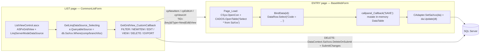

# Sales Reference Master — Legacy Logic + Port Plan

Source of truth for the **Sales → Master** reference/lookup tables when porting the WebForms
(`C:\wincom\ERPV55\ERP_5.5`) implementation to the Blazor Server app (`C:\wincom\net10projects`).

**Legacy studied from** (all read, not inferred):

- Entries: `ERP/SalesForms/Master/{CustGroup, CustSubGroup, CustomerCustType, CustomerSOType, ShiaViaEntry, CustomerShippingLeadTime, CustomerSalesman, AreaCodeEx, LMW, CustomerComment, ProjectEntry}.aspx.cs`
- Batch grids: `ERP/SalesForms/Master/{TaxGroupView, PaymentTermView, CurrencyView, CurrRateView}.aspx.cs`
- Lists: `ERP/SalesForms/{CustGroupView, AreaCodeViewEx, CustomerShippingLeadTimeViewEx}.aspx.cs`, `ERP/SalesForms/Master/ShipViaView.aspx(.cs)`
- Framework: `ERP/Controls/{CommonListForm.aspx.cs, ListViewControl.ascx(.cs)}`, `ERPClasses/Classes/{CAdapter.cs, CSys.cs, CUser.cs, CCommon.cs}`, `StdLib/CADOS.cs`, `ERPUITools/Controls/CommonHelper.cs`, `ERPCommonUI/Helper/InputValidation.cs`, `ERPClasses/AuditLog/AuditLogHelper.cs`
- Consumers: `ERPCommonUI/SalesForms/Controls/{CustomerInfo, DOCustomerInfo, InvCustomerInfo, QuCustomerInfo_Std, SOItemInfo, CNItemInfo}.ascx`, `CustProfile/{CustProfInfo, CustProfPayInfo}.ascx`, `SalesOrder_Std.aspx.cs`, `Quatation_Std.aspx.cs`, `HelperClass/{InvTrxHelper, SalesCommonHelper, ConvSoToInvHelper}.cs`

**Blazor target conventions were read before writing §6–§10** (`ISaSalesRefService`, `SaRefListPageBase`, `SaCodeRefListPageBase`, `InventoryTenantContext.InventoryLeftoverSite`, `AppDbContext` sales entities/configs, `MenuCodes`, `menus.xml`, `scripts/init-sales-masters.sql`).

**Scope:** the flat code-reference family. The parent→child item masters (`SaItemCust`, `IvCustPrice`/`IvCustPriceGroup`, `SaDisGroupItem`, `IvCustPriceGroupItems` UI) are **out of scope** — see §7.4.

---

## Table of contents

1. [Inventory — the 15 reference tables](#1-inventory--the-15-reference-tables)
2. [Legacy architecture](#2-legacy-architecture)
3. [The three CRUD shapes](#3-the-three-crud-shapes)
4. [CRUD semantics, verified](#4-crud-semantics-verified)
5. [Business sense — who consumes each table](#5-business-sense--who-consumes-each-table)
6. [Legacy defect register (do not port)](#6-legacy-defect-register-do-not-port)
7. [Blazor state — what exists, what is missing](#7-blazor-state--what-exists-what-is-missing)
8. [Locked decisions](#8-locked-decisions)
9. [Plan — phases and steps](#9-plan--phases-and-steps)
10. [Menus, permissions, DDL](#10-menus-permissions-ddl)
11. [Test matrix](#11-test-matrix)
12. [Verification checklist](#12-verification-checklist)
13. [Verified vs to-verify](#13-verified-vs-to-verify)

---

## 1. Inventory — the 15 reference tables

| Legacy table | Entry form | List form | DB | Business key (as coded) | Extra columns |
|---|---|---|---|---|---|
| `SaShipVia` | `Master/ShiaViaEntry.aspx` | `Master/ShipViaView.aspx` | ERP | `ShipViaCode` | `Active` |
| `SaCustGroup` | `Master/CustGroup.aspx` | `CustGroupView.aspx` | ERP | `CustGroupCode` | Comp/Branch/Loc |
| `SaCustSubGroup` | `Master/CustSubGroup.aspx` | `CustSubGroupView.aspx` | ERP | `CustSubGroupCode` | Comp/Branch/Loc |
| `SaCustType` | `Master/CustomerCustType.aspx` | `CustTypeViewEx.aspx` | ERP | `CustTypeCode` | `Active` |
| `SaSOType` | `Master/CustomerSOType.aspx` | `SOTypeViewEx.aspx` | ERP | `SOTypeCode` | `Active`, `FOCAuto` |
| `SaComment` | `Master/CustomerComment.aspx` | `CommentViewEx.aspx` | ERP | `CommID` | `Active` |
| `SaSalesRep` | `Master/CustomerSalesman.aspx` | `SalesmanViewEx.aspx` | **Account** | `SRepCode` | `Active`, `CommissionRate` |
| `SaShippingLeadTime` | `Master/CustomerShippingLeadTime.aspx` | `CustomerShippingLeadTimeViewEx.aspx` | ERP | `LeadTimeCode` | `Days`, `Type`, `Active` |
| `SaTaxGroup` | `Master/TaxGroupView.aspx` (self-contained batch grid) | – | **Account** | `TaxGrCode` | `Percentage`, `GLCode`, `Compound` |
| `SaPaymentTerm` | `Master/PaymentTermView.aspx` (batch grid) | – | **Account** | `PayCode` | `Days`, `Active` |
| `SaCurrency` | `Master/CurrencyView.aspx` (batch grid) | – | **Account** | `CurrCode` | `Active` |
| `SaCurrRate` | `Master/CurrRateView.aspx` (batch grid) | – | **Account** | `CurrCode` + `SDate`/`EDate` | date-effective |
| `IvAreaCode` | `Master/AreaCodeEx.aspx` | `SalesForms/AreaCodeViewEx.aspx` | ERP | `AreaCode` | `latitude`, `longitude` |
| `SaProject` | `Master/ProjectEntry.aspx` | `ProjectViewID.aspx` | ERP | `ProjID` | child `SaPrjAttachment` |
| `SaLMW` | `Master/LMW.aspx` | `LMWView.aspx` | ERP | `LicenseNo` + `CustCode` | licence + system date ranges |

Naming quirk: several *list* pages live in `SalesForms/` root while their *entry* page is in
`SalesForms/Master/` (`CustGroupView`, `AreaCodeViewEx`, `CustomerShippingLeadTimeViewEx`,
`CustTypeViewEx`, `SOTypeViewEx`, `CommentViewEx`, `SalesmanViewEx`). Only `ShipViaView` sits beside
its entry page.

---

## 2. Legacy architecture



| Concern | Legacy mechanism |
|---|---|
| Page base | Lists inherit `CommonListForm : BaseWebForm`; entries inherit `BaseWebForm` |
| Identity | `SessionManager.SessionObject` → hidden fields `hdUserID/hdCompany/hdBranch/hdLocation`; `SessionID` is the `SessionIDCK` cookie |
| List data | `LinqServerModeDataSource` server-mode over `ErpDataClassesDataContext` entity sets |
| Entry data | `Select * from SaXxx` (whole table, all tenants) into a `DataTable` |
| Writes | `CAdapter.SetSaXxx(ref da)` builds `Insert/Update/DeleteCommand` from column-mapped `SqlParameter`s; `da.Update(dt)` |
| Transactions | Only the item-master helpers use `con.BeginTransaction()`; the flat masters do **not** |
| Rights | `CUser.CheckUserRight2` / `CUser.GetUserEntryRights` against `vUserRight(ID, ScreenID, Rights)` |
| Screen ID | `this.ID = "200.1.22"`, resolved via `CommonHelper.GetScreenID(Request, this.ID)` — **`?ID=` overrides it** |
| Entry-page override | `CommonHelper.GetEntryPage(Request, defaultEntryPage)` — **`?EntryPage=Xxx` overrides it** |

---

## 3. The three CRUD shapes

### Shape 1 — entry form + list page (11 of 15 tables)

1. `Page_Init` reads `?ID=` and `?Type=` (`New` / `Edit` / `View`).
2. `Page_Load`: login check → hidden fields ← session → `CSys.OpenCon` → `OpenTable()` → `con.Close()` → if not postback: hide Save/Cancel when `Type == "View"`, then `BindData(strID)`.
3. Lookup popup (`ASPxPopupControl` + `callpanelType`) is bound to the **same in-memory `DataTable`**. `OnClickFind` → `PerformCallback("POP")` → `cpPOP = 1` → JS `grid.ApplyFilter("Code='...'")` → `popview.Show()`. Row double-click copies values client-side: `grid.GetRowValues(index, "Code;Desc;Active", cb)`.
4. `SAVE` → `ASPxClientEdit.ValidateGroup("vgSave")` → `callpanel.PerformCallback("SAVE")` → mutate `DataTable` → `UpdateRec()` → `da.Update(dt)` → `cpMsg = "Item(s) saved!"`.
5. `CANCEL` → `window.open("../XxxView.aspx", '_self')`.

### Shape 2 — self-contained inline batch grid (`SaTaxGroup`, `SaPaymentTerm`, `SaCurrency`, `SaCurrRate`)

- One page, one editable grid. Handlers: `grid_BatchUpdate`, `grid_RowInserting`, `grid_RowUpdating`, `grid_RowDeleting`, `grid_InitNewRow`, `grid_CustomCallback("SAVE"|"FILTER")`.
- Grid edits mutate a **Session-cached** `DataTable` (`SESSION_NAME = "SACURRENCYDT"` etc.), re-queried on first load (`Session[SESSION_NAME] = null` then `OpenTable()`).
- `SAVE` → `CAdapter.SetSaXxx(da)` + `da.Update(dtWC)`.
- This is the **only** shape with real rights enforcement (below).
- Extra behaviours: `CurrRateView` filters by date range + currency (`FilterGrid`), exports via `gridExport.WriteXlsToResponse(true)`, and stamps `Status = "NEW"` on new rows (`grid_InitNewRow`).

### Shape 3 — entry with child grid

`SaProject` → `SaPrjAttachment` (`dtSaAtth`, grid callbacks keyed `ID=...`). Same as Shape 1 plus a child `DataTable`.

---

## 4. CRUD semantics, verified

### 4.1 Create

```csharp
// CustGroup.aspx.cs — the canonical shape, identical in every Shape-1 entry page
dr = dtCustGroup.Select("CustGroupCode = '" + txtCode.Text.Replace("'", "''") + "'");
if (dr.Length == 0) drType = dtCustGroup.NewRow();   // the "new vs edit" decision
else                drType = dr[0];

drType["CustGroupCode"] = txtCode.Text.ToUpper();
drType["CustGroupDesc"] = txtDesc.Text.ToUpper();
drType["CompanyCode"]  = hdCompany.Value;
drType["BranchCode"]   = hdBranch.Value;
drType["LocationCode"] = hdLocation.Value;

if (dr.Length == 0) { drType["UserID"] = hdUserID.Value; drType["Created"] = DateTime.Now; }
else                { drType["UpdatedUID"] = hdUserID.Value; drType["Updated"] = DateTime.Now; }

if (dr.Length == 0) dtCustGroup.Rows.Add(drType);    // DataRowState = Added
UpdateRec();                                         // da.Update(dtCustGroup)
```

Facts to carry over:

- Existence is decided **in the in-memory table**, never against the DB.
- Every code and description is **upper-cased** on save.
- Tenant columns are stamped from the session-hidden fields, not from UI.
- Audit columns are split: insert → `UserID` + `Created`; update → `UpdatedUID` + `Updated`.

### 4.2 Read

- **List**: server-mode LINQ filtered by session tenant, e.g. `db.SaCustGroups.Where(x => x.CompanyCode == hdComp.Value && x.BranchCode == hdBranchCode.Value && x.LocationCode == hdLocCode.Value)` (`CustGroupView.aspx.cs`). `ShipViaView` is the exception: `e.QueryableSource = db.SaShipVias;` — no filter at all.
- **Entry**: whole table `DataTable` + `DataRow.Select("<Key> = '<id>'")`, values `.ToString().ToUpper()`.
- `Type == "View"` only sets `btnSave.Visible = false; btnCancel.Visible = false;` — nothing server-side.

### 4.3 Update

- Same code path as create with `dr.Length > 0`.
- `da.Update(dt)` sends only rows whose `RowState != Unchanged`; the adapter matches on the **Original** key:

```csharp
T = com.Parameters.Add("@OldCustGroupCode", SqlDbType.NVarChar, 10, "CustGroupCode");
T.SourceVersion = DataRowVersion.Original;
com.CommandText = "Update SaCustGroup Set ... WHERE (CustGroupCode = @OldCustGroupCode)";
```

- Consequence: editing the code **renames the record**, and the code editor is *not* disabled in edit mode (`LMW.aspx.cs` is the exception — it disables the licence keys).
- `con` was already closed in `Page_Load`; the adapter implicitly re-opens and closes. **No explicit transaction.**
- `da.UpdateCommand.Parameters.Clear()` is called *after* `da.Update(...)` in `CustomerItems`/`CustPriceGroupItems` — harmless, since `SetSaXxx` rebuilds the commands on every `UpdateRec()`.

### 4.4 Delete / deactivate

Three distinct behaviours, all deliberate:

| Behaviour | Where | Detail |
|---|---|---|
| Hard delete, creator-only | `CustGroupView.aspx.cs` and every `*View` list page | `if (list[0].UserID == hdUserID) DeleteOnSubmit(...) else cpErr = "You have prohibited to access this function!"` then `SubmitChanges(FailOnFirstConflict)` |
| Soft deactivate, hard delete when already inactive | `ShipViaView.aspx.cs`, batch grids | `if (Active) Active = false; else DeleteOnSubmit(...)` |
| Reactivate | `CustomerShippingLeadTimeViewEx.OnRefreshItem` | sets `Active = true` |

Entry pages never delete. Shape-1/2 entries stage only in memory, so "Cancel" = navigate away.

### 4.5 Validation actually implemented

| Rule | Source |
|---|---|
| All codes/descriptions upper-cased | every entry page |
| Required code (`RequiredField` + `ValidateGroup("vgSave")`) | entry markup (`CustGroup.aspx`) |
| Forbidden chars `; ? : @ & = + $ , % '`, no leading/trailing space | `InputValidation.ValidateInput` (`ERPCommonUI/Helper/InputValidation.cs`), used only by batch-grid insert/update |
| Duplicate key ⇒ silently treated as update, never an error | every `DataRow.Select` existence test |
| Date-range overlap rejected | `LMW.aspx.cs` `drcheckDate` (same customer/licence) |
| `Active` gate on load | `CustomerSalesman.aspx.cs` loads `SaSalesRep WHERE Active='True'`, so inactive reps cannot be re-opened |
| Composite-key rename | `SetLMWID` — WHERE `LicenseNo` + `CustCode` |

### 4.6 Rights model (port the bitmask, not the plumbing)

`vUserRight(ID, ScreenID, Rights)` — one bitmask per user per screen:

| Bit | Value | `enGroupRight` / `EntryAccessRights` |
|---|---|---|
| 1 | Access | `CanAccess` |
| 2 | New | `CanAddNew` |
| 4 | Edit | `CanEdit` |
| 8 | Delete | `CanDelete` |
| 16 | Post / Closed | `CanPost` |
| 32 | Print | `CanPrint` |
| 64 | Rollback | `CanRollback` |

Screen IDs observed: `200.1.14` (ShippingLeadTime), `200.1.21` (AreaCode), `200.1.22` (CustGroup),
`200.1.29` (ShipVia), `700.1.9` (TaxGroup + Currency + CurrRate + PaymentTerm — **shared, all four**).
Denial message everywhere: `"You have prohibited to access this function!"`.

### 4.7 Audit

`AuditLogHelper` is **skip-by-default** (`static bool skip = true`; `LogAudit` returns immediately) and is
only switched on from `ERP/default.aspx.cs` when `appSettings["NeedAuditlog"] == "yes"`.
**No flat reference table calls it** — only the item-master family via `SalesMasterHelper.AuditLog`.
Reference-data audit in Blazor is therefore a *new* requirement, not a port.

---

## 5. Business sense — who consumes each table

Every consumer filters `Active='True'` (or `Active = 1`) plus company/branch.

| Reference data | Consumer (verified) | Effect |
|---|---|---|
| `SaShipVia` | `CustomerInfo.ascx`, `DOCustomerInfo.ascx`, `InvCustomerInfo.ascx`, `QuCustomerInfo_Std.ascx`: `SELECT ShipViaCode, ShipViaDesc FROM SaShipVia WHERE Active=1` | Ship-via combo on SO/DO/INV/QUO headers |
| `SaComment` | `SOItemInfo`, `DOItemInfo`, `InvItemInfo`, `CNItemInfo` + header controls: `Select * from SaComment where active=1` | Canned document/item remarks |
| `SaPaymentTerm` | `vSaPaymentTerm where Active='True'`; `SalesCommonHelper`, `InvTrxHelper` load the row for `PayCode` → `Days` | Credit term + due-date / ageing |
| `SaTaxGroup` | `SOItemInfo`, `InvItemInfo`, `CNItemInfo`: `Active='True' AND Compound=0|1 AND CompanyCode AND BranchCode`; `SalesOrder_Std.aspx.cs:263` | Tax code + `Percentage`; `Compound` drives two pickers |
| `SaCurrency` / `SaCurrRate` | `SalesOrder_Std.aspx.cs:1771` → `SaCurrRate WHERE CurrCode=… AND SDate<=soDate AND EDate>=soDate`; `ConvSoToInvHelper` → `sySaCurrRate.HomeCurPerUnit` | **Date-effective** rate at document date; home-currency conversion |
| `SaCustGroup` / `SaCustSubGroup` | `CustProfInfo.ascx` (company/branch filtered) | Customer classification for reporting / group discount |
| `SaCustType` | `CustProfInfo.ascx` | Customer type classification |
| `SaShippingLeadTime` | `CustomerProfile.aspx` `ddlInLeadTime` / `ddlExLeadTime` from `LeadTimeCode WHERE Active=1` | Default in/out lead time (`Days`) per customer |
| `SaSalesRep` | Customer profile + `CommissionRate` | Salesman attribution / commission |
| `SaSOType` | SO header; `FOCAuto` column is maintained but **every consuming check is commented out** in `InvoiceEntry*.aspx.cs` | Type code live; FOC auto-amount rule is dead code |
| `SaProject` | `ProjID` referenced by SO/DO/CN (`left outer join SaItemCust c on p.ProjID=c.ProjID`) | Project tagging |
| `IvAreaCode` | Customer/supplier address area; `latitude`/`longitude` maintained through an external Nominatim call (`AreaCodeEx.GetCoordinates`) | Area routing / coverage + map pin |
| `SaLMW` | Customer-licensed personnel (Malaysia LMW) keyed `LicenseNo` + `CustCode` with licence/system validity windows | Licence compliance per customer/person |

---

## 6. Legacy defect register (do not port)

Each item gives the port rule. `D#` ids are stable for review references.

| # | Defect (legacy) | Port rule |
|---|---|---|
| **D1** | `CAdapter` update/delete `WHERE` matches **only the code** while the table carries Company/Branch/Location (`SetSaCustGroup`, `SetSaCustType`, `SetSaSOType`, `SetSaCustSubGroup`, `SetSaShippingLeadTime`) | Composite key `(CompanyCode, Code)` minimum; tenant always in the predicate. Never match on code alone |
| **D2** | New-vs-edit decided from a `DataTable` loaded with `Select * from SaXxx` (all tenants, first match wins) | Decide in the repository: `GetAsync(tenant, code) == null` ⇒ insert, else update |
| **D3** | `SaShipVia` has **no tenancy at all**: adapter inserts only code/desc/active/audit, list has no filter, entry company stamping is commented out | Decide explicitly (see P4). Do not inherit accidentally |
| **D4** | No transaction on flat-master saves; a multi-row `da.Update` can partially fail | One `SaveChanges` in one transaction; all-or-nothing |
| **D5** | No concurrency token | `RowVersion` on every master + `expectedFingerprint`/`RowVersion` gate on update |
| **D6** | `Type=View` is cosmetic (buttons hidden only) and entry pages perform **no rights check at all** — grep for `GetUserEntryRights|IsValidAccessRight` under `SalesForms/Master` matches only `TaxGroupView`, `CurrencyView`, `CurrRateView`, `PaymentTermView` and the list pages | `[Authorize]`/`EnsurePermissionAsync` on every mutation; View mode is a read-only component |
| **D7** | `?ID=` overrides the screen ID used for rights; `?EntryPage=` swaps the entry form | Screen ID is a constant on the component; variant entry forms from a server-side allow-list |
| **D8** | Raw SQL string concatenation everywhere; `InputValidation` exists but is barely used | Parameterised EF/Dapper; character rules as validators |
| **D9** | Whole-table loads (`Select * from SaXxx`) and `Select * from AdUser Order By ID` per postback just to read one flag | Query the tenant slice; read the user flag once per circuit/claim |
| **D10** | Connection lifetime inconsistent (`con.Close()` before adapter use, `Parameters.Clear()` after `Update`, never disposed) | DI-scoped `DbContext`; no manual connections |
| **D11** | Copied-and-diverged logic: `SaCurrRate` overlap validation commented out; `CustomerCustType` sets `UserID` on update while others set `UpdatedUID`; `SaShipVia` update omits `Created`/`Updated` from SET | One canonical audit contract for all masters |
| **D12** | `CustomerItems.aspx.cs` and `CustPriceGroupItems.aspx.cs` share session key `"SACUSTITEMSSALES"` | (Item-family phase) never share cache keys |
| **D13** | Screen ID `700.1.9` shared by four unrelated powers | One menu/permission code per master (Blazor already does this — `SA_PAY_TERM`, `SA_TAX_GROUP`, …) |

---

## 7. Blazor state — what exists, what is missing

### 7.1 Already implemented — do not re-create

| Legacy master | Blazor service methods | Blazor UI page | Entity / config |
|---|---|---|---|
| `SaCustType` | `ListCustTypesAsync` … `DeleteCustTypesAsync` | `Sales/Masters/SaCustTypeList.razor(.cs)` | `CustomerProfile/SaCustType.cs` + `Configurations/Sales/SaCustTypeConfiguration.cs` |
| `SaCustGroup` | `ListCustGroupsAsync` … | `SaCustGroupList.razor(.cs)` | `CustomerProfile/SaCustGroup.cs` + config |
| `IvAreaCode` | `ListAreasAsync` … | `SaAreaList.razor(.cs)` | `Sales/IvAreaCode.cs` + config |
| `SaCountry` (new) | `ListCountriesAsync` … | `SaCountryList.razor(.cs)` | `Sales/SaCountry.cs` + config |
| `SaCurrency` | `ListCurrenciesAsync` … `SetCurrencyActiveAsync` | `SaCurrencyList.razor(.cs)` | `Sales/SaCurrency.cs` + config |
| `SaCurrRate` | `ListCurrRatesAsync` … (keyed) | `SaCurrRateList.razor(.cs)` | `Sales/SaCurrRate.cs` + config |
| `SaDisGroup` | `ListDisGroupsAsync` … (keyed `GroupName`+`PayCode`) | `SaDisGroupList.razor(.cs)` | `CustomerProfile/SaDisGroup.cs`, `SaDisCust.cs` + configs |
| `SaPaymentTerm` | `ListPaymentTermsAsync` … (fingerprint on save) | `SaPaymentTermList.razor(.cs)` | `Sales/SaPaymentTerm.cs` + config |
| `SaSalesRep` | `ListSalesRepsAsync` … (fingerprint on save) | `SaSalesRepList.razor(.cs)` | `Sales/SaSalesRep.cs` + config |
| `SaTaxGroup` | `ListTaxGroupsAsync` … (fingerprint on save) | `SaTaxGroupList.razor(.cs)` | `Sales/SaTaxGroup.cs` + config |
| Customer profile | `SaCustService` | `SaCustList` / `SaCustEntry` | `CustomerProfile/SaCust.cs`, `SaCustAdd.cs`, `SaCustContact.cs` |
| Project reference | (Admin master) | `Admin/Master/MsProjectList.razor` | `MsProject.cs` + `MsDept.cs` |

Shells available for a new master:

| Shell | Purpose |
|---|---|
| `ErpWeb.UI/Admin/Master/SaRefListPageBase.cs` | Sales code-reference list + popup with **row-version keys**: toolbar NEW / ACTIVATE / DEACTIVATE / DELETE / EXPORT, row VIEW / EDIT, `EnsurePermissionAsync`, `SelectedRows`, `ReloadListAsync` |
| `ErpWeb.UI/Admin/Master/SaKeyedRefListPageBase.cs` | Composite-key variant (used by `SaCurrRateList`, `SaDisGroupList`) |
| `ErpWeb.UI/Sales/Masters/SaCodeRefListPageBase.cs` | Sales list pages that delete **by code without row-version** |
| `ErpWeb.UI/Admin/Master/MsRefListPageBase.cs` | Admin master reference (`MsDept`, `MsProject`) |
| `ErpWeb.UI/Admin/Master/AdSmNumListPageBase.cs` | Numbering screens |

Cross-cutting conventions to follow (all verified in code):

- **Tenant stamping**: `InventoryLeftoverSite.Apply(entity, writeScope)` in `ErpWeb.Core/Inventory/InventoryTenantContext.cs` — sets `BranchCode` and `LocationCode` (`BranchCode` only for `PoSupplier`). Overloads already exist for `SaCustType`, `SaCustGroup`, `IvAreaCode`, `SaCurrency`, `SaPaymentTerm`, `SaSalesRep`, `SaTaxGroup`, `SaDisGroup`. **Add an overload for each new master**; never accept company/branch/location from the route or body.
- **Scope helpers**: `IInventoryTenantContext.TryCompanyScope()` / `TryBranchScope()` / `TryWriteScope()`. Fail-closed CompanyCode is mandatory (`EnsureCompanyContext()`).
- **Concurrency**: `RowVersion` on the master + `expectedFingerprint` argument on `Save…Async` (enforced on a *tracked* reload); `SaMasterFingerprint.cs` exists in `ErpWeb.Core/Sales`.
- **Code normalisation**: `NormalizeCode` = `Trim()` + `ToUpperInvariant()`.
- **Duplicate on create**: explicit `AnyAsync(x => x.CompanyCode == ctx.CompanyCode && x.Code == code)` → duplicate error (never a silent upsert — **D2**).
- **Delete**: `CanDelete…Async` → `DeleteCheckResult`, then `Delete…Async`; list page shows the confirm dialog. `UNIQUE`/FK in the DB is the final authority.
- **Result contract**: `IvMasterOperationResult<T>` + `IvMasterErrorCode` (from `ErpWeb.Core/Inventory/IvMasterResults.cs`), keys as `IvMasterKeyToken`.
- **Permissions**: `ErpWeb.Core/Menus/PermissionCodes.cs` (`Add`, `Edit`, `Delete`, `Export`, `Access`) + `MenuCodes`; pages wrapped in `<MenuAuthorize MenuCode="…">`.
- **Routes**: kebab-case under `/sales/…` (`@page "/sales/customer-types"`).
- **Schema**: `scripts/*.sql`, **manual deploy only, never at startup**, idempotent (`IF OBJECT_ID(...) IS NULL`, `IF COL_LENGTH(...) IS NULL`), `RowVersion rowversion NOT NULL` in the CREATE.

### 7.2 Blazor key/shape summary for the sales masters already built

| Table | Blazor PK | `Active` | Tenant stamp |
|---|---|---|---|
| `IvAreaCode` | `(CompanyCode, AreaCode)` | no | Branch + Location |
| `SaCountry` | `(CountryCode)` global | no | – |
| `SaCurrency` | `(CompanyCode, CurrCode)` | yes | Branch + Location |
| `SaCustType` | `(CompanyCode, CustTypeCode)` | yes | Branch + Location |
| `SaCustGroup` | `(CompanyCode, CustGroupCode)` | no | Branch + Location |
| `SaDisGroup` | `(CompanyCode, GroupName, PayCode)` | no | Branch + Location |
| `SaPaymentTerm` | `(CompanyCode, PayCode)` | yes | Branch + Location |
| `SaSalesRep` | `(CompanyCode, SRepCode)` | yes | Branch + Location |
| `SaTaxGroup` | `(CompanyCode, TaxGrCode)` | **no** | Branch + Location |
| `SaCurrRate` | `(SDate, EDate, CurrCode)` — **no company column** | `Status bit` | – |

Three deviations from legacy to keep in mind (**D1** applied, and reversals):

1. Tenancy moved into the **PK** (`CompanyCode, Code`); legacy had the code alone.
2. Blazor `SaTaxGroup` has **no `Active`** column, while every legacy consumer filtered `Active='True'`
   (`SOItemInfo.ascx`, `InvItemInfo.ascx`, `CNItemInfo.ascx`). Tax-group deactivation is therefore
   impossible in Blazor — confirm this is intended before wiring tax lookups.
3. Blazor `SaCurrRate` is **global** (`SDate, EDate, CurrCode`, no `CompanyCode`), while legacy filtered
   by company/branch. Cross-company rate bleed is possible if two companies use the same currency code.

### 7.3 Gaps — legacy masters with no Blazor counterpart

| Legacy master | Needed because | Blazor status |
|---|---|---|
| `SaCustSubGroup` | `SaCust.SubGroupCode` exists on the Blazor customer entity | **Missing** (entity, config, DbSet, DDL, service, UI, menu) |
| `SaSOType` | SO type classification + `FOCAuto` | **Missing.** Blazor `SaSo` has **no** type column — decide whether the field is needed at all (`FOCAuto` consumer logic is dead — see §5) |
| `SaComment` | Canned remarks + `active=1` pickers | **Missing.** Blazor `SaSo`/`SaCust` have no comment master reference (`Remarks` is free text) |
| `SaShipVia` | Ship-via on SO/DO/INV/QUO headers | **Missing.** Blazor `SaSo`/`SaCust` have **no** ship-via column |
| `SaShippingLeadTime` | In/out lead-time defaults per customer | **Missing.** Blazor `SaCust` has **no** `InLeadTime`/`ExLeadTime` columns |
| `SaLMW` | Customer-licensed personnel with validity ranges | **Missing** |
| `SaDisGroupItem` | Item-level discount lines | **Missing** — belongs to the item-family phase |
| `SaItemCust`, `IvCustPrice`, `IvCustPriceGroup` | Customer-item mapping, price groups | **Missing** — item-family phase (§7.4) |

Also present but **not** to be used: `ErpWeb.Model/Entities/CustomerProfile/SaCustomerType.cs` maps a
legacy table `SaCustomerType` (global key, no company). `SaCustType` + `SaCustTypeConfiguration` is the
live one. Verify no consumer references `SaCustomerType`, then remove or ignore it.

### 7.4 Out of scope (item-family phase)

`SaItemCust` (customer part no / UOM / MOQ / unit price / `Status='NEW'` refresh flow),
`IvCustPrice` (`CustPriceGroupItems.aspx`, `Session`-staged grid + `da.Update` in a
`SqlTransaction` + `AuditLogHelper`), `IvCustPriceGroup`, `SaDisGroupItem`
(`CustomerItemDiscount.aspx`, ID-based staging), `CustomerItems.aspx` price-visibility rules
(`AdUser.SellPriceView`, `AdUserGroupDefault.CPriceViewOnly`). These need their own spec because
their semantics (status lifecycle, transaction + audit, child-grid callbacks, matrix of
price-visibility rights) differ from the flat family. **Do not mix them into this plan.**

---

## 8. Locked decisions

| # | Decision | Rationale |
|---|---|---|
| **P1** | Scope = `SaCustSubGroup`, `SaShipVia`, `SaSOType`, `SaComment`, `SaShippingLeadTime`, `SaLMW`. Item-family excluded. | §7.3 / §7.4 |
| **P2** | Every new master clones the **`SaCustType` slice** (simple code+desc+Active with row-version) unless it has extra fields, in which case clone **`SaPaymentTerm`** (fingerprint + `Days`) or **`SaSalesRep`** (wide popup). | §7.1 shells; existing v3 pattern |
| **P3** | Physical tables, **not** `IvMsCode` code-types, for all six. | Legacy has distinct columns (`Active`, `Days`, `Type`, `FOCAuto`, date ranges) and its own screens; `IvMsCode` has no audit columns and is global-only |
| **P4** | `SaShipVia` becomes **company-scoped** (`PK (CompanyCode, ShipViaCode)`, `Active`, `InventoryLeftoverSite.Apply`). Legacy was global — this is a **deliberate fix of D3**. | Consistent with every other Blazor sales master |
| **P5** | `SaSOType` keeps `FOCAuto` as a column but **no FOC auto-pricing behaviour is ported** (legacy consumer code is commented out). Blazor `SaSo` gains no type column in this phase. | §5 |
| **P6** | `SaComment` key = `CommID`, and it **is** company-scoped (`PK (CompanyCode, CommID)`, `Active`). Legacy keyed on `CommID` only. | D1 |
| **P7** | `SaShippingLeadTime` keeps `Days` (int) and `Type` (short text). `Type` values are **to be confirmed** before DDL (T1). | §4.5 / T1 |
| **P8** | `SaLMW` keeps its two-column business key `(LicenseNo, CustCode)` **plus** tenancy → `PK (CompanyCode, LicenseNo, CustCode)`; the overlap rule from `LMW.aspx.cs` is **re-enforced server-side** (legacy allowed it to drift). | §4.5; the legacy overlap check is real business logic |
| **P9** | Reaction to **D6**: no cosmetic View mode — every mutation goes through `EnsurePermissionAsync(PermissionCodes.Add|Edit|Delete)`; View opens a read-only popup. | Security |
| **P10** | Reaction to **D5**: `RowVersion` on all six new tables; update path requires `expectedFingerprint` (tracked reload). Delete requires the row-version key token. | Consistent with `SaRefListPageBase` |
| **P11** | Reaction to **D13**: one menu code and one screen permission per master — `SA_CUST_SUB_GROUP`, `SA_SHIP_VIA`, `SA_SO_TYPE`, `SA_COMMENT`, `SA_SHIP_LEAD_TIME`, `SA_LMW`. | `menus.xml` already follows this |
| **P12** | No creator-only delete (D-legacy). Delete authority = `CanDelete` reference check + `PermissionCodes.Delete`. | Legacy rule exists only because there were no reference checks; Blazor already has `DeleteCheckResult` |
| **P13** | `SaCurrRate` global scope and `SaTaxGroup` missing `Active` (§7.2) are **flagged, not fixed** in this plan — raise as separate decisions. | Avoid scope creep; both touch SO/DO/INV behaviour |
| **P14** | Audit logging for reference masters is **not** in this phase (legacy has none — §4.7). Add later via a SaveChanges interceptor if required. | Parity first |

---

## 9. Plan — phases and steps

Service-first, tests before UI, in the order the existing plans use. **One master per step group**;
do not batch several masters into one commit.

### Phase 0 — groundwork (1 step, ~half day)

**Step 0.1 — Schema + model baseline**

1. Pick the six tables and write `scripts/alter-sales-master-refs.sql` (idempotent, manual deploy only):
   `SaCustSubGroup`, `SaShipVia`, `SaSOType`, `SaComment`, `SaShippingLeadTime`, `SaLMW`.
   Columns per P4–P8 + standard set:
   `CompanyCode nvarchar(10) NOT NULL`, `<Code> nvarchar(20–40) NOT NULL`, `<Desc> nvarchar(100–200) NULL`,
   `Active bit NOT NULL CONSTRAINT DF_x DEFAULT(1)` where applicable, `Days int NULL`,
   `Type nvarchar(20) NULL`, `FOCAuto float NULL`, `BranchCode nvarchar(10) NULL`,
   `LocationCode nvarchar(20) NULL`, `Created datetime2 NULL`, `Updated datetime2 NULL`,
   `UserID nvarchar(20) NULL`, `UpdatedUID nvarchar(20) NULL`, **`RowVersion rowversion NOT NULL`**.
   Include the post-apply verification query in the header comment (project convention).
2. Add entities under `ErpWeb.Model/Entities/Sales/` (+ `SaLMW` may live under `CustomerProfile/` if it
   reads better — pick one and be consistent).
3. Add `IEntityTypeConfiguration<T>` under `ErpWeb.Model/Configurations/Sales/`, matching
   `SaCustGroupConfiguration` exactly: `HasKey(new { CompanyCode, Code })`, `HasMaxLength`, audit column
   name mapping (`CreatedDate→"Created"`, `CreatedBy→"UserID"`, `ModifiedDate→"Updated"`,
   `ModifiedBy→"UpdatedUID"`), `RowVersion.IsRowVersion()`.
4. Register `DbSet`s on `AppDbContext`.
5. Add `InventoryLeftoverSite.Apply(...)` overloads for all six entities.
6. Build + `dotnet test` green before touching features.

### Phase 1 — the three trivial masters (code + desc + Active)

**Step 1.1 `SaShipVia`** (clone `SaCustType`)
- Service: `ListShipViasAsync`, `GetShipViaAsync`, `SaveShipViaAsync(vm, isNew, expectedFingerprint)`, `SetShipViaActiveAsync`, `CanDeleteShipViasAsync`, `DeleteShipViasAsync`.
- `CanDelete`: reference check — grep for `ShipVia` consumers before implementing; if none yet, return "referenced" only when a future FK exists. Return a clear not-referenced result today (documented, not silent).
- UI: `SaShipViaList.razor(.cs)` → `@page "/sales/ship-vias"`, `@inherits SaRefListPageBase<SaShipViaListRow>`.
- Menu: `SA_SHIP_VIA` (see §10).

**Step 1.2 `SaCustSubGroup`** (clone `SaCustType`; template also needs the `CustGroupCode` parent? — **no**: legacy `SaCustSubGroup` is standalone with its own code+desc; do not invent a parent FK).

**Step 1.3 `SaComment`** (clone `SaCustType`; key `CommID`, label "Comment ID"; description column is the comment text — check the legacy `CustomerComment.aspx.cs` field names (`CommID`, comment body, `Active`) before writing the entity, they were only grep-verified here).

### Phase 2 — masters with extra fields

**Step 2.1 `SaShippingLeadTime`** (clone `SaPaymentTerm` — has `Days`)
- `Days` = `int` with range validation (≥ 0); `Type` = short text (T1 for allowed values).
- UI title "Shipping Lead Time"; columns LeadTime Code / Description / Days / Type / Active.

**Step 2.2 `SaSOType`** (clone `SaPaymentTerm`)
- `FOCAuto` = `float`/`decimal(18,6)` nullable, **no behaviour** (P5); label it "FOC Auto (legacy, unused)" or hide it.

**Step 2.3 `SaLMW`** (clone `SaSalesRep` — wide popup, several fields)
- Key `(CompanyCode, LicenseNo, CustCode)`; fields `LicenseID`, `Type`, `LicenseNo`, `LicenseStartDate`,
  `LicenseEndDate`, `SystemStartDate`, `SystemEndDate`, `Name`, `IC`, `Position`, `CustCode`, `CustName`.
- Validation: licence start ≤ end; system start ≤ end; **no date-range overlap per (customer, licence)** —
  this is the legacy `drcheckDate` rule; implement it as a service-level guard plus a DB index on
  `(CompanyCode, CustCode, LicenseNo, SystemStartDate, SystemEndDate)`.
- Delete is keyed (two-part key) → use `SaKeyedRefListPageBase` if the shell supports a 3-part key, else
  fall back to `SaRefListPageBase` with a composite `IvMasterKeyToken` string (verify which; T2).

### Phase 3 — wiring, parity and clean-up

**Step 3.1** Tax-group `Active` decision (§7.2 / P13) — do not silently change; raise with the owner of
the SO/invoice tax lookups.

**Step 3.2** `SaCurrRate` scope decision (global vs company). If it becomes company-scoped, that is a
schema migration (`ALTER TABLE ... ADD CompanyCode`, backfill from a single-company assumption, PK
rebuild) — treat as its own plan.

**Step 3.3** Remove or quarantine `SaCustomerType.cs` (§7.3) once no consumer is found.

**Step 3.4** Export workbooks: if the reference masters need EXPORT parity with `ListViewControl.ExportGrid`
(XLSX with header), follow `PoMasterRefExportWorkbooks.cs` and the PO export endpoint pattern.

### Phase 4 — item-family (separate plan, listed only for sequencing)

`SaDisGroupItem` → `SaItemCust` → `IvCustPriceGroup` → `IvCustPrice`, plus the price-visibility right
matrix. Write `docs/sales-item-master-plan.md` before coding.

---

## 10. Menus, permissions, DDL

### 10.1 `MenuCodes.cs` additions

```csharp
public const string SalesCustSubGroup = "SA_CUST_SUB_GROUP";
public const string SalesShipVia      = "SA_SHIP_VIA";
public const string SalesSoType       = "SA_SO_TYPE";
public const string SalesComment      = "SA_COMMENT";
public const string SalesShipLeadTime = "SA_SHIP_LEAD_TIME";
public const string SalesLmw          = "SA_LMW";
```

### 10.2 `ErpWeb/Menus/menus.xml` — append inside `SA_MASTER` (SortOrder 12–17)

```xml
<Menu Code="SA_CUST_SUB_GROUP" Name="Customer Sub Groups" Route="/sales/customer-sub-groups" SortOrder="12" />
<Menu Code="SA_SHIP_VIA"       Name="Ship Via"            Route="/sales/ship-vias"          SortOrder="13" />
<Menu Code="SA_SO_TYPE"        Name="SO Types"            Route="/sales/so-types"           SortOrder="14" />
<Menu Code="SA_COMMENT"        Name="Comments"            Route="/sales/comments"           SortOrder="15" />
<Menu Code="SA_SHIP_LEAD_TIME" Name="Shipping Lead Time"  Route="/sales/shipping-lead-time" SortOrder="16" />
<Menu Code="SA_LMW"            Name="LMW Licences"        Route="/sales/lmw"                SortOrder="17" />
```

Then run the menu sync (`IMenuSyncService`) and grant `ADD/EDIT/DELETE/EXPORT` through Role Permissions —
mirroring `scripts/init-menu-access.sql`.

### 10.3 DDL sketch (shape only — full script is Step 0.1)

```sql
IF OBJECT_ID(N'dbo.SaShipVia', N'U') IS NULL
BEGIN
    CREATE TABLE dbo.SaShipVia (
        CompanyCode   nvarchar(10)  NOT NULL,
        ShipViaCode   nvarchar(20)  NOT NULL,
        ShipViaDesc   nvarchar(100) NULL,
        Active        bit           NOT NULL CONSTRAINT DF_SaShipVia_Active DEFAULT (1),
        BranchCode    nvarchar(10)  NULL,
        LocationCode  nvarchar(20)  NULL,
        Created       datetime2     NULL,
        Updated       datetime2     NULL,
        UserID        nvarchar(20)  NULL,
        UpdatedUID    nvarchar(20)  NULL,
        RowVersion    rowversion    NOT NULL,
        CONSTRAINT PK_SaShipVia PRIMARY KEY (CompanyCode, ShipViaCode)
    );
END
GO
```

---

## 11. Test matrix

| # | Case | Expectation |
|---|---|---|
| T1 | Create duplicate code, same company | Validation error naming the code; **no** silent upsert (D2) |
| T2 | Create same code, different company | Allowed; second row visible only in its own company |
| T3 | Update with stale fingerprint | Concurrency error; DB row unchanged; no partial write |
| T4 | Update + second browser saves first | Second save fails with reload-not-retry message (`SaCustService` convention) |
| T5 | Deactivate then list | Row still visible, `Active = false`; no hard delete |
| T6 | Delete referenced master (e.g. sub-group used by a customer) | `CanDelete` blocks; list shows the reference reason |
| T7 | Delete unreferenced | Row removed; audit columns irrelevant |
| T8 | CompanyCode claim empty | Fail-closed error on every service method |
| T9 | Route/body attempts to inject `CompanyCode`/`BranchCode` | Ignored; tenant always from claims |
| T10 | `BranchCode`/`LocationCode` stamping | Populated from `InventoryLeftoverSite.Apply` on create and update |
| T11 | `SaLMW` overlapping system-date range for same customer+licence | Rejected (legacy `drcheckDate` parity) |
| T12 | `SaLMW` licence start > end | Rejected |
| T13 | `SaShippingLeadTime.Days` negative | Rejected |
| T14 | Permission denied per action | `ADD` / `EDIT` / `DELETE` / `EXPORT` each blocked server-side; message "Access Denied!!" |
| T15 | View mode | Read-only popup; no save path reachable |
| T16 | Code with forbidden chars (`; ? : @ & = + $ , % '`) or leading/trailing space | Rejected with the legacy-style message |
| T17 | Export | XLSX matches grid content; permission enforced server-side |
| T18 | Menu sync + role grant | Menu visible only with the right; route 404/redirect otherwise |

SQLite service tests plus SQL Server concurrency tests, as in the customer/supplier plans.

---

## 12. Verification checklist

- [ ] `scripts/alter-sales-master-refs.sql` applied to the deploy DB; verification query returns the expected column set (including `RowVersion`).
- [ ] `dotnet build` + `dotnet test` green; new service tests included.
- [ ] Menu sync run; each new menu code granted to the intended roles.
- [ ] Browser-verify per master: NEW → SAVE → close → EDIT → change → SAVE (reload-not-retry) → DEACTIVATE → DELETE.
- [ ] Tenant isolation verified with two companies (T2/T8/T9).
- [ ] Concurrency verified with two browser sessions (T3/T4).
- [ ] No `Select *` style whole-table load in the new services; all queries tenant-filtered.
- [ ] No raw string-concatenated SQL introduced (D8).

---

## 13. Verified vs to-verify

**Verified in source (this pass):** the 15-table inventory and their keys; the three CRUD shapes; every
CRUD step in §4; the `CAdapter` command construction and its code-only `WHERE` keys; `AuditLogHelper`
skip-by-default and that no flat master calls it; the bitmask rights model and which screens enforce it;
`CommonHelper.GetScreenID`/`GetEntryPage` query-string overrides; the consumer filters
(`Active=1`, `Compound`, company/branch) in SO/DO/INV/CN/QUO controls; the date-effective `SaCurrRate`
lookup; `FOCAuto` consumers being commented out; the `SESSION_CUSTPRD` collision; and on the Blazor
side: existing services/entities/configs/UI for the ten implemented masters, the shells, `MenuCodes`,
`menus.xml`, the sales-master DDL, `SaCust`/`SaSo` column sets (no ship-via, no lead-time, no SO type,
no comment reference), and `InventoryLeftoverSite` overload coverage.

**Not individually opened (grep-level only):** `CommentViewEx.aspx.cs`, `CustSubGroupView.aspx.cs`,
`CustTypeViewEx.aspx.cs`, `SOTypeViewEx.aspx.cs`, `SalesmanViewEx.aspx.cs`, `LMWView.aspx.cs`,
`ProjectViewID.aspx.cs` — all matched the `CommonListForm` + `defaultEntryPage` + `this.ID` +
`KeyFieldName` shape, but their `OnDeleteItem` bodies were not read. `CustomerComment.aspx.cs` body
column names were grep-only.

**T1 — `SaShippingLeadTime.Type` allowed values.** The entry page binds `txtType` to a combo and copies
`Type` from the popup, but the consumer in `CustomerProfile.aspx` uses only `LeadTimeCode`. Read the
`ASPxComboBox` item list in `CustomerShippingLeadTime.aspx` before writing the entity/validation.

**T2 — keyed shell capacity.** Confirm `SaKeyedRefListPageBase` supports a 3-part key (company +
licence + customer); if not, decide between a composite string key and a `RowVersion`-based
`SaRefListPageBase` with a composite token.

**T3 — `SaCustEntry` lookup vs free text.** Verify whether `SubGroupCode`, `AreaCode`, `SalesmanCode`,
`CustGroupCode` are lookups today. `SaCustSubGroup` is only worth building now if the entry screen binds
it as a lookup.

**T4 — Sales-master `RowVersion` script of record.** `alter-iv-masters-rowversion.sql` covers only
inventory tables, while `SaCustGroupConfiguration` already maps `RowVersion`. Locate the script that adds
`RowVersion` to the existing `Sa*` masters (grep for `COL_LENGTH('dbo.SaCustGroup', 'RowVersion')`) and
extend that file family rather than inventing a new convention.

**T5 — `SaLMW` real-world driver.** It is Malaysia-specific licence tracking. Confirm it is needed in the
new app before Phase 2.3; it is the heaviest of the six masters.

**Open questions for the product owner**

1. Is `SaShipVia` per-company (P4) or global as legacy had it?
2. Is `SaSOType` needed at all, given `SaSo` has no type column and `FOCAuto` is dead?
3. Are canned comments (`SaComment`) in scope for the new SO/DO/INV entry screens?
4. Is per-customer lead time (`SaShippingLeadTime`) in scope, given `SaCust` has no lead-time columns?
5. Should `SaTaxGroup` gain `Active` (legacy parity) or stay permanently active?
6. Should `SaCurrRate` become company-scoped?
7. Reference-master audit trail — needed, or is concurrency (`RowVersion`) plus user stamps sufficient?
