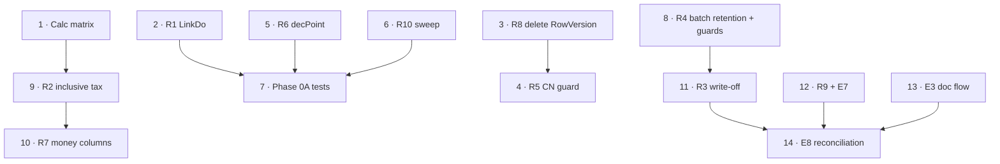

# Sales Transaction Enhancement — Implementation Plan

> **Purpose:** the concrete, sequenced plan derived from [sales_trans_enhancement.md](sales_trans_enhancement.md). Every register item below was re-verified against the current code before being planned; two register nits and two phasing corrections are recorded in the review verdict.
> **Companion documents:** [sales_trans_enhancement.md](sales_trans_enhancement.md) — defect register · [sales_trans_logic.md](sales_trans_logic.md) — current behaviour reference · [cdn-logic.md](cdn-logic.md) — legacy WebForms specification.
> **Reviewed:** 2026-09-10 · **Revision:** v2, incorporating external plan review (P0 §2.1–§2.8, P1 §3.1–§3.5, universal invariants, revised phasing)
> **Scope:** `ErpWeb.Core/Sales`, `ErpWeb.Core/Inventory`, `ErpWeb.UI/Sales/Transactions`, `ErpWeb.Model`, `scripts`

Fix the two silent-corruption defects, close the unrecoverable-state gaps, then make force-close and SO capacity coherent. The write-off model is a **new quantity in the SO consumption model** and is specified in full in [§3](#3-writtenoffqty-quantity-contract) and [§5](#5-force-close-specification) before any code is written. `E1/E2/E5/E6` excluded — E5 (AR/GL) needs its own plan doc.

---

## Table of contents

1. [Review verdict](#1-review-verdict)
2. [Decisions locked](#2-decisions-locked)
3. [WrittenOffQty quantity contract](#3-writtenoffqty-quantity-contract)
4. [Universal ERP invariants](#4-universal-erp-invariants)
5. [Force-close specification](#5-force-close-specification)
6. [Steps](#6-steps)
7. [Relevant files](#7-relevant-files)
8. [Verification](#8-verification)
9. [R2 golden test matrix](#9-r2-golden-test-matrix)
10. [Historical backfill determination](#10-historical-backfill-determination)

---

## 1. Review verdict

All 18 register items verified against code. Two nits:

| Item | Nit |
|---|---|
| R4 | The orphaned audit rows are in `IvTrxHistory`, not `IvTrx` (written at 4 sites in `IvInventoryPostingService`) |
| R10.1 | Register is correct as written. `SaCdnService` L1801 passes a real percent, all 8 other callers pass `0m` — inert either way because the parameter is unused |

Two phasing corrections: **R4 is a semantics change** (DO force-close currently deletes the batch), and **E8 moves Phase 1 → Phase 2** (its invariants need `WrittenOffQty`).

**No EF migrations exist.** Schema changes follow entity + `Configurations` + hand-written idempotent DDL in `scripts/` (template: `scripts/alter-saso-doc-consume-columns.sql`).

### 1.1 Findings from the v1 review that changed this plan

| Review item | Resolution |
|---|---|
| §2.2 partial billing | **v1 contained a contradiction.** v1 said force-close "refuses when a DO→INV allocation already exists", which makes the `SO=100 / DO=100 / INV=60` case impossible to close. Corrected in §5.1 — write off only the unallocated remainder. |
| §2.6 golden matrix | Expanded into a concrete locked table — §9. |
| §2.7 historical backfill | **v1's "option A (backfill)" recommendation is not safe.** `taxPercent` is resolved live from `SaTaxGroup` into the calc-state DTO (`SaInvoiceLineCalcState.TaxPercent`) and is **not persisted** on `SaInvoiceDetail` or `SaInvoice`. Historical inclusive rows are therefore **not deterministically reconstructible**. Recommendation reversed in §10. |
| §2.1 / §2.8 | New §3 defines every quantity, its authority, and the billable accounting identity. |
| §2.4 / §2.5 | New §5.3 and §5.4. |
| §3.2 | Phase 0 split into 0A / 0B. |

### 1.2 Findings from the v2 review that changed this plan

| Review item | Resolution |
|---|---|
| §1 lock ordering | The existing architecture is **DO → SO**, not SO → DO: `AllocateAsync` locks DOs at L545-558 and SOs at L587-604. Asserted explicitly as D13 and specified in §5.5 rather than left to the implementer. |
| §2 I3 | **Corrected.** v2 conflated duplicate-record protection with capacity. A unique index cannot prevent `INV1 = 60` + `INV2 = 60` against a DO line of 100. I3 restated as a capacity invariant; the index demoted to a secondary defence. |
| §3 concurrent force-close | Added `Concurrent_force_close_of_two_DOs_same_SO_line`. This is a read-modify-write on `SaSoDetail.WrittenOffQty` and was genuinely absent from v2. |
| §4 SO lock before write-off | Added as an explicit rule in §5.1 and as step 11c. |
| §5 write-off reconciliation | Added as §5.6 with an expected-vs-actual formula; new E8 code `WRITTEN_OFF_QTY_MISMATCH`. |
| §6 residual tie-breaker | `SaInvoiceLineCalcState` has **no `Line`** property, so the tie-breaker requires adding one — specified in §9.3. |
| §7 state machine | Added as the §5.3 transition table. |
| §8 DB vs domain constraints | Added as the §4.1 enforcement-layer table. |
| §9 Phase 2 exit | I10 added to §4 and to the Phase 2 exit criteria. |

---

## 2. Decisions locked

| # | Decision | Gates |
|---|---|---|
| D1 | Scope = Phases 0–2. **Excluded:** E1, E2, E5 (AR/GL), E6 (e-invoice). | — |
| D2 | **R2 is a bug fix to legacy semantics** — the entered unit price includes tax; un-tax to derive net/tax. `Amount` becomes ex-tax and is a **visible change on inclusive lines** — captions need review. | Step 9 |
| D3 | **Force-close = write-off.** `WrittenOffQty` is a **deliberate deviation from legacy** (legacy never touched the SO). | Steps 11, 14 |
| D4 | R4 keeps `BatchStatus = POSTED`; the force-close stamp is the tombstone. | Step 8 |
| D5 | A CN never reduces SO `InvoicedQty` — see §3.4 for the locked terminology. | Step 11 |
| D6 | E7 is report-only, no auto-cancel. E3 is an inline panel, not a dialog. | Steps 12, 13 |
| D7 | E8 re-sequenced from register Phase 1 → Phase 2. | Step 14 |
| D8 | **Force-close is irreversible after commit.** No reopen, no undo. | §5.3 |
| D9 | `WrittenOffQty` is a denormalised column on `SaSoDetail`, written only by force-close. Lineage comes from the CLOSED DO plus the batch stamp — no separate write-off ledger in Phase 2. | §3.2, §5.1 |
| D10 | Write-off quantity is the **unallocated remainder**, not the DO line quantity. | §5.1 |
| D11 | Force-close and DO→INV allocation are serialised by the **DO header row lock**, which both paths already take. | §5.5 |
| D12 | **Fix forward only** — no automatic backfill of historical inclusive documents. | §10 |
| D13 | **Global lock order is DO → SO**, matching the existing `AllocateAsync`. Every operation that mutates SO or DO quantities follows it. | §5.5 |
| D14 | `WrittenOffQty` is read-modify-write; the affected SO line is locked before the write-off is computed or written. | §5.1, §5.5 |
| D15 | A Sales Order with a non-zero `WrittenOffQty` **cannot be revised** — `AddDetails` builds fresh details and would silently drop the write-off. | Step 11f |

---

## 3. `WrittenOffQty` quantity contract

This section is normative. Every service that touches SO quantity must agree with it.

### 3.1 Term definitions

| Term | Physical location | Definition |
|---|---|---|
| `OrderQty` | `SaSoDetail.OrderQty` | Original ordered quantity. Immutable except by SO revision. |
| `DeliveredQty` | `SaSoDetail.DeliveredQty` | Quantity for which a DO has been **posted** (physical fulfilment). Never decreases on force-close. |
| `InvoicedQty` | `SaSoDetail.InvoicedQty` | Quantity **billed by a posted invoice**. Monotonic. See §3.4. |
| `WrittenOffQty` | `SaSoDetail.WrittenOffQty` **(new)** | Quantity declared non-billable by a DO force-close. Monotonic. |
| `NewDoQty` | live query over `SaDo`/`SaDoDetail`, `Status = NEW` | Draft DO reservation. Self-healing — exists only while the draft exists. |
| `LiveDoQty` | live query, `Status ∈ {NEW, POSTED, CLOSED}` | DO-path quantity that reserves direct SO-invoice capacity. **Includes CLOSED DOs by design.** |
| `NewSoInvQty` | live query over `SaInvoice`, `Status = NEW` | Draft direct-invoice reservation. |
| `PostedSoInv` | posted `SaDocApplication` ledger | Quantity already invoiced through either the direct or DO path. |
| `PostedDoOpenQty` | derived (see §3.3) | Quantity sitting in a **POSTED, not-yet-force-closed** DO that has not yet been invoiced. |

The register/review vocabulary **`ReservedQty`** and **`AllocatedQty` do not exist as columns** in this codebase. They map to `NewDoQty` + `NewSoInvQty` (reservations, live queries) and to posted `SaDocApplication` rows (allocation, ledger) respectively. Do not introduce new names.

### 3.2 Authority per operation

| Operation | Authoritative quantity | Must NOT use |
|---|---|---|
| SO remaining capacity to deliver | `SaSoLineReserve.Evaluate` → `RemainingDeliverable` = Order − Delivered − NewDo − ThisDo | `BalanceQty` |
| Creating a NEW DO | `RemainingDeliverable` ∩ `RemainingBillable` via `RemainingForNewDo` | ad-hoc sums |
| DO posting | posted `SaDocApplication` (`SOURCE=SO → TARGET=DO`) → increments `DeliveredQty` | `SaDoDetail.Qty` |
| DO → INV allocation | posted `SaDocApplication` (`SOURCE=DO → TARGET=INV`).`AppliedQty` | `SaInvoiceDetail.Qty` |
| Direct SO → INV | posted `SaDocApplication` (`SOURCE=SO → TARGET=INV`).`AppliedQty` | `NewSoInvQty` |
| CN calculation | `SaCdn.InvNo` → `invoice.TotAmnt` − Σ other CN `TotAmnt`, via `SaCdnCalc.EvaluateRemaining`. **Never touches SO quantity.** | SO columns |
| **Force close (write-off)** | `Qty(DoDetail)` − Σ posted `SaDocApplication` (`SOURCE=this DO line → TARGET=INV`) | `LiveDoQty`, `DeliveredQty` |
| SO status recompute | `SaDocApplicationService` from `DeliveredQty` / `InvoicedQty` / `WrittenOffQty` | `ShippedQty` |
| Inventory reservation | `IvTrxBatchDetail` rows of the `IvTrxBatch` with `TrxType='SP'`, `RefNo='DO/{doNo}'`, `BatchStatus='NEW'` | `SaDoDetail` |
| Picker remaining (billable) | `SaDoService.GetBillableLinesAsync` — POSTED DOs, remaining from `SaDocApplication` DO→INV sums | `TotAmnt` |

### 3.3 The billable accounting identity

`SaSoLineReserve.EvaluateResult` must, at all times, satisfy:

$$
\text{InvoicedQty} + \text{WrittenOffQty} + \text{PostedDoOpenQty} + \text{NewDoQty} + \text{NewSoInvQty} + \text{RemainingBillable} = \text{OrderQty}
$$

where

$$
\text{PostedDoOpenQty} = \sum_{\text{POSTED DO lines}} \text{Qty} \;-\; \sum_{\text{DO}\to\text{INV}} \text{AppliedQty}
$$

This requires one new term in `SaSoLineReserve`: a **POSTED-only** DO sum. `SumDoQtyAsync` today can express `newOnly: true` (NEW) and `newOnly: false` (NEW+POSTED+CLOSED) but not POSTED-only. Add a third mode rather than deriving it by subtraction — subtraction would silently absorb any status-filter bug.

Worked checks:

| Scenario | Invoiced | WrittenOff | PostedDoOpen | NewDo | NewSoInv | RemainingBillable | Σ | Order |
|---|---|---|---|---|---|---|---|---|
| DO posted, nothing billed | 0 | 0 | 100 | 0 | 0 | 0 | 100 | 100 |
| DO posted, INV 60 | 60 | 0 | 40 | 0 | 0 | 0 | 100 | 100 |
| DO force-closed, nothing billed | 0 | 100 | 0 | 0 | 0 | 0 | 100 | 100 |
| DO1 40 force-closed, DO2 60 posted | 0 | 40 | 60 | 0 | 0 | 0 | 100 | 100 |
| Direct INV 100 posted | 100 | 0 | 0 | 0 | 0 | 0 | 100 | 100 |
| Draft DO 100, nothing posted | 0 | 0 | 0 | 100 | 0 | 0 | 100 | 100 |

The fourth row is why the identity needs `PostedDoOpenQty`: a naive `Invoiced + WrittenOff + RemainingBillable = OrderQty` fails there, and the review's §2.1 correctly anticipated that an under-specified contract would produce a *new* corruption class.

### 3.4 `InvoicedQty` terminology (review §2.8) — LOCKED

`InvoicedQty` = **the historical quantity ever invoiced**. It is monotonic and is **never** reduced by a credit note, a rollback-after-post, or a write-off. It is not a "currently financially billed" figure.

Consequence, to be stated in `sales_trans_logic.md` §8: net revenue is **not** derivable from `InvoicedQty`. That belongs to AR (E5). A future developer who needs "net billed" must not reinterpret or decrement `InvoicedQty`. Any CN-driven reversal of billing capacity would be a new, separately-named quantity.

### 3.5 Derived and legacy columns — do not treat as authoritative

| Column | Status |
|---|---|
| `SaSoDetail.ShippedQty`, `SaSoDetail.BalanceQty` | **Derived mirrors** of `DeliveredQty`, written by `SaSoCalc` (`AddShipped`/`RemoveShipped`) and `SaDocApplicationService` L251-252 (`ShippedQty = delivered`, `BalanceQty = Order − delivered`). `ShippedQty` is additionally used as an **edit guard** (`SaSoService` L805, `HasShippedQty` L349/L2254). Treat as derived; never as the source of truth. |
| `SaSoDetail` / `SaDoDetail` / `SaInvoiceDetail` `.SoConsumedQty` | Denormalised stamp of the **source** allocation applied to that line (`SaDocApplicationService` L941). On a DO line it means *consumed from the SO*, **not** *consumed by invoices*. Do not use it to compute the write-off remainder. |
| `SaInvoice.DoNo` | Legacy column reuse — `SaveNewAsync` L531 sets `DoNo = invNo`. Not a delivery-order reference (R10.7). |
| `SaCdn.DoNo` | Genuine-looking field, never validated (R10.4). XML-doc annotate; do not rely on it. |

---

## 4. Universal ERP invariants

Implementation rules **and** automated tests. Checked in `SaSoLineReserve` unit tests and in the E8 reconciliation service.

| # | Invariant | Enforced / asserted at |
|---|---|---|
| I1 | No consumed quantity may exceed its originating quantity | `SaSoLineReserve.Evaluate` (`ALLOC_OVER`); step 14 |
| I2 | No billable quantity may become negative | `Evaluate` (`RemainingBillable >= 0`); step 14 |
| I3 | **Total posted DO→INV `AppliedQty` for a DO line must never exceed the DO line `Qty`** | DO row lock → re-read allocations under lock → capacity validation → transaction; `Do_inv_allocation_capacity_exceeded_rejected` (SQL Server); step 11 |
| I4 | `WrittenOffQty >= 0` | DDL `CHECK` constraint + `Evaluate`; step 11 |
| I5 | `InvoicedQty >= 0` | existing `CK_` constraint convention; step 11 |
| I6 | `RemainingBillable >= 0` | `Evaluate`; step 14 |
| I7 | Every quantity-consuming mutation is attributable to a business event/document | DO force-close stamp (§5.4) + posted `SaDocApplication`; step 11 |
| I8 | Force-close and invoice allocation are mutually exclusive for the same quantity | §5.5 lock protocol; step 11 |
| I9 | The billable accounting identity (§3.3) holds for every SO line, at every point | `Evaluate` projection test; step 14 |
| I10 | No lost updates under concurrent SO/DO quantity mutation | §5.5 DO→SO lock order + SO line lock for `WrittenOffQty`; `Concurrent_force_close_of_two_DOs_same_SO_line`; step 11 |

**The `SaDocApplication` unique indexes are duplicate-record protection, not quantity-capacity enforcement.** They key on `(Company, Branch, SourceDocType, SourceDocId, SourceCustRel, SourceLineId, TargetDocType, TargetDocId, TargetLineId)` — so `INV1 = 60` and `INV2 = 60` against a DO line of `Qty = 100` produce two *unique* rows totalling 120. I3 is enforced by the lock-and-revalidate protocol, never by the index.

I1–I3, I6 already hold and must not regress. I4–I5 and I7–I10 are **new** obligations introduced by this plan.

### 4.1 Enforcement layer

| Layer | Invariants | Why here |
|---|---|---|
| **Database** (DDL; cheap, always true) | I4 `WrittenOffQty >= 0`; I5 `InvoicedQty >= 0`; existing `CK_` conventions; unique indexes as duplicate-record protection | Single-column, row-local predicates the engine can evaluate without knowledge of other rows |
| **Application / domain** (transactional, under lock) | I1 capacity; I2, I6 non-negative billable; I3 DO→INV capacity; I7 attribution; I8 mutual exclusion; I9 billable identity; I10 no lost updates | Depend on derived and live quantities that exist in no single table at commit time, and on the lock protocol |

**Rule: DB checks are the floor, never the proof.** The §3.3 identity in particular cannot be a constraint — it sums `LiveDoQty` and `NewSoInvQty`, which are live queries over draft documents, plus `PostedDoOpenQty`, which is derived. Do not attempt to express it as a `CHECK`.

---

## 5. Force-close specification

### 5.1 Write-off quantity

For each `SaDoDetail` line $l$ of the DO being force-closed, with `SoNo` non-empty and `SoLine > 0`:

$$
W_l = \max\Bigl(0,\; Q_l - \sum_{a \,\in\, \text{posted DO}{\to}\text{INV for } l} a.\text{AppliedQty}\Bigr)
$$

where $Q_l$ is the DO line quantity. `WriteOffQty` for the SO line is $\sum_l W_l$ over all DOs linked to that line.

Rules:

- **Partial billing is the normal case, not an error.** `SO=100, DO=100, INV=60` → `WrittenOffQty = 40`. Force-close is **allowed**.
- A line with $W_l = 0$ (fully invoiced) contributes nothing and must not block the close.
- A line whose `SoNo` is empty (standalone DO) contributes nothing to any SO.
- `WrittenOffQty` is **additive** — force-closing a second DO on the same SO line accrues further write-off.
- Only POSTED DOs may be force-closed (unchanged); NEW must be deleted, not force-closed.

**Locking rule (D14).** Before reading or updating `SaSoDetail.WrittenOffQty`, lock every affected SO line under the §5.5 global lock order. The write-off is a read-modify-write on a shared column: computing $W_l$ or incrementing `WrittenOffQty` outside the SO line lock is a defect, not an optimisation. Two concurrent force-closes against the same SO line must not lose an increment.

### 5.2 Multiple DOs against one SO

`SO=100` with `DO1=40`, `DO2=60`; force-close `DO1` only:

- `WrittenOffQty = 40`, `DeliveredQty = 100` (unchanged — DO1 was posted, so its `SO_DO` ledger row survives).
- `DO2` remains POSTED and billable: `PostedDoOpenQty = 60`.
- SO billing is **not** terminal: `InvoicedQty + WrittenOffQty = 40 < 100`, and 60 is still live.
- Force-closing `DO2` later brings `WrittenOffQty` to 100 → terminal.

**Invariant that must hold:** force-closing one DO must never write off quantity belonging to another DO.

### 5.3 Reversibility (review §2.4)

**Force-close is irreversible after commit.** Locked as D8.

| Attempted after force-close | Outcome |
|---|---|
| Reopen / restore DO | Not supported. No transition out of `CLOSED`. |
| Undo force-close | Not supported. |
| Rollback DO | **Already rejected** — `RollbackAsync` acts on POSTED only. Correct behaviour; keep. |
| Delete DO | **Already rejected** — delete requires NEW. Keep. |
| Re-post the DO | Rejected — post requires NEW. |
| Edit the DO | Rejected — edit requires NEW. |
| **SO rollback that would unwind the delivery** | **New guard required.** Must fail while that DO's `WrittenOffQty > 0` contribution exists. Do not rely on the `DeliveredQty` check alone. |
| SO force-close | Still allowed — it is the documented terminal escape, and now usually unnecessary. |

Because reversal is impossible, the write-off must be committed in the **same transaction** as the status flip. There is no compensating path.

### 5.3.1 DO state/operation matrix

Single reference for what each operation must do, keyed on the DO's current state. `FC` = force-closed (i.e. `Status = CLOSED` with `ForceCloseDate != NULL`).

| Current DO state | Operation | Result |
|---|---|---|
| `NEW` | Force close | ❌ Reject — delete the draft instead |
| `NEW` | Edit / Delete | ✅ Allowed (existing behaviour, unchanged) |
| `POSTED` | Force close | ✅ → `CLOSED` + write-off + batch stamped (the writer — §5.4) |
| `POSTED` | Edit / Delete / Re-post | ❌ Reject (existing `NEW`-only guards) |
| `POSTED` | Rollback | ✅ Allowed (existing `POSTED`-only guard, unchanged) |
| `CLOSED` normal | Force close | ❌ Reject |
| `CLOSED` FC | Force close (repeat) | ❌ Reject — not idempotent by design; surface a deterministic business error |
| `CLOSED` FC | Edit | ❌ Reject |
| `CLOSED` FC | Delete | ❌ Reject |
| `CLOSED` FC | Reopen / restore | ❌ Reject — no transition exists |
| `CLOSED` FC | Re-post | ❌ Reject |
| `CLOSED` FC | Rollback | ❌ Reject (existing `POSTED`-only guard) |
| `CLOSED` FC | Invoice (DO→INV allocation) | ❌ Reject — `ALLOC_CLOSED`, plus §5.5 lock |
| `CLOSED` FC | Shipment create / replace / release | ❌ Reject — §5.4 |
| `ANY` | SO rollback unwinding this DO | ❌ Reject while `WrittenOffQty > 0` from this DO |
| `CLOSED` FC | SO force-close | ✅ Allowed — terminal SO escape |
| `CLOSED` FC | Print / view | ✅ Allowed (read-only) |

Note the repeat-force-close row: the operation must **fail deterministically** rather than silently no-op, so a double-submit surfaces as a business error. See `Operations_are_idempotent` in §8.2.

### 5.4 Retained-batch mutation guards (review §2.5)

After force-close the SP batch is retained with `BatchStatus = POSTED` **and** `ForceCloseDate != NULL`. This is a new lifecycle state, so the guard must exist at **both** levels — the DO status check alone is not sufficient.

**Data-level guard (defence in depth):** every SP-batch mutation path must reject a batch where `ForceCloseDate IS NOT NULL`, regardless of the DO's status.

All SP-batch access points to guard (via `_postingRepo.LockSpBatchByRefAsync`):

| File | Line | Operation | Required behaviour |
|---|---|---|---|
| `IvSpShipmentService.cs` | 50 | create-or-replace shipment | reject if `ForceCloseDate != NULL` |
| `IvSpShipmentService.cs` | 366 | shipment validation | reject |
| `IvSpShipmentService.cs` | 651 | `ReleaseShipmentReservationAsync` | reject — must not delete a retained batch |
| `SaInvoiceService.cs` | 852 | `AddShipmentAsync` | reject when the source DO is CLOSED |
| `SaInvoiceService.cs` | 1349 | invoice post | unaffected (invoice path, not DO batch) |
| `SaDoService.cs` | 869 | shipment editor load | render read-only |
| `SaDoService.cs` | 1538 | DO post | unaffected — post requires NEW |
| `SaDoService.cs` | 1822 | force-close | this is the writer |

Also required:

- `SaDoShipmentEditor.razor` / `SpShipmentEditor.razor` render read-only for a CLOSED DO, and `SaInvoice.razor`'s "Add shipment" is disabled when the source DO is CLOSED.
- No FIFO/stock-master path reads or mutates the retained batch's slices.
- Confirm no inventory reversal reaches the retained batch: `RollBackStockOutInTransactionAsync` must not resolve a force-closed batch.

### 5.5 Global lock order and concurrency protocol (review §1, §2.3, §3)

**GLOBAL LOCK ORDER: DO → SO.** This is not a proposal — it is the order the existing code already imposes, and deviating from it introduces deadlocks.

Evidence: `SaDocApplicationService.AllocateAsync` acquires **DO header** locks at L545-558 (`_deliveryOrders.LockForUpdateAsync`, ordered by `SaSoLockOrder.Comparer`), and only then acquires **SO header** locks at L587-604. The SO set is *derived* from the locked DO details (L559-575 reads each locked `SaDo.Detail.SoNo` / `SoLine`), so it is not knowable before the DO locks are held. A path that locks SO first and then DO would be deadlock-prone against every concurrent allocation.

Required sequence for **any** operation that mutates SO or DO quantities:

1. Determine all affected documents (candidate DO headers + SO headers).
2. Acquire **DO** header locks in `SaSoLockOrder.Comparer` order.
3. Derive the affected SO-line set from the locked DO details.
4. Acquire **SO** header locks in `SaSoLockOrder.Comparer` order.
5. Re-read every quantity under lock — DO→INV allocations, `WrittenOffQty`, reserve sums.
6. Validate capacity and the §4 invariants.
7. Apply mutations; commit.

Existing conforming paths:

- `AllocateAsync` — DO locks L545-558 → SO locks L587-604. ✅
- `ReverseDocumentAllocationsAsync` (~L100-160) — SO locks only, no DO lock. ✅ Does not participate in the ordering, so it cannot invert it.
- `RecalculateAffectedLinesAsync` (L171-300) — **takes no locks at all.** It writes `SaSoDetail.DeliveredQty` / `InvoicedQty` / `ShippedQty` / `BalanceQty`, calls `DeriveSoStatus`, and writes `SaDo.BillingStatus`, relying entirely on the caller's transaction and locks. Any caller must already hold the locks per steps 1-4. It does **not** touch `WrittenOffQty`, so it cannot clobber a write-off.
- `SaDoService.ForceCloseOneAsync` — currently locks the DO only (~L1797). Step 11c extends it to steps 3-4 above.

**Required tests** (SQL Server only; SQLite `:memory:` cannot prove either):

| Test | Scenario | Expected |
|---|---|---|
| `ForceClose_vs_InvoiceAllocation_concurrency` | Transaction A force-closes a DO; transaction B allocates that DO to an invoice | Exactly one succeeds for the contested quantity; `InvoicedQty + WrittenOffQty` never exceeds `OrderQty` (I3, I8) |
| `Concurrent_force_close_of_two_DOs_same_SO_line` | `SO = 100`, `DO1 = 60`, `DO2 = 40`; user A force-closes `DO1`, user B force-closes `DO2`, concurrently | `WrittenOffQty = 100` — **no lost update** (I10). This is a read-modify-write on a single `SaSoDetail` row and is the highest-risk gap in v2 |

### 5.6 `WrittenOffQty` reconciliation (review §5)

`WrittenOffQty` must always be reconcilable from immutable force-closed DO contributions — the CLOSED DO is the immutable record, and the batch stamp (§5.4) proves it.

For each SO line, define:

$$
\text{ExpectedWrittenOffQty} = \sum_{\text{force-closed DO lines}} \max\bigl(0,\; \text{DoLineQty} - \textstyle\sum_{\text{DO}\to\text{INV}} \text{AppliedQty}\bigr)
$$

$$
\text{ActualWrittenOffQty} = \text{SaSoDetail.WrittenOffQty}
$$

E8 reports two distinct findings, which catch different failures:

| Code | Condition | Catches |
|---|---|---|
| `WRITTEN_OFF_QTY_MISMATCH` | `Expected ≠ Actual` | Arithmetic drift, lost update, or a partial write-off that was rolled back without its status |
| `WRITTEN_OFF_NO_AUDIT` | `WrittenOffQty > 0` but no CLOSED DO or no batch stamp resolves | A write-off with no immutable origin — the stamp/guards in §5.4 failed |

`WRITTEN_OFF_QTY_MISMATCH` is only computable when `WRITTEN_OFF_NO_AUDIT` is clear, so both must be reported. Reconciliation is read-only and must not mutate.

---

## 6. Steps

### Phase 0A — Safety / corruption fixes

1. **Build the shared calculation matrix first** — new `ErpWeb.Tests/SalesCalcMatrixTests.cs` per the locked table in [§9](#9-r2-golden-test-matrix). Exclusive rows asserted; inclusive rows skip-marked pending step 9. *Gates step 9.*
2. **R1 + E4 + R10.3** — add the `!x.LinkDo` filter to `RequiredLines` in `SaInvoiceService.AddShipmentAsync` and in the validator input in `PostOneAsync` (leave `stockLines` as-is); add `LinkDo` to `IvSpRequiredLine` plus an `IsShipmentRequired` overload so the shipment layer self-defends; fix `MapDocument`'s `complete` expression; disable "Add shipment" in `SaInvoice.razor` when every stock line is LinkDo.
3. **R8** — add `SaInvoiceKeyedRequest`, change `ISaInvoiceService.DeleteAsync` to take it, mirror `SaDoService.DeleteAsync`'s empty-version and `RowVersionsEqual` guards, update `SaInvoiceList.razor.cs`.
4. **R5** — rollback/delete of an invoice blocks when a POSTED CN exists (hard) or a NEW CN exists (naming the drafts). *Depends on 3* — one delete-signature change, not two.
5. **R6** — resolve `SaCust.DecPoint` in `SaCdnService.PostOneAsync` and pass it to `SaCdnCalc.EvaluateRemaining`; delete the stale comment.
6. **R10 sweep** — drop the unused `taxPercent` parameter from `ApplyTaxAdaptiveRounding` and update all 9 call sites; XML-doc `SaInvoice.DoNo`, `SaCdn.DoNo` and the R10.2/R10.6 notes. Record the §3.5 derived-column caveat in `sales_trans_logic.md`.
7. **Phase 0A tests** — regressions per §8.2.

### Phase 0B — Inventory lifecycle safety

8. **R4** — `SaDoService.ForceCloseOneAsync` stops deleting the SP batch and stamps it instead (new `ForceCloseDate`/`ForceCloseBy`/`ForceCloseReason` on `IvTrxBatch`, `BatchStatus` stays `POSTED`) via new `scripts/alter-ivtrxbatch-forceclose-audit.sql`; config update. Implement the full guard set in [§5.4](#54-retained-batch-mutation-guards-review-25), including the data-level `ForceCloseDate` check. *Sequenced separately because it changes lifecycle semantics and persistent batch behaviour.*

### Phase 1 — Tax correctness

9. **R2** — in `CalculateLine`, un-tax inclusive lines to legacy semantics: `exclusiveUnitPrice = UnitPrice/(1+t)`, `exclusiveDiscountPerUnit = discountPerUnit/(1+t)`, then `Amount`/`NetAmount`/`TaxAmt` all ex-tax. Rewrite `ApplyTaxAdaptiveRounding`'s inclusive branch (currently it produces `Amount = 120` for qty 1 / UP 110 / disc 11) as a residual distributor. Un-skip the matrix rows and assert `GrossAmt + Taxes == TotAmnt`. `HasTax` then engages the tax-GL gate. *Depends on 1.*
10. **R7** — new `SalesDocTotals` projection (`GrossExTax`/`Tax`/`TotalIncTax`) with `FromInvoiceLike` and `FromDeliveryOrder` factories; expose on DO list DTOs and captions; audit cross-document `TotAmnt` aggregates. No data migration. *Depends on 9.*

### Phase 2 — SO lifecycle / write-off

11. **R3** — the write-off model, in this order:
    a. `SaSoDetail.WrittenOffQty` + config + `scripts/alter-saso-writtenoff-columns.sql` (`decimal(18,4) NOT NULL DEFAULT 0`, `CHECK (WrittenOffQty >= 0)` — I4).
    b. `SaSoLineReserve`: add the POSTED-only DO sum, `WrittenOffQty` on `SoLineSums`/`EvaluateResult`, and the §3.3 identity. Existing `RemainingBillable` arithmetic stays.
    c. `SaDoService.ForceCloseOneAsync`: acquire the **DO** lock then the **SO** lock per §5.5 steps 1-4, compute $W_l$ per §5.1 **under the SO line lock**, increment `SaSoDetail.WrittenOffQty`, stamp the batch, guard per §5.4, reject if the DO is not POSTED — all in one transaction. Reuse `RecalculateAffectedLinesAsync` / `DeriveSoStatus` for the SO/DO projections rather than hand-rolling them; it takes no locks of its own, so it must be called under the locks acquired above.
    d. Add the SO-rollback guard from §5.3.
    e. `SaDualStatuses.WrittenOff`; branch inside `DeriveSoStatus` (`SaDocApplicationService` L1014, called from L255 and L1012) so `BillingStatus = WrittenOff` when `InvoicedQty + WrittenOffQty >= OrderQty`, and auto-close to `FullyConsumed` when every line is terminal.
    f. **Block SO revision while a write-off exists (D15).** `SaSoService` revision is `NEW`-only and calls `AddDetails(revised, prepared.Lines!)`, which builds **fresh** `SaSoDetail` rows and does **not** copy `WrittenOffQty` — so a revision would silently drop the write-off. `SaSoRevisionUsage` therefore gains `HasWrittenOffQty`, `LoadRevisionUsageAsync` populates it, and `CheckRevisionUnusedAsync(..., SaSoUsageMutation.Revise, ...)` rejects. Also carry `WrittenOffQty` in the `SaSo.razor` grid and re-review the `SaSoCalc.AddShipped`/`RemoveShipped` guards against it.
    g. Update `sales_trans_logic.md` §8 with §3 (quantities), §4 (invariants), §5 (force-close), D5/D8/D13/D14/D15.
    *Depends on 8. Blocks 14.*
12. **R9 + E7** *(parallel with 11, 13)* — draft CN numbers surfaced in the `CDN_REMAINING` message and a "Reserved by draft CN(s)" indicator; new report-only reservations admin screen.
13. **E3** *(parallel with 11, 12)* — new `ISaDocFlowQuery` over `SaDocApplication` + `SaCdn.InvNo`, and a shared `SaDocFlowPanel.razor` embedded on the four entry screens.
14. **E8** *(depends on 11)* — `ISaAllocationReconciliationService` with the enriched finding model (§8.3) and finding codes `OVER_DELIVERED`, `OVER_BILLED`, `ALLOCATION_MISMATCH`, `STRANDED_LINE`, `WRITTEN_OFF_NO_AUDIT`, plus the property-style sequence test for I9.

### Dependency graph

### Phase summary

| Phase | Items | Exit criteria |
|---|---|---|
| **0A** — Safety / corruption | R1, R5, R6, R8, R10 | No silent inventory or audit corruption; Phase 0A tests green |
| **0B** — Inventory lifecycle | R4 | Retained batch survives with a stamp; every §5.4 guard rejects mutation |
| **1** — Tax correctness | R2, R7 | §9 matrix green for every doc type; `HasTax` gate engages; `GrossAmt + Taxes == TotAmnt` |
| **2** — SO lifecycle / write-off | R3, R9, E3, E7, E8 | §3.3 identity holds for every SO line; I1–I9 green; **I10 concurrency invariant green — no lost updates under concurrent SO/DO quantity mutation**; force-close/allocate race and dual-force-close race both proven on SQL Server; no line permanently stranded |
| **3** — Separate plan | E5, then E6 | AR/GL parity with WebForms; e-invoice lifecycle |
| **4** — Opportunistic | E1, E2 | Structural allocation enhancements |

---

## 7. Relevant files

| Area | Files |
|---|---|
| Core — invoice | `ErpWeb.Core/Sales/SaInvoiceService.cs` — `AddShipmentAsync`, `PostOneAsync`, `RollbackOneAsync`, `DeleteAsync`, `MapDocument`, `SaveNewAsync`, `ValidateCommercialReadinessAsync` |
| Core — calculation | `ErpWeb.Core/Sales/SaInvoiceCalc.cs` — `CalculateLine`, `CalculateHeader`, `ApplyTaxAdaptiveRounding`, `HasTax`, `SaInvoiceLineCalcState` |
| Core — DO | `ErpWeb.Core/Sales/SaDoService.cs` — `ForceCloseOneAsync`, `GetBillableLinesAsync`, `ApplyCalculatedTotals`, `RollbackAsync`, `DeleteAsync` |
| Core — CN | `ErpWeb.Core/Sales/SaCdnService.cs` — `PostOneAsync` L1232, `PrepareLinesAsync` L1609/L1801 · `SaCdnCalc.cs` — `EvaluateRemaining` |
| Core — SO | `ErpWeb.Core/Sales/SaSoLineReserve.cs` — `Evaluate`, `SoLineSums`, `SumDoQtyAsync` · `SaSoCalc.cs` — `AddShipped`/`RemoveShipped` · `SaSoService.cs` — `AddDetails`, revision block L1130-1200, `CheckRevisionUnusedAsync` · `SaSoRevisionUsage.cs` — gains `HasWrittenOffQty` (D15) |
| Core — allocation | `ErpWeb.Core/Sales/SaDocApplicationService.cs` — `AllocateAsync` (L544-558 locks, L941 `SoConsumedQty` stamp), status recompute (~L1030) |
| Core — inventory | `ErpWeb.Core/Inventory/IIvSpShipmentService.cs` · `IvSpShipmentService.cs` (L50, L366, L651) · `IvSpFifoEligibility.cs` · `IvInventoryPostingService.cs` · `IvInventoryReconciliationService.cs` (finding-shape precedent) · `IvTrxConstants.cs` |
| Model — entities | `ErpWeb.Model/Entities/Inventory/IvTrxBatch.cs` · `Entities/Sales/SaSoDetail.cs` · `Entities/Sales/SaDocApplication.cs` |
| Model — config | `Configurations/Inventory/IvTrxBatchConfiguration.cs` · `Configurations/Sales/SaSoDetailConfiguration.cs` · `Configurations/Sales/SaDocApplicationConfiguration.cs` |
| UI | `ErpWeb.UI/Sales/Transactions/SaInvoice.razor` (L505 button, L577 checkbox), `SaSo.razor`, `SaDo.razor`, `SaCdn.razor`, `SaInvoiceList.razor.cs`, `SaDoShipmentEditor.razor`, `SpShipmentEditor.razor` |
| Tests | `ErpWeb.Tests/SaDocApplicationTests.cs` (`AssertProjectionOracleAsync` harness) · `SaInvoiceServiceTests.cs` · `SaCdnServiceTests.cs` · `SaDoServiceTests.cs` · `SaInvoiceSqlServerConcurrencyTests.cs` · `SaSoLineReserveSqlServerConcurrencyTests.cs` |
| DDL | templates: `scripts/alter-saso-doc-consume-columns.sql`, `scripts/alter-ivtrxbatch-posting-audit.sql` · new: `alter-ivtrxbatch-forceclose-audit.sql`, `alter-saso-writtenoff-columns.sql` |
| Docs | `docs/sales_trans_logic.md` §8 (quantities, invariants, force-close) · `docs/sales_trans_enhancement.md` (phasing superseded) |

---

## 8. Verification

### 8.1 Gates

1. `dotnet build ErpWeb.slnx` then `dotnet test ErpWeb.Tests/ErpWeb.Tests.csproj` after each phase; run the SQL Server suites for Phase 0A step 3 and for Phase 2.
2. Run each new DDL script **twice** against a scratch DB (idempotency) before touching production.
3. The E8 report over a seeded DB returns zero findings after each phase.

### 8.2 Test catalogue

| Test | Phase | Invariant |
|---|---|---|
| `SalesCalcMatrixTests` (§9 table; inclusive rows skipped until step 9) | 1 | — |
| `Mixed_invoice_LinkDo_plus_plain_does_not_double_deduct` | 0A | — |
| `Pure_LinkDo_invoice_adds_no_shipment_batch` | 0A | — |
| `Invoice_rollback_blocked_by_posted_credit_note` | 0A | — |
| `Invoice_delete_requires_rowversion` | 0A | — |
| `Cdn_post_and_save_agree_on_decpoint_rounding` | 0A | — |
| `ForceClose_retains_sp_batch_and_stamps_batch` | 0B | I7 |
| `ForceClose_guards_reject_batch_mutation` (each §5.4 row) | 0B | I7 |
| `Do_totals_projection_matches_invoice_convention` | 1 | — |
| `ForceClose_full_do_writes_off_full_qty` | 2 | I4 |
| `ForceClose_partially_billed_do_writes_off_remainder` (100/100/60 → 40) | 2 | I4, I9 |
| `ForceClose_fully_billed_do_writes_off_nothing` | 2 | I9 |
| `ForceClose_one_of_two_dos_does_not_write_off_the_other` | 2 | I1, I9 |
| `ForceClose_is_irreversible` (reopen / restore / rollback / delete / repost) | 2 | — |
| `So_rollback_blocked_when_written_off` | 2 | I7 |
| `Billable_identity_holds_at_every_step` (§3.3, all six rows) | 2 | I9 |
| `ForceClose_vs_InvoiceAllocation_concurrency` (SQL Server) | 2 | I3, I8 |
| `Concurrent_force_close_of_two_DOs_same_SO_line` (SQL Server; `DO1=60` + `DO2=40` → `WrittenOffQty = 100`) | 2 | I3, I10 |
| `Do_inv_allocation_capacity_exceeded_rejected` (SQL Server; `INV1=60` + `INV2=60` vs DO Qty 100) | 2 | I3 |
| `WrittenOffQty_reconciles_to_force_closed_do_contributions` | 2 | I9 |
| `So_revision_blocked_when_written_off` | 2 | I7 |
| `Residual_rounding_is_order_independent` (permuted line lists, identical per-line tax) | 1 | — |
| `Operations_are_idempotent` (force-close ×2, post ×2, rollback ×2, delete ×2, allocate ×2) | 2 | I3 |
| `Cross_document_lifecycle_matrix` (SO→DO→INV, SO→INV, SO→DO→INV×n, SO→DO×n→INV, DO→INV, DO→CN) | 2 | I1, I9 |
| `Allocation_reconciliation_seeded_has_no_findings` | 2 | I9 |

**The partial-billing case (review §2.2) is the highest-value new test** — it is the case v1 would have made impossible.

### 8.3 E8 finding model (review §3.3)

Findings must be actionable, not merely diagnostic. Each finding carries:

`Severity` (`ERROR` / `WARNING` / `INFO`) · `SoNo` · `SoLine` · `DoNo` · `InvNo` · `Expected` · `Actual` · `Explanation`

Severity mapping: `OVER_DELIVERED`, `OVER_BILLED`, `ALLOCATION_MISMATCH` → `ERROR`; `STRANDED_LINE`, `WRITTEN_OFF_QTY_MISMATCH`, `WRITTEN_OFF_NO_AUDIT` → `WARNING`; informational reconciliation summaries → `INFO`. Reuse the `IvInventoryReconciliationService` finding-shape convention. `WRITTEN_OFF_QTY_MISMATCH` and `WRITTEN_OFF_NO_AUDIT` are defined in §5.6.

---

## 9. R2 golden test matrix

Locked expected values. `decPoint` governs rounding (0 dp when `SaCust.DecPoint = true`, else 2 dp). `Amount` is the pre-discount ex-tax list amount, `NetAmount` post-discount ex-tax, `GrossAmt` = Σ`NetAmount`.

### 9.1 Headline cases (inclusive)

| Qty | Unit price | Tax | Discount/unit | `Amount` | `NetAmount` | `TaxAmt` | `GrossAmt` | `Taxes` | `TotAmnt` |
|---|---|---|---|---|---|---|---|---|---|
| 1 | 110 | 10% | 0 | 100 | 100 | 10 | 100 | 10 | 110 |
| 1 | 110 | 10% | 11 | 100 | 90 | 9 | 90 | 9 | 99 |
| 1 | 106 | 6% | 0 | 100.00 | 100.00 | 6.00 | 100.00 | 6.00 | 106.00 |
| 1 | 100 | 0% | 0 | 100 | 100 | 0 | 100 | 0 | 100 |

The `110 / 10% → 100 + 10 = 110` case is the benchmark from the review. The `110 / 10% / disc 11` case is the one the current code gets wrong in **both** `NetAmount` (100 instead of 90) and `TaxAmt` (−1 instead of 9), and where `ApplyTaxAdaptiveRounding` currently corrupts `Amount` to 120.

### 9.2 Coverage axes (all must have cases)

| Axis | Values |
|---|---|
| Inclusive / exclusive | both |
| Tax rate | 0%, 5%, 6%, 8%, 10% |
| Discount | none; percentage stack; amount discount; `JOIN` vs `SPLIT` (`discMethod`) |
| Quantity | 1; integer > 1; fractional (e.g. 2.5) |
| `decPoint` | `false` (2 dp) and `true` (0 dp) |
| Rounding boundary | unit price ending in `.005`; tax landing exactly on a half-cent; total landing on a half-cent |
| Document | SO, DO, INV, CN — assert identical `CalculateLine`/`CalculateHeader` output for identical inputs |
| Header invariant | `GrossAmt + Taxes == TotAmnt`, and `GrossAmt` is ex-tax, for **every** row |
| Multi-line | mixed inclusive + exclusive lines in one document; `OrderType = ExcludedDiscountOrderType` present |

### 9.3 Multi-line and rounding cases

- Mixed inclusive/exclusive header: assert `Taxes` is the sum of per-line `TaxAmt`, and that adaptive rounding does not move `TotAmnt`.
- Adaptive-rounding residual: assert $\sum \text{NetAmount} + \sum \text{TaxAmt}$ equals $\sum qty \times (UnitPrice - discountPerUnit)$ **exactly** for inclusive documents. Residual distribution is **largest fractional remainder first, tie-broken by ascending line ordinal** — without a stated tie-breaker, two different line orders can produce different per-line `TaxAmt` for the same document.
- **Prerequisite for the tie-breaker:** `SaInvoiceLineCalcState` (`SaInvoiceCalc.cs` L190-210) has **no `Line` property**. Add `public int Line { get; set; }` and populate it at every `CalculateLine` call site (`SaCdnService`, `SaDoService`, `SaInvoiceService`, `SaSoService`, the four `.razor.cs` `RecalcDocument`/`BuildPopupCalc` paths, and the tests) from the persisted line ordinal. Callers must pass lines ordered by `Line` ascending as well; the property is the authority, the ordering is a convention. `Residual_rounding_is_order_independent` asserts this by permuting the input list.
- `DecPoint = true`: assert per-line and header values are whole; `SaCdnCalc.EvaluateRemaining` save-vs-post agreement within 0.005 either side.
- Exclusive rows: byte-for-byte unchanged versus pre-R2 baselines.

---

## 10. Historical backfill determination

**v1 recommended backfilling historical inclusive documents on the grounds that `TotAmnt` is preserved. That recommendation is withdrawn.**

`taxPercent` is resolved live at prepare time from `SaTaxGroup` into the calc-state DTO (`SaInvoiceLineCalcState.TaxPercent`) and is **not persisted** — `SaInvoiceDetail` has no `TaxPercent`, and `SaInvoice` stores only `GrossAmnt` / `Taxes` / `TotAmnt` plus `TaxGrCode`. There is therefore no stored record of the rate that applied when the document was posted.

Determinism assessment:

| Document kind | Reconstructible? | Why |
|---|---|---|
| Exclusive lines | **Yes** — $t = \text{TaxAmt} / \text{NetAmount} \times 100$ | Rate is recoverable from stored values |
| Inclusive, discounted | **Partially** — rate is algebraically recoverable from `NetAmount`, `UnitPrice` and the stored discount fields | Fragile; depends on rounding not having masked the rate |
| Inclusive, no discount | **No** | Current code stores `NetAmount = gross` and `TaxAmt = 0`; no rate information survives |

**Decision (D12): fix forward only.** Do not auto-backfill.

Instead:

1. Add a **discovery query** (read-only) counting `SaInvoiceDetail` rows where `IsInclusive = 1` and (`TaxAmt = 0` or `TaxAmt < 0`), grouped by company/branch/period, and by whether `TaxGrCode`'s **current** rate plausibly matches. Ship it as a report, not a mutation.
2. If and only if the volume is material, finance decides per-document — resolving the rate from a tax-group history or an external source is a **finance** determination, not a code inference.
3. Any backfill must state, per document type and record range: which records qualify, how the rate is determined, how rounding is reconstructed, and what happens when source data is incomplete. It is a separate work item with its own reconciliation, not part of Phase 1.

Consequence to document: historical inclusive documents will continue to report `Taxes = 0`. That is a **known, accepted** historical inaccuracy, bounded to documents created before the R2 fix.

### 10.1 Outstanding items for the E5 plan

1. **`WrittenOffQty` and E5.** Written-off units must post as bad debt, not revenue. Record as a hard requirement in the future E5 plan doc so it isn't rediscovered later.
2. **E5 sizing.** `docs/cdn-logic.md` §7/§9.4 already has the full GL construction, and R2 must land first or inclusive GL amounts are wrong — so E5 should start only after Phase 1 is verified.
