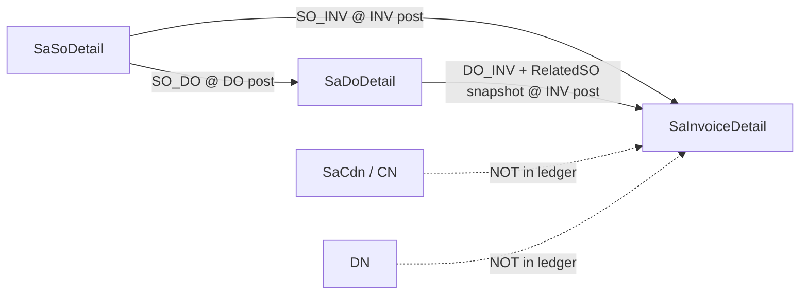

# Sales Transaction Module — Business Logic (SO / DO / INV / CN / DN)

> **Status:** Reference documentation for current `ErpWeb` (Blazor) behavior.
> **Verified against:** `ErpWeb.Core/Sales/*`, `ErpWeb.Core/Inventory/*`, `ErpWeb.UI/Sales/Transactions/*`, `ErpWeb.Model/Entities/Sales/*`.
> **Companion document:** [sales_trans_enhancement.md](sales_trans_enhancement.md) — verified defects and enhancement candidates. **This file contains no proposals; it describes what the code does today.**
> **Last reviewed:** 2026-09-10

---

## Table of contents

1. [Source of truth map](#1-source-of-truth-map)
2. [Mental model](#2-mental-model)
3. [Quantity invariants](#3-quantity-invariants)
4. [Status models](#4-status-models)
5. [Relationship matrix — who creates what](#5-relationship-matrix--who-creates-what)
6. [Saving validation](#6-saving-validation)
7. [Posting validation](#7-posting-validation)
8. [Rollback, delete, force-close](#8-rollback-delete-force-close)
9. [Concurrency and lock ordering](#9-concurrency-and-lock-ordering)
10. [Appendix](#10-appendix)

---

## 1. Source of truth map

| Concern | File |
|---|---|
| Allocation ledger (the only writer of relationships) | `ErpWeb.Core/Sales/SaDocApplicationService.cs`, `ISaDocApplication.cs` |
| Soft-reserve + remaining-qty math | `ErpWeb.Core/Sales/SaSoLineReserve.cs` |
| SO lifecycle | `ErpWeb.Core/Sales/SaSoService.cs`, `SaSoRevisionUsage.cs`, `SaSoCalc.cs` |
| DO lifecycle | `ErpWeb.Core/Sales/SaDoService.cs`, `SaDoCalc.cs` |
| INV lifecycle | `ErpWeb.Core/Sales/SaInvoiceService.cs`, `SaInvoiceCalc.cs` |
| CN/DN lifecycle | `ErpWeb.Core/Sales/SaCdnService.cs`, `SaCdnCalc.cs`, `SaCdnLockOrder.cs` |
| Shipment (SP) allocation | `ErpWeb.Core/Inventory/IvSpShipmentService.cs`, `IvSpFifoEligibility.cs`, `IvInventoryPostingService.cs` |
| Money projection (R7) | `ErpWeb.Core/Sales/SalesDocTotals.cs` |
| Allocation reconciliation / findings (E8) | `ErpWeb.Core/Sales/SaAllocationReconciliationService.cs` |
| Document-flow query (E3) | `ErpWeb.Core/Sales/SaDocFlowQuery.cs`, `ErpWeb.UI/Sales/Transactions/SaDocFlowPanel.razor` |
| CN reservation reporting (R9 / E7) | `SaCdnService.GetInvoiceReservationsAsync`, `GetReservationReportAsync`, `ErpWeb.UI/Sales/Transactions/SaCdnReservations.razor` |
| UI gates (Add from SO / Add from DO) | `ErpWeb.UI/Sales/Transactions/SaInvoice.razor.cs`, `SaDo.razor.cs`, `SaCdn.razor.cs` |
| Tests that pin the invariants | `ErpWeb.Tests/SaDocApplicationTests.cs`, `SalesCalcMatrixTests.cs`, `SalesDocTotalsTests.cs`, `SaSoRevisionUsageTests.cs` |
| Legacy behavior reference (WebForms) | `docs/cdn-logic.md`, `plans/InvoiceEntry-AppShip-AppInvoice-Logic.md` |

---

## 2. Mental model

There are **three** documents in the allocation world (`SO`, `DO`, `INV`) and **two** that sit outside it (`CN`, `DN`).



Two hard rules govern everything:

1. **`SaDocApplication` is the only author of the SO↔DO↔INV relationship and of applied quantities.** Projections (`DeliveredQty`, `InvoicedQty`, `FulfillmentStatus`, `BillingStatus`) are *derived*, never client-authored.
2. **Delivery and billing are independent.** A DO fulfils; an INV bills. You may bill without delivering (direct `SO→INV`), and you may deliver without billing (`SO→DO`, then bill later).

### 2.1 The ledger entity

`ErpWeb.Model/Entities/Sales/SaDocApplication.cs`

| Column | Notes |
|---|---|
| `Id` | `bigint` surrogate |
| `CompanyCode`, `BranchCode` | tenant scope, part of every query |
| `SourceDocType` | `SO` or `DO` |
| `SourceDocId`, `SourceCustRel`, `SourceLineId` | source identity. `SourceCustRel` is the **SO revision** for `SO` sources; `0` for `DO` sources |
| `TargetDocType` | `DO` or `INV` |
| `TargetDocId`, `TargetCustRel`, `TargetLineId` | target identity. `TargetCustRel` is **always 0** today |
| `RelatedSoNo`, `RelatedCustRel`, `RelatedSoLine` | SO lineage snapshot; populated only for `DO→INV`, left blank for a standalone DO |
| `AppliedQty` | applied quantity, rounded to 4 dp |
| `AppliedAmount` | line `NetAmount` at post time |
| `Created`, `CreatedUid` | audit |

Valid ledger shapes are therefore exactly three:
`SO→DO`, `SO→INV`, `DO→INV`. There is no `DO→SO`, no `INV→*`, and no CN/DN participation.

### 2.2 CN/DN exclusion (verified)

`SaCdnService.cs` contains **zero** references to `ISaDocApplication`, `SaSo`, or `SaDocApplication`. Consequences:

- A posted CN/DN does **not** reduce `SaInvoiceDetail`/`SaSoDetail.InvoicedQty`.
- A CN with `InvNo` does **not** reopen billing capacity on the SO.
- A CN/DN has no stock effect unless `ReturnStock = true` (see [§5](#5-relationship-matrix--who-creates-what) and [§7.3](#73-cn--dn-post--sacdnservicepostoneasync)).

---

## 3. Quantity invariants

`SaSoLineReserve.Evaluate` is the single authority. Two independent inequalities are evaluated **per SO revision line** (`SoNo`, `CustRel`, `Line`):

$$
\begin{aligned}
\text{RemainingDeliverable} &= \text{OrderQty} - \text{DeliveredQty} - \text{NewDoQty} - \text{ThisDoQty}\\
\text{RemainingBillable} &= \text{OrderQty} - \text{PostedSoInv} - \text{NewSoInvQty} - \text{LiveDoQty} - \text{ThisDoQty} - \text{ThisSoInvQty}
\end{aligned}
$$

Both must be $\ge 0$. Failure returns `ALLOC_OVER`. There is **no clamping** — the caller aborts the whole transaction.

### 3.1 Term definitions

| Term | Source query | Meaning |
|---|---|---|
| `DeliveredQty` | `SaSoDetail.DeliveredQty` (= `SO_DO` ledger) | Physically fulfilled (posted) |
| `PostedSoInv` | ledger `SO → INV` | Direct-billed (posted) |
| `NewDoQty` | `SaDoDetails ⋈ SaDos` where `Status = NEW`, SO-linked lines | Draft DO reserving **deliverable** qty |
| `LiveDoQty` | same join, `Status ∈ {NEW, POSTED, CLOSED}` | DO-path capacity that blocks **direct SO invoicing** |
| `NewSoInvQty` | `SaInvoiceDetails ⋈ SaInvoices` where `Status = NEW`, `!LinkDo`, `SoNo/SoLine` set | Draft direct invoice reserving **billable** qty |

Helper accessors:

```csharp
RemainingForNewDo(eval)    => Min(eval.RemainingDeliverable, eval.RemainingBillable)
RemainingForNewSoInv(eval) => eval.RemainingBillable
```

- The DO picker (`GetRemainingLinesAsync`) uses `RemainingForNewDo`.
- The invoice "Add from SO" picker (`GetBillableLinesAsync`) uses `RemainingForNewSoInv`.

### 3.2 Architectural insight — where reservations live

The ledger holds only **posted** applications. Draft reservations are computed **live** from `SaDoDetail` / `SaInvoiceDetail` rows joined to their headers, filtered by header status.

Consequences:

- Editing or deleting a `NEW` DO/INV releases reservation automatically — there are no compensating ledger rows to maintain.
- `DeliveredQty` and `LiveDoQty` are deliberately **not** collapsed (see the XML doc on `SaSoLineReserve`): one serves invariant A (deliverable), the other serves invariant B (billable).
- Every save/post path passes an explicit exclusion (`excludeDo` / `excludeInv`) so the document being written is not counted against itself.

### 3.3 Worked examples

Order line: `OrderQty = 100`.

| Scenario | Delivered | NewDo | LiveDo | PostedSoInv | NewSoInv | RemainingDeliverable | RemainingBillable |
|---|---|---|---|---|---|---|---|
| Fresh SO | 0 | 0 | 0 | 0 | 0 | 100 | 100 |
| Draft DO for 30 | 0 | 30 | 30 | 0 | 0 | 70 | 70 |
| That DO posted | 30 | 0 | 30 | 0 | 0 | 70 | **70** |
| Bill those 30 via LinkDo INV | 30 | 0 | 30 | 30 | 0 | 70 | 70 |
| Draft direct INV for 50 | 30 | 0 | 30 | 0 | 50 | 70 | **20** |
| Standalone-DO lines (no SO) | — | — | — | — | — | not tracked | not tracked |

Note row 3→4: `LiveDoQty` (30) blocks direct invoicing of the shipped quantity even though nothing has been billed yet. This is intentional — the shipped goods are earmarked for a LinkDo invoice.

### 3.4 Derived and legacy columns — do not treat as authoritative

| Column | Status |
|---|---|
| `SaSoDetail.ShippedQty`, `SaSoDetail.BalanceQty` | **Derived mirrors** of `DeliveredQty`, written by `SaSoCalc` (`AddShipped`/`RemoveShipped`) and `SaDocApplicationService` (`ShippedQty = delivered`, `BalanceQty = Order − delivered`). `ShippedQty` is additionally used as an **edit guard** (`SaSoService.HasShippedQty`). Treat as derived; never as the source of truth. |
| `SaSoDetail` / `SaDoDetail` / `SaInvoiceDetail` `.SoConsumedQty` | Denormalised stamp of the **source** allocation applied to that line (`SaDocApplicationService`). On a DO line it means *consumed from the SO*, **not** *consumed by invoices*. Do not use it to compute the force-close write-off remainder. |
| `SaInvoice.DoNo` | Legacy column reuse (R10.7) — `SaInvoiceService.SaveNewAsync` sets `DoNo = invNo`. **Not** a delivery-order reference. Use `SaInvoiceDetail.LinkDo` / `.DoNo` for DO linkage. |
| `SaCdn.DoNo` | Genuine-looking field that is never validated (R10.4). Do not rely on it. |

---

## 4. Status models

| Doc | Status | Meaning |
|---|---|---|
| **SO** | `NEW` / `SHIPPED` / `CLOSED` / `SUPERSEDED` | `SHIPPED` as soon as *any* line has `DeliveredQty > 0`; `CLOSED` on full delivery **and** full billing, or on force-close |
| SO closed reasons | `FULLY_CONSUMED`, `FORCE_CLOSED` | — |
| SO dual status | `FulfillmentStatus`, `BillingStatus` ∈ `NONE` / `PARTIAL` / `FULL` | `FULL` = every line ≥ `OrderQty` |
| **DO** | `NEW` / `POSTED` / `CLOSED` | `CLOSED` only via force-close |
| DO dual status | `BillingStatus` ∈ `NONE` / `PARTIAL` / `FULL` | derived from `DO→INV` ledger vs `detail.Qty` |
| **INV** | `NEW` / `POSTED` | no `CLOSED` |
| **CN/DN** | `NEW` / `POSTED` | no `CLOSED`, no `SUPERSEDED` |

### 4.1 SO revision identity

Revision key is `(SoNo, CustRel)`. At most one row per `SoNo` has `IsCurrent = true`. A revision creates a **new** row with `CustRel + 1`, copies the header/details, and marks the previous revision `SUPERSEDED` with `IsCurrent = false`.

Deleting a non-first revision (`CustRel > 1`) promotes the previous `SUPERSEDED` revision back to `IsCurrent = true` / `Status = NEW`.

### 4.2 SO detail projection formulas

`SaDocApplicationService.RecalculateAffectedLinesAsync` writes these on every ledger mutation:

```
DeliveredQty = Σ AppliedQty (Source=SO, Target=DO,  line match)
InvoicedQty  = Σ AppliedQty (Source=SO, Target=INV, line match)
             + Σ AppliedQty (Source=DO, Target=INV, RelatedSoNo/RelatedCustRel/RelatedSoLine match)
ShippedQty   = DeliveredQty                     // mirror, not an independent measure
BalanceQty   = OrderQty − DeliveredQty
```

The effective set includes `Added` entities and excludes `Deleted` entities **before** the caller's `SaveChanges`, so projections are correct inside the same transaction.

### 4.3 SO header derivation — `DeriveSoStatus`

```
if !IsCurrent or Status == SUPERSEDED          → return (no change)
if ClosedReason == FORCE_CLOSED                → Status = CLOSED, return

if Details.Count == 0
    → Status = NEW, Fulfillment = NONE, Billing = NONE, clear closed fields, return

anyDelivered = any line DeliveredQty > 0
allDelivered = all lines DeliveredQty >= OrderQty
anyInvoiced  = any line InvoicedQty  > 0
allInvoiced  = all lines InvoicedQty >= OrderQty

FulfillmentStatus = allDelivered ? FULL : anyDelivered ? PARTIAL : NONE
BillingStatus     = allInvoiced  ? FULL : anyInvoiced  ? PARTIAL : NONE

if allDelivered && allInvoiced
    → Status = CLOSED, ClosedReason = FULLY_CONSUMED, ClosedDate/By stamped, return

<clear closed fields>
Status = anyDelivered ? SHIPPED : NEW
```

### 4.4 DO billing status derivation

```
anyBilled = false; allFull = (Details.Count > 0)
for each detail:
    billed = Σ AppliedQty (Source=DO, Target=INV, SourceDocId=DoNo, SourceCustRel=0, SourceLineId=detail.Line)
    if billed > 0        → anyBilled = true
    if billed < detail.Qty → allFull = false

BillingStatus = !anyBilled ? NONE : allFull ? FULL : PARTIAL
```

Note: **all** DO details participate, including non-stock lines.

---

## 5. Relationship matrix — who creates what

| Flow | Created at | Ledger rows | `RelatedSo*` snapshot | Stock movement |
|---|---|---|---|---|
| **SO → DO** (1 SO, 1 DO) | DO **post** | `SO → DO` per SO-linked line | `= SO` identity | one SP on DO (`RefNo = DO/{doNo}`), `IvTrxTypes.SalesOut` |
| **SO → DOs** (many DOs, 1 SO) | each DO post | `SO → DO` per DO | `= SO` identity | one SP per DO |
| **SO → INV** (direct billing) | INV **post** | `SO → INV` per `!LinkDo` SO line | `= SO` identity | SP on INV (`RefNo = invNo`), `SalesOut` |
| **SO → INVs** | each INV post | `SO → INV` | `= SO` identity | one SP per INV |
| **DO → INV** (LinkDo) | INV **post** | `DO → INV`, `SourceCustRel = 0` | copied from `SaDoDetail.SoNo/SoLine/CustRel`; blank for a standalone DO | **no second SP** for LinkDo lines |
| **DOs → INV** (several DOs on one invoice) | INV **post** | one `DO → INV` row per LinkDo line | per source DO line | no SP for those lines |
| **CN × INV** | CN post (AR only) | none | none | none, unless `ReturnStock` |
| **CN, no INV** | CN post | none | none | none, unless `ReturnStock` |
| **DN** | DN post | none | none | never (`ReturnStock` forced false) |

### 5.1 Structural constraints inside `AllocateAsync`

| Constraint | Code | Error |
|---|---|---|
| `AppliedQty > 0` | per-line pre-check | `ALLOC_INVALID_QTY` |
| One source line → one target line | in-memory `targetLineOwners` + DB `AnyAsync` | `ALLOC_MERGE_FORBIDDEN` |
| One target line ← one source line | DB `AnyAsync` on `(TargetDocType, TargetDocId, TargetLineId)` | `ALLOC_MERGE_FORBIDDEN` |
| No duplicate `(Source, SourceLine, Target, TargetLine)` | DB `AnyAsync` | `ALLOC_DUPLICATE` |
| Max 20 distinct SO headers per document | `SaSoLimits.MaxDistinctSoHeaders = 20` | `ALLOC_TOO_MANY_HEADERS` |

The whole insert is wrapped in a `try { ... } catch (DbUpdateException) { return Fail(ALLOC_DUPLICATE) }` so a unique-key race degrades to a clean error rather than a 500.

### 5.2 Source gates re-validated under lock at allocation time

| Source | Gate |
|---|---|
| SO | exists; not `CLOSED` (`ALLOC_CLOSED`); not `FORCE_CLOSED` (`ALLOC_FORCE_CLOSED`); `SO.CustCode == line.CustCode` (`ALLOC_CUSTOMER_MISMATCH`); SO line exists (`ALLOC_NOT_FOUND`); UOM equal (`ALLOC_UOM_MISMATCH`); currency equal (`ALLOC_CURRENCY_MISMATCH`) |
| DO | exists; not `CLOSED`; **is `POSTED`**; `DO.CustCode == line.CustCode`; DO line exists; `Σ billed + applied ≤ doDetail.Qty` (`ALLOC_OVER`) |
| Related SO (on `DO→INV`) | exists; not closed/force-closed; customer match; line exists; UOM match; `Σ billed + applied ≤ soDetail.OrderQty` |

---

## 6. Saving validation

### 6.1 Sales Order — `SaSoService.PrepareLinesAsync`

| Check | Rule |
|---|---|
| Header | Customer required, exists, active; SO date required; `PayCode` required **and** must exist in `IvMsCodes(CodeType = PayCode)`; currency required **and** active in `SaCurrency` |
| Tax | Tax group required when `customer.Taxable`; must exist in `SaTaxGroup` |
| Tax type | All lines must share `IsInclusive` → `ST000032` |
| Line item | `ICode` required, item exists + active; `OrderQty > 0`; `StdQty = OrderQty × StdPackSize ≠ 0` |
| Warehouse | validated against active warehouse list when provided |
| Discounts | `ValidateLineDiscount` per customer `DiscountMethod` (`JOIN` / `SPLIT`) |
| **Qty floor (edit)** | `OrderQty ≥ max(DeliveredQty, InvoicedQty, ShippedQty)` on an existing line |
| Line numbers | duplicate existing `Line` numbers rejected |

**Update guards** (`UpdateAsync`): only `NEW` or `SHIPPED` editable; customer immutable once `SHIPPED`; **allocated lines cannot be deleted** (any of `DeliveredQty` / `InvoicedQty` / `ShippedQty > 0`); row-version required.

**Delete / Revise guards:** only `NEW`; must pass `CheckRevisionUnusedAsync`, which blocks on any of:

| Flag | Source |
|---|---|
| `HasDeliveredQty` / `HasInvoicedQty` / `HasShippedQty` | non-zero `SaSoDetail` columns |
| `HasAllocation` | ledger `SO` source **or** `DO→INV` with matching `RelatedSoNo`/`RelatedCustRel` |
| `HasDraftDeliveryOrder` | `SaDoDetails ⋈ SaDos` with `Status = NEW` |
| `HasDraftInvoice` | `SaInvoiceDetails ⋈ SaInvoices` with `Status = NEW` |
| `HasDeliveryOrderReference` / `HasInvoiceReference` | any DO / INV detail row referencing this revision |

Messages are differentiated: "…a draft Delivery Order is holding quantity on the current revision", "…a draft Invoice is holding quantity on the current revision", else "…already in use".

### 6.2 Delivery Order — `SaDoService.PrepareLinesAsync`

Same header / item / tax / discount / warehouse set as SO, plus:

| Check | Rule |
|---|---|
| `LinkDo` | **rejected on DO lines** → `SO_LINKDO_NOT_SUPPORTED` |
| Packs | `StdPsize = item.StdPackSize` (defaults to `1`); `StdQty = Qty × StdPsize` |
| Warehouse | required when `item.StockControl`; resolved as `line.FrWarehouse ?? item.DefWarehouse ?? first active warehouse` |
| SO lineage | SO must exist (locked); `CustRel` must equal the **current** revision else `SO_REVISED` ("Sales Order was revised. Reload."); `SO.CustCode == header.CustCode`; SO not `CLOSED`; SO line exists with matching `CustRel`; `SellingUom` copied from the SO line |
| Reserve | `ValidateDoSoReserveAsync` enforces both invariants per SO line, excluding the DO being edited (`excludeDoNo`) |

**Update guards:** only `NEW`; row-version required; **allocated lines cannot be deleted** (`HasAllocationForDoLineAsync`); **SO lineage is frozen** while allocations exist (`SoNo`, `SoLine`, `CustRel` immutable); `Qty ≥ SumDoInvoicedQtyAsync(doNo, line)`; customer immutable when any SO reference exists (existing or requested).

### 6.3 Invoice — `SaInvoiceService.PrepareLinesAsync`

Header / item / tax / warehouse as above, plus:

| Rule | Detail |
|---|---|
| Duplicate LinkDo line | same `DoNo + DoLine` twice on one invoice → `ALLOC_DUPLICATE` |
| LinkDo source | DO must exist, be **POSTED**, same customer, same currency, line must exist |
| SO identity on LinkDo | copied from `SaDoDetail.SoNo/SoLine/CustRel`; if the DO line has no SO → line becomes a **standalone billed line** (`SoNo = ""`, `RelatedSo* = 0`) |
| Direct SO line | SO exists, customer matches, not `CLOSED`, line exists, **UOM must equal item `SellingUom`** |
| **Mix rule** | LinkDo + direct-SO on one invoice → `ALLOC_MIX_FORBIDDEN`. Plain non-SO lines *may* coexist with LinkDo lines. |
| Reserve | `ValidateInvoiceSoReserveAsync` — billable invariant |

**Update guards:** only `NEW`; row-version required; customer immutable when any SO reference exists.

### 6.4 Invoice — commercial readiness (enforced on **save** and **post**)

`ValidateCommercialReadinessAsync` blocks unless **all** of the following hold:

| Field | Requirement | Reason code |
|---|---|---|
| `SalesmanCode` | exists in `SaSalesRep` and is active | `POST_SALESMAN_INVALID` |
| `DueDate` | not null | `POST_DUE_DATE_MISSING` |
| `ArGlCode` | not blank | `POST_AR_GL_MISSING` |
| Tax GL | if `HasTax(Taxes)` (ε = 0.01), `SaTaxGroup.TaxGlCode` required | `POST_TAX_GL_MISSING` |
| `InvName`, `InvAddress1`, `InvCity`, `InvPostalCode`, `InvCountry` | all required | `POST_BUYER_ADDRESS` |
| `InvTel` **or** `InvEmail` | at least one | `POST_BUYER_CONTACT` |
| `BuyerTin` **or** `BuyerBrn` | at least one | `POST_BUYER_ID` |
| Per line `SellingGlCode` | required unless free-line with `Amount = 0` | `POST_LINE_SALES_GL_MISSING` |
| Per line `Classification` | required unless free-line | `POST_LINE_CLASSIFICATION` |

This is materially stricter than DO save: an invoice can be **saved** only when it is already e-invoice ready. Header lengths are also validated up front (`ValidateHeaderLengths`).

### 6.5 CN / DN — `SaCdnService.PrepareLinesAsync`

| Rule | Detail |
|---|---|
| Type | `CN` or `DN` only |
| `DN` | `ReturnStock` **force-set false**; `InvNo` force-nulled |
| Header | Customer required + active; currency required + active; doc date |
| Tax | line tax group → header tax group → item `TaxGroup` fallback |
| Line | item required + active; `Qty > 0`; `StdQty = Qty × StdPackSize` (or `Qty` when no pack) |
| `ReturnStock` gates | per **stock** line: `Qty > 0`, `StdQty > 0`, **`FrWarehouse` required** |
| Item GL | max 20 chars; falls back to `IvMaster.SellingGlCode` |
| Stock fields | `FrWarehouse` / `LocCode` / `IStatus` / `LotNo` / `ExpiryDate` persisted **only** when `ReturnStock && item.StockControl` |

Then, for a **CN with `InvNo`**:

- the invoice is locked, must exist, be **POSTED**, belong to the same tenant;
- the cap is:

$$
\text{CN.TotAmnt} \le \text{INV.TotAmnt} - \sum \text{TotAmnt}\big(\text{other CNs for that invoice with status} \in \{NEW, POSTED\}\big)
$$

implemented by `SaCdnCalc.EvaluateRemaining`. A **negative** invoice remaining is itself an error ("legacy over-credit").

CN save also runs a reduced `ValidateCommercialReadinessAsync`: active salesman, tax GL when taxed, per-line `ItemGlCode` when `Amount ≠ 0`. It does **not** require billing address or buyer TIN (unlike the invoice).

---

## 7. Posting validation

### 7.1 DO post — `SaDoService.PostOneAsync`

```mermaid
sequenceDiagram
  participant U as Caller
  participant S as SaDoService
  participant L as SaDocApplication
  participant SP as SP shipment
  U->>S: PostAsync(DO keys, rowVersion)
  S->>S: lock DO; status must be NEW; rowver; load details; details > 0
  S->>L: AllocateSOToDOAsync(SO-linked lines only)
  L->>L: lock DOs then SOs; validate caps per line; insert ledger; recalc
  S->>S: stockLines = StockControl && StdQty > 0
  alt stockLines.Count > 0
    S->>SP: batch RefNo = DO/{doNo} must exist, TrxDate == doDate
    S->>SP: lock BalLoc slice-ordered; ValidateShipmentForPost
    S->>SP: PostStockOutInTransaction(SalesOut)
  end
  S->>S: Status = POSTED (PostedDate/By)
```

Post reasons: `POST_CONCURRENCY`, `POST_NO_LINES`, `POST_SP_MISSING` ("Add shipment before posting."), `POST_DATE_MISMATCH` ("Shipment date does not match DO date. Please re-add shipment."), `POST_SP_INCOMPLETE`. Allocation failures surface the `ALLOC_*` code.

Notes:

- A **standalone DO** (no SO lines) passes through `AllocateAsync` with zero rows (early `Ok`) and posts normally.
- `ApplyAllocatedQuantities` stamps `SaDoDetail.SoConsumedQty` from the allocation result.
- Stock capture uses `batch.BatchNo`; the SP `RefNo` is `DO/{doNo}`.

### 7.2 Invoice post — `SaInvoiceService.PostOneAsync`

1. Lock invoice, status must be `NEW`, row-version check, load details.
2. **`ValidateCommercialReadinessAsync`** — the full AR / e-invoice gate ([§6.4](#64-invoice--commercial-readiness-enforced-on-save-and-post)).
3. **`AllocateInvoiceLinesAsync`**:
   - direct-SO lines (`!LinkDo` with `SoNo` + `SoLine`) → `AllocateSOToInvoiceAsync`
   - LinkDo lines → `AllocateDOToInvoiceAsync` (requires `DoNo` + `DoLine` per row)
   - both present → `ALLOC_MIX_FORBIDDEN`
   - then stamps `SaInvoiceDetail.SoConsumedQty` from the result
4. `stockLines = !LinkDo && StockControl && StdQty > 0`. **If any:**
   - SP batch keyed `RefNo = invNo` (no prefix) is mandatory
   - `batch.TrxDtTime.Date` must equal `InvDate` ("Some shipment date is not updated, please add shipment.")
   - BalLoc rows locked in `IvStockSliceKey` order then `Id`
   - `ValidateShipmentForPostAsync` completeness check
   - `PostStockOutInTransactionAsync(SalesOut)`
5. `Status = POSTED` (+ `PostedDate` / `PostedBy`).

**DO→INV allocation re-validation, under lock:** DO exists, not `CLOSED`, **is `POSTED`**, customer match, currency match, and `Σ billed + applied ≤ doDetail.Qty`; plus, when the DO line has SO lineage, `Σ billed + applied ≤ soDetail.OrderQty` where `Σ` includes `SO→INV` + all `DO→INV` rows reaching that SO line + in-flight pending rows.

### 7.3 CN / DN post — `SaCdnService.PostOneAsync`

Lock order is canonicalised as **Invoice → CN** (`SaCdnLockOrder`); the `InvNo` is *peeked* without `UPDLOCK` first, then Invoice is locked, then CN. Then CR batch, then BalLoc.

1. Status must be `NEW` (`POSTED` → `CDN_STATUS` "already POSTED").
2. **CN with `InvNo`:** re-run the remaining-cap check under the invoice lock.
3. `ValidateCommercialReadinessAsync` re-run.
4. **`ReturnStock == false`:**
   - delete any leftover `NEW` CR batch;
   - if a **POSTED** CR batch exists → hard fail `CDN_CR_ORPHAN` ("Unexpected POSTED CR batch exists. Contact administrator.")
5. **`ReturnStock == true`** with stock lines:

| Batch state | Action |
|---|---|
| none | allocate from `RunningNumberKeys.IvBatch`; `TrxType = IvTrxTypes.CustomerReturn`; `RefNo = CN/{docNo}`; build details (`ToWarehouse = FrWarehouse` — goods return **into** stock); store `SourceFingerprint`; persist; then post stock **IN** |
| `NEW` | replace all details, recompute fingerprint, then post |
| `POSTED`, fingerprint **matches** | reuse — `goto SetPosted`, **no second stock post** |
| `POSTED`, fingerprint mismatch | `CDN_FP_MISMATCH` ("CN stock lines changed since last post. Rollback the CR batch first.") |
| `POSTED`, fingerprint missing/invalid | `CDN_FP_MISSING` |

6. `Status = POSTED`.

Fingerprint (`SaCdnCalc.ComputeSourceFingerprint`) is SHA-256 over stock lines: `Line`, `ICode`, `FrWarehouse`, `LocCode`, `IStatus`, `LotNo`, `ExpiryDate`, `StdQty`, `StdUom`, `StockControl`. **The field list must stay synchronised with every inventory-affecting field.**

### 7.4 The four CN cases

| Case | Cap check | Stock | Notes |
|---|---|---|---|
| **CN with INV, no stock return** | yes — invoice total − other CNs | none | pure financial credit note |
| **CN with INV, with stock return** | yes | CR batch: `CustomerReturn` stock **IN** to the line's `FrWarehouse`/`LocCode`/`LotNo`/`IStatus`/`Expiry` | returned goods re-enter stock |
| **CN without INV** | **no** | optional (`ReturnStock` honoured) | free-standing credit; can exceed any single invoice's value |
| **DN (always)** | no | never | `ReturnStock` and `InvNo` structurally removed |

---

## 8. Rollback, delete, force-close

| Action | Guards | Effect (one transaction, in order) |
|---|---|---|
| **DO rollback** | only `POSTED`; row-version | `ReverseDocumentAllocationsAsync(DO)` → zero `SaDoDetail.SoConsumedQty` → roll back SP stock if batch is `POSTED` → `Status = NEW`, `RollbackDate/By`. **SP batch is retained**, stock is reversed. |
| **INV rollback** | only `POSTED`; **no dependent credit note** (R5: a `POSTED` CN is a hard block, a `NEW` draft is named) | same shape: reverse allocations → zero `SaInvoiceDetail.SoConsumedQty` → reverse SP stock → `Status = NEW`. |
| **CN/DN rollback** | only `POSTED` | reverse CR stock if batch is `POSTED` → `Status = NEW`. If stock rollback fails, the CN stays `POSTED` (atomic abort). |
| **DO force-close** | only `POSTED`; row-version; not already force-closed | `CLOSED`; **SP batch + details are retained** (R4) and stamped with `ForceCloseDate` / `ForceCloseBy` / `ForceCloseReason` — `BatchStatus` stays `POSTED` and the stamp is the tombstone; **stock NOT reversed**; **the unallocated remainder is written off onto the SO line** (R3, see §8.2). Once committed the close is irreversible (no reopen, no undo). |
| **SO force-close** | not already `CLOSED`; max 3 selection | `CLOSED` + `FORCE_CLOSED` + `ClosedDate/By`. |
| **SO reverse-allocation** | `ReverseDocumentAllocationsAsync` refuses when the SO is `FORCE_CLOSED` (`SO_FORCE_CLOSED`) | blocks rolling back a DO/INV whose SO was force-closed — deliberate |
| **SO delete** | `NEW` + `CheckRevisionUnusedAsync`; row-version | removes header + details; if `CustRel > 1`, promotes the previous revision back to current/`NEW` |
| **DO delete** | `NEW`; row-version | releases SP reservation (`removeBatch: true`), removes header + details |
| **INV delete** | `NEW`; **row-version required** (R8); no dependent CN (R5) | releases SP reservation, removes header + details |
| **CN delete** | `NEW`; row-version | `POSTED` CR batch blocks delete (`BusinessRule`); a `NEW` CR batch is deleted first; removes header + details |

### 8.1 Allocation reversal mechanics

`ReverseDocumentAllocationsAsync(targetDocType, targetDocId)`:

1. Load all ledger rows for `(Company, Branch, TargetDocType, TargetDocId)`; zero rows → `Ok` (idempotent).
2. Collect affected keys: `SourceDocId` where `SourceDocType = SO`; `SourceDocId` where `SourceDocType = DO`; plus every `RelatedSoNo`; plus the DO itself when `targetDocType = DO`.
3. **Lock each affected SO (sorted) and refuse if any is `FORCE_CLOSED`** → `SO_FORCE_CLOSED`.
4. `RemoveRange(rows)` then `RecalculateAffectedLinesAsync` — which rebuilds projections from the *effective* ledger (DB rows minus `Deleted`, plus `Added`) before `SaveChanges`.

### 8.2 Force-close write-off — `WrittenOffQty` (R3)

A DO force-close is a **write-off**: the quantity that was shipped but will never be billed is declared
non-billable on the SO line, and the SO becomes terminal instead of permanently stranded.

**Quantity** (for each `SaDoDetail` line $l$ with a non-empty `SoNo` and `SoLine > 0`):

$$
W_l = \max\Bigl(0,\; Q_l - \sum_{a \,\in\, \text{posted DO}{\to}\text{INV for } l} a.\text{AppliedQty}\Bigr)
$$

- **Partial billing is the normal case.** `SO=100 / DO=100 / INV=60` → `WrittenOffQty = 40`. Allowed.
- A line with $W_l = 0$ (fully invoiced) contributes nothing and does not block the close.
- A standalone DO line (`SoNo` empty) contributes nothing to any SO.
- `SaSoDetail.WrittenOffQty` is **additive** — a second force-closed DO accrues further write-off.
- Lineage is the **CLOSED DO** plus the retained SP-batch stamp. There is no separate write-off ledger.

**Lock protocol (D13/D14, §5.5).** Global lock order is **DO → SO**, matching `AllocateAsync`.
`ForceCloseOneAsync` locks the DO, derives the SO set from the locked DO details, locks those SO
headers (sorted by `SaSoLockOrder.Comparer`), then reads and increments `WrittenOffQty` under those
locks. The write-off is committed in the **same transaction** as the status flip: force-close is
irreversible (D8), so there is no compensating path.

**`LiveDoQty` still includes CLOSED DOs by design.** A force-closed DO's whole quantity continues to
block direct SO invoicing — the write-off is *not* additionally subtracted from `RemainingBillable`,
which would double-count. The remainder of the shut-out quantity can only be billed through another DO.

**Accounting identity (§3.3).** For a settled projection (`ThisDoQty = ThisSoInvQty = 0`):

$$
\text{InvoicedQty} + \text{WrittenOffQty} + \text{PostedDoOpenQty} + \text{NewDoQty} + \text{NewSoInvQty} + \text{RemainingBillable} = \text{OrderQty}
$$

where `PostedDoOpenQty = Σ_{POSTED DO lines} Qty − Σ_{DO→INV from POSTED DOs} AppliedQty`.
`SaSoLineReserve.EvaluateResult.BillableIdentityHolds` asserts this.

**Status.** `SaDualStatuses.WrittenOff` is reported when every line is billing-terminal
(`InvoicedQty + WrittenOffQty >= OrderQty`) and at least one line was written off; the SO auto-closes
to `FullyConsumed` once every line is also delivered.

**Revision (D15).** A revision rebuilds fresh `SaSoDetail` rows via `AddDetails` and would silently
drop `WrittenOffQty`, so `SaSoRevisionUsage.HasWrittenOffQty` blocks revise and delete. In practice a
write-off can only arise from a posted DO, which already makes the SO non-`NEW`, so the status gate
catches it first — the usage guard is defence in depth.

**Not revenue.** `WrittenOffQty` must never be counted as revenue; written-off units become bad debt.
`InvoicedQty` remains the *historic quantity ever invoiced* (D5) and is never reduced by a credit note,
a rollback-after-post, or a write-off — net revenue is not derivable from it (that is AR, E5).

---

## 9. Concurrency and lock ordering

- Every mutation opens its own `AppDbContext` + explicit transaction. **The caller owns the transaction**; `ISaDocApplication` only participates (it never calls `SaveChanges`/`Commit`).
- Canonical lock order inside allocation: **discover all keys first** → lock DOs (sorted `SaSoLockOrder.Comparer`, `OrdinalIgnoreCase`) → lock SOs (sorted) → `SUM` → validate → insert → recalc.
- **Inventory posting must never acquire Invoice/CN locks** (`SaCdnLockOrder` doc comment).
- CN path: peek `InvNo` → lock Invoice → lock CN → lock CR batch → lock BalLoc.
- BalLoc rows are locked in `IvStockSliceKey` order, then `Id`, to avoid deadlocks.
- Deadlocks (`SqlException 1205`) and unique violations are translated to friendly retry messages on every mutation path.
- Batch operations stop on first failure and mark the remainder `NotAttempted`.
- Optimistic concurrency is `RowVersion` (`byte[]`); `TouchRowVersion` regenerates it manually on non-SQL-Server providers.
- On SQL Server, `RowVersion` is the real `rowversion` column and EF's `OriginalValue` is set explicitly to catch stale writers.

### 9.1 Batch size limits

| Operation | Limit | Constant |
|---|---|---|
| SO force-close | 3 | `SaSoLimits.MaxForceCloseSelection` |
| DO post / rollback / force-close | 3 | `SaDoLimits.MaxPostSelection` |
| INV post / rollback | 3 | `SaInvoiceLimits.MaxPostSelection` |
| CN/DN post / rollback | 3 | `SaCdnLimits.MaxPostSelection` |
| IV posting | 10 | `IvPostingLimits.MaxPostSelection` |
| Distinct SO headers per document | 20 | `SaSoLimits.MaxDistinctSoHeaders` |
| SO revisions per `SoNo` | 32 767 | `SaSoRevisionLimits.MaxCustRel` |

---

## 10. Appendix

### 10.1 Allocation reason codes — `SaDocAllocationReasonCodes`

| Constant | Value | Emitted when |
|---|---|---|
| `NotFound` | `ALLOC_NOT_FOUND` | DO / SO / line not found |
| `Closed` | `ALLOC_CLOSED` | source SO or DO is `CLOSED`, or DO is not `POSTED` |
| `ForceClosed` | `ALLOC_FORCE_CLOSED` | SO or DO is force-closed |
| `OverAllocate` | `ALLOC_OVER` | either invariant would go negative |
| `UomMismatch` | `ALLOC_UOM_MISMATCH` | source/target selling UOM differ |
| `CustomerMismatch` | `ALLOC_CUSTOMER_MISMATCH` | source customer ≠ document customer |
| `CurrencyMismatch` | `ALLOC_CURRENCY_MISMATCH` | source currency ≠ document currency |
| `StandaloneDo` | `ALLOC_STANDALONE_DO` | **retired** — blank `RelatedSo` is valid for `DO_INV`; kept for docs/tests |
| `Duplicate` | `ALLOC_DUPLICATE` | duplicate source→target line pair |
| `MergeForbidden` | `ALLOC_MERGE_FORBIDDEN` | many-to-one or one-to-many line mapping |
| `InvalidQty` | `ALLOC_INVALID_QTY` | `AppliedQty ≤ 0` |
| `MixForbidden` | `ALLOC_MIX_FORBIDDEN` | LinkDo + direct-SO on one invoice |
| `TooManyHeaders` | `ALLOC_TOO_MANY_HEADERS` | > 20 distinct SO headers |
| `LineageFrozen` | `ALLOC_LINEAGE_FROZEN` | reserved for frozen-lineage edits |

### 10.2 SO reason codes — `SaSoReasonCodes`

`SO_CONCURRENCY`, `SO_NOT_FOUND`, `SO_CLOSED`, `SO_FORCE_CLOSED`, `SO_OVER_CONSUME`, `SO_TOO_MANY_HEADERS`, `SO_LINKDO_NOT_SUPPORTED`, `SO_ROLLBACK_NO_CONSUME`, `SO_SUPERSEDED`, `SO_REVISED`, `SO_REVISION_LIMIT`, `SO_HAS_RESERVE`, `SO_HAS_DOCUMENT`, `SO_HAS_CONSUMPTION`.

Fixed messages: `SO_TOO_MANY_HEADERS` → "This document cannot reference more than 20 Sales Orders."; `SO_REVISED` → "Sales Order was revised. Reload."; `SO_SUPERSEDED` → "This Sales Order revision is historical and cannot be changed."

### 10.3 DO post codes — `SaDoPostReasonCodes`

`POST_CONCURRENCY`, `POST_NO_LINES`, `POST_SP_MISSING`, `POST_DATE_MISMATCH`, `POST_SP_INCOMPLETE`.

### 10.4 Invoice post codes — `SaInvoicePostReasonCodes`

`POST_CONCURRENCY`, `POST_SALESMAN_INVALID`, `POST_DUE_DATE_MISSING`, `POST_AR_GL_MISSING`, `POST_TAX_GL_MISSING`, `POST_BUYER_ADDRESS`, `POST_BUYER_CONTACT`, `POST_BUYER_ID`, `POST_LINE_SALES_GL_MISSING`, `POST_LINE_CLASSIFICATION`.

### 10.5 CN/DN codes — `SaCdnReasonCodes`

`CDN_CONCURRENCY`, `CDN_STATUS`, `CDN_REMAINING`, `CDN_FP_MISMATCH`, `CDN_FP_MISSING`, `CDN_CR_ORPHAN`.

### 10.6 SP reference conventions

| Document | `IvTrxBatch.RefNo` | `IvTrxTypes` on post |
|---|---|---|
| DO | `DO/{doNo}` | `SalesOut` |
| INV | `{invNo}` (no prefix) | `SalesOut` |
| CN (stock return) | `CN/{docNo}` | `CustomerReturn` |

`SaDoSpRefs.Prefix = "DO/"`, `SaCdnSpRefs.Prefix = "CN/"`. The invoice uses the bare number — asymmetric by design, and the SP service comments note the DO variant explicitly.

### 10.7 Rounding and money rules — `SaInvoiceCalc` / `IvQty` / `SaSoQty`

| Rule | Value |
|---|---|
| Quantity scale | 4 dp, `MidpointRounding.AwayFromZero` (`IvQty.Scale = 4`, `SaSoQty.RoundQty`) |
| Money scale | 2 dp, `AwayFromZero`; **0 dp** when `SaCust.DecPoint = true` |
| Tax scale | `TaxDecimalPlaces = 2` |
| Tax presence test | `Math.Abs(taxes) >= 0.01` (`TaxEpsilon`) |
| Line `Amount` | `Money(Qty × UnitPrice)` — list amount, before discount |
| Line `NetAmount` | `Amount − discount` (discount is tax-stripped when `IsInclusive`) |
| Line `TaxAmt` (exclusive) | `Money(NetAmount × taxPercent / 100)` |
| Line `TaxAmt` (inclusive) | `Money((UnitPrice − discountPerUnit) × Qty) − NetAmount` |
| Cumulative tax rounding | `ApplyTaxAdaptiveRounding` — running-rounded vs running-unrounded so line taxes sum to the header tax |
| Home currency constant | `SaInvoiceCalc.HomeCurrency = "MYR"` |
| Non-home rate rule | a rate of exactly `1` is rejected for non-home currency |
| Rate source | `SaCurrRate` for the document date; stored on the document (`CurrRate`), not re-read at post |

> **Fixed by R2 (Phase 1):** tax-inclusive lines are now un-taxed. The entered unit price includes tax,
> so `exclusiveUnitPrice = UnitPrice / (1 + t)` and `exclusiveDiscountPerUnit = discountPerUnit / (1 + t)`;
> `Amount`, `NetAmount` and `TaxAmt` are all ex-tax, with `TaxAmt = inclusiveLineTotal − NetAmount` so
> that `NetAmount + TaxAmt` preserves the tax-inclusive line total exactly. `HasTax` therefore engages
> the tax-GL gate for inclusive documents. Before R2, `TaxAmt` evaluated to `0` with no discount and to a
> negative value with one — historical documents created before the fix keep that inaccuracy (D12:
> fix forward only, no backfill). See `sales_trans_enhancement.md` → R2 and §9 of the plan.

### 10.8 Header total composition (as implemented)

| Document | `GrossAmnt` | `Taxes` | `TotAmnt` |
|---|---|---|---|
| DO | `CalculateHeader.GrossAmnt` → **ex-tax** | `CalculateHeader.Taxes` | `GrossAmnt + Taxes` → **inc-tax** |
| INV / CN / DN / SO | `CalculateHeader.GrossAmnt` → **ex-tax** | `CalculateHeader.Taxes` | `GrossAmnt + Taxes` → **inc-tax** |

All four document kinds now share `SaInvoiceCalc.CalculateHeader` (R7). Before R7 the DO hand-rolled
`Σ Amount` / `Σ TaxAmt` / `Σ NetAmount`, so its `TotAmnt` was ex-tax and disagreed with every other
document. Use **`SalesDocTotals`** (`FromInvoiceLike` / `FromDeliveryOrder` / `FromLines`) whenever a
totals split is needed — do not re-derive it ad hoc.

Also updated by R2: `Amount` on an inclusive line is now the **pre-discount ex-tax list amount**
(`qty × UnitPrice / (1 + t)`), not the tax-inclusive amount. Column captions that read "Amount" on a
totals context have been renamed to "Total (incl. tax)" so the two are not confused.

---

## 11. Diagnostics and reporting (read-only)

Three surfaces exist purely to explain the allocation state. **None of them mutates anything** and all
three are safe to open at any time.

### 11.1 CN reservations — R9 indicator and E7 report

> **Full purpose, worked examples and troubleshooting:** [CreditNoteReservations.md](CreditNoteReservations.md).

A posted invoice's remaining balance can be held by other credit notes before they are posted. This is
*draft soft reservation*, live-queried from `SaCdn` (`Status ∈ {NEW, POSTED}`):

- **Save / update / post** all evaluate `CDN_REMAINING` (`SaCdnCalc.EvaluateRemaining`) under the
  invoice lock. When a draft holds part of the balance the error names it:
  `Credit note total X exceeds invoice remaining Y. Reserved by draft CN(s) CN0001, CN0002.`
  The text comes from `SaCdnCalc.FormatDraftReservation`, shared with the UI so they cannot drift.
- **Indicator.** `SaCdnService.GetInvoiceReservationsAsync(invNo)` returns the split (invoice total,
  posted CN total, draft CN total, remaining) plus the draft numbers; `SaCdn.razor` shows
  `Reserved by draft CN(s) … Remaining …` beside the Invoice field. Advisory only — the authoritative
  gate remains `CDN_REMAINING`.
- **Report.** `SaCdnService.GetReservationReportAsync` and the report-only screen at
  `/sales/cn-reservations` (`SA_CN_RESERVATIONS`) list posted invoices whose balance is held, flagging
  over-reserved rows. Filters: customer code, drafts only, over-reserved only. Never locks, never writes.

### 11.2 Allocation reconciliation — E8

`ISaAllocationReconciliationService.ReconcileAsync(soNo)` walks every current SO line and reports
findings with `Code` / `Severity` / `SoNo` / `SoLine` / `DoNo` / `InvNo` / `Expected` / `Actual` /
`Explanation`:

| Code | Severity | Meaning |
|---|---|---|
| `OVER_DELIVERED` | ERROR | posted `SO → DO` allocation exceeds `OrderQty` |
| `OVER_BILLED` | ERROR | posted `SO → INV` + `DO → INV` allocation exceeds `OrderQty` |
| `ALLOCATION_MISMATCH` | ERROR | persisted projections disagree with the ledger |
| `BILLABLE_IDENTITY_MISMATCH` | ERROR | the §3.3 identity did not reconcile (I9) |
| `STRANDED_LINE` | WARNING | billing-terminal in no sense and nothing in flight can move the line |
| `WRITTEN_OFF_QTY_MISMATCH` | WARNING | `WrittenOffQty` ≠ force-closed DO contributions (§5.6) |
| `WRITTEN_OFF_NO_AUDIT` | WARNING | `WrittenOffQty > 0` with no CLOSED DO / batch stamp as origin |

`WRITTEN_OFF_NO_AUDIT` invalidates the mismatch comparison, so it is reported first. A line merely
reserved by a draft DO is **not** stranded — posting that DO still moves it.

### 11.3 Document flow — E3

`ISaDocFlowQuery.QueryAsync(docType, docNo)` walks one hop in each direction:

- **Upstream** — ledger rows where the document is the *target*, plus, for a CN, its `SaCdn.InvNo` /
  `SaCdn.DoNo` references (CNs are not ledger documents).
- **Downstream** — ledger rows where the document is the *source*, plus, for an invoice, the CNs that
  reference it.

Nodes carry date/status (enriched with three batched header lookups) and a human-readable edge label
(`SO → DO`, `INV → CN (POSTED)`). Rendered by the shared `SaDocFlowPanel.razor`, embedded on the SO,
DO, INV and CN entry screens. The panel is supporting information: on failure it renders nothing
rather than breaking the document screen.

See `sales_trans_enhancement.md` → R7 for the cross-module impact.

### 10.9 Test anchors

`ErpWeb.Tests/SaDocApplicationTests.cs`:

| Test | Pins |
|---|---|
| `SO_DO_exact_and_over_qty_and_split` | deliverable cap, over-allocate rejection, split across DOs |
| `SO_INV_and_DO_INV_caps_and_cross_path` | direct vs DO-path billing caps |
| `Soft_reserve_DO_edit_exclude_and_NEW_to_POSTED` | exclusion of the edited DO; draft → posted transition |
| `Soft_reserve_multi_detail_same_SO_line_and_draft_invoice_blocks_DO` | multiple DO details on one SO line; draft INV blocks DO |
| `Soft_reserve_force_closed_DO_and_rollback_and_tenant_exclude` | force-closed DO behaviour; rollback; tenant scoping |
| `Standalone_DO_LinkDo_invoice_posts_and_Uom_mismatch_fails` | standalone DO → LinkDo invoice; UOM gate |
| `Mixed_DO_SO_and_standalone_lines_invoice_updates_SO_only_for_bound` | mixed invoice lineage handling |
| `Mixed_DO_partial_billing_across_two_invoices` | partial billing of one DO across invoices |
| `Standalone_DO_partial_bill_and_over_allocate` | standalone billing caps |
| `Combined_SO_INV_and_DO_INV_cap_and_multi_DO_same_SO` | combined caps, multi-DO |
| `Add_item_plus_standalone_DO_allowed_and_duplicate_DoLine_rejected` | allowed mixing; duplicate `DoLine` rejection |
| `NEW_DO_absent_from_picker_CLOSED_DO_cannot_DO_INV` | picker eligibility by DO status |
| `Rollback_standalone_LinkDo_clears_allocation_stock_stays_out` | rollback semantics |
| `OrderQty_floor_and_delete_allocated_SO_fail` | SO OrderQty floor; allocated-line delete guard |
| `Invoice_rollback_restores_projections_and_statuses` | projection restoration |
| `Authz_denies_post_without_permission` | permission gating |
