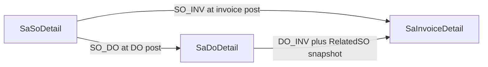

# SO / DO / INV Allocation and Shipment Documentation

## Deliverable

Create one reference doc at [`plans/so_do_inv_allocation_and_shipment.md`](plans/so_do_inv_allocation_and_shipment.md).

This documents **current ErpWeb (Blazor) behavior**, not WebForms. Cross-link older notes ([`plans/ERP-DO-logic.md`](plans/ERP-DO-logic.md), [`plans/shared_sp_shipment.md`](plans/shared_sp_shipment.md)) only as historical context; the new file is the source of truth for the allocation rewrite.

Do **not** edit the Cursor plan file `so_do_invoice_allocations_b5d3c347.plan.md`.

## Document outline (write these sections in full)

### 1. Purpose and mental model
- Delivery and billing are independent.
- `SaDocApplication` is the only author of relationships + applied qty.
- Projections (`DeliveredQty` / `InvoicedQty` / dual statuses) are derived, never client-authored.

### 2. Domain vocabulary
- Doc types: `SO` / `DO` / `INV` ([`ISaDocApplication.cs`](ErpWeb.Core/Sales/ISaDocApplication.cs))
- Dual statuses: `NONE` / `PARTIAL` / `FULL`
- SO status: `NEW` / `SHIPPED` / `CLOSED` + closed reasons `FULLY_CONSUMED` / `FORCE_CLOSED`
- DO status: `NEW` / `POSTED` / `CLOSED`
- Reason codes table (`ALLOC_*`, plus `SO_FORCE_CLOSED` on reverse)

### 3. Ledger schema
- Entity fields and CustRel write conventions
- Exact unique/indexes from [`scripts/create-sadocapplication.sql`](scripts/create-sadocapplication.sql) and EF config
- Related projection columns from [`scripts/alter-saso-allocation-columns.sql`](scripts/alter-saso-allocation-columns.sql)
- Backfill + `SaDocApplicationBackfillSkip` ([`scripts/backfill-sadocapplication.sql`](scripts/backfill-sadocapplication.sql))

### 4. Projection and status derivation
- Line formulas: Delivered / Invoiced / Shipped / Balance
- Header `FulfillmentStatus` / `BillingStatus` / when SO becomes `CLOSED`
- Effective-ledger recalc (include Added, exclude Deleted before caller `SaveChanges`)
- Worked examples (direct invoice, DO then invoice, full both)

### 5. TX ownership and lock order
- Caller (`SaDoService` / `SaInvoiceService`) owns TX; `ISaDocApplication` participates only
- Discover-all-keys → lock DO keys then SO keys → SUM remaining → validate (never clamp) → insert → recalc
- Caps: SO OrderQty deliverable, SO OrderQty billable, DO Qty billable; DO→INV checks both DO and RelatedSO

### 6. End-to-end flows

**SO → DO → INV (LinkDo)**
1. DO AddShipment (stock) → DO post → `AllocateSOToDO` + stock OUT (`RefNo = DO/{doNo}`)
2. INV Add from DO → post → `AllocateDOToInvoice` only; **no second SP**

**SO → INV (direct)**
1. INV AddShipment (stock) → post → `AllocateSOToInvoice` + stock OUT (`RefNo = InvNo`)

**Standalone DO**
- Post OK, no SO_DO; cannot be LinkDo / DO_INV source

Include rollback sequences (allocations first, then stock reverse) and force-close (status only; no ledger/stock reverse).

### 7. Shipment (SP) interaction — detail
- Eligibility: `IvSpFifoEligibility.IsShipmentRequired`
- DO: all keep-stock lines need SP before post
- INV: only `!LinkDo` keep-stock lines need SP
- Mix forbid implies a pure LinkDo invoice never needs AddShipment
- Known quirk to document for enhancers: UI stamps `ShipmentComplete=true` on Add from DO, but server `MapDocument` still computes complete from INV SP qty vs StdQty (LinkDo stock lines can look “Open” after reload even though post is allowed)
- `AddShipmentAsync` on invoice still passes all details into SP create (no LinkDo filter)—enhancement risk if user clicks Add Shipment on a LinkDo invoice

### 8. Lifecycle and edit guards
- SO OrderQty floor vs Delivered/Invoiced; cannot delete allocated lines/docs
- DO lineage freeze when allocation exists; qty floor vs `SumDoInvoicedQty`
- Force-closed SO blocks allocate and reverse

### 9. API / UI surface
- Remaining deliverable: `GetRemainingLinesAsync` (BalanceQty)
- Remaining billable SO: `GetBillableLinesAsync`
- Billable DO: `SaDoService.GetBillableLinesAsync`
- UI: SO list Fulfill%/Bill%; invoice Add from DO vs Add from SO guards

### 10. File map (anchors for future work)
- Core: [`SaDocApplicationService.cs`](ErpWeb.Core/Sales/SaDocApplicationService.cs), [`SaDoService.cs`](ErpWeb.Core/Sales/SaDoService.cs), [`SaInvoiceService.cs`](ErpWeb.Core/Sales/SaInvoiceService.cs), [`IvSpShipmentService.cs`](ErpWeb.Core/Inventory/IvSpShipmentService.cs)
- Model/scripts/tests as listed above
- Obsolete: [`SaSoFulfillment.cs`](ErpWeb.Core/Sales/SaSoFulfillment.cs)

### 11. Extension catalog (for future enhancement)
Explicit “safe to extend / must not break” list, e.g.:
- Mixing SO_INV + DO_INV on one invoice (Phase 1 forbidden)
- UOM conversion
- SO as allocation target (would require TargetCustRel in UQ)
- DocFlow UI / Create DO-Invoice from SO list
- LinkDo `ShipmentComplete` MapDocument honesty
- Prevent AddShipment on pure LinkDo invoices
- Multi-company / authz beyond existing MenuCodes
- SQL Server index-plan / concurrency tests already sketched in the original plan

### 12. Test anchors
- [`ErpWeb.Tests/SaDocApplicationTests.cs`](ErpWeb.Tests/SaDocApplicationTests.cs)
- LinkDo / mix / direct SO_INV shipped-qty tests in [`SaSoServiceTests.cs`](ErpWeb.Tests/SaSoServiceTests.cs)

## Implementation approach

1. Draft the markdown file with the sections above, using concrete method/file citations from the current code (not aspirational plan language).
2. Keep diagrams as mermaid (edge labels with special chars quoted).
3. Prefer tables for codes, columns, and shipment rules.
4. No code changes; documentation only.

## Out of scope
- Implementing any enhancement listed in section 11
- Editing Cursor plan files
- Regenerating SQL or changing runtime behavior
