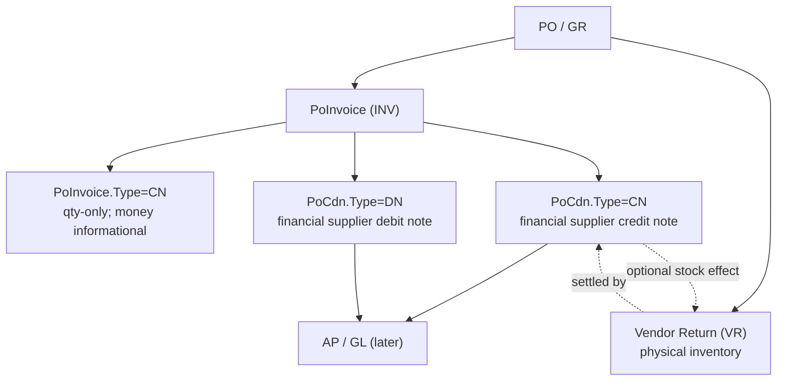

# Plan: Purchase Credit & Debit Notes (PoCdn)

## TL;DR

Add a dedicated **`PoCdn` / `PoCdnDetail`** purchase document family that mirrors the proven sales
`SaCdn` **document lifecycle** (header + detail, `Type = CN | DN`, optional posted-invoice reference with
reservation arithmetic, optional stock movement, `NEW → POSTED`). Do **not** clone inventory posting
calls blindly — VR stock-out has purchase-specific PO write-back that sales CR does not. Do **not**
overload `PoInvoice`: it stays the commercial invoice + 3-way match document, and its existing
`Type = CN` stays the **quantity-only** PO/GR correction (stored money is informational / non-AP).

Vendor-centric, **optional** PO link (GR is not modelled). `ReturnStock = true` on a CN posts a **VR
stock-out** through new public in-transaction APIs
`PostVendorReturnInTransactionAsync` / `RollBackVendorReturnInTransactionAsync` (MI-core **then**
`ApplyVendorReturnPoQtyAsync` on the **caller's** `DbContext`). Generic
`PostStockOutInTransactionAsync` does **not** update PO `ReturnQty` and must not be used for VR from
`PoCdn`. POST/ROLLBACK is one `DbContext`, one database transaction, one `SaveChanges`/commit.

AP/GL posting, MyInvois submission, multi-invoice knock-off and approvals are **out of scope** and listed
as separate later phases.

**Review basis.** Architecture approved through Round 6, then closed for implementation in **Round 7**
(VR-in-tx API, `ConsumesInvoiceQty`, qty-CN money = non-AP, Option A OverInvoiced workflow, canonical
lock order). Items C1-C14 are the Round-1/Round-2 response, **C15-C23** Round 3, **C24-C33** Round 4,
**C34-C40** Round 5, **C41-C48** Round 6, and **C49-C54** Round 7. Rounds 3-7 are **signed off**. The
Round-2 items were verified against the source in **Codebase Validation**.

---

## Business Rules / Procurement Controls (locked before Phase 0)

### C1 — What `POSTED` means

- `PoCdn.Status = POSTED` means the document is **finalized for this phase** and any associated inventory
  transaction has been posted. It does **not** imply AP/GL posting.
- Until the AP/GL phase exists, the UI labels it **"Posted (operational)"** and the footer states
  *"No accounting entries have been generated."*
- A separate `CONFIRMED` status is **rejected** for Phase 1: `SaCdn` uses `NEW`/`POSTED` and the
  permission codes are `POST`/`ROLLBACK`. Parity beats wording.
- When AP/GL lands, add a distinct **`AccountingStatus`** (`NOT_POSTED` / `POSTED` / `REVERSED`) column
  rather than overloading `Status`.

### C2 — Supplier-document duplicate control

- Filtered unique index `UX_PoCdn_SupplierDoc` on
  `(CompanyCode, BranchCode, VendorCode, Type, SupplierDocNo)` `WHERE SupplierDocNo IS NOT NULL`.
- Service pre-check on save and update: *"Supplier document {SupplierDocNo} is already recorded on
  {DocNo}."*
- Applies to `NEW` **and** `POSTED` — an unsaved draft already reserves the supplier number.
- `SupplierDocDate` is captured and displayed to disambiguate; it is **not** part of the key in Phase 1.
  **Signed off (R3-C2 / former Open Item 1):** the Phase-1 key excludes `SupplierDocDate`. Revisit only
  on evidence of legitimate reuse across years, and then with fresh business sign-off — the constraint is
  enforced in the database, so changing it later needs duplicate-data cleanup.
- No authorized override in Phase 1.

### C3 — CN reservation basis (header **money** only)

- `CreditReservationAmount(CN) = GrossAmnt + Taxes` (= `TotAmnt`), where `GrossAmnt = Σ NetAmount`
  (post-discount, excluding tax) and `Taxes = Σ TaxAmt`.
- Cap: `Σ(TotAmnt of other NEW + POSTED **PoCdn** CNs against the invoice) + candidate.TotAmnt ≤
  Invoice.TotAmnt`.
- Applies to `PoCdn.Type = CN` with `InvNo` only. `DN` never consumes the cap.
- **`PoInvoice.Type=CN` TotAmnt is excluded** — quantity-correction money is informational / non-AP
  (**C5**, **C49**). Example: invoice 10,000 + qty-CN TotAmnt 2,000 + PoCdn reservation 8,500 → C3
  remaining **1,500** (not −500).
- **Header money reservation (C3) and line quantity ceiling (C34) never substitute for each other.**
- **Save vs POST (C52):** unsaved UI state does not consume; after a successful Save the NEW row
  consumes; save-time check is advisory / early rejection; **POST-time revalidation under the invoice
  lock is mandatory** and is the authority.
- **Rounding:** normalize each line amount and every compared total to 2 dp
  `MidpointRounding.AwayFromZero` before comparison, reusing the `SaCdnCalc` money-normalize shape. No
  per-vendor 0-dp flag exists in the purchase master, so 2 dp applies; a company-level 0-dp setting is
  out of scope.
- **Discounts** are already inside `NetAmount`; **inclusive tax** is already inside `TotAmnt`. A
  **tax-only adjustment** uses a line with `NetAmount = 0` and `TaxAmt > 0` and consumes the cap by
  `TotAmnt`.
- **Cap precision is document-currency only (R4-P1-11/C3):** the reservation comparison happens entirely
  in the invoice/document currency. Local/base-currency conversion must never participate in the CN cap,
  so FX rounding cannot leak into the reservation gate.
- The cap is against the **original posted invoice total**, not a separately computed creditable
  balance. AP payments are **not** considered in Phase 1: a CN may still be raised against an invoice
  that has been paid. Deliberate and documented.
- **Forward AP disposition (binding on the AP/GL phase):** unpaid invoice → offset the invoice balance;
  partially paid → reduce the remaining payable first; fully paid → create an **unapplied supplier
  credit** with a refund workflow. Phase 1 permits the document; it must never imply the CN reduces a
  zero outstanding. **Signed off (R3-C3 / former Open Item 2):** a CN against a fully paid invoice is
  allowed in Phase 1.
- **No applied-balance figure (R3-C3):** Phase 1 must never expose an "outstanding balance after CN",
  "still payable" or any figure implying AP has already applied the CN. `InvNo` is a *relation* only
  (C19); application belongs to the AP/GL phase.
- **Financial cap ≠ physical quantity (R2-C4):** the CN reservation is a *monetary* cap against the
  posted invoice; VR validation is a *physical quantity* check against the received PO quantity. A CN
  may be value-only, stock-returning, partially stock-returning, or unrelated to quantity. Never derive
  return quantity from CN value.
- Same **"reservation arithmetic, not a lock"** model as `SaCdn` — self-healing, no reservation table,
  no expiry, no cleanup job. Add the "Reserved by draft CN(s) …" indicator and the report-only screen.
- A leftover NEW draft can block until edited or deleted — intentional (same as C39).

### C4 — Relationship matrix (CN / DN / INV / PO / GR / VR)

| Document | posted `INV` | PO line | GR | VR batch |
|---|---|---|---|---|
| `PoCdn` `CN` (value only) | **required** (Phase 1) | optional | none (not modelled) | none |
| `PoCdn` `CN` with `ReturnStock` | **required** | **required on stock lines** | none (derived from PO line + balance record) | **created and owned by PoCdn** |
| `PoCdn` `DN` | optional | optional | none (not modelled) | never |

GR is **not** a first-class reference anywhere in this plan. Absence of a GR reference does **not** mean
absence of receipt validation: physical returnability is derived from PO `RecvQty − ReturnQty` and the
authoritative `IvBalLoc` row (`IvVendorReturnService.ValidateLineAsync`). A `ReturnStock` line requires
the PO line + `FromBalLocId` and **no GR document**. `GrNo` / `GrLineNo` are therefore excluded from the
Phase-1 schema. This is the explicit resolution of R2-C6.

**Signed off (R3 / former Open Item 3):** a GR-less physical return is acceptable. Requiring a GR link
would be a prerequisite change to the VR subsystem, not a `PoCdn` change, and is explicitly rejected.

**Line traceability (R4-P0-01/C24):** `PoCdnDetail` carries a nullable `InvLineNo` pointing at the source
`PoInvoiceDetail.Line`. Its presence marks a *line-based* adjustment and its absence a *header-level* one;
it is mandatory on every stock-return line. The source relationship is stored, not inferred.

Explicit rejects:

- CN referencing PO but **no posted INV** → rejected in Phase 1.
- CN stock-return line **without a PO line** → rejected (the VR posting requires it).
- `DN` with `ReturnStock = true` → rejected at the type level.
- Duplicate `(PoNo, PoRelNo, PoLineNo, FromBalLocId)` across lines of one document → rejected
  (prevents VR double-counting). The same PO line from a **different** inventory source is allowed;
  combined `StdQty` is checked against PO remaining (**C47**).

### C5 — User-facing distinction between the two Purchase CN concepts

| Concept | Where | Label |
|---|---|---|
| `PoInvoice.Type = CN` | Purchase → Purchase Invoice | **"Quantity Correction (PO/GR)"** — never "Credit Note" |
| `PoCdn.Type = CN` | Purchase → Transactions | **"Purchase Credit Note"** |
| `PoCdn.Type = DN` | Purchase → Transactions | **"Purchase Debit Note"** |

- Grids show `Credit Note` / `Debit Note` / `Quantity Correction`, never a bare `CN` / `DN`.
- Each screen carries help text cross-referencing the other.
- The `PoInvoice.Type=CN` entry point **is exposed today** — the `Type` combo (`INV`/`CN`), its `InvNo`
  label, the "Copy from INV" button and the view title in `PoInvoice.razor(.cs)`, plus the "Credit Notes"
  filter in `PoInvoiceList.razor`. Relabelling it is therefore **mandatory, not conditional**.
- A posted purchase invoice offers **two distinct actions**: "Create Quantity Correction (PO/GR)" →
  `PoInvoice.Type=CN`, and "Create Purchase Credit Note" → `PoCdn.Type=CN`. Copy-from-invoice must never
  produce the wrong one.

**`PoInvoice.Type=CN` semantics (locked — Round 7 / C49):**

- Changes **only** `PoOrderDetail.InvoicedQty` (and derived 3-way fields).
- Header/line `TotAmnt` / tax / price **may still be calculated and stored** (current code does). They
  are **informational / non-AP**. They are **not** an AP credit, **not** a reservation, and **not**
  subtracted from invoice available money (C3).
- **Included in C34 quantity consumption only** (always `ConsumesInvoiceQty`).
- Does **not** represent the financial `PoCdn` CN. When AP/GL lands, journals come from `PoCdn` (and
  later `PoCdnApplication`), not from `PoInvoice.Type=CN`.

### C6 — Tax and rounding calculation chain

Locked chain, per line:

```
GrossAmount = Qty × UnitPrice
            → discounts (item discount + ItemDiscount1-6, JOIN/SPLIT per vendor)
            → NetAmount (excluding tax)
            → TaxAmt
            → Amount = NetAmount + TaxAmt
Header: GrossAmnt = Σ NetAmount ; Taxes = Σ TaxAmt ; TotAmnt = GrossAmnt + Taxes
```

- **Inclusive:** `exclusiveUnitPrice = UnitPrice / (1 + taxPercent / 100)`; the discount is tax-stripped
  before `NetAmount` is derived.
- **Tax percent is taken from the referenced invoice line**, not from the current tax master.
- **Tax treatment is inherited (R4-P1-07/C32):** a line-based adjustment inherits the source invoice
  line's `TaxGroup` and `IsInclusive`; a header-level adjustment inherits the header `TaxGrCode`. An
  arbitrary tax-mode change is rejected — a different treatment requires the explicit `TAX_ADJUSTMENT`
  path, so a user cannot change the effective rate while still claiming the line relates to the invoice.
- **Currency and rate (R2-C9, R3-C6/C18):** a CN/DN with `InvNo` must use the **same currency as the
  referenced invoice** (rejected otherwise). `PoCdnService` resolves `CurrRate` for the **PoCdn
  `DocDate`** — it is never copied from the invoice's historical rate. It **fails closed** when a
  non-home currency has no `SaCurrRates` window covering `DocDate`, or when the rate is `1`. Clone the
  `SaCdnService.ResolveCurrRateAsync` shape (`SaCdnService.cs:2293`); it must not copy
  `PoInvoiceService.ResolveCurrRateAsync`, which is private and silently returns `1m`. The server
  resolves and stores the rate; a client-supplied rate does not override it.
- **Line rounding** to 2 dp `AwayFromZero` before summation; **document-level adaptive tax rounding**
  (the `SaInvoiceCalc.ApplyTaxAdaptiveRounding` shape) applied once at the header so
  `TotAmnt = GrossAmnt + Taxes` exactly.
- **Mixed inclusive/exclusive** tax across lines of one document is rejected.
- **Tax-only line** allowed only when `NetAmount = 0` and `TaxAmt > 0`.
- **Local amounts** (AP/GL phase) = base × document `CurrRate`, 2 dp `AwayFromZero`.
- The chain lives entirely in `PoCdnCalc` and is unit-tested independently of `PoCdnService`.

### C7 — CN/DN and VR are separate business events

- **Purchase CN/DN = financial/commercial adjustment. Vendor Return (VR) = physical inventory movement.**
- A CN may exist with no VR (`ReturnStock = false`). A VR may exist with no CN.
- **Phase 1:** when `ReturnStock = true`, `PoCdn` creates and owns exactly one VR batch, traceable via
  header `VrBatchNo` and `RefNo = PCN/{DocNo}` (DN never returns stock). VR details are created **only**
  for lines with `IsStockReturn = true` (**C43**) — not for every line when the header toggle is on.
- **Phase 2:** allow linking a **pre-existing posted VR** (no new batch) and, if required, many VRs per
  CN via a link table. Semantics locked now; link table deferred.

**Ownership (Phase 1 — C53):**

- `PoCdn ReturnStock` owns **only** the VR it creates (`VrBatchNo` + `PCN/{DocNo}`).
- An independently created standalone VR is **not** auto-linked.
- `PoCdn` cannot create a second VR for qty already consumed — PO `RecvQty − ReturnQty` is authoritative.
- "Create CN from posted VR" is a later explicit workflow (Further Considerations).

**VR-in-transaction API (Round 7 — C50):** do **not** call `PostStockOutInTransactionAsync` for VR from
`PoCdn` — that method only runs MI-core and does **not** update PO `ReturnQty`. Add public:

- `PostVendorReturnInTransactionAsync(db, …)` — MI-core **then** `ApplyVendorReturnPoQtyAsync(sign: +1)`
  on the caller's `db`. Must **not** `BeginTransaction`, create a second `DbContext`, `SaveChanges`, or
  `Commit`.
- `RollBackVendorReturnInTransactionAsync(db, …)` — reverse MI-core **then**
  `ApplyVendorReturnPoQtyAsync(sign: -1)` on the same `db`. Restores `ReturnQty`, `BalanceQty`,
  `OverRecvQty`, `FinClosed`.

**POST/ROLLBACK atomicity (C50):** one `DbContext`, one database transaction, one `SaveChanges`/commit.
`PoCdn.Status` + VR batch status + inventory + PO derived fields commit together or not at all. Do not
nest `PostAsync`.

**One-to-one invariant (R2-C3), enforced at both DB and service level:**

- one `PoCdn` owns at most one VR batch, and one VR batch is owned by at most one `PoCdn`;
- enforced by `UQ_IvTrxBatch_VR_PcnRef` — unique on `(CompanyCode, BranchCode, RefNo)` where
  `TrxType = N'VR'` and `RefNo >= N'PCN/' AND RefNo < N'PCN0'`, mirroring `UQ_IvTrxBatch_CR_CnRef`
  (`scripts/create-sacdn.sql:150-170`);
- **post is idempotent with respect to the owned VR** — a retry after a partial failure reuses or
  reconciles the existing batch and never creates a second;
- rollback targets only the VR owned by that CN;
- switching `ReturnStock` true → false on a `NEW` draft deletes the `NEW` VR batch and clears `VrBatchNo`;
- `VrBatchNo` means **the Phase-1 owned VR**. It must never be overloaded to mean "many"; Phase 2 uses a
  link table instead.

**Post-invoice ReturnStock — Option A (Round 7 — C51):**

- Allow `ReturnStock` after the PO line is invoiced. **Never silently create** a `PoInvoice.Type=CN`.
- After a successful ReturnStock post, if `OverInvoicedQty > 0` on any touched PO line:

```
Physical return completed
Warning: Invoice quantity exceeds net received by {OverInvoicedQty}.
[Create Quantity Correction]   [Continue without correction]
```

- **`[Create Quantity Correction]` prefills** returned `StdQty` into a **NEW** qty-CN draft. It **never
  auto-posts**. The operator may reduce the qty (partial correction).
- **`[Continue without correction]`** is allowed. Chip visibility follows **C51** (derived formula).
- `PoCdn` still never writes `InvoicedQty` (validation rule 11).

### C8 — Mixed PO and non-PO lines

Allowed. Validation is **per line**: a stock-return line requires a PO link + `FromBalLocId` + a
non-service PO line; a service/expense/rebate line does not require a PO link. One document may contain
both.

**Signed off (R4-P1-09):** `ReturnStock = true` permits **mixed** stock-return and non-stock financial
lines. Only lines with valid stock-return fields create VR details, and the entry grid must make the
per-line physical-return state obvious. (The alternative — every eligible line must return stock — was
rejected as too restrictive.)

### C9 — Reason-code taxonomy

- **CN:** `RETURN`, `DAMAGED`, `SHORT_SUPPLY`, `PRICE_ADJUSTMENT`, `REBATE`, `OVERBILL`,
  `TAX_ADJUSTMENT`, `INTERNAL_ADJUSTMENT`, `OTHER`.
- **DN:** `PRICE_ADJUSTMENT`, `QUANTITY_ADJUSTMENT`, `FREIGHT_ADJUSTMENT`, `TAX_ADJUSTMENT`,
  `REBATE_REVERSAL`, `SUPPLIER_CLAIM`, `INTERNAL_ADJUSTMENT`, `OTHER`.
- Required on save; the service rejects a code outside the set for the document `Type`. A deterministic
  taxonomy now makes the later AP/GL mapping mechanical.

Each code carries metadata so validation, AP/GL and approval mapping never hard-code per-code rules:

| ReasonCode | inventoryCapable | requiresPo | requiresInvoice | internalAdjustment |
|---|---|---|---|---|
| `RETURN`, `DAMAGED`, `SHORT_SUPPLY` | Yes | Yes | Yes | No |
| `PRICE_ADJUSTMENT`, `REBATE`, `OVERBILL`, `TAX_ADJUSTMENT`, `OTHER` | No | No | Yes | No |
| `QUANTITY_ADJUSTMENT`, `FREIGHT_ADJUSTMENT`, `REBATE_REVERSAL`, `SUPPLIER_CLAIM` | No | No | No | No |
| `INTERNAL_ADJUSTMENT` | No | No | No | Yes |

- **`inventoryCapable`, not `affectsInventory` (R3-C4):** the flag describes the reason's normal
  business meaning — that it *can* be settled by returning stock. The actual inventory effect is decided
  by `ReturnStock` alone, so `ReasonCode = DAMAGED` with `ReturnStock = false` is a valid financial CN
  (the physical return happened separately, or not at all).
- **Metadata is evaluated together with `Type` (R3-C5/C17):** the CN fundamental rule — a POSTED `INV`
  of the same vendor — is enforced first and reason metadata can **never** relax it. For a DN the
  invoice requirement is reason-driven. The check order is explicit in `PoCdnService` and tested.
- **`internalAdjustment` (R3-C8, signed off):** `SupplierDocNo` is required unless the reason code is
  flagged internal-adjustment; such a document has no supplier document (C16).

### C10 — Stock-return concurrency

- Returnable quantity is revalidated **inside the posting transaction under the PO lock**, immediately
  before the VR post. Already performed by
  `IvInventoryPostingService.ApplyVendorReturnPoQtyAsync` (`LockGoodsReceiptPurchaseOrdersAsync`, then
  `remaining = RecvQty - ReturnQty`, then reject or apply).
- `PoCdnService` must **not** treat the save-time check as authoritative; it is a soft warning only.
- Race to test: received 100, already returned 80, two drafts of 20 posted concurrently → exactly one
  succeeds.

### C11 — Rollback and reversal, now and later

| State | Rule |
|---|---|
| No accounting, no MyInvois (Phase 1) | operational rollback `POSTED → NEW` allowed; the VR batch is rolled back |
| After the AP/GL phase | once accounting entries exist, rollback is disabled; reverse with a new document |
| After MyInvois validation | follow the LHDN cancel / reject / replacement process; rollback disabled once `IrbmStatus = VALID` or `SUBMITTED` |

**Phase 1:** add **code-level guard seams** that no-op until AP/GL / MyInvois exist (e.g. checks that
`AccountingStatus` / IRBM status are absent or inert). Do **not** add an `AccountingStatus` column in
Phase 1 — that column arrives with the AP/GL phase (see Schema). `Irbm*` columns are pre-created nullable
and unused.

### C12 — `DocDate` versus `PostedDate`

- `DocDate` = the supplier document's business date; `PostedDate` = ERP finalization (UTC).
- Phase 1 rejects **future-dated** documents, and dates before the company's earliest permitted date.
- **There is no period-close infrastructure in the Blazor codebase.** `AdPara.CurrentMonth/Year` exists
  only in the legacy docs; no service exposes a closed month, and `Company` carries only
  `FiscalYearStartMonth` / `IsActive`. Month/period closure must therefore be delivered with — or before
  — the AP/GL phase. It is a **prerequisite for that phase, not an existing guard**.
- `AccountingStatus` (C11) is the seam for that phase.
- **Agreement on time (R5-P1-11):** `DocDate` comes from `ICurrentDateService.Today`, which resolves the
  company timezone via `Company.TimeZoneId` (fallback `Asia/Kuala_Lumpur`) and warns against using
  `UtcNow.Date` blindly. `PostedDate`, `Created`, `Updated`, `RollbackDate` and the Serilog failure
  timestamps are stored in **UTC** and rendered by the UI in the company timezone.

### C13 — Vendor inactive / blocked

Superseded by **C15** (same policy). Kept as a pointer only: save requires active + not suspended;
post allows deactivated/suspended vendors with warning + log.

### C14 — Reference-field semantics

| Field | Meaning |
|---|---|
| `InvNo` | ERP `PoInvoice` document number — the correction target |
| `SupplierDocNo` | the supplier's own CN/DN number — **the only place it is stored** |
| `SupplierDocDate` | the supplier's document date |
| `ExternalDocNo` | external-system / integration reference — **not** the supplier CN/DN number |
| `RefNo` | internal general reference |

The UI must not pre-fill `ExternalDocNo` from the supplier number, and the service rejects the same value
appearing in both `SupplierDocNo` and `ExternalDocNo`.

- **Reference, not application (R3):** `InvNo` means "this CN *relates to* that invoice"; it does **not**
  mean the CN has been applied against the AP balance. Phase 1 computes and displays no applied or
  outstanding figure (C19).

### C15 — Vendor blocked policy (signed off)

- **Save:** the vendor must exist, be active (`IsActive`) and be **not suspended** (`Suspend != true`).
  A suspended vendor is rejected with *"Vendor {VendorCode} is suspended. New CN/DN cannot be saved."*
- **Post:** the vendor row must exist; posting proceeds even if the vendor has since been **deactivated
  or suspended**, with a UI warning chip and a structured log entry (C22). Deactivating or suspending a
  supplier must not strand in-flight documents.
- `PoSupplier.Suspend` is therefore a hold on **new** documents only, not a compliance block on
  in-flight documents.

### C16 — Supplier-document traceability

- `SupplierDocDate` is **required whenever `SupplierDocNo` is present**, and may be blank only when the
  supplier number is blank.
- `SupplierDocNo` is **required**, except when `ReasonCode` is flagged `internalAdjustment` (C9) — an
  internal adjustment has no supplier document, and the UI must say so.
- The duplicate control (C2) is unchanged and applies to every non-blank supplier number.

### C17 — Reason-metadata semantics

- `inventoryCapable` describes the reason's normal business meaning (it *can* be settled by returning
  stock); the actual inventory effect is `ReturnStock` alone. `DAMAGED` + `ReturnStock = false` is valid.
- `requiresInvoice` / `requiresPo` are evaluated **together with `Type`**. The CN rule "POSTED `INV`,
  same vendor" is enforced first and reason metadata can never relax it. For a DN the invoice
  requirement is reason-driven.
- The check order is explicit in `PoCdnService` and unit-tested (Verification 16).

### C18 — Currency and rate

- With `InvNo`, header `Currency` must equal the referenced invoice's currency (reject otherwise).
- `CurrRate` is resolved for the **PoCdn `DocDate`**, never copied from the invoice. A CN dated away
  from the invoice therefore uses the CN-date rate.
- Resolver clones the `SaCdnService.ResolveCurrRateAsync` shape: home currency → `1` with no row;
  foreign currency → a `SaCurrRate` window covering `DocDate` is required, rate `1` is rejected, and a
  missing window **fails closed**. The server resolves and stores the rate.

### C19 — Reference versus application

- `InvNo` is a *relation*. It does **not** mean the CN has been applied against the AP balance; that
  application belongs to the future `PoCdnApplication` / AP phase.
- Phase 1 computes and displays **no** applied or outstanding-balance figure — no "outstanding after
  CN", no "still payable". The reservations screen shows reservation versus invoice total only.

### C20 — VR quantity binding

- One VR detail per CN stock line, built by `PoCdnService.AddVrBatchDetails`. The VR receives the CN
  line's **inventory standard quantity**: `FrStdQty = IvQty.Round(line.StdQty)` with `FrStdUom = line.StdUom`
  and `Uom = item.StdUom`, mirroring `IvVendorReturnService.AddDetails` (L664-666). No aggregation and no
  transformation.
- `line.Qty` is the **document/purchase UOM** quantity and is never passed to the VR directly; the single
  conversion point is the save-time `StdQty` computation (**C26**). Passing `Qty` would silently mis-state
  the return because the VR subsystem performs no conversion.
- The VR `SourceFingerprint` covers the **standard** quantity + PO link + balance location, so a changed
  CN quantity invalidates batch reuse instead of silently re-posting a different quantity.
- VR quantity is never re-derived from PO/GR after posting, and rollback reverses the batch without
  recomputing quantity.

### C21 — Immutability after `POSTED`

- `UpdateAsync` rejects any document that is not `NEW` — the `SaCdnService.UpdateAsync` guard
  ("Only NEW documents can be edited.").
- Immutable after `POSTED`: `VendorCode`, `Currency`, `CurrRate`, `InvNo`, `SupplierDocNo`,
  `SupplierDocDate`, `ReasonCode`, `ReturnStock`, and every line quantity / price / tax / PO link.
- `RowVersion` is concurrency control only, **not** business immutability. Only a rollback (Phase 1) or
  a future reversal document changes the financial result.

### C22 — Audit and failure events (signed off)

- Existing stamps carry the audit trail: `Created`/`UserID`, `Updated`/`UpdatedUID`, `PostedDate`/
  `PostedBy`, `RollbackDate`/`RollbackBy`.
- Structured Serilog events `PoCdnPostFailed` and `PoCdnRollbackFailed` capture document number,
  company/branch, user, operation, error category, VR batch number and timestamp — important around the
  CN/VR posting boundary.
- **Field-level old/new audit is explicitly out of scope for Phase 1** — no document audit-trail table
  exists in this codebase (only `IvTrxHistory` and Serilog), and the later AP/GL phase can add it. This
  supersedes the earlier Verification item that demanded old/new values.

### C23 — Reference integrity is service-layer, not FK

- Vendor, invoice, PO, PO line and `IvBalLoc` references are validated transactionally by the
  service/repository layer using tenant / company / branch / vendor identity.
- No weak foreign keys are added where the domain model cannot represent them — deliberate, and
  matching existing `PoInvoice` / `PoOrder` practice.

### C24 — Invoice-line traceability (signed off)

- `PoCdnDetail` gains a nullable **`InvLineNo`** = the source `PoInvoiceDetail.Line` (the invoice detail
  key is `(CompanyCode, BranchCode, DocNo, Line)`, so this is a plain column, not a composite reference).
- **Presence is the marker:** a line with `InvLineNo` is a *line-based adjustment*; a line without it is a
  *header-level / general adjustment* (rebate, general tax or value adjustment). Not every line is forced
  to carry one.
- `InvLineNo` is **required** on every stock-return line (`ReturnStock = true`); it is optional on a
  purely financial line.
- When present it must resolve to a `PoInvoiceDetail` of the referenced `InvNo`, with the same `ICode`;
  if the CN line also carries a PO link, that link must match the invoice detail's `PoNo`/`PoRelNo`/
  `PoLineNo`. A DN with no `InvNo` must not carry `InvLineNo`.
- `CopyFromInvoiceAsync` populates `InvLineNo` from the source line. It is stored once and never
  re-derived, so audit can trace a CN amount or quantity back to the invoiced line.
- **Copy is a suggestion (R5-P1-05):** `CopyFromInvoiceAsync` sets `ReturnStock = false` and its
  quantities are candidates only. If the operator then enables `ReturnStock`, the line is revalidated
  against both ceilings (**C34**) and the balance location is revalidated at save and post — a copied
  quantity is never assumed physically returnable.

### C25 — Referenced invoice lifecycle (signed off)

- A `PoInvoice` referenced by any `NEW` or `POSTED` `PoCdn` **cannot be rolled back or deleted** until
  those CNs are rolled back or deleted under their own lifecycle.
- **Phase 1 therefore modifies `PoInvoiceService`** — the one deliberate exception to "leave `PoInvoice`
  alone". `RollbackAsync` gains a tenant/company/branch-scoped dependency check against `PoCdn.InvNo`.
  (`DeleteAsync` already accepts only `NEW` invoices, and a CN can only reference a `POSTED` invoice, so
  the delete path is a defensive completion rather than a live exposure.)
- The check runs under the same lock discipline as the CN save/post, so a concurrent invoice rollback and
  CN post cannot resolve to an orphaned reference or an invalid reservation.
- **Sufficiency (R5-P1-01):** rollback is the only mechanism that can materially change a posted
  invoice's details, so the rollback guard is the complete dependency control. `InvLineNo` therefore
  keeps meaning the same business source for the life of the CN and no additional foreign key is added.

### C26 — UOM semantics (signed off)

- `PoCdnDetail.Qty` is the **document / purchase UOM** quantity; `PoCdnDetail.StdQty` is the
  **inventory standard** quantity.
- Conversion happens **exactly once**, at save: `StdQty = PoOrderCalc.ComputeStdQty(Qty, packSz)` with
  `packSz` from the PO line (`PoOrderDetail.PackSz`) or, for a non-PO line, from the item
  (`PurStdPackSize ?? StdPackSize ?? 1m`) — the same helper and default already used by `PoOrderService`
  and `PoInvoiceService`.
- The VR request carries `Quantity = StdQty` and `Uom = StdUom`. The VR subsystem performs **no
  conversion** (verified: `IvVendorReturnService.AddDetails` writes the request quantity straight into
  `FrStdQty` and `FrPurQty`), so passing `Qty` would be wrong whenever the UOMs differ.
- The conversion factor must be positive. A missing or non-positive factor **rejects the line** rather
  than silently defaulting to `1` for a non-standard UOM.
- No post-time re-conversion is allowed.
- **Historical conversion (C42):** the factor is never taken from current master data for an
  invoice-derived line. C42 records the source-of-truth order.

### C27 — Inventory tracking controls are item-master driven

- Lot and expiry follow the **item master**, not a blanket rule:
  - `LotControl = true` → `LotNo` required and must match the balance record; `ExpiryDate` comes from the
    lot / balance.
  - `LotControl = false` → `LotNo` must be blank and `ExpiryDate` is cleared.
  This mirrors `IvVendorReturnService.ValidateLineAsync` (L816-843) exactly.
- **`IvStockMaster` has no expiry-control or serial-control flag** (verified: only `StockControl` and
  `LotControl`). Phase 1 therefore makes **no serial promise** and imposes no serial requirement — there
  is no serial mechanism in the VR subsystem to align with, so nothing is claimed and nothing is
  silently ignored.
- This **corrects** the earlier blanket wording in C4/C8 and validation rule 7, which wrongly required
  lot/expiry on every stock-return line.

### C28 — Inventory valuation is separate from the CN financial amount

- `PoCdnDetail.UnitPrice` and every derived financial amount are the **supplier financial** value. They
  must never be used as the VR's inventory cost.
- The VR / inventory posting service remains the authority for stock-out valuation. Verified: the VR's own
  writer (`IvVendorReturnService.AddDetails`) sets **no** `Cost`/`CostPrice` on the batch detail, and the
  posting service resolves cost from the source balance and posting rules — so `PoCdnService` must not
  inject `Cost`/`CostPrice` from the CN line either.
- `PoCdnDetail.CostPrice` is a snapshot only and does not drive the VR posting.
- A supplier CN price and the inventory cost may legitimately differ, and both must stay correct.
- **`CostPrice` is informational only (R6-6, signed off):** the column is **kept** but is a snapshot that
  `PoCdnService` never reads, never propagates to the VR detail and never uses for valuation. A unit test
  asserts that no cost field on the VR batch detail is sourced from the CN line (Verification 22).
  Removing it later remains a one-line migration if a reviewer still judges it a misuse risk.

### C29 — Supplier-document uniqueness scope (signed off)

- The key stays **`(CompanyCode, BranchCode, VendorCode, Type, SupplierDocNo)`** — `Type` **and**
  `BranchCode` both participate.
- Rationale (R4-P1-04/P1-05): the supplier maintains separate CN and DN numbering sequences, and
  supplier-document numbering is treated as branch-local. Both are explicit business decisions, not
  accidental consequences of the index design.
- Changing either axis later needs duplicate-data cleanup, so revisit only with fresh sign-off.
- **Reporting scope (R5-P1-08):** uniqueness stays branch-local, but supplier-document **search and AP
  reporting are company-wide** (`VendorCode + SupplierDocNo`), showing the branch on every hit and
  raising a cross-branch duplicate warning. Operational visibility without changing the signed-off key.

### C30 — Sign convention

- CN and DN store **positive** monetary values; `Type` supplies the business/accounting direction.
- Negative quantity, negative unit price and negative tax are rejected. An opposite-direction document is
  expressed by choosing `DN`, never by negating a CN.
- This stops the future AP/GL phase from double-negating a CN/DN.

### C31 — Owned-VR protection

- A VR batch whose `RefNo` is in the `PCN/` range belongs to a `PoCdn` and must not be mutated
  independently. Verified gap: the generic `/inventory/vendor-return` screens expose add/edit/post/
  rollback/cancel and `IvVendorReturnService.NormalizeRefNo` (L910) has no `RefNo` guard today.
- Generic VR edit, rollback and delete **reject** a `PCN/`-owned batch and direct the operator to the
  owning credit note. `PoCdn` rollback is the single authoritative rollback path.
- The guard lives in `IvVendorReturnService`, so it holds for the UI, the service API and any future
  caller — not just the screens.
- VR status changes must preserve the `RefNo` linkage.
- **`RefNo` semantics (R5-P1-09):** `RefNo = PCN/{DocNo}` on the owned VR is a **system-owned linkage**,
  never a user-editable general reference. `PoCdn.RefNo` remains the user/internal reference field, and
  no integration may overwrite the VR linkage.

### C32 — Tax treatment is inherited, not re-chosen

- A line-based adjustment inherits the source invoice line's `TaxGroup` and `IsInclusive`; a header-level
  adjustment inherits the header `TaxGrCode`.
- The tax mode cannot be changed arbitrarily. A different tax treatment is reachable only through
  `TAX_ADJUSTMENT` (a tax-only line, C6), which is an explicit and validated exception.
- This prevents an indirect tax-rate change while the document still claims to relate to the original
  invoice.

### C33 — Reason code is not the GL account key

- `ReasonCode` is the business classification. It is **not** sufficient on its own to determine the
  AP/GL posting account in the later phase.
- Account determination must combine `ReasonCode` + line classification + `ItemGLCode` / PO context +
  inventory/non-inventory status + tax treatment.
- Recorded now so the AP/GL phase does not encode a misleading "reason code → account" shortcut.

### C34 — Invoice-line quantity and value ceilings (signed off; Round 7 `ConsumesInvoiceQty`)

Do **not** subtract `PoCdnDetail.StdQty` generically. A rebate/tax/price line with `InvLineNo` and
administrative `Qty = 1` must not consume returnable quantity.

**`ConsumesInvoiceQty` is derived — no new column.** Reuse C9 `inventoryCapable`:

| Line | ConsumesInvoiceQty |
|---|---|
| `PoInvoice.Type=CN` detail | **Yes** — always (that is its purpose) |
| PoCdn `IsStockReturn = true` | **Yes** |
| PoCdn `InvLineNo` set and `ReasonCode` in `RETURN`, `DAMAGED`, `SHORT_SUPPLY` | **Yes** (qty event; stock may have left via standalone VR) |
| PoCdn `PRICE_ADJUSTMENT`, `REBATE`, `OVERBILL`, `TAX_ADJUSTMENT`, `INTERNAL_ADJUSTMENT`, `OTHER` | **No** — header reservation (C3) and, where applicable, C34 **value** ceiling only |
| PoCdn DN | **No** |
| Header-level PoCdn line (`InvLineNo` null) | **No** |

```
invoiceRemaining = invoiceLine.StdQty
                 − Σ NEW/POSTED PoInvoice.Type=CN StdQty on that InvLineNo
                 − Σ other NEW/POSTED PoCdn StdQty
                     where ConsumesInvoiceQty and same InvLineNo

physicalRemaining = RecvQty − ReturnQty   // stock-return lines only

allowedReturn     = MIN(invoiceRemaining, physicalRemaining)  // IsStockReturn
allowedQtyClaim   = invoiceRemaining                           // inventoryCapable, no stock
```

Example: invoice line 10, qty CN 2, rebate PoCdn with `Qty = 1` → remaining qty still **8**. A later
`RETURN` / `IsStockReturn` line may take at most 8 (subject to physical remaining).

- **Header-level lines** (no `InvLineNo`) keep only the header reservation cap (C3).
- **Value ceiling by reason (R5-P0-02):**

  | Reason group | Source-line ceiling |
  |---|---|
  | `RETURN`, `DAMAGED`, `SHORT_SUPPLY` | quantity, as above |
  | `OVERBILL`, `PRICE_ADJUSTMENT` | value — the line's creditable amount must not exceed the source line's remaining creditable value |
  | `REBATE`, `TAX_ADJUSTMENT`, `INTERNAL_ADJUSTMENT`, `OTHER` | **exempt** — header reservation cap only |

- **Save vs POST (C52):** save-time C34 check is advisory / early rejection; POST-time under the invoice
  lock is mandatory and authoritative. Unsaved UI does not consume; saved NEW does.
- **`PoOrderDetail.ReturnQtyCn` stays unused.** Physical ceiling remains `RecvQty − ReturnQty`.
- **Under the invoice lock (C41):** read-after-lock, never read-then-lock.
- **Multiple lines, one PO line (C47):** combined `StdQty` of stock-return lines sharing a PO line
  against `RecvQty − ReturnQty`.
- **C3 money and C34 qty never substitute for each other.**

### C35 — Authoritative stock identity and POST revalidation (signed off)

- `FromBalLocId` is the **authoritative** inventory source for a stock-return line. `FrWarehouse` and
  `LocCode` are display/validation values that must **match the balance record**; the header
  `LocationCode` is a default only and must never override a line-level source balance. This mirrors
  `IvVendorReturnService.ValidateLineAsync`.
- The save-time check is a **warning**; the posting transaction is authoritative. The posting service
  already re-locks every source balance and compares `ICode`, `WhCode`, `LocCode`, `LotNo` and `IStatus`
  against the batch detail, then checks availability — verified at `IvInventoryPostingService` L1452-1478.
  `PoCdn` must **not** add a second, weaker check that could diverge from it.
- A draft whose balance row, lot or location changed between save and post is therefore revalidated
  rather than trusted.

### C36 — VR/CN state consistency (signed off)

- Invariant: every `PCN/` VR batch resolves to **exactly one** owning `PoCdn`, and its state is
  compatible with the owning CN's state. The DB unique index (C7) enforces the "exactly one" half; the
  service enforces the compatibility half.

  | CN state | VR state | Verdict |
  |---|---|---|
  | NEW | NEW | valid — draft pairing |
  | NEW | POSTED | **inconsistent** — fail safely, never silently re-post |
  | NEW | missing | valid when `ReturnStock = false`; inconsistent when `ReturnStock = true` |
  | POSTED | POSTED | valid |
  | POSTED | missing | **inconsistent** when `ReturnStock = true` — the recovery path must fail safely |
  | NEW after rollback | NEW | valid — the rollback restored the draft pairing |

- Any impossible combination fails the POST or rollback rather than creating a second batch.

### C37 — Tax-only line contract (signed off)

- A tax-only line (`NetAmount = 0`, `TaxAmt > 0`, C6) is defined deterministically:
  - `ICode` **blank** — no item master record is involved;
  - `Qty = 0`, `UnitPrice = 0`, `NetAmount = 0`;
  - `TaxGroup` **required**, inherited per C32;
  - `ItemGLCode` required on the same rule as any other non-zero-amount line (C38);
  - **must not** be a stock-return line — a `ReturnStock` line can never be tax-only.
- A tax-only line consumes the header reservation by its `TotAmnt` (C3).

### C38 — Non-PO financial classification (signed off)

- `PoCdn` **mirrors the purchase invoice rule** rather than inventing one: `ItemGLCode` is required when
  the line amount is non-zero, falling back to `IvStockMaster.PurchaseGlCode`, and the line is rejected
  when neither exists (`PoInvoiceService.cs:1500-1506`).
- Applies to PO-linked and non-PO financial lines alike, so the AP/GL phase never discovers historical
  CN/DN lines with no account classification.

### C39 — Rollback reservation behaviour (signed off)

- `POSTED → NEW` rollback **releases the physical/inventory effect but does not release the financial CN
  reservation** while the draft remains active. This is already inherent in C3 ("other NEW + POSTED
  CNs") and is now stated explicitly so it cannot be optimised away.

  | Action | Reservation |
  |---|---|
  | delete `NEW` | released |
  | post `NEW` | consumed |
  | edit `NEW` | recalculated atomically |
  | rollback `POSTED → NEW` | **remains consumed** |

- This stops an operator creating a second CN during the rollback/edit window and temporarily exceeding
  the intended credit ceiling.

### C40 — Approval POST seam (signed off)

- There is **one authoritative POST gate**: `CanPost(PoCdn)`. Phase 1 implements it as "the normal rules
  pass"; the later approval phase extends the same gate to require `ApprovalStatus = APPROVED`.
- No approval system is built now. The seam exists so approval can become a mandatory POST prerequisite
  without redefining `Status` and without another caller bypassing it.

### C41 — Invoice-line reservation concurrency (signed off)

- When `InvLineNo` is used, the source-line consumption calculation runs **under the same invoice lock** as
  the header reservation (C3), using the canonical lock order `PoInvoice → PoCdn`. All `NEW` and `POSTED`
  CNs referencing that invoice line are included.
- The identical lock protects concurrent **save**, **edit** and **post**. The calculation is
  read-after-lock, never read-then-lock; otherwise the control is advisory — CN-A and CN-B each read the
  same remaining quantity and both succeed.
- Race to test: invoice line remaining 10, two concurrent CNs of 10 → exactly one succeeds.

### C42 — Historical snapshot semantics (signed off)

- **A CN never reinterprets a historical document using current master data.** The conversion factor and
  the source quantity come from the stored document snapshot, in this order:

  | Line kind | Conversion basis | Ceiling basis |
  |---|---|---|
  | has `InvLineNo` | `PoInvoiceDetail.StdCustPsize` — the invoice's stored pack size | `PoInvoiceDetail.StdQty` |
  | PO-linked, no invoice line | `PoOrderDetail.PackSz` — stored on the PO line | PO `RecvQty − ReturnQty` |
  | neither (header-level / standalone DN) | item master `PurStdPackSize ?? StdPackSize`, permitted only because no historical document is being reinterpreted | header reservation (C3) |

- Changing `IvStockMaster.PurStdPackSize` or `StdPackSize` **after** an invoice was posted must never change
  the quantity a later CN derives from that invoice line.
- This is precisely why `PoInvoiceDetail.StdCustPsize` is persisted: it is the historical conversion, not a
  convenience column. `PoCdnDetail.StdCustPSize` stores the snapshot actually used, so the derivation
  stays auditable.

### C43 — Line-level `IsStockReturn` (signed off)

- `PoCdnDetail` gains an explicit **`IsStockReturn`** flag. Physical-return intent is **declared, never
  inferred** from the presence of `FromBalLocId`, a PO link or a warehouse.

  | Header `ReturnStock` | Line `IsStockReturn` |
  |---|---|
  | false | must be false on every line |
  | true | each line chooses independently |

- A line with `IsStockReturn = true` must satisfy the full stock-line contract (PO link, non-service PO
  line, `FromBalLocId`, warehouse/location/lot per C27, `InvLineNo` per C24) and creates exactly one VR
  detail (C20). A line with `IsStockReturn = false` is purely financial and creates no VR detail.
- `IsStockReturn` is only meaningful for `Type = CN`; a `DN` line is always `false` (C4).
- This replaces the ambiguous "a stock line is one that happens to carry a balance id" reading, which
  breaks down on a partially-populated draft.

### C44 — Supplier-document normalisation and `INTERNAL_ADJUSTMENT` authorisation (signed off)

- **Normalisation:** `SupplierDocNo` is trimmed before it is compared or stored, and `NULL`, `''` and
  whitespace-only input all become **`NULL`** — never an empty string, so the filtered unique index (C2)
  only ever sees real supplier numbers. `SupplierDocDate` and `ExternalDocNo` are normalised the same way,
  and the C14 "same value in both" check compares normalised values.
- **`INTERNAL_ADJUSTMENT` is gated, not free choice:**
  - it requires a **dedicated permission code** (`INTERNAL_ADJUSTMENT` — a `dbo.Permission` row, a
    `PermissionCodes` constant and a mapping in `init-pocdn-menu.sql`), so only authorised users can
    select it;
  - `Remarks` are **mandatory** on a document using that reason, so the business justification is
    recorded;
  - an audit event is written on every save that uses it (C22).
- Without the gate, `INTERNAL_ADJUSTMENT` would simply be a way to avoid entering supplier-document
  information, which is exactly what the control exists to prevent.

### C45 — Complete VR fingerprint (signed off)

- The VR `SourceFingerprint` identifies the **exact intended return**, not an approximately similar one.
  It covers `CompanyCode, BranchCode, DocNo, Line, ICode, PoNo, PoRelNo, PoLineNo, FromBalLocId,
  FrWarehouse, LocCode, LotNo, IStatus, StdQty, StdUom`.
- A change to any of those invalidates batch reuse and forces an explicit rollback instead of a silent
  re-post. A fingerprint over quantity + PO link + location alone would happily reuse a batch whose lot or
  status had changed.
- The fingerprint is written when the VR batch is created and re-checked before reuse, exactly as
  `SaCdnService` does for the CR batch.

### C46 — Line value contract (signed off)

- The two line shapes are mutually exclusive and deterministic:

  | Line kind | Contract |
  |---|---|
  | normal financial line | `Qty > 0`, `UnitPrice > 0`, `Amount > 0` |
  | tax-only line (C37) | `Qty = 0`, `UnitPrice = 0`, `NetAmount = 0`, `TaxAmt > 0` |

- A zero-value normal line (`UnitPrice = 0` or `Amount = 0`) is **rejected**. Validation rule 14 is
  therefore tightened: `Amount = 0` is allowed only on a tax-only line.
- A physically-returned line with zero financial value is not representable in Phase 1 — see Further
  Considerations.

### C47 — Multiple source lines for one PO line (signed off)

- The duplicate-line rule becomes **`(PoNo, PoRelNo, PoLineNo, FromBalLocId)`**, not
  `(PoNo, PoRelNo, PoLineNo)`. The same PO line may legitimately be returned from two inventory sources:
  PO line 10 with Lot A / balance 1 returning 4 and Lot B / balance 2 returning 6.
- The **combined** `StdQty` of all lines sharing a PO line is validated against the PO's remaining
  returnable quantity (`RecvQty − ReturnQty`), and the VR batch accumulates per detail so the posting
  applies the sum exactly once. Splitting must not let the document exceed the physical ceiling.
- Duplicate `(PoNo, PoRelNo, PoLineNo, FromBalLocId)` — the same PO line from the **same** inventory
  source — is still rejected as a VR double-count.

### C48 — Source-of-truth hierarchy

- Recorded so no later change reinterprets history with current data:

  | Data | Authoritative source |
  |---|---|
  | Vendor identity / snapshot | the `PoCdn` header at save |
  | Invoice tax treatment | the posted `PoInvoice` line / header (C32) |
  | Invoice line quantity / conversion | `PoInvoiceDetail` (`StdQty`, `StdCustPsize`) |
  | Invoice quantity correction | `PoInvoice.Type=CN` (qty only; money informational / non-AP) |
  | Invoice-line qty consumption | `ConsumesInvoiceQty` lines only (C34) |
  | Physical return | VR / `PoOrderDetail.ReturnQty` |
  | PO pack size | `PoOrderDetail.PackSz` |
  | Inventory source | `FromBalLocId`, revalidated by the inventory posting service |
  | Inventory availability / valuation | the inventory posting service (never CN `UnitPrice` / `CostPrice`) |
  | CN money reservation | `PoCdn` totals under the invoice lock (C3, C41) — excludes qty-CN TotAmnt |
  | FX rate | PoCdn `DocDate` rate (C18, fail-closed) |
  | VR ownership | `PoCdn.VrBatchNo` + `PCN/` `RefNo` |
  | Over-invoiced chip | `MAX(0, InvoicedQty − NetReceivedQty)` (C51) |

- When two sources disagree, the one earlier in the historical chain wins, and a current master record
  never overrides a stored document snapshot (C42).

### C49 — `PoInvoice.Type=CN` money is informational / non-AP (Round 7)

See **C5**. Locked choice: quantity-only for matching; calculated `TotAmnt` is stored but excluded from
C3 and from future AP journals. Relabel to "Quantity Correction (PO/GR)" is mandatory.

### C50 — VR-in-transaction API and atomicity (Round 7)

See **C7**. Contract:

- Public `PostVendorReturnInTransactionAsync` / `RollBackVendorReturnInTransactionAsync` on
  `IIvInventoryPostingService`.
- Same caller `DbContext`; must not open another context/transaction; must not `SaveChanges`/`Commit`.
- PoCdn POST/ROLLBACK: one `DbContext`, one DB transaction, one commit boundary.
- On failure, none of Status / VR / inventory / PO derived fields may remain partially committed.
- Rollback test must assert `ReturnQty`, `BalanceQty`, `OverRecvQty`, and `FinClosed`.

### C51 — OverInvoiced chip and Option A workflow (Round 7)

```
OverInvoicedQty = MAX(0, InvoicedQty − NetReceivedQty)
Chip visible    iff OverInvoicedQty > 0
```

Derived from PO quantities, not from whether the operator used the Create Quantity Correction button.
A qty CN that restores `InvoicedQty` to `NetReceivedQty` clears the chip; a partial correction leaves it.
See **C7** for the two-button post-ReturnStock dialog. Prefill ≠ auto-post.

### C52 — Save vs POST for NEW drafts (Round 7)

- Unsaved UI state does **not** consume C3 or C34.
- After a successful Save, the NEW row consumes (self-healing; same as C39).
- Save-time check is **advisory / early rejection**.
- **POST-time revalidation under the invoice lock is mandatory** and is the authority.
- Concurrent edit of a NEW draft recalculates atomically.
- No third "validated vs stale" flag.

### C53 — Standalone VR ownership (Round 7)

See **C7** Ownership. PoCdn owns only the VR it creates; convert-VR-to-CN is a later workflow.

### C54 — Canonical lock order (Round 7)

One order per operation. **No path may acquire an earlier lock after a later lock.**

| Operation | Canonical order |
|---|---|
| PoCdn CN value-only | Invoice → PoCdn |
| PoCdn CN ReturnStock | Invoice → PoCdn → VR → PO → BalLoc |
| PoCdn standalone DN | PoCdn |
| PoInvoice INV post | own INV → PO |
| PoInvoice Qty-CN post | Qty CN → Referenced Invoice (`LockForUpdateAsync`) → PO |
| Generic VR | VR → PO → BalLoc |

Inventory posting must not re-acquire Invoice / PoCdn / Qty-CN locks. Require at least one SQL Server
deadlock test on ReturnStock vs Qty-CN vs generic VR against the same PO line.

### Target domain model



- `PoInvoice.Type = CN` → **quantity-only PO/GR correction** (money informational / non-AP)
- `PoCdn.Type = CN` → **financial supplier credit note**
- `PoCdn.Type = DN` → **financial supplier debit note**
- `VR` → **physical inventory return**

---

## Codebase Validation (Round 2)

The Round-2 review was checked against the current source. The following are now authoritative, and they
correct four assumptions made in the previous revision.

### Verified as planned

| Claim | Evidence |
|---|---|
| No per-vendor 0-decimal flag | `PoSupplier` has `Currency`, `TaxGrCode`, `IsActive`, `Suspend` — no `DecPoint`. 2 dp is correct. |
| Invoice lock/read helpers exist | `IPoInvoiceRepository.LockForUpdateAsync`, `GetWithDetailsAsync` (`PoInvoiceRepository.cs`). |
| Inventory common repo exists | `IIvStockCommonRepository` (`IvStockCommonRepository.cs:15`) — warehouse / location / status / class lookups. |
| VR batch fingerprint is available | `IvTrxBatch.SourceFingerprint` (`IvTrxBatch.cs:16`, `IvTrxBatchConfiguration.cs:22`). |
| Reservation helper shape fits | `SaCdnCalc.EvaluateRemaining(...)` → `(bool Ok, decimal Remaining, string? Error)`, takes `bool decPoint` (`SaCdnCalc.cs:141`). |
| PO financial-close recompute exists | `PoOrderCalc.RecalculateFinClosed` (`PoOrderCalc.cs:314`), already invoked by the VR posting. |
| VR posting maintains PO quantity | `IvInventoryPostingService.ApplyVendorReturnPoQtyAsync` (`IvInventoryPostingService.cs:2868`). |
| Sales numbering module == doc type | `SaCdnService` passes the doc type as the numbering module, so `PCN` / `PDN` avoid the `CN` / `DN` collision (`AdSmNum` already holds `CN` / `DN`). |
| Menus are file-driven | `MenuSyncService` creates menu rows from `ErpWeb/Menus/menus.xml` at startup; `scripts/init-menu-access.sql` seeds permissions. |
| Optional PO link on an invoice line is real | `PoInvoiceDetail` carries `PoNo` / `PoRelNo` / `PoLineNo` (`PoInvoiceDetail.cs:36-38`). |

### Corrections to the previous revision

1. **There is no ERP period-close infrastructure.** `AdPara.CurrentMonth/Year` exists only in legacy docs
   and other plan files; the Blazor codebase has no period-close service, and `Company` exposes only
   `FiscalYearStartMonth` / `IsActive`. **C12 is corrected below** — Phase 1 can only reject future-dated
   documents; month/period closure arrives with (or before) the AP/GL phase.
2. **A suspended-supplier flag does exist.** `PoSupplier.Suspend` (`bool?`, `PoSupplier.cs:39`) is present
   but is **never read by any service**. **C13 is corrected below** — the flag is dormant, and the plan
   must decide whether to honour it rather than claiming it does not exist.
3. **The purchase currency resolver silently defaults to rate 1.** `PoInvoiceService.ResolveCurrRateAsync`
   is `private` and returns `1m` when no `SaCurrRates` row matches (`PoInvoiceService.cs:1696-1719`). The
   plan must **not** inherit that. C6 requires the CN/DN resolver to fail closed for a foreign currency.
4. **GR is not modelled by the VR subsystem.** `IvVendorReturnService.ValidateLineAsync` validates the PO
   line, the `IvBalLoc` record, warehouse / location / status / lot and stock availability — it never
   references a GR document. Receipt context is derived from the PO line. `GrNo` / `GrLineNo` are
   **removed from the Phase-1 schema**: an unvalidated reference field reproduces the documented
   `SaCdn.DoNo` defect (R10.4). This resolves R2-C6 as an explicit, documented decision.

### Gaps found in the previous revision

| Gap | Correction |
|---|---|
| `PoCdnService` ctor deps omitted `IIvStockMasterRepository` | Added — the VR stock path needs `GetByCodeAsync` for `StockControl` / `IType` / `LotControl` checks. |
| No DB-level one-to-one VR invariant | Add `UQ_IvTrxBatch_VR_PcnRef`, a filtered unique index mirroring `UQ_IvTrxBatch_CR_CnRef`. |
| `IvTrxBatch.RefNo` is free-form for VR | `IvVendorReturnService.NormalizeRefNo` defaults `RefNo` to the batch number, so the new index must be range-scoped to `PCN/`, exactly as the CR index scopes `CN/`. |
| No approval infrastructure in this repo | There is no `IApprovalService`; the approval module is an external (Flutter + API) plan. Approval / refund control is a **dependency**, not merely deferred scope. |
| Currency resolver reuse | `PoCdnService` implements its own resolver that fails when a foreign-currency rate is missing. |
| Menu deployment coupling | `MenuSyncService` runs at startup, so `MenuCodes`, `menus.xml` and `init-pocdn-menu.sql` must ship together, with SQL run before the UI is reachable. |

### Round-3 verification (checked against the source)

| Claim | Evidence |
|---|---|
| `PoSupplier.Suspend` is dormant | `PoSupplier.cs:39` (`bool?`); no service in `ErpWeb.Core` reads it. |
| The `PoInvoice.Type=CN` entry point **is** exposed | `PoInvoice.razor` `Type` combo (`INV`/`CN`), `InvNo` label, "Copy from INV"; `PoInvoiceList.razor` "Credit Notes" filter; `PoInvoice.razor.cs:42` view title. |
| POSTED immutability already exists in the pattern to clone | `SaCdnService.UpdateAsync` rejects anything not `NEW` ("Only NEW documents can be edited.", `SaCdnService.cs:592`). |
| The VR return ceiling is re-validated under lock | `ApplyVendorReturnPoQtyAsync` (`IvInventoryPostingService.cs:2929`): `remaining = RecvQty - ReturnQty`, reject or apply. |
| VR line quantity comes from the request row | `IvVendorReturnService.cs:664` `FrStdQty = IvQty.Round(row.Quantity)` — so the CN→VR quantity mapping must be explicit (C20). |
| A fail-closed currency resolver already exists to clone | `SaCdnService.ResolveCurrRateAsync` (`SaCdnService.cs:2293`) — home → `1`; foreign needs a `SaCurrRate` window covering `DocDate`; rejects rate == `1`. |
| No document audit-trail infrastructure exists | Only `IvTrxHistory` (inventory) and Serilog (`ErpWeb/Program.cs`). Field-level old/new audit is new scope → C22. |

### Round-4 verification (checked against the source)

The Round-4 review was checked line by line. Seven findings were confirmed, and **three were corrected**.

| Claim | Evidence |
|---|---|
| Vendor-return lot handling is already conditional | `IvVendorReturnService.ValidateLineAsync` (L816-843): lot required iff `item.LotControl`, and a lot on a non-lot item is **rejected**; `expiry` is cleared for non-lot items. |
| `IvStockMaster` has no expiry-control or serial-control flag | `IvStockMaster.cs` exposes only `StockControl` and `LotControl` (plus the UOM and pack-size fields). |
| The VR subsystem performs no UOM conversion | `IvVendorReturnService.AddDetails` (L664-666): `FrStdQty = IvQty.Round(row.Quantity)` and `FrPurQty` the same, with `FrStdUom = row.Uom`. |
| A purchase conversion helper already exists | `PoOrderCalc.ComputeStdQty(qty, packSz)`, with `PackSz = PurStdPackSize ?? StdPackSize ?? 1m` (`PoOrderService.cs:245`, `PoInvoiceService.cs:1515`). |
| The VR writer sets no cost fields | `IvVendorReturnService.AddDetails` sets `UnitPrice` only — no `Cost`/`CostPrice`; the posting service resolves cost from the source balance (`IvInventoryPostingService.cs` L1779-1841, L2016-2017). |
| `PoInvoiceDetail` has a simple identity | Keyed `(CompanyCode, BranchCode, DocNo, Line)` with `short Line` — `InvLineNo` is a plain column. |
| Invoice delete cannot strand a CN | `PoInvoiceService.DeleteAsync` (L469) accepts only `NEW` invoices, and a CN can only reference a `POSTED` invoice — so the live exposure is `RollbackAsync` (L585). |
| A `PCN/`-owned VR is mutable from the generic screen | `/inventory/vendor-return` (`IvVendorReturn.razor`, `IvVendorReturnList.razor.cs`) exposes add/edit/post/rollback/cancel; `NormalizeRefNo` (L910) has no `RefNo` guard. |

**Corrections to Round 4:**

1. **R4-P1-02 (lot/expiry) was aimed at the wrong layer.** The VR service is already conditional; the
   blanket language was in **this plan** (C4/C8/rule 7) and is corrected by **C27**.
2. **R4-P1-02 (serial) has no target.** No serial-control flag exists and the VR subsystem has no serial
   mechanism, so Phase 1 neither requires nor rejects serials — it makes no serial claim at all.
3. **R4-P0-02 (invoice delete) is vacuous as stated.** `DeleteAsync` only accepts `NEW` invoices and a CN
   can only reference a `POSTED` invoice, so the guard belongs on **rollback** (**C25**), with delete
   covered defensively.

### Round-5 verification (checked against the source)

The Round-5 review was checked against the source. The P0 quantity-ceiling gap is confirmed; three of its
supporting claims are already satisfied by existing code and are recorded as rules rather than work.

| Claim | Evidence |
|---|---|
| `PoOrderDetail.ReturnQtyCn` exists and is deliberately dormant | Declared at `PoOrderDetail.cs:22`, mapped at `PoOrderDetailConfiguration.cs:29`, created by `scripts/create-po-order.sql:107` — and read by **no** service. `plans/procurement-planv2.md:194` already records "`ReturnQtyCn` stays unused. Stock returns are VR; quantity correction on the invoice is CN." |
| `PoOrderDetail` has the fields needed for the physical ceiling | `RecvQty`, `ReturnQty`, `BalanceQty`, `OverRecvQty`, `InvoicedQty`, `PackSz` (`PoOrderDetail.cs:20-26`). |
| The stock-out posting already revalidates the full stock identity under lock | `IvInventoryPostingService` L1452-1478: locks by `FromBalLocId`, compares `ICode`/`WhCode`/`LocCode`/`LotNo`/`IStatus` against the batch detail, fails with the source-mismatch message, then rejects `required > actual`. |
| `ItemGLCode` is already required when a purchase line amount is non-zero | `PoInvoiceService.cs:1500-1506` — falls back to `IvStockMaster.PurchaseGlCode` and otherwise errors "Item GL code is required when line amount is non-zero." |
| A company timezone convention already exists | `ICurrentDateService` (`ErpWeb.Core/Services/CurrentDateService.cs`) resolves `Company.TimeZoneId` with an `Asia/Kuala_Lumpur` fallback and documents "Never uses DateTime.Today or UtcNow.Date blindly". |
| The header reservation already includes `NEW` drafts | `C3` sums `NEW` + `POSTED` CNs, so a rolled-back CN keeps consuming the cap — C39 is a documentation rule, not new logic. |

**Note on Round 5:** no claim needed correcting this round. `ReturnQtyCn` being dormant is the one
material discovery — it means the CN-specific return accumulator exists but is intentionally unused, so
C34 must define its ceiling arithmetic without it.

### Round-6 verification (checked against the source)

Round 6 proposed no architectural change. Its factual claims were checked and all hold; three are already
satisfied by stored data rather than by new work.

| Claim | Evidence |
|---|---|
| The invoice already stores a conversion snapshot | `PoInvoiceDetail.StdCustPsize` and `StdQty` are persisted, and the preparing service sets `StdCustPsize = poLine.PackSz` and `StdQty = PoOrderCalc.ComputeStdQty(qty, poLine.PackSz)` (`PoInvoiceService.cs:1515-1516`) — so C42 needs no new column. |
| The PO line stores its own pack size | `PoOrderDetail.PackSz` (`PoOrderDetail.cs:26`). |
| The reservation gate already locks the invoice | `PoCdnLockOrder` **will be** `PoInvoice (if InvNo) → PoCdn` per **C54** (not yet in codebase); C41 extends that same lock to the per-line calculation. |
| A permission catalogue exists to extend | `dbo.Permission` is seeded in `scripts/init-menu-access.sql` (e.g. L105) with constants in `ErpWeb.Core/Menus/PermissionCodes.cs`; menu mappings are data, so a new code is a small, established addition. |
| `PoCdnDetail` has no line-level return flag today | The provisional schema carries PO links and `FromBalLocId` but nothing that declares intent — hence C43. |

---

## Steps

### Phase 0 — Controls, schema, entities, wiring

1. **Controls are locked** — C1-C54, with all former Open Items resolved in **Decisions** (Rounds 3-7). No
   further business sign-off is required before code.
2. **SQL (new scripts, manual DBA run, idempotent `IF OBJECT_ID` / `COL_LENGTH`)**
   - `scripts/create-pocdn.sql` — `dbo.PoCdn` + `dbo.PoCdnDetail` (schema below), PK
     `(CompanyCode, BranchCode, DocNo)` / `(…, Line)`, FK cascade, `CHECK` on `Type`/`Status`/`ReasonCode`,
     indexes `(CompanyCode,BranchCode,Type,Status,DocDate)`, `(…,VendorCode)`, `(…,InvNo)`,
     detail `(…,PoNo,PoRelNo,PoLineNo)` and `(…,DocNo,InvLineNo)` (**C24** — `InvNo` lives on the
     header, so the source-line index leads with the FK and `InvLineNo`), the filtered unique index
     `UX_PoCdn_SupplierDoc` from **C2** (keeping `Type` and `BranchCode`, **C29**), and
     `UQ_IvTrxBatch_VR_PcnRef` from **C7** (guarded `IF NOT EXISTS`, mirroring
     `scripts/create-sacdn.sql:150-170`).
   - `scripts/seed-pocdn-numbering.sql` — `AdSmNumDate` rows for `NumCd = 'PCN'` and `'PDN'`
     (must **not** reuse `CN`/`DN` — those are the sales modules, see `scripts/init-adsmnum.sql`).
   - `scripts/init-pocdn-menu.sql` — menu rows `PO_CN`, `PO_DN`, `PO_CN_RESERVATIONS` under
     `PO_TRANSACTIONS` + `ACCESS/ADD/EDIT/DELETE/POST/ROLLBACK` permission seeds, mirroring
     `scripts/init-menu-access.sql` lines 411-416, **plus** the new `INTERNAL_ADJUSTMENT` permission row
     and its menu mapping (**C44**).
3. **Harden the retired migration** — `scripts/rename-po-cdn-to-po-invoice.sql`: make the
   `POCDN → POInvoice` rename a **terminal no-op when `POInvoice` already exists**, before the
   "both exist" `RAISERROR`. Required before creating a table named `PoCdn`, because SQL Server's
   case-insensitive collation makes `PoCdn` and the retired `POCDN` the same name. A workspace search
   confirms the only remaining `POCDN` references are that one-time migration script and plan
   changelogs (line `plans/procurement-planv2.md` v2.4); no application code depends on the old name.
4. **Entities** — `ErpWeb.Model/Entities/Purchase/PoCdn.cs`, `PoCdnDetail.cs` (schema below),
   modelled on `SaCdn.cs` / `SaCdnDetail.cs`.
5. **EF config + context** — `ErpWeb.Model/Configurations/Purchase/PoCdnConfiguration.cs`,
   `PoCdnDetailConfiguration.cs` (column names, lengths, `rowversion`, filtered unique index), and
   `DbSet<PoCdn> PoCdns` / `DbSet<PoCdnDetail> PoCdnDetails` in `ErpWeb.Model/Data/AppDbContext.cs`
   (next to lines 74-75).
6. **Repository** — `ErpWeb.Model/Repositories/Purchase/PoCdnRepository.cs` with `IPoCdnRepository`:
   `LockForUpdateAsync`, `GetWithDetailsAsync`, `SearchPagedAsync`, `ListOtherCnTotAmntsAsync`,
   `ListOtherCreditNotesAsync`, `FindBySupplierDocAsync` — clone `SaCdnRepository.cs` (incl.
   `UPDLOCK, HOLDLOCK` SQL Server path), swapping `CustCode` → `VendorCode` and dropping `DoNo`.
   Register in `ErpWeb.Model/ModelServiceCollectionExtensions.cs` (next to line 26).

### Phase 1 — Domain + service (SaCdn parity)

7. **`ErpWeb.Core/Purchase/PoCdnCalc.cs`** — `PoCdnStatuses` (`NEW`/`POSTED`), `PoCdnTypes`
   (`CN`/`DN`), `PoCdnReasonCodes` with `inventoryCapable` / `requiresInvoice` / `requiresPo` /
   `internalAdjustment` metadata (**C9**, **C17**), `PoCdnLimits.MaxPostSelection = 3`, `PoCdnSpRefs`
   (`"PCN/"`/`"PDN/"` doc ref), `ComputeSourceFingerprint`, `IsValidFingerprint`,
   `EvaluateRemaining` using the **C3** basis and rounding, and the **C6** tax/rounding chain. Clone
   `SaCdnCalc.cs`, changing the fingerprint field list to the stock-out fields used by the VR batch.
8. **`ErpWeb.Core/Purchase/IPoCdnService.cs`** — DTOs mirroring `ISaCdnService.cs`:
   `PoCdnDocument`, `PoCdnSaveRequest`, `PoCdnLineRequest`, `PoCdnListQuery/Row/Page`,
   `PoCdnOperationResult` + `PoCdnErrorKind`, `PoCdnPostingItemResult`, `PoCdnInvoicePickerRow`,
   `PoCdnInvoiceReservationSummary`, `PoCdnReservationReportQuery/Row/Page`.
9. **`ErpWeb.Core/Purchase/PoCdnService.cs`** — clone `SaCdnService.cs` structure with these deltas:
   - Ctor deps: `IDbContextFactory<AppDbContext>`, `IInventoryTenantContext`, `IAccessRightService`,
     `IDocumentNumberingService`, `IRunningNumberService`, `ICurrentDateService`, `IPoCdnRepository`,
     `IPoInvoiceRepository`, `IIvStockPostingRepository`, `IIvStockMasterRepository`,
     `IIvStockCommonRepository`, `IIvInventoryPostingService`, `ILogger<PoCdnService>`.
   - `ResolveCurrRateAsync` — PoCdn-owned, **fail-closed** for a foreign currency with no `SaCurrRates`
     row (C6). Do not call the private `PoInvoiceService` method.
   - `SaveNewAsync` / `UpdateAsync`: **C2** duplicate check, **C9** reason-code + metadata check
     (evaluated with `Type`, **C17**), vendor exists + `IsActive` + `Suspend != true` (**C15**),
     `SupplierDocNo`/`SupplierDocDate` pairing with the internal-adjustment exception (**C16**),
     `TotAmnt > 0`, ≥1 line, **C6/C18** currency-equals-invoice + `CurrRate` for the PoCdn `DocDate`,
     header = Σ lines; CN requires a **POSTED `PoInvoice` with `Type = INV`** for the same
     vendor/tenant; DN may reference an invoice or be standalone; **C12** `DocDate` guard; numbering
     inside the transaction via `_documentNumbers.NextAsync(db, docType, "", docDate, New, "AUTO", ct)`.
     `UpdateAsync` rejects anything not `NEW` (**C21**, "Only NEW documents can be edited.").
   - **Per-line preparation (C24, C26, C27, C30, C34, C37, C38, C42, C43, C46):** resolve `InvLineNo`
     against the referenced invoice detail (same `ICode`, and the same PO link when both are present);
     derive the conversion factor from the **stored snapshot** for that line kind (**C42**) rather than
     from current master data; apply **C34 `ConsumesInvoiceQty`** (not generic `StdQty`) and the PO
     physical ceiling — `MIN` of the two for stock-return lines — **inside the invoice lock** (**C41**);
     save-time is advisory, POST-time is authoritative (**C52**); apply the reason-based value ceiling
     with its exemption list; validate the `IsStockReturn` shape (**C43**) and the line value contract
     (**C46**); compute `StdQty` once and reject a missing/zero factor; require lot/expiry only when the
     item master says so; validate the tax-only line contract; require `ItemGLCode` when the line amount
     is non-zero (falling back to `IvStockMaster.PurchaseGlCode`); reject negative quantity, unit price
     and tax.
   - **Supplier-document normalisation and gate (C44):** trim and null-normalise `SupplierDocNo`,
     `SupplierDocDate` and `ExternalDocNo` before comparing or storing; require the `INTERNAL_ADJUSTMENT`
     permission, mandatory `Remarks` and an audit event when that reason is used.
   - **Tax inheritance (C32):** copy the source line's `TaxGroup`/`IsInclusive` for a line-based
     adjustment and the header `TaxGrCode` for a header-level one; reject an arbitrary tax-mode change
     outside the `TAX_ADJUSTMENT` path.
   - **Reservation gate** (CN only, **C3**) — mirror `SaCdnService.SaveNewAsync` lines 397-436: lock
     invoice, `ListOtherCreditNotesAsync`, `PoCdnCalc.EvaluateRemaining(...)`; reject with the
     *"Reserved by draft CN(s) …"* message.
   - `DeleteAsync` — `NEW` only, header + details in one transaction.
   - `PostOneAsync` — **C15** vendor-existence check; a deactivated or suspended vendor does **not**
     block post but raises a warning chip and a structured log entry (**C22**); status `NEW` → `POSTED`;
     when header `ReturnStock = true`, create/reuse a `VR` `IvTrxBatch` via `AddVrBatchDetails` for
     lines with **`IsStockReturn = true` only** (**C43**) carrying
     `FrStdQty = IvQty.Round(line.StdQty)` with `FrStdUom`/`Uom` = the item standard UOM — one detail per
     stock-return line, no aggregation and **no** UOM conversion (**C20**, **C26**), and **no** `Cost`/
     `CostPrice` written (**C28**) — set `VrBatchNo`, then call
     `_posting.PostVendorReturnInTransactionAsync(db, company, branch, user, batchNo, ct)` (**C50**) —
     MI-core **then** `ApplyVendorReturnPoQtyAsync` on the **same** `db` (never
     `PostStockOutInTransactionAsync`, never nest `PostAsync`). Multiple lines sharing one PO line
     accumulate per detail so the posting applies the summed quantity exactly once (**C47**).
     When `ReturnStock = false`, delete any leftover `NEW` VR batch (mirror the CR cleanup path).
     Post honours the **C7 one-to-one invariant and is idempotent** with respect to the owned VR: a retry
     after a partial failure reuses/reconciles the existing batch (fingerprint, as in `SaCdnService`
     lines 1513-1536) rather than creating a second; the `SourceFingerprint` covers the full field list in
     **C45** so **any** change invalidates reuse; re-posting an already `POSTED` document is
     rejected. Any failure emits the **C22** `PoCdnPostFailed` event. On success, if any touched PO line
     has `OverInvoicedQty > 0`, surface the Option A dialog (**C51**).
     **Atomicity (C50):** one `DbContext`, one transaction, one `SaveChanges`/commit — Status + VR +
     inventory + PO derived fields together or not at all.
   - `RollbackOneAsync` — `POSTED` → `NEW`; **C11** guard seams (no-op until AP/GL); **C22**
     `PoCdnRollbackFailed` on failure; call
     `RollBackVendorReturnInTransactionAsync(…)` when a posted owned VR batch exists (**C50**). Rollback
     targets only the VR owned by this CN; a rollback retry must not double-reverse. Restores
     `ReturnQty`, `BalanceQty`, `OverRecvQty`, `FinClosed`. Reservation remains consumed (**C39**).
   - `SearchPostedInvoicesAsync`, `CopyFromInvoiceAsync` (map a POSTED `PoInvoice` + details to a draft
     `ReturnStock = false` `PoCdn` with `Type = CN`, carrying the invoice line tax percent per **C6**; it
     must **never** create a `PoInvoice.Type=CN` quantity correction — **C5**),
     `GetInvoiceReservationsAsync`, `GetReservationReportAsync` (no applied/outstanding figure, **C19**).
     Also expose a helper used by **C51** to open a **NEW** (never auto-posted) qty-CN draft prefilled
     with returned `StdQty`.
   - `PoCdnLimits.MaxPostSelection` enforced on post/rollback; `RowVersion` concurrency (**not** a
     substitute for C21 business immutability); `Created`/`Modified`/`Posted`/`Rollback` stamps plus the
     **C22** structured failure events.
   - `CanAsync` resolves `MenuCodes.PurchaseCreditNote` / `PurchaseDebitNote`, and the
     `INTERNAL_ADJUSTMENT` reason code additionally requires its own permission (**C44**).
   - **Cross-document guards (C25, C31):** `PoInvoiceService.RollbackAsync`/`DeleteAsync` gain a
     tenant/company/branch-scoped dependency check against `PoCdn.InvNo`; `PoInvoiceService` Qty-CN post
     locks the referenced INV via `LockForUpdateAsync` (**C54**); `IvVendorReturnService` rejects
     edit/post/rollback/delete of a batch whose `RefNo` is in the `PCN/` range. Call these out in the
     changelog and cover them with Verification.
   - **State, identity and gate (C35, C36, C39, C40, C52):** treat `FromBalLocId` as authoritative;
     assert VR/CN state before reuse/post/rollback; keep reservation consumed across `POSTED → NEW`;
     route every POST through `CanPost(PoCdn)`; save-time C3/C34 advisory, POST-time authoritative.
10. **Lock order** — `ErpWeb.Core/Purchase/PoCdnLockOrder.cs` implements **C54** (canonical table).
   Plus `PoCdnVrLock.LockByVrRefAsync` using
   `IIvStockPostingRepository.LockBatchByTrxTypeAndRefAsync(..., IvTrxTypes.VendorReturn, refNo, ...)`.
   No path may acquire an earlier lock after a later one. Inventory posting must not re-acquire
   Invoice / PoCdn / Qty-CN locks.
11. **DI** — `services.AddScoped<IPoCdnService, PoCdnService>()` in
    `ErpWeb.Core/CoreServiceCollectionExtensions.cs` (next to line 175).

### Phase 2 — UI (mirror the sales screens)

12. `ErpWeb.UI/Purchase/Transactions/PoCdnList.razor(.cs/.css)` — routes
    `/purchase/credit-notes` and `/purchase/debit-notes`; type resolved from URI; clone
    `SaCdnList.razor` but take `MenuCode` from a type switch (no `Type` column in the grid — the route
    implies it); columns vendor/doc/date/status/inv ref/supplier doc/supplier doc date/total/lines.
13. `ErpWeb.UI/Purchase/Transactions/PoCdn.razor(.cs/.css)` — routes
    `/purchase/{credit-notes|debit-notes}/{new|edit|view}/{DocNo?}`; clone `SaCdn.razor`: header
    (vendor, date, currency/rate, payment term, tax group, **reason code**, **supplier doc no.**,
    **supplier doc date**, ref, external doc no, project/dept, remarks, return-stock toggle), lines
    grid, totals, copy-from-invoice popup, discard/concurrency popups. Line editor adds `FromBalLocId` +
    warehouse/location/lot/expiry **only when the item master requires them** (**C27**) when
    `ReturnStock`. Applies **C1** ("Posted (operational)" + no-accounting note), **C5** labels,
    **C13/C15** inactive or suspended-vendor warning, **C14** field help text, **C16** reason-code-driven
    `SupplierDocNo`/`SupplierDocDate` pairing, **C19** no applied/outstanding figure anywhere. The line
    grid shows the per-line physical-return state (**C8/C24**), marks whether each line is line-based or
    header-level (**C24**), and locks the inherited tax mode (**C32**). `SupplierDocDate`, `DocDate` and
    the posting timestamp are displayed as three distinct dates (**C12**). A ceiling breach names the
    invoice-line ceiling and the PO physical ceiling distinctly (**C34**), the supplier-document search is
    company-wide with the branch shown and a cross-branch warning (**C29**), and audit timestamps render
    in the company timezone (**C12**). Each line carries an explicit `IsStockReturn` toggle (**C43**), and
    the reason-code combo disables `INTERNAL_ADJUSTMENT` for users without the permission (**C44**).
    After a ReturnStock post, if `OverInvoicedQty > 0`, show the Option A dialog (**C51**): Create
    Quantity Correction (prefill NEW qty-CN, never auto-post) / Continue without correction. Show the
    OverInvoiced chip wherever `OverInvoicedQty > 0`. For a paid-invoice CN, show an informational chip
    that this becomes an unapplied supplier credit in the AP phase (**C3**).
14. `ErpWeb.UI/Purchase/Transactions/PoCdnReservations.razor(.cs)` — report-only clone of
    `SaCdnReservations.razor` at `/purchase/cn-reservations`.
15. **Mandatory — the `PoInvoice.Type=CN` entry point is exposed today** (see Round-3 verification):
    - relabel it **"Quantity Correction (PO/GR)"** everywhere per **C5**: the `Type` combo and `InvNo`
      label in `PoInvoice.razor`, the "Copy from INV" button, the view title in `PoInvoice.razor.cs`
      (line 42), and the "Credit Notes" filter button + grid label in `PoInvoiceList.razor`;
    - add a distinct **"Create Purchase Credit Note"** action on a posted purchase invoice that routes
      to `/purchase/credit-notes/new` (or the invoice picker) and creates `PoCdn.Type = CN`. Keep the
      existing copy path as "Create Quantity Correction (PO/GR)".

### Phase 3 — Tests & docs

16. `ErpWeb.Tests/PoCdnServiceTests.cs` (clone `SaCdnServiceTests.cs`), `PoCdnCalcTests.cs` for the
    **C6** chain, `PoCdnSqlServerConcurrencyTests.cs` for **C10**, reservation tests. Minimum cases in
    Verification.
17. `docs/purchase_cdn_logic.md` + changelog entry in `plans/procurement-planv2.md` recording that
    `PoCdn` is the financial CN/DN, `PoInvoice.Type=CN` remains the quantity correction (money
    informational / non-AP), the **C1-C54** controls are normative, Rounds 3-7 are signed off, and that
    `PoInvoiceService` and `IvVendorReturnService` gained cross-document guards (**C25**, **C31**,
    **C54**) plus the VR-in-tx APIs (**C50**).

---

## Schema (concrete)

**`PoCdn`** — `CompanyCode, BranchCode, DocNo, DocDate, Status, Type, Prefix, VendorCode, VendorName,
InvAddress1-4, City, State, PostalCode, Country, Tel, Fax, PayCode, Currency, CurrRate, TaxGrCode,
Remarks, GrossAmnt, Taxes, TotAmnt, LocationCode, ProjId, BuyerCode, Dept, ExportStatus, RefNo,
ExternalDocNo, SupplierDocNo, SupplierDocDate, ReasonCode, InvNo, ReturnStock, VrBatchNo, IrbmSubmitId,
IrbmUuid, IrbmOriUuid, IrbmSentOn, IrbmValidOn, IrbmError, IrbmStatus, SelfBilled, PostedDate, PostedBy,
RollbackDate, RollbackBy, Created, UserID, Updated, UpdatedUID, RowVersion`.

Changes versus the first draft: **`SupplierDocDate`** and **`VrBatchNo`** added (C2, C7).

**`PoCdnDetail`** — `CompanyCode, BranchCode, DocNo, Line, InvLineNo, IsStockReturn, ICode, IDesc, Qty,
UnitPrice, SellingUOM, StdUOM, WtUOM, StdQty, WtQty, StdCustPSize, TaxAmt, Amount, Remarks, ItemGLCode,
TaxGroup, IsInclusive,
Discount, ItemDiscount, ItemDiscount1-6, IDiscountType, IDiscountType1, NetAmount, CostPrice,
Classification, PoNo, PoRelNo, PoLineNo, FrWarehouse, LocCode, IStatus, LotNo,
ExpiryDate, StockControl, FromBalLocId`.

`GrNo` / `GrLineNo` are **excluded** — the VR subsystem does not model GR (C4); receipt context is derived
from the PO line + balance record.

`Irbm*` / `SelfBilled` are created now (nullable, unused in Phase 1) so the future e-invoice phase needs
no migration. `AccountingStatus` (C1/C11) is **not** added yet — it arrives with the AP/GL phase.

Round 3 adds **no columns**: internal adjustment is expressed as a reason code (C9/C16), and the audit
decision keeps the existing stamps plus Serilog (C22). **Round 4 adds** nullable
`PoCdnDetail.InvLineNo` (**C24**); **Round 6 adds** `PoCdnDetail.IsStockReturn` (**C43**).

## Validation rules (locked)

1. `CN` requires `InvNo` = a POSTED `PoInvoice` `INV`, same vendor/tenant/branch.
2. `DN` may be standalone or reference an invoice; no cap.
3. `(CompanyCode, BranchCode, VendorCode, Type, SupplierDocNo)` must be unique when
   `SupplierDocNo IS NOT NULL` (C2, C29).
4. `ReasonCode` must belong to the taxonomy for the document `Type` (C9).
5. CN cap uses `GrossAmnt + Taxes` against the invoice total, 2 dp `AwayFromZero` (C3).
   `PoInvoice.Type=CN` TotAmnt is **excluded** (C49).
6. PO links are **optional**; when present they must resolve to a PO line of the same vendor (C4). GR is
   not modelled and has no field.
7. `ReturnStock` is valid on `CN` only. Each stock line requires `IsStockReturn = true` (**C43**),
   warehouse/location + `FromBalLocId`, the PO link, a non-service PO line, and quantity ≤ remaining
   returnable per **C34** (`ConsumesInvoiceQty` + physical), revalidated under lock at post (C10).
   `LotNo` and `ExpiryDate` follow the item master (**C27**).
8. Normal line: `Qty > 0`, `UnitPrice > 0`, `Amount > 0` (**C46**); tax-only line is the only zero-value
   shape; mixed inclusive/exclusive tax forbidden; currency rate > 0 (≠ 1 for foreign currency); header
   totals follow the C6 chain.
9. Phase 1 rejects **future-dated** `DocDate` and dates before the company's earliest permitted date.
   Period closure is not available yet (C12). `SupplierDocDate` is unconstrained in Phase 1.
10. Post/rollback: `NEW`/`POSTED` only, max 3 docs, `RowVersion` match; one DbContext / one tx / one
    commit (**C50**).
11. `PoCdn` never writes `PoOrderDetail.InvoicedQty`. PO quantity corrections stay with
    `PoInvoice.Type=CN`; a `ReturnStock` CN changes `ReturnQty` (and derived fields) via the VR-in-tx
    API (**C50**).
12. The same value must not appear in both `SupplierDocNo` and `ExternalDocNo` (C14).
13. A CN/DN with `InvNo` must use the referenced invoice's currency (C6).
14. `TotAmnt > 0` to save. A normal line requires `Qty > 0`, `UnitPrice > 0` and `Amount > 0`; the only
    zero-value shape is a tax-only line (`NetAmount = 0`, `TaxAmt > 0`) — see **C46**.
15. Duplicate `(PoNo, PoRelNo, PoLineNo, FromBalLocId)` across lines of one document is rejected
    (prevents VR double-counting); the same PO line from a **different** inventory source is allowed, and
    the combined `StdQty` is checked against the PO remaining (**C47**).
16. Every reference (invoice, PO, PO line, balance record) must belong to `PoCdn.VendorCode` and the same
    tenant (R2-C11). Cross-document references are validated transactionally by the service/repository
    layer using tenant / company / branch / vendor identity; no weak FKs are added (**C23**).
17. `SupplierDocNo` is required unless `ReasonCode.internalAdjustment`; `SupplierDocDate` is required
    whenever `SupplierDocNo` is present; `Suspend == true` blocks save (**C15**, **C16**).
18. A CN/DN with `InvNo` stores the `CurrRate` resolved for the **PoCdn `DocDate`**, not the invoice's
    rate (**C18**).
19. No applied or outstanding-balance figure is computed or displayed; `InvNo` is a relation only
    (**C19**).
20. After `POSTED`, `VendorCode`, `Currency`, `CurrRate`, `InvNo`, `SupplierDocNo`, `SupplierDocDate`,
    `ReasonCode`, `ReturnStock` and every line quantity / price / tax / PO link are immutable; the
    document must be rolled back first (**C21**).
21. The VR batch quantity for each stock line equals that line's **`StdQty`** (standard UOM), converted
    once at save; the linkage is never re-derived and no post-time conversion occurs (**C20**, **C26**).
22. `InvLineNo`, when present, must resolve to a `PoInvoiceDetail` of the referenced `InvNo` with the
    same `ICode` and, when both carry one, the same PO link. It is required on every stock-return line
    and forbidden when there is no `InvNo` (**C24**).
23. A `PoInvoice` referenced by a `NEW` or `POSTED` `PoCdn` must not be rolled back or deleted
    (**C25**).
24. `StdQty = PoOrderCalc.ComputeStdQty(Qty, packSz)` with a positive factor; a missing or zero factor
    rejects the line (**C26**).
25. CN/DN monetary values and quantities are positive; negative quantity, unit price or tax is rejected
    (**C30**).
26. A line-based adjustment cannot change the inherited `TaxGroup`/`IsInclusive`; a different treatment
    requires `TAX_ADJUSTMENT` (**C32**).
27. A `PCN/`-owned VR batch cannot be edited, rolled back or deleted outside the owning `PoCdn`
    (**C31**).
28. `PoCdn` writes no `Cost`/`CostPrice` into the VR batch detail; VR valuation follows the inventory
    posting rules (**C28**).
29. Invoice-line quantity uses **C34 `ConsumesInvoiceQty`** (not every PoCdn `StdQty`). Stock-return
    lines additionally satisfy `StdQty ≤ RecvQty − ReturnQty` (**C34**).
30. The source-line value ceiling applies by reason — `OVERBILL`/`PRICE_ADJUSTMENT` on value,
    `RETURN`/`DAMAGED`/`SHORT_SUPPLY` on quantity, and `REBATE`/`TAX_ADJUSTMENT`/`INTERNAL_ADJUSTMENT`/
    `OTHER` exempt (**C34**).
31. A tax-only line has a blank `ICode`, `Qty = 0`, `UnitPrice = 0`, `NetAmount = 0`, a required
    `TaxGroup` and a required `ItemGLCode`, and can never be a stock-return line (**C37**).
32. `ItemGLCode` is required when a line amount is non-zero, falling back to
    `IvStockMaster.PurchaseGlCode`; the line is rejected when neither exists (**C38**).
33. `FromBalLocId` is the authoritative stock source; the header `LocationCode` is a default only, and
    POST revalidates identity and availability under lock (**C35**).
34. A `PCN/` VR batch state must be one of the compatible CN/VR pairs; an impossible combination fails
    the POST or rollback (**C36**).
35. Rollback `POSTED → NEW` keeps the reservation consumed; only deleting a `NEW` document releases it
    (**C39**).
36. Every POST path passes through the single `CanPost(PoCdn)` gate (**C40**).
37. Source-line consumption is calculated **inside the invoice lock**, for save, edit and post alike
    (**C41**). Save advisory; POST authoritative (**C52**).
38. Conversion factor and source quantity come from the stored document snapshot, never from current
    master data (**C42**).
39. `IsStockReturn` must be false on every line when the header `ReturnStock` is false; a true line must
    satisfy the full stock contract and a `DN` line can never be true (**C43**). VR details only for
    `IsStockReturn = true`.
40. `SupplierDocNo`, `SupplierDocDate` and `ExternalDocNo` normalise `NULL`/`''`/whitespace to `NULL`
    before comparison or storage (**C44**).
41. `INTERNAL_ADJUSTMENT` requires the dedicated permission, mandatory `Remarks` and an audit event
    (**C44**).
42. The line value contract is exclusive: a normal line has `Qty > 0`, `UnitPrice > 0`, `Amount > 0`; the
    tax-only shape is the only zero-value line (**C46**).
43. The combined `StdQty` of all lines sharing a PO line must not exceed `RecvQty − ReturnQty`; duplicates
    are detected on `(PoNo, PoRelNo, PoLineNo, FromBalLocId)` (**C47**).
44. Lock acquisition follows **C54**; no later-then-earlier lock.
45. OverInvoiced chip visible iff `MAX(0, InvoicedQty − NetReceivedQty) > 0` (**C51**).
46. Generic `PostStockOutInTransactionAsync` must not be used for PoCdn VR; use **C50** wrappers.

## Scope boundaries (deferred — separate plans)

- **AP / GL posting** — `Dr Creditors / Cr Inventory·Expense + Input SST` for CN, reversed for DN.
- **Multi-invoice knock-off** (`PoCdnApplication`, modelled on `SaDocApplication.cs`) — Phase 1 is
  single-invoice + reservation, exactly like `SaCdn`.
- **MyInvois** — types 02/03/04 and 12/13/14, 72-hour rule, `IrbmOriUuid`, self-billed.
- **Approvals / refunds** — maker-checker threshold, refund only to the supplier's registered account.

---

## Relevant files

- `ErpWeb.Core/Sales/SaCdnService.cs`, `SaCdnCalc.cs`, `SaCdnLockOrder.cs`, `ISaCdnService.cs` — the
  pattern to clone (save/post/rollback, numbering-in-transaction, fingerprint reuse, reservations).
- `ErpWeb.Model/Repositories/Sales/SaCdnRepository.cs`, `ErpWeb.Model/Entities/Sales/SaCdn.cs`,
  `SaCdnDetail.cs`, `ErpWeb.Model/Configurations/Sales/SaCdnConfiguration.cs` — data layer to clone.
- `ErpWeb.UI/Sales/Transactions/SaCdn.razor`, `SaCdnList.razor`, `SaCdnReservations.razor` (+ `.cs`) —
  UI to clone; `docs/CreditNoteReservations.md` for the reservation screen wording.
- `ErpWeb.Core/Inventory/IvInventoryPostingService.cs` — add public
  `PostVendorReturnInTransactionAsync` / `RollBackVendorReturnInTransactionAsync` (**C50**): MI-core
  then `ApplyVendorReturnPoQtyAsync` (line 2868) on the caller's `db`. Do **not** use
  `PostStockOutInTransactionAsync` for PoCdn VR (it does not update PO qty).
- `ErpWeb.Core/Inventory/IvVendorReturnService.cs` — line-level VR validation (`FromBalLocId`, PO link,
  service-line ban) to mirror in the CN stock path; **C31** `PCN/` ownership guard.
- `ErpWeb.Model/Repositories/Inventory/IvStockPostingRepository.cs` —
  `LockBatchByTrxTypeAndRefAsync` for the VR batch lock.
- `ErpWeb.Core/Purchase/PoInvoiceService.cs` — `GetVendorDefaultsAsync` and `SearchPostedInvoicesAsync`
  patterns; Qty-CN post must lock referenced INV (**C54**); qty-CN money is informational / non-AP
  (**C49**). Private `ResolveCurrRateAsync` is **not** to be reused (silent `1m` fallback — see C6).
- `ErpWeb.Core/Purchase/PoOrderCalc.cs` — `ApplyComputedQtyFields`, `RecalculateFinClosed`,
  `ComputeNetReceived`, `OverInvoicedQty` (C51 chip).
- `ErpWeb.Core/Sales/SaInvoiceCalc.cs` — `ApplyTaxAdaptiveRounding` / `Money` shape for the C6 chain.
- `ErpWeb.Core/Menus/MenuCodes.cs`, `ErpWeb/Menus/menus.xml`, `scripts/init-menu-access.sql`,
  `scripts/init-adsmnum.sql`, `scripts/create-sacdn.sql`, `scripts/rename-po-cdn-to-po-invoice.sql`.
- `ErpWeb.Model/ModelServiceCollectionExtensions.cs`, `ErpWeb.Core/CoreServiceCollectionExtensions.cs`,
  `ErpWeb.Model/Data/AppDbContext.cs`.

---

## Verification

1. `dotnet build ErpWeb.slnx` — clean.
2. `dotnet test ErpWeb.Tests --filter PoCdn` — new suite green.
3. `PoCdnCalcTests` — **C6** chain: exclusive vs inclusive, discount ordering, tax-only line, adaptive
   header rounding so `TotAmnt = GrossAmnt + Taxes` exactly, mixed inclusive/exclusive rejected.
4. `PoCdnServiceTests`:
   - CN against a POSTED INV saves as `NEW`; CN against a `NEW`/missing/non-`INV` reference is rejected.
   - **C2:** duplicate `(CompanyCode, BranchCode, VendorCode, Type, SupplierDocNo)` rejected; the same
     supplier doc number for a different vendor is allowed; a `NEW` draft blocks a second entry.
   - **C3:** CN 400 + draft CN 600 against a 1,000 invoice → third CN 50 rejected with the reservation
     message; deleting the draft frees the balance; the basis is `GrossAmnt + Taxes` at 2 dp
     `AwayFromZero`; qty-CN TotAmnt does **not** reduce the cap (**C49**).
   - **C4:** CN with PO but no posted INV rejected; DN with `ReturnStock` rejected.
   - Post value-only CN → `POSTED`, **no** VR batch, PO `InvoicedQty`/`ReturnQty` unchanged.
   - Post `ReturnStock` CN → `POSTED`, VR batch `POSTED`, `VrBatchNo` set,
     `PoOrderDetail.ReturnQty` increased, `BalanceQty`/`OverRecvQty`/`FinClosed` recomputed; rollback
     restores all of it; if OverInvoiced, Option A dialog appears (**C51**).
   - DN standalone post → `POSTED`, no stock effect; each DN reason code maps through.
   - **C8:** a document mixing a PO-linked stock-return line and a non-PO service line saves and posts.
   - **C9:** a DN reason code used on a CN is rejected.
   - Delete `NEW` removes header + details; post/rollback reject `> 3` docs and stale `RowVersion`.
   - **C12:** future-dated `DocDate` rejected (no period-close guard exists yet — see C12).
   - **C13:** posting still succeeds after the vendor is deactivated, with the warning flagged.
   - **C14:** the same value in `SupplierDocNo` and `ExternalDocNo` rejected.
   - Reservation report: draft CNs appear under "Drafts only"; a synthetic over-reserved row sorts top
     and raises the warning chip.
5. `PoCdnSqlServerConcurrencyTests`:
   - **C10:** received 100, already returned 80, two drafts of 20 posted concurrently → exactly one
     succeeds and the other fails on the under-lock revalidation.
   - Two concurrent saves assigning the same `SupplierDocNo` → exactly one succeeds (C2 index).
6. Manual: create a CN from a posted purchase invoice via the picker, save, post, view the related VR
   batch in Inventory → Vendor Return, rollback, confirm the VR batch is rolled back; confirm the screen
   shows "Posted (operational)" and the no-accounting note.
7. DBA: run `create-pocdn.sql`, `seed-pocdn-numbering.sql`, `init-pocdn-menu.sql` on a scratch DB;
   re-run each to confirm idempotency; re-run `rename-po-cdn-to-po-invoice.sql` to confirm the new
   terminal guard no longer errors; verify `UX_PoCdn_SupplierDoc` rejects a duplicate insert and
   `UQ_IvTrxBatch_VR_PcnRef` rejects a second `PCN/` VR batch for the same source document.
8. Money and rounding boundaries: CN exactly equals the remaining cap → accepted; exceeds by RM0.01 →
   rejected; boundary at RM0.005; zero-total save rejected; tax-only CN behaves; per-line versus header
   rounding does not drift.
9. Reference integrity: invoice / PO / balance record from another vendor → rejected; conflicting
   supplier numbers (same vendor + same type) → rejected; opposite type → per signed-off policy.
10. VR lifecycle: repeated post creates no second VR; failure after VR creation then retry reuses the
    batch; rollback reverses stock exactly once; rollback retry does not double-reverse; `VrBatchNo`
    always points at the owned VR; switching `ReturnStock` true → false on a draft clears the linkage.
11. Audit: `Created` / `Modified` / `Posted` / `Rolled back` stamps carry user and timestamp;
    `PoCdnPostFailed` and `PoCdnRollbackFailed` emit structured Serilog entries with document number,
    company/branch, user, operation, error category, VR batch number and timestamp. Field-level old/new
    values are out of scope for Phase 1 (**C22**). `AccountingStatus` seam does not alter operational
    `Status`.
12. Vendor controls (**C15**): `Suspend = true` blocks save; posting a `NEW` document after the vendor is
    suspended or deactivated succeeds with the warning and a log entry; the
    `SupplierDocNo`/`SupplierDocDate` pairing is enforced; an `INTERNAL_ADJUSTMENT` code allows a blank
    supplier number; supplier-number reuse across years behaves per the signed-off key.
13. Lifecycle immutability (**C21**): after `POSTED`, changing vendor, currency, rate, `InvNo`, supplier
    document fields, `ReasonCode`, `ReturnStock` or any line is rejected; a `RowVersion` mismatch is
    reported as a concurrency error, not a business-rule error.
14. Financial semantics (**C19**): CN against a fully paid invoice saves and posts, creates no
    applied/outstanding figure, and leaves AP application to the later phase; the same holds for a
    partially paid invoice.
15. Currency matrix (**C18**): MYR invoice + MYR CN accepted; USD invoice + MYR CN rejected; USD invoice
    + USD CN with a valid CN-date rate accepted; USD + USD with no CN-date rate rejected; a CN dated away
    from the invoice uses the CN-date rate, not the invoice rate.
16. Reason code × stock (**C17**): `DAMAGED` with `ReturnStock = false` posts with no VR; `DAMAGED` with
    `ReturnStock = true` posts a VR; a DN reason that requires no invoice is standalone; a CN reason can
    never bypass the mandatory posted-`INV` rule.
17. VR quantity binding (**C20**, **C26**): CN line `Qty` 10 in a purchase UOM with factor 2 → VR detail
    quantity exactly 20 (`StdQty`); changing the CN quantity on a draft invalidates a previously posted
    batch's fingerprint; retry after a partial failure keeps the quantity; rollback restores exactly 20.
18. Invoice-line traceability (**C24**): a line with `InvLineNo` resolves to the referenced invoice
    detail; a mismatched `ICode` or PO link is rejected; a line without `InvLineNo` is accepted as a
    header-level adjustment; a stock-return line without `InvLineNo` is rejected; a DN with no `InvNo`
    but an `InvLineNo` is rejected; copy-from-invoice populates it.
19. Invoice lifecycle (**C25**): rollback or delete of an invoice referenced by a NEW or POSTED CN is
    rejected; after the CN is rolled back the invoice can be rolled back; a concurrent invoice rollback
    and CN post resolves deterministically with no orphaned reference.
20. UOM (**C26**): purchase UOM differs from standard → converted exactly once and the VR detail carries
    `StdQty`/`StdUom`; missing or zero factor → line rejected; no post-time re-conversion.
21. Tracking controls (**C27**): lot-controlled item requires `LotNo`; a non-lot item rejects a `LotNo`
    and clears `ExpiryDate`; there is no serial path to exercise.
22. Valuation (**C28**): a CN financial price that differs from the inventory cost leaves both correct;
    the VR detail carries no `Cost`/`CostPrice` sourced from the CN.
23. Supplier-document scope (**C29**): same vendor + same number + same type + same branch → rejected;
    the same number in a different branch → allowed; the same number as the opposite type → allowed
    (separate supplier CN/DN sequences).
24. Sign convention (**C30**): negative quantity, unit price and tax are each rejected; a DN stores
    positive amounts.
25. Tax inheritance (**C32**): a line-based CN inherits the invoice line `TaxGroup`/`IsInclusive`; a mode
    change outside `TAX_ADJUSTMENT` is rejected; `TAX_ADJUSTMENT` follows the tax-only path.
26. Owned VR (**C31**): direct edit and direct rollback/delete of a `PCN/` batch are rejected from the
    generic VR screen; `PoCdn` rollback still succeeds and remains the only rollback path.
27. Invoice-line quantity ceiling (**C34**): invoice line 2 with PO received 10 → a stock-return CN of 3
    is rejected; invoice line 2 with PO received 1 → a return of 2 is rejected on the physical ceiling;
    with a prior return of 1 only the remaining combined ceiling is accepted; multiple **ConsumesInvoiceQty**
    CNs against the same invoice line respect both ceilings; after a posted `PoInvoice.Type=CN` of 2 on
    a line of 10, a PoCdn return of 9 is rejected and 8 is accepted (subject to physical remaining).
28. Source-line value ceiling (**C34**): `PRICE_ADJUSTMENT` exceeding the source line's remaining
    creditable value is rejected; `REBATE` and `TAX_ADJUSTMENT` are exempt and bounded only by the
    header cap — and their `StdQty` does **not** consume C34 invoice qty.
29. Stock identity (**C35**): changing the balance row between save and POST is caught by the under-lock
    revalidation; a header `LocationCode` differing from the line `FromBalLocId` leaves the line source
    authoritative; a lot/warehouse/location mismatch at POST is rejected.
30. VR/CN state consistency (**C36**): `NEW`+`NEW` valid, `NEW`+`POSTED` detected as inconsistent,
    `POSTED`+`POSTED` valid, `POSTED`+missing with `ReturnStock = true` fails safely, and rollback plus
    retry never creates a second batch.
31. Copy-from-invoice (**C24**): copy leaves `ReturnStock = false`; enabling it treats the copied
    quantity as a candidate subject to both ceilings (**C34**); the UOM conversion still happens once.
32. Tax-only line (**C37**): a tax-only line missing its classification is rejected; a tax-only line
    with `ReturnStock` is rejected; a tax-only CN consumes the reservation correctly.
33. Non-PO classification (**C38**): a non-PO financial line without `ItemGLCode` and without an item
    `PurchaseGlCode` is rejected.
34. Reservation lifecycle (**C39**): `POSTED → NEW → delete` releases the reservation only on delete;
    an edited `NEW` document recalculates it atomically.
35. Approval seam (**C40**): Phase-1 POST succeeds without an approval module, and a future
    `ApprovalStatus` can become a mandatory POST prerequisite without changing `Status`.
36. Reservation concurrency (**C41**): two concurrent CNs of 10 against an invoice line with 10 remaining
    → exactly one succeeds; the same lock covers save, edit and post.
37. Snapshot semantics (**C42**): changing the item's `PurStdPackSize` after the invoice is posted does
    not change the conversion a later CN derives from that invoice line; a PO-linked line without an
    invoice line uses `PoOrderDetail.PackSz`.
38. `IsStockReturn` (**C43**): header false plus any line true is rejected; header true with mixed lines
    creates VR details only for the true lines; a `DN` line can never be true.
39. Normalisation (**C44**): `NULL`, `''` and `'   '` supplier numbers all store as `NULL` and never
    collide in the unique index; a value present in both `SupplierDocNo` and `ExternalDocNo` is rejected
    after trimming.
40. `INTERNAL_ADJUSTMENT` gate (**C44**): a user without the permission cannot select it; with it,
    `Remarks` are mandatory and every use writes an audit event.
41. Value contract (**C46**): `UnitPrice = 0` on a normal line is rejected; `Amount = 0` is accepted only
    on a tax-only line.
42. Multi-source lines (**C47**): two lines on the same PO line with different `FromBalLocId` are
    accepted and their combined quantity is checked against the PO remaining; the same PO line with the
    same `FromBalLocId` twice is rejected; the VR posting applies the summed quantity once.
43. VR fingerprint (**C45**): changing lot, item status or warehouse on a draft invalidates a previously
    posted batch's fingerprint and forces an explicit rollback instead of silent reuse.
44. Source-of-truth (**C48**): master-data changes to vendor, item or pack size never alter the snapshot
    values stored on a saved CN.
45. Permission seed: `init-pocdn-menu.sql` creates the `INTERNAL_ADJUSTMENT` permission and its mapping,
    and re-running it is idempotent.
46. **`ConsumesInvoiceQty` (C34):** rebate / tax / `OVERBILL` PoCdn with `InvLineNo` and `Qty = 1` does
    **not** reduce C34 remaining qty; `RETURN` / `IsStockReturn` on the same line **does**.
47. **Qty-CN money excluded from C3 (C49):** qty-CN TotAmnt 2,000 + PoCdn 8,500 against invoice 10,000 →
    C3 remaining **1,500** (not −500).
48. **Save vs POST (C52):** unsaved UI qty does not consume; saved NEW does; delete releases; save-time
    reject of an over-qty draft; POST-time reject under lock when a concurrent POST consumed the remainder.
49. **OverInvoiced chip (C51):** follows `MAX(0, InvoicedQty − NetReceivedQty)` after standalone VR,
    ReturnStock, and partial qty CN; Create Quantity Correction prefills and leaves the qty-CN **NEW**
    (never auto-posts); operator can change qty.
50. **Atomicity (C50):** kill after VR stock-out, before PO write-back, **same tx** → nothing committed;
    generic `PostStockOutInTransactionAsync` alone does **not** change `ReturnQty`; new VR-in-tx API
    does; rollback restores `ReturnQty`, `BalanceQty`, `OverRecvQty`, `FinClosed`.
51. **Cross-family concurrency:** PoCdn save / PoCdn post / PoInvoice Qty-CN save-post on the same
    invoice line; PoCdn ReturnStock post vs PoInvoice Qty-CN post on the same PO/invoice relationship —
    final-state assertions on `InvoicedQty`, `ReturnQty`, `OverInvoicedQty`, PoCdn reservation.
52. **Deadlock (C54):** SQL Server deadlock test on ReturnStock vs Qty-CN vs generic VR against the same
    PO line.
53. **Standalone VR then PoCdn ReturnStock:** second return limited by remaining physical; no auto-link
    (**C53**).
54. **Mixed document (C43):** only `IsStockReturn` lines create VR details.

---

## Decisions

- **New `PoCdn` family, not an extension of `PoInvoice`.** `PoInvoice` keeps commercial invoice +
  3-way match semantics; its `Type=CN` remains the quantity-only correction (money informational /
  non-AP). A value-based CN/DN and a Debit Note do not fit that contract, and the v2.4 rename
  deliberately moved the CN/DN name off it.
- **Table name `PoCdn` reuses the retired `POCDN` literal** (case-insensitive collation). Mitigated by
  hardening `rename-po-cdn-to-po-invoice.sql` in Phase 0.
- **Vendor-centric, PO links optional** — unlike `PoInvoice`, where every line must be PO-linked, so
  non-PO purchases (services, expenses, rebates) are supported. GR is not modelled.
- **Stock-out uses the VR-in-tx API (C50)** — `PostVendorReturnInTransactionAsync` /
  `RollBackVendorReturnInTransactionAsync` (MI-core then `ApplyVendorReturnPoQtyAsync` on the caller's
  `db`). Do **not** use `PostStockOutInTransactionAsync` for PoCdn VR. One DbContext / one tx / one
  commit. `PoCdn` never writes PO quantities itself.
- **Single-invoice reference + reservation arithmetic** for Phase 1 (parity with `SaCdn`).
- **CN/DN and VR are separate business events** (C7) even though Phase 1 pairs them 1:1 when
  `ReturnStock` is set. PoCdn owns only the VR it creates (**C53**).
- **`POSTED` is operational, not accounting** (C1); `AccountingStatus` arrives with AP/GL (not Phase 1
  schema — C11).
- **No GR reference in Phase 1** — receipt validation via PO + `IvBalLoc`; `GrNo`/`GrLineNo` excluded.
- **Currency fails closed** — PoCdn does not reuse the silent `1m` fallback in `PoInvoiceService`.
- **Approval and refund control are an external dependency** (no `IApprovalService` in this repo), not
  deferred internal scope.
- **AP/GL, MyInvois, multi-invoice knock-off, approvals excluded** from this plan; `Irbm*`/`SelfBilled`
  columns are pre-created so the e-invoice phase needs no migration.
- **Round-3 decisions signed off (2026-09-13).** The four former Open Items are closed: (1) the
  supplier-document key excludes `SupplierDocDate`; (2) a CN against a fully paid invoice is allowed and
  becomes an unapplied supplier credit in the AP phase; (3) a GR-less physical return is accepted;
  (4) `PoSupplier.Suspend` blocks save but not post. In addition: (5) `SupplierDocNo` is required unless
  the reason code is an internal adjustment, and `SupplierDocDate` is required with it; (6) Phase-1 audit
  is the existing stamps plus structured Serilog failure events (C22), with field-level old/new audit
  deferred.
- **Internal adjustment is a reason code, not a new column** (C9/C16) — metadata-driven, no migration,
  and it keeps C9's "no hard-coded per-code rules" promise intact.
- **Round-4 decisions signed off (2026-09-13).** (1) `PoCdnDetail.InvLineNo` is added — presence marks a
  line-based adjustment, absence a header-level one, and it is mandatory on stock-return lines;
  (2) the supplier-document key keeps **both** `Type` and `BranchCode` (separate supplier CN/DN
  sequences, branch-local numbering); (3) Phase 1 **does** modify `PoInvoiceService` to block
  rollback/delete of an invoice referenced by an active CN; (4) `ReturnStock = true` permits mixed stock
  and non-stock lines with per-line state; (5) `Qty` is the document UOM and
  `StdQty = PoOrderCalc.ComputeStdQty(Qty, packSz)` is what reaches the VR.
- **Inventory tracking is item-master driven** (C27) — lot/expiry follow `IvStockMaster.LotControl`;
  there is no expiry-control or serial-control flag, so Phase 1 makes no serial promise.
- **Valuation and financial value are separate** (C28) — `PoCdn.UnitPrice` is never the VR inventory
  cost, and `PoCdnService` writes no cost fields to the VR batch detail.
- **`ReasonCode` is not the GL account key** (C33) — the AP/GL phase must combine reason, line
  classification, `ItemGLCode`/PO context, inventory status and tax treatment.
- **Round-5 decisions signed off (2026-09-13).** Source-line ceilings by reason; tax-only contract;
  non-PO `ItemGLCode` rule; company-wide supplier-doc search with branch-local uniqueness.
- **`FromBalLocId` is the single authoritative stock source** (C35).
- **Rollback is physical, not financial** (C39) — `POSTED → NEW` keeps the CN reservation consumed.
- **Approval enters through `CanPost`** (C40).
- **Round-6 decisions signed off (2026-09-13).** C41–C48 (invoice-lock consumption, snapshots,
  `IsStockReturn`, normalisation, fingerprint, value contract, multi-source, source-of-truth).
- **`CostPrice` is retained as informational only** (C28).
- **History is immutable by design** (C42/C48).
- **Round-7 decisions signed off (2026-09-13) — implementation-spec closure.**
  (1) **C50** VR-in-tx API + one DbContext / one tx / one commit; (2) **C34 `ConsumesInvoiceQty`** —
  only stock-return or inventoryCapable lines (not rebate/tax/price `StdQty`); (3) **C49**
  `PoInvoice.Type=CN` money is informational / non-AP and excluded from C3; (4) **C51** Option A
  OverInvoiced workflow — never auto-create qty CN; prefill not post; chip iff
  `OverInvoicedQty > 0`; (5) **C52** save advisory / POST authoritative; (6) **C53** standalone VR
  ownership; (7) **C54** canonical lock order + deadlock test; (8) stale C4/rules 3/8/C11/C13 reconciled.

---

## Open Items

**None.** Former Open Items and Round-3 through Round-7 decisions are signed off and recorded in
**Decisions**. Implementation specification is **APPROVED** for coding once this plan text is the
working copy (architecture was already approved).

---

## Further Considerations

1. **`ReturnStock` UX** — Phase 1 makes the CN create the VR batch itself. Alternative: require a
   pre-existing posted VR and only link it (cleaner separation, extra operator step). Recommended:
   keep Phase 1 as planned (**C53**), then add "create CN from posted VR" in Phase 2.
2. **Numbering modules** — `PCN` / `PDN` are chosen to avoid colliding with the sales `CN` / `DN`
   `AdSmNum` rows. Recommended: two modules (matches `SaCdn`'s "module == doc type" convention).
3. **Value-only CN vs quantity** — keep PoCdn financial CN and `PoInvoice.Type=CN` separate; revisit
   only if operators report two-CN confusion in practice.
4. **Rate policy for a CN dated away from the invoice** — C18 uses the CN-date rate. Recommended: keep.
5. **`SupplierDocDate` future-date handling** — C12 constrains `DocDate` but not `SupplierDocDate`.
   Recommended: leave unconstrained in Phase 1; add a soft warning later if operators misuse it.
6. **Two-action invoice UI** — step 15 changes a screen that works today. Relabel alone removes the
   two-CN confusion; the new "Create Purchase Credit Note" action can ship with it.
7. **Serial-controlled items** — Phase 1 makes no claim; re-evaluate `ReturnStock` if serials land.
8. **Expiry control** — extend C27 if the item master gains an expiry-control flag.
9. **Tax-mode change policy** — C32 blocks arbitrary tax-mode changes; needs an explicit rule if
   operators need overrides without `TAX_ADJUSTMENT`.
10. **`ReturnQtyCn` remains dormant** — needs its own sign-off if "returned via CN" reporting is wanted.
11. **Source-line ceiling reporting** — C34 surfaces two distinct ceilings; a single combined figure is
    optional UX.
12. **Zero-value stock return** — C46 rejects FOC/warranty returns; needs an explicit later reason, not
    a silent relaxation.
13. **`CostPrice` revisited** — kept as informational only (C28); removable later with no dependency.
