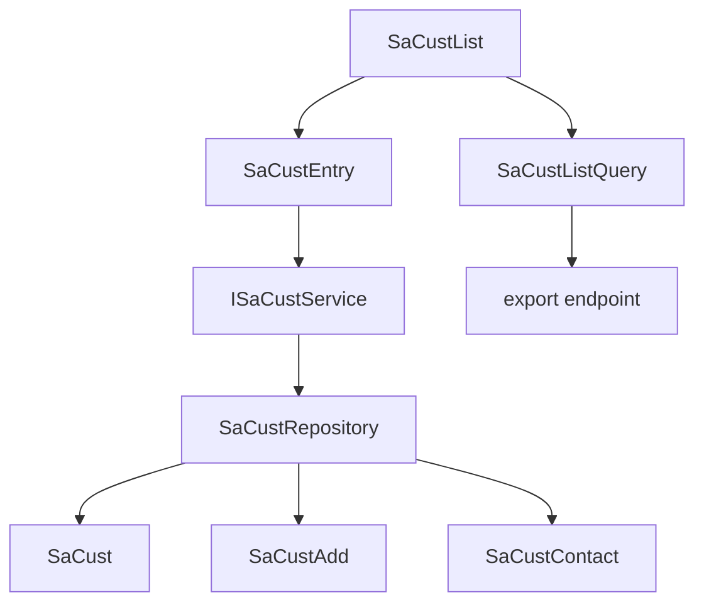

# Customer Profile (Sales / Master)

Clone **Item Master**, not Stock Return.

Menu: **Sales → Master → Customer Profile**. Routes: `/sales/customers`.

**Agent guardrails:** inspect Item Master and live `SaCust`/`SaCustAdd`/`SaCustContact` before coding; do not assume PK/FK until inspection completes; write and validate the migration against existing data; implement service/tests before Razor UI; do not modify unrelated ERP modules.

## Locked decisions

- **Template / chrome:** Item Master + [inventory-chrome.css](ErpWeb/wwwroot/css/inventory-chrome.css). No Stock Return CSS.
- **Keys:** natural keys, not surrogate `Id`. Same style as Item Master.
  - `SaCust` PK: `(CompanyCode, CustCode)` unless live `CustCode`-only PK cannot be rebuilt
  - `SaCustAdd` / `SaCustContact` PK: `(CompanyCode, CustCode, Line)` + FK to `SaCust`
  - Lookups: `(CompanyCode, Code)` if company-scoped; else keep live code PK
  - Concurrency: `SaCust.RowVersion` only. URLs `{*CustCode}`
  - `SaCustComplaint` identity `ID` — out of scope
- **Uniqueness (physical, explicit):**
  - New-system default: **UNIQUE/PK `(CompanyCode, CustCode)`**
  - If legacy PK forces global `CustCode`, retain **global UNIQUE/PK on `CustCode`**
  - Service `Exists` is UX only. **Database unique constraint is the final authority.** Catch unique violation → `DuplicateKey`
- **Company:** `IInventoryTenantContext` only. Never from request. Filter masters by `CompanyCode`, never `BranchCode`.
- **EF aggregate save (P0 — unambiguous):** exactly **one** concurrency-aware header update, cloned from [IvStockMasterService.cs](ErpWeb.Core/Inventory/IvStockMasterService.cs) (`OriginalValue` + `DbUpdateConcurrencyException`). **Two `SaveChanges` in one transaction:** (1) header only = concurrency gate; (2) children only. No second header mutation after the gate. Children never written if the gate fails.
- **Bulk:** validate **all** tokens (RowVersion + references) before the first mutation; one transaction; each row uses the **caller-supplied** `RowVersion`. No unconditional bulk updates.
- **Nullable snapshot / AppInvoice OFF / ContactPerson = current first contact / deactivate-as-lifecycle / reload-not-retry-save / no invented min-max / no password-taxpayer:** unchanged from prior lock.

## Target PK / FK

No surrogate IDs. Default `(CompanyCode, CustCode)` like [IvStockMasterConfiguration](ErpWeb.Model/Configurations/Inventory/IvStockMasterConfiguration.cs).

Live `CustCode`-only PK that cannot be rebuilt → preserve global uniqueness; still filter by `CompanyCode`; still put `CompanyCode` on children.

**Migration must PRINT exactly one of:** `PER_COMPANY_KEY_APPLIED` | `LEGACY_GLOBAL_KEY_PRESERVED` | `MIGRATION_ABORTED`. No silent key choice.

## 1. Schema first

Dump columns, PK/FK, indexes. Confirm loose Cust/Customer/Debtor/BillTo columns via code/semantics; do not assume `%Cust%` is a reference.

### Migration

`SET XACT_ABORT ON` + TRY/CATCH + ROLLBACK + `THROW`. Idempotent. Never drop an old key before the replacement is validated.

**Child `CompanyCode` path — apply to BOTH `SaCustAdd` AND `SaCustContact`:**

1. Detect whether the table exists.
2. If it does **not** exist: `CREATE` with PK `(CompanyCode, CustCode, Line)`, `CompanyCode` NOT NULL, FK to `SaCust`. Done.
3. If it exists and is **empty**: same as create (add missing columns/keys); skip backfill.
4. If it exists and is **populated**:
   - Detect whether `CompanyCode` exists.
   - If missing: add **nullable** `CompanyCode`.
   - Map every child `CustCode` to **exactly one** parent `SaCust` company (using the uniqueness rule already printed).
   - Abort (`MIGRATION_ABORTED`, ROLLBACK) on zero matches (orphan), multiple matches (ambiguous), or leftover NULL after backfill.
   - Backfill → verify zero NULLs → `ALTER` NOT NULL.
   - Rebuild PK to `(CompanyCode, CustCode, Line)`.
   - Add FK `(CompanyCode, CustCode)` → `SaCust`.
   - Validate; only then COMMIT that section.

Do not add `CompanyCode NOT NULL` in one step on a populated table.

**Post-migration checklist (script FAIL unless all true):**

- PK columns match the intended key
- FK exists, is **enabled and trusted** (`is_disabled = 0` and `is_not_trusted = 0`)
- Every child has exactly one parent; no orphan; no NULL `CompanyCode`
- No duplicate customer identity; no duplicate `(CompanyCode, CustCode, Line)`
- Required indexes exist
- App can load a known multi-company sample aggregate (or a documented skip if only one company exists)

Header additive columns: nullable, no default, no backfill. `RowVersion` auto-fills.

**Index log:** existing / needed / missing / create.

## 2. Menu and permissions

[menus.xml](ErpWeb/Menus/menus.xml): Sales after Inventory. `SA_CUST`. ACCESS / ADD / EDIT / DELETE / EXPORT. Re-check on the operation.

## 3. Backend — EF save mechanics (P0)

Clone Item Master tracking: `GetTrackedAsync`, `entry.Property(x => x.RowVersion).OriginalValue = model.RowVersion`, `DbUpdateConcurrencyException`.

**Edit save, one `Database.BeginTransaction`:**

1. Load **tracked** `SaCust` for `(CompanyCode, CustCode)`.
2. Validate VM, lookups, required fields, uniqueness pre-check.
3. Apply header writes on the tracked entity (nullable columns only if they differ from the load snapshot). Include Line-1 contact columns and AppInvoice/AppShip copy-or-leave rules **on the header** here.
4. `SaveChanges` **#1 — header only.** Do not have child entities in the change tracker yet. This UPDATE uses EF `rowversion` (`WHERE … RowVersion = original`). 0 rows / `DbUpdateConcurrencyException` → rollback → return `Concurrency`.
5. Assert: failed gate ⇒ **zero** child DELETE, **zero** child INSERT, **zero** persisted header change.
6. On success, `Reload` header so the new `RowVersion` is in memory. **Do not change any `SaCust` scalar after this** (no second header UPDATE).
7. Replace children: `RemoveRange` existing `SaCustAdd` / extra `SaCustContact` for that company+customer; `Add` submitted rows with server `Line` 1..N.
8. `SaveChanges` **#2 — children only.** Any exception → rollback entire transaction (header gate included).
9. Commit. Unique violation → `DuplicateKey`.

**Do not** mix header+children in a single `SaveChanges` (EF may emit child DELETE before the concurrency UPDATE). **Do not** `ExecuteUpdate` the header and also `SaveChanges` the same tracked header (double update).

**Delete / SetActive:** same `OriginalValue` pattern as Item Master [SetActiveAsync](ErpWeb.Core/Inventory/IvStockMasterService.cs). Delete: lock row, scan confirmed references, then delete with RowVersion in the same transaction.

**Bulk activate/deactivate/delete:** load all targets with caller tokens first; if any missing, stale, or referenced → fail the whole batch with **no** mutations; else apply all in one transaction, each row’s `OriginalValue` = that row’s token.

**Lookups / export:** unchanged. Export does not bind `CompanyCode`.

## 4. Required fields

Load always.

**New:** `CustCode`, `CustName`, `CustType`, `PayCode`, `Currency`, `GlCode`.

**Edit always:** `CustName`, `CustType`, `PayCode`, `Currency`.

**Edit `GlCode` required iff any of these payment/credit fields differ from the load snapshot:** `PayCode`, `Currency`, `Taxable`, `TaxGrCode`, `GstregNo`, `GroupDiscount`, `DiscountMethod`, `PriceMethod`, `AgingType`, `PaidUpCapital`, `GlCode`, `OpeningAmount`, `CreditTerm`, `CreditLimit`, `CustPriceCode`.

Not triggers: telephone, addresses, name, active, salesman, AppInvoice/AppShip. Phone-only + empty `GlCode` → save succeeds.

## 5. UI

Item Master list clone. Entry `{*CustCode}`. `IsSubmitting` try/finally. Unknown save outcome → reload, not retry Save.

## 6. Tests

**SQLite:** leftover stamp; tenant children; uniqueness; trim/immutable; access denied; activate/deactivate/delete stale tokens; bulk all-or-nothing **before first mutation**; child insert fail rolls back header; AppInvoice ON; AppInvoice OFF + General changed → Inv* unchanged; phone-only empty GlCode; snapshot nulls; lookup reject; line-1 promotion; export ignores CompanyCode; sort fallback; **concurrency fail → no child SQL and no header persist** (assert counts).

**SQL Server:** B header then A stale; B address-only then A phone-only; B contact-only then A stale; unique constraint DuplicateKey; SQLite is not `rowversion` proof.

## 7. Files

[menus.xml](ErpWeb/Menus/menus.xml), [MenuCodes.cs](ErpWeb.Core/Menus/MenuCodes.cs), `scripts/alter-sacust-profile.sql`, model, `ErpWeb.Core/Sales/*`, export endpoint, UI, `SaCustServiceTests.cs`, `SaCustSqlServerConcurrencyTests.cs`.

## 8. Implementation order

1. Inspect Item Master + live `SaCust`/`SaCustAdd`/`SaCustContact`
2. Natural keys; print key outcome
3. TRY/CATCH migration including **both** child tables; trusted-FK checklist
4. Entities / UNIQUE matching printed rule / RowVersion
5. Repository
6. Service two-phase save
7. SQLite tests including concurrency-gate child-zero
8. SQL Server concurrency
9. List → export → entry → browser → DBA review

## Risks

- Ambiguous child backfill → `MIGRATION_ABORTED`, no PK change.
- Loose refs: residual delete race; prefer deactivate.
- `{*CustCode}` required.
- Role grants after menu sync.
- Do not change unrelated modules.
