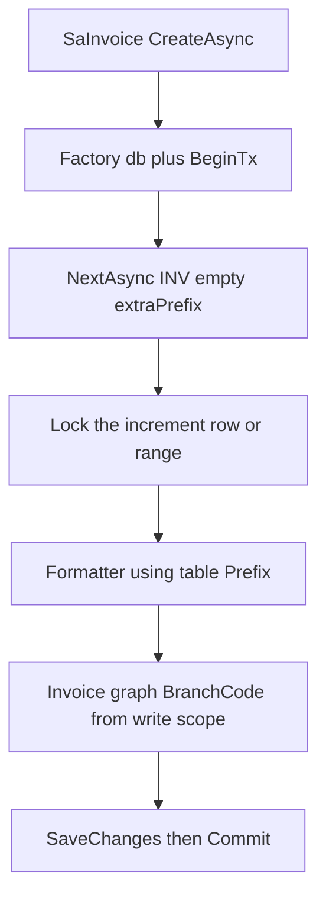
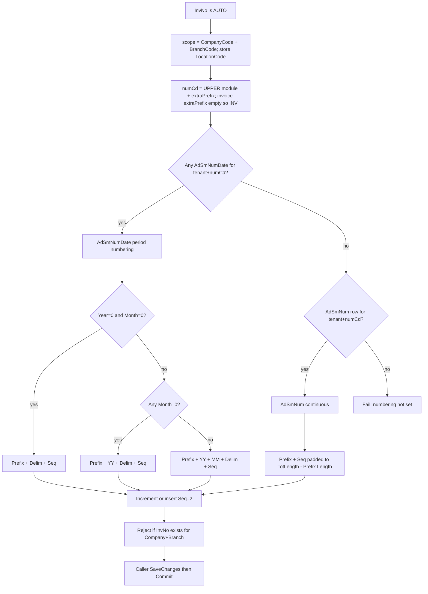

# Document Numbering Service (ErpWeb / net10projects)

This is the **implementation specification** for `c:\wincom\net10projects` only.

**Hard constraints:**

- Do **not** change the ASP.NET V5.5 repo. V5.5 paths below are historical notes only, not work items.
- Do **not** migrate inventory `IV_BATCH` off `MsRunningNo` / `IRunningNumberService` in this work.
- Admin UI for numbering is out of scope; use hand-written seed script for day-1.

**How this spec knows the tables:**

- **Table shape** comes from the user’s live DDL (`CREATE TABLE` for `AdSmNum` / `AdSmNumDate`). [`ErpWeb.Model`](c:\wincom\net10projects\ErpWeb.Model) has **no** `AdSmNum` / `AdSmNumDate` entities today — only `MsRunningNo`.
- **Generate / increment behaviour** is adapted from V5.5 (`GenerateAutoNumber`, `GenerateAutoNumberWithDateEx`, `UpdateSequenceNoWithDateEx`) with ErpWeb multi-tenant extensions. Do **not** map to the older V5.5 LINQ composite PK. Map to the user’s live DDL (`uid` identity PK on `AdSmNumDate`, nullable Year/Month/NumCd, `RowVersion`).
- **Table names stay** `dbo.AdSmNum` and `dbo.AdSmNumDate`. Do not rename existing columns. **Add** tenant columns when creating or altering empty tables.

## Multi-tenant columns

Both numbering tables get:

| Column | Type | Required | In unique / lookup key? |
|---|---|---|---|
| `CompanyCode` | nvarchar(10) | NOT NULL | Yes |
| `BranchCode` | nvarchar(10) | NOT NULL | Yes |
| `LocationCode` | nvarchar(20) | NULL | **No** — stamp only |

**Isolation grain: company + branch.** HQ and Branch B each have their own `INV` sequence. Locations under the same branch share one sequence.

### LocationCode vs BranchCode (they are not equal)

Do **not** set `LocationCode = BranchCode`. They are separate claims on [`InventoryTenantContext`](c:\wincom\net10projects\ErpWeb.Core\Inventory\InventoryTenantContext.cs):

- **BranchCode** (max 5 on claims, nvarchar(10) on tables): isolation grain for numbering and invoice PK. Example: `HQ`.
- **LocationCode** (max 10 on claims): write-scope stamp only. Not in the numbering unique key. Example in this repo: warehouse/location `MAIN`.
- On increment/insert, store the current write-scope `LocationCode` (at most 10 characters from scope, even if the column is nvarchar(20)).
- Invoice header already writes both from write context; keep that.

All lookups, routing, and locks must include `CompanyCode` + `BranchCode` (never NumCd alone). Never accept Company/Branch/Location from method parameters — inject write/read scope (`TryWriteScope` / `TryBranchScope`).

### Branch scope security (hard rule)

`BranchCode` from UI, route (`/sales/invoices/{mode}/{InvNo}`), or request body **must never** override the authenticated user’s branch. [`ValidateUserContext`](c:\wincom\net10projects\ErpWeb.Core\Sales\SaInvoiceService.cs) / `ValidateWriteContext` are authoritative. Repository methods receive branch from that scope only. Keeping InvNo-only URLs is OK because the service always scopes by claim branch.

---

## Invoice uniqueness — Option A (branch-isolated numbers)

Today [`SaInvoiceConfiguration`](c:\wincom\net10projects\ErpWeb.Model\Configurations\Sales\SaInvoiceConfiguration.cs) PK is `(CompanyCode, InvNo)`. Detail FK and `UQ_SaInvoiceDetail_Company_InvNo_Line` are company+InvNo only. That **conflicts** with company+branch sequences (`DEMO/HQ` and `DEMO/BR2` can both issue `INV2609-0001`).

**Decision: Option A.** Keep numbering isolation as company+branch. Change invoice uniqueness to match:

- `SaInvoice` PK: `(CompanyCode, BranchCode, InvNo)`. `BranchCode` becomes required (nvarchar(10) NOT NULL).
- `SaInvoiceDetail` FK: `(CompanyCode, BranchCode, InvNo)`. Unique line index: `(CompanyCode, BranchCode, InvNo, Line)`.
- Add `BranchCode` to detail (required) if not already populated on insert.
- Update every lock/get/search/post/rollback/shipment and any `WHERE CompanyCode AND InvNo` to include `BranchCode`.
- List is **current branch only** (not company-wide).
- Line-count grouping must include `BranchCode` (today it groups by `InvNo` only — that becomes ambiguous under Option A).
- Duplicate check after generate: same company+branch+InvNo, not company+InvNo.

Surfaces that must take / filter `BranchCode` after Option A:

- [`SaInvoiceRepository`](c:\wincom\net10projects\ErpWeb.Model\Repositories\Sales\SaInvoiceRepository.cs) `LockForUpdateAsync`, `GetWithDetailsAsync`, `SearchPagedAsync`
- [`SaInvoiceService`](c:\wincom\net10projects\ErpWeb.Core\Sales\SaInvoiceService.cs) Get / Update / Post / Rollback / shipment / list line counts

### SaInvoice production migration (do not blindly `dotnet ef` drop PK)

[`SaInvoice.BranchCode`](c:\wincom\net10projects\ErpWeb.Model\Entities\Sales\SaInvoice.cs) is already nullable; Create already writes the write-scope branch. Historical rows may still be null or wrong.

Required order (hand-written SQL):

1. Inspect live `SaInvoice` / `SaInvoiceDetail` for null/blank `BranchCode` and for duplicate `(CompanyCode, BranchCode, InvNo)` after backfill.
2. Backfill from existing `SaInvoice.BranchCode` only. **Do not guess silently in invoice save.** Fail the migration script if any row still has null/blank BranchCode.
3. Copy `BranchCode` onto every `SaInvoiceDetail` from its header before FK change.
4. Confirm zero duplicates on the new key.
5. Drop dependent FKs/indexes (`UQ_SaInvoiceDetail_Company_InvNo_Line`, header-detail FK), drop old PK, make `BranchCode NOT NULL`, create new PK `(CompanyCode, BranchCode, InvNo)`, recreate FK/unique indexes.
6. Grep and update every repository lock/get/search, posting, report, and join that assumed `(CompanyCode, InvNo)` uniqueness.

The agent must not drop the old PK before backfill.

**Duplicate protection:** app-level `SELECT` before insert is UX only. The new PK is authoritative. On `DbUpdateException` / SQL 2627/2601 during invoice insert, map to the existing UI message (see Error mapping). Do not show raw SQL to the UI.

---

## Invoice allocation (table-driven; ignore customer InvoicePrefix)

**Confirmed product rule:** numbering is table-driven only.

- Call site: `NextAsync(db, module: "INV", extraPrefix: "", documentDate: invDate, New, "AUTO", ct)`.
- NumCd for invoices is always `INV`. Do **not** concatenate `SaCust.InvoicePrefix`.
- Format Prefix (`{0}`) comes from `AdSmNum` / `AdSmNumDate.Prefix`.
- After issue, persist that **table** Prefix on `SaInvoice.InvPrefix` (what was actually used).
- Customer `InvoicePrefix` remains master data only; it does **not** affect allocation or format.
- `extraPrefix` stays on the API for later series (`INV`+`A` → `INVA`). Invoice v1 passes empty string.
- Remove `GetNextAsync(..., SA_INV_{yyyyMM})` and `FormatInvNo` from invoice Create.

```
numCd = UPPER((module + extraPrefix).Trim())
```

Validate: reject empty; reject length > 10 (`AdSmNum.NumCd` is nvarchar(10); same cap for `AdSmNumDate` so one key works). `INV`+`A` → `INVA` is intentional for future series; do not also seed `NumCd=A` for invoices.

Year/month always come from **document date**, not server today.

---

## Seq meaning (both tables)

**`Seq` is the next sequence number to issue, not the last issued.**

- A newly created period row therefore starts at `Seq=1`.
- After issuing number 1, persist `Seq=2`.
- Increment of an existing row is `Seq++` after the current `Seq` is issued.
- Seed `Seq=1` and missing-period INSERT `Seq=2` (issue 1) are the **same rule**.
- `Seq < 1` is invalid (not only `< 0`).

---

## Routing — AdSmNum vs AdSmNumDate (exact; do not invent)

Tenant key for every lookup: `CompanyCode` + `BranchCode` from authenticated scope, plus `NumCd`. `LocationCode` is never part of the lookup key.

**Which table (routing, once per call):**

1. If **any** `AdSmNumDate` row exists for `(CompanyCode, BranchCode, NumCd)` → use **AdSmNumDate only**. Never read `AdSmNum` for that tenant+NumCd.
2. Else if an `AdSmNum` row exists for `(CompanyCode, BranchCode, NumCd)` → **continuous** `AdSmNum`.
3. Else → `DocumentNumberingNotConfiguredException`. Do **not** insert a default config row.

Never seed both `AdSmNumDate` `(INV, Year=0, Month=0)` and `AdSmNum` `INV` for the same company+branch. A leftover `AdSmNumDate` `Year=0, Month=0` row **wins** and disables monthly reset.

Company A / Branch HQ `INV` is independent of Company A / Branch B `INV`.

### AdSmNumDate row selection (after routing chose date table)

Persist Year/Month sentinels as **`0`, never NULL**.

1. If a row exists with `Year=0 AND Month=0` → lock **that** row; continuous date formula; increment.
2. Else if **any** row has `Month=0`:
   - If exact `Year=docYear, Month=0` exists → lock **that** row; yearly formula; increment.
   - Else current year missing → read latest `Month=0` template (`Year DESC, Month DESC, uid DESC`) for template fields only; **range-lock** the missing key; INSERT `Year=docYear, Month=0, Seq=2` (issue 1); copy template including `NumberingFormat`.
3. Else if exact `Year=docYear, Month=docMonth` exists → lock **that** row; monthly formula; increment.
4. Else current period missing → read latest template for tenant+NumCd (`Year DESC, Month DESC, uid DESC`); range-lock missing key; INSERT current `Year`/`Month`, `Seq=2` (issue 1); copy template. Formula: monthly if template `Year>0` and `Month>0`, else continuous date formula.
5. **No step 5.** Missing config is already a routing failure. Do not auto-create `TotLength=4` or `Year=0, Month=0`.

**Latest template (deterministic):** any “latest” `AdSmNumDate` query MUST order `Year DESC, Month DESC, uid DESC`. Do not use `Created`/`Updated` for this.

### Missing period vs missing configuration

| Situation | Behaviour |
|---|---|
| No `AdSmNumDate` and no `AdSmNum` for tenant+NumCd | **ERROR** — not configured |
| Config exists, current period/year row missing | **INSERT** period row with `Seq=2` after issuing 1 |
| V5.5 “step 5” silent seed | **Removed** — never do this |

---

## Transaction ownership

[`SaInvoiceService`](c:\wincom\net10projects\ErpWeb.Core\Sales\SaInvoiceService.cs) already uses `IDbContextFactory<AppDbContext>` per operation. **Keep that.**

Rules:

- One **factory-created** `AppDbContext` for the **entire** create transaction. Dispose at end (`await using`).
- Pass **that same** `db` into `NextAsync`.
- `NextAsync` **must not** `CreateDbContext`, **must not** `BeginTransaction` / `Commit` / `Rollback`, **must not** `SaveChangesAsync`.
- Sequence UPDATE/INSERT and invoice INSERT participate in **that same transaction**. Independent commit of Seq is a spec violation.
- Overflow and config validation run **before** persist. On those failures Seq is **unchanged** (no UPDATE/INSERT).
- Flow `CancellationToken` into `BeginTransactionAsync`, all EF/SQL in `NextAsync`, `SaveChangesAsync`, and `CommitAsync`. Retry loops must exit immediately when `ct` is cancelled.

```
CreateAsync
  db = _dbFactory.CreateDbContextAsync(ct)
  BeginTransactionAsync(ct)
    NextAsync(db, "INV", "", invDate, New, "AUTO", ct)
    build invoice graph (BranchCode / LocationCode from write scope; InvPrefix from table)
    SaveChangesAsync(ct)        -- invoice only
    CommitAsync(ct)
  dispose db
```



---

## Number reuse (two different events)

- **Database transaction rollback before commit** (failed `SaveChanges`, deadlock, explicit `RollbackAsync` on the create TX): Seq UPDATE/INSERT rolls back. That number is **not** consumed and **may** be issued on the next successful create.
- **After successful commit:** the issued InvNo is **never reused**. Invoice **business** Rollback / unpost / cancel **must not** decrement `AdSmNum` / `AdSmNumDate.Seq`. Those operations are document status changes only.

---

## One allocation algorithm (concurrency contract)

Do not mix ad-hoc `ExecuteUpdate` vs `SaveChanges` vs a second context. On the **supplied** `db` and the **caller’s open transaction**:

```
LOCK row/range (UPDLOCK, ROWLOCK, HOLDLOCK)
  → READ current Seq
  → validate config + overflow (+ formatted length ≤ 30 for invoice)
  → calculate issued document number (Formatter)
  → UPDATE Seq+1  or  INSERT period row Seq=2
  → return issued number
```

Persist Seq only via `ExecuteSql` / `ExecuteSqlInterpolated` on the caller `db`. Never `SaveChanges` inside numbering. Invariant: lock → read → issue → persist next Seq → return, all before the caller’s invoice `SaveChanges`.

On increment/insert also set `LocationCode` (current write scope), `Updated`, `UpdatedUID`.

### Lock targets (must match the row being incremented)

**Continuous `AdSmNum`:**

```sql
SELECT * FROM AdSmNum WITH (UPDLOCK, ROWLOCK, HOLDLOCK)
WHERE CompanyCode=@co AND BranchCode=@br AND NumCd=@numCd
```

**Date exact row (`Y=0 M=0`, yearly `M=0`, or exact `Y+M`):**

```sql
SELECT * FROM AdSmNumDate WITH (UPDLOCK, ROWLOCK, HOLDLOCK)
WHERE CompanyCode=@co AND BranchCode=@br AND NumCd=@numCd AND Year=@y AND Month=@m
```

**Missing period INSERT:** `HOLDLOCK` range on that business key; unique index is required. On SQL 2627/2601: bounded **3** retries → **re-SELECT with lock** → treat as found → increment → **re-format** (do not return the pre-insert number). If still failing → `DocumentNumberingConcurrencyException`. Honour `ct` on each attempt.

`RowVersion` alone is not enough for allocation.

---

## Table A — continuous: `AdSmNum`

PK `(CompanyCode, BranchCode, NumCd)`. One row per tenant+code. Never resets.

**TotLength = full document length** (prefix + digits):

```
docNo = Prefix + Seq.PadLeft(TotLength - Prefix.Length, '0')
```

- Missing row → fail (do not auto-insert).
- `TotLength` must be > `Prefix.Length`.
- No delimiter, no YY/MM in the continuous formula.

Invoice v1 does **not** use continuous seed for DEMO; see DEMO seed below (monthly). Continuous example for tests: `CompanyCode='DEMO', BranchCode='HQ', LocationCode='MAIN', NumCd='INV', Prefix='INV', TotLength=10, Seq=1` → `INV0000001`, …

---

## Table B — period: `AdSmNumDate`

DDL: `uid` identity PK, nullable Year/Month/NumCd, `RowVersion`, `NumberingFormat`. **No composite PK.**

**Business key:** `(CompanyCode, BranchCode, NumCd, Year, Month)`. `uid` is only the identity PK. `LocationCode` is not in the key.

- `TotLength` = **Seq digit count only**, not full doc length.
- Copy `NumberingFormat` (and Prefix, TotLength, delimiter, NumDes as applicable) when inserting a new month/year row.

Increment persist matrix (NEW/COPY or current doc no `AUTO` only):

| Found | Persist |
|---|---|
| Y=0 M=0 | Seq++ |
| M=0 and current year | Seq++ |
| M=0, new year | INSERT Year=docYear, Month=0, Seq=**2**, copy template |
| exact Y+M | Seq++ |
| has NumCd template, period missing | INSERT same Company/Branch, current Location, Year=docYear, Month=docMonth, Seq=**2**, copy template |
| nothing | **ERROR** — no configuration (should be unreachable if routing is correct) |

First save of a new month is the reset (no day-1 job).

---

## Configuration validation (fail, do not repair)

Throw `DocumentNumberingConfigurationException` (or `NotConfigured` when no row). Do not fix admin data during invoice create.

**AdSmNum:** NumCd invalid (empty / >10); `TotLength <= Prefix.Length`; `Seq < 1`; Prefix longer than nvarchar(10).

**AdSmNumDate:** `TotLength` null or `<= 0`; `Seq` null when allocating from that row; `Seq < 1`; `Year` null or `< 0` or `> 2099`; `Month` null or not in `0..12`; invalid NumberingFormat (`{1}` missing); NumCd invalid.

---

## Sequence overflow and length limits

If the issued Seq digit length exceeds the pad width, throw `DocumentNumberingOverflowException` — do not emit a longer document number. **Do not** UPDATE/INSERT Seq on overflow.

- AdSmNum: `Seq.ToString().Length > (TotLength - Prefix.Length)`
- AdSmNumDate / format `{1}`: `Seq.ToString().Length > TotLength`
- Max Seq for width 4 → `1`..`9999` OK; `10000` overflow.
- Formatted document number length `> 30` (`SaInvoice.InvNo` nvarchar(30)) → same overflow failure / same invoice error mapping.

Example: TotLength=4, Seq=9999 ok (`0001`..`9999`); next 10000 fails.

---

## DocumentNumberFormatter

Pure function, no database. Unit-test independently.

**Blank / null `NumberingFormat`:** use the mode formula. Apply `Trim(NumberingDelimeter)` between date parts and Seq. `TotLength` pads Seq only (AdSmNumDate) or `TotLength - Prefix.Length` (AdSmNum continuous).

**Non-blank format:** delimiter is **not** applied separately — only what the template contains.

| Token | Meaning |
|---|---|
| `{0}` | Prefix as stored (may be empty) |
| `{1}` | Seq padded with zeros to `TotLength` (AdSmNumDate digit width). **Required.** If missing after parse → fail |
| `YYYY` then `YY` | document year; replace `YYYY` first |
| `MM` | month 2 digits |
| `DD` | document day 2 digits |

- `{0}` omitted → Prefix is not auto-prepended.
- `TotLength` always pads `{1}` only. Extra characters in the template are not padded.
- After replace, leftover `{0}` or `{1}` → fail (invalid template).
- Other unknown characters stay as literal text.
- Empty Prefix + `{0}YYMM-{1}` is allowed (leading date).

---

## Architecture (ErpWeb.Core)

```
Numbering/
  IDocumentNumberingService
  DocumentNumberingService
  DocumentNumberRequestMode
  DocumentNumberFormatter
  DocumentNumberingNotConfiguredException
  DocumentNumberingConfigurationException
  DocumentNumberingOverflowException
  DocumentNumberingConcurrencyException
  DuplicateDocumentNumberException
```

Never leak `SqlException` / `DbUpdateException` / timeout text to Blazor UI. Map in the service or invoice layer. Do not retry indefinitely (max 3 for numbering insert race only).

Keep `IRunningNumberService` / `MsRunningNo` for inventory `IV_BATCH` until a later migration. Invoice switches to the new service first.

### Service API

```csharp
public enum DocumentNumberRequestMode { New, Copy, Edit }

public interface IDocumentNumberingService
{
    Task<string> NextAsync(
        AppDbContext db,
        string module,
        string extraPrefix,
        DateTime documentDate,
        DocumentNumberRequestMode requestMode,
        string currentDocNo,
        CancellationToken ct);
}
```

Inject write scope for Company/Branch/Location/UserId. Do not accept those as method arguments. Pass `ct` into every SQL/EF call.

- `Edit` + `currentDocNo` not `AUTO` → return `currentDocNo`, **no lock, no increment**.
- **COPY:** always allocates a **new** number (`Copy` mode), never reuse the source InvNo. COPY is **same branch only** (current write-scope BranchCode). There is no Copy API in `SaInvoiceService` today; when added, it must follow this.
- **Peek:** separate read-only path. Must not increment, must not UPDLOCK, must **not** be implemented as NextAsync + rollback. Preview only; save path always calls NextAsync.

---

## Error mapping (invoice Create)

Catch in `SaInvoiceService`; never leak SQL text or unhandled domain exceptions to Blazor.

| Failure | SaInvoiceErrorKind | Message |
|---|---|---|
| Missing numbering config | `BusinessRule` | "Invoice numbering is not configured for this company/branch." |
| Invalid Seq / TotLength / format / NumCd | `BusinessRule` | "Invoice numbering is not configured correctly. Contact an administrator." |
| Overflow or InvNo longer than 30 | `BusinessRule` | "The next invoice number exceeds the configured length." |
| Duplicate InvNo (PK 2627/2601) | `Unexpected` | "Invoice number is already used." (keep existing) |
| Deadlock 1205 | `Unexpected` | existing conflict message (keep existing) |

---

## Canonical DDL

### `dbo.AdSmNum` (continuous)

```sql
CREATE TABLE [dbo].[AdSmNum](
	[CompanyCode] [nvarchar](10) NOT NULL,
	[BranchCode] [nvarchar](10) NOT NULL,
	[LocationCode] [nvarchar](20) NULL,
	[NumCd] [nvarchar](10) NOT NULL,
	[NumDes] [nvarchar](30) NULL,
	[TotLength] [smallint] NOT NULL,
	[Prefix] [nvarchar](10) NULL,
	[Seq] [bigint] NOT NULL,
	[Created] [datetime] NULL,
	[Updated] [datetime] NULL,
	[UserID] [nvarchar](10) NULL,
	[UpdatedUID] [nvarchar](10) NULL,
 CONSTRAINT [PK_AdSmNum] PRIMARY KEY CLUSTERED ([CompanyCode], [BranchCode], [NumCd])
)
```

### `dbo.AdSmNumDate` (period / monthly)

```sql
CREATE TABLE [dbo].[AdSmNumDate](
	[uid] [int] IDENTITY(1,1) NOT NULL,
	[CompanyCode] [nvarchar](10) NOT NULL,
	[BranchCode] [nvarchar](10) NOT NULL,
	[LocationCode] [nvarchar](20) NULL,
	[Year] [smallint] NULL,
	[Month] [smallint] NULL,
	[NumCd] [nvarchar](20) NULL,
	[NumDes] [nvarchar](30) NULL,
	[TotLength] [smallint] NULL,
	[Prefix] [nvarchar](20) NULL,
	[Seq] [bigint] NULL,
	[Created] [datetime] NULL,
	[Updated] [datetime] NULL,
	[UserID] [nvarchar](10) NULL,
	[NumberingDelimeter] [nvarchar](5) NULL,
	[RowVersion] [timestamp] NULL,
	[NumberingFormat] [nvarchar](50) NULL,
 CONSTRAINT [PK_AdSmNumDate] PRIMARY KEY CLUSTERED ([uid])
)
ALTER TABLE [dbo].[AdSmNumDate] ADD CONSTRAINT [DF_AdSmNumDate_Created] DEFAULT (getdate()) FOR [Created]
```

**Filtered unique index (exact expression; EF must use matching `HasFilter`):**

```sql
CREATE UNIQUE INDEX UX_AdSmNumDate_Tenant_NumCd_Year_Month
ON dbo.AdSmNumDate (CompanyCode, BranchCode, NumCd, Year, Month)
WHERE NumCd IS NOT NULL AND Year IS NOT NULL AND Month IS NOT NULL;
```

## Suggested EF entities

Keep nullability aligned with DDL. Application **writes** Year/Month as `0` (not null) so period filters work.

```csharp
public class AdSmNum
{
    public string CompanyCode { get; set; } = "";
    public string BranchCode { get; set; } = "";
    public string? LocationCode { get; set; }
    public string NumCd { get; set; } = "";      // nvarchar(10)
    public string? NumDes { get; set; }
    public short TotLength { get; set; }
    public string? Prefix { get; set; }
    public long Seq { get; set; }
    public DateTime? Created { get; set; }
    public DateTime? Updated { get; set; }
    public string? UserID { get; set; }
    public string? UpdatedUID { get; set; }
}

public class AdSmNumDate
{
    public int Uid { get; set; }
    public string CompanyCode { get; set; } = "";
    public string BranchCode { get; set; } = "";
    public string? LocationCode { get; set; }
    public short? Year { get; set; }
    public short? Month { get; set; }
    public string? NumCd { get; set; }
    public string? NumDes { get; set; }
    public short? TotLength { get; set; }
    public string? Prefix { get; set; }
    public long? Seq { get; set; }
    public DateTime? Created { get; set; }
    public DateTime? Updated { get; set; }
    public string? UserID { get; set; }
    public string? NumberingDelimeter { get; set; }
    public byte[]? RowVersion { get; set; }
    public string? NumberingFormat { get; set; }
}
```

EF: `HasKey(x => new { x.CompanyCode, x.BranchCode, x.NumCd })` for `AdSmNum`; `HasKey(x => x.Uid)` for `AdSmNumDate`; unique index on `(CompanyCode, BranchCode, NumCd, Year, Month)` with **`HasFilter`** matching the SQL above. `RowVersion.IsRowVersion()`.

---

## Legacy AdSmNum / AdSmNumDate migration (no silent guess)

This repo has no numbering entities today. Hand-written script behaviour (also covers seed — see next section):

| State | Action |
|---|---|
| Table missing | `CREATE TABLE` with tenant columns and the spec PK/index from day one |
| Table exists, already has `CompanyCode`/`BranchCode` and matching PK/index | no structural change; seed only |
| Table exists **without** tenant columns, **zero rows** | add `CompanyCode`/`BranchCode`/`LocationCode`, drop old PK `NumCd`, add PK `(CompanyCode, BranchCode, NumCd)` (and date unique index) |
| Table exists **without** tenant columns, **any rows** | **FAIL** the script. Do not backfill `DEMO`/`HQ`. Operator must migrate or empty the table. Fail message must state that existing rows without tenant columns cannot be auto-mapped. |

---

## DEMO seed (`scripts/init-adsmnum.sql`)

Invoice v1 uses **monthly `AdSmNumDate`**, not continuous `AdSmNum`. Do **not** seed Seq=0 and do **not** expect `INV26090001` (that is the old `FormatInvNo` shape).

Exact seed row:

| Column | Value |
|---|---|
| `CompanyCode` | `DEMO` |
| `BranchCode` | `HQ` |
| `LocationCode` | `MAIN` |
| `NumCd` | `INV` |
| `Year` | `2026` |
| `Month` | `9` |
| `Prefix` | `INV` |
| `TotLength` | `4` (Seq digit width only) |
| `NumberingDelimeter` | `-` |
| `NumberingFormat` | NULL/blank (mode formula) |
| `Seq` | `1` (next to issue; first save consumes 1 and persists 2) |

**First generated number** for InvDate in Sep 2026: `INV2609-0001`. October: `INV2610-0001`.

**Idempotency:** `IF NOT EXISTS` on `(DEMO, HQ, INV, 2026, 9)`. If the row exists, do **not** update Seq (never reset a live counter). Script is safe to re-run.

Do **not** also insert `AdSmNum` `INV` for DEMO/HQ.

---

## Current Blazor vs target

Today [`RunningNumberService`](c:\wincom\net10projects\ErpWeb.Core\Numbering\RunningNumberService.cs) allocates an `int` from `MsRunningNo` (`LastNo` = last issued). Invoice save uses key `SA_INV_{yyyyMM}` then formats `{prefix}{yy}{MM}{seq:D4}` with **no delimiter**, and uses `SaCust.InvoicePrefix` as the display prefix.

Target: one document-numbering service that returns the **full string** from `AdSmNum` / `AdSmNumDate`, inside the same save transaction, with Prefix from the numbering table only.



---

## Tests (`ErpWeb.Tests`) — mandatory

### Test ownership

- **SQLite** [`SaInvoiceServiceTests`](c:\wincom\net10projects\ErpWeb.Tests\SaInvoiceServiceTests.cs): **mock** `IDocumentNumberingService`. Do **not** emulate UPDLOCK or SQL Server range locks. Update asserts off `INV26090001` / `MsRunningNo SA_INV_202609`.
- **SQL Server** tests own numbering persistence and concurrency. Skip if no connection string (same pattern as [`SaInvoiceSqlServerConcurrencyTests`](c:\wincom\net10projects\ErpWeb.Tests\SaInvoiceSqlServerConcurrencyTests.cs)).

### Unit / formatter

Continuous padding; date padding; `{0}YYMM-{1}`; `{1}` required; YYYY vs YY; DD; delimiter only when format blank; invalid template; overflow; formatted length > 30.

### Continuous / monthly / yearly / routing / tenant

- Continuous: first number; increment; missing config → `NotConfigured`; invalid TotLength; overflow; Seq unchanged on overflow.
- Monthly: first = 1; second = 2; new month resets to 1; concurrent first-month (2 and **10**); template fields copied.
- Yearly: same year increments; new year resets; latest template order `Year DESC, Month DESC, uid DESC`.
- Routing: AdSmNumDate wins if any row; AdSmNum only if no date rows; no config fails; Year=0/Month=0 precedence.
- Tenant: A/HQ vs A/BranchB independent; Company B independent; two locations same branch share Seq.

### Invoice + SQL Server acceptance matrix

| Scenario | Expected |
|---|---|
| 10 concurrent creates, same branch | 10 unique InvNos |
| Same branch + same period | Sequential allocation, no duplicates |
| Different branches | Independent sequences |
| Missing period row | Exactly one valid period row after success |
| Concurrent period-row insert | Duplicate loser re-reads Seq, re-formats, continues |
| TX rollback before commit | Seq restored; number reusable |
| Business Rollback after commit | Seq **not** decremented |
| Customer has `InvoicePrefix` | Generated InvNo still uses table Prefix (`INV2609-0001` for DEMO seed) |
| NEW | Consumes a number |
| EDIT | Does not consume |
| Duplicate InvNo insert | Mapped to existing UI message / error kind |
| Migration | Existing invoices have valid BranchCode; old PK/FK removed and new created in order; repository/posting use BranchCode |

---

## Out of scope

- Changing V5.5 WebForms.
- Migrating `IV_BATCH` off `MsRunningNo`.
- Admin UI for numbering.
- `AdPara.SalesDate` switch.
- Option B (company-global InvNo). Option A is the chosen uniqueness model.
- Implementing this spec in C# as part of a “spec-only” planning pass — a later agent implements from this file.
