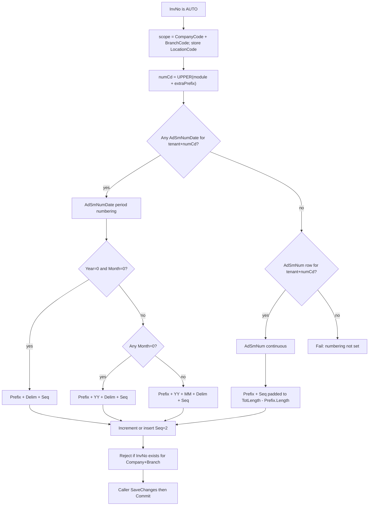

# V5.5 Document Numbering Service (Blazor spec)

This is a **spec for the Blazor agent** in `c:\wincom\net10projects`. Do **not** change the ASP.NET V5.5 repo.

**How this spec knows the tables (it does not guess from ErpWeb):**

- **Table shape** comes from the `CREATE TABLE` scripts the user pasted in this chat. [`ErpWeb.Model`](c:\wincom\net10projects\ErpWeb.Model) has **no** `AdSmNum` / `AdSmNumDate` entities today — only `MsRunningNo`.
- **Generate / increment behaviour** comes from V5.5: [`ERP/SalesForms/InvoiceEntry.aspx.cs`](ERP/SalesForms/InvoiceEntry.aspx.cs) `GenerateInvNo` + [`ERPClasses/Classes/CCommon.cs`](ERPClasses/Classes/CCommon.cs) `GenerateAutoNumber`, `GenerateAutoNumberWithDateEx`, `UpdateSequenceNoWithDateEx`. V5.5 LINQ in [`ERPClasses/BL/ERPAdminDataClasses.designer.cs`](ERPClasses/BL/ERPAdminDataClasses.designer.cs) is **older** (composite PK, NOT NULL Year/Month/NumCd, no `uid` / `RowVersion`). **Do not map to that V5.5 PK.** Map to the user’s live DDL.
- **Table names stay** `dbo.AdSmNum` and `dbo.AdSmNumDate`. Do not rename existing columns. **Add** tenant columns (V5.5 numbering tables have none).

## Multi-tenant columns (Blazor extension)

Both tables get the same three columns as other ErpWeb masters (`SaInvoice` / `SaCurrency`):

| Column | Type | Required | In unique key? |
|---|---|---|---|
| `CompanyCode` | nvarchar(10) | NOT NULL | Yes |
| `BranchCode` | nvarchar(10) | NOT NULL | Yes |
| `LocationCode` | nvarchar(20) | NULL | **No** — persist from write context only |

**Isolation grain: company + branch.** HQ and Branch B each have their own `INV` sequence. Locations under the same branch share one sequence. `LocationCode` records which location last issued (set on insert and on Seq increment).

V5.5 is database-global. This is intentional for ErpWeb multi-tenant.

All lookups, routing, and locks must include `CompanyCode` + `BranchCode` (never NumCd alone).

## Review decisions (must follow)

### 1. Invoice uniqueness — Option A (branch-isolated numbers)

Verified today: [`SaInvoiceConfiguration`](c:\wincom\net10projects\ErpWeb.Model\Configurations\Sales\SaInvoiceConfiguration.cs) PK is `(CompanyCode, InvNo)`. Detail FK and `UQ_SaInvoiceDetail_Company_InvNo_Line` are also company+InvNo only. That **conflicts** with company+branch sequences (`DEMO/HQ` and `DEMO/BR2` can both issue `INV0001`).

**Decision: Option A.** Keep numbering isolation as company+branch. Change invoice uniqueness to match:

- `SaInvoice` PK: `(CompanyCode, BranchCode, InvNo)`. `BranchCode` becomes required (nvarchar(10) NOT NULL).
- `SaInvoiceDetail` FK: `(CompanyCode, BranchCode, InvNo)`. Unique line index: `(CompanyCode, BranchCode, InvNo, Line)`.
- Add `BranchCode` to detail (required) if not already populated on insert.
- Update `SaInvoiceRepository` lock/get/search, posting, and any `WHERE CompanyCode AND InvNo` to include `BranchCode`.
- Duplicate check after generate: same company+branch+InvNo, not company+InvNo.

Get-by-InvNo APIs must be scoped by the write/read branch (or require branch in the route). Do not assume InvNo is unique company-wide.

**Production migration (do not blindly `dotnet ef migration` drop PK):**

[`SaInvoice.BranchCode`](c:\wincom\net10projects\ErpWeb.Model\Entities\Sales\SaInvoice.cs) is already nullable and Create already writes the write-scope branch. Historical rows may still be null or wrong.

Required order:

1. Inspect live `SaInvoice` / `SaInvoiceDetail` for null/blank `BranchCode` and for duplicate `(CompanyCode, BranchCode, InvNo)` after backfill.
2. Decide backfill: prefer existing `SaInvoice.BranchCode`; if null, use a documented default (e.g. company HQ branch) — **do not guess silently in invoice save**. Fail the migration script if any row still has null BranchCode.
3. Copy `BranchCode` onto every `SaInvoiceDetail` from its header before FK change.
4. Confirm zero duplicates on the new key.
5. Drop dependent FKs/indexes (`UQ_SaInvoiceDetail_Company_InvNo_Line`, header-detail FK), drop old PK, add `BranchCode NOT NULL`, create new PK `(CompanyCode, BranchCode, InvNo)`, recreate FK/unique indexes.
6. Grep and update every repository lock/get/search, posting, report, and join that assumed `(CompanyCode, InvNo)` uniqueness (`SaInvoiceRepository.LockForUpdateAsync`, invoice Get/Post/Rollback, batch `InvNo` filters).

Hand-written SQL (or a carefully reviewed migration) is required. The agent must not drop the old PK before backfill.

**Duplicate protection:** app-level `SELECT` before insert is UX only. The new PK is authoritative. On `DbUpdateException` / SQL 2627/2601 during invoice insert, map to `DuplicateDocumentNumberException` — do not show raw SQL to the UI.

### 2. Transaction ownership and Blazor Server DbContext lifetime

[`SaInvoiceService`](c:\wincom\net10projects\ErpWeb.Core\Sales\SaInvoiceService.cs) already uses `IDbContextFactory<AppDbContext>` per operation (`CreateDbContextAsync` then `BeginTransactionAsync`). **Keep that.**

Rules:

- One **factory-created** `AppDbContext` for the **entire** create/copy transaction. Dispose it at the end of the operation (`await using`).
- Pass **that same** `db` into `NextAsync`. `DocumentNumberingService` must never `CreateDbContext`, never begin/commit/rollback, never `SaveChangesAsync`.
- Do not use a long-lived scoped DbContext shared across Blazor circuits or concurrent UI clicks.
- Flow `CancellationToken` into `BeginTransactionAsync`, all EF/SQL in `NextAsync`, `SaveChangesAsync`, and `CommitAsync`. Retry loops must exit immediately when `ct` is cancelled.

```
CreateAsync
  db = _dbFactory.CreateDbContextAsync(ct)
  BeginTransactionAsync(ct)
    NextAsync(db, ...)          -- lock, read Seq, issue, update/insert Seq
    build invoice graph
    SaveChangesAsync(ct)        -- invoice only
    CommitAsync(ct)
  dispose db
```

### 3. One allocation algorithm (concurrency contract)

Do not mix ad-hoc `ExecuteUpdate` vs `SaveChanges` vs a second context. On the **supplied** `db` and the **caller’s open transaction**:

```
LOCK row/range (UPDLOCK, ROWLOCK, HOLDLOCK)
  → READ current Seq
  → validate config + overflow
  → calculate issued document number (Formatter)
  → UPDATE Seq+1  or  INSERT period row Seq=2
  → return issued number
```

Raw SQL via `FromSqlInterpolated` / `ExecuteSqlInterpolated` on that `db` is allowed. Invariant: lock → read → issue → persist next Seq → return, all before the caller’s invoice `SaveChanges`.

New-period race: unique index + catch duplicate-key → re-SELECT with lock → treat as found row → UPDATE (bounded 3 retries) → `DocumentNumberingConcurrencyException` if still failing. Honour `ct` on each attempt.

### 4. No silent numbering configuration

**No configuration** (no `AdSmNumDate` and no `AdSmNum` for tenant+NumCd) → **ERROR**. Do not insert `Year=0, Month=0` or `INV001`.

**Configuration exists, current period missing** → INSERT current period row (Seq=2 after issuing 1).

Remove V5.5 generate step 5 fallback and increment “nothing → insert TotLength=4” from this Blazor service.

## Architecture (ErpWeb.Core)

```
Numbering/
  IDocumentNumberingService
  DocumentNumberingService
  DocumentNumberRequestMode
  DocumentNumberFormatter
  DocumentNumberingNotConfiguredException
  DocumentNumberingConfigurationException
  DocumentNumberingOverflowException
  DocumentNumberingConcurrencyException
  DuplicateDocumentNumberException
```

Never leak `SqlException` / `DbUpdateException` / timeout text to Blazor UI. Map in the service or invoice layer. Do not retry indefinitely (max 3 for numbering insert race only).

Tenant/user come from injected write context (`TryWriteScope`), not method parameters. LocationCode stored only.

## Canonical DDL (user scripts + tenant columns)

### `dbo.AdSmNum` (continuous)

Replace PK `NumCd` with `(CompanyCode, BranchCode, NumCd)`. If the table already exists from the pasted script, ALTER: add the three columns, drop `PK_AdSmNum`, add the new PK.

```sql
CREATE TABLE [dbo].[AdSmNum](
	[CompanyCode] [nvarchar](10) NOT NULL,
	[BranchCode] [nvarchar](10) NOT NULL,
	[LocationCode] [nvarchar](20) NULL,
	[NumCd] [nvarchar](10) NOT NULL,
	[NumDes] [nvarchar](30) NULL,
	[TotLength] [smallint] NOT NULL,
	[Prefix] [nvarchar](10) NULL,
	[Seq] [bigint] NOT NULL,
	[Created] [datetime] NULL,
	[Updated] [datetime] NULL,
	[UserID] [nvarchar](10) NULL,
	[UpdatedUID] [nvarchar](10) NULL,
 CONSTRAINT [PK_AdSmNum] PRIMARY KEY CLUSTERED ([CompanyCode], [BranchCode], [NumCd])
)
```

### `dbo.AdSmNumDate` (period / monthly)

```sql
CREATE TABLE [dbo].[AdSmNumDate](
	[uid] [int] IDENTITY(1,1) NOT NULL,
	[CompanyCode] [nvarchar](10) NOT NULL,
	[BranchCode] [nvarchar](10) NOT NULL,
	[LocationCode] [nvarchar](20) NULL,
	[Year] [smallint] NULL,
	[Month] [smallint] NULL,
	[NumCd] [nvarchar](20) NULL,
	[NumDes] [nvarchar](30) NULL,
	[TotLength] [smallint] NULL,
	[Prefix] [nvarchar](20) NULL,
	[Seq] [bigint] NULL,
	[Created] [datetime] NULL,
	[Updated] [datetime] NULL,
	[UserID] [nvarchar](10) NULL,
	[NumberingDelimeter] [nvarchar](5) NULL,
	[RowVersion] [timestamp] NULL,
	[NumberingFormat] [nvarchar](50) NULL,
 CONSTRAINT [PK_AdSmNumDate] PRIMARY KEY CLUSTERED ([uid])
)
ALTER TABLE [dbo].[AdSmNumDate] ADD CONSTRAINT [DF_AdSmNumDate_Created] DEFAULT (getdate()) FOR [Created]
```

Unique index (period + tenant):

```sql
CREATE UNIQUE INDEX UX_AdSmNumDate_Tenant_NumCd_Year_Month
ON dbo.AdSmNumDate (CompanyCode, BranchCode, NumCd, Year, Month)
WHERE NumCd IS NOT NULL AND Year IS NOT NULL AND Month IS NOT NULL;
```

## Suggested EF entities (same names/columns)

Keep nullability aligned with DDL. Application **writes** Year/Month as `0` (not null) so V5.5 filters work.

```csharp
public class AdSmNum
{
    public string CompanyCode { get; set; } = "";
    public string BranchCode { get; set; } = "";
    public string? LocationCode { get; set; }
    public string NumCd { get; set; } = "";      // nvarchar(10)
    public string? NumDes { get; set; }
    public short TotLength { get; set; }
    public string? Prefix { get; set; }
    public long Seq { get; set; }
    public DateTime? Created { get; set; }
    public DateTime? Updated { get; set; }
    public string? UserID { get; set; }
    public string? UpdatedUID { get; set; }
}

public class AdSmNumDate
{
    public int Uid { get; set; }
    public string CompanyCode { get; set; } = "";
    public string BranchCode { get; set; } = "";
    public string? LocationCode { get; set; }
    public short? Year { get; set; }
    public short? Month { get; set; }
    public string? NumCd { get; set; }
    public string? NumDes { get; set; }
    public short? TotLength { get; set; }
    public string? Prefix { get; set; }
    public long? Seq { get; set; }
    public DateTime? Created { get; set; }
    public DateTime? Updated { get; set; }
    public string? UserID { get; set; }
    public string? NumberingDelimeter { get; set; }
    public byte[]? RowVersion { get; set; }
    public string? NumberingFormat { get; set; }
}
```

EF: `HasKey(x => new { x.CompanyCode, x.BranchCode, x.NumCd })` for `AdSmNum`; `HasKey(x => x.Uid)` for `AdSmNumDate`; unique index on `(CompanyCode, BranchCode, NumCd, Year, Month)`. `RowVersion.IsRowVersion()`. Max lengths 10 / 10 / 20 to match other ErpWeb masters.

## Current Blazor vs target

Today [`ErpWeb.Core/Numbering/RunningNumberService.cs`](c:\wincom\net10projects\ErpWeb.Core\Numbering\RunningNumberService.cs) allocates an `int` from `MsRunningNo` (`LastNo` = last issued). Invoice save in [`SaInvoiceService.cs`](c:\wincom\net10projects\ErpWeb.Core\Sales\SaInvoiceService.cs) uses key `SA_INV_{yyyyMM}` then formats `{prefix}{yy}{MM}{seq:D4}` with **no delimiter**.

Target: one document-numbering service that returns the **full string** from `AdSmNum` / `AdSmNumDate`, inside the same save transaction.

Keep `IRunningNumberService` / `MsRunningNo` for inventory `IV_BATCH` until a later migration. Invoice (and other sales/purchasing docs) switch to the new service first.



## Routing rule (one table per tenant + NumCd)

Scope every query with `CompanyCode` + `BranchCode`.

- If **any** `AdSmNumDate` row exists for that tenant + `NumCd` → **AdSmNumDate only**.
- Else if `AdSmNum` row exists for that tenant + `NumCd` → **continuous**.
- Else fail: numbering not configured for this company/branch.
- Never seed both `(INV, 0, 0)` on `AdSmNumDate` **and** an `AdSmNum` `INV` row **for the same company+branch**.
- A leftover `AdSmNumDate` `Year=0, Month=0` row for that tenant **wins** and disables monthly reset.
- Company A / Branch HQ `INV` is independent of Company A / Branch B `INV`.

**NumCd** (canonical business key, both tables):

```
numCd = UPPER((module + extraPrefix).Trim())
```

Validate: reject empty; reject length > 10 (`AdSmNum.NumCd` is nvarchar(10); same cap for `AdSmNumDate` so one key works). Document that `INV`+`A` → `INVA` is intentional; do not also seed `NumCd=A` for invoices.

Year/month always come from **document date**, not server today.

## Table A — continuous: `AdSmNum`

PK `(CompanyCode, BranchCode, NumCd)`. One row per tenant+code. Never resets.

**TotLength = full document length** (prefix + digits):

```
docNo = Prefix + Seq.PadLeft(TotLength - Prefix.Length, '0')
```

- Missing row → fail (do not auto-insert).
- `TotLength` must be > `Prefix.Length`.
- `Seq` is the **next** number. After issue: `Seq++`, set `Updated`, `UpdatedUID`.
- No delimiter, no YY/MM.

Seed: `CompanyCode='DEMO', BranchCode='HQ', LocationCode='MAIN', NumCd='INV', Prefix='INV', TotLength=10, Seq=1` → `INV0000001`, …

Lock:

```sql
SELECT * FROM AdSmNum WITH (UPDLOCK, ROWLOCK, HOLDLOCK)
WHERE CompanyCode=@co AND BranchCode=@br AND NumCd=@numCd
```

On increment also set `LocationCode` (current), `Updated`, `UpdatedUID`.

## Table B — period: `AdSmNumDate`

User DDL: `uid` identity, nullable Year/Month/NumCd, `RowVersion`, `NumberingFormat`. **No composite PK.**

**Business key:** `(CompanyCode, BranchCode, NumCd, Year, Month)`. `uid` is only the identity PK. `LocationCode` is not in the key.

Must-dos:

- Persist **`0`, never NULL**, for Year/Month sentinels.
- Unique index: `(CompanyCode, BranchCode, NumCd, Year, Month)` where NumCd/Year/Month are not null.
- `TotLength` = **Seq digit count only**, not full doc length.
- `Seq` = next to issue.
- Copy `NumberingFormat` when inserting a new month/year row.

Generate priority (same as `GenerateAutoNumberWithDateEx`, **tenant-scoped**). Routing already failed if no rows exist.

1. `Year=0 AND Month=0` → continuous formula
2. Else any `Month=0`:
   - exact `Year=docYear, Month=0` → use that Seq
   - else Seq=1, copy template from latest Month=0 row for this tenant+NumCd
   → yearly formula
3. Else exact `Year=docYear, Month=docMonth` → monthly formula
4. Else latest template for **this tenant + NumCd**, Seq=1 (current period missing)
   - if template Year>0 and Month>0 → monthly formula
   - else continuous formula

There is **no** step 5 auto-create config.

**Latest template (deterministic):** any “latest” `AdSmNumDate` query for a tenant+NumCd (including latest Month=0) MUST order `Year DESC, Month DESC, uid DESC`. That matches V5.5 `Year Desc, Month Desc` and breaks ties with identity. Do not use `Created`/`Updated` for this.

## Configuration validation (fail, do not repair)

Throw `DocumentNumberingConfigurationException` (or `NotConfigured` when no row). Do not fix admin data during invoice create.

**AdSmNum:** NumCd invalid (empty / >10); `TotLength <= Prefix.Length` (cannot pad); `Seq < 0`; Prefix longer than nvarchar(10).

**AdSmNumDate:** `TotLength` null or `<= 0`; `Seq` null when allocating from that row; `Year` null or `< 0` or `> 2099`; `Month` null or not in `0..12`; invalid NumberingFormat (`{1}` missing); NumCd invalid.

## Sequence overflow

If the issued Seq digit length exceeds the pad width, throw `DocumentNumberingOverflowException` — do not emit a longer document number.

- AdSmNum: `Seq.ToString().Length > (TotLength - Prefix.Length)`
- AdSmNumDate / format `{1}`: `Seq.ToString().Length > TotLength`

Example: TotLength=4, Seq=9999 ok (`0001`..`9999`); next 10000 fails. Unit + integration tests required.

Increment (`UpdateSequenceNoWithDateEx`), only for NEW/COPY or current doc no `AUTO`:

| Found | Persist |
|---|---|
| Y=0 M=0 | Seq++ |
| M=0 and current year | Seq++ |
| M=0, new year | INSERT Year=docYear, Month=0, Seq=**2**, copy template |
| exact Y+M | Seq++ |
| has NumCd template | INSERT same Company/Branch, current Location, Year=docYear, Month=docMonth, Seq=**2**, copy template |
| nothing | **ERROR** — no configuration (should be unreachable if routing is correct) |

New-period Seq=2 because 1 was just issued. First save of a new month is the reset (no day-1 job).

Monthly seed: `Company='DEMO', Branch='HQ', Year=2026, Month=9, NumCd='INV', Prefix='INV', TotLength=4, NumberingDelimeter='-', Seq=1` → `INV2609-0001` then Oct `INV2610-0001`.

Lock:

```sql
SELECT * FROM AdSmNumDate WITH (UPDLOCK, ROWLOCK, HOLDLOCK)
WHERE CompanyCode=@co AND BranchCode=@br AND NumCd=@numCd AND Year=@y AND Month=@m
```

`RowVersion` alone is not enough.

## DocumentNumberFormatter

Pure function, no database. Unit-test independently.

**Blank / null `NumberingFormat`:** use the mode formula. Apply `Trim(NumberingDelimeter)` between date parts and Seq. `TotLength` pads Seq only (AdSmNumDate) or `TotLength - Prefix.Length` (AdSmNum continuous).

**Non-blank format:** delimiter is **not** applied separately — only what the template contains.

| Token | Meaning |
|---|---|
| `{0}` | Prefix as stored (may be empty) |
| `{1}` | Seq padded with zeros to `TotLength` (AdSmNumDate digit width). **Required.** If missing after parse → fail |
| `YYYY` then `YY` | document year; replace `YYYY` first |
| `MM` | month 2 digits |
| `DD` | document day 2 digits |

- `{0}` omitted → Prefix is not auto-prepended.
- `TotLength` always pads `{1}` only. Extra characters in the template are not padded.
- After replace, leftover `{0}` or `{1}` → fail (invalid template).
- Other unknown characters stay as literal text.
- Empty Prefix + `{0}YYMM-{1}` is allowed (leading date).

## Service API (Blazor)

```csharp
public enum DocumentNumberRequestMode { New, Copy, Edit }

public interface IDocumentNumberingService
{
    Task<string> NextAsync(
        AppDbContext db,
        string module,
        string extraPrefix,
        DateTime documentDate,
        DocumentNumberRequestMode requestMode,
        string currentDocNo,
        CancellationToken ct);
}
```

Inject write scope for Company/Branch/Location/UserId. Do not accept those as method arguments (UI must not override tenant). Pass `ct` into every SQL/EF call.

`Edit` + `currentDocNo` not `AUTO` → return `currentDocNo`, **no lock, no increment**. Do not take UPDLOCK on Edit.

**COPY:** always allocates a **new** number (`Copy` mode), never reuse the source InvNo. COPY is **same branch only** (current write-scope BranchCode). Do not copy source InvNo, identity/PK, or a different branch’s BranchCode onto the new row. If a copy-across-branch feature is added later, it is a new number in the **target** branch sequence — out of scope now. There is no Copy API in `SaInvoiceService` today; when added, it must follow this.

After generate, optional app-level existence check for UX. PK remains authoritative; invoice insert duplicate-key → `DuplicateDocumentNumberException`.

**Peek:** separate read-only path. Must not increment, must not UPDLOCK, must **not** be implemented as NextAsync + rollback. Preview only; save path always calls NextAsync.

## Call-site: invoice

In [`SaInvoiceService`](c:\wincom\net10projects\ErpWeb.Core\Sales\SaInvoiceService.cs) create path (already factory + transaction ~371–372):

- Keep `_dbFactory.CreateDbContextAsync(ct)` as the **only** context for that operation.
- `BeginTransactionAsync(ct)` **before** `NextAsync`.
- `NextAsync(db, "INV", customerPrefix, invDate, New, "AUTO", ct)`.
- Build invoice graph (BranchCode from write scope), `SaveChangesAsync(ct)`, `CommitAsync(ct)`, dispose `db`.
- Remove `GetNextAsync(..., SA_INV_{yyyyMM})` and `FormatInvNo`.
- EDIT must not call Next (or `Edit` + real InvNo).
- After Option A, all loads/posts/locks use Company+Branch+InvNo.

## Tests (`ErpWeb.Tests`) — mandatory

**Formatter:** continuous padding; date padding; `{0}YYMM-{1}`; `{1}` required; YYYY vs YY; DD; delimiter only when format blank; invalid template; overflow.

**Continuous:** first number; increment; missing config → `NotConfigured`; invalid TotLength; overflow.

**Monthly:** first = 1; second = 2; new month resets to 1; concurrent first-month (2 and **10**); template fields copied.

**Yearly:** same year increments; new year resets; latest template order `Year DESC, Month DESC, uid DESC`.

**Routing:** AdSmNumDate wins if any row; AdSmNum only if no date rows; no config fails; Year=0/Month=0 precedence.

**Tenant:** A/HQ vs A/BranchB independent; Company B independent; two locations same branch share Seq.

**Invoice:** NEW consumes; COPY consumes new number (not source InvNo); EDIT does not consume; duplicate protected by PK (`DuplicateDocumentNumberException`); failed SaveChanges rolls back Seq; explicit rollback restores Seq; successful save commits invoice and sequence.

**Concurrency:** 2 saves; 10 saves; 2 first-period; 10 first-period; different branches concurrent; different locations same branch concurrent.

**Migration:** existing invoices have valid BranchCode; old PK/FK removed and new created in order; data still readable; repository/posting use BranchCode.

## Out of scope

- Changing V5.5 WebForms.
- Migrating `IV_BATCH` off `MsRunningNo`.
- Admin UI for numbering.
- `AdPara.SalesDate` switch.
- Option B (company-global InvNo). Option A is the chosen uniqueness model.
