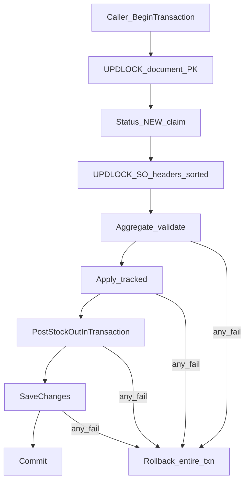
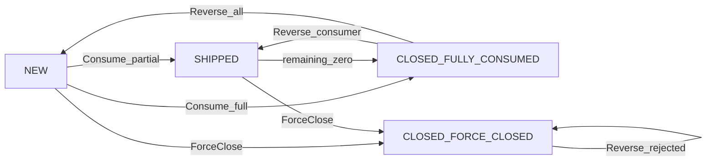

# Sales Order Phase 1 (ErpWeb, not WebForms)

Clone the invoice/DO stack. SO is a **commercial document** (no SP). DO and Invoice **consume remaining qty** on post and reverse it on rollback. Standalone DO (`SoNo = ""`) stays unchanged.

**Do not port:** OPEN overlay, `SAVESO`/`trxPosting`, Post-to-DR, header-only delete, `IvBalance.Qty_On_Ord`, `CustRel` revise, credit/min-price bypass, invoice-from-DO UI (`LinkDo = true`).

Implementation must follow this contract. UI matching is not sufficient.

Architecture is **approved (9.6)**. Stop redesigning. Remaining work is implementation against this file.

**Do not reopen:** separate SO txn; Fulfillment `SaveChanges`; DO/Invoice mutating `ShippedQty`; remaining from document history; drop `SoConsumedQty`; line-by-line Reverse; unordered `IN (...)` SO locks; weaker tenant scope; `Qty_On_Ord`; implicit ForceClose reopen; CLOSED meaning fully shipped.

**Frozen:** 1A SQL locks, 2A RowVersion, 5A Consume+Reverse aggregates, 5B old+new SO Save locks, 5C validate-all-before-Reverse, 6 LinkDo reject, 7 ClosedReason + ClosedDate meaning + SHIPPED OrderQty lifecycle, Gate 1 ambient-txn inspection below.

---

## 0. Implementation gates (frozen)

### Gate 1 — Existing DO/Invoice + stock ambient txn (inspected)

Verified in current code. SO integration must keep this shape; do not “fix” stock by calling the owning wrappers.

**Post matches the contract**

- [SaDoService.PostOneAsync](ErpWeb.Core/Sales/SaDoService.cs) (~1275–1446) and [SaInvoiceService.PostOneAsync](ErpWeb.Core/Sales/SaInvoiceService.cs) (~1226–1387): one `CreateDbContextAsync`, `BeginTransactionAsync` on that `db`, PK `LockForUpdateAsync(db, ...)`, then [`PostStockOutInTransactionAsync(db, ...)`](ErpWeb.Core/Inventory/IIvInventoryPostingService.cs), then **one** `SaveChangesAsync` + `CommitAsync`. Failures `RollbackAsync`.
- `PostStockOutInTransactionAsync` / `RollBackStockOutInTransactionAsync` call `PostInventoryMICoreAsync` / rollback core: **no** nested `BeginTransaction`, **no** `SaveChanges`, **no** `Commit`.
- SQL Server stock SQL [`DecreaseBalLocQtyAsync`](ErpWeb.Model/Repositories/Inventory/IvStockPostingRepository.cs) uses `db.Database.ExecuteSqlInterpolatedAsync` on the **same** `db` (same connection + ambient txn).
- Do **not** call `PostInventoryMIAsync` / `RollBackInventoryMIAsync` (those methods begin their own txn at ~1015 / ~1216).

**SQLite tests only:** `DecreaseBalLocQtyAsync` calls `SaveChangesAsync` then detaches. That is still the same `db` and ambient txn; production SQL Server does not take that path.

**Rollback hygiene (keep when adding SO):** [SaDoService.RollbackOneAsync](ErpWeb.Core/Sales/SaDoService.cs) (~1460) and [SaInvoiceService.RollbackOneAsync](ErpWeb.Core/Sales/SaInvoiceService.cs) (~1399) already use the same `db`+`tx`+InTransaction stock+`SaveChanges`+`Commit`. Early returns (not found / not POSTED) currently skip explicit `RollbackAsync` and rely on `await using tx` dispose. When inserting SO Reverse: wrap like Post (`try` / `RollbackAsync` on every fail path, including `SO_FORCE_CLOSED` **before** stock reverse). Unhandled exceptions must not swallow txn failure.

**Insert points:** Consume after document NEW claim and SO locks, **before** stock core. Reverse: 5C validate **all** SOs, then Reverse, then stock reverse. Any `FORCE_CLOSED` → fail with no SO mutate and no stock reverse.

**CompanyCode / BranchCode** on every lock and SO reference are taken from `ValidateWriteContext()` / authenticated scope — never from the request body as tenant.

### Gate 2 — Reverse aggregates per SO line

See 5A. Reverse sums `SoConsumedQty` by `(Company, Branch, SoNo, SoLine)` then calls `SaSoQty.Reverse` **once** per SO line with that sum.

### Gate 3 — Save locks union of old and new SO headers

See 5B.

---

## 1. Transaction contract

**Owner:** `SaDoService.PostOneAsync` / `RollbackOneAsync` and `SaInvoiceService.PostOneAsync` / `RollbackOneAsync`. One `AppDbContext`, `BeginTransactionAsync`, **one** `SaveChangesAsync` + `CommitAsync`, or `RollbackAsync` on any failure. Gate 1 is the proof this already exists.

**Stock joins that transaction.** Call only the InTransaction APIs. **Never** call `PostInventoryMIAsync` / `RollBackInventoryMIAsync` from DO/Invoice.

**SaSoFulfillment** receives the same `AppDbContext` / ambient txn. It does not create a context, begin/commit/rollback, or `SaveChanges`.



**Atomicity:** document status + SO qty/status/`ClosedReason` + `SoConsumedQty` + stock SP all persist or all roll back.

Default isolation is SQL Server READ COMMITTED. Correctness comes from **PK UPDLOCK, HOLDLOCK** held until commit — not from session SERIALIZABLE.

---

## 1A. SQL lock contract (P0-1)

Copy the existing DO/Invoice shape in [SaDoRepository.LockForUpdateAsync](ErpWeb.Model/Repositories/Sales/SaDoRepository.cs). Empty Company, Branch, or doc/SO number → **do not query**; fail closed.

**Document (DO):**

```sql
SELECT *
FROM dbo.SaDO WITH (UPDLOCK, HOLDLOCK)
WHERE CompanyCode = @Company
  AND BranchCode = @Branch
  AND DoNo = @DoNo;
```

**Document (Invoice):** same on `dbo.SaInvoice` with `InvNo`.

**SO header** — `ISaSoRepository.LockForUpdateAsync` only:

```sql
SELECT *
FROM dbo.SaSO WITH (UPDLOCK, HOLDLOCK)
WHERE CompanyCode = @Company
  AND BranchCode = @Branch
  AND SoNo = @SoNo;
```

Required:

- Predicate is the **full clustered PK** `(CompanyCode, BranchCode, SoNo)` / `(..., DoNo)` / `(..., InvNo)`.
- Clustered PK exists and is the seek path (create/alter scripts fail if PK is missing).
- No tenant-only or `SoNo`-only lock query. No `IN (...)` lock of many SOs in one statement (undefined lock order).
- `HOLDLOCK` holds the key lock until end of the ambient transaction.
- **All document and SO header locks are acquired before any SO qty/`ClosedReason`/Status mutation.**
- Details: after the matching header is locked, `Collection(Details).LoadAsync` (or equivalent) on the **same tracked instance**. No repository method updates `SaSODetail` without the header lock in that txn.

SQLite tests omit hints (existing DO pattern). SQL Server race tests are mandatory for lock proof.

**SO lock sequence:** unique `(CompanyCode, BranchCode, SoNo)` extracted from non-blank lines. Sort **only in application code** with one shared `StringComparer.OrdinalIgnoreCase` (e.g. `SaSoLockOrder.Comparer`). **No caller may use SQL `ORDER BY SoNo` for lock sequencing** (collation ≠ .NET). Then lock sequentially. Mixed-case `SoNo` must still serialize (test). Cap: `MaxDistinctSoHeaders = 20` (see 5A for the UI-safe error).

---

## 2. Accounting — Option A

**SO owns the aggregate.** `SaSODetail.ShippedQty` is the live consumed total. Do not recompute remaining from DO/Invoice rows at post.

Remaining = `OrderQty - ShippedQty` on the locked line, and header is not CLOSED.

Persisted together via **only** `SaSoQty` domain methods (`SetOrderQty`, `Consume`, `Reverse`) — no raw property assignment in UI, repositories, or DO/Invoice services:

- `OrderQty` decimal(18,4) > 0
- `ShippedQty` decimal(18,4) >= 0 and <= `OrderQty`
- `BalanceQty` decimal(18,4) = `OrderQty - ShippedQty`

SQL CHECK on `SaSODetail` (scripts fail closed if they cannot add):

- `OrderQty > 0`
- `ShippedQty >= 0 AND ShippedQty <= OrderQty`
- `BalanceQty = OrderQty - ShippedQty`

SQL CHECK on `SaDODetail` / `SaInvoiceDetail`: `SoConsumedQty >= 0`.

Service (not CHECK): NEW document → `SoConsumedQty = 0` on all lines. POSTED + non-blank `SoNo` + `LinkDo = false` → `SoConsumedQty > 0`. Reverse sets it back to 0.

Reconciliation tests: `SUM(SoConsumedQty)` of POSTED DO+Invoice lines (`LinkDo = false`, non-blank `SoNo`) equals `SaSODetail.ShippedQty`.

---

## 2A. SO RowVersion (P0-2)

SQL Server `rowversion` on **SaSO header** advances only when that header row is UPDATEd.

**Contract:** every persisted SO mutation — SaveNew, Update, ForceClose, Consume, Reverse — **updates the SaSO header row** in the same `SaveChanges` (at least `ModifiedDate`/`ModifiedBy`, plus Status/`ClosedReason` when they change). That advances `RowVersion`.

SQLite: `TouchRowVersion` GUID bytes on the header (invoice/DO pattern).

Fulfillment that only changed detail qty still stamps the header so R1 → consume → R2.

Stale Update/Delete/ForceClose with R1 after fulfillment → `Concurrency`. Fulfillment itself does not take a client SO RowVersion (document RowVersion is the client token).

Test: load SO R1 → DO consume commits → Update SO with R1 → concurrency failure.

---

## 3. Rollback accounting

`SoConsumedQty decimal(18,4) NOT NULL DEFAULT 0` on SaDODetail and SaInvoiceDetail.

- Written only by `Apply` at post; equals consume `Qty` (selling UOM) at post.
- POSTED: immutable except Reverse (clears to 0).
- Reverse uses `SoConsumedQty`, never live `Qty`. `SoConsumedQty = 0` on a linked line → `SO_ROLLBACK_NO_CONSUME`.

Idempotent rollback: second RollbackOne sees Status != POSTED → reject. NEW is never rolled back (post is all-or-nothing per document).

---

## 4. Posting idempotency

Under document PK `UPDLOCK, HOLDLOCK`:

- **Post:** `Status == NEW` else reject. Transition NEW → POSTED once. Concurrent/double-click/timeout-retry after commit: waiter sees POSTED → no second consume.
- **Rollback:** `Status == POSTED` else reject. POSTED → NEW once.

---

## 5. Mutation ownership and lock protocol

**SaSoFulfillment owns all SO fulfillment invariants. DO/Invoice own document lifecycle and stock only.** They must not increment `ShippedQty` themselves.

Only mutation paths:

- `SaSoService.SaveNew`
- `SaSoService.Update`
- `SaSoService.ForceClose`
- `SaSoFulfillment.Consume`
- `SaSoFulfillment.Reverse`

Helper internals: `ValidateReferences`, `AcquireLocks`, `CalculateConsumption`, `ApplyConsumption`, `RecalculateStatus`, `ReverseConsumption`. Public: `Consume` / `Reverse`.

**Header lock is the synchronization primitive.** All SO detail reads/writes in that txn happen after the header lock. No independent detail UPDATE API.

**Lock order:** (1) document PK, (2) unique SO headers sorted in-process, (3) existing SP/`IvBalLoc`. Same on rollback. SO-only ops lock only the SO header.

**Missing SO after lock:** `SO_NOT_FOUND`, no Apply.

---

## 5A. Same-line aggregate — Consume and Reverse (Gate 2)

**Consume:** before any `ShippedQty` mutation, group document lines by `(CompanyCode, BranchCode, SoNo, SoLine)` (skip blank `SoNo`). Sum rounded `Qty` per group. Compare **one** aggregate to locked remaining. 6+5 vs remaining 10 → `SO_OVER_CONSUME` before Apply. Apply once per SO line (add the group sum). Each document line still stores its own `SoConsumedQty` (6 and 4).

**LinkDo (Phase 1):** do **not** skip. Any line with `LinkDo = true` on Save or Post → fail `SO_LINKDO_NOT_SUPPORTED` (deterministic domain error). Do not persist an SO reference without consumption, and do not silently normalize. Invoice-from-DO stays out of slice.

**Reverse:** see 5C then group POSTED document lines the same way. Sum **`SoConsumedQty`** (not live `Qty`) per group. Call `SaSoQty.Reverse` **once** per SO line with that sum (6+4 → subtract 10 in one mutation). Then set each document line `SoConsumedQty = 0`. Do **not** reverse line-by-line (6 then 4).

Example: DO lines 6 and 4 on the same SO line → Post `ShippedQty += 10`; Rollback `ShippedQty -= 10` atomically for that line.

Cap: `MaxDistinctSoHeaders = 20`. Exceed → domain error `SO_TOO_MANY_HEADERS` with message **This document cannot reference more than 20 Sales Orders.** Not a SQL exception.

---

## 5B. NEW-document Save — old + new SO lock union (Gate 3)

DO/Invoice **SaveNew/Update** while Status is NEW, before inserting/updating/clearing `SoNo` on lines:

1. Collect **old** non-blank `SoNo` currently persisted on the document (empty on SaveNew).
2. Collect **new** non-blank `SoNo` on the incoming lines.
3. Union, unique by `(CompanyCode, BranchCode, SoNo)` using **server** Company/Branch (not client).
4. If count > 20 → `SO_TOO_MANY_HEADERS`.
5. Sort with `SaSoLockOrder.Comparer` (`StringComparer.OrdinalIgnoreCase` on `SoNo`).
6. `LockForUpdateAsync` each in that order (PK seek).
7. Validate new refs (exists, customer, not CLOSED, UOM, remaining vs **saved** qty — NEW docs do not consume yet; remaining check is best-effort vs live `ShippedQty`).
8. Allow SO-A→SO-B, SO-A→standalone, standalone→SO-A. Then write lines.

A→B vs concurrent B→A both lock `{A,B}` in the same sort order — no deadlock. Delete SO uses the same SO lock, so Delete vs Save serialize.

Post already locks the new refs only (old refs are gone after Save). That is correct: Post does not need old SOs.

**Lock order vs identity:** `SaSoLockOrder.Comparer` is only a deadlock-avoidance sort. PK uniqueness and “same SO” identity follow **SQL Server collation** (and trimmed `SoNo`). Do not treat ignore-case lock order as identity folding (`SO001` vs `so001` are distinct if the PK collation says so). Mixed-case tests must run on the production collation.

---

## 5C. Validate all rollback SOs before the first Reverse

Rollback after document POSTED claim:

1. Lock every distinct consumed SO (same sort as 5A).
2. **Validate all of them first** — missing, `SoConsumedQty` sum, and `ClosedReason == FORCE_CLOSED`.
3. If **any** SO is `FORCE_CLOSED` → `SO_FORCE_CLOSED`, `RollbackAsync`, **no** `SaSoQty.Reverse`, **no** stock reverse, document stays POSTED. Applies when the document references multiple SOs and only one is ForceClosed.
4. Only after every SO passes: Reverse group-sums, then stock reverse, then document NEW, `SaveChanges`/`Commit`.

---

## 6. Cross-document validation

Never trust client `SoNo`/`SoLine`. Load SO under caller Company+Branch; write Location from document write context.

- SO exists; line exists; `CustRel = 1`
- Consume: header Status NEW or SHIPPED, and `ClosedReason` is not `FORCE_CLOSED`
- `CustCode` match (ordinal ignore-case) only
- Item loadable; selling UOM match; `Qty > 0` at decimal(18,4) AwayFromZero — same precision as [`IvBalLoc.StdQty`](ErpWeb.Model/Configurations/Inventory/IvBalLocConfiguration.cs). Integration test: linked DO post consumes SO `Qty`/`StdQty` compatible with the SP stock decrease (no silent 18,4 vs other-scale split)
- SO warehouse is planning; ship WH need not match

**NEW document line rules (P1-6):** while document is NEW, server Save revalidates all of the above. Allowed: change Qty; delete line; change SoNo/SoLine; SO-backed → standalone (`SoNo=""`, `SoLine` null, `SoConsumedQty=0`); standalone → SO-backed. **Not** allowed: change document `CustCode` if any line has non-blank `SoNo`; POSTED document edits (existing rule).

Add-from-SO picker: ACCESS + `TryBranchScope`; filter that customer, not CLOSED, `BalanceQty > 0`. Do not return other tenants’/customers’ SOs.

`LinkDo = true` on any Save/Post line → `SO_LINKDO_NOT_SUPPORTED` (5A). Do not skip consumption.

---

## 7. Status vs ClosedReason (P0-3, P0-4)



Persist `ClosedReason nvarchar(20) NULL` on SaSO:

- `NULL` — not ForceClosed (NEW/SHIPPED, or transient)
- `FULLY_CONSUMED` — Status CLOSED because all `BalanceQty = 0`
- `FORCE_CLOSED` — Status CLOSED via ForceClose; remainder abandoned; `ShippedQty` unchanged

**RecalculateStatus** — Consume, Reverse, **and SaSoService.Update** (after `SetOrderQty`). Not ForceClose (ForceClose sets CLOSED/`FORCE_CLOSED` directly).

- If `ClosedReason == FORCE_CLOSED` → **do not Recalculate**; Reverse must have already rejected (5C)
- Else: all `ShippedQty = 0` → NEW, `ClosedReason = NULL`, clear `ClosedDate`/`ClosedBy`
- Else all `BalanceQty = 0` → CLOSED + `FULLY_CONSUMED`, stamp `ClosedDate`/`ClosedBy`
- Else → SHIPPED + `ClosedReason = NULL`, clear `ClosedDate`/`ClosedBy`

**SHIPPED OrderQty vs ShippedQty:** `OrderQty >= ShippedQty` on Update. If `SetOrderQty` makes all `BalanceQty = 0` (e.g. OrderQty 10→6 with ShippedQty 6), Update **must** Recalculate → CLOSED/`FULLY_CONSUMED` and stamp close audit. Inverse: SHIPPED 6/10, OrderQty → 12 → remains SHIPPED, `BalanceQty = 6`.

**ClosedDate / ClosedBy meaning:** when the header **entered CLOSED**, for **both** `FULLY_CONSUMED` and `FORCE_CLOSED` (posting user on consume-to-zero; ForceClose user on ForceClose). Not ForceClose-only. Reopen from `FULLY_CONSUMED` clears both fields.

**Fully consumed reopen (required):** SO 10, DO-A 6, DO-B 4 → CLOSED/`FULLY_CONSUMED` with ClosedDate set. Rollback DO-B → `ShippedQty=6`, `BalanceQty=4`, Status SHIPPED, `ClosedReason=NULL`, ClosedDate/By cleared.

**ForceClosed + document rollback:** 5C — if **any** consumed SO is `FORCE_CLOSED`, fail before **any** Reverse and before stock reverse. Document stays POSTED. Reopen is out of slice.

ForceClose: lock SO, RowVersion, Status != CLOSED, set CLOSED + `FORCE_CLOSED` + `ClosedDate`/`ClosedBy`. Later Consume sees CLOSED → `SO_CLOSED`.

Pull remaining: Status not CLOSED (covers both close reasons).

**Reporting:** `Status = CLOSED` does **not** mean fully fulfilled. `FORCE_CLOSED` may have `ShippedQty = 0` and `BalanceQty = OrderQty`. Lists/reports must use `ClosedReason` and `BalanceQty`. Do not treat CLOSED as shipped-complete.

SQL CHECK on SaSO (scripts fail closed if they cannot add):

```sql
(
  (Status <> N'CLOSED' AND ClosedReason IS NULL)
  OR
  (Status = N'CLOSED' AND ClosedReason IN (N'FULLY_CONSUMED', N'FORCE_CLOSED'))
)
```

Service still enforces the stronger pairing (`FULLY_CONSUMED` ⇒ all `BalanceQty = 0`; `FORCE_CLOSED` ⇒ remainder may be > 0).

---

## 8. Authz / list

`ValidateUserContext` / `ValidateWriteContext` / `CanAsync(MenuCodes.SalesOrder, permission)`. Fail-closed Company+Branch; write Location. Never load by `SoNo` alone.

- Get / Search / Lookups / remaining-lines: ACCESS
- SaveNew: ADD
- Update: EDIT + RowVersion; NEW or SHIPPED
- Delete: DELETE + RowVersion; NEW; all `ShippedQty = 0`; **no persisted references** (below)
- Copy: ADD
- ForceClose: CLOSE + RowVersion; not CLOSED

SHIPPED Update: no customer change; cannot delete shipped lines; `OrderQty >= ShippedQty`; RecalculateStatus after `SetOrderQty` (section 7).

List: clone [SaDoRepository.SearchPagedAsync](ErpWeb.Model/Repositories/Sales/SaDoRepository.cs) — Take 1..100, no `Include(Details)`, DTO includes RowVersion.

**Delete references (P1-4):** after SO header lock, any **persisted** `SaDODetail` / `SaInvoiceDetail` with same Company+Branch+SoNo (non-blank) **blocks delete**, regardless of document Status (NEW, POSTED, CLOSED/ForceClosed). There is no cancelled/deleted-doc table this phase. Intention: any stored reference, not only POSTED.

---

## 9. Schema

[scripts/create-saso.sql](scripts/create-saso.sql) + [scripts/alter-saso-option-a.sql](scripts/alter-saso-option-a.sql). Fail-closed gates like [scripts/alter-sado-option-a.sql](scripts/alter-sado-option-a.sql).

**SaSO** PK `(CompanyCode, BranchCode, SoNo)` clustered. `ClosedReason`, `ClosedDate`, `ClosedBy`, `RowVersion`, leftover `LocationCode`. Status/`ClosedReason` CHECK as in section 7. Index for delete/ref is `(Company, Branch, SoNo, SoLine)` on DO/Invoice detail — **do not** add document Status to that index (delete checks any persisted ref).

**SaSODetail** PK `(CompanyCode, BranchCode, SoNo, Line)` + qty CHECKs.

**SaDODetail / SaInvoiceDetail:** `SoConsumedQty` + CHECK >= 0. Invoice: `SoNo` default `''`, `SoLine`, `CustRel`, `LinkDo bit default 0`.

Indexes: clustered PKs (lock seek); `IX_SaSO_Company_Branch_Status_SoDate`; `IX_SaSO_Company_Branch_CustCode`; unique detail; `IX_SaDODetail_Company_Branch_SoNo_SoLine` and invoice twin for delete/reconciliation **not** live remaining.

No FK to SaSO (`SoNo = ''` standalone). No `Qty_On_Ord`.

---

## 10. UI / menu

- `MenuCodes.SalesOrder = "SA_SO"`; [menus.xml](ErpWeb/Menus/menus.xml) `/sales/sales-orders`
- [init-menu-access.sql](scripts/init-menu-access.sql): ADD, EDIT, DELETE, CLOSE
- [init-adsmnum.sql](scripts/init-adsmnum.sql): `NumCd = SO`
- `SaSoList` / `SaSo` without shipment/post/rollback; FORCE CLOSE; list sends RowVersion
- Add-from-SO: tenant + customer scoped (section 6)

---

## 11. Tests (before UI)

Existing list plus:

- Fully consumed reopen: 10 = 6+4, rollback 4 → SHIPPED balance 4
- ForceClosed + rollback consuming DO → `SO_FORCE_CLOSED`; SO still FORCE_CLOSED; DO still POSTED
- RowVersion R1 → consume → R2; Update R1 fails
- **SQL Server:** read `SaSO.RowVersion` bytes from the database after a fulfillment-only consume; they must differ from R1 (not only service-layer equality)
- Mixed-case SoNo lock order
- Delete vs DO Save/Post creating a reference
- Two lines same SO line: aggregate fail before any `ShippedQty` change
- Duplicate SO-line **rollback:** Post 6+4 → `ShippedQty += 10`; Rollback → `ShippedQty -= 10` in one Reverse group-sum
- NEW DO concurrent Updates A→B and B→A: deterministic lock order, no deadlock
- CLOSED reporting: FULLY_CONSUMED + Balance=0 vs FORCE_CLOSED + Balance>0
- Concurrent consumers: second cannot both succeed on stale remaining (UPDLOCK)
- `SoConsumedQty >= 0` / POSTED consume > 0
- `SO_TOO_MANY_HEADERS` returns the 20-SO message, not a SQL exception
- `LinkDo = true` on Save and Post → `SO_LINKDO_NOT_SUPPORTED`; SO `ShippedQty` unchanged
- Multi-SO rollback: one of two SOs is FORCE_CLOSED → no Reverse on either, no stock reverse, document POSTED
- SHIPPED OrderQty 10→6 with ShippedQty 6 → CLOSED/`FULLY_CONSUMED`; OrderQty → 12 stays SHIPPED balance 6
- SQL Server lock query: clustered PK seek (execution plan / index check, not only functional success)
- Linked DO post: SO consume qty scale matches `IvBalLoc` 18,4 stock decrease

Invoice/DO regression green.

---

## 14. Merge gates (before Phase 1 merge)

- **A Transaction:** SQL Server: document + SO aggregate + `SoConsumedQty` + stock commit together and roll back together (stock-core fail / SaveChanges fail).
- **B Concurrency:** two consumers cannot both take the same remaining; Delete vs Save serializes; Save A→B vs B→A no deadlock; stale RowVersion after fulfillment fails; lock SQL is a PK seek.
- **C Accounting:** `SUM(SoConsumedQty) == ShippedQty` including duplicate SO-lines and after rollback.
- **D Lifecycle:** partial → SHIPPED; full → CLOSED/`FULLY_CONSUMED` with ClosedDate; rollback reopens; ForceClose → FORCE_CLOSED; ForceClosed rollback rejected (incl. multi-SO); OrderQty reduced to ShippedQty → FULLY_CONSUMED.
- **E Unsupported:** `LinkDo = true` cannot bypass SO accounting.

---

## 12. Out of slice

Revise/`CustRel` versions, Post-to-DR, Qty_On_Ord, credit/min-price, print, invoice pick-DO / PARTIAL, SO stock reservation, **reopening FORCE_CLOSED**.

---

## 13. Build order

1. This contract
2. Schema + EF + CHECKs + `ClosedReason`
3. SO repo/service (PK lock + ForceClose)
4. Fulfillment tests (SQL Server races)
5. `SaSoFulfillment` until tests pass
6. DO Post/Rollback (Reverse before stock; try/Rollback on every fail) + Save 5B old+new union locks
7. Invoice Post/Rollback + Save 5B union locks
8. Menu + UI
9. Full regression
