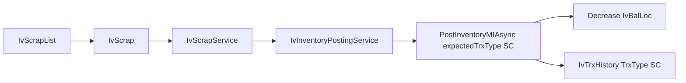

# Inventory Scrap (clone MI, write-off)

Follow [ErpWeb/docs/inventory-trx-pattern.md](ErpWeb/docs/inventory-trx-pattern.md). Scrap V1 is **stock OUT**: quantity leaves the chosen `IvBalLoc` pile. Same movement as MI. Not a status change, not a transfer.



Architecture: `IvScrapService` → `IvInventoryPostingService` → parameterized MI stock-out method, with **SC passed explicitly**. Do not copy `PostInventoryMIAsync` / `RollBackInventoryMIAsync`. Do not extract a shared MI/Scrap base class.

**Before coding:** inspect the current MI implementation. If a referenced method/line number differs, follow the **repository** while preserving this plan’s business rules. Verify: MI status gates, `CombineRemarks` truncation, MI rollback transaction wrap/order, and every caller of the private MI post/rollback methods.

## Locked decisions

- **TrxType:** add `IvTrxTypes.Scrap = "SC"` in [IvTrxConstants.cs](ErpWeb.Core/Inventory/IvTrxConstants.cs). Do not reuse `MI`.
- **Line identity:** `FromBalLocId` + `FrStdQty` (MI model). No dest warehouse / dest `IStatus`.
- **IStatus:** informational, read-only from the source pile. Never a destination/status-change field. Do not default to `SCRAPS`.
- **Reason:** required **per line**. `IvScrapReasons` constants class. Do not change `IvTrxReasons`. Persist via `Remarks` with a **strict** parse/rebuild contract (below). No Reason column / no migration in V1.
- **Lifecycle:** identical to MI (section below). Do not invent an SC-only state machine.
- **Validations:** inherit all MI source-stock checks; do not weaken or reimplement them. Scrap adds reason-code checks only.
- **Numbering / schema:** existing `IV_BATCH`; no new tables; no Reason column.
- **Do not:** generate lots, mutate `IvBalLoc` on draft save, mix To\* fields, UOM conversion, GL, WO scrap.

## 1. Document lifecycle (same as MI)

Inspect and copy the **actual** MI status gates in [IvMiscIssueService](ErpWeb.Core/Inventory/IvMiscIssueService.cs); do not assume this prose if the code differs. Legal transitions:

```text
SaveNew → NEW
Update / Delete / Cancel / Post  (only while NEW)
Cancel: NEW → CANCELLED
Post:   NEW → POSTED
Rollback: POSTED → NEW   (same MI rollback: restore qty, delete history)
```

Rules:

- Draft/save/update behaviour follows MI (`SaveNew` creates `NEW`; `Update` only if `NEW`).
- `NEW` can be posted or cancelled.
- `POSTED` and `CANCELLED` are read-only (UI and service). Update / Delete / Cancel / Post must fail.
- Rollback status transition must be **exactly** existing MI: `POSTED` → `NEW` after integrity + restore. Only `POSTED` can roll back.
- `CANCELLED` cannot be posted, edited, deleted, or rolled back.
- Double-post rejected (history exists / not `NEW`), same as MI.

Do not add extra SC statuses or compensating reversal documents.

## Identity

- Menu: `INV_SCRAP` in [MenuCodes.cs](ErpWeb.Core/Menus/MenuCodes.cs)
- Routes: `/inventory/scrap`, `/inventory/scrap/{new|edit|view}/{BatchNo}`
- CSS prefix: `sc-`
- GridKey: `inv-scrap-list`
- [menus.xml](ErpWeb/Menus/menus.xml): after Stock Transfer, SortOrder 11
- **Permissions:** copy the **exact** MI authorization pattern, swapping only the menu code to `INV_SCRAP`. Do not assume a permission list is enough.
  - Service: every `_accessRights.CanAsync(MenuCodes.InventoryMiscIssue, …)` in [IvMiscIssueService.cs](ErpWeb.Core/Inventory/IvMiscIssueService.cs) becomes `MenuCodes.InventoryScrap` with the **same** `PermissionCodes.*` and the same method (Peek/Search/Get → Access; SaveNew → Add; Update → Edit; Delete → Delete; Cancel → Cancel).
  - Post/Rollback permissions stay in `DispatchAsync` (MI uses `INV_MISC_ISSUE`; SC uses `INV_SCRAP`) — same as MI, the document service does not re-check Post/Rollback itself.
  - UI: `MenuAuthorize` / `PermissionAuthorize` / list button `CanAsync` gates cloned from MI list + document pages.
  - If MI has any extra check at implementation time, inherit it. Do not add VIEW_COST or other codes unless MI already uses them on these screens.

## Clone from MI

Copy **behaviour and chrome**, not irrelevant MI-only details. Do not carry over unused `To*` fields, MI labels, MI menu codes, or MI error nouns. Keep layout, modes, dirty check, confirm dialogs.

Copy then rename:

- [IvMiscIssueList.razor](ErpWeb.UI/Inventory/Transactions/IvMiscIssueList.razor) (+ `.cs` / `.css`) → `IvScrapList.*`
- [IvMiscIssue.razor](ErpWeb.UI/Inventory/Transactions/IvMiscIssue.razor) (+ `.cs` / `.css`) → `IvScrap.*`
- [IIvMiscIssueService.cs](ErpWeb.Core/Inventory/IIvMiscIssueService.cs) / [IvMiscIssueService.cs](ErpWeb.Core/Inventory/IvMiscIssueService.cs) → `IIvScrapService` / `IvScrapService`
- Register in [CoreServiceCollectionExtensions.cs](ErpWeb.Core/CoreServiceCollectionExtensions.cs)

Replace MI strings: menu, routes, titles, toasts, CSS, `TrxType`. Keep Peek / Search / Get / SaveNew / Update / Delete / Cancel / Post / Rollback.

## 3. `IvScrapReasons` contract

Add a **static constants class** next to `IvTrxReasons` in [IvTrxConstants.cs](ErpWeb.Core/Inventory/IvTrxConstants.cs) (same pattern: `const` strings + `All` list). Not an enum.

```csharp
public static class IvScrapReasons
{
    public const string Damaged = "DAMAGED";
    public const string Expired = "EXPIRED";
    public const string QcFail = "QC_FAIL";
    public const string Overstock = "OVERSTOCK";
    public const string Other = "OTHER";

    public static readonly IReadOnlyList<string> All =
        [Damaged, Expired, QcFail, Overstock, Other];
}
```

- Persist the **code**, never display text. No schema migration; `IvTrxBatchDetail` has no Reason column.
- **Save always rebuilds** `Remarks` from the DTO `Reason` + `Remarks`. Never append onto a previously combined string (prevents `DAMAGED: EXPIRED: …` duplication).
- **Reuse MI `CombineRemarks` unchanged** (copy the same private helper into `IvScrapService`; do not invent a second combine/truncate algorithm). Inspect truncation: the stored value must obey the existing 250-character rule **and** must not drop the canonical reason prefix. Only change the helper if inspection proves it cannot preserve the SC prefix.
- Format produced by that helper today: empty user remark → canonical code only (`DAMAGED`); non-empty → `{CODE}: {userRemark}` (colon + one space).
- Combo: bind to `IvScrapReasons.All`, `AllowUserInput=false`.

### Get parse contract (strict — not permissive)

Recognize a reason **only** when stored `Remarks` is:

1. **Exact canonical code** (ordinal, case-sensitive match to one of `IvScrapReasons.All`), or
2. **Exact canonical code + `": "` prefix** (colon and space). Then `Reason` = that code and `Remarks` = the remainder (empty remainder → `Remarks` null).

Otherwise:

- `Reason` is **null**
- the full stored string is preserved as `Remarks`
- next SaveNew/Update **rejects** missing/invalid Reason (server authoritative)

Explicit non-matches (do **not** treat as a reason):

- wrong case (`damaged: …`, `Damaged`)
- missing space (`DAMAGED:foo`)
- lookalike (`DAMAGEDS: …`, `DAMAGED - …`)
- user text that merely contains a code later in the string
- corrupt/old Remarks that happen to start with something reason-like but not an exact canonical prefix

`Remarks` null/empty on Get → `Reason` null, `Remarks` null.

A `NEW` row with an invalid persisted prefix loads with `Reason` null; save fails until the user picks a valid code. Do not auto-repair by guessing.

## 2. Per-line reason validation (server is authoritative)

On every SaveNew / Update line:

- null / empty / whitespace reason → reject that line
- code not in `IvScrapReasons.All` (ordinal ignore-case, then normalize to the canonical constant) → reject
- every line must have a valid reason; one bad line fails the whole save
- UI popup validation is supplemental only

## 4. Inherit all MI inventory validations

Reuse the same MI validation **logic/pattern** and preserve every MI source-stock check. Only **add** SC-specific Reason validation. Do not independently reimplement or weaken MI checks. Do not treat “clone `ValidateLinesAsync`” as a license to invent a second stock-validation engine.

- source `FromBalLocId` required; row exists for company/branch
- pile belongs to the line item; warehouse / location / lot / `IStatus` match the locked pile
- pile `StdQty > 0` at save
- active warehouse / item status / item class
- lot-controlled items require lot; lot identity matches pile; expiry from lot when applicable
- item restrictions already in MI (stock-controlled, active item, UOM = pile/item std UOM)
- `UnitPrice >= 0`
- posting: lock batch + lock piles (`UPDLOCK`/`HOLDLOCK` + `IvStockSliceKey` order), identity re-check after lock, insufficient qty, history-exists / not-NEW, `DbUpdateConcurrencyException`
- duplicate posting protection (history exists → fail, no fake success)

Scrap-only extra: reason rules above.

## 8. Quantity mapping and UOM (same as MI)

```text
Scrap Qty  →  line.Quantity  →  IvQty.Round (4 dp)  →  IvTrxBatchDetail.FrStdQty
           →  MI stock-out posting  →  IvBalLoc.StdQty decrease
```

- Same std UOM as the source pile (`FrStdUom`). No conversion in V1.
- Save: `Quantity > 0` (zero and negative fail). Same as MI.
- UI: warn if scrap qty > displayed available (MI advisory). Popup commit still requires qty > 0.
- **Authoritative over-qty:** posting after lock, same as MI (`required > actual` on aggregated `FromBalLocId`). Do not invent a separate SC qty engine.

## 5. Multi-line posting atomicity

A scrap document must **never partially post**. Same MI transaction:

- Line 1 valid, line 2 over available (or otherwise invalid at post) → entire post fails
- No `IvBalLoc` change, no `IvTrxHistory`, batch stays `NEW`

Mandatory test (clone MI `TestA_multi_line_same_balance_over_issue_fails_atomically`).

## 6. Rollback: reuse MI, no SC algorithm

`RollBackInventoryMIAsync` with `expectedTrxType = SC`. Same integrity/concurrency as MI:

- lock batch; must be `POSTED` and `TrxType == SC`
- `ValidateMiHistoryIntegrity` must accept `SC` history (not hard-code MI only)
- pair history ↔ detail **before** any qty restore; failure → no qty change, no history delete, batch stays `POSTED`
- restore to original `FromBalLocId`; missing pile → `ORPHAN_HISTORY` fail
- concurrency: `DbUpdateConcurrencyException` → same MI message
- success: qty restored; **then** delete history using the **same** MI call: `_posting.RemoveHistory(db, history)` where `history` is the list already loaded for **this company + branch + BatchNo** ([LoadHistoryForBatchAsync](ErpWeb.Model/Repositories/Inventory/IvStockPostingRepository.cs) + [RemoveHistory](ErpWeb.Model/Repositories/Inventory/IvStockPostingRepository.cs) `RemoveRange` of those rows). Batch → `NEW`.

**History deletion scope:** SC rollback must delete **exactly** the same rows MI rollback deletes for the corresponding batch — the in-memory list loaded for that batch key. Do **not** `RemoveRange` / SQL-delete by `TrxType == SC` globally. Do not delete other batches’ history. Inspect MI `RollBackInventoryMIAsync` at implementation time and keep that sequence (integrity → restore qty → `RemoveHistory(loaded rows)` → status `NEW`).

Cover: scrap 10; another process changes/consumes that pile; rollback uses the **same** MI restore/orphan/concurrency outcome — do not special-case SC.

## 9. Posting identity protection and shared API change

This is a **compatibility-impacting** change to the shared stock-out path. Do not treat it as a local rename.

**Caller inventory (verify with grep at implementation time):**

- `PostInventoryMIAsync` / `RollBackInventoryMIAsync` are **private** and today are called **only** from `DispatchAsync` when `isMi` ([IvInventoryPostingService.cs](ErpWeb.Core/Inventory/IvInventoryPostingService.cs) ~106–107).
- Public API stays `PostAsync(trxType, batchNos)` / `RollbackAsync(trxType, batchNos)`.
- [IvMiscIssueService](ErpWeb.Core/Inventory/IvMiscIssueService.cs) must keep `_posting.PostAsync(IvTrxTypes.MiscellaneousIssue, …)` and the matching rollback.
- `IvScrapService` must pass `IvTrxTypes.Scrap` only.
- MR/TR must **not** be routed through the MI/SC methods.

**Required DispatchAsync wiring:**

- `isMi` → `PostInventoryMIAsync` / `RollBackInventoryMIAsync` with `expectedTrxType = MI`, menu `INV_MISC_ISSUE`
- `isSc` → **same methods** with `expectedTrxType = SC`, menu `INV_SCRAP`
- `isMr` / `isTr` unchanged (own methods)

Methods require `batch.TrxType == expectedTrxType`. History `TrxType` = `expectedTrxType`. Posting or rolling back an SC batch as `MI` (or MI as `SC`) fails **before** qty/history mutation.

**Error-message compatibility:** preserve existing MI error text when `expectedTrxType` is MI. Add “scrap” wording **only** on the SC path, and only where the message would otherwise call the document an issue (e.g. “Miscellaneous issue was not found.” → scrap equivalent). Do not rewrite MI messages, codes, or punctuation for the MI path.

## UI (screenshot = line popup)

**List:** MI chrome. Titles “Scrap”. NEW / POST / ROLLBACK / CANCEL / DELETE.

**Document header:** trx date, status, ref (`AUTO`), remark — same as MI.

**Lines grid:** Item, Scrap From (wh/loc/lot + avail), Scrap Qty, Status, Unit Price, Reason, Remark, Amount.

**Popup “Scrap Information”** (two columns):

- Left: item + barcode, class, from qty/UOM, from warehouse/location/lot (`IvBalLocPicker`), unit price, source `IStatus` (read-only)
- Right: description, scrap qty + UOM, reason (required, `IvScrapReasons.All`), remark, expiry (read-only if lot-controlled)

**Source picker:** reuse existing `IvBalLocPicker` / on-hand search. That lookup already returns only `StdQty > 0` piles ([IvStockCommonRepository](ErpWeb.Model/Repositories/Inventory/IvStockCommonRepository.cs)). Filter by selected `ICode`. Eligible = existing on-hand piles with available stock. Do not add dest-status filtering.

Save requires at least one line. After save → view. Posted/cancelled stay read-only.

UI line/popup checks for quantity and reason must match the server rules (qty `> 0`, reason required and in `IvScrapReasons.All`). **Server validation remains authoritative.**

## 10. Test matrix

Clone [IvMiscIssuePostingServiceTests.cs](ErpWeb.Tests/IvMiscIssuePostingServiceTests.cs) → `IvScrapPostingServiceTests.cs`. Cover:

- New scrap save succeeds (`TrxType = SC`, `NEW`)
- Save with zero lines fails
- Missing / blank / whitespace reason fails
- Invalid reason code fails
- Zero quantity fails
- Negative quantity fails
- Over-available quantity fails at **post** (stock/history unchanged, batch `NEW`)
- Multi-line posting is atomic (valid + over-qty → nothing committed)
- SC posting decreases `IvBalLoc`
- History written with `TrxType = SC` (not `MI`)
- SC rollback restores quantity and returns batch to `NEW`
- Posted document cannot be edited
- Cancelled document cannot be edited or posted
- SC batch cannot be posted via `IvTrxTypes.MiscellaneousIssue` (identity protection; no qty/history change)
- SC POSTED batch cannot be rolled back via `IvTrxTypes.MiscellaneousIssue` (fails before qty/history mutation)
- **Reason round-trip:** save `DAMAGED` + user remark; reload `NEW` → Reason `DAMAGED`, Remarks exactly the user text; update Reason to `EXPIRED`; save and reload → Reason `EXPIRED`, user remark unchanged, old `DAMAGED` not duplicated in Remarks
- **Remarks 250-char boundary:** save a maximum-length user remark with a valid reason; reload → Reason still the canonical code; stored `Remarks` obeys MI’s 250-character rule and still parses under the strict contract
- **Stale source pile:** save against `FromBalLocId`; change that pile’s identity (item/wh/loc/lot/`IStatus`) before post; post fails on after-lock identity check; no stock/history commit
- Existing MI tests remain green (parameterized stock-out path; MI error strings unchanged)
- MR/TR behaviour unchanged (existing tests remain green)

## Out of scope

Status-change scrap (ACTIVE → `DAMAGED`/`SCRAP` pile), GL write-off, production/WO scrap, UOM conversion.
