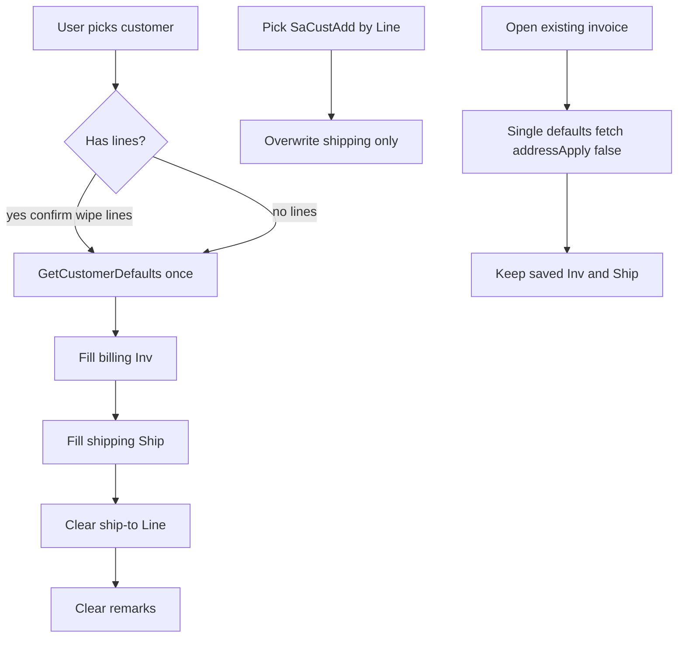

# Align invoice entry with AppInvoice / AppShip — hardened v3 (Architect 9.6 → ≥9.7)

Source of truth: [plans/InvoiceEntry-AppShip-AppInvoice-Logic.md](plans/InvoiceEntry-AppShip-AppInvoice-Logic.md).

Flag truth table stays in [`GetCustomerDefaultsAsync`](ErpWeb.Core/Sales/SaInvoiceService.cs). No schema changes. Real entity: [`SaCustAdd`](ErpWeb.Model/Entities/CustomerProfile/SaCustAdd.cs) — keys `CompanyCode`,`CustCode`,`Line`; fields AddName, DeliverTo, Address1–4, City, State, PostalCode, Country, Tel, Fax. **No `IsActive` property.**



---

## 0. Editability

```csharp
bool CanEditAddresses =>
    _doc.Status == InvoiceStatus.New
    && !string.IsNullOrWhiteSpace(_doc.CustCode);
```

Posted/view-only: combo disabled. Open existing always `addressApply: false`.

---

## 1. Normalize CustCode (9.5 leftover #4)

Match existing service norm in `GetCustomerDefaultsAsync` (line ~176):

```csharp
static string NormCustCode(string? custCode) => (custCode ?? string.Empty).Trim();
// empty after Trim → required error / clear path
// comparisons: StringComparison.OrdinalIgnoreCase (same as OnCustCodeChanged)
```

Every UI → service call and every `SaCustAdd` / customer query uses `NormCustCode` **before** hit.

---

## 2. SaCustAdd query — IDOR + AsNoTracking + IsActive preflight (leftovers #1/#2 from 7.9, #2 from 9.5)

**Preflight (locked):** `SaCustAdd` has **no** `IsActive` column/property. **Do not** filter `IsActive`. Return all lines for the customer.

```csharp
EnsureCompanyContext();
var code = NormCustCode(custCode);

var shipTo = await _db.SaCustAdds.AsNoTracking()
    .Where(a => a.CompanyCode == _ctx.CompanyCode && a.CustCode == code)
    .OrderBy(a => a.Line)
    .Select(a => new SaCustAddressVm
    {
        Line = a.Line,
        AddName = a.AddName,
        DeliverTo = a.DeliverTo,
        Address1 = a.Address1,
        Address2 = a.Address2,
        Address3 = a.Address3,
        // Address4 deliberately omitted — no ShipAddress4
        City = a.City,
        State = a.State,
        PostalCode = a.PostalCode,
        Country = a.Country,
        Tel = a.Tel,
        Fax = a.Fax,
    })
    .ToListAsync(ct);
```

Never query by `CustCode` alone.

---

## 3. Named DTO + combo identity (9.5 leftover #1)

```csharp
public sealed class SaInvoiceCustomerDefaults
{
    // existing resolved Inv*/Ship* + pay/tax/salesman/Taxable/DiscountMethod/DecPoint...
    public IReadOnlyList<SaCustAddressVm> ShipToAddresses { get; init; } = Array.Empty<SaCustAddressVm>();
}

public sealed class SaCustAddressVm
{
    public int Line { get; init; }           // combo value
    public string? AddName { get; init; }
    public string? DeliverTo { get; init; }  // combo text preferred
    // addr1-3, city, state, postal, country, tel, fax — no Address4
}
```

Page state:

```csharp
int? _shipToLine;                          // selected SaCustAdd.Line (NOT the whole row)
IReadOnlyList<SaCustAddressVm> _shipToOptions = Array.Empty<SaCustAddressVm>();

// Combo:
//   ValueField / @bind-Value = _shipToLine  (int?)
//   TextField = DeliverTo if non-blank else AddName
//   Data = _shipToOptions
```

On pick:
```csharp
void OnShipToLineChanged(int? line)
{
    _shipToLine = line;
    if (line is null) return; // combo cleared — Ship* unchanged (no AppShip restore)
    var row = _shipToOptions.FirstOrDefault(x => x.Line == line);
    if (row is null)
    {
        _shipToLine = null; // stale Line after list refresh
        return;
    }
    StampShipFrom(row); // Ship* only
}
```

---

## 4. `addressApply` + single fetch on open (9.5 leftover #5)

**Problem today:** `CaptureCustomerFlagsAsync` already calls `GetCustomerDefaultsAsync` for flags; a second call for ship-to would double-fetch.

**Rule:** one defaults call populates flags **and** `ShipToAddresses`.

```csharp
async Task ApplyCustomerDefaultsAsync(string? custCode, bool addressApply, int seq)
{
    var code = NormCustCode(custCode);
    if (string.IsNullOrEmpty(code))
    {
        if (addressApply) WipeAllCustomerDependentFields();
        else { _shipToOptions = Array.Empty<SaCustAddressVm>(); _shipToLine = null; }
        return;
    }

    var result = await Invoices.GetCustomerDefaultsAsync(code, InvDate, _cts.Token);
    // Stale check BEFORE any stamp (9.6 leftover #1)
    if (seq != _customerApplySeq || _disposed) return;
    if (!result.Succeeded || result.CustomerDefaults is null) return;
    var d = result.CustomerDefaults;

    _taxable = d.Taxable;
    _discountMethod = d.DiscountMethod ?? _discountMethod;
    _decPoint = d.DecPoint == true;
    _shipToOptions = d.ShipToAddresses;

    if (!addressApply)
    {
        _shipToLine = null;   // combo empty; keep saved Inv*/Ship*
        return;
    }

    if (seq != _customerApplySeq) return; // re-check immediately before stamp
    ApplyDefaults(d);         // stamps Inv/Ship from AppInvoice/AppShip resolution
    _shipToLine = null;
    Remark = null;
}

// Replace CaptureCustomerFlagsAsync / open path — no customer-change race:
var openSeq = _customerApplySeq; // do not bump; ignore in-flight change stamps via their own seq
await ApplyCustomerDefaultsAsync(custCode, addressApply: false, seq: openSeq);

// ApplyDocument:
ApplyDocumentFields(dto);  // saved header/lines first
await ApplyCustomerDefaultsAsync(dto.CustCode, addressApply: false, seq: _customerApplySeq);
```

Delete any separate “load ship-to only” call that duplicates defaults.

---

## 5. Confirm-then-wipe lines — explicit template (9.5 leftover #3)

```csharp
int _customerApplySeq;

async Task ApplyCustomerAsync(string? rawCode)
{
    if (_isApplyingDefaults || _disposed || !CanEditDocument) return;

    var next = NormCustCode(rawCode);
    next = string.IsNullOrEmpty(next) ? null : next;
    if (string.Equals(CustCode, next, StringComparison.OrdinalIgnoreCase)) return;

    if (Lines.Count > 0 && next is not null)
    {
        var ok = await ConfirmAsync(
            "Changing customer will clear invoice lines. Continue?");
        if (!ok) return;
        Lines.Clear();          // wipe lines only after confirm
    }
    // LOCKED (9.6 leftover #2): clearing customer always wipes lines — no confirm
    // (user explicitly cleared the customer control)
    if (Lines.Count > 0 && next is null)
        Lines.Clear();

    var seq = ++_customerApplySeq;
    CustCode = next;
    _isApplyingDefaults = true;
    try
    {
        if (next is null)
        {
            WipeAllCustomerDependentFields(); // Inv/Ship/Remark/_shipTo*/pay/tax/salesman/FX
            return;
        }
        await ApplyCustomerDefaultsAsync(next, addressApply: true, seq: seq);
        // stale discard is inside ApplyCustomerDefaultsAsync BEFORE ApplyDefaults
    }
    finally { _isApplyingDefaults = false; }
}
```

---

## 6. Wipe matrix + manual Ship* + clear combo

| Event | Lines | Inv* | Ship* | Remark | `_shipToLine` | `_shipToOptions` | Pay/tax/salesman/FX |
|---|---|---|---|---|---|---|---|
| Customer change (confirmed) | wipe | defaults | defaults | clear | null | replace | defaults |
| Customer cleared | wipe (no confirm — locked) | clear | clear | clear | null | empty | clear |
| Open existing | keep | saved | saved | saved | null | from single fetch | saved |
| Ship-to pick | keep | keep | overwrite Ship* | keep | set Line | keep | keep |
| Combo cleared | keep | keep | **keep** (no AppShip restore) | keep | null | keep | keep |
| Manual Ship* edit | keep | keep | user | keep | **null** | keep | keep |

```csharp
void OnShipFieldEdited() => _shipToLine = null;
```

---

## 7. Tests

| Case | Assert |
|---|---|
| Mixed AppInvoice/AppShip | independent |
| ShipToAddresses | ordered by Line; includes `Line` |
| Company scope | other-company SaCustAdd absent |
| No IsActive filter | all lines for customer returned |
| Address4 | not on VM / not applied |
| Norm CustCode | leading/trailing spaces still resolve |
| Open existing | one defaults call; combo empty; Ship* preserved |
| Clear combo | Ship* unchanged |
| Confirm change | lines wiped only after confirm; remarks/ship-to reset |
| Customer clear | lines wiped with **no** confirm; full wipe matrix |
| Stale apply | rapid customer A→B does not stamp A after B |
| Stale ship-to Line | FirstOrDefault miss clears `_shipToLine`, no throw |
| Seed | 1–2 SaCustAdd same company |

---

## Out of scope

ShipAddress4, persisted DeliverTo, ContactPerson, PrefixControl, SO/DO copy, page-side AppInvoice/AppShip ifs.

---

## Acceptance

Combo `int?` Line + FirstOrDefault on pick; no IsActive; NormCustCode Trim; confirm-wipe on customer **change**; clear-customer line wipe **locked no-confirm**; seq check **before** ApplyDefaults; single defaults fetch on open; tests green; bar **≥9.7**.
