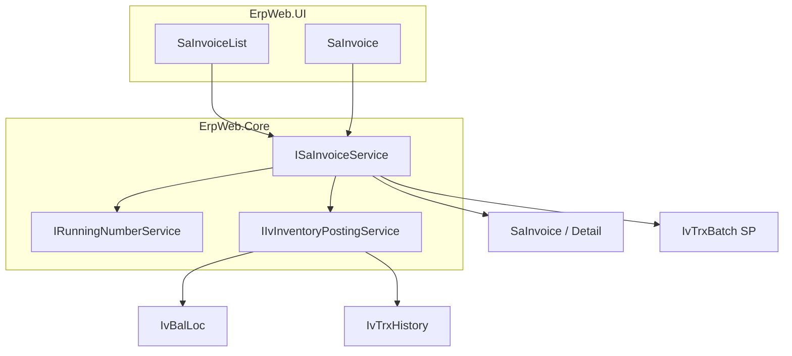

# Invoice Module v1 — ErpWeb (revised after review)

**Target:** [mokth/net10projectTemplate](https://github.com/mokth/net10projectTemplate.git) at `c:\wincom\net10projects\ErpWeb`

**Legacy behaviour:** [InvView.aspx.cs](ERP/SalesForms/InvView.aspx.cs), [InvoiceEntry.aspx.cs](ERP/SalesForms/InvoiceEntry.aspx.cs), [InvTrxHelper](ERPCommonUI/SalesForms/HelperClass/InvTrxHelper.cs), [ShipmentHelper](ERPCommonUI/SalesForms/HelperClass/ShipmentHelper.cs)

**ErpWeb contract:** [inventory-trx-pattern.md](c:\wincom\net10projects\ErpWeb\docs\inventory-trx-pattern.md). Invoice **owns** an SP stock-out batch. Reuse `PostInventoryMIAsync` / `RollBackInventoryMIAsync`. Do not create a second posting engine. Do not add a standalone SP inventory screen.

Review status: **APPROVE — implementation-ready** (9.6 / 10). Recon remains the mandatory gate. Hard architectural boundary: invoice orchestrates inventory posting; it does not duplicate MI stock calculation or locking.

Coding-agent rule (do not skip):

```text
RECON
  → Write sales-invoice-recon.md
  → Verify all gates (concrete facts, not prose)
  → Only then code
  → Run tests (including fault-injection atomicity)
  → End-to-end ERP verification
```

Do not fill missing source/schema behaviour from assumptions.

## Recon output must be implementation-grade (P1)

Vague recon is a fail. Forbidden: “FIFO follows legacy behavior.” Required facts in [`ErpWeb/docs/sales-invoice-recon.md`](c:\wincom\net10projects\ErpWeb\docs\sales-invoice-recon.md):

```text
FIFO:
ORDER BY <col> ASC, <col> ASC, IvBalLoc.Id ASC

MI transaction extraction:
PostInventoryMIAsync — file, method, lines Y–Z
RollBackInventoryMIAsync — file, method, lines Y–Z
(Do not pick a convenient abstraction after coding starts.)

Lock order:
Invoice → SP Batch → IvBalLoc (<exact MI OrderBy>)

TrxDtTime:
Rule <one sentence + what happens if invoice date changes>

Numbering:
GetNextAsync ambient-txn behaviour: <join / must-change>

Audit:
PostedDate/PostedBy/RollbackDate/RollbackBy types: <exact>

Live schema:
SaInvoice PK/uniques: <or table missing>
IvTrxBatch indexes: <list; filtered unique yes/no + why>
```

## Locked Recon gates (from second review)

**P1 — Deterministic FIFO ordering.** Last key must be unique (`IvBalLoc.Id`). Repeat Add Shipment on unchanged stock must pick the same piles. Do not leave FIFO as “oldest first” without the exact `ORDER BY` above.

**P1 — Exact caller-transaction implementation.** Same `DbConnection`, `DbTransaction`, and `AppDbContext`. Creating another context internally is a defect. Extract point must be named (method + line range) in recon **before** coding.

**P1 — Exact database constraints.** Do not invent PK/uniques from this markdown. Inspect live schema first. Filtered unique on SP/`RefNo` only if live `IvTrxBatch` indexes allow it. Do not create a migration from this plan alone.

**P1 — `TrxDtTime` vs invoice date.** Persist the rule in recon notes; do not guess.

**P1 — Audit field names.** Mirror exact `IvTrxBatch` names/types on `SaInvoice`; do not invent aliases.

**P2 — UI result reporting.** Max-3 Post: Posted / Failed: reason / Not attempted. Do not collapse to one toast.

## Third-review remaining items

**P1 — Named fault-injection atomicity tests.** “Atomic” in the matrix is not enough. Add concrete tests for Post and the same set for Rollback:

- Failure after stock calculation
- Failure during stock update
- Failure before invoice status update
- Failure during invoice update

Expected: entire invoice transaction rolls back (no stock change without POSTED; no POSTED without stock change). Same for Rollback (no half-restored stock / half-NEW invoice).

**P2 — Init SQL on partial existing DB.** If adding `SaInvoice` / `SaInvoiceDetail` / indexes / `RowVersion`, the script must be safe when some objects already exist. Verify / test idempotency; do not assume empty database.

**Hard boundary (keep):** invoice service orchestrates; `IIvInventoryPostingService` owns stock lock, qty, and history. No second posting engine.

## Scope

**In:** manual invoice CRUD; user **Add Shipment** (FIFO); list Post/Rollback max **3**; menu `SA_INVOICE` (ACCESS, ADD, EDIT, DELETE, POST, ROLLBACK).

**Out:** SO/DO/`LinkDO`; Save & Post; e-Invoice; AR/GL; copy; print; delivery toggle; `OPEN` status; global `TrxPostingHelper`.

**Locked:** Save first; Post from list only; `DONo = InvNo` with no `SaDO`/`SaSO`.

## Architecture



Layers:
- UI clones [IvMiscIssueList](c:\wincom\net10projects\ErpWeb.UI\Inventory\Transactions\IvMiscIssueList.razor) / [IvMiscIssue](c:\wincom\net10projects\ErpWeb.UI\Inventory\Transactions\IvMiscIssue.razor); customer lookups from `ISaCustLookupService`
- Document: `ISaInvoiceService` (CRUD, numbering, shipment, then posting)
- Posting: existing MI family, `IvTrxTypes.SalesOut` (`SP`), menu **`SA_INVOICE`**
- Data: `IDbContextFactory<AppDbContext>` short-lived context. **Never** circuit-scoped DbContext for save/post/rollback

```text
Blazor --> ISaInvoiceService --> IDbContextFactory --> short-lived AppDbContext --> transaction
```

UI may calculate for display. **Service values are authoritative.**

### Implementation boundary (do not cross)

```text
Blazor UI
  → ISaInvoiceService   (validation, totals, numbering, shipment, permissions)
  → IIvInventoryPostingService  (existing MI stock lock, qty, history)
```

Invoice service calls posting. It must not copy `PostInventoryMIAsync` stock math.

### Caller-transaction rule (P1)

The MI overload must use the **same** `AppDbContext`, `DbConnection`, and `DbTransaction` as the invoice Post/Rollback. Passing a token while internally `CreateDbContextAsync` + `BeginTransactionAsync` is a defect. Recon must name the exact method to extract (likely body of `PostInventoryMIAsync` after context creation) before coding.

## Document lifecycle

```text
NEW --> AddShipment --> POST --> POSTED --> ROLLBACK --> NEW
```

| Action | Effect |
|---|---|
| Save | Persist document (and existing SP draft if still valid) |
| Add Shipment | FIFO allocation onto SP; **does not** change `IvBalLoc` |
| Post | Physical stock-out + invoice POSTED, **one transaction** |
| Rollback | Reverse stock + invoice NEW, **one transaction**; SP rows remain, `BatchStatus=NEW` |

## P0 invariants (must be in service, not only UI)

### 1. Shipment completeness (post)

For every **stock-controlled** invoice line (`IvStockMaster` keep-stock / stock-controlled, not SERVICE):

```text
SUM(IvTrxBatchDetail.FrStdQty WHERE InvNo + SoLineNo = that line) == InvoiceDetail.StdQty
```

Incomplete (e.g. qty 100, ship 70) → Post **rejected**. Grid highlight is UX only.

Non-stock / SERVICE lines: no SP lines required. If **all** lines are non-stock → Post may skip SP and still set POSTED.

### 2. Edit after shipment

Shipment is tied to line **identity**: item, `StdQty`, `FrWarehouse`, stock-control flag.

**Rule:** any save that changes those fields (add/delete/edit line, or warehouse) **invalidates** allocation:

- Delete all SP details for that invoice (keep at most one SP header or delete empty header)
- Do **not** auto-run FIFO on save
- User must click **Add Shipment** again
- Post then fails completeness until they do

Unchanged lines after a trivial header-only save (remark): keep allocation. Invoice **date** vs SP `TrxDtTime` / period / FIFO: **Recon** against MI (`IvTrxBatch.TrxDtTime`) and legacy shipment date check; do not assume. After recon, persist the chosen rule (likely: on date change, update SP `TrxDtTime` to inv date; post requires date match; FIFO does not re-run unless user Add Shipment).

### 3. Shipment does not reserve stock

Same as V5.5 Add Shipment: allocation only. Two NEW invoices may FIFO-allocate the same 100 qty. **Post** is the authoritative availability check (`LockBalLoc` + qty). Insufficient stock at post → that invoice fails; the other can still post.

No reservation table in v1.

### 4. Atomic Post (caller transaction — hard requirement)

`PostInventoryMIAsync` today opens its own context/transaction. **Invoice must add an overload that uses the caller’s `AppDbContext` + transaction.**

Per invoice:

```text
BEGIN TRANSACTION
  Lock invoice (UPDLOCK / RowVersion)
  Status must be NEW else fail (second concurrent post sees POSTED)
  Lock SP batch (LockBatchForUpdateAsync) if any keep-stock lines
  Validate shipment completeness
  Lock IvBalLoc in deterministic slice order (existing MI)
  Existing MI stock-out (SP)
  Set SaInvoice.Status = POSTED + PostedDate/By
COMMIT
```

Never: commit stock then update invoice. Two simultaneous Posts → exactly one succeeds.

MI pile lock order must be **copied exactly** (today: `sliceById.OrderBy(kv => kv.Value)` then `LockBalLocByIdForTenantAsync`). Do not invent a different sort.

### 5. Atomic Rollback

```text
BEGIN TRANSACTION
  Lock invoice; Status must be POSTED else fail ("Cannot rollback NEW")
  Caller-transaction MI rollback for SP
  Restore stock; history removed; SP BatchStatus = NEW; SP details remain
  Set SaInvoice.Status = NEW + rollback audit fields
COMMIT
```

Never: stock restored while invoice stays POSTED, or invoice NEW while stock not restored.

### 6. Authoritative totals / tax (server)

Do not persist browser totals as truth. Recalculate on save; reject if client totals differ beyond 0.01 after recalc (or ignore client totals and overwrite).

**Recon first:** read the real `CalculateTotal`, discount JOIN/SPLIT, and `TaxAdaptiveRounding` implementations. These bullets are a starting spec; **source behaviour wins** if helpers have extra edge cases.

**v1 rules (from [InvoiceEntry.CalculateTotal](ERP/SalesForms/InvoiceEntry.aspx.cs) / `InvTrxHelper.TaxAdaptiveRounding`):**

- Qty (`StdQty`) 4 dp (`IvQty.Round`); selling qty as entered
- `Amount = Round(Qty * UnitPrice, 2, AwayFromZero)`
- Discounts: percent (`ItemDiscount2/3`) and/or amount (`ItemDiscount/1`); customer discount JOIN vs SPLIT from customer master — **reuse existing sales discount helpers if present; do not invent a new discount engine**
- One tax mode per invoice: all inclusive or all exclusive (`CheckSameTaxType`)
- Tax from `SaTaxGroup.Percentage`; `TaxAmt` at `AdPara.SalesTaxDec` (default 2); then `TaxAdaptiveRounding` on lines
- `NetAmount` after discount; header `GrossAmnt` = sum Net (plus EXCLD DIS lines as legacy); `Taxes` = sum TaxAmt; `TotAmnt` = Gross + Taxes (customer `DecPoint` true → round header to 0 dp else 2)
- `CurrRate` required; non-home currency cannot be 1 (legacy save rule); persist rate; `LocalAmount` = Round(Net * rate, 2) if column exists
- Qty > 0; unit price ≥ 0; min-price check vs `IvMasPack`/`IvStockMaster` if the field exists in ErpWeb
- Period: invoice date not before current inventory/sales period if ErpWeb already has a period service; otherwise reuse `ICurrentDateService` + existing period check used by MI

## Numbering

Keep `MsRunningNo` + `UPDLOCK, HOLDLOCK`. Period in key:

```text
DocKey = SA_INV_202609
InvNo  = {Prefix}{YY}{MM}{seq padded}   e.g. INV26090001
```

- `RunningNumberKeys.SaInvoice = "SA_INV"`
- Allocate **only in SaveNew**, same transaction as insert
- **`GetNextAsync` must not commit independently** when a caller transaction exists (increment + insert + one COMMIT). If save rolls back, **the number is reused** (LastNo rolls back). That is the v1 policy.
- Prefix: `INV` until user-default prefix exists in ErpWeb
- Unique: **`(CompanyCode, InvNo)`** — matches `MsRunningNo` (company-scoped) and ErpWeb sales keys (`SaCust` is `CompanyCode+CustCode`). Branch is a stamp, not part of the number. Do not use InvNo-only PK (legacy single-DB) in ErpWeb.
- UI AUTO until save; edit never allocates
- SP `BatchNo` still `RunningNumberKeys.IvBatch`

## Concurrency

- `RowVersion` on `SaInvoice` (Level A like `SaCust`)
- Post/Rollback: lock invoice first, then SP batch, then `IvBalLoc` ordered
- Second post of same NEW invoice must fail because status is no longer NEW (or RowVersion mismatch)
- No `OPEN`, no `SaDocEditLock` in v1

## One SP batch per invoice

Invariant: at most **one** `IvTrxBatch` with `TrxType=SP` and `RefNo=InvNo` (company/branch scoped).

Enforce in service (get-or-create). Add unique filtered index if SQL Server allows:

```sql
-- unique (CompanyCode, BranchCode, RefNo) WHERE TrxType = 'SP' AND RefNo IS NOT NULL
```

If the live `IvTrxBatch` index cannot be added without breaking MI, enforce in the invoice transaction only and document why.

## DONo = InvNo (intentional)

```csharp
// v1 compatibility: manual invoice has no SO/DO.
// Legacy invoice behaviour expects DONo = InvNo. Do not "fix" by leaving DONo blank.
```

## Delete (NEW only)

Service rejects POSTED (not only hidden button).

```text
BEGIN TRANSACTION
  Delete SP details for this InvNo
  Delete empty SP header
  Delete SaInvoiceDetail
  Delete SaInvoice WHERE Status = NEW (and RowVersion)
COMMIT
```

Never touch `IvBalLoc`.

## Post batch of 3

- `SaInvoicePostingLimits.MaxPostSelection = 3` (do not change `IvPostingLimits = 10`)
- 0 selected → error; 4 → reject before any post
- Invoice 1 commit, 2 commit, 3 fail → 1 and 2 stay POSTED; do **not** attempt further items after first failure
- **UI (P2):** list Post must report per invoice, e.g. `A Posted / B Posted / C Failed: insufficient stock / D Not attempted`. Backend already returns batch results; surface them, do not collapse to a single toast.

## Shipment FIFO (ErpWeb shape)

1. Invoice NEW
2. Get/create the single SP batch; `RefNo = InvNo`; `TrxDtTime` = inv date
3. Rebuild details from **current** lines (Add Shipment always rebuilds)
4. Stock-controlled: FIFO `IvBalLoc` by item + warehouse, qty > 0, same company/branch. **Deterministic order after Recon** (must include a unique tie-breaker, e.g. receipt datetime then `IvBalLoc.Id`). Repeat Add Shipment on the same data must pick the same piles. Do not leave ORDER BY unspecified.
5. Each pile → detail with `FromBalLocId`, `FrStdQty`, `InvNo`, `SoLineNo` = invoice line
6. Fail if short
7. No `IvLot` create, no `IvBalLoc` qty change

## Audit (no new framework)

Reuse existing stamps, same as MI/`SaCust`:

- Invoice: `Created`/`UserID`, `Updated`/`UpdatedUID`. Posted/rollback stamps: **Recon names/types first**. `IvTrxBatch` already has `PostedDate`, `PostedBy`, `RollbackDate`, `RollbackBy` — reuse those names on `SaInvoice` if adding columns; do not invent aliases.
- Stock: `IvTrxHistory` on post; rollback removes history (existing MI)
- Do not add an invoice-specific audit table

Traceable: created, edited (Updated), shipment generated (SP batch created/updated), posted, rolled back, deleted (row gone).

## Screens

`ErpWeb.UI/Sales/Invoices/`:
- `SaInvoiceList.razor` — Post/Rollback max 3, confirms, permission-gated
- `SaInvoice.razor` — new/edit/view; Add Shipment; Save; **no Post**
- Routes `/sales/invoices`, `/sales/invoices/{new|edit|view}/{invNo}`
- `sinv-` CSS; `GridKey` `sa-invoice-list`
- ShipQty column from SP sum; highlight mismatch (UX only)

## Wiring

- `MenuCodes.SalesInvoice = "SA_INVOICE"`
- [menus.xml](c:\wincom\net10projects\ErpWeb\Menus\menus.xml) under SALES → Transactions
- DI in [CoreServiceCollectionExtensions.cs](c:\wincom\net10projects\ErpWeb.Core\CoreServiceCollectionExtensions.cs)
- Init SQL under `ErpWeb/scripts/` if tables missing. Scripts must be **idempotent** (`IF NOT EXISTS` / equivalent) so a database that already has some of `SaInvoice`, `SaInvoiceDetail`, indexes, or `RowVersion` does not fail. Do not assume empty DB.

## Test matrix (required before done)

**Numbering:** first of month 0001; second 0002; new month 0001; concurrent saves no duplicate; unique `(CompanyCode, InvNo)`; failed save transaction **reuses** number.

**Validation:** no customer; no lines; qty ≤ 0; invalid price/min price; missing/1 currency rate for foreign; invalid period; missing warehouse on stock item; mixed tax inclusive/exclusive.

**Shipment:** FIFO order; multiple piles; exact stock; insufficient; warehouse isolation; company/branch isolation; SERVICE; non-stock; `SoLineNo` mapping; rebuild after qty/item/warehouse change; two invoices allocating same stock both NEW; **repeat Add Shipment on same piles produces identical order**.

**Post:** complete → POSTED + stock down + history; incomplete → reject no stock move; insufficient at post → reject; all non-stock → POSTED no SP; concurrent post one winner; 0/1/3/4 selection; A ok B fail C not attempted; **list UI shows Posted / Failed: reason / Not attempted**.

**Post fault-injection (required):** fail after stock calculation; fail during stock update; fail before invoice status update; fail during invoice update. Each case: **entire transaction rolls back** (invoice stays NEW, `IvBalLoc` unchanged, no history).

**Rollback:** POSTED → NEW; stock restored; SP remains NEW; cannot rollback NEW.

**Rollback fault-injection (required):** same four failure points. Each case: invoice stays POSTED, stock not half-restored, history not half-removed.

**Auth:** ACCESS/ADD/EDIT/DELETE/POST/ROLLBACK denied paths.

## Recon checklist (gate — no feature code until done)

Write **implementation-grade** facts into `sales-invoice-recon.md`; then implement. Vague prose is a fail. Agent must not invent schema or FIFO order from this markdown.

- **MI posting hook:** exact file + method + **line range** to extract in-transaction body for `PostInventoryMIAsync` and `RollBackInventoryMIAsync`; prove same context/connection/transaction. Do not choose the extract point after coding starts.
- **MI lock order:** copy `OrderBy` of `IvStockSliceKey` / BalLoc ids exactly; write `A → B → C`
- **`TrxDtTime`:** one-sentence rule + invoice-date change behaviour
- **FIFO sort:** exact `ORDER BY col ASC, …, IvBalLoc.Id ASC` from ErpWeb + legacy `ShipmentHelper`
- **Live DB:** `SaInvoice` PK/uniques if table exists; `IvTrxBatch` indexes; filtered unique yes/no + why. No migration from this plan alone.
- **Audit columns:** exact names and types
- **Numbering:** `GetNextAsync` vs ambient transaction; join or must-change
- **Totals:** extra edge cases from real `CalculateTotal` / discount / `TaxAdaptiveRounding`

Recon **incomplete** (any bullet missing a concrete fact) → **stop**. Do not start entities or services.

## Build order

1. Recon — write `sales-invoice-recon.md`; **stop if any gate is vague or missing**
2. Entities + unique/filtered indexes + **idempotent** init SQL (from live schema, not guessed)
3. Numbering period key + uniqueness + rollback-reuse
4. Service contracts + DI
5. List + entry CRUD + server totals
6. Shipment FIFO (recon `ORDER BY`) + invalidate-on-edit + completeness
7. Post caller-transaction at the recon-named extract point (same connection)
8. Rollback caller-transaction at the recon-named extract point
9. Authorization + per-invoice Post result UI
10. Full test matrix **including named fault-injection atomicity**
11. End-to-end verify (create, ship, post, stock, rollback, restock)
