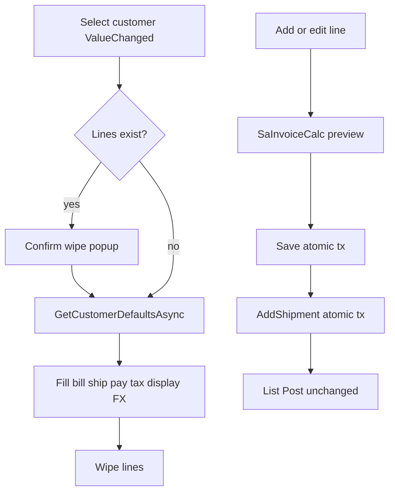

# Invoice entry: match V5.5 logic on current ErpWeb

Agreed scope: **full entry UX + persist header commercial fields**. Defer SO/DO, OPEN, COPY, credit-term, min-price, AdPara.

**Invoice Post/Rollback are unchanged.** Do not modify [PostAsync](ErpWeb.Core/Sales/SaInvoiceService.cs) / [RollbackAsync](ErpWeb.Core/Sales/SaInvoiceService.cs) except that `MapDocument` / Get may return the new header fields. Post still requires NEW + complete shipment as today.

Product calc: [SaInvoiceCalc.cs](ErpWeb.Core/Sales/SaInvoiceCalc.cs) `Amount = Round(Qty * UnitPrice, 2)`. Do not introduce `unitPriceExTax`. **Do not duplicate rounding order** in Razor, DTO mapping, or a second helper — call `CalculateLine` / `ApplyTaxAdaptiveRounding` / `CalculateHeader` exactly as coded.

**Client amounts are never persisted.** Preview = `SaInvoiceCalc`. Persist = `PrepareLinesAsync` recalculation. **UI totals must never be independently recomputed from raw Qty/Price/Discount** — only from the current `CalculateLine` / `CalculateHeader` result.

**Persisted header totals** (`GrossAmnt`, `Taxes`, `TotAmnt` on `SaInvoice`) are written every save from `CalculateHeader`. **Lines are the source of truth**; header totals are a stored rollup, recalculated on every create/update. Direct DB edits of totals are unsupported.

Tax summary boxes bind to `CalculateHeader` on the same line states:

| UI | Source |
|---|---|
| TOTAL EXCL TAX | `GrossAmnt` |
| TOTAL TAX | `Taxes` |
| TOTAL INCL TAX | `TotAmnt` |



---

## Business invariants

- `InvNo` is unique per `CompanyCode` and **immutable** after create.
- `InvPrefix` is the numbering prefix used at create and is **immutable** after create.
- Client cannot control numbering, FX, `CustName`, `StdQty`, pack, GL, stock-control, UOM, or calculated totals.
- Submitted `UnitPrice` is authoritative input (including 0). Master `SellingPrice` is UI init only.
- Invoice totals are always server-derived from lines.
- Historical snapshots (addresses, `CustName`, pay/tax/salesman/PO/remark as saved) are **not** silently refreshed from master on a normal save.
- Blank line tax = **header `TaxGrCode` fallback**, not zero. Taxable customer requires a valid tax configuration.
- Explicit 0% tax requires a real 0% `SaTaxGroup`.
- Invoice `RowVersion` changes on every **successful** invoice mutation, including successful AddShipment rebuild/create.
- Shipment delete/rebuild + invoice audit + RowVersion are **one atomic transaction**.
- Stale `RowVersion` can never overwrite current state.
- Customer change is allowed only while status is **NEW**. It deletes SP. Posted invoices cannot be edited.
- `IsSubmitting` is a UX guard only; concurrency is RowVersion + SQL locks.

---

## Transaction, concurrency and atomicity (P0 — do not simplify)

**Ownership:** each write method creates **one** `AppDbContext` via `_dbFactory` and **one** `BeginTransactionAsync` (SQL Server default **READ COMMITTED**). All locks, `GetNextAsync`, mutations, and `SaveChanges` use **that same context/connection**. Do not open a second context inside the transaction. Commit on success; `RollbackAsync` on any failure before return. `GetAsync` after commit may use a new context.

**Isolation:** session stays READ COMMITTED. Serialization of invoice/SP/number rows is via `UPDLOCK, HOLDLOCK` (and `ROWLOCK` on `MsRunningNo` as today). Do not set `IsolationLevel.Serializable` on the session.

**Lock order (writes that touch SP):** invoice → SP batch (by RefNo) → (if allocating) running-number row. Never SP-first. **Global invariant:** no invoice/SP write path may acquire `MsRunningNo` before invoice/SP locks when both resources are required. Create has no invoice row yet, so it validates first, then `MsRunningNo`, then insert — that is the only path that takes the running-number lock without a prior invoice lock.

**Retry:** do **not** retry the whole Save/Update/AddShipment on deadlock (`SqlException` 1205) or concurrency — return Fail. Keep the existing **3-attempt** loop **only** inside [RunningNumberService.GetNextAsync](ErpWeb.Core/Numbering/RunningNumberService.cs) for `MsRunningNo` insert races. That `SaveChanges` is **enlisted in the outer transaction** (same `db`); a later rollback **reuses** the sequence.

**Deadlock:** catch, log, `SaInvoiceErrorKind.Unexpected` (or Concurrency), message suitable for UI, no inner SQL text leaked.

### Create (`SaveNewAsync`) — one transaction

1. Auth `ADD`. Create db + `BeginTransaction`.
2. Reload authoritative customer/items/tax/FX/warehouses **through this same transaction/context immediately before** validation and calculation. This is **not** SQL Server snapshot isolation: READ COMMITTED still applies; later statements can see committed data from other transactions. Do not claim a coherent DB snapshot across SELECTs. Validate. `PrepareLinesAsync` calculates all money using **only** [SaInvoiceCalc](ErpWeb.Core/Sales/SaInvoiceCalc.cs) rounding order (do not duplicate or reorder: Amount = round(Qty×UnitPrice) → discount → tax → LocalAmount = round(Net×rate) → `CalculateHeader` / DecPoint).
3. Allocate InvNo: `_runningNumbers.GetNextAsync(db, company, $"{RunningNumberKeys.SaInvoice}_{invDate:yyyyMM}")` then `FormatInvNo(effectivePrefix, invDate, seq)`. Prefix = committed `SaCust.InvoicePrefix` trimmed, else `"INV"`. Persist that prefix into `InvPrefix`. Client prefix ignored. `FormatInvNo` = truncated prefix + `yyMM` + `seq:D4` (max 30). Seq is unique per company+period; `yyMM` differs across periods; truncated-prefix collisions still get distinct seq. Final uniqueness: PK `(CompanyCode, InvNo)`.
4. Insert invoice + lines; set `CreatedDate`/`CreatedBy`; persist calculated totals.
5. `SaveChanges` + `Commit`. Return `Document` + `RowVersion`.
6. If insert hits unique violation after allocate, rollback (number reused).

Do **not** allocate the number before validation. Current order (prepare then `GetNextAsync`) stays.

### Update (`UpdateAsync`) — one transaction

1. Auth `EDIT`. db + tx. `LockForUpdateAsync` (`SaInvoice WITH (UPDLOCK, HOLDLOCK)`).
2. Status must be NEW. Compare `RowVersion`; set `OriginalValue`.
3. If `CustCode` changed: lock SP by RefNo (below), delete SP details+header. Do **not** renumber. Do **not** change `InvPrefix`. Set `CustName` from the **new** customer. Bill/ship/pay come from **request** (UI already applied defaults / user edits).
4. If `CustCode` **unchanged**: do **not** reload addresses/`CustName`/pay/tax/salesman from master. Persist request snapshots as submitted (minus ignored fields).
5. Reload items/tax/FX on this `db`. Recalculate. Replace lines. Set `ModifiedDate`/`ModifiedBy`.
6. `SaveChanges` + `Commit`. Return new token.
7. Date change does **not** rebuild FIFO in this transaction.

### AddShipment — one transaction

**Confirm path** (`overwriteExisting: false`): lock invoice + SP by RefNo. If NEW SP exists → `RequiresConfirmation`, **no** `SaveChanges`, **rollback** (no RowVersion bump). Return current document/token.

**Rebuild/create path** (`overwriteExisting: true`): same locks + token check. Then **atomically**:

- delete existing SP details (and header if replacing/empty);
- FIFO insert replacement rows (or new batch via `GetNextAsync(db, company, RunningNumberKeys.IvBatch)`);
- set invoice `ModifiedDate`/`ModifiedBy` (forces new `rowversion`);
- `SaveChanges` + `Commit`.

If any step throws: **rollback**. Old SP remains. Invoice RowVersion **does not** advance.

**Test seam:** inject failure with an `internal Action?` hook on `SaInvoiceService` (same pattern as existing `TestHookAfterStockCore` / `TestHookAfterInvoiceStatus`). Place it after SP detail delete and before FIFO insert. Production code must not contain `if (isTest)` branches. SQLite/SQL Server tests assign the hook, throw, then assert rollback.

**SP lock (writes only — not `FindSpBatchAsync`):**

```sql
SELECT * FROM dbo.IvTrxBatch WITH (UPDLOCK, HOLDLOCK)
WHERE CompanyCode = @c AND BranchCode = @b AND TrxType = N'SP' AND RefNo = @invNo
```

Empty result + HOLDLOCK = key-range lock so concurrent insert of the same RefNo waits. `UQ_IvTrxBatch_SP_RefNo` is the last duplicate safeguard, not overwrite logic.

Posted SP cannot be rebuilt (existing rule).

### RowVersion schema / EF (already exists — keep)

- SQL: `RowVersion rowversion NOT NULL` on `dbo.SaInvoice` ([create-sainvoice.sql](scripts/create-sainvoice.sql)).
- EF: `builder.Property(e => e.RowVersion).IsRowVersion();` — SQL Server generated, not client-written, not an ordinary writable column.
- SQLite tests use EF substitute; **SQL Server tests prove real rowversion**.

---

## 1. Schema (new commercial columns)

Create [scripts/alter-sainvoice-header.sql](scripts/alter-sainvoice-header.sql) (`COL_LENGTH`) and add the **same** columns to `create-sainvoice.sql`. All new columns **nullable**. Deploy SQL **before** code. No auto-drop. Optional DBA PayCode backfill; app does not invent codes.

No new indexes. No `DEFAULT` constraints (NULL until saved). No column-level `COLLATE` — inherit database/table collation. None of these participate in a uniqueness index. All are **invoice snapshot** data except they are copied from master at create / customer-change time.

| Column | SQL | Max | Snapshot vs master |
|---|---|---|---|
| InvPrefix | nvarchar(20) NULL | 20 | numbering prefix used at create |
| PayCode | nvarchar(20) NULL | 20 | snapshot |
| TaxGrCode | nvarchar(20) NULL | 20 | header default / blank-line fallback |
| SalesmanCode | nvarchar(20) NULL | 20 | snapshot |
| PoNo | nvarchar(50) NULL | 50 | snapshot |
| Remark | nvarchar(500) NULL | 500 | snapshot |
| CustName | nvarchar(200) NULL | 200 | server from `SaCust.CustName` |
| InvName | nvarchar(100) NULL | 100 | editable bill-to |
| InvAddress1–3 | nvarchar(100) NULL | 100 | snapshot |
| InvAddress4 | nvarchar(100) NULL | 100 | invoice-only 4th line |
| InvCity / InvState | nvarchar(50) NULL | 50 | snapshot |
| InvPostalCode | nvarchar(20) NULL | 20 | snapshot |
| InvCountry | nvarchar(50) NULL | 50 | snapshot |
| InvTel / InvFax | nvarchar(50) NULL | 50 | snapshot |
| ShipName | nvarchar(100) NULL | 100 | editable ship-to name |
| ShipAddress1–3 | nvarchar(100) NULL | 100 | snapshot |
| ShipCity / ShipState | nvarchar(50) NULL | 50 | snapshot |
| ShipPostalCode | nvarchar(20) NULL | 20 | snapshot |
| ShipCountry | nvarchar(50) NULL | 50 | snapshot |
| ShipTel / ShipFax | nvarchar(50) NULL | 50 | snapshot |

**AppInvoice / AppShip (`bool?`):** `true` → main address; `false` or `null` → specialized Inv*/Ship*. Ship-to has three lines; **Address4 is not copied** (accepted).

**Precision (existing, keep):** Qty/StdQty `decimal(18,4)`; UnitPrice `decimal(18,4)`; Amount/TaxAmt/Net/Local/Gross/Taxes/Tot `decimal(18,2)`; ItemDiscount1–6 `decimal(18,6)`; ItemDiscAmount `decimal(18,2)`; CurrRate `decimal(18,6)`. Calc rounding: money 2 dp AwayFromZero; tax `SaInvoiceCalc.TaxDecimalPlaces`; header DecPoint true → 0 dp else 2.

**Audit (existing columns, keep names):** `Created`/`UserID` set only on insert. `Updated`/`UpdatedUID` set on every successful Update and every successful AddShipment create/rebuild. Confirm-only AddShipment does not write audit. Do not change `Created*` on update.

Legacy rows: viewable. Edit **loads successfully** and allows typing. Missing mandatory fields (e.g. PayCode) show field-level errors; **Save stays disabled or is rejected** until valid. Do not invent values.

---

## 2. DTO / errors / auth

SaveRequest vs Document: `RowVersion` required on update and AddShipment; `CustName`/`CurrRate`/`InvPrefix` numbering/totals not accepted from client; `InvName` editable; line `UnitPrice` submitted including 0; no `StdQty`/`StdPackSize` on request.

`SaInvoiceItemLookupRow`: ICode, IDesc, StdUom, StdPackSize, SellingPrice, SellingGlCode, TaxGroup, StockControl, DefWarehouse. Never `IvStockLookupRow.PurchasePrice`.

**`SaInvoiceErrorKind`:** Validation, Concurrency, Confirmation, NotFound, Authorization, BusinessRule, Unexpected.

**Structured validation:** reuse the existing master pattern (`IvMasterOperationResult.ValidationErrors` = `IReadOnlyDictionary<string, string>`), not a new type. Keys: header fields (`PayCode`, `Currency`, `TaxGrCode`, …) and line keys (`Lines[n].UnitPrice`). UI binds those to the field map below. Message-only Fail remains for Concurrency/Unexpected.

| Kind | UI |
|---|---|
| Validation | Stay; show message / field errors |
| Concurrency | Stop; offer Reload |
| Confirmation | Overwrite dialog; retry with **returned** token |
| NotFound | Message; return to list |
| Authorization | Access error |
| BusinessRule | Stay; show message |
| Unexpected | Generic error; log server-side |

Do not leak SQL/exception details to the UI.

**Authorization** — existing `IAccessRightService` + `MenuCodes.SalesInvoice` (state this; do not invent a second model):

| Operation | Permission |
|---|---|
| Get, lookups, GetCustomerDefaults, ResolveCurrencyRate | ACCESS |
| SaveNew | ADD |
| Update, AddShipment | EDIT |
| Delete (listing) | DELETE |
| Post / Rollback | POST / ROLLBACK — **unchanged** |

Tenant: `ValidateWriteContext` company/branch as today. **Lookup lists are UX only.** **Service validation is required** on save: customer active in company; warehouse in tenant active list; currency known/active; item active; pay code / tax group exist. No separate warehouse menu check.

---

## 3. Service rules

### Numbering (existing mechanism — reference, do not reinvent)

[RunningNumberService.GetNextAsync](ErpWeb.Core/Numbering/RunningNumberService.cs) on the **same** `db` as the invoice transaction. Key = `SA_INV_{yyyyMM}` ([RunningNumberKeys.SaInvoice](ErpWeb.Core/Numbering/RunningNumberKeys.cs)). SQL Server: `MsRunningNo WITH (UPDLOCK, ROWLOCK, HOLDLOCK)`. Sequence is **company + period key**, not per customer. Prefix is **not** part of the allocation key; it is applied in `FormatInvNo`. Concurrent creates serialize on `MsRunningNo`. Failed invoice insert after allocate rolls back `LastNo`. Client never generates InvNo.

### FX lookup (existing semantics — keep)

[ResolveCurrRateAsync](ErpWeb.Core/Sales/SaInvoiceService.cs): `SaCurrRate` where `CurrCode` matches, `Status == true`, **`StartDate <= InvDate.Date` and `EndDate >= InvDate.Date`** (inclusive window). If several windows match, **`OrderByDescending(StartDate)` take first**. Not company/branch-specific. Rate is `HomeCurPerUnit` as decimal. Home `MYR` with no row → 1. Foreign no row → fail. Foreign rate == 1 → fail. Save **ignores** client rate. `ResolveCurrencyRateAsync` for UI date/currency change uses this same rule; does not reload addresses.

### Prefix

Committed customer prefix at save via `GetByCodeAsync` (**no customer UPDLOCK**). Immutable after create.

### Header tax vs lines

Stored invoice `TaxGrCode` is the **fallback used for blank lines** at save (not a live customer lookup, not display-only).

- Item select: UI inits line tax from `item.TaxGroup` if valid in `SaTaxGroup`.
- Non-blank line tax: must exist; use that %.
- Blank line: persist `TaxGrCode` **blank**. Effective tax group for calc = **line tax if specified, otherwise invoice header `TaxGrCode`**. Do not fill blank line tax from header on save (that would freeze fallback and break later header-tax changes).
- If customer `Taxable` and header tax missing/unknown → **reject**. If not taxable and blank → 0%.
- Header tax change with existing lines: explicit line taxes **unchanged**; blank lines pick up new header tax on **next save recalc**.
- Blank means fallback, not no-tax.

### Unit price / pack / item master

UI inits price from SellingPrice; user may set 0. Server uses submitted price. Pack, StockControl, StdUom, SellingGlCode from **item master at save**. StdPackSize on VM is **read-only**, refresh on item change, never submitted.

### Snapshots

**Create:** snapshot customer identity + request bill/ship/pay (defaults filled by UI). `CustName` from server customer.

**Update, same customer:** persist request snapshots; **do not** refresh from master.

**Update, customer changed:** `CustName` from new customer; addresses/pay from request; delete SP; no renumber. Status must be NEW.

### Discount domain (server)

- Percent mode: any of %1–6 ≠ 0. Amount mode: any of amount1–2 ≠ 0. **Both → reject.**
- All zeros → allowed (no discount).
- Any percent &lt; 0 or &gt; 100 → reject.
- Any amount &lt; 0 → reject.
- Multiple percents in percent mode **allowed** (cascade/JOIN as today).
- Both amount fields in amount mode **allowed**.
- If `CalculateDiscountPerUnit` &gt; `UnitPrice` → reject. If `UnitPrice == 0` and any discount % or amount &gt; 0 → reject. Zero price with zero discount is allowed.
- UI switching modes clears the inactive set. Follow `SaInvoiceCalc` for rounding; do not invent a second discount round.

### Other validation / field-level UI map

PayCode required on save; active customer; known currency; lengths; uppercase name/address only. Inclusive mix ST000032.

| Field / code | Validation | UI target |
|---|---|---|
| CustCode | required, active in company | Customer combo |
| PayCode | required on save; valid pay-code master | Payment tab |
| Currency | required; active currency | Payment tab |
| Header TaxGrCode | required if customer Taxable; must exist in SaTaxGroup | Payment tab |
| InvDate | required | Header date |
| Line ICode | required; active item | Line popup |
| Line Qty | > 0; StdQty ≠ 0 after pack | Line qty |
| Line UnitPrice | submitted; 0 allowed | Line price |
| Line TaxGrCode | blank = header fallback; unknown = error | Line tax |
| Line FrWarehouse | required if StockControl; tenant active WH | Line warehouse |
| Discounts | mixed/negative/>100/overflow as above | Line discount |
| RowVersion | required on update/shipment | Reload banner |

Warehouse validity = active warehouse for current company/branch (existing lookup). No extra warehouse menu permission.

---

## 4. UI

Controlled customer `Value`/`ValueChanged`; `_pendingCustCode`; `_isApplyingDefaults`; seq/CTS; latest-wins; cancel restores. No first-customer preselect. Disable Add/Save until customer + valid FX.

**Blazor Server lifecycle:** component CTS canceled on dispose; ignore completed callbacks if `_disposed` or seq mismatch; do not `StateHasChanged` after dispose; no invoice draft in a singleton; service already uses `IDbContextFactory` per call — page must not hold a DbContext. Long lookups must pass the CTS. `IsSubmitting` serializes Save/AddShipment (UX only).

Dirty guard like misc issue / customer entry. View: no mutate. Persistent shipment-date warning until rebuild succeeds.

ErrorKind mapping as table above. Confirmation uses token from the confirmation **result**, then overwrite true.

---

## 5. Tests

Keep `SaInvoiceCalcTests` Amount formula.

Sqlite: header round-trip; AppInvoice/AppShip true/false/null; FX; customer change no renumber + SP wipe; prefix ignore; CustName server-owned; tax fallback/reject; submitted price including 0; pack/GL/stock from master (item master change between UI init and save is ignored for pack/GL/stock — server current values used; submitted price still wins); mixed discount reject; negative/%&gt;100 discount reject; PayCode required on update; LocalAmount from server FX; RequiresConfirmation does not bump version; Qty 4 dp / money 2 dp / DecPoint 0 dp header rounding.

**Mandatory SQL Server** [SaInvoiceSqlServerConcurrencyTests.cs](ErpWeb.Tests/SaInvoiceSqlServerConcurrencyTests.cs):

- Stale invoice token fails
- AddShipment bumps RowVersion
- Stale shipment-confirm token fails after rebuild
- Concurrent SP create: one batch
- **Forced exception mid-rebuild: old SP intact, invoice unchanged, RowVersion unchanged**
- Concurrent new invoices: no duplicate InvNo
- Update vs shipment race: one winner via lock/RowVersion
- Alter-script columns present; legacy-shaped row loads

UI/manual: cancel customer change; stale defaults; discount mode clears; unsaved nav; date warning; view; double-click; pack not editable; missing PayCode on legacy edit.

`dotnet test --filter "FullyQualifiedName~SaInvoice"`

---

## 6. Out of scope

SaSO/SaDO, OPEN/CLOSED, COPY, credit/min-price/AdPara, catch-weight, Edit shipment lots, InvoiceDraft, salesman master, manual FX, unitPriceExTax, IvMsCode invoice tax, persisted pack snapshot, customer UPDLOCK, **changing Post/Rollback algorithms**, retrying whole invoice transactions on deadlock.

**Implementation status:** APPROVED. Do not weaken transaction + RowVersion + invoice lock + SP RefNo lock + unique RefNo. Do not move money/FX/numbering to the client, silently refresh snapshots, use `FindSpBatchAsync` for writes, retry whole tx on deadlock, edit pack without a persisted snapshot, change Post/Rollback, or introduce `unitPriceExTax`.
