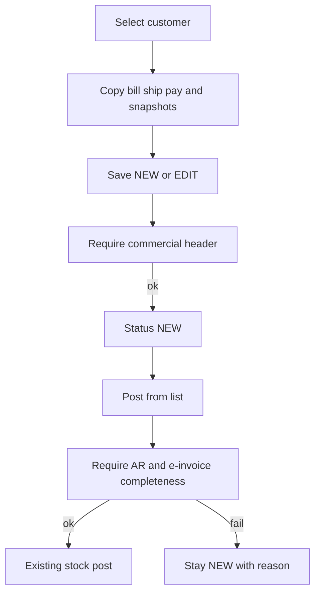

# Invoice save, populate, and post gates

Customer select already copies bill/ship/payment defaults in [`GetCustomerDefaultsAsync`](ErpWeb.Core/Sales/SaInvoiceService.cs). This work adds **required-field gates**, **document snapshots**, and a **Post completeness check**. It does **not** post journals to an Account database (that module is not in the repo). Post remains stock posting, but will fail closed if AR/e-invoice data is missing so a later GL writer can trust the invoice row.

## Save vs Post (do not mix)

**Save (new/edit)** — commercial document, still editable:

- Keep: customer, date, pay term, currency/FX, at least one line, item, qty, warehouse for stock, tax group if customer is taxable
- Add: **InvName**, **InvAddress1**, **InvCountry**
- If those three are blank on the request, fill from the same customer default rules as populate, then validate
- Align UI `CanSave` in [`SaInvoice.razor.cs`](ErpWeb.UI/Sales/Transactions/SaInvoice.razor.cs) with tax-group-when-taxable
- Show `FieldError` on Billing (name/address/country) and Payment (pay term/tax)

**Post** — freeze for stock + future AR/e-invoice. Fail with a clear reason before stock work in [`PostOneAsync`](ErpWeb.Core/Sales/SaInvoiceService.cs):

- **AR:** snapshotted `ArGlCode`; every line `SellingGlCode`; `TaxGlCode` on the tax group when header `Taxes != 0`
- **E-invoice buyer:** `InvName`, `InvAddress1`, `InvCity`, `InvPostalCode`, `InvCountry`; `InvTel` or `InvEmail`; `BuyerTin` **or** `BuyerBrn`
- **E-invoice line:** `Classification` on every line
- **KPI:** `SalesmanCode` must be a valid active sales rep
- **Due date** must be set (computed on save)

Save still allowed when TIN/GL/classification are empty; Post is the hard gate.

## Populate (already works — extend, do not rebuild)

Keep `AppInvoice` / `AppShip` mapping in `GetCustomerDefaultsAsync`. Extend [`SaInvoiceCustomerDefaults`](ErpWeb.Core/Sales/ISaInvoiceService.cs) and `ApplyDefaults` so Payment also receives:

- Salesman (from customer)
- Tax group, pay code, currency/rate (already)
- Email (for billing snapshot)

Do not re-populate addresses on every save; only on customer change (existing confirm-and-clear-lines). Extra addresses (`SaCustAdd`) stay out of scope.

`InvAddress4`: keep current rule (main `Address4` only when `AppInvoice`; dedicated billing has no line 4). No customer Billing tab in this pass — users can edit the invoice Billing tab after populate.

## Snapshots (server-owned, copied at save)

Copy from **current customer/item** at save so KPI/e-invoice/AR do not drift when masters change later. User still edits bill/ship/pay/remark/PO on the request.

Header (new nullable columns on `SaInvoice`):

- `DueDate` — `InvDate + SaPaymentTerm.Days` (0 days if no term row)
- `ArGlCode` — `SaCust.GlCode`
- `InvEmail` — `SaCust.Email` (or existing invoice value if user later has a field)
- `BuyerTin` — `SaCust.TinNo` (new customer field)
- `BuyerBrn` — `SaCust.CustBrn`
- `BuyerRegType` — `SaCust.RegType`
- `GstregNo` — `SaCust.GstregNo`
- KPI: `CustType`, `CustGroupCode`, `AreaCode`, `IndustryCode`, `ChannelCode`

Line: copy `Classification` from [`IvStockMaster.Classification`](ErpWeb.Model/Entities/Inventory/IvStockMaster.cs) (already persist `SellingGlCode`).

Masters needed for Post:

- `SaCust.TinNo` nvarchar(20) nullable — optional on customer save, shown on customer tax/payment area
- `SaTaxGroup.TaxGlCode` nvarchar(20) nullable — tax group popup in [`SaTaxGroupList.razor`](ErpWeb.UI/Sales/Masters/SaTaxGroupList.razor)

Manual DBA scripts (same pattern as [`scripts/alter-sacust-industry-channel.sql`](scripts/alter-sacust-industry-channel.sql)):

- `scripts/alter-sainvoice-post-snapshots.sql`
- `scripts/alter-sacust-tin.sql`
- `scripts/alter-sataxgroup-gl.sql`

EF configs in [`SaInvoiceConfiguration`](ErpWeb.Model/Configurations/Sales/SaInvoiceConfiguration.cs), [`SaInvoiceDetailConfiguration`](ErpWeb.Model/Configurations/Sales/SaInvoiceDetailConfiguration.cs), [`SaCustConfiguration`](ErpWeb.Model/Configurations/Sales/SaCustConfiguration.cs), [`SaTaxGroupConfiguration`](ErpWeb.Model/Configurations/Sales/SaTaxGroupConfiguration.cs). Map through document DTO + `ApplyHeader` in the invoice service.

## Payment UI

- Salesman: `IvCodeComboBox` from active `SaSalesRep` (add list to `GetLookupsAsync`; validate code on save if present)
- Due date: read-only on Payment tab
- Pay code stays `IvMsCode` PAYCODE; days come from `SaPaymentTerm` when the same code exists
- Default pay/tax/salesman from customer (already); user may override

## Post gate placement

In `PostOneAsync`, after status=NEW and details load, run `ValidatePostReadiness` **before** shipment/stock. On failure return `SaInvoicePostingItemResult.Failed(invNo, reason)` and leave status NEW. Do not write AR/GL batches.

## Tests

[`SaInvoiceServiceTests.cs`](ErpWeb.Tests/SaInvoiceServiceTests.cs):

- Save succeeds after backfill from customer defaults; fails if name/address1/country still empty
- Defaults still honor `AppInvoice` / `AppShip`
- Save stores DueDate, ArGlCode, KPI/e-invoice snapshots, line Classification
- Post fails without AR GL / line sales GL / tax GL (when tax ≠ 0) / TIN-or-BRN / classification / salesman
- Existing ship-post-rollback still passes once seed customers/items/tax groups include Country, GlCode, Tin or Brn, Classification, TaxGlCode, and a sales rep + payment term days

Update in-memory seed (`CUST01` etc.) and tax groups `SR`/`ZR`. SQL concurrency tests keep working if save backfill covers missing request fields; seed DEMO data in those tests if they insert customers.

## Out of scope

- Writing AR/GL to an Account database
- MyInvois submit/IRBM API
- Credit-limit / period lock
- Customer extra-address picker
- Customer dedicated Billing tab
- Making TIN required on customer master save
