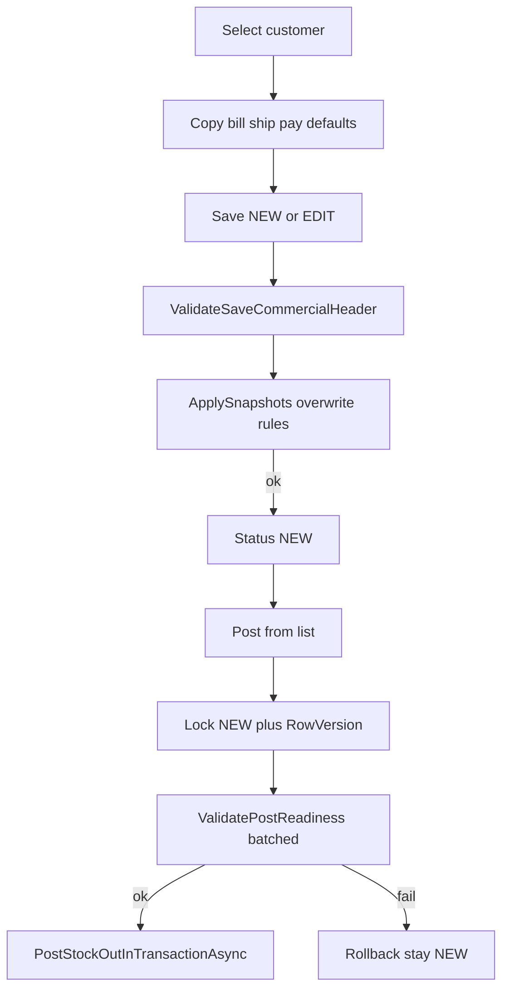

# Invoice save, populate, and post gates (hardened v2)

Do not mix Save and Post. Save stays a commercial document (NEW). Post stays stock posting and **fails closed** if AR/e-invoice snapshots are incomplete. No Account-DB journal writer.



Current code already company+branch-scopes invoice loads via `LockForUpdateAsync` in [`SaInvoiceService.PostOneAsync`](ErpWeb.Core/Sales/SaInvoiceService.cs) (starts ~1166). This work adds named gates, snapshots, and Post completeness — it does not replace stock posting.

---

## Locked decisions (review P0/P1)

**RowVersion source and encoding**

- Type is `byte[]` everywhere ([`SaInvoice.RowVersion`](ErpWeb.Model/Entities/Sales/SaInvoice.cs), [`SaInvoiceDocument`](ErpWeb.Core/Sales/ISaInvoiceService.cs), [`SaInvoiceSaveRequest`](ErpWeb.Core/Sales/ISaInvoiceService.cs)). Blazor is in-process — **not** Base64.
- Post from the list does not send a token today. `PostOneAsync` keeps an optional `byte[]? expectedRowVersion`.
- If `expectedRowVersion` is non-null and `Length > 0`, set `db.Entry(inv).Property(x => x.RowVersion).OriginalValue = expectedRowVersion`.
- If omitted/empty, **do not manufacture a token**. Use the token loaded with the tracked entity from `LockForUpdateAsync`.
- Catch `DbUpdateConcurrencyException` → `POST_CONCURRENCY`.

**Transaction boundary**

- Keep the existing outer `BeginTransaction` on the same `AppDbContext`.
- Call existing [`PostStockOutInTransactionAsync`](ErpWeb.Core/Inventory/IvInventoryPostingService.cs) (already mutates in-context and **does not** `SaveChanges` or open its own transaction). Do not wrap it in a new DbContext or nested commit.
- One `SaveChanges` then `Commit` for stock mutations + invoice status/`RowVersion`.
- **Every** failure after `BeginTransaction` (not found, not NEW, readiness, shipment, stock, concurrency) must `RollbackAsync` before return. Status stays NEW on readiness fail.

**IvStockMaster company scope**

- [`IvStockMaster`](ErpWeb.Model/Entities/Inventory/IvStockMaster.cs) PK is `(CompanyCode, ICode)`. Readiness **must** filter `CompanyCode == context.CompanyCode`. Same for [`SaTaxGroup`](ErpWeb.Model/Entities/Sales/SaTaxGroup.cs) `(CompanyCode, TaxGrCode)` and [`SaSalesRep`](ErpWeb.Model/Entities/Sales/SaSalesRep.cs) `(CompanyCode, SrepCode)`.
- Invoice identity is `(CompanyCode, BranchCode, InvNo)` — never load by `InvNo` alone. Missing/blank `CompanyCode` (or branch on write) fails closed via existing `ValidateWriteContext` / `ValidateUserContext`.

**IsFreeline (no new column)**

- Do **not** add `SaInvoiceDetail.IsFreeline`. Save already requires `ICode` ([`PrepareLinesAsync`](ErpWeb.Core/Sales/SaInvoiceService.cs) ~1495).
- Named detector only (entity field is `ICode`, not `ItemCode`):

```csharp
static bool IsFreeline(SaInvoiceDetail line) => string.IsNullOrWhiteSpace(line.ICode);
```

- `ValidatePostReadiness` must call `IsFreeline` only — no duplicate inline predicates.
- Freeline Post tests persist a blank-`ICode` detail via the test DbContext (bypass Save), then call Post.

**Reason-code precedence (first match wins)**

Checked in this order; return that single code:

1. `POST_CONCURRENCY` (not NEW, or RowVersion mismatch / `DbUpdateConcurrencyException`)
2. `POST_SALESMAN_INVALID`
3. `POST_DUE_DATE_MISSING`
4. `POST_AR_GL_MISSING`
5. `POST_TAX_GL_MISSING` (only if `HasTax`)
6. `POST_BUYER_ADDRESS`
7. `POST_BUYER_CONTACT`
8. `POST_BUYER_ID`
9. `POST_LINE_SALES_GL_MISSING` (first failing line in line order)
10. `POST_LINE_CLASSIFICATION` (first failing stock line in line order)

Extend [`SaInvoicePostingItemResult`](ErpWeb.Core/Sales/ISaInvoiceService.cs) with `ReasonCode` and `Failed(invNo, reasonCode, userMessage)`. Keep the existing two-arg `Failed` for shipment/stock messages (those codes stay as today).

---

## 0. Prerequisite — TaxGlCode UI before Post gate

Ship in this order; do not enable `ValidatePostReadiness` until tax-group UI can set `TaxGlCode`.

1. [`scripts/alter-sataxgroup-gl.sql`](scripts/alter-sataxgroup-gl.sql) (new) + EF [`SaTaxGroup.TaxGlCode`](ErpWeb.Model/Entities/Sales/SaTaxGroup.cs) nvarchar(20) + popup field in [`SaTaxGroupList.razor`](ErpWeb.UI/Sales/Masters/SaTaxGroupList.razor)
2. [`scripts/alter-sacust-tin.sql`](scripts/alter-sacust-tin.sql) + `SaCust.TinNo` nvarchar(20) nullable + customer tax/payment UI next to BRN in [`SaCustEntry.razor`](ErpWeb.UI/Sales/Masters/SaCustEntry.razor) — still optional on customer save
3. [`scripts/alter-sainvoice-post-snapshots.sql`](scripts/alter-sainvoice-post-snapshots.sql) + invoice/detail EF
4. Then wire the Post gate in `PostOneAsync`

Script pattern: same as [`scripts/alter-sacust-industry-channel.sql`](scripts/alter-sacust-industry-channel.sql) (`SET XACT_ABORT`, `COL_LENGTH` idempotent add, TRY/TRAN). Do not run at app startup.

**Invoice header columns:** `DueDate`, `ArGlCode`, `InvEmail`, `BuyerTin`, `BuyerBrn`, `BuyerRegType`, `GstregNo`, `CustType`, `CustGroupCode`, `AreaCode`, `IndustryCode`, `ChannelCode`.

**Line column:** `Classification` nvarchar (match [`IvStockMaster.Classification`](ErpWeb.Model/Entities/Inventory/IvStockMaster.cs) length).

Map via EF configs [`SaInvoiceConfiguration`](ErpWeb.Model/Configurations/Sales/SaInvoiceConfiguration.cs), [`SaInvoiceDetailConfiguration`](ErpWeb.Model/Configurations/Sales/SaInvoiceDetailConfiguration.cs), plus document DTO + `ToRequest()` round-trip so Update does not wipe preserved snapshots.

---

## 1. Save — `ValidateSaveCommercialHeader`

After backfill of `InvName` / `InvAddress1` / `InvCountry` from customer defaults when those request fields are blank, require them non-whitespace. Keep existing Save rules (customer, date, pay term, currency/FX, ≥1 line, `ICode`, qty, warehouse for stock, tax group when customer taxable).

Align UI `CanSave` in [`SaInvoice.razor.cs`](ErpWeb.UI/Sales/Transactions/SaInvoice.razor.cs) with tax-group-when-taxable. Show `FieldError` on Billing (name/address/country) and Payment (pay term/tax).

Company/branch on every Get/Save/Post/list keyed action: existing tenant helpers; never query invoice by `InvNo` alone.

---

## 2. Snapshots — server-owned vs user-owned

Add a short comment on `ApplySnapshots` so later edits do not overwrite user-owned fields.

| Field | Rule |
|---|---|
| DueDate | Always recompute: `InvDate.Date + (SaPaymentTerm.Days ?? 0)`. Missing pay-term row → 0 days → `DueDate = InvDate` |
| ArGlCode, KPI (`CustType`, `CustGroupCode`, `AreaCode`, `IndustryCode`, `ChannelCode`), `BuyerRegType`, `GstregNo` | Always refresh from current customer |
| BuyerTin | If null/whitespace → `SaCust.TinNo`; else preserve |
| BuyerBrn | Same parity: whitespace → `SaCust.CustBrn`; else preserve |
| InvEmail | Same: whitespace → `SaCust.Email`; else preserve |
| Line Classification | If blank → copy `IvStockMaster.Classification` (company-scoped `ICode` lookup); else preserve |
| Bill/ship/pay/remark/PO | User-owned via existing [`ApplyHeaderSnapshots`](ErpWeb.Core/Sales/SaInvoiceService.cs); backfill name/address1/country only when blank, then validate |

Round-trip Tin/Brn/Email/Classification on the document and `ToRequest()` so Update preserve works even without new editors.

---

## 3. Post — `ValidatePostReadiness` before stock

After lock + status=NEW (and optional OriginalValue), run batched readiness **before** shipment/stock.

```csharp
public const decimal TaxEpsilon = 0.01m;
static bool HasTax(decimal taxes) => Math.Abs(taxes) >= TaxEpsilon;
static string? Norm(string? s) => string.IsNullOrWhiteSpace(s) ? null : s.Trim();
```

- `POST_TAX_GL_MISSING` only when `HasTax(inv.Taxes)` and tax group `TaxGlCode` blank (company-scoped load).
- Buyer ID: `Norm(BuyerTin)` and `Norm(BuyerBrn)` both null → `POST_BUYER_ID`.
- Salesman: resolve `SaSalesRep` for company; missing, unknown, or `IsActive == false` → `POST_SALESMAN_INVALID`. Whitespace-only code is invalid.
- Classification required when `!IsFreeline(line)`.
- `SellingGlCode` required for all stock lines (`!IsFreeline`) and for freelines with `Amount != 0`; skip zero-amount freelines.

**Batched loads (no per-line `FirstOrDefaultAsync`):** distinct non-blank `ICode`s, header `TaxGrCode`, salesman code — one query each, always with `CompanyCode`.

List Post does not need to start sending RowVersion in this pass.

---

## 4. Populate + Payment UI

Keep `AppInvoice` / `AppShip` in `GetCustomerDefaultsAsync`. Extend [`SaInvoiceCustomerDefaults`](ErpWeb.Core/Sales/ISaInvoiceService.cs) + `ApplyDefaults` with Salesman (already on defaults) and Email. Addresses only on customer change. `InvAddress4` rule unchanged.

Payment: salesman `IvCodeComboBox` from **active** `SaSalesRep` via extended `GetLookupsAsync`; DueDate read-only; pay code stays `IvMsCode` PAYCODE.

---

## 5. Tests ([`SaInvoiceServiceTests.cs`](ErpWeb.Tests/SaInvoiceServiceTests.cs))

Seed `CUST01` (and tax groups `SR`/`ZR`) with Country, GlCode, Tin or Brn, item Classification, TaxGlCode, active sales rep, pay-term days.

| Case | Assert |
|---|---|
| Save backfill | succeeds; fails if name/address1/country still empty after backfill |
| AppInvoice/AppShip | defaults honored |
| Snapshots | DueDate/ArGlCode/KPI stored; Tin/Brn/Email/Classification preserve-when-set |
| Pay-term missing | DueDate = InvDate |
| Non-blank InvEmail | not overwritten by customer Email |
| HasTax boundaries | `-0.009m` and `0.00m` skip TaxGlCode; `-0.01m` and `0.01m` require it |
| Abs(Taxes) >= epsilon without TaxGlCode | `POST_TAX_GL_MISSING` |
| Stock line blank classification | `POST_LINE_CLASSIFICATION` |
| IsFreeline blank classification | Post allowed (blank `ICode` line inserted in test) |
| Whitespace TIN and BRN | `POST_BUYER_ID` |
| One of TIN/BRN with surrounding whitespace | accepted after Norm |
| Whitespace SalesmanCode | `POST_SALESMAN_INVALID` |
| Inactive salesman | `POST_SALESMAN_INVALID` |
| Missing/blank CompanyCode | fail closed |
| Cross-company InvNo | Save/Post not found |
| Readiness fail | rollback; status NEW |
| Concurrent post | second → `POST_CONCURRENCY`; consistent NEW or one POSTED |

Existing ship-post-rollback tests must still pass once seeds include the new required Post fields.

---

## Out of scope

AR/GL Account writer, MyInvois/IRBM, credit-limit/period lock, customer extra-address picker / Billing tab, making TIN required on customer master save, adding `IsFreeline` column, relaxing Save’s required `ICode`.
