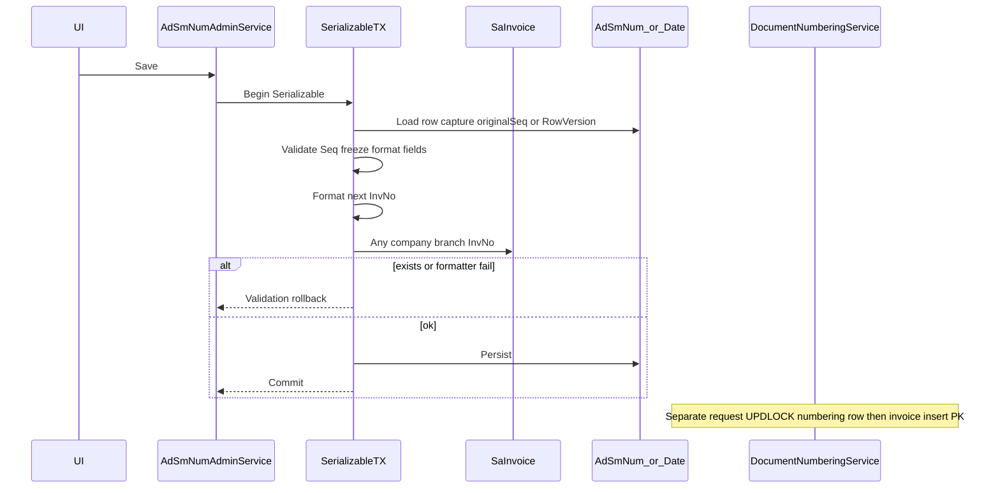

# Numbering admin UI (implementation-ready)

Treat this as a **document-numbering control**, not ordinary CRUD. Do not grow [`SaSalesRefService`](ErpWeb.Core/Sales/SaSalesRefService.cs). Allocation stays on [`IDocumentNumberingService`](ErpWeb.Core/Numbering/IDocumentNumberingService.cs) (always reads/locks from DB; **no in-memory numbering cache**). Admin CRUD is [`IAdSmNumAdminService`](ErpWeb.Core/Numbering/IAdSmNumAdminService.cs) with `IDbContextFactory` + its own transactions.

Admin collision checking is **preventive validation only**. Runtime allocation plus [`SaInvoice`](ErpWeb.Model/Entities/Sales/SaInvoice.cs) PK `(CompanyCode, BranchCode, InvNo)` remain the uniqueness guarantee under concurrency. Historical duplicate InvNo (if any) must not break the check: use **`AnyAsync` existence**, never `Single`.

## Service

Register in [`CoreServiceCollectionExtensions.cs`](ErpWeb.Core/CoreServiceCollectionExtensions.cs). Reuse `IvMasterOperationResult<T>` / `IvMasterErrorCode`. UI/route/body **never** supply Company/Branch/Location.

**Permissions (service-level, same pattern as [`SaSalesRefService`](ErpWeb.Core/Sales/SaSalesRefService.cs)). UI hiding buttons is not authorization.**

- List / Get → `ACCESS` on `SA_SM_NUM` or `SA_SM_NUM_DATE`
- Save insert → `ADD`; Save update → `EDIT`
- Delete → `DELETE`
- Denied → `AccessDenied`

**Scope:**

- List / Get / Delete → [`TryBranchScope`](ErpWeb.Core/Inventory/InventoryTenantContext.cs) (location not required)
- Save → `TryWriteScope` (location required; stamp only, not identity)
- Missing write location on Save → `InvalidScope`

**Continuous `AdSmNum`** (PK `CompanyCode, BranchCode, NumCd`):

- List current branch, order by `NumCd`
- Get/Save/Delete by `NumCd`
- New: NumCd required, max 10, uppercased; Seq defaults to **1**
- Edit: NumCd read-only
- Insert stamp: `LocationCode`, `Created`, `UserID`, `Updated`, `UpdatedUID`
- Update stamp: `LocationCode`, `Updated`, `UpdatedUID` (do not invent columns)
- Reject save if any `AdSmNumDate` exists for same tenant+NumCd (do **not** auto-delete)

**Period `AdSmNumDate`** (identity `uid`; unique `Company, Branch, NumCd, Year, Month`):

- List current branch, order `NumCd`, `Year DESC`, `Month DESC`, `uid DESC`
- Get/Save/Delete by `Uid`; Save and Delete require matching `RowVersion`
- New: NumCd max 10 uppercased; persist Year/Month as `0` never null
- Edit: NumCd, Year, Month **immutable**. To change year/month: **delete + recreate**, or insert a **different** Year/Month row. Both paths use the same collision + freeze rules.
- Insert **and** update stamp: `LocationCode`, `UserID`, `Updated`. `UserID` is the last-updated user because there is **no** `UpdatedUID` column — do not add one.
- Reject save if an `AdSmNum` row exists for same tenant+NumCd
- Duplicate unique key → `DuplicateKey` (map SQLite unique and SQL 2627/2601)

Mutual-exclusion copy: "Period numbering already exists for {NumCd}. Delete those period rows before creating a continuous series." (and the inverse).

**Admin-created vs allocator-created period:** Admin insert persists `Seq = 1`. Runtime missing-period insert persists `Seq = 2` (invoice #1 consumed). Admin writes `Seq = 2` only if the user set next-sequence to 2.

## Configuration-change policy (after first use)

**Used row:** loaded persisted `Seq > 1` (allocator contract: first issue advances Seq to 2). Applies to **update** only.

- **Before use (`Seq == 1`):** Prefix, TotLength, delimiter, NumberingFormat may change, still subject to formatter + next-InvNo collision.
- **After use (`Seq > 1`):** those namespace fields are **frozen**. Only `Seq` (monotonic increase) and `NumDes` may change. Attempt to change Prefix / TotLength / `NumberingDelimeter` / `NumberingFormat` → `Validation` (e.g. "Prefix cannot be changed after numbers have been issued. Create a new series or period.").
- New numbering namespace = new `NumCd`, or a new period `(NumCd, Year, Month)`, or delete+recreate. Recreate is a **new insert** (Seq typically 1) and is allowed to set format fields, then must pass collision.

Year/Month/NumCd stay immutable on edit regardless of Seq.

## P0: number-reuse safety

### Seq cannot be lowered

Authoritative Seq is the **row loaded from DB at the start of the save transaction**, not the value the UI last displayed.

Update flow (both tables):

1. Open factory context + transaction (see isolation below).
2. Load current row. If missing → `NotFound`.
3. Capture `originalSeq` (continuous) or `RowVersion` (period).
4. If persisted `Seq > 1`, reject namespace-field changes.
5. If proposed `Seq < originalSeq` → `Validation` on `Seq`. Raising Seq is allowed.
6. Format next InvNo; collision `AnyAsync`; persist.
7. Continuous: `UPDATE … AND Seq = @originalSeq`. 1 row → success; 0 rows → `Concurrency`. **No second unconditional overwrite.**
8. Period: `SaveChanges` with loaded `RowVersion`. Stale token → `Concurrency`.

Insert: no persisted Seq; collision check is the recreate guard.

### Collision check + save = one transaction (P0)

Save (insert and update) **must**:

- Use **one** `CreateDbContext` and **one** transaction for load, collision `AnyAsync`, and persist.
- Isolation: `BeginTransactionAsync(IsolationLevel.Serializable, ct)` so a concurrent invoice insert of the checked InvNo cannot sneak in between the existence read and config commit (gap lock on the invoice PK).
- Collision query: `SaInvoice.AnyAsync(CompanyCode == scope && BranchCode == scope && InvNo == formattedNext)` — PK seek. [`SaInvoiceConfiguration`](ErpWeb.Model/Configurations/Sales/SaInvoiceConfiguration.cs) already has PK `(CompanyCode, BranchCode, InvNo)`. **Do not add a duplicate index.**
- Same `db` instance; do not check on one context and save on another.

If the concurrent invoice **wins**:

- Serializable conflict / deadlock (SQL 1205, 3961, etc.) → rollback, `Concurrency` (reload/retry). Never silent success.
- Or the InvNo now exists on a retry of the existence check → `Validation` collision message.

SQLite tests still use one transaction; they may not reproduce SQL Server serialization races. Cover the race in [`SaInvoiceSqlServerConcurrencyTests`](ErpWeb.Tests/SaInvoiceSqlServerConcurrencyTests.cs) style (or a sibling numbering admin SQL Server test): admin save vs invoice create of the same next InvNo — one fails safely, no duplicate InvNo, no poisoned Seq=1 config committed if the invoice landed first.

Delete also uses one context + transaction (default isolation is enough: it only deletes the numbering row). On SQL Server, runtime allocation already `UPDLOCK`s that numbering row; admin delete **waits or fails** on the same row — do not add a second locking protocol. After delete commits, the next `NextAsync` re-reads the DB and returns not-configured (or the other table per routing). Recreate collision runs against **committed** invoices in its save TX.

### Next-number collision (insert, and unfrozen updates)

After field validation, still format the **next** number at **proposed Seq** with [`DocumentNumberFormatter`](ErpWeb.Core/Numbering/DocumentNumberFormatter.cs) (same formulas as allocation).

Sample date (service **and** UI sample must match):

- Year>0 and Month>0 → that year/month, day 1
- Year>0 Month=0 → that year, January 1
- Year=0 Month=0 or continuous table → `2000-01-01` (date parts unused)

Formatter throw / overflow / formatted length `> 30` → `Validation`. TotLength itself may be `> 30` only if **actual formatted output** stays `<= 30`; Prefix + delimiter + date + sequence overflowing 30 is rejected the same way.

Then `AnyAsync` on that InvNo. Message: "This configuration would issue {docNo}, which already exists."

After-use freeze means future namespace overlap from Prefix/format edits is **not** a remaining hole: those fields cannot change once `Seq > 1`. Next-number collision remains required for insert, Seq increases, and before-use format edits.

### Delete / recreate

- Delete only removes the config row. Never decrement or rewrite Seq on remaining rows.
- Delete allowed at config level (no invoice-in-use block). Recreate is the safety net and **is subject to the same collision check**.
- Recreate with Seq=1 when that formatted InvNo exists → rejected.
- Recreate with a Seq whose formatted InvNo is unused → allowed; user sets next sequence (do not auto-repair).

## Validation (service is authoritative)

**Year / Month (period):** persist `0` not null.

- `0, 0` valid — continuous date mode (always wins; no monthly reset)
- `>0, 0` valid — yearly (`Year` 1..2099)
- `>0, 1..12` valid — monthly
- `0, 1..12` **invalid**
- Year `< 0` or `> 2099`, Month outside `0..12` invalid

**Shared:** `Seq >= 1`; Prefix **required**; continuous Prefix max 10; period Prefix max 20; NumCd max 10 uppercased; NumDes max 30; formatted next InvNo `<= 30`.

**Continuous:** `TotLength > Prefix.Length` (full document length).

**Period:** `TotLength > 0` (digit width); delimiter max 5; format max 50; non-blank format must contain `{1}`.

## UI

[`ErpWeb.UI/Sales/Masters/AdSmNumList.razor`](ErpWeb.UI/Sales/Masters/AdSmNumList.razor) (+ `.cs`): route `/sales/numbering/continuous`; grid NumCd, Prefix, TotLength, Seq, Description; popup those + NumDes; key `NumCd`; TotLength caption "Total length (prefix + digits)"; Seq "Next sequence".

[`ErpWeb.UI/Sales/Masters/AdSmNumDateList.razor`](ErpWeb.UI/Sales/Masters/AdSmNumDateList.razor) (+ `.cs`): route `/sales/numbering/period`; grid NumCd, Year, Month, Prefix, TotLength, Seq, Delimiter, Format; popup + NumberingDelimeter, NumberingFormat, NumDes; key `Uid` hidden + `RowVersion`; TotLength "Sequence digits"; Year/Month hint for the matrix; ~50vw like [`SaCurrRateList.razor`](ErpWeb.UI/Sales/Masters/SaCurrRateList.razor). Changing year/month: tell the user to delete and recreate or add another period row.

Shared page base injecting `IAdSmNumAdminService` (do **not** inherit [`SaKeyedRefListPageBase`](ErpWeb.UI/Sales/Masters/SaKeyedRefListPageBase.cs)). Toolbar NEW/DELETE/EXPORT; row VIEW/EDIT; no Activate.

After use: Prefix, TotLength, delimiter, format **read-only** in the popup. Seq not editable below loaded value.

**Sample number:** read-only, **formatter only**, no DB, never `NextAsync`. Inputs: proposed Seq, same sample-date rules as the service, same Prefix/TotLength/delimiter/format. Formatter exceptions → popup validation text, not an unhandled UI exception. Informational only; save still runs service validation.

## Menus

[`ErpWeb/Menus/menus.xml`](ErpWeb/Menus/menus.xml) under `SA_MASTER`: `SA_SM_NUM` Continuous Numbers `/sales/numbering/continuous`; `SA_SM_NUM_DATE` Period Numbers `/sales/numbering/period`. Constants on [`MenuCodes.cs`](ErpWeb.Core/Menus/MenuCodes.cs). ADD/EDIT/DELETE in [`scripts/init-menu-access.sql`](scripts/init-menu-access.sql).

## Tests

[`ErpWeb.Tests/AdSmNumAdminServiceTests.cs`](ErpWeb.Tests/AdSmNumAdminServiceTests.cs) — SQLite + [`InventoryTenantTestHelper`](ErpWeb.Tests/SaInvoiceServiceTests.cs). SQL Server race in the existing invoice concurrency test project/class style.

**CRUD / exclusion / branch / permissions**

- Continuous create/list/edit/delete current branch
- Period admin create Seq=1 (not allocator Seq=2)
- Duplicate Year/Month → `DuplicateKey`
- Mutual exclusion both directions
- Other branch inaccessible
- No location List/Get allowed; Save `InvalidScope`
- Save without ADD/EDIT → `AccessDenied`; Delete without DELETE → `AccessDenied`

**Year / Month:** 0/0 valid; 0/9 rejected; 2026/0 valid; 2026/9 valid.

**Freeze / namespace**

- Prefix/delimiter/format/TotLength change while Seq=1 and next InvNo unused → allowed
- Same changes while Seq>1 → rejected even if next InvNo unused
- Same changes while Seq=1 but next InvNo exists → rejected
- Year/Month not editable on update; replacement is delete+recreate with collision

**Number-reuse**

- Lower Seq (both tables) → rejected
- Delete does not decrement remaining Seq
- Recreate Seq=1 when InvNo exists → rejected; unused Seq → allowed

**Concurrency**

- Continuous 0-row Seq-match UPDATE → `Concurrency`
- Period stale RowVersion save/delete → `Concurrency`
- SQL Server: concurrent invoice insert of the checked InvNo vs admin save — admin fails safely or invoice PK wins; no duplicate InvNo
- SQL Server: allocation UPDLOCK vs admin delete — no allocation from a deleted row after commit; recreate collision sees committed invoices

**Formatter**

- Missing `{1}`, blank Prefix, output > 30 (including Prefix+date+delimiter+seq) → Validation
- Period Prefix length 20 allowed; NumCd 11 rejected
- Sample-date rules: unit-test the shared date helper so UI and service cannot drift
