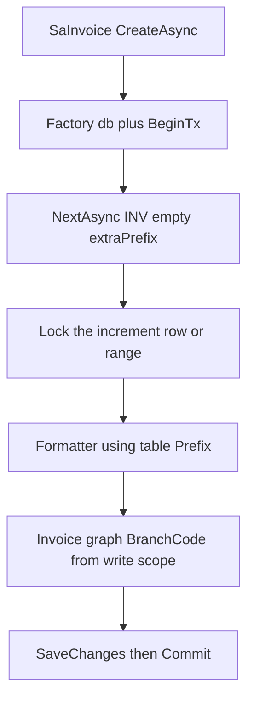

# Update document numbering spec (ErpWeb only)

**What this file is:** the plan for rewriting [`plans/document_numbering_spec.md`](c:\wincom\net10projects\plans\document_numbering_spec.md). Frontmatter todos stay `pending` until that spec file contains every rule below. This is not a C# implementation plan.

**Hard constraint:** this pass edits the specification only. Do not implement numbering code. Do not touch V5.5. After the spec is updated, a later agent may implement from that spec. V5.5 paths remain historical notes, not work items.

**P0 vs P1:** both must be written into the spec. P0 is routing, Seq meaning, TX, reuse, Location vs Branch, seed, migration, branch security. P1 is overflow, error mapping, and tests. Neither label means the Cursor todos are complete.

## Invoice allocation (confirmed)

- Call site: `NextAsync(db, module: "INV", extraPrefix: "", documentDate: invDate, New, "AUTO", ct)`.
- NumCd is always `INV` for invoices. Do not concatenate `SaCust.InvoicePrefix`.
- Format Prefix (`{0}`) comes from `AdSmNum` / `AdSmNumDate.Prefix`.
- After issue, persist that table Prefix on `SaInvoice.InvPrefix`. Customer `InvoicePrefix` is master data only; it does not affect allocation or format.
- `extraPrefix` stays on the API for later series (`INV`+`A` → `INVA`). Invoice v1 passes empty string.

## P0 — AdSmNum / AdSmNumDate selection (do not leave this to the implementer)

Tenant key for every lookup: `CompanyCode` + `BranchCode` from **authenticated write/read scope**, plus `NumCd`. `LocationCode` is never part of the lookup key.

**Which table (routing, once per call):**

1. If **any** `AdSmNumDate` row exists for `(CompanyCode, BranchCode, NumCd)` → use **AdSmNumDate only**. Never read `AdSmNum` for that tenant+NumCd.
2. Else if an `AdSmNum` row exists for `(CompanyCode, BranchCode, NumCd)` → **continuous** `AdSmNum`.
3. Else → `DocumentNumberingNotConfiguredException`. Do not insert a default config row.

Never seed both `AdSmNumDate` `(INV, Year=0, Month=0)` and `AdSmNum` `INV` for the same company+branch. A leftover `AdSmNumDate` `Year=0, Month=0` row **wins** and disables monthly reset.

**Seq meaning (both tables):** `Seq` is the **next** sequence number to issue, not the last issued. A newly created period row therefore starts at `Seq=1`. After issuing number 1, persist `Seq=2`. Increment of an existing row is `Seq++` after the current `Seq` is issued. Seed `Seq=1` and missing-period INSERT `Seq=2` (issue 1) are the same rule.

**AdSmNumDate row selection (after routing chose date table).** Document date supplies Year/Month (not server today). Persist Year/Month sentinels as `0`, never NULL.

1. If a row exists with `Year=0 AND Month=0` → lock **that** row; continuous date formula.
2. Else if **any** row has `Month=0`:
   - If exact `Year=docYear, Month=0` exists → lock **that** row; yearly formula; increment.
   - Else current year missing → lock latest `Month=0` template (`Year DESC, Month DESC, uid DESC`) as read of template fields only; **range-lock** the missing key; INSERT `Year=docYear, Month=0, Seq=2` (issue 1); copy template including `NumberingFormat`.
3. Else if exact `Year=docYear, Month=docMonth` exists → lock **that** row; monthly formula; increment.
4. Else current period missing → lock latest template for tenant+NumCd (`Year DESC, Month DESC, uid DESC`); range-lock missing key; INSERT current `Year`/`Month`, `Seq=2` (issue 1); copy template. Formula: monthly if template `Year>0` and `Month>0`, else continuous date formula.
5. **No step 5.** Missing config is already a routing failure. Do not auto-create `TotLength=4`.

**Lock SQL (must match the row being incremented, not a generic exact period):**

- Continuous `AdSmNum`: `UPDLOCK, ROWLOCK, HOLDLOCK` on `(CompanyCode, BranchCode, NumCd)`.
- Date exact row: same hints on `(CompanyCode, BranchCode, NumCd, Year, Month)`.
- Missing period INSERT: `HOLDLOCK` range on that business key; unique index is required. On SQL 2627/2601: bounded 3 retries, **re-SELECT with lock**, treat as found, increment, **re-format** (do not return the pre-insert number). Then `DocumentNumberingConcurrencyException`.

Persist Seq only via `ExecuteSql` / `ExecuteSqlInterpolated` on the **caller** `db`. Copy `LocationCode` (current write scope), `Updated`, `UpdatedUID` on increment/insert.

## P0 — Transaction ownership

- `NextAsync` **must not** `CreateDbContext`, **must not** `BeginTransaction` / `Commit` / `Rollback`, **must not** `SaveChangesAsync`.
- Caller (`SaInvoiceService.CreateAsync`) owns the factory `AppDbContext` and the open transaction.
- Sequence UPDATE/INSERT and invoice INSERT participate in **that same transaction**. Independent commit of Seq is a spec violation.
- Overflow and config validation run **before** persist. On those failures Seq is **unchanged** (no UPDATE/INSERT).



## P0 — Number reuse (two different events)

- **Database transaction rollback before commit** (failed `SaveChanges`, deadlock, explicit `RollbackAsync` on the create TX): Seq UPDATE/INSERT rolls back. That number is **not** consumed and **may** be issued on the next successful create.
- **After successful commit:** the issued InvNo is **never reused**. Invoice **business** Rollback / unpost / cancel **must not** decrement `AdSmNum` / `AdSmNumDate.Seq`. Those operations are document status changes only.

## P0 — LocationCode vs BranchCode (they are not equal)

Do not set `LocationCode = BranchCode`. They are separate claims on [`InventoryTenantContext`](c:\wincom\net10projects\ErpWeb.Core\Inventory\InventoryTenantContext.cs):

- **BranchCode** (max 5 on claims, nvarchar(10) on tables): isolation grain for numbering and invoice PK. Example: `HQ`.
- **LocationCode** (max 10 on claims): write-scope stamp only. Not in numbering unique key. Locations under the same branch share one sequence. Example in this repo: warehouse/location `MAIN`.
- On increment/insert, store the current write-scope `LocationCode` (truncate/reject per existing write-scope rules). Numbering column may be nvarchar(20); persist at most 10 from scope.
- Invoice header already writes both from write context; keep that.

## P0 — DEMO seed (exact values)

Invoice v1 uses **monthly `AdSmNumDate`**, not continuous `AdSmNum`. Do **not** seed Seq=0 and do **not** expect `INV26090001` (that is the old `FormatInvNo` shape).

Hand-written [`scripts/init-adsmnum.sql`](c:\wincom\net10projects\scripts) (new file named in the spec):

- `CompanyCode = DEMO`
- `BranchCode = HQ`
- `LocationCode = MAIN`
- `NumCd = INV`
- `Year = 2026`, `Month = 9`
- `Prefix = INV`
- `TotLength = 4` (Seq digit width only)
- `NumberingDelimeter = -`
- `NumberingFormat` NULL/blank (mode formula)
- `Seq = 1` (next to issue; first save consumes 1 and persists 2)

**First generated number** for InvDate in Sep 2026: `INV2609-0001`. October: `INV2610-0001`.

**Idempotency:** `IF NOT EXISTS` on `(DEMO, HQ, INV, 2026, 9)`. If the row exists, do **not** update Seq (never reset a live counter). Script is safe to re-run.

Do not also insert `AdSmNum` `INV` for DEMO/HQ.

## P0 — Legacy table / PK migration (no silent guess)

**`AdSmNum` / `AdSmNumDate`:** this repo has no entities today. Script behavior:

- Table missing → `CREATE TABLE` with tenant columns and the spec PK/index from day one.
- Table exists, already has `CompanyCode`/`BranchCode` and matching PK/index → no structural change; seed only.
- Table exists **without** tenant columns:
  - **Zero rows:** add `CompanyCode`/`BranchCode`/`LocationCode`, drop old PK `NumCd`, add PK `(CompanyCode, BranchCode, NumCd)` (and date unique index). Empty table only.
  - **Any rows:** **FAIL** the script. Do not backfill `DEMO`/`HQ`. Operator must migrate or empty the table. Document this fail message in the spec.

**`SaInvoice` Option A** (already in the current spec; keep the ordered steps): inspect null/blank `BranchCode` and duplicate `(CompanyCode, BranchCode, InvNo)` → backfill from existing header BranchCode only → copy BranchCode onto every detail → fail if any null remains → drop dependent FK/indexes → drop old PK → `BranchCode NOT NULL` → new PK `(CompanyCode, BranchCode, InvNo)` → recreate FK/unique. No `dotnet ef` blind drop. Hand-written SQL.

**Filtered unique index (exact expression, also EF `HasFilter`):**

```sql
CREATE UNIQUE INDEX UX_AdSmNumDate_Tenant_NumCd_Year_Month
ON dbo.AdSmNumDate (CompanyCode, BranchCode, NumCd, Year, Month)
WHERE NumCd IS NOT NULL AND Year IS NOT NULL AND Month IS NOT NULL;
```

## P0 — Branch scope security

`BranchCode` from UI, route (`/sales/invoices/{mode}/{InvNo}`), or request body **must never** override the authenticated user's branch. [`ValidateUserContext`](c:\wincom\net10projects\ErpWeb.Core\Sales\SaInvoiceService.cs) / `ValidateWriteContext` (`TryBranchScope` / `TryWriteScope`) are authoritative. Repository methods receive branch from that scope only.

After Option A, [`SaInvoiceRepository`](c:\wincom\net10projects\ErpWeb.Model\Repositories\Sales\SaInvoiceRepository.cs) `LockForUpdateAsync` / `GetWithDetailsAsync` / `SearchPagedAsync` all take `BranchCode`. Get / Update / Post / Rollback / shipment / list line-count grouping include `BranchCode`. List is **current branch only**.

## P1 — Overflow and validation

- `Seq < 1` is invalid (not only `< 0`).
- Max Seq for pad width: `AdSmNum` digits = `TotLength - Prefix.Length`; `AdSmNumDate` / `{1}` digits = `TotLength`. Example: width 4 → Seq `1`..`9999` OK; `10000` overflow.
- Formatted string length `> 30` (`SaInvoice.InvNo`) → same overflow failure.
- On overflow/config fail: **do not** UPDATE/INSERT Seq.

## P1 — Error mapping (invoice Create)

Catch in `SaInvoiceService`; never leak SQL text or unhandled domain exceptions to Blazor.

- Missing numbering config → `BusinessRule` — "Invoice numbering is not configured for this company/branch."
- Invalid Seq / TotLength / format / NumCd → `BusinessRule` — "Invoice numbering is not configured correctly. Contact an administrator."
- Overflow or InvNo longer than 30 → `BusinessRule` — "The next invoice number exceeds the configured length."
- Duplicate InvNo (PK 2627/2601) → keep existing `"Invoice number is already used."` / `Unexpected`
- Deadlock 1205 → keep existing conflict message / `Unexpected`

## P1 — Tests

- **SQLite** [`SaInvoiceServiceTests`](c:\wincom\net10projects\ErpWeb.Tests\SaInvoiceServiceTests.cs): mock `IDocumentNumberingService`. Do not emulate UPDLOCK. Update asserts off `INV26090001` / `MsRunningNo SA_INV_202609`.
- **SQL Server** tests own numbering persistence and concurrency. Skip if no connection string (same pattern as [`SaInvoiceSqlServerConcurrencyTests`](c:\wincom\net10projects\ErpWeb.Tests\SaInvoiceSqlServerConcurrencyTests.cs)).

Acceptance (SQL Server):

- 10 concurrent creates, same branch → 10 unique InvNos
- Same branch + same period → sequential, no duplicates
- Different branches → independent sequences
- Missing period row → exactly one period row after success
- Concurrent period INSERT → loser re-reads Seq and continues
- TX rollback before commit → Seq restored (number reusable)
- Business Rollback after commit → Seq **not** decremented
- Customer `InvoicePrefix` set → generated InvNo still uses table Prefix (`INV2609-0001` for DEMO seed)

## Unchanged boundaries

Keep `IRunningNumberService` / `MsRunningNo` for `IV_BATCH`. Invoice leaves `SA_INV_{yyyyMM}` / `FormatInvNo`.
