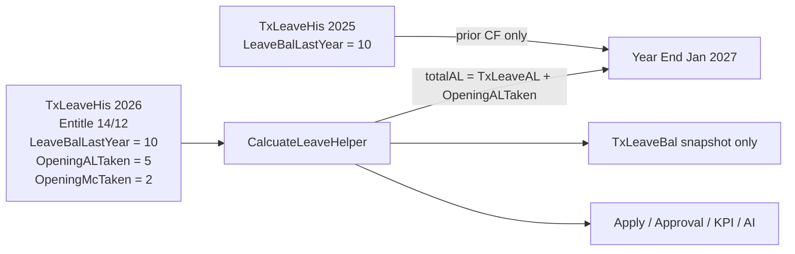

# Opening AL/MC Taken Go-Live Plan (revised)

## Mandatory implementation rules

These are binding. An agent must not invent a second Opening formula or a new locking/audit stack.

1. **OpeningALTaken / OpeningMcTaken** = go-live historical usage this cycle, not fake `TxLeave` rows.
2. Opening quantities are deducted **exactly once** in every balance that consumes AL/MC.
3. **One authoritative calculator:** [CalcuateLeaveHelper](WincomHRMCore/Core/CalcuateLeaveHelper.cs) (plus pure helpers it calls). Leave Application, apply, approval, LeaveRepository, KPI, AI `get_my_leave_balance`, snapshot, and year-end **must not** recreate the Opening deduction formula.
4. Final apply/approval **validation and TxLeave create/update** run in the **same** existing DB transaction, with `UPDLOCK, HOLDLOCK` on `TxLeaveHis` keyed by **CompanyCode + BranchCode + EmpUID + Year** (same pattern as [ValidateMcBalanceUnderLock](WincomHRM_Classes/Repository/Transaction/Leave/LeaveRepository.cs)). Extend that pattern to AL. Do not invent a new lock strategy.
5. Opening* is **never copied** to the next leave year. `LeaveBalLastYear` **may** be copied (clone / CF).
6. Historical `TxLeave` import must **not** blindly set Opening* = 0. Reduce Opening by **imported `LeaveDay` sum** of that type; leftover Opening stays.
7. OpeningALTaken and OpeningMcTaken **cannot be negative**. Do **not** add `Opening <= Entitle`.
8. Column precision/scale must match existing **taken** fields (`TotalAL` / `TotalMC` = `DECIMAL(10,2)`).
9. Preserve `IX_TxLeaveHis_EmpYear` and [AddLeaveHis](WincomHRM_Classes/Repository/Transaction/Leave/LeaveRepository.cs) duplicate employee+year rejection.
10. HR edits of Opening*, LeaveBalLastYear, Entitle use existing `[Auditable]` on `TxLeaveHis`. Do not build a new audit subsystem.

## Final mandatory clarifications

### 1. available vs usable (pending) — AL and MC use the same split

Existing code treats AL and MC differently today (`availableAL` already subtracts pending; `availableMC` does not). **This change aligns AL to the existing MC contract** so an agent cannot guess.

| Property | Formula (no floor unless stated) | Pending | Who uses it |
|---|---|---|---|
| `rawAvailableAL` | `currentAL + ManualAdjustAL − TxLeaveAL − OpeningALTaken` | **not** subtracted | Year-end, CF input, audit/over-use |
| `rawAvailableMC` | `entitledMC + ManualAdjustML − TxLeaveMC − OpeningMcTaken` | **not** subtracted | same |
| `availableAL` / `availableMC` | `max(0, rawAvailable*)` | **not** subtracted | **Approval** (`forApproval: true`) — current leave still NEW |
| `usableAL` / `usableMC` | `max(0, rawAvailable* − pending*)` | subtracted | **Apply / edit** |

Why: [ValidateMcBalanceUnderLock](WincomHRM_Classes/Repository/Transaction/Leave/LeaveRepository.cs) already uses Available on approval and Usable on apply. AL must match. Leave Application **apply** uses `usableAL` (replaces today’s `availableAL` that mixed pending into one field). Display “Available” on the apply screen = **usable** (what they can still request). Show pending as its own line.

Do not let the agent keep a third AL-only formula.

**Do not rename `availableAL`.** Add XML comments on [LeaveBalanceInfo](WincomHRM_Model/Model/Leave/LeaveBalanceInfo.cs) and helpers:

- `availableAL` / `availableMC`: floored balance for **approval**. Pending is **not** deducted.
- `usableAL` / `usableMC`: what the employee can **apply/edit**. Pending **is** deducted.

**TxLeave status:** preserve existing filters. Today year-end and `CalcuateLeaveHelper` count **APPROVED** as taken (`TxLeaveAL`/`totalAL`) and **NEW** as pending. Do not invent Deleted/Cancelled rules. Do not change NEW / APPROVED / REJECTED / CANCELLED semantics. This change only adds Opening* to the same taken/pending buckets.

**Pending cycle:** `pendingAL` / `pendingMC` use the **same** cycle window (`cycleStart`–`cycleEnd` from `LeaveCycleHelper`) and **CompanyCode + BranchCode + EmpUID** as Opening* and approved taken. Not “calendar year of DateTime.Today” on its own (unsafe for anniversary cycles).

### 2. Raw vs floored — do not destroy negatives internally

Helpers must expose **raw** (can be negative) and **floored** (UI/apply cap).

Example: entitle/earned 5, Opening 8 → `rawAvailableAL = −3`, displayed/usable floored to **0**. Year-end unused uses **raw consumed** (`TxLeaveAL + OpeningALTaken`), not floored available. Do not change existing “cannot apply below 0” UX unless confirmed.

### 3. `currentAL` is unchanged earning

`currentAL` remains [EarnedLeaveCalculator](WincomHRMCore/Core/EarnedLeaveCalculator.cs) against the existing calendar/anniversary cycle (`LeaveCycleHelper`). Opening* is **only extra historical consumption**. Do **not** change accrual, cycle dates, or entitle resolution (`TxLeaveHis.EntitleAL` / `ENT_AL` / tiers).

Example: EntitleAL 14, earned ~9, OpeningALTaken 5, TxLeaveAL 0, pending 0 → `rawAvailableAL = 4`, `usableAL = 4`.

### 4. TxLeaveHis vs TxLeaveBal

**`TxLeaveHis` is the only source of Opening* for the active cycle.** [TxLeaveBal](WincomHRM_Model/Model/Leave/TxLeaveBal.cs) is a **persisted monthly snapshot/cache** for payslip ([LeaveBalanceSnapshotService](WincomHRMCore/Core/LeaveBalanceSnapshotService.cs)). Leave Application, approval, KPI, and AI **must not** read Opening* from `TxLeaveBal`. Snapshot copies Opening* from `LeaveBalanceInfo` after the calculator ran on `TxLeaveHis`.

### 5–6. Year-end Opening restore (no duplicate rows)

Preserve the existing Year-End rebuild: BulkDelete all `TxLeaveHis` for `(Year, CompanyCode, BranchCode)` then BulkInsert one row per eligible employee ([AddLeaveHis(List)](WincomHRM_Classes/Repository/Transaction/Leave/LeaveRepository.cs)). Do not switch to update-in-place.

Algorithm:

1. Before delete, load existing target-year rows.
2. Index Opening* by **CompanyCode + BranchCode + EmpUID + Year**.
3. Run existing year-end create (new identities).
4. On each **final closed-year** row (employees who already passed existing Year-End eligibility), restore Opening* from that key. If no prior row, Opening* = 0.
5. Do **not** create a His row only because an Opening value existed. Preserve existing eligibility (active, ENT_AL, job type, DateJoined).
6. Do not insert a second row per employee/year. Unique index must still hold.
7. Any **next** cycle year created later: Opening* = 0.

**Pending vs Year-End:** existing close loads **APPROVED** leaves only ([LeaveYearEndCloseHelper](WincomHRMCore/Core/LeaveYearEndCloseHelper.cs)). `consumedAL` / CF `totalAL` = **approved** TxLeave AL + OpeningALTaken. **Do not** subtract pending unless existing Year-End already does (it does not).

### 7–8. Import quantity = `LeaveDay` sum, same unit as `TxLeave`

`importedHistoricalDaysOfThatType` = **sum of `TxLeave.LeaveDay`** for that leave type (`AL` or `MC`), same decimal precision as `LeaveDay` / `TotalAL`. Not record count. Not hours unless already stored as day fractions on `LeaveDay`.

Example: 0.5 + 1.0 imported = **1.5** days, not 2.

```
Opening' = max(0, Opening − sum(imported LeaveDay of that type))
```

Opening = 5, import 3.0 AL → Opening = 2, TxLeaveAL = 3.

**Idempotency:** before any Opening reduction, inspect the existing `TxLeave` import/duplicate mechanism (`TxLeave.UID` and any current unique/import key). **Reuse that identity.** Do not add an import-tracking table. If import is already idempotent, reduce Opening using **only newly accepted rows** (`sum(LeaveDay)` of inserts that actually saved), not re-imported duplicates.

### 9–10. Lock key and transaction boundary

Lock/query `TxLeaveHis` with **CompanyCode + BranchCode + EmpUID + Year** (matches `IX_TxLeaveHis_EmpYear`). Never EmpUID+Year alone.

Sequence (apply and approval):

```
BEGIN TRANSACTION
  LOCK TxLeaveHis (UPDLOCK, HOLDLOCK) by CompanyCode+BranchCode+EmpUID+Year
  RELOAD TxLeave + Opening*
  CALCULATE via CalcuateLeaveHelper / AL-MC helpers
  VALIDATE (apply → usable*; approval → available*)
  CREATE/UPDATE TxLeave (and approval status)   -- same transaction
COMMIT
```

Validate-then-commit-then-insert is **forbidden**.

### 11. HR edits Opening after TxLeave exists

Allowed. Recompute via calculator; **do not** block save because Opening &gt; entitle. If raw goes negative, keep the save (audit via existing Auditable) and show floored 0 / over-use on Leave Application. No silent entitle cap.

KPI / AI: same `LeaveCycleHelper` → `cycleEnd.Year` lookup as Leave Application.

## Terminology (do not rename)

| Code | Meaning |
|---|---|
| Leave type `AL` | Annual leave (`LeaveType.AL`) |
| Leave type `MC` | Medical leave (`LeaveType.MC`). Not `ML` as a type ID |
| `EntitleML`, `ManualAdjustML` | Medical columns on `TxLeaveHis` (existing ML suffix) |
| **`OpeningMcTaken`** | Medical opening taken; pairs with type `MC` / `ManualAdjustML` |

Do not silently treat `ML` as a leave type except where KPI already defensively checks both.

## The problem

Apply looks up `TxLeaveHis` for **cycle end year** (calendar **2026**). Year-End only closes **2025**; Add blocks current year. CF and “already taken this year” never reach apply.

`ManualAdjustML` stays HR extra/deduct. Do **not** add `LeaveMLBalLastYear`.

## Target data (example)



- **2025:** `LeaveBalLastYear = 10`. Opening* = 0.
- **2026:** EntitleAL 14, EntitleML 12, `LeaveBalLastYear = 10`, OpeningALTaken **5**, OpeningMcTaken **2**.

Apply 28 Aug (earned AL ~9): `rawAvailableAL = 4`, `usableAL = 4`; MC raw/available **10**.

## Authoritative formulas (Core only)

```
rawAvailableAL = currentAL + ManualAdjustAL − TxLeaveAL − OpeningALTaken
rawAvailableMC = entitledMC + ManualAdjustML − TxLeaveMC − OpeningMcTaken
availableAL/MC = max(0, rawAvailable*)          // approval
usableAL/MC    = max(0, rawAvailable* − pending*) // apply/edit
```

Year-end:

```
consumedAL = TxLeaveAL + OpeningALTaken   // LeaveDay units
unusedAL   = earnedAL + ManualAdjustAL − consumedAL   // raw; CF helper does not subtract Opening again
```

**CarryForwardCalculator contract (inspect before change):** today `totalAL` is documented as *total approved AL days taken in the cycle* ([CarryForwardCalculator.cs](WincomHRMCore/Core/CarryForwardCalculator.cs) ~line 74). Callers: Year-End close and [LeaveYearEndPrecheckService](WincomHRMCore/Core/LeaveYearEndPrecheckService.cs). **Do not rename or reinterpret the parameter from this plan alone.** Trace all callers. Implementation: keep the parameter meaning “consumed approved AL for CF”; Year-End/precheck pass `approvedCycleTxLeaveAL + OpeningALTaken`. The calculator itself does **not** subtract Opening. Opening is included **exactly once** (in the caller’s `totalAL` argument). Pending is not in `totalAL`. New cycle Opening* = 0.

## 1. Schema and models

- Migration: `OpeningALTaken`, `OpeningMcTaken` **DECIMAL(10,2) NULL** on `TxLeaveHis` and `TxLeaveBal`.
- [TxLeaveHis.txt](SQLTable/Table/TxLeaveHis.txt), [TxLeaveBal.sql](SQLTable/Table/TxLeaveBal.sql), models including `rawAvailableAL/MC`, `usableAL` on [LeaveBalanceInfo](WincomHRM_Model/Model/Leave/LeaveBalanceInfo.cs) if not present.
- Opening* **NULL and 0 are identical** for all balance math (NULL → 0). No business meaning for “not keyed” vs “keyed zero”; audit shows whether HR saved a value. Reject **&lt; 0**. Keep unique index.

Keep `availableAL` on the info object: **after this change it means floored, no pending** (approval). Apply UI binds **usableAL**. Update Leave Application which currently binds `availableAL` for apply.

## 2. Core math

Extend [McBalanceCalculator](WincomHRMCore/Core/McBalanceCalculator.cs) with `openingMcTaken`; add AL helper with raw / available / usable. [CalcuateLeaveHelper](WincomHRMCore/Core/CalcuateLeaveHelper.cs) is the only composer.

Replace inline approval AL in [TransactionHelper](WincomHRM_Classes/HelperClass/Transaction/TransactionHelper.cs) (~1824) with `availableAL`. Apply uses `usableAL` / `usableMC`.

Year-end restore Opening* by composite key after existing BulkDelete/BulkInsert.

Snapshot **copies** Opening* from `LeaveBalanceInfo` after the calculator ran on `TxLeaveHis`. It must **not** recalculate Opening or a second balance. Path: His → Calculator → LeaveBalanceInfo → TxLeaveBal. Not His → snapshot formula #2.

## 3. Concurrency

Same transaction as mutation. Lock **CompanyCode + BranchCode + EmpUID + Year**. Apply → usable*; approval → available*. Two 3-day approvals vs 4 usable/available: one fails.

## 4. Partial import

Helper: `Opening' = max(0, Opening − sum(LeaveDay))`. Tests use 0.5+1.0 = 1.5. No auto-zero on first `TxLeave` insert.

## 5. HR keying

Allow Add `Year >= Today.Year`. Clone copies `LeaveBalLastYear` only, not Opening*. Saving Opening after TxLeave exists is allowed; UI shows calculator result (including floored 0 if raw negative).

## 6. Leave Application UI

From calculator only:

- Entitlement / Current (earned `currentAL`)
- Opening Taken
- Leave Taken (`TxLeave`)
- Pending
- Manual Adjust
- **Available to apply** = `usableAL` / `usableMC`

## 7. KPI / AI

Same `DetermineCycle` → `cycleEnd.Year` as Leave Application. Consume helper; no local entitle − taken − opening.

## 8. Out of scope

Salary, attendance KPI generate, report views, new audit product.

## 9. Tests

Existing set plus:

- HR edit Opening 5→3 with TxLeave 2 (consumed 5); Opening 3→5 with TxLeave 5 (consumed 10); available/usable follow raw + floor rules.
- Snapshot Opening* equals `TxLeaveHis` after snapshot; apply/KPI still read His not Bal.
- Year-end restore by Company+Branch+EmpUID+Year; no duplicate His rows.
- Import quantity 0.5+1.0; not 2 records.
- Lock/query uses full tenant key.
- `rawAvailableAL = −3` when Opening exceeds earned; usable = 0; unused/CF still sees consumed 8.

**Four additional tests (required):**

1. **Pending cycle:** anniversary cycle crosses calendar year; pending near year boundary; pending counted in `cycleStart`–`cycleEnd`, not calendar-year-only.
2. **Status:** NEW / APPROVED / REJECTED / CANCELLED (and existing deleted handling if any) — taken vs pending filters **unchanged**; only Opening* added to the taken side.
3. **NULL vs 0:** `OpeningALTaken` null and 0 produce identical raw/available/usable.
4. **CF once:** TxLeave AL = 2, OpeningALTaken = 3 → Year-End/precheck `totalAL` argument = **5**; unused uses 5 once, not 2 and not 8.

## Final agent guardrails

Implement **only** this scope. Do not refactor unrelated accrual, cycle, or Year-End eligibility.

1. Before changing `CarryForwardCalculator`, inspect existing `totalAL` semantics and **all** callers. Preserve the contract; Opening included exactly once via the caller argument (do not rename `totalAL`).
2. Preserve all existing `TxLeave` status filters. Do not change NEW / APPROVED / REJECTED / CANCELLED (or equivalent).
3. `pendingAL` / `pendingMC` use the same cycle window and CompanyCode + BranchCode + EmpUID as the main balance.
4. Reuse existing `TxLeave` import identity/idempotency. Do not add a new import-tracking subsystem. Opening reduction = newly accepted `LeaveDay` sum only.
5. NULL Opening* and zero Opening* have identical calculation semantics (NULL → 0).
6. `TxLeaveBal` snapshot only copies calculator output. It never recalculates Opening and is never a source of truth.
7. Year-End preserves existing employee eligibility and pending treatment (approved only in consumed AL). Do not create a row solely for Opening.
8. Do not rename `availableAL` or other leave-domain fields unless required. Add XML comments: available = approval, no pending; usable = apply, pending deducted.

## Impact

| Area | Change |
|---|---|
| CalcuateLeaveHelper + helpers | Yes — raw/available/usable + Opening |
| Apply / approval / LeaveRepository | Yes — same txn, full lock key, AL lock |
| Leave Balance + clone | Yes |
| Year End | Yes — restore Opening* onto closed row |
| KPI / AI | Yes — same year lookup + helper |
| TxLeaveBal | Snapshot copy only |
| Salary / attendance generate / reports | No |
