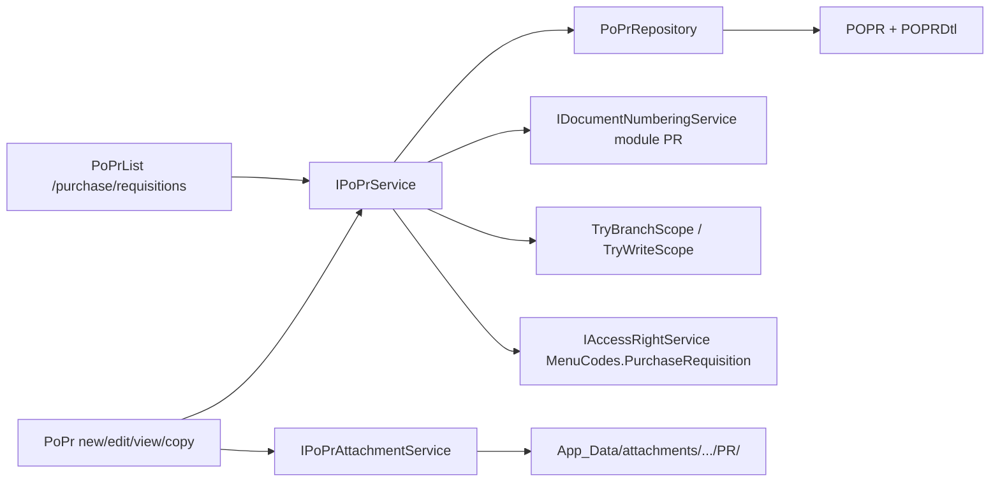
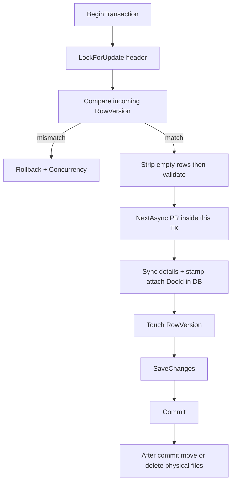
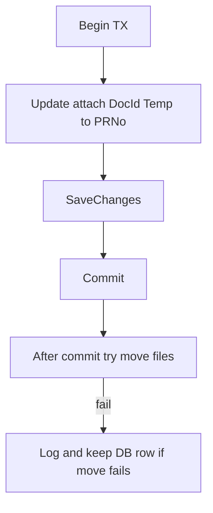

# Purchase Requisition — Revised Implementable Plan

The original [plans/popr_plan.md](plans/popr_plan.md) **can be implemented in this project**, but not as written. After approval, replace `plans/popr_plan.md` with this revision.

**Verdict:** clone **Sales Order** (header + lines + string doc no + RowVersion + `IDocumentNumberingService`) and **supplier attachments**. Do not invent a Purchasing DDD stack. Do not recreate entities. Do not port the WebForms `OPEN` edit-lock. Do not add schema columns.

Review locks below are **implementation rules**, not open questions.

## Expert ERP review — locked decisions

- **PR is a demand document, not a commitment.** Save writes `POPR` / `POPRDtl` / attachments only. No stock reservation, no GL, no `IvBalance`, no CJ.
- **Do not port `OPEN` as an edit lock.** This app never writes `OPEN`. No session/circuit lock. Drop list **REFRESH**.
- **Legacy `OPEN` compatibility:** leftover rows may be **read**. They may be **edited** under the same RowVersion rules as `NEW`. They may be **cancelled or deleted** only when no header/detail `PONo` exists. Successful update persists `PRStat = NEW`.
- **Cancel is a status transition only** (`PRStat = CANCELLED`, `ApprReason` required). Do not delete lines or attachments, and do not alter qty/vendor/references.
- **Cancel and delete are blocked** when header `PONo` is set **or** any detail `PONo` is set.
- **Approval is out of scope**, but still capture `CheckedBy` / `AuthorisedBy` / `AuthorisedBy2nd` from `PoAuthorised`.
- **This plan never writes header or line `PONo`.** Save must still protect already-consumed lines.
- **One PR = one currency (phase 1).** [`PoPr`](ErpWeb.Model/Entities/Purchase/PoPr.cs) has **no header `Currency` column** — do not add one. Currency lives on [`PoPrDetail.Currency`](ErpWeb.Model/Entities/Purchase/PoPrDetail.cs).
- **Saved prices are retained.** Only a **new line** or an **ICode change** re-resolves master/vendor price. Changing Vendor, UOM, Qty, tax, warehouse, or ETA does **not** reprice.
- **Direct + indirect may mix.** Classification is server-authoritative. Duplicate item codes on multiple lines are **allowed**.
- **Database is authoritative for attachments.** Filesystem work is eventually consistent and must **never** run inside the SQL transaction or fail a committed PR save.
- **Do not add schema columns.** Do not build `AdPara` / `AdUser` / `HrDept` / `IAuditLogService` / `TrxPostingHelper`.

## Tenant fields — do not conflate

Obtain security/tenant values from claims / `IInventoryTenantContext` only. Never from the route, query string, or request body.

- **`CompanyCode`** — tenant/company scope (PK part)
- **`BranchCode`** — document/security branch (PK part); list and get are current branch only
- **`LocationCode`** — optional header site stamp from write scope
- **`ToWarehouse`** — line-level requested receiving warehouse (user lookup, not the location claim)

## What already exists — do not re-create

- Entities + EF + DbSets: [`PoPr.cs`](ErpWeb.Model/Entities/Purchase/PoPr.cs), [`PoPrDetail.cs`](ErpWeb.Model/Entities/Purchase/PoPrDetail.cs), [`PoPrAttachFile.cs`](ErpWeb.Model/Entities/Purchase/PoPrAttachFile.cs). `DocId` nvarchar(50) fits `PRTMP-{GUID}` (42 chars).
- DDL: [`scripts/create-po-pr.sql`](scripts/create-po-pr.sql). PK `(CompanyCode, BranchCode, PRNo)`. **`Line` is durable identity**. Details cascade. Attachments have **no FK**.
- Numbering: [`IDocumentNumberingService.NextAsync`](ErpWeb.Core/Numbering/IDocumentNumberingService.cs) — **must be called on the caller’s `db` inside the already-open save transaction**. Do not allocate a number and then open a new transaction.
- Supplier attach ([`PoSupplierAttachmentService`](ErpWeb.Core/Purchase/PoSupplierAttachmentService.cs)) is not a draft mechanism. Reuse its file guards and `TryDeletePhysicalFileAsync` logging only.
- Menu stub [`PO_TRANSACTIONS`](ErpWeb/Menus/menus.xml) is a leaf today. Make it a parent (no route).

## Clone these files — do not invent a new stack

Sales Order for service/repo/paging/concurrency (not a blind UI copy): [`ISaSoService.cs`](ErpWeb.Core/Sales/ISaSoService.cs), [`SaSoService.cs`](ErpWeb.Core/Sales/SaSoService.cs), [`SaSoRepository.cs`](ErpWeb.Model/Repositories/Sales/SaSoRepository.cs), [`SaSoList.razor`](ErpWeb.UI/Sales/Transactions/SaSoList.razor), [`SaSoServiceTests.cs`](ErpWeb.Tests/SaSoServiceTests.cs).

Rounding: [`SaInvoiceCalc.Money`](ErpWeb.Core/Sales/SaInvoiceCalc.cs) only. UI: DevExpress `DxGrid` + `sdoc-*`. **Do not copy the SO header layout.**

## Status, rights, error contract

Statuses written: `NEW` on save; `CANCELLED` on cancel. `OPEN` is never written. `APPROVED` is view-only this phase.

Service is the security boundary:

- View → `ACCESS`; New/Copy → `ADD`; Edit → `EDIT`; Delete → `DELETE`; Cancel → `CANCEL`
- Cost columns: UI hide without `VIEW_COST`; service never trusts client price fields

**Error kinds (deterministic UI):**

- Header not found in current Company + Branch → `NotFound`
- Header found, `RowVersion` mismatch → `Concurrency`
- Header found, status/business rule rejects the operation → `BusinessRule` (validation)
- Never a 500 for stale edit/cancel/delete

Guards: edit `NEW` or leftover `OPEN`; cancel/delete same plus no header/detail `PONo`; view any status; copy any PR (`ADD`).

Routes: `/purchase/requisitions` and `/purchase/requisitions/{Mode:regex(^(new|edit|view|copy)$)}/{PrNo?}`.

## Detail synchronization and incoming-line contract

Do **not** replace-all details.

- Consumed (`PONo` set): immutable, cannot delete, `Line` never reused
- Unconsumed: update in place or delete
- New: `max(Line) + 1`
- Compact `1..N` only when no consumed line exists
- Duplicate `ICode` allowed

**Empty-row contract:** strip null, blank, and purely empty draft rows **before** business validation. Any remaining line must pass all required rules (item, qty ≠ 0, UOM, currency, etc.). Zero-qty or half-filled rows that are not empty → validation error, not silent drop.

## Save sequence (RowVersion first; numbering in same TX; files after commit)

For **new** there is no header lock; still `BeginTransaction` → validate → **`NextAsync` on the same `db`** → insert header/details/attach metadata → `SaveChanges` → `Commit` → then filesystem.

**Forbidden:** `number = NextAsync()` then a later `BeginTransaction` / `INSERT POPR`.

SQL Server dual-new test: two concurrent `SaveNewAsync` → `PRNo1 != PRNo2`, both committed, each number is exactly one header.

Update/cancel/delete: lock → compare `RowVersion` → **then** mutate. Stale → concurrency or not-found, never 500.

## Copy — reset workflow and audit

**Reset:** new `PRNo`, `NEW`, `CreateDt`/created audit = now + current user, requester = current user, new `RowVersion`, tenant from current scope.

**Clear:** header `PONo`, `ApprReason`, `ApprovedBy`/`ApprovedDate`/`ApprovedBy2`/`ApprovedDate2`, `CheckedBy`, `AuthorisedBy`, `AuthorisedBy2nd`; line `PONo`, `SONo`, `SOLine`, line `Status`.

**Preserve:** dept, project, type, remarks, line business data including **source `UnitPrice`**.

**Do not copy** attachments.

Tests: copy from `CANCELLED` and from `APPROVED` — new number, `NEW`, current requester/scope, PO/SO/approval cleared, no files copied, source prices retained.

Tests: leftover `OPEN` edit → save → `NEW`; leftover `OPEN` + any `PONo` → cancel/delete rejected.

## Pricing, VIEW_COST, currency

**`VIEW_COST` is visibility only.** Ignore client `UnitPrice` / `Amount` / `TaxAmount`.

Price-injection test: client sends `999999` for all three. New line → server lookup price. Existing same-`ICode` line → database `UnitPrice`.

**Reprice only when:** new line, or unconsumed line `ICode` changes. **Do not reprice** when Vendor, UOM, Qty, Tax Group, Inclusive, Warehouse, or ETA changes — recompute Amount/Tax/StdQty from the **retained** `UnitPrice`. Consumed lines immutable.

**Currency (no header column):**

- Document currency = `Currency` of the remaining line with the **lowest `Line`**
- No lines → currency display blank; save still requires ≥ 1 valid line
- First line establishes currency; later lines must match
- Changing currency is allowed only when **all** lines in the same request use the new value; otherwise reject

## Classification, vendor-item, MOQ, tax

Server class: `IvStockMaster` → direct; else `PoPurItem` → indirect; else error.

Vendor-item match: company + Vendor + ICode + PurUom; active status; prefer current branch; `ModifiedDate` desc; highest `Id`. Modes 0 / 2 / 3 as previously locked.

MOQ: vendor-item `OrdLevel` if a matching active row exists (even 0); else `PoPurItem.Moq` for indirect. Enforce only when effective MOQ > 0.

`PoPrCalc`: `AwayFromZero`; pack 0 → 1; round Amount and tax **per line**, then sum Gross/Tax/Total. Rate 0 → tax 0; negative/missing group → error. No inclusive/exclusive mix.

`PoPrOptions`: `SupplierPrice` 0, `UseWeight` false, `PurchaseItemTaxInclusive` false, `PurchaseTaxDec` 2, `POControlIcode` false, `SelfViewEdit` false, **`DraftAttachmentTtlHours` 24**.

## Attachments — DB first, files after commit

**Principle:** Database state is authoritative. Filesystem cleanup is eventually consistent and must **never** cause a committed PR transaction to fail. Do **not** move or delete physical files inside the SQL transaction.

| Operation | Database | Physical file |
|---|---|---|
| Upload draft | Insert row under owned `TempDocId` | Write file under `TempDocId` folder (draft is not yet a PR TX) |
| Save PR | In TX: update `DocId` `PRTMP-…` → real `PRNo` | **After commit only:** move folder/files; on move failure keep DB row, **log**, leave files under temp path for `CleanupExpiredDrafts` / ops |
| Remove attachment | Delete row (own TX or PR save TX) | After commit: best-effort delete + log |
| Delete PR | Delete attach rows in the PR TX | After commit: best-effort delete + log |
| Cancel PR | Unchanged | Unchanged |
| Save rollback | Attach `DocId` stays `PRTMP-…` | Files stay under temp folder (nothing to move back) |

**Never:** move files, then `SaveChanges`, then discover a rollback (files would sit under the real `PRNo` while DB still says `PRTMP-…`).

### TempDocId ownership

- Server generates `TempDocId = "PRTMP-" + Guid` once when New/Copy **entry is initialized** (service method, not a client-invented id)
- Store owner: `CompanyCode` + `BranchCode` + `CreatedBy` = current user on each draft attach row
- Endpoints **must not** treat a browser-supplied id as trusted identity. Resolve the draft, then verify it belongs to the current user and write/branch scope
- After successful save, that `TempDocId` is dead (rows stamped to `PRNo`)
- After discard or failed save cleanup, that `TempDocId` is dead
- User B + same TempId → denied. Other company/branch → denied. Under `SelfViewEdit`, another user’s **saved** PR attachments follow document access (owner-only)

Upload/list/delete tests must cover those four denials.

### Abandoned drafts (consciously accepted)

A hosted orphan **BackgroundService is out of scope**. Users can close the browser after uploading files.

Phase-1 mitigation (not a timer):

- `IPoPrAttachmentService.CleanupExpiredDraftsAsync` deletes `PRTMP-*` rows with `Created` older than `DraftAttachmentTtlHours` (default 24) and then best-effort deletes those files
- Expose as an authenticated admin/ops endpoint (or document a one-shot call). Until someone runs it, abandoned drafts remain — accepted limitation
- Save-failure and explicit Discard still clean that draft immediately

`DocKey = "PR"`. Path `{root}/{Company}/{Branch}/PR/{DocId}/{guid}{ext}`. Copy does not copy files.

## List search

Free-text OR contains: header `PRNo`, `Requester`, `Remarks`; detail join `ICode`, `IDesc`, `VendorCd`, `VendNm`. Plus status and `CreateDt` range. Distinct headers. Sort whitelist. Max page 100. Current branch; `SelfViewEdit` → `CreatedBy == current user`.

## UI mapping

List: DxGrid, NEW / DELETE / CANCEL / COPY, VIEW / EDIT. Confirm delete/cancel. Disable cancel/delete when any `PONo` is present; service still enforces.

Entry (not a pasted SO form):

- **HEADER** — PR No (`AUTO`) | Status | Create Date; Requester | Department | PR Type; Project | Location (write-scope display) | Currency (lowest remaining `Line`; blank if no lines); Checked By | Authorised By | 2nd Authoriser; Remarks
- **DETAILS** — item/qty/UOM/vendor/ETA; consumed lines read-only; Gross / Taxes / Total
- **OTHER / ATTACHMENTS** — purpose/repair; grid bound to server-issued `TempDocId` or real `PRNo`

Pricing/stock inquiry optional later. After save → `view/{PrNo}`.

## New files and wiring

`IPoPrService` / `PoPrService` / `PoPrCalc` / `PoPrOptions` / `IPoPrAttachmentService` (+ cleanup), `PoPrRepository` + `PoPrSearchArgs`, `PoPrList` / `PoPr` under `ErpWeb.UI/Purchase/Transactions/`, `PoPrAttachmentEndpoints`, `PoPrServiceTests`, `PoPrSqlServerConcurrencyTests`, `NumCd='PR'` seed.

Edits: `MenuCodes.PurchaseRequisition = "PO_PR"`, `menus.xml`, DI, `Program.cs`, `appsettings.json`, then replace [`plans/popr_plan.md`](plans/popr_plan.md).

Do **not** add `InventoryLeftoverSite.Apply(PoPr)`.

## Build order

1. Repository + transaction + RowVersion-before-mutation
2. Detail synchronization + ordered-line protection
3. Numbering (same TX as insert)
4. Validation (including empty-row strip)
5. Calculation / tax / currency / retained prices
6. Permission enforcement + error-kind contract
7. Cancel / Copy / Delete
8. **Attachment service contract + authorization + draft isolation** (before UI)
9. List UI
10. Entry UI
11. Attachment physical lifecycle (post-commit move/delete + TTL cleanup method)
12. SQL Server concurrency / numbering / attachment-auth tests
13. Browser verification
14. Optional pricing/stock inquiry

## Required tests (beyond prior list)

- Price injection on new vs existing line
- Vendor change does not change `UnitPrice`
- `OPEN` → edit → `NEW`; `OPEN` + `PONo` → cancel/delete rejected
- Copy `CANCELLED` and `APPROVED`
- Two concurrent `SaveNewAsync` in one TX each, distinct `PRNo`
- Attachment auth: other user / other company / other branch / `SelfViewEdit` owner
- Uniform currency reject; all-lines currency change accept

## Closed questions

- Filesystem move/delete is **after commit only**; TX rollback leaves files under `PRTMP-…`
- Abandoned drafts: no hosted job; `CleanupExpiredDraftsAsync` + 24h TTL; leftover until then accepted
- TempDocId is server-issued and owner-scoped; browser id is not trusted
- Vendor/UOM/qty/tax/warehouse/ETA change does not reprice
- Currency = lowest remaining `Line`; blank if no lines; all-or-nothing currency change
- Empty UI rows stripped; non-empty must validate
- Numbering inside the save TX; error kinds NotFound / Concurrency / BusinessRule

## Out of scope

- PO document, PR→PO conversion, partial cancel of consumed PRs, revisions, CJ / IvBalance
- Approval workflow, email, cancel-of-approved
- Print; `OPEN` lock + REFRESH
- Multi-currency / FX; header `Currency` column; any schema change
- Manual price override; silent reprice; vendor-change reprice
- Shared `AUTO` DocId; moving files inside the SQL TX
- Hosted orphan BackgroundService (TTL method only)
- DDD / MudBlazor / FluentValidation package / circuit draft store
- `AdPara` / `AdUser` / `HrDept` / audit-log table / global trx lock
- SO outstanding / QC popups; copying attachment files
- Budget / commitment / LoA / SoD
