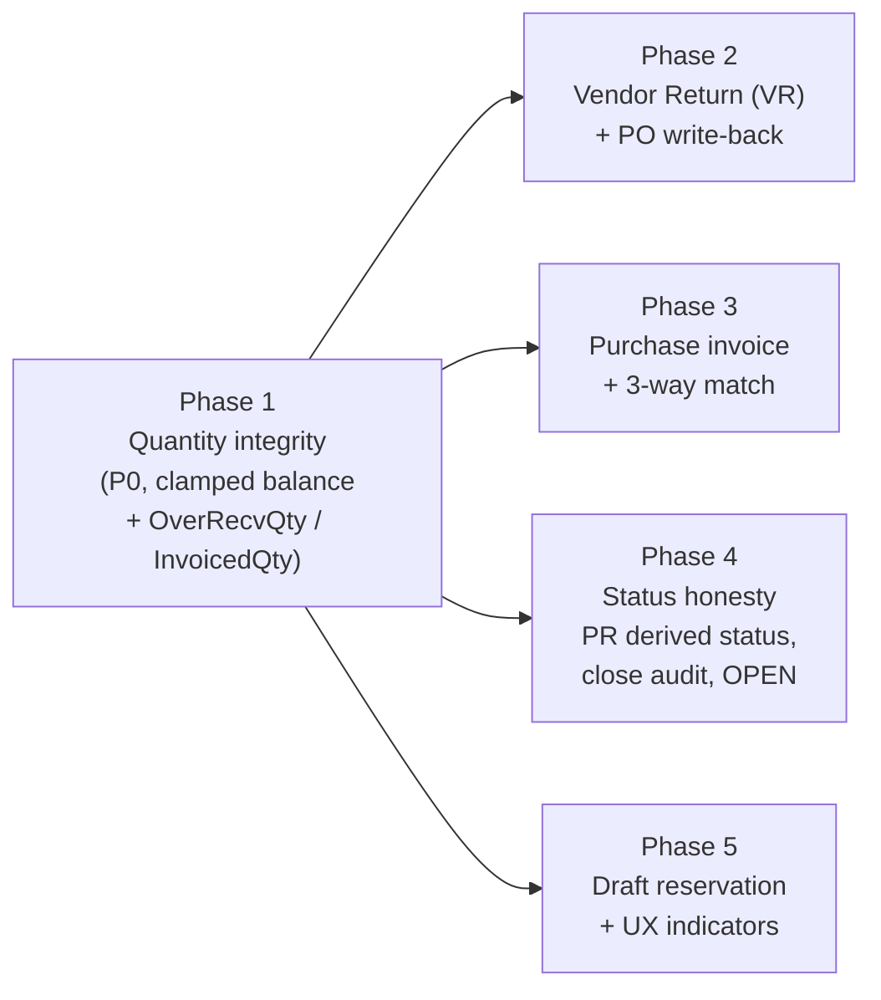
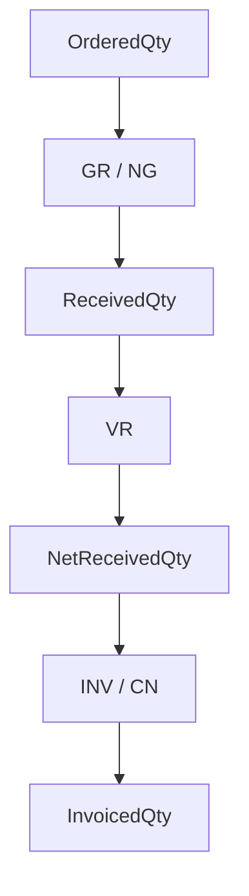

# Procurement Implementation Plan v2 — PR / PO / GR / VR / Purchase Invoice

Status: **Implementation-ready (v2.3 — final clarifications locked)**
Source: [procuretment-plan.md](procuretment-plan.md) (PR/PO/GR business-logic review, 2026-09-13)
Scope: Purchase Requisition (`POPR`), Purchase Order (`POOrder`), Goods Receipt (`IvTrxBatch` GR/NG),
Vendor Return (new `VR`), Purchase Invoice (existing `POInvoice` / `POInvoiceDetail`).
Goal: close the nine review findings and extend the chain from `PR → PO → GR` to
`PR → PO → GR → Vendor Return → Purchase Invoice (3-way match)` without inventing a new stack.

Do not produce another review document. This is the consolidated implementation specification.

---

## 1. Overview

The PR → PO → GR chain is already implemented and largely sound. This plan keeps every existing
invariant (§4 of the review) and adds only what is missing:

- **Quantity integrity** — tolerance over-receipt can drive `BalanceQty` negative and is not accounted for.
- **Returns close the loop** — `ApplyReturnQtyAsync` exists but has no caller; return-to-vendor has no document.
- **Purchase invoice / 3-way match** — `POInvoice` / `POInvoiceDetail` tables exist with no service.
- **Status honesty** — statuses exist in code and UI but are never written.
- **Draft reservation** — two unposted GR drafts can target the same PO balance.

### Phase dependency graph



Phase 1 is a hard prerequisite: Phases 2–4 all recompute `BalanceQty` / `OverRecvQty`, and Phase 3
writes `InvoicedQty`, which Phase 1 adds. Phase 5 depends only on Phase 1 and may run in parallel.



---

## 2. Verified baseline

Every fact below was checked against the current code. Do not re-derive.

| Fact | Location |
|---|---|
| `ComputeBalance` does **not** clamp: `PoPurQty - RecvQty - ReturnQty` | `ErpWeb.Core/Purchase/PoOrderCalc.cs:33` |
| `ValidateQtyInvariants` rejects `poPurQty < recvQty + returnQty` | `ErpWeb.Core/Purchase/PoOrderCalc.cs:95` |
| `ComputeBalance` callers | `IvInventoryPostingService.cs:2832`, `PoOrderService.cs:823`, `PoOrderService.cs:1339`, `PoOrder.razor.cs:1221` |
| `ValidateQtyInvariants` callers | `PoOrderService.cs:824` (return), `PoOrderService.cs:1294` (PO edit qty) |
| GR pre-check already caps a single receipt at `PoPurQty * (1 + tol/100)` | `IvInventoryPostingService.ValidateGoodsReceiptPoQtyAsync` |
| `GetReceiptToleranceAsync` is **private** inside the posting service | `IvInventoryPostingService.cs` |
| `PoVendorByItems.Tolerance` is the only tolerance field; no price tolerance exists | `ErpWeb.Model/Entities/Purchase/PoVendorByItem.cs` |
| `IPoOrderService.ApplyReturnQtyAsync` opens its **own** context + transaction; no caller | `IPoOrderService.cs:512`, `PoOrderService.cs:778` |
| `PoInvoice` / `PoInvoiceDetail` entities + EF configs exist; **no service** | `ErpWeb.Model/Entities/Purchase/PoInvoice.cs`, `PoInvoiceDetail.cs` |
| `PoInvoiceDetail` has **no** `PoNo` / `PoRelNo` / `PoLineNo` | `PoInvoiceDetail.cs` |
| `PoOrderDetail` has **no** `OverRecvQty` / `InvoicedQty` | `ErpWeb.Model/Entities/Purchase/PoOrderDetail.cs` |
| `PoOrder` has `CheckBy`/`ApprovedBy`/`AuthorisedBy` but **no** `CloseReason`/`ClosedBy`/`ClosedOn` | `ErpWeb.Model/Entities/Purchase/PoOrder.cs` |
| `PoPrDetail` already has a `Status` column (`PRStat`, max 20) | `PoPrDetailConfiguration.cs:32` |
| `PARTIALLY_ORDERED` is 17 chars — fits `PRStat nvarchar(20)` | `PoPrConfiguration.cs:19` |
| `DispatchAsync` handles `MR, CR, GR, NG, MI, SC, TR, ADJ` only | `IvInventoryPostingService.cs:54` |
| `IvTrxTypes.VendorReturn = "VR"` already defined | `IvTrxConstants.cs:10` |
| `IvTrxBatchDetail` already has `PoNo`/`PoRelNo`/`PoLineNo` + `FromBalLocId` | `IvTrxBatchDetail.cs` |
| Numbering module == doc-type string | `SaCdnService.cs:480` |
| Scripts are manual DBA only, idempotent, never run at startup | `scripts/*.sql` |

### Clone templates (do not invent)

| Deliverable | Clone from |
|---|---|
| Vendor Return service | `ErpWeb.Core/Inventory/IvMiscIssueService.cs`, `IIvMiscIssueService.cs` |
| Vendor Return UI | `ErpWeb.UI/Inventory/Transactions/IvMiscIssue*.razor(.cs/.css)` |
| Vendor Return tests | `ErpWeb.Tests/IvMiscIssuePostingServiceTests.cs` |
| Invoice service | `ErpWeb.Core/Sales/SaCdnService.cs`, `SaCdnCalc.cs`, `ErpWeb.Model/Repositories/Sales/SaCdnRepository.cs` |
| Invoice UI | `ErpWeb.UI/Sales/Transactions/SaCdnList.razor`, `SaCdn.razor` |
| Invoice tests | `ErpWeb.Tests/SaCdnServiceTests.cs`, `SaCdnSqlServerConcurrencyTests.cs` |
| New inventory trx type | `ErpWeb/docs/inventory-trx-pattern.md` (mandatory) |

---

## 3. Locked decisions

1. **All five phases are in scope**, including the purchase invoice and 3-way match.
2. **Vendor Return is a new stock-OUT inventory document** (`IvTrxTypes.VendorReturn` = `"VR"`),
   cloned from MI per `ErpWeb/docs/inventory-trx-pattern.md`. It posts stock out, then writes the
   return back to the PO inside the same transaction.
3. **The purchase invoice uses the existing `POInvoice` / `POInvoiceDetail` tables** plus new PO link
   columns. No new invoice document family for commercial INV. Types: `INV` and quantity `CN` only
   on `PoInvoice`. Debit note and value-only (financial) CN are delivered by the separate `PoCdn`
   family — see `plans/POCNDN-plan.md` (v2.5).
4. **PR approval stays external.** No approval engine in this plan. Only a derived PR status
   (`PARTIALLY_ORDERED` / `FULLY_ORDERED`) is added. `PENDING` / `CHECKED` remain in the enum and
   list filter because they are approval states.
5. **Authoritative validator split** — do not mix these:
   - `ValidateQtyInvariants` = current persisted PO-line state is internally valid.
   - `ValidateReceiptAgainstTolerance` = proposed GR/NG result under receive tolerance.
   - `ValidateOrderQtyChange` = PO edit/revise floors (`NewOrdered > 0`, `>= NetReceived`, `>= Invoiced`).
6. **`PoStatusPolicy` remains the only writer of `PoOrder.Status`.** No module writes status directly.
7. **`ApplyReturnQtyAsync` is deleted** from the interface and implementation rather than left
   unreachable or allowed to nest transactions.
8. **Legacy `OPEN`** — kept readable, editable and filterable, but removed from `IsGrPickable`.
   See §11 for the follow-up once legacy rows are confirmed absent.
9. **Scripts are additive and idempotent** (`IF COL_LENGTH(...) IS NULL`, `IF OBJECT_ID(...) IS NULL`),
   run manually by a DBA, never at app startup.
10. **Invoice qty tolerance is receive-only.** `AllowedInvoicedQty = NetReceivedQty`. Qty tolerance
    may raise `AllowedRecvQty` above `OrderedQty`; it must not raise invoice qty above net received.
11. **CN is quantity-only** on `PoInvoice` and must reference one specific posted INV. Value-only /
    financial credit notes and debit notes are **not** on `PoInvoice` — they are the `PoCdn` family
    (`plans/POCNDN-plan.md`). `PoInvoice.Type=CN` money is informational / non-AP.
12. **No negative `InvoiceableQty`.** Split over-invoice into `OverInvoicedQty`.
13. **VR after invoice is allowed**; **GR rollback after invoice is rejected** when it would make
    `InvoicedQty > NewNetReceivedQty`. See §4 rationale.
14. **VR is prohibited** on service / non-stock (NG) lines.
15. **Invoice UOM must equal** the PO line `PurchaseUom`. No conversion in this plan.
16. **Prices and tolerances are non-negative** (`0..100`). Invoice price-tolerance override may
    increase or decrease the vendor-item value under existing `PO_INVOICE` EDIT/POST authorization.
17. **`RecvQty` is the current effective posted GR/NG quantity** after posts and rollbacks, not an
    immutable historical total. VR never decreases it.
18. **AP / GL journal posting is deferred.** Phase 3 is commercial invoice + 3-way match +
    `InvoicedQty` + Post/Rollback only.
19. **Zero-quantity policy:** active PO detail `OrderedQty > 0`; GR/NG/VR/INV/CN transaction qty `> 0`.
20. **Persisted equals helper:** after every write-back,
    `BalanceQty == ComputeBalance(...)` and `OverRecvQty == ComputeOverRecv(...)`.

### 3.5 Canonical quantity model

Persist the starred fields on `PoOrderDetail`; derive the rest in `PoOrderCalc`.

| Quantity | Source | Persisted? | Modified by |
|---|---|---|---|
| `OrderedQty`* | `PoPurQty` | Yes | PO |
| `ReceivedQty`* | `RecvQty` | Yes | GR/NG post and rollback |
| `ReturnedQty`* | `ReturnQty` | Yes | VR post and rollback |
| `InvoicedQty`* | INV − CN | Yes | INV/CN post and rollback |
| `NetReceivedQty` | Recv − Return | No | Derived |
| `BalanceQty`* | Ordered − NetReceived (clamped) | Yes* | Always recomputed |
| `OverRecvQty`* | NetReceived − Ordered (clamped) | Yes* | Always recomputed |
| `InvoiceableQty` | NetReceived − Invoiced (clamped) | No | Derived |
| `OverInvoicedQty` | Invoiced − NetReceived (clamped) | No | Derived |

`ReceivedQty` (`RecvQty`) is the current effective posted GR/NG qty after all posts and rollbacks.
It is not a lifetime cumulative. VR never decreases it.

Locked formulas (`PoOrderCalc`, `AwayFromZero`, 4 dp):

```
NetReceived(recv, ret)     = RoundQty(recv - ret)
BalanceQty                 = Max(0, OrderedQty - NetReceivedQty)
OverRecvQty                = Max(0, NetReceivedQty - OrderedQty)
InvoiceableQty             = Max(0, RoundQty(NetReceivedQty - InvoicedQty))
OverInvoicedQty            = Max(0, RoundQty(InvoicedQty - NetReceivedQty))
AllowedRecvQty             = RoundQty(OrderedQty * (1 + qtyTol/100))
AllowedInvoicedQty         = NetReceivedQty
```

`InvoiceableQty` and `OverInvoicedQty` are derived only (never persisted). UI shows remaining-to-invoice
as `InvoiceableQty`, and an over-invoiced chip/text when `OverInvoicedQty > 0` (never display `-10`).
Over-invoice is a data-quality exception that requires a quantity CN.

**Supersedes v2:** `OverRecvQty = Max(0, RecvQty + ReturnQty - PoPurQty)` and unclamped
`PoPurQty - RecvQty - ReturnQty`.

**Supersedes v2.1:** `AllowedInvoicedQty = NetReceived * (1 + qtyTol/100)` and signed `InvoiceableQty`.

Worked example: PO 100, GR 110, VR 10 → `NetReceived=100`, `Balance=0`, `OverRecv=0`,
`AllowedInvoiced=100`.

Recompute `BalanceQty` / `OverRecvQty` from persisted inputs after every GR/VR post and rollback.
Do not use incremental `+=` on those two fields.

**Persisted-equals-helper invariant** (data-repair / migration check):

```
Persisted BalanceQty  == PoOrderCalc.ComputeBalance(...)
Persisted OverRecvQty == PoOrderCalc.ComputeOverRecv(...)
```

`ReturnQtyCn` stays unused. Stock returns are VR; quantity correction on the invoice is CN.

---

## 4. Phase 1 — Quantity integrity (P0)

**Why:** tolerance over-receipt makes `BalanceQty` negative (finding 1) and there is no field to
record over-delivery or invoiced quantity.

### Steps

1. **Schema + entity**
   - Add `OverRecvQty` and `InvoicedQty` (`decimal`, 18,4) to
     `ErpWeb.Model/Entities/Purchase/PoOrderDetail.cs`.
   - Map both in `ErpWeb.Model/Configurations/Purchase/PoOrderDetailConfiguration.cs`
     with `HasPrecision(18, 4)`.
   - Add `scripts/alter-podetail-overrecv-invoiced.sql`, idempotent, modelled on
     `scripts/alter-saso-writtenoff-columns.sql`.

2. **Calculation** (`ErpWeb.Core/Purchase/PoOrderCalc.cs`)
   - Replace `ComputeBalance` with the clamped net-received formula:
     `Max(0, OrderedQty - NetReceivedQty)`.
   - Add `ComputeNetReceived`, `ComputeOverRecv`, `ComputeInvoiceable`, `ComputeOverInvoiced`,
     `AllowedInvoicedQty` (= net received).
   - Authoritative validator split — do not mix these:
     - **`ValidateQtyInvariants`** — structural check of the **current persisted** PO line.
       Recv/Return/Invoiced `>= 0`, `ReturnQty <= RecvQty`, persisted Balance/OverRecv equal the
       helpers. It must **accept** `OrderedQty < NetReceivedQty` when a tolerated over-receipt is
       already posted. It is not a GR transaction validator and must not encode receive tolerance
       or a proposed qty.
     - **`ValidateReceiptAgainstTolerance`** — transaction-specific **proposed GR/NG** result after
       lock: incoming qty `> 0`, `NewNetReceived <= AllowedRecvQty`,
       `NewReceivedQty >= ExistingReturnedQty`. Allows `NewNet > Ordered` only inside the
       receive-tolerance ceiling.
     - **`ValidateOrderQtyChange`** — PO edit/revise only: `NewOrdered > 0`,
       `NewOrdered >= NetReceivedQty`, `NewOrdered >= InvoicedQty`.

3. **GR posting** (`IvInventoryPostingService.ApplyGoodsReceiptPoQtyAsync`, ~line 2832)
   - Receive ceiling uses **net** received: after lock,
     `NewRecvQty - ReturnQty <= AllowedRecvQty`.
   - Resolve the PO-line tolerance once per line (reuse the existing lookup that feeds
     `PoOrderCalc.AllowedRecvQty`) and call `ValidateReceiptAgainstTolerance` after applying the
     signed delta.
   - Set `BalanceQty = ComputeBalance(...)` and `OverRecvQty = ComputeOverRecv(...)` for
     **both** `sign = +1` and `sign = -1`. Persisted values must equal the helpers.
   - GR rollback, after lock, must satisfy the **resulting** state:
     - `NewReceivedQty >= ExistingReturnedQty`
     - `InvoicedQty <= NewNetReceivedQty` — **reject** otherwise (reverse INV/CN first)
   - Then recompute `NetReceived`, `BalanceQty`, `OverRecvQty`, `FinClosed` from **all** PO lines
     under the same header/detail lock, and operational status.
   - The existing per-receipt ceiling in `ValidateGoodsReceiptPoQtyAsync` is the pre-check and stays;
     it must not be duplicated or replaced.

4. **Why GR rollback after invoice is rejected but VR after invoice is allowed**
   - VR is a new physical return that can happen after the supplier has invoiced. The financial
     correction is a quantity CN; `OverInvoicedQty > 0` is the expected temporary exception.
   - GR rollback undoes the original receipt. That is not a physical return. Allowing it after
     invoice would manufacture the same over-invoice without a goods movement. Reject it so the
     chain is INV/CN first, then GR rollback.

5. **UI display parity** (`ErpWeb.UI/Purchase/Transactions/PoOrder.razor.cs:1221`)
   - Use the clamped `ComputeBalance` in the client-side display recompute so the grid cannot show a
     negative balance the server would never persist.

### Files

`ErpWeb.Model/Entities/Purchase/PoOrderDetail.cs` ·
`ErpWeb.Model/Configurations/Purchase/PoOrderDetailConfiguration.cs` ·
`ErpWeb.Core/Purchase/PoOrderCalc.cs` ·
`ErpWeb.Core/Inventory/IvInventoryPostingService.cs` ·
`ErpWeb.UI/Purchase/Transactions/PoOrder.razor.cs` ·
`scripts/alter-podetail-overrecv-invoiced.sql`

### Tests

- `ErpWeb.Tests/PoOrderCalcTests.cs` — extend: clamp at 0, `ComputeOverRecv` / `ComputeNetReceived`
  boundaries, `ValidateReceiptAgainstTolerance` at 0 / inside / at / beyond tolerance,
  `ValidateOrderQtyChange`, `ComputeInvoiceable` / `ComputeOverInvoiced`.
- `ErpWeb.Tests/IvInventoryPostingServiceTests.cs` — receive within tolerance, exactly at tolerance,
  beyond tolerance (rejected), rollback after over-receipt, GR rollback blocked by return,
  GR rollback after invoice rejected, assert `BalanceQty >= 0` and persisted-equals-helper in every case.

### Done when

`BalanceQty` is never negative, `OverRecvQty` reflects over-delivery via net received, rollback
restores recomputed values, and GR rollback cannot create over-invoice.

---

## 5. Phase 2 — Vendor Return (VR) closes the loop

**Why:** return-to-vendor has no document and never updates the PO (finding 3).

### Steps

1. **Document service** — new `IvVendorReturnService` / `IIvVendorReturnService` in
   `ErpWeb.Core/Inventory/`, cloned from `IvMiscIssueService` / `IIvMiscIssueService`.
   - Stock-OUT family: line identity is `FromBalLocId`.
   - Numbering stays on the shared `RunningNumberKeys.IvBatch` — do **not** derive from `MAX(BatchNo)`.
   - Add a required PO link per line: `PoNo`, `PoRelNo`, `PoLineNo`. A VR line without a PO link is
     rejected at save and at post.
   - Reject VR on **service / non-stock** lines (`PoOrderCalc.IsServiceIType` or `OneTime` / NG
     family). `FromBalLocId` is irrelevant for those lines; they receive via NG, not VR.
   - Do not embed balance SQL in the document service; it calls
     `_posting.PostAsync(IvTrxTypes.VendorReturn, ...)` / `RollbackAsync(...)`.

2. **UI** — clone the MI pair into
   `ErpWeb.UI/Inventory/Transactions/IvVendorReturnList.razor(.cs/.css)` and
   `IvVendorReturn.razor(.cs/.css)`.
   - Routes `/inventory/vendor-return` and `/inventory/vendor-return/{new|edit|view}/{BatchNo}`.
   - CSS prefix `vr-` (rename every class), `GridKey` `inv-vendor-return-list`.
   - Titles, chips, toasts, empty text say "Vendor return", never "Miscellaneous issue".
   - MI has `CancelAsync`; MR does not. Include cancel on VR (a draft VR must be cancellable).

3. **Posting dispatch** (`IvInventoryPostingService.DispatchAsync`, lines 54–140) — three edits:
   - add `isVr` to the implemented-type guard (otherwise posting returns
     "Posting is not implemented for transaction type 'VR'"),
   - add `MenuCodes.InventoryVendorReturn` to the menu-code map,
   - route `VR` through the existing `PostInventoryMIAsync` / `RollBackInventoryMIAsync` with
     `expectedTrxType: "VR"`.
   - **Do not copy** `PostInventoryMIAsync` unless the movement rules actually diverge — they do not.

4. **PO write-back inside the posting transaction**
   - Add a private `ApplyVendorReturnPoQtyAsync(db, ...)` inside the MI posting transaction, shaped
     like `ApplyGoodsReceiptPoQtyAsync`.
   - Cumulative return, under PO-line lock:

     ```
     NewReturnQty <= RecvQty - ExistingReturnQty
     ```

     Example: GR 100, VR#1 70, VR#2 40 → reject; whole transaction rolls back; batch stays `NEW`.
   - VR post, after lock:

     ```
     ReturnQty += qty
     recompute NetReceived, BalanceQty, OverRecvQty
     recompute InvoiceableQty / OverInvoicedQty (derived)
     recompute FinClosed          // Phase 3 column; wire the call in Phase 2 once it exists
     recompute operational status via PoStatusPolicy
     ```

     State this FinClosed recompute **inside Phase 2**, not only in Phase 3, so VR implementers
     do not skip financial close. Compute FinClosed from the **complete** set of PO lines while
     header + all details remain locked.
   - VR rollback:

     ```
     ReturnQty -= qty   // not below 0
     same recompute list as VR post, including FinClosed
     ```

   - A fully-returned line can reopen a closed PO — status must be recomputed, never set directly.
   - Lock the PO header/detail rows in the same order the GR path already uses, so VR and GR cannot
     deadlock against each other.
   - VR after invoice is **allowed** (physical return; CN is the financial correction). See §4
     distinction from GR rollback after invoice.

5. **Retire the orphan API** — delete `ApplyReturnQtyAsync` from
   `ErpWeb.Core/Purchase/IPoOrderService.cs` (512) and `PoOrderService.cs` (778). It opens its own
   context and transaction and has no caller; nesting it inside posting would break atomicity.

6. **Wiring**
   - `ErpWeb.Core/Menus/MenuCodes.cs`: `InventoryVendorReturn = "INV_VENDOR_RETURN"`.
   - `ErpWeb/Menus/menus.xml`: under `INVENTORY`, after Stock Return.
   - `scripts/init-menu-access.sql`: `ACCESS`, `ADD`, `EDIT`, `DELETE`, `POST`, `ROLLBACK`, `CANCEL`.
   - `ErpWeb.Core/CoreServiceCollectionExtensions.cs`: register the service.

7. **Document lifecycle** (shared with INV/CN; follow GR / SaCdn convention)
   - **NEW (draft):** edit, delete, post. VR drafts may also cancel.
   - **POSTED:** rollback only. No delete, no qty edit.
   - **Rolled back:** status returns to `NEW`; quantities already reversed; re-post is a new apply.
   - **Cancelled:** draft-only (VR). Posted documents are not cancelled; they are rolled back.
   - Repeating Post/Rollback for the same document must not double-apply PO quantities. Gate on
     status inside the transaction.

### Files

`ErpWeb.Core/Inventory/IIvVendorReturnService.cs` · `IvVendorReturnService.cs` ·
`IvInventoryPostingService.cs` · `ErpWeb.Core/Purchase/IPoOrderService.cs` ·
`ErpWeb.Core/Purchase/PoOrderService.cs` · `ErpWeb.Core/Menus/MenuCodes.cs` ·
`ErpWeb/Menus/menus.xml` · `scripts/init-menu-access.sql` ·
`ErpWeb.Core/CoreServiceCollectionExtensions.cs` · six `IvVendorReturn*.razor*` files

### Tests

New `ErpWeb.Tests/IvVendorReturnPostingServiceTests.cs`, cloned from
`IvMiscIssuePostingServiceTests.cs`, plus PO write-back cases:

- return posts → stock decreases, `ReturnQty` and `BalanceQty` updated, `OverRecvQty` recomputed
- cumulative over-return rejected; whole transaction rolls back; batch stays `NEW`
- fully-returned line reopens a closed PO
- VR rollback reverses both the stock movement and the PO quantities (including FinClosed)
- line without a PO link rejected at save and at post
- service / OneTime / NG line VR rejected
- VR after full invoice → `OverInvoicedQty > 0`, FinClosed false
- VR vs GR concurrency on the same PO line — no deadlock, no lost update
- double-post of already-POSTED VR → no qty change

### Done when

A vendor return moves stock out **and** updates the PO in one atomic transaction, FinClosed is
recomputed on VR paths, and no unreachable return API remains.

---

## 6. Phase 3 — Purchase invoice (POInvoice) + 3-way match

**Why:** `PR → PO → GR` ends at stock; the finance cycle is missing (finding 2).

### Steps

1. **PO link columns**
   - Add `PoNo` (column `PONo`, max 30), `PoRelNo` (`short?`, column `PORelNo`),
     `PoLineNo` (`short?`, column `POLineNo`) to
     `ErpWeb.Model/Entities/Purchase/PoInvoiceDetail.cs`, following the existing
     `PoOrderDetailConfiguration` naming convention.
   - Map in `ErpWeb.Model/Configurations/Purchase/PoInvoiceDetailConfiguration.cs`.
   - Add `scripts/alter-poinvoicedetail-po-link.sql`, idempotent.

2. **Financial close columns on PO**
   - Add `FinClosed` bit + `FinClosedOn` / `FinClosedBy` to `PoOrder` + configuration +
     `scripts/alter-poorder-finclosed.sql`.
   - Leave `PoStatusPolicy` the single writer of operational status.

3. **Price tolerance column**
   - Add `PoVendorByItem.PriceTolerance` (`decimal(18,4)`, default 0) +
     nullable `PoInvoice.PriceTolerance` override + `scripts/alter-povendorbyitem-pricetolerance.sql`.

4. **Service** — new `IPoInvoiceService` / `PoInvoiceService` / `PoInvoiceCalc` in `ErpWeb.Core/Purchase/`,
   cloned from `SaCdnService` / `SaCdnCalc` / `SaCdnRepository`.
   - Reuse `IvMasterOperationResult<T>` / error-kind conventions already used by the Purchase services.
   - Permissions: `ACCESS` / `ADD` / `EDIT` / `DELETE` / `POST` where the clone defines them;
     UI hiding buttons is not authorization.
   - Scope via `TryBranchScope` (list/get/delete) and `TryWriteScope` (save).
   - Numbering: `IDocumentNumberingService.NextAsync(db, module, "", docDate, DocumentNumberRequestMode.New, "AUTO", ct)`
     with a new `PO_INV` NumCd, mirroring `SaCdnService.cs:480`. Seed with
     `scripts/seed-po-invoice-numbering.sql` (model on `scripts/seed-po-order-numbering.sql`).
     Allocation must run inside the same SQL transaction as the invoice insert.
   - Document types: `INV` increases `InvoicedQty`; `CN` decreases `InvoicedQty` (not below 0).
     Debit note out of scope. Value-only CN out of scope (`Qty` must be `> 0`).
   - Add `PostedDate` / `PostedBy` / `RollbackDate` / `RollbackBy` on `PoInvoice` (missing vs `SaCdn`).

5. **CN-to-invoice reference**
   - `PoInvoice.InvNo` is required on CN and must be one **specific posted INV** for the same
     company/branch/vendor. CN qty on a PO line cannot exceed that INV's **remaining qty** on that line:

     ```
     RemainingOnInvLine = PostedInvQty(InvNo, PoLine) - Sum(PostedCnQty where InvNo + PoLine)
     newCnQty <= RemainingOnInvLine
     ```

   - A CN is not a free draw against the PO's accumulated `InvoicedQty`. Example: INV-001=40,
     INV-002=60; a CN of 20 must name INV-001 or INV-002 and cannot exceed that document's
     remaining 40 or 60.
   - Cannot rollback a posted INV that still has posted CNs referencing it (rollback those CNs first).

6. **Document lifecycle** (same as §5.7)
   - **NEW:** edit, delete, post.
   - **POSTED:** rollback only. No delete, no qty edit.
   - Repeating Post/Rollback must not double-apply PO quantities (status gate inside the transaction).

7. **Tolerance helper**
   - Extract the tolerance lookup currently private in `IvInventoryPostingService`
     (`GetReceiptToleranceAsync`) into a shared helper (e.g. `PoToleranceLookup`) so the invoice
     service reuses `PoVendorByItem.Tolerance` / `PriceTolerance` instead of re-querying with
     divergent rules.
   - Do not duplicate the qty formula; `PoOrderCalc.AllowedRecvQty` stays the single definition.
   - Master and override validation: `0 <= QtyTolerance <= 100`, `0 <= PriceTolerance <= 100`.
     Reject negatives.

8. **3-way match** (qty + UOM + price)
   - Authoritative net received, after PO-line lock: `RecvQty - ReturnQty`. History aggregation
     is a consistency check, not a second formula.
   - Invoice post:
     - Reject invoice-before-receipt (`NetReceivedQty <= 0`)
     - Invoice line UOM must equal PO line `PurchaseUom` (map `PoInvoiceDetail.SellingUOM`; no conversion)
     - `newInvoiceQty <= AllowedInvoicedQty - InvoicedQty` where `AllowedInvoicedQty = NetReceivedQty`
     - After commit: `0 <= InvoicedQty <= NetReceivedQty`
     - Client cannot supply `InvoicedQty`
   - CN post / rollback (state under PO lock, then recompute derived + FinClosed from **all** lines):

     ```
     CN post:     InvoicedQty -= CNQty     // also newCnQty <= RemainingOnInvLine and <= InvoicedQty
     CN rollback: InvoicedQty += CNQty
     then:        0 <= InvoicedQty
                  recompute InvoiceableQty, OverInvoicedQty
                  recompute FinClosed from the complete PO line set
     ```

   - VR after invoice is **allowed** (see §4 distinction). That creates `OverInvoicedQty > 0` and
     `InvoiceableQty = 0`. Correction path is a quantity CN against the specific INV. Invoice post
     still refuses to increase `InvoicedQty` above `NetReceivedQty`.

9. **Price tolerance**
   - Basis: **unit price**, after `RoundPrice` (`POPriceDecimal`, default 6, `AwayFromZero`).
   - Invoice override **may increase or decrease** the vendor-item tolerance
     (`Invoice.PriceTolerance ?? vendorItem.PriceTolerance ?? 0`). No new permission: `PO_INVOICE`
     EDIT/POST is the authorization. A 100% override can neutralize price match; that is accepted
     as a document-level control, not a silent master bypass.
   - Commercial prices: `PoUnitPrice >= 0`, invoice `UnitPrice >= 0`. Negative prices are not
     supported (same as `PoMasterRefService` today).
   - Formula:

     ```
     EffectivePriceTolerance = Invoice.PriceTolerance ?? vendorItem.PriceTolerance ?? 0
     if RoundPrice(poPrice) == 0: accept only RoundPrice(invPrice) == 0
     else: |inv - po| / po * 100 <= EffectivePriceTolerance
     ```

   - A zero invoice price against a positive PO price is a 100% variance and fails unless the
     effective tolerance is 100.

10. **Financial close**
    - `FinClosed` is **recomputed**, not a one-way flag:

      ```
      FinClosed =
          !Cancelled
          AND every non-service line:
              BalanceQty == 0
              AND InvoicedQty == NetReceivedQty
      ```

    - Because invoice qty tolerance is off, `RequiredInvoiceQty = AllowedInvoiceQty = NetReceivedQty`.
      Exact match, not `InvoiceableQty <= 0`.
    - Service lines use the same receipt-then-invoice rule (NG). A service-only PO can become
      `FinClosed` after NG + invoice; it still does not auto-operational-close.
    - Stamp `FinClosedOn`/`By` on false→true; clear on true→false.
    - Compute `FinClosed` from the **complete** set of PO lines after the affected line is updated,
      while the PO header and **all** detail rows remain locked. Do not decide close from the
      changed line alone.
    - Recompute after: GR post/rollback, VR post/rollback, INV post/rollback, CN post/rollback,
      PO revise, PO reopen. Force-close does **not** set `FinClosed`.
    - A financially closed PO is not blocked by `IsGrPickable`. A later VR that reduces net received
      turns `FinClosed` off.

11. **PO revision vs invoiced qty**
    - `ReviseAsync` / PO edit use **`ValidateOrderQtyChange`** (not `ValidateQtyInvariants`):

      ```
      New OrderedQty > 0
      New OrderedQty >= NetReceivedQty
      New OrderedQty >= InvoicedQty
      ```

    - Replace today’s `purchaseQty < RecvQty + ReturnQty` check in `PoOrderService.cs` (~1289).
      Quantity reduction after invoicing is not supported.

12. **Service / NG / VR**
    - Existing split: stock lines → GR; `OneTime` / indirect → NG.
      `IvGoodsReceiptService.SearchPoLinesAsync` already filters by `OneTime == indirect`.
      NG posting already writes `RecvQty` the same way as GR.
    - Service / non-stock receipt is **NG**; `RecvQty` is populated; `BalanceQty` uses the same
      net-received formulas; partial NG is allowed.
    - Invoice still requires `NetReceivedQty > 0` (no invoice-without-NG).
    - **VR is rejected** for service IType and OneTime/NG lines.
    - Financial correction after NG+invoice is a quantity CN, not a VR.

13. **POInvoice commercial / tax scope**
    - **Reuse unchanged** from `PoOrderCalc` / `PoPrCalc`: `ComputeTax`, `PurchaseTaxDec`,
      `ApplyTwoLevelDiscount` (`ItemDiscount` / `ItemDiscount1` only), `SumTotals`.
    - **Clone pattern** from `SaCdnService`: numbering inside the save transaction, `NEW`↔`POSTED`,
      currency rate into `CurrRate`, commercial-readiness GL-code checks (validation only).
    - **Wire:** `InvNo` required on `INV`; `DocDate` is the invoice/CN date; `ExternalDocNo` extra ref.
    - **Out of scope:** AP/GL journals, freight, dedicated supplier-invoice-date column, debit note,
      e-invoice/IRBM, value-only CN, invoice UOM conversion.

14. **UI**
    - Clone `SaCdnList.razor` / `SaCdn.razor` (+ `.cs` / `.css`) into `ErpWeb.UI/Purchase/Transactions/`.
    - Routes `/purchase/invoices` and `/purchase/invoices/{new|edit|view}/{DocNo}`.
    - Menu `PO_INVOICE` under `PO_TRANSACTIONS` with `SortOrder="3"` (after `PO_ORDER`);
      constant in `MenuCodes.cs`; grants in `scripts/init-menu-access.sql`.
    - Cross-document navigation (list/detail links; PO keys already exist):
      PO → GR, PO → VR, PO → Invoice; Invoice → PO, CN → Invoice, VR → originating PO.

### Files

`ErpWeb.Model/Entities/Purchase/PoInvoiceDetail.cs` · `PoInvoice.cs` · `PoOrder.cs` · `PoVendorByItem.cs` ·
`ErpWeb.Model/Configurations/Purchase/PoInvoiceDetailConfiguration.cs` · `PoOrderConfiguration.cs` ·
`ErpWeb.Core/Purchase/IPoInvoiceService.cs` · `PoInvoiceService.cs` · `PoInvoiceCalc.cs` · `PoToleranceLookup.cs` ·
`ErpWeb.Model/Repositories/Purchase/PoInvoiceRepository.cs` · `IvInventoryPostingService.cs` (extract helper) ·
`ErpWeb.UI/Purchase/Transactions/PoInvoice*.razor*` · `ErpWeb.Core/Menus/MenuCodes.cs` ·
`ErpWeb/Menus/menus.xml` · `ErpWeb.Core/CoreServiceCollectionExtensions.cs` ·
`scripts/alter-poinvoicedetail-po-link.sql` · `scripts/alter-poorder-finclosed.sql` ·
`scripts/alter-povendorbyitem-pricetolerance.sql` · `scripts/seed-po-invoice-numbering.sql` ·
`scripts/init-menu-access.sql`

### Tests

New `ErpWeb.Tests/PoInvoiceServiceTests.cs` (clone `SaCdnServiceTests.cs`) covering the match matrix:

- match pass: ordered net-received = invoiced → FinClosed
- invoice above net received rejected (no invoice qty tolerance)
- price over tolerance rejected; exactly at tolerance accepted
- invoice UOM mismatch rejected
- CN exceeding that INV remaining rejected; CN within remaining accepted
- CN rollback restores `InvoicedQty` and recomputes FinClosed from all lines
- cannot rollback INV while posted CNs still reference it
- invoice before GR rejected
- partial invoice then balance invoice → `InvoicedQty` reaches net received, PO financially closed
- VR after full invoice → OverInvoiced; CN restores
- numbering allocated in the same transaction as the insert
- double-post → no qty change

New `ErpWeb.Tests/PoInvoiceSqlServerConcurrencyTests.cs` (clone `SaCdnSqlServerConcurrencyTests.cs`):

- two invoices for the same PO line → exactly one commits; `InvoicedQty` never exceeds net received
- invoice vs GR posting on the same PO line → no deadlock, no lost update

Also extend `PoOrderServiceTests` for `ValidateOrderQtyChange` (revise below invoiced / below net).

### Done when

An invoice or quantity CN can be raised against a PO line, is validated against net received qty,
UOM, and price tolerance, writes `InvoicedQty` back atomically, and recomputes FinClosed from all
lines under lock.

---

## 7. Phase 4 — Status honesty

**Why:** statuses exist in code and UI but are never written (findings 4, 5, 8, 9).

### Steps

1. **PR derived status** (no schema change)
   - Add `PoPrStatuses.PartiallyOrdered = "PARTIALLY_ORDERED"` and `FullyOrdered = "FULLY_ORDERED"`
     in `ErpWeb.Core/Purchase/PoPrCalc.cs`.
   - Add `PoPrCalc.ComputeDerivedStatus(header, details)` driven by live PO consumption
     (`LivePoConsumedForPrAsync` semantics), **not** by the `PoNo` stamps — stamps are informational.
   - Write the header and line status where `RecalculatePrHeaderStampsAsync` already runs:
     `PoOrderService.SaveNewAsync` / `SaveExistingAsync` / `ReviseAsync` / `DeleteAsync` / `CopyAsync`.
   - Write it from `PoPrService` on cancel (`CANCELLED` wins over derived states).
   - Keep remaining qty derived; do not persist a cached remaining quantity.
   - `PRStat` is `nvarchar(20)` — both new values fit.

2. **Legacy `OPEN`** (`ErpWeb.Core/Purchase/PoStatusPolicy.cs:75`)
   - Remove `Open` from `IsGrPickable` so a legacy row cannot be received mid-edit.
   - Keep `Open` in `IsEditableStatus`, in `PoOrderStatuses`, and in the `PoOrderList` filter — legacy
     rows stay readable and editable under the same RowVersion rules.
   - Do **not** touch `PENDING` / `CHECKED`: approval is deferred (§3.4), so removing them would
     contradict a future phase. Leave `IsViewOnlyLeftover` as is.

3. **Force-close audit**
   - Add `CloseReason` (max 200), `ClosedBy` (max 20), `ClosedOn` (`datetime2?`) to
     `ErpWeb.Model/Entities/Purchase/PoOrder.cs` + `PoOrderConfiguration.cs` +
     `scripts/alter-poorder-close-audit.sql` (model on `scripts/alter-ivtrxbatch-forceclose-audit.sql`).
   - Add a `PoStatusPolicy.ForceClose(header, reason, userId, now)` overload; keep the parameterless
     method private or remove it so a reason cannot be skipped.
   - Require the reason in `PoOrderService.ForceCloseAsync` and in the confirmation popup in
     `ErpWeb.UI/Purchase/Transactions/PoOrderList.razor.cs`.
   - Clear `CloseReason` / `ClosedBy` / `ClosedOn` on reopen.
   - `Reopen` still requires a remaining balance — unchanged.
   - Force-close does **not** set `FinClosed`.

4. **Service / non-stock lines** (finding 9)
   - Document and surface in the UI that service-only POs must be force-closed deliberately, and
     report them on the list. Do not auto-close operationally. They can still become `FinClosed`
     after NG + invoice (Phase 3).

### Files

`ErpWeb.Core/Purchase/PoPrCalc.cs` · `PoStatusPolicy.cs` · `PoOrderService.cs` · `PoPrService.cs` ·
`ErpWeb.Model/Entities/Purchase/PoOrder.cs` · `ErpWeb.Model/Configurations/Purchase/PoOrderConfiguration.cs` ·
`ErpWeb.UI/Purchase/Transactions/PoOrderList.razor.cs` · `PoPrList.razor(.cs)` ·
`scripts/alter-poorder-close-audit.sql`

### Tests

- `ErpWeb.Tests/PoPrServiceTests.cs` / new PR status tests — derived status across partial order,
  multi-PO sourcing, revision, delete, copy, cancel.
- `ErpWeb.Tests/PoOrderServiceTests.cs` — force-close requires a reason and records
  `ClosedBy` / `ClosedOn`; reopen clears them; `OPEN` is no longer GR-pickable but still editable.
- Extend `ErpWeb.Tests/PoOrderSqlServerConcurrencyTests.cs` / `PoPrSqlServerConcurrencyTests.cs` for
  the new status write-backs.

### Done when

PR shows a truthful ordered state, no status exists in the UI that the code never writes, and every
close carries a reason and an actor.

---

## 8. Phase 5 — Draft reservation and UX

**Why:** two unposted GR drafts can target the same PO balance (finding 6), and over-receipt /
partial invoicing are invisible (findings 1, 2).

### Steps

1. **True availability in the picker**
   - `IvGoodsReceiptService.SearchPoLinesAsync` (line 182): subtract unposted draft quantity —
     sum `IvTrxBatchDetail.ToPurQty` where the parent `IvTrxBatch.BatchStatus = NEW` and
     `TrxType` matches the receipt type, joined on `PoNo` / `PoRelNo` / `PoLineNo`.
   - Expose `DraftQty` and `AvailableQty` on the picker row so the grid can show both.
   - Draft qty is **advisory only**. Posting remains authoritative: `PostGoodsReceiptAsync` locks the
     PO and re-validates inside the transaction. Never let the picker value be the posting authority.

2. **Indicators**
   - `ErpWeb.UI/Purchase/Transactions/PoOrder.razor` line grid:
     - over-receipt chip: `OverRecvQty > 0`
     - partial invoice: `InvoicedQty > 0 && InvoiceableQty > 0`
     - over-invoiced chip: `OverInvoicedQty > 0` (text “N over-invoiced”, never a negative number)
   - `AnyReceived` stays `RecvQty > 0` so a fully returned PO stays operationally `RECEIVED` with
     restored `BalanceQty`.
   - `ErpWeb.UI/Purchase/Transactions/PoPrList.razor(.cs)`: show remaining qty and the derived
     ordered status columns.

### Files

`ErpWeb.Core/Inventory/IvGoodsReceiptService.cs` · `ErpWeb.Core/Inventory/IIvGoodsReceiptService.cs` ·
`ErpWeb.UI/Inventory/Transactions/IvGoodsReceipt.razor.cs` ·
`ErpWeb.UI/Purchase/Transactions/PoOrder.razor` · `PoOrder.razor.cs` · `PoPrList.razor(.cs)`

### Tests

- `ErpWeb.Tests/IvGoodsReceiptServiceTests.cs` — picker availability decreases by draft qty and
  restores after draft delete / cancel; a post that would exceed the true availability still fails
  under lock even if the picker showed capacity.

### Done when

The GR picker shows true availability and the PO surfaces over-receipt / partial invoicing /
over-invoicing.

---

## 9. Verification

1. **Build** — `dotnet build ErpWeb.slnx` after each phase.
2. **Scripts are manual** — every `.sql` file is DBA-run, idempotent, and never executed at app startup.
3. **Test suite** — `dotnet test ErpWeb.Tests` must stay green; new files per phase:
   - Phase 1: `PoOrderCalcTests.cs` (extended), `IvInventoryPostingServiceTests.cs`
   - Phase 2: `IvVendorReturnPostingServiceTests.cs`
   - Phase 3: `PoInvoiceServiceTests.cs`, `PoInvoiceSqlServerConcurrencyTests.cs`
   - Phase 4: PR status tests, `PoOrderServiceTests.cs`, extended SQL Server concurrency tests
   - Phase 5: `IvGoodsReceiptServiceTests.cs`
4. **SQL Server concurrency tests self-skip** unless `ConnectionStrings:DefaultConnection` points at a
   SQL Server with DEMO masters. Run them explicitly before sign-off with a real connection string.
5. **Concurrency contract** — every new write-back (VR return, invoice, derived PR status) must take
   locks in the same order as the existing GR path (PO header, then details, then numbering) so two
   modules cannot deadlock.
6. **Browser verification** — for each new or cloned screen: list filters, new / edit / view, post,
   rollback, cancel, dirty-check, and permission-denied behaviour.
7. **DBA review** — confirm each new column exists with the expected type and default before the
   feature is enabled.
8. **DBA pre-enable integrity report** — before enabling v2.3 logic, run a one-time report (manual
   script, not startup) on existing `PoOrderDetail` rows and fail the cutover on violations (or list
   them for repair):
   - `RecvQty >= 0`, `ReturnQty >= 0`, `ReturnQty <= RecvQty`
   - `PoPurQty > 0` on active lines
   - `InvoicedQty >= 0` (column will be 0 after add)
   - `PoPurQty >= (RecvQty - ReturnQty)` unless a documented historical over-receipt is being
     accepted into `OverRecvQty`
   - `BalanceQty >= 0`
   - After backfill: persisted `BalanceQty` / `OverRecvQty` equal the helpers

   Existing inconsistent rows are reported, not silently rewritten.

---

## 10. Out of scope

- RFQ / quotation sourcing.
- Supplier portal / EDI.
- Multi-company intercompany procurement.
- Changing the `IvTrxBatch` GR / NG pattern or the shared inventory posting service.
- **PR approval engine** — deferred by decision (§3.4); only the derived PR status is implemented.
- Removing `PENDING` / `CHECKED` from the enum, the list filter, or `IsViewOnlyLeftover`.
- AP / GL journal posting (deferred until an AP family exists).
- Freight, e-invoice / IRBM, invoice UOM conversion.
- Debit note and value-only (financial) CN — **out of this v2 plan**; delivered by `PoCdn`
  (`plans/POCNDN-plan.md`, v2.5).
- Dedicated supplier-invoice-date column (`DocDate` is the date).

---

## 11. Further considerations

Price tolerance source and FinClosed marker are **locked** (see §3 and Phase 3). Only this item
remains open:

1. **Legacy `OPEN` rows (blocks Phase 4 sign-off).** This plan keeps `OPEN` readable, editable and
   filterable but no longer GR-pickable. If a data audit confirms there are no legacy `OPEN` rows,
   the follow-up is to delete the value from `PoOrderStatuses`, the list filter and
   `IsEditableStatus`, and finish retiring `IsViewOnlyLeftover` alongside the approval decision.

---

## 12. Quantity truth table

**Preamble:** `AllowedInvoicedQty` equals actual `NetReceivedQty`. If `NetReceivedQty` exceeds
`OrderedQty`, that is solely receive tolerance. It is not an invoice quantity tolerance and must
not be reintroduced as `NetReceived * (1 + qtyTol/100)`.

All rows: Ordered = 100, receive qty tol = 10% unless noted. Invoice qty tol does not apply.

| Scenario | Result |
|---|---|
| Normal receipt — GR 100 | Recv 100, Return 0, Net 100, Bal 0, OverRecv 0, Inv 0, Invoiceable 100, OverInv 0 |
| Tolerance receipt — GR 110 | Recv 110, Net 110, Bal 0, OverRecv 10, Invoiceable 110; AllowedRecv 110; AllowedInvoiced 110 (= Net, not Ordered×tol) |
| Over-receipt beyond tol — GR 111 | reject |
| Partial receipt — GR 40 | Recv 40, Net 40, Bal 60, Invoiceable 40 |
| Full return — GR 100, VR 100 | Recv 100, Return 100, Net 0, Bal 100, OverRecv 0; status RECEIVED |
| Partial return — GR 100, VR 30 | Recv 100, Return 30, Net 70, Bal 30 |
| Over-return — GR 100, VR 70, VR 40 | second VR rejected |
| Partial invoice — GR 100, INV 40 | Inv 40, Invoiceable 60, FinClosed false |
| Invoice after return — GR 110, VR 10, INV 100 | Net 100, Inv 100, Invoiceable 0, OverInv 0, FinClosed true |
| Invoice above net after return — GR 110, VR 10, INV 110 | **reject** (AllowedInvoiced = 100, not 110) |
| Invoice before GR | reject |
| Invoice rollback — after INV 40 | Inv 0, Invoiceable = Net, FinClosed false |
| GR rollback after over-receipt — GR 110, no invoice, rollback 110 | Recv 0, OverRecv 0, Bal 100 |
| GR rollback blocked by return — GR 100, VR 40, GR rollback 70 | reject (`NewRecv 30 < Return 40`) |
| GR rollback after invoice — GR 100, INV 100, GR rollback | **reject** (`Invoiced 100 > NewNet 0`); rollback INV (or CN then INV) first |
| Partial GR rollback still covering invoice — GR1 60 + GR2 40, INV 60, rollback GR2 | NewNet 60, Invoiced 60 → allow |
| VR after full invoice — GR 100, INV 100, VR 10 | Net 90, Inv 100, Invoiceable 0, OverInv 10, Bal 10, FinClosed false; CN 10 against that INV → Inv 90, OverInv 0 |
| CN exceeding that INV remaining — INV-001 40 + INV-002 60, CN 50 against INV-001 | reject; CN 20 against INV-001 → allow |
| CN rollback — after CN 20 | Invoiced += 20, then `0 <= Invoiced`, FinClosed recomputed from all lines |
| PO revise below invoiced — Ordered 100, Inv 100, revise to 80 | reject |
| PO revise below net received — Recv 100, Return 0, revise to 80 | reject |
| Service VR — NG 10 then VR | reject |
| Invoice UOM mismatch — PO `PurchaseUom=KG`, invoice UOM `PC` | reject |
| Double-post — second Post on already-POSTED INV/VR/GR | no qty change |
| Concurrent invoices — two INV 60 against Net 100 | one commits, one fails; Inv never exceeds Net |

Required tests: `PoOrderCalcTests`, `IvInventoryPostingServiceTests`, `IvVendorReturnPostingServiceTests`,
`PoInvoiceServiceTests`, plus PO revise / service-VR cases on `PoOrderServiceTests`.

---

## 13. Change log

| Date | Change |
|---|---|
| 2026-09-13 | v2 created from `plans/procuretment-plan.md`; all five phases specified to implementation level; vendor return locked to a new `VR` inventory document; invoice locked to `POInvoice` / `POInvoiceDetail`; PR approval deferred. |
| 2026-09-13 | v2.1 — net-received model, cumulative VR, INV+CN, price-tolerance source, FinClosed recompute, truth table, POInvoice tax reuse / AP-GL deferral. |
| 2026-09-13 | v2.2 — invoice qty = net received only; quantity CN only; OverInvoicedQty; RecvQty=effective posted; price/tolerance validation; FinClosed exact match; PO revise vs InvoicedQty; service VR ban; invoice UOM identity; document lifecycle + idempotent post; audit links. |
| 2026-09-13 | v2.3 — validator split; GR rollback rejected when it would over-invoice; VR-vs-GR-rollback rationale; CN bound to one INV remaining qty; CN rollback math; FinClosed from all lines under lock; zero-qty policy; persisted-equals-helper; DBA integrity report; AllowedInvoicedQty preamble; price override either-direction under PO_INVOICE auth. |
| 2026-09-13 | v2.4 — purchase invoice family renamed off the legacy credit/debit-note names: C# types/files `PoCdn*` → `PoInvoice*`, tables `POCDN` / `POCDNDetail` → `POInvoice` / `POInvoiceDetail`, menu code `PO_CDN` → `PO_INVOICE`, numbering module `POCDN` → `PO_INV`; scripts renamed to `create-po-invoice.sql`, `alter-poinvoicedetail-po-link.sql`, `seed-po-invoice-numbering.sql`. Existing databases require `scripts/rename-po-cdn-to-po-invoice.sql` (manual DBA run before app start). Supersedes decision 3's table names; still no new document family and no new tables. |
| 2026-09-13 | **v2.5 — supersedes v2.4's "still no new document family".** `PoCdn` / `PoCdnDetail` is introduced as the financial Purchase Credit/Debit Note family (`plans/POCNDN-plan.md`, controls C1–C54). `PoInvoice.Type=CN` remains the **quantity-only** PO/GR correction: it changes `InvoicedQty` only; calculated monetary fields are **informational / non-AP** and are **not** included in the PoCdn header money reservation (C3). The two documents have different business semantics. Round-7 closure: VR-in-tx API, `ConsumesInvoiceQty`, Option A OverInvoiced workflow, canonical lock order. |
| 2026-09-14 | **v2.6 — PoCdn implementation landed (Phases 0, 1, 3).** Normative behaviour is now documented in `docs/purchase_cdn_logic.md` (controls C1–C48). Delivered: SQL scripts (`create-pocdn.sql`, `seed-pocdn-numbering.sql`, `init-pocdn-menu.sql`, hardened `rename-po-cdn-to-po-invoice.sql`), entities + EF configurations, `IPoCdnRepository`, pure domain `PoCdnCalc`, `IPoCdnService` / `PoCdnService`, `PoCdnLockOrder`, DI wiring. Cross-document guards added: **C25** in `PoInvoiceService.RollbackOneAsync` and **C31** in `IvVendorReturnService` (Update/Delete/Cancel/Post/Rollback). Both guards co-exist deliberately — they defend the two independent correction mechanisms (`PoInvoice.Type=CN` quantity correction vs `PoCdn` financial note). |
| 2026-09-14 | **v2.6a — test coverage + six service defects fixed.** `PoCdnCalcTests` (44) and `PoCdnServiceTests` (35) added; `PoCdnSqlServerConcurrencyTests` (C10/C41, self-skips without SQL Server). Suite total 951. Real defects corrected: error-message masking in `PrepareAsync` (twice — per-line reasons overwritten by document-level aggregates), locked header missing `.Include(Details)`, traceability validator receiving the *requested* instead of *found* invoice line, line ceilings ordered after the header reservation, and `UpdateAsync` reporting a concurrency error instead of C21 immutability on a `POSTED` document. Also `ResolveCurrencyRateAsync` returned `Succeeded = true` on an unresolvable currency while discarding the reason (`OkRate` hardcodes success) — a **fail-closed (C17) regression**, now returning `FailRate(message)`. |
| 2026-09-14 | **v2.6b — C18 deviation resolved by implementing the plan.** `PoCdnService.PrepareAsync` now **rejects** a request currency that conflicts with the referenced invoice's currency (blank inherits). Previously it silently overwrote the request currency. Tests `A_credit_note_rejects_a_currency_that_differs_from_the_invoice` + `A_credit_note_with_a_blank_currency_inherits_the_invoice_currency` added; the C18 mismatch is reported in preference to a downstream rate failure. |
| 2026-09-14 | **v2.6c — Phase 2 UI delivered.** `PoCdnList` (credit- and debit-note lists at `/purchase/credit-notes` and `/purchase/debit-notes`, batch POST/ROLLBACK/DELETE, filters), `PoCdn` entry/edit/view screen (`/purchase/{credit|debit}-notes/{new|edit|view}[/{docNo}]`, line popup editor, invoice picker with Copy / Use-ref, post/rollback/delete), `PoCdnReservations` (`/purchase/cn-reservations`), and the **Create Purchase Credit Note** action on the posted `PoInvoice` screen (`?invNo=` hands the reference to the new draft). `PoInvoice.Type=CN` relabelled "Quantity Correction (PO/GR)" throughout. |
| 2026-09-14 | **v2.7 — SQL Server verification done on a scratch database (`ERPWeb_PoCdnTest` on `MSSQL$SQLEXPRESS`).** All four PoCdn scripts applied cleanly **twice** (idempotent): `create-pocdn.sql` (16 batches), `seed-pocdn-numbering.sql` (4), `init-pocdn-menu.sql` (6), `rename-po-cdn-to-po-invoice.sql` (16). Verified objects: tables `PoCdn`/`PoCdnDetail` alongside the untouched `POInvoice`/`POInvoiceDetail`; `PoCdn` identity columns `VrBatchNo`/`ReasonCode`/`SupplierDocNo`/`RowVersion`; `PoCdnDetail` `InvLineNo`/`IsStockReturn`/`FromBalLocId`; filtered unique index `UX_PoCdn_SupplierDoc`; numbering rows `PCN`/`PDN`; menu rows `PO_CN`/`PO_DN`/`PO_CN_RESERVATIONS`; permission `INTERNAL_ADJUSTMENT`; both menu→permission mappings. **The hardening in `rename-po-cdn-to-po-invoice.sql` was exercised for the first time and correctly no-opped** — with a new-family `PoCdn` table present, it renamed nothing and `POInvoice` survived (no `POCDN`/`POCDNDetail` tables were created). |
| 2026-09-14 | **v2.7a — concurrency tests now genuinely run.** `PoCdnSqlServerConcurrencyTests` previously self-skipped; it now requires the explicit key `ConnectionStrings:SqlServerTestConnection` **and** a database whose name contains "test", and bootstraps its schema from the EF model. Deliberately NOT `DefaultConnection`, which points at the live `ERPWeb` database — these tests write and delete rows. Note this differs from the other `*SqlServerConcurrencyTests` in the repo, which use `DefaultConnection` and can therefore seed rows into live data. |
| 2026-09-14 | **v2.7b — C2 / C10 / C41 verified against real SQL Server (4 tests, all passing).** **C41** invoice-line reservation race: two concurrent 10-unit credit notes against a 10-unit line → exactly one wins; follow-up confirms the survivor consumed exactly its own quantity. **C10** stock-return race: the plan's save-time ceiling is a **soft warning only**, so both drafts must save and the race is decided at **post** under the PO lock — exactly one post succeeds and the loser stays a draft. (An earlier version of this test asserted the race at save time, which contradicted C10's specified design; corrected.) **C2** duplicate supplier-document number: the filtered unique index rejects the loser. The index only exists on SQL Server — `AppDbContext.OnModelCreating` strips filtered indexes for SQLite — so C2 is unverifiable in the SQLite suite. Full suite with SQL Server enabled: **953 passing, 0 failures.** |
