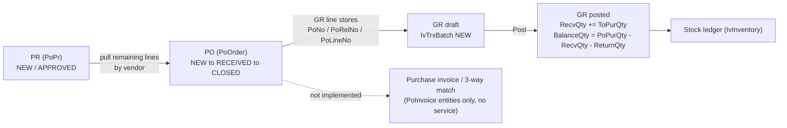

# Procurement Plan — PR / PO / GR

Status: **Draft for review**
Scope: Purchase Requisition (`POPR`), Purchase Order (`POOrder`), Goods Receipt (`IvTrxBatch` GR/NG).
Goal: record the current business logic, close the gaps, and define the target procurement cycle.

---

## 1. Why this plan exists

The PR → PO → GR chain is already implemented and largely sound, but:

- there is no document after GR (no purchase invoice / 3-way match),
- returns to vendor do not write back to the PO,
- tolerance over-receipt can drive `BalanceQty` negative,
- several statuses exist in code and UI but are never written,
- PR has no user-visible "ordered" state.

This plan fixes those without inventing a new stack. It follows the conventions already
used in this repo (service-owned status writers, RowVersion + transaction locks,
derived quantities, `PoPrCalc` / `PoOrderCalc` rounding).

---

## 2. Current state snapshot

| Concern | File |
|---|---|
| PR service | `ErpWeb.Core/Purchase/PoPrService.cs` |
| PR entities | `ErpWeb.Model/Entities/Purchase/PoPr.cs`, `PoPrDetail.cs` |
| PR status/calc | `ErpWeb.Core/Purchase/PoPrCalc.cs` |
| PO service | `ErpWeb.Core/Purchase/PoOrderService.cs` |
| PO entities | `ErpWeb.Model/Entities/Purchase/PoOrder.cs`, `PoOrderDetail.cs` |
| PO status policy | `ErpWeb.Core/Purchase/PoStatusPolicy.cs` |
| PO calc | `ErpWeb.Core/Purchase/PoOrderCalc.cs` |
| GR service | `ErpWeb.Core/Inventory/IvGoodsReceiptService.cs` |
| GR posting | `ErpWeb.Core/Inventory/IvInventoryPostingService.cs` |
| Prior design notes | `plans/po-logic.md`, `plans/popr_plan.md`, `plans/po-master-entry.md` |

### Document identity

| Document | Key | Line link fields |
|---|---|---|
| PR | `CompanyCode` + `BranchCode` + `PrNo` | `PoPrDetail.Line` |
| PO | `CompanyCode` + `BranchCode` + `PoNo` + `PoRelNo` (revision) | `PoOrderDetail.Line`, `PrNo`/`PrLineNo` |
| GR | `CompanyCode` + `BranchCode` + `BatchNo` | `IvTrxBatchDetail.PoNo`/`PoRelNo`/`PoLineNo` |

---

## 3. Current flow (verified)



### 3.1 PR → PO conversion

Conversion is **pull-based from the PO screen**. Consumption is **derived, never stored**.

1. `PoOrderService.SearchPrForPoAsync` — returns PR headers with `Status IN (NEW, APPROVED)`.
2. `PoOrderService.GetPrRemainingLinesAsync` → `BuildPrRemainingLinesAsync`:
   - filters PR lines by the PO vendor (`VendCode`),
   - `RemainingQty = PoPrDetail.PurchaseQty - LivePoConsumedForPrAsync(...)`.
3. `LivePoConsumedForPrAsync` sums `PoOrderDetail.PoPurQty` across **all non-CANCELLED PO revisions**
   for the same `PrNo` + `PrLineNo`.
4. `SaveNewAsync` / `SaveExistingAsync`:
   - `LockConsumptionAsync` locks PR header + detail rows,
   - `ValidateAndApplyPrConsumptionAsync` rejects when requested qty > remaining,
   - `StampPrConsumptionAsync` sets `PoPrDetail.PoNo` only when the line is **fully consumed**,
   - `RecalculatePrHeaderStampsAsync` sets header `PoPr.PoNo` only when **all** lines are consumed.
5. `ReviseAsync` cancels the old revision (its consumption disappears) and re-stamps old + new PR keys.
6. `CopyAsync` clears the PR link (`resetPrAndReceive: true`) and zeroes received qty — no double consumption.
7. `DeleteAsync` re-stamps PR keys after the PO is removed.

### 3.2 PO → GR

- GR requires a PO on every line (`ValidateLineAsync` rejects a line without PO identity).
- Draft save (`IvGoodsReceiptService.SaveNewAsync`) writes the batch as `NEW` and does **not** touch the PO.
- Post (`PostAsync` → `IvInventoryPostingService`) validates then calls `ApplyGoodsReceiptPoQtyAsync`:
  - latest `PoRelNo` only,
  - `PoStatusPolicy.IsGrPickable` (`NEW` / `OPEN` / `RECEIVED`) and not force-closed,
  - `OneTime` flag must match receipt type (`GR` stock vs `NG` indirect),
  - tolerance `AllowedRecvQty = PoPurQty * (1 + tolerance / 100)`, tolerance from `PoVendorByItems.Tolerance`,
  - `RecvQty += ToPurQty`, `BalanceQty = PoPurQty - RecvQty - ReturnQty`, `RecvDate`,
  - header status recomputed via `PoStatusPolicy.CalculateOperationalStatus`.
- Rollback reverses with `sign = -1` and rejects rolling back more than received.

### 3.3 PO status machine (current)

`PoStatusPolicy` is the sole writer of `PoOrder.Status`.

```
NEW --any RecvQty>0--> RECEIVED --all non-service BalanceQty<=0--> CLOSED
  ^                                                                  |
  +---------------- Reopen (only if BalanceQty>0) -------------------+
CANCELLED (blocked if any RecvQty>0)
CLOSED with BalanceQty>0 = FORCE CLOSED (blocks GR; reopenable)
```

---

## 4. What is already correct — keep these invariants

- **PR is demand, not commitment.** Save writes header / lines / attachments only. No stock, no GL, no `IvBalance`.
- **Derived PR consumption.** Remaining qty is computed from live PO lines; no double-count possible.
- **Single status writer.** `PoStatusPolicy` owns PO status; `PoPrService` owns PR status writes.
- **RowVersion + lock-before-mutate** for both PR and PO; numbering allocated inside the same SQL transaction.
- **Revision-aware receipts.** GR can only post against the latest `PoRelNo`.
- **Signed post / rollback** for GR with a "cannot roll back more than received" guard.
- **Delivery guards.** PO delete/cancel blocked after receipt; supplier change blocked after receipt; revise only from `NEW` with a required reason.
- **`PoPrCalc` / `PoOrderCalc`** own all rounding (`AwayFromZero`, pack 0 → 1, tax per line then sum).

---

## 5. Findings — gaps and risks

| # | Severity | Finding | Evidence |
|---|---|---|---|
| 1 | High | Tolerance over-receipt can make `BalanceQty` negative. GR posting does not run `PoOrderCalc.ValidateQtyInvariants`. | `IvInventoryPostingService.ApplyGoodsReceiptPoQtyAsync`; `PoOrderCalc.AllowedRecvQty` |
| 2 | High | No purchase invoice / 3-way match. PR→PO→GR ends at stock; finance cycle is missing. | `PoInvoice` / `PoInvoiceDetail` entities only; no service |
| 3 | High | Return-to-vendor does not update the PO. `ApplyReturnQtyAsync` has no caller. | `IPoOrderService.ApplyReturnQtyAsync`, `PoOrderService.ApplyReturnQtyAsync` |
| 4 | Medium | `PENDING` / `CHECKED` PO statuses are never written but appear in the list filter. | `PoOrderStatuses`, `PoOrderList.razor.cs` filter options, `PoStatusPolicy.IsViewOnlyLeftover` |
| 5 | Medium | PR has no user-visible ordered state; status stays `NEW`/`APPROVED`. | `PoPrStatuses`; `PoPr.PoNo` stamp only |
| 6 | Medium | No soft reservation between GR draft and post; two drafts can target the same balance. | `IvGoodsReceiptService.SearchPoLinesAsync` reads `BalanceQty` only |
| 7 | Low | `OPEN` is still GR-pickable. Harmless while nothing writes `OPEN`, but a legacy row could be received mid-edit. | `PoStatusPolicy.IsGrPickable` |
| 8 | Low | No close / reopen reason or audit on PO (PR cancel does capture a reason). | `PoStatusPolicy.ForceClose` / `Reopen`; `IPoPrService.PoPrCancelRequest` |
| 9 | Low | Service / non-stock lines never auto-close a PO, so service-only POs must be force-closed deliberately and reported. | `PoOrderCalc.HasRemainingBalance`, `PoStatusPolicy.CalculateOperationalStatusSkippingForceClose` |

---

## 6. Target design

### 6.1 Document roles

| Document | Nature | Writes stock / GL | Key rule |
|---|---|---|---|
| PR | Internal demand | No | Never commit; approval-gated; multiple vendors allowed per PR |
| PO | External commitment | No (allocates only) | One vendor + one currency per PO; revisions controlled |
| GR | Receipt / transfer of custody | Yes (stock ledger) | Latest PO revision only; tolerance-bounded |
| Invoice | Financial obligation | Yes (AP / GL) | 3-way match against PO + GR |

### 6.2 Target status machines

- **PR:** `DRAFT → SUBMITTED → APPROVED → PARTIALLY_ORDERED → FULLY_ORDERED → CLOSED`, plus `REJECTED`, `CANCELLED`.
  Persist a cached status for filtering; keep remaining qty derived.
- **PO:** `DRAFT → PENDING → APPROVED/OPEN → PARTIALLY_RECEIVED → FULLY_RECEIVED → CLOSED`, plus
  `CLOSED (force_closed, reason)` and `CANCELLED`. `PoStatusPolicy` remains the only writer.
- **GR:** `DRAFT → POSTED → REVERSED`. Posted is immutable; corrections only via reversal.

### 6.3 Quantity model

Per PO line persist and expose:

- `OrderedQty` = `PoPurQty`
- `ReceivedQty` = `RecvQty`
- `ReturnedQty` = `ReturnQty`
- `InvoicedQty` (new — for 3-way match)
- `OverRecvQty` (new — over-delivery inside tolerance, flagged for AP)
- `BalanceQty = OrderedQty - ReceivedQty - ReturnedQty` **clamped at 0**

### 6.4 Control rules to add

1. **Segregation of duties** — requester ≠ approver ≠ receiver ≠ invoice approver, enforced by permission.
2. **Approval matrix** — PR by amount / department; PO by amount (`PurOrderApprAmt`).
3. **No edit after commitment** — after a posted GR, PO qty may only increase via adjustment or a revision.
4. **3-way match with tolerances** — qty tolerance (vendor-item) and price tolerance at invoice.
5. **Audit trail** — every status transition records user, timestamp, and reason.

---

## 7. Implementation phases

### Phase 1 — Quantity integrity (no schema break beyond additive columns)

- [ ] Add `OverRecvQty` (and `InvoicedQty` if Phase 3 starts in parallel) to `PoOrderDetail`.
- [ ] Change `PoOrderCalc.ComputeBalance` to clamp at 0, and record the excess in `OverRecvQty`.
- [ ] Call `PoOrderCalc.ValidateQtyInvariants` from the GR posting path (or a GR-specific equivalent).
- [ ] Add tests: receive within tolerance, at tolerance, over tolerance; assert `BalanceQty >= 0` and `OverRecvQty` populated.

### Phase 2 — Returns close the loop

- [ ] Decide the return-to-vendor document (existing `IvStockReturn` is customer return `CR`; a vendor return type is needed).
- [ ] Wire `IPoOrderService.ApplyReturnQtyAsync` from the return-to-vendor posting path, inside the same transaction.
- [ ] Recompute PO status after a return (a fully-returned line can reopen the PO).
- [ ] Remove `ApplyReturnQtyAsync` if returns stay out of scope — do not leave an unreachable API.
- [ ] Tests: return posts → `ReturnQty` and `BalanceQty` updated; status transitions; over-return rejected.

### Phase 3 — Purchase invoice and 3-way match

- [ ] Add `IPoInvoiceService` (or a dedicated invoice service) over the existing `PoInvoice` / `PoInvoiceDetail` entities.
- [ ] Line link to `PoNo` / `PoRelNo` / `PoLineNo`, and aggregate against posted GR qty.
- [ ] Enforce qty and price tolerances; write `InvoicedQty` back to the PO line.
- [ ] Mark the PO financially closed only when ordered = received = invoiced (within tolerance).
- [ ] Tests: match pass, qty over, price over, duplicate invoice, invoice before GR.

### Phase 4 — Status honesty

- [ ] Implement PR derived status (`PARTIALLY_ORDERED` / `FULLY_ORDERED`) computed from live PO consumption.
- [ ] Either implement the PO approval transitions (`PENDING` / `CHECKED`) or remove them from the list filter and enum.
- [ ] Remove `OPEN` from `PoStatusPolicy.IsGrPickable` once legacy rows are cleaned.
- [ ] Add `CloseReason` + `ClosedBy` / `ClosedOn` to PO; require a reason on force-close.

### Phase 5 — Draft reservation and UX

- [ ] Subtract unposted GR draft qty in `SearchPoLinesAsync` so the picker shows true availability.
- [ ] Show over-receipt and partially-invoiced indicators on the PO line grid.
- [ ] Show PR remaining qty and ordered/remaining status on the PR list.

---

## 8. Required tests (beyond existing suites)

- `PoOrderCalc`: balance clamp, over-receipt accounting, invariants on tolerance boundary.
- GR posting: negative-balance regression; rollback after over-receipt; double-post guard.
- Returns: PO write-back, over-return rejection, status recompute.
- Invoice: 3-way match qty/price tolerance matrix.
- PR: derived status across partial, multi-PO, and revision scenarios.
- Concurrency: extend `PoOrderSqlServerConcurrencyTests` / `PoPrSqlServerConcurrencyTests` for the new write-backs.

---

## 9. Procurement policy recommendations

- **PR:** catalog-first, single-vendor consolidation, required ETA and cost center / project.
- **One PO = one vendor, one currency, one payment term.** Split a multi-vendor PR into multiple POs (the pull already filters by vendor — make it explicit in the UI).
- **Revisions, not edits, after the vendor is notified.** Keep the revision history visible.
- **Blanket / contract POs** for recurring buys, released by call-off POs — natural extension of `Revise` / `Copy`.
- **Receipt discipline:** tolerance-bounded delivery, partial receipts allowed, returns always posted against the PO.
- **Three-way match before payment**, then post to AP / GL and cost the receipt.
- **Never delete a committed document** — cancel with a reason.

---

## 10. Out of scope

- RFQ / quotation sourcing.
- Supplier portal / EDI.
- Multi-company intercompany procurement.
- Changing the `IvTrxBatch` GR / NG pattern or the shared inventory posting service.

---

## 11. Open questions

1. Which module owns vendor returns — Inventory (`IvStockReturn`) or Purchasing?
2. Is the purchase invoice `PoInvoice` (credit / debit note) or a new AP invoice document?
3. Should PR approval be implemented in this phase, or does it stay external?
4. Keep legacy `OPEN` support for GR picking, or clean the data and drop it?
