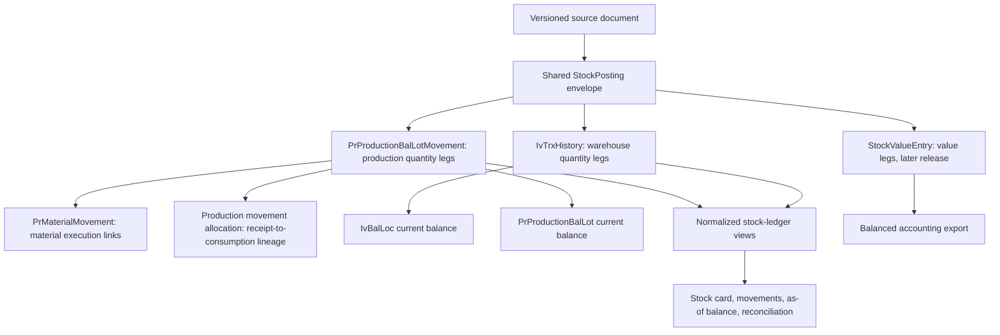

**Production stock ledger implementation plan — net10projectTemplate**

Prepared 3 October 2026, Asia/Kuala_Lumpur. Repository: `mokth/net10projectTemplate`. Reviewed branch: **`production`**. Pinned baseline: **`23e56d7106f645f59a93b87851d04a67d5bccbf6`** (`checked in`, 3 October 2026). This supersedes the earlier assessment against `9830321`: the reviewed version includes process-to-process WIP handoff.

This document specifies proposed implementation work. It does not claim that the changes are implemented or that the deployed database has been verified. The review inspected source, EF mappings, SQL scripts and tests through GitHub. The execution environment could not clone through its network proxy; relevant files were retrieved through the connected GitHub API instead. No application tests or live database checks were run for this planning task.

**1. The recommended result is a permanent production quantity ledger, followed by a connected value subledger.**

Extend `dbo.PrProductionBalLotMovement` as the production quantity history. Keep `dbo.PrProductionBalLot` as the transactionally maintained operational balance. Keep `dbo.PrMaterialMovement` for material execution and genealogy. Add a read-only `dbo.vw_PrTrxHistory` reporting projection over the production ledger; do not introduce a second independently written production quantity-history table.

Add a shared stock-posting envelope for permanent posting identity across Inventory and Production. Extend the existing inventory history to preserve reversals. The shared envelope holds no duplicate stock quantities; its purpose is to connect the legs of one atomic event, preserve the posted document version, and provide idempotency and report ordering.

The first useful release is: reliable posting/reversal, reconciled opening balances, production stock card, movement inquiry and stock as of a date. Production returns, physical movements and stock take follow on that foundation. Complete value accounting and warehouse FG receipt follow once the cost-transfer contract is implemented. Do not expose zero-cost WIP as a completed valuation feature.

The quality target is an implementable contract with measurable acceptance gates, rather than a self-assigned score. Completion requires every applicable gate in sections 17–19 to pass on SQL Server and a representative restored database.

**2. The current branch provides useful foundations, with specific correctness gaps.**

Source references `[S01]`–`[S20]` at the end point to the reviewed commit. Findings below are code observations or code-path risks; their incidence in deployed data has not been measured.

| ID | Current behavior and consequence | Required implementation response |
|---|---|---|
| F01 | `ProductionBalLot` explicitly treats quantity as authoritative and movements as audit. Movements lack their own complete stock-dimension snapshot. [S01, S02] | Make complete sealed movement history the reconstruction authority; retain live balances for availability and enforce equality. |
| F02 | Inventory rollback calls `RemoveHistory`; the repository deletes `IvTrxHistory`. Its unique company/branch/batch/line key permits only one retained generation. [S03, S04] | Introduce posting generations, append reversal history, and update every reader/writer that assumes one generation. |
| F03 | Production material-issue rollback changes the original `PostingLinkId`, clears `InventoryHistoryId`, reopens the same workflow link, and omits `OriginalMovementId` on the balance-lot reversal. Material reversal uses `now`; its balance movement uses the original date. [S05] | Preserve original facts, give every committed event a permanent posting ID, link reversals precisely, and apply one effective-date rule. |
| F04 | Issue rollback loads movements whose `OriginalMovementId` points directly to the issue. A consume reversal points to the consume, so this query does not supply the helper with that second-level reversal. [S05, S06] | Load complete dependency relationships; add a persisted service test for issue → consume → reverse consume → reverse issue. |
| F05 | Output builds all consumption allocations before reducing any lot. Two material demands that resolve to the same WIP lot can each see the same available quantity. `takeQty` uses the consuming material conversion but is subtracted from the lot's display quantity. [S07] | Allocate against one shared base-quantity budget per lot, then derive each balance's display quantity using that balance's frozen conversion. |
| F06 | Output recomputes `ConsumedQty` using a database query while some new material facts may still be pending; later `SaveChanges` calls depend on the posting path. Rollback also adds all pending reversals to database totals even when earlier iterations may already have flushed some of them. [S07, S08] | Flush all movement facts once before aggregate queries, or calculate projections from one explicit complete fact set. Do not mix persisted facts with an unfiltered pending list. |
| F07 | Same-route process handoff now stages `OP:{operationId}` WIP, consumes it in the next process, and has service tests. It intentionally writes balance movements without synthetic material facts. [S09] | Include handoff movements in ledger/reporting and preserve their distinction from BOM material consumption. |
| F08 | WIP, handoff and FG-staging output currently carry zero cost. Handoff consumption writes zero cost. FG warehouse receipt remains deferred. [S07, S10] | Mark valuation incomplete; implement value propagation and test it before releasing valued FG receipts. |
| F09 | Output posting/rollback does not use `IvPeriodCloseGuard`; material issue does. Reversals use original production dates. [S05, S07, S08, S11] | Use one stock-period authority and a shared posting/close lock for both modules. |
| F10 | Production balance inquiry exposes current lots and per-lot movements, without a complete dated stock-card contract. The existing effective-movement helper collapses reversal pairs. [S06, S12] | Build chronological reporting over all committed signed entries. Reserve dependency logic for operational checks. |
| F11 | Production lot uniqueness does not include physical production location or disposition. MATERIAL_IN warehouse/location currently represent inventory-origin information; WIP rows can have empty location fields. [S01, S13] | Introduce explicit production location, balance stage and disposition without reinterpreting source warehouse fields. |
| F12 | Inventory stock take intentionally computes `physical − live at post`, flags stale lines, and permits posting after intervening movements. [S14] | Use an enforced movement freeze for the initial production-count release. |
| F13 | The opening SQL groups consume reversals by their direct `OriginalMovementID`, then joins that key to the issue. Actual consume reversals point to the consume. It also seeds remaining quantity as an ISSUE. [S15] | Replace the migration path with an explicit opening event and correct multi-level lineage reconstruction. |
| F14 | Inventory close values quantities using a resolved pile/master price; it is not a perpetual transaction-value journal. Reopen deletes derived snapshot rows. [S16] | Keep existing values labeled as estimates; add immutable versioned close snapshots and a value journal for accounting-grade results. |
| F15 | The SQL Server handoff test returns early when its scratch connection is unavailable; its two posts are sequential. [S17] | Required SQL Server integration jobs must report execution and fail if unavailable. Add genuinely concurrent tasks/connections. |
| F16 | Sales invoice posting/rollback calls the inventory in-transaction APIs. Changing only Production or the public inventory posting methods would leave a bypass. [S18] | Update outer transaction owners and all in-transaction callers together. |

Preserve the existing work-order snapshots, tenant/access checks, rowversion checks, explicit database transactions, and process-handoff UOM/final-operation validation. A ledger change is not a reason to redesign scheduling, BOM authoring or the whole ERP.

**3. Adopt these business decisions as the implementation baseline.**

| Decision | Baseline contract |
|---|---|
| Quantity authority | The active ledger epoch's opening plus sealed quantity movements reconstructs balances. Live balances are maintained in the same transaction. |
| Historical coverage | Exact new-ledger reporting begins at a documented cutover instant. Earlier surviving records remain available as legacy history with a coverage warning. |
| Entry signs | Store positive quantity magnitudes and an explicit movement code/direction. Derive signed base quantity centrally. |
| Quantity precision | Preserve `decimal(18,4)` and `IvQty.Round` (AwayFromZero). Freeze UOM conversion at `decimal(18,8)`; use higher precision for intermediate arithmetic. |
| Negative stock | Reject negative production or inventory physical balances. Never hide a discrepancy with `Math.Max(balance, 0)`. |
| Reversal | Full reversal of a posting in the first release. Partial returns/receipts are new business documents, not partial reversals. No reversal-of-reversal command; recreate/correct the source document and post a new generation. |
| Dates | Business-effective `datetime2` uses the configured branch business timezone; `PostedAtUtc` uses UTC. Derive business date/period server-side. Do not infer branch timezone from the server clock or this chat. |
| Backdating | Reject an effective instant earlier than the latest sealed stock event affecting any touched balance. Equal instants are ordered by branch posting sequence and line sequence. Administrative historical restatement is deferred. |
| Reversal date | A user-selected effective date in an open period, defaulting to the current business instant; never automatically reuse the original date. Apply the same no-backdating rule to affected slices. |
| Costing release | Quantity reports may be released first. Unknown valuation is shown as `UNVALUED`, not zero. No GL export or valued FG receipt while required costs are unresolved. |
| Production ownership | Each production balance belongs to a work order and stage. Cross-work-order reassignment and cross-company/branch transfer are deferred; reject those commands explicitly. |
| Count policy | Persistent freeze of a defined production location or whole branch during counting. No long-running database transaction across human counting. |
| Handoff | Preserve current sequential same-route handoff and compatible-UOM restrictions. Parallel splits/merges, non-100% yield and backflush remain blocked until separately specified. |
| Disposition | AVAILABLE, HOLD, REJECT and RECOVERABLE_SCRAP are separate physical stock states. DESTROYED_SCRAP is a loss event, not available stock. |
| Permissions | Authorize by tenant, branch, work order and action on every read/write/export. Financial values require a separate permission. |

These are proposed defaults, not claims about existing plant policy. Confirm the branch timezone, location mapping, lot-control requirements, valuation/currency policy and count approver roles during the database preflight. Schema and source work can proceed with the contracts above; activation depends on the mappings being complete.

**4. Keep the quantity and value responsibilities explicit.**



Only the quantity ledgers contribute to stock totals. `PrMaterialMovement`, source documents, output counters and audit events supply context and cross-checks; they are not additional stock legs. A handoff consume without a material fact remains a legitimate stock movement.

There are two different conservation rules. A warehouse-to-production transfer of the same item has equal base quantity out/in. Manufacturing can consume different items/UOMs from the output, so its quantities are not summed into a fictitious balanced journal. Its monetary costs balance across inventory, WIP, FG and expense/variance accounts.

**5. Introduce an additive schema with permanent posting identities.**

Use existing naming/tenant lengths from EF configuration. Names below are the proposed physical tables; corresponding entities live under `ErpWeb.Model/Entities/StockLedger` or the existing Production/Inventory folders. Use `bigint` keys for new high-volume tables, restrictive foreign-key deletion and `datetime2(7)` timestamps. Do not rename or drop existing ledger tables during rollout.

**The new `StockLedgerEpoch` and `StockPosting` tables define provenance and posting identity.**

| Table/field | Type and rule |
|---|---|
| `StockLedgerEpoch` | `Id bigint`, company/branch, `EffectiveFrom datetime2`, cutover posting sequence, version, status PREPARED/ACTIVE/RETIRED, migration batch ID, reconciliation manifest hash, activated timestamp/user. At most one ACTIVE epoch per branch. |
| `StockPosting.Id` | `bigint identity`; permanent journal reference. |
| Tenant and epoch | `CompanyCode nvarchar(5)`, `BranchCode nvarchar(5)`, `LedgerEpochId bigint`, required. Composite FK/validation prevents cross-tenant references. |
| Ordering | `PostingSequence bigint`, unique within company/branch; allocate under the branch stock-write lock from a transactionally updated counter. |
| Idempotency | `RequestId uniqueidentifier`, `CommandType nvarchar(40)`, `RequestFingerprint char(64)`; unique `(CompanyCode, BranchCode, CommandType, RequestId)`. |
| Source identity | `SourceModule`, `SourceDocumentType`, `SourceDocumentId nvarchar(64)`, `SourceDocumentNo nvarchar(50)`, `DocumentRevision int`. Source IDs are stable identifiers; document numbers are display values. |
| Source evidence | Canonical `SourceSnapshotJson nvarchar(max)`, `SourceSnapshotHash char(64)`, schema version. Preserve lines, stock identities, UOMs, WO snapshot revision/hash and operational quantities. |
| Dates | `EffectiveAt datetime2(7)`, `BusinessDate date`, `PeriodKey char(7)`, `PostedAtUtc datetime2(7)`, `PostedBy` using the actual principal ID length rather than truncating to 10 characters. |
| Relationships | `ProductionPostingLinkId bigint null` as a workflow link; `ReversesPostingId bigint null`; `ReasonCode`, reason text. |
| Seal | `SealedAtUtc datetime2 null` while constructing in the database transaction; non-null before commit. No unsealed successful posting may be committed. |

Successful replay returns the original result if the request fingerprint matches. Reusing a request ID with different semantic input returns `REQUEST_ID_REUSED`. A second request ID against an already posted document revision returns `DOCUMENT_ALREADY_POSTED`; it must not create another stock event. Add a unique source-document/revision/posting-role key, and a filtered unique `ReversesPostingId` for full reversals.

Preserve `PrProductionPostingLink` as the existing workflow record. Its status may change as a document is corrected, but ledger queries and idempotency no longer depend on its current status. Add `CurrentStockPostingId`/revision to source workflow records. Keep the original material movement's link unchanged. The new shared envelope distinguishes permanent events without requiring duplicate quantity journals.

Inventory/IP correction needs versioned detail identities, not only a revision number on the header. Add DocumentRevision to `IvTrxBatchDetail` and the production issue-line mappings; use `(BatchId, DocumentRevision, TrxLineNo)` as the detail business key. Every draft/read/post query selects the active revision explicitly. Once a detail ID has appeared in a sealed snapshot, it is retained unchanged: correction copies it into new detail IDs under the next revision. Old material movement FKs therefore remain meaningful and restrictive deletion stays valid. Daily Production can preserve its existing new-draft-after-reversal flow, with a new source ID and a link to the corrected document. Draft revisions that have never been sealed may still be edited normally.

An outer invoice/IP document and its inventory batch share one envelope. Include both source-document versions in the frozen snapshot and set both current-posting pointers atomically. Do not create a second StockPosting when the nested inventory adapter runs. Its document-state checks still prevent a secondary batch from being independently posted again.

Sealing permits existing multi-step insertion of cyclic references inside one transaction (issue fact → production lot → balance movement → issue lineage). Database guards must reject UPDATE/DELETE of sealed facts, changes that unseal a posting, or insertion of further lines into a sealed posting. The same rule covers direct SQL, not only EF. App runtime credentials do not receive schema-altering or trigger-disabling privileges. Transaction failures roll the entire unsealed envelope back; failed attempts go to operational logs, not committed stock history.

**Extend `PrProductionBalLotMovement` rather than copying it.**

Add the following, nullable for untouched V1 rows and required by conditional constraints for V2 rows:

| Group | Columns/contract |
|---|---|
| Journal | `LedgerVersion tinyint`, `LedgerEpochId`, `StockPostingId`, `PostingLineNo int`; unique `(StockPostingId, PostingLineNo)`. |
| Frozen stock identity | Company/branch, item code/description, `BalanceStage`, production location ID/code, work-centre/process code, lot/pool identity, `PhysicalLotNo` when known, stock disposition, work-order number. Existing WO/operation/route IDs remain. |
| Frozen UOM | Existing Qty/Uom/BaseQty/BaseUom plus `ConversionFactorToBase decimal(18,8)`. Qty is the document quantity; the balance's display Qty is derived in its own UOM. |
| Direction | Expanded controlled movement codes; one centralized signed-base-quantity expression used by SQL views and C# tests. Increase `MovementType` width to 32. |
| Relationships | Existing `OriginalMovementId` is required for V2 reversals and points to the exact balance movement; `MovementGroupId uniqueidentifier` pairs transfer/status legs; source line and split ordinal; inventory-history reference where relevant. |
| Cost evidence | Preserve existing frozen cost fields. Add `ValuationStatus` NONE/UNVALUED/PROVISIONAL/FINAL and `CostBasisVersion`. Actual recognized value is later read from value entries, so finalization does not overwrite quantity history. |

Add indexes `(CompanyCode, BranchCode, LedgerEpochId, ItemCode, MovementDate, StockPostingId, PostingLineNo)` and `(ProductionBalLotId, LedgerEpochId, MovementDate, StockPostingId, PostingLineNo)`, with useful report columns included after measuring plans. Add a filtered unique index on reversal `OriginalMovementId` for V2 full reversals. Enforce non-self reversal, positive quantity, known movement type and valid conversion. The writer additionally validates same tenant/item/base UOM and exact original quantity for reversal.

Add a branch-inclusive alternate key to `StockPosting`; use composite FKs from V2 stock facts so a caller cannot attach another tenant's posting ID. Referenced balance/work-order identities must also be verified under that branch in the writer. Test forged numeric IDs explicitly.

**Extend production balances with actual stock dimensions.**

Keep `Kind = MATERIAL_IN | WIP` for compatibility. Add `BalanceStage = MATERIAL | PROCESS_WIP | ROUTE_WIP | FG_STAGING`; its allowed relationship to Kind is checked. Add `ProductionLocationId`, `StockStatusCode`, `PoolCode`, `PhysicalLotNo`, `LotIdentityKind`, `FirstReceiptEffectiveAt`, `LastStockEventEffectiveAt`, and `ContributionKey uniqueidentifier` for material contributions. Keep the old warehouse/location fields as origin information until all old consumers are migrated.

Introduce `PrProductionLocation` with company/branch, unique code, description, optional work centre, active flag. It is separate from warehouse inventory: a unit cannot be owned simultaneously by `IvBalLoc` and a production location.

Replace uniqueness only after validated dimension backfill:

| Balance category | V2 unique identity within company/branch |
|---|---|
| MATERIAL_IN | Work order, work-order material, contribution key, production location, disposition. One issued contribution can be split across locations without losing origin. |
| PROCESS_WIP | Work order, producing operation, item, pool/physical-lot identity, production location, disposition. |
| ROUTE_WIP / FG_STAGING | Work order, producing route step, balance stage, item, physical-lot identity, production location, disposition. |

Use separate filtered indexes and required-field checks for these categories. Never rely on a nullable-column natural key without explicit null semantics. The existing `OP:{operationId}` value becomes an operation-pool identity, not a claim of a physical manufacturing batch. Existing handoff pools may remain pooled; a lot-controlled product requires a verified physical-lot mapping before lot-specific reporting or counting is enabled.

Add `OriginType = ISSUE | OUTPUT | OPENING | COUNT_GAIN`. A count gain receives its own contribution key and must not impersonate an issue. Work-order/material or work-order/operation ownership must be resolved before posting it. Unknown physical stock can be recorded on a count sheet but blocks approval until ownership is established.

**Add explicit contribution allocation for consumption and reversal safety.**

Create `PrProductionMovementAllocation(Id, StockPostingId, ReceiptMovementId, OutboundMovementId, BaseQty, ReversesAllocationId, CreatedAtUtc)`. A normal allocation consumes part of an inbound production-ledger contribution. An allocation reversal restores exactly that part and references the original allocation. Require positive BaseQty, same stock item/base UOM/tenant, unique normal receipt/outbound pair and unique full reversal per allocation. Receipt and outbound IDs reference `PrProductionBalLotMovement`.

Allocate FIFO by immutable inbound effective date, posting sequence, line sequence and ID. Do not order by mutable `LastMovementDate`. A transfer consumes source contributions and creates destination contributions connected by the movement group. The output posting connects its consumed inputs and produced outputs; quantities across different items do not become contribution allocations.

For V2 inbound reversal, any unreversed outgoing allocation blocks the reversal, even if unrelated later receipts made the pooled balance sufficient. This deliberately replaces aggregate prefix-only permissiveness with exact contribution provenance. Reverse dependent documents first or create a new return/adjustment transaction. Open V1 allocations are established from verified cutover evidence; uncertain lineage is not guessed.

Only original inbound events create new available contributions. An outbound reversal restores availability to the original receipt contributions by reversing their allocations; its positive quantity leg does not create a second independently allocatable receipt. For each original receipt: `AvailableBaseQty = ReceiptBaseQty − ReversedReceiptBaseQty − NormalAllocatedBaseQty + ReversedAllocatedBaseQty`. The sum of available contributions must equal the balance's current BaseQty. Exclude reversal rows from the set of new receipt contributions, even though they remain visible in the stock ledger.

**Extend `PrMaterialMovement` as execution evidence.**

Add StockPostingId, source line/split identity, SourceIssueMovementId and ReversesMaterialMovementId. V2 consumption origin and reversal origin are separate relationships; keep the overloaded existing OriginalMovementId for legacy compatibility. Replace V2 uniqueness based on the reused workflow link with `(StockPostingId, SourceLineId, SplitOrdinal, MovementType)`. Preserve old indexes only as filtered legacy constraints where necessary.

Issued, returned, consumed and adjusted totals must each have defined sign rules. Count gains/losses are adjustment facts, not fabricated issued/consumed quantities. Add `AdjustedInQty`/`AdjustedOutQty` projections where needed; transfer within the same work-order ownership changes location, not total issued or consumed.

**Extend `IvTrxHistory` in the same release as the shared writer.**

Add LedgerVersion, LedgerEpochId, StockPostingId, PostingLineNo, DocumentRevision, EntryRole and ReversesHistoryId. The old batch/line unique index becomes filtered to legacy rows; V2 uniqueness is `(StockPostingId, PostingLineNo)`. Reversals retain positive magnitudes but swap FROM and TO quantities, UOMs, balance IDs, lot IDs and location snapshots. A stock-out reversal is therefore an inbound leg. Do not also negate it in reports.

Keep the original TrxType and expose EntryRole separately. Scope history loading and duplicate checks by the current permanent posting ID/revision, not all rows having the batch number. `HistoryExistsForBatchAsync`, `LoadHistoryForBatchAsync`, original-history counting in issue posting, reconciliation and every rollback core require corresponding changes. Non-stock NG events carry document evidence but no physical-stock legs.

**6. Use one atomic posting protocol for every stock writer.**

Introduce `StockPostingCoordinator`, `StockPeriodGuard`, `StockFreezeGuard`, `ProductionStockWriter` and an inventory posting adapter. The coordinator owns the outer transaction, shared branch lock, idempotency and seal. Writers accept that same DbContext/transaction; they never commit independently. Retain the present useful in-transaction inventory API shape, adding a required posting context.

For the first release use a short SQL Server `sp_getapplock` with `LockOwner = Transaction`, Exclusive, resource derived from the verified company/branch. All stock-changing transactions, freeze activation and close/reopen acquire it before document or balance locks. This serializes writes within a branch and gives a simple correctness boundary appropriate for the initial SME release. It is not held during editing, report rendering or physical counting. A timeout returns a retryable STOCK_BUSY error. Partitioned locking is a later optimization only after measurement and equivalent race tests.

The required algorithm is:

```text
Authorize actor and resolve company/branch from trusted context.
Start transaction; acquire branch stock-write application lock.
Check the permanent request ID and semantic fingerprint; return sealed replay if identical.
Lock/re-read source document and expected revision/rowversion.
Validate document state, WO snapshot, business-effective instant and open period.
Check persistent count freeze against every source and destination scope.
Lock/re-read WO, operations/materials and stock identities in deterministic order.
Resolve frozen item/UOM/status/location identities; validate no negative or unowned stock.
Build one in-memory posting plan with a shared remaining-base-quantity budget per balance.
Validate all legs, allocations, exact reversal links and cost policy before mutation.
Allocate branch sequence; insert unsealed StockPosting and frozen source snapshot.
Append inventory/production/material/allocation facts; apply balance projections.
Flush all facts, complete lineage, then recompute affected execution totals once.
Verify local quantity conservation, non-negative balances and document-to-ledger matches.
Set workflow/current-posting pointers, append audit, seal journal and commit.
Return the stored posting result; on unknown commit outcome query the same request ID.
```

All in-transaction adapters require the coordinator context and assert an active transaction. Sales invoice, inventory stock count, production issue, returns and FG receipt must not obtain a second DbContext to post stock. Database deadlock/transient retries rerun the entire command with the same request ID. Limit automatic retries and distinguish validation failure from concurrency failure. Cancelled/failed commands leave no balances, counters or journal fragments committed.

Resolve a default effective date when saving/confirming the command, then reuse that saved value on retries. The fingerprint includes semantic quantities, dimensions, source revision, resolved effective instant and reversal target. It excludes regenerated server timestamps and incidental JSON property order. Check authorization before replay; replay must not disclose another actor's unauthorized document.

Existing inventory forms often provide only a document date. Add a saved effective-instant value to their posting preview instead of silently treating every movement as midnight. For a current-business-date document the default is the current branch-local instant; for a historical document require an explicit effective time and validate it against existing events. The effective business date must match the stock document date, except that a reversal is a new correction event with its own date. Preserve the original document date separately in the source snapshot. A future effective instant is rejected. This makes the new stricter chronology rule visible and prevents valid same-day work from accidentally being classified as a backdated midnight posting.

The proposed application contracts are explicit:

| Contract | Required behavior |
|---|---|
| `StockPostingCoordinator.ExecuteAsync(command, handler, ct)` | Own transaction, gate, replay, context creation, verification and sealing; handler receives the same DbContext. Command includes RequestId, source identity/revision, expected RowVersion, EffectiveAt, typed payload and reversal target if any. Tenant/actor come from trusted session context. |
| `ProductionContributionAllocator.BuildPlan(context, demands)` | Pure allocation over locked balances/contributions and one shared per-balance budget; returns exact legs/allocations or an error without mutations. |
| `ProductionStockWriter.ApplyAsync(context, plan)` | Append planned production/allocation facts and apply projections; cannot commit. |
| Inventory adapter `ApplyAsync(context, inventoryPlan)` | Use the same posting ID and revision; append normalized history and apply warehouse balances; cannot commit. |
| `ProductionStockHistoryService.GetCardAsync(query)` | Query requires item/base-UOM scope, interval, stock dimensions and optional existing watermark; result includes coverage, opening, rows, closing and returned watermark. |
| `ProductionStockCountService.Activate/Post/CancelAsync(...)` | Require expected rowversion and owner-scoped authorization; post owns the sole count-freeze exception described below. |
| `StockReconciliationService.CheckAsync(scope, watermark)` | Read-only structured findings; separate explicit RebuildProjections command is required to mutate derived data. |

Keep these as application-level interfaces. UI components submit business documents; they do not create ledger rows or choose signed quantities directly.

Within the branch lock use a documented row-lock order: source document → work order → operations/materials by ID → inventory item masters → inventory balance identities by ID/key → production identities by ID/key → contribution allocations. Transfer helpers lock both ends before mutation. Keep UI draft-save transactions outside the stock gate unless they participate in stock-numbering/identity mutations; ensure they cannot invert locks against post.

Refactor every V2 direct production quantity update into `ProductionStockWriter`. For each affected balance:

```text
NewBaseQty = OldBaseQty + sum(signed base-quantity legs)
NewQty     = Round(NewBaseQty / balance.ConversionFactorToBase, 4)
```

Validate base UOM compatibility before applying a leg. If a conversion rounds positive document quantity to zero base quantity, reject it. Assign fractional allocation residuals deterministically to the last allocation so sums equal the document's rounded base quantity. On a complete depletion consume the exact remaining recorded value, avoiding rounding leftovers. Read back and compare affected balances to posting-plan expectations before sealing.

Remove unconditional `Math.Max(..., 0)` repairs in stock/counter paths. Underflow indicates an invalid reversal, inconsistent projection or unsupported conversion; fail and expose the discrepancy. Never silently clamp it into an apparently valid balance.

**7. Complete quantity flows with explicit movement codes.**

| Command | Production movements | Inventory effects / required conditions |
|---|---|---|
| Opening | OPENING_IN (+) for each verified positive balance | Tagged cutover entry; zero balances retained in the manifest without zero-quantity movements. |
| Material issue | ISSUE (+) to MATERIAL | IP stock out; same posting ID, item, base quantity and source value. Production destination is mandatory. |
| Consume | CONSUME (−) from MATERIAL, PROCESS_WIP or ROUTE_WIP | No second inventory issue. Allocate from actual production contributions. |
| Report good output | PRODUCE (+) to PROCESS_WIP, ROUTE_WIP or FG_STAGING | No warehouse availability until a later receipt command. |
| Return unused material | RETURN (−) from MATERIAL | Add a dedicated production-return document/adapter; inventory stock in to approved destination. Never infer a return from a free-form MI/MR remark. |
| Transfer location | TRANSFER_OUT (−), TRANSFER_IN (+) | Same item/base UOM/WO/stage; same group ID and amount. Source/destination must differ. |
| Change disposition | STATUS_OUT (−), STATUS_IN (+) | Same item/owner/physical quantity; reason/authorization mandatory. HOLD/REJECT cannot be consumed as AVAILABLE. |
| Count adjustment | ADJUST_IN (+) or ADJUST_OUT (−) | Count document + line + approval; gains create explicit contributions, losses allocate existing ones. |
| Destroy stock | SCRAP_OUT (−) | Approved reason and loss value; distinct from moving recoverable scrap to a scrap location. |
| Receive FG | FG_RECEIPT_OUT (−) from FG_STAGING | FG stock in using the existing FG transaction constant through a validated new adapter; blocked until phase 6 costing is ready. |
| Reverse posting | Exact opposite movement code for every original stock leg | Same original stock dimensions, quantities and historical costs, one new open-period posting; all original rows retained. |

Define inverse codes explicitly in one registry (including OPENING correction policy). Existing ISSUE_REVERSAL/PRODUCE_REVERSAL/CONSUME_REVERSAL/RETURN_REVERSAL remain recognizable. MovementType width 32 accommodates the new codes. Generate SQL constraint/view sign mappings from, or contract-test them against, that registry.

Daily Production must treat Good/Hold/Reject/Scrap as mutually exclusive outcome quantities for a report. `ProcessedQty` consumes incoming handoff and relevant material once. Good creates AVAILABLE output. Hold and reject create physical output contributions in their respective dispositions if those pieces physically remain. Recoverable scrap creates explicitly classified stock; destroyed scrap creates an outcome/loss fact. Moving a held item to available later must not consume BOM material a second time. Add a disposition document linked to the original output, with an outcome-event projection for reporting good/hold/reject totals. Preserve originally reported quantities separately from currently accepted-good quantities.

For WIP_NONSTOCK final route output, retain operational outcome and accumulated cost without inventing available warehouse stock. It requires a defined expense/next-operation disposition before financial close. Do not silently convert it to stocked WIP. Handoff remains its already-supported sequential process-pool behavior.

Material return quantity is bounded by available unconsumed MATERIAL contributions with intact origin. It restores the source contribution's value; selecting a different warehouse location does not change the return cost. FG receipt supports partial quantity and multiple receipts; their total cannot exceed available FG staging. Shipment/receipt reversal checks must follow inventory dependencies after receipt.

**8. Make reversals auditable and date-correct.**

V2 reversals append new rows at the selected current/open effective instant. They do not delete history, change original stock dimensions/cost, or filter the original out of past reports. A document's REVERSED workflow status must not make its earlier stock effect disappear before the reversal date.

Before a full reversal, validate: original posting is sealed, same branch, not previously reversed; source-document authorization; target effective date and period are allowed; no consumed/returned/transferred/adjusted contribution depends on the inbound legs; restoring outbound legs is consistent with the original allocation and stock identity. Follow allocation edges, including handoff movements that have no material counterpart.

A whole-posting reversal can have several layers of dependency. Return all blockers with document numbers and quantities so the user can reverse later documents in dependency order. A later physical return is its own event and must not be misrepresented as undoing the historical receipt.

Keep `EffectiveMovements` only for legacy interpretation/diagnostics. Do not use it for V2 stock cards, period balances or last-event chronology. `LastStockEventEffectiveAt` includes reversal events and moves forward; optional last-unreversed-origin diagnostics use a different field/query.

For source documents reopened for correction, increment DocumentRevision and issue a new post request token. Preserve the original source snapshot and permanent posting. Deleting a NEW document is allowed only if it has never produced a sealed posting; otherwise cancellation preserves identity and history.

**9. Build stock cards from normalized legs at a stable reporting watermark.**

Create `vw_PrTrxHistory` over active-epoch sealed production movements and `vw_IvStockLedgerLeg` over active-epoch inventory history. Inventory rows yield zero, one or two legs from FROM/TO columns. A combined `vw_StockLedgerLeg` uses UNION ALL with a `LedgerArea` discriminator; it never unions `PrMaterialMovement` as stock.

Each leg exposes branch/epoch, StockPostingId/sequence/line, effective instant, posted UTC instant, source document, item/base UOM, stock dimensions, signed base quantity, reversal identity and valuation availability. Production report context includes stage, WO and process. Current master descriptions can be shown as an additional label; historical codes/UOMs/location come from frozen facts.

For a report scope and half-open interval `[From, To)`:

```text
Opening = sum(SignedBaseQty where EffectiveAt < From and PostingSequence <= watermark)
PeriodIn = sum(positive SignedBaseQty in [From, To), within watermark)
PeriodOut = sum(abs(negative SignedBaseQty) in [From, To), within watermark)
Closing = Opening + PeriodIn - PeriodOut
Running = Opening + cumulative period SignedBaseQty
```

The opening includes the one tagged epoch opening. It does not also add live balances or pre-epoch events. A report earlier than the epoch cutoff returns HISTORY_BEFORE_CUTOVER with a link to legacy inquiry. A period-close snapshot can accelerate opening only when epoch, close revision and reporting watermark are compatible.

Order by EffectiveAt, PostingSequence, PostingLineNo, ledger area/leg ordinal and movement ID. Use a SQL window function with an explicit ROWS frame, computing the running balance before pagination. Do not sort only by document number or restart the balance on each page. Date filters, item scope and stock dimensions affect opening; display filters such as document type/search text must not silently remove transactions from the true balance. Apply those after balance calculation or label the result as a filtered movement analysis.

Capture the highest sealed branch sequence under the stock gate briefly, release it, then query immutable ledger rows `<= watermark`. Reuse that watermark on every page and export. When comparing live projections, use a consistent SQL snapshot transaction or the stock gate for the short comparison; never compare balances from one point in time to journal rows from another. SQL snapshot isolation requires an explicit deployment setting and load test; the gate-based comparison is the fallback.

Support business-effective as-of balance and, where needed, a posting-watermark cutoff for what had been recorded at that time. Do not use `IvBalLoc.TransDate <= date` or `ProductionBalLot.LastMovementDate <= date` as a historical balance calculation. Existing inventory as-of selection/reconciliation callers must consume the same V2 leg rules, without negative-balance clamping.

Required UI pages are `PrStockCard`, `PrStockMovement`, `PrStockAsOf`, and `PrStockReconciliation`, under the existing Planning/Inquiry structure. Columns: effective date, posted date, document/reversal link, WO, item, stage, process/location, lot/pool, disposition, base UOM, in/out/running quantity and valuation status. Add value columns only for authorized users once value support is complete. CSV/Excel exports use identical filters, watermark and authorization. Escape spreadsheet-formula text cells.

Do not aggregate quantities of unlike items/UOMs into a misleading grand total. Provide item/base-UOM group totals; value totals can span items only within one valuation currency/book.

**10. Add production stock take with an enforceable freeze.**

Create `PrStockCountHdr`, `PrStockCountLine`, `PrStockCountAllocation`, and `StockCountFreeze`. A freeze is a committed business record, not a database transaction held open for hours.

| Object | Required information |
|---|---|
| Header | Company/branch, unique count number, state, scope, effective cutoff, sealed-posting watermark, epoch, generated/count/approved/post user and timestamps, rowversion, reason, adjustment StockPostingId. |
| Line | Physical count identity: item, base UOM, production location, stage, disposition, WO/process and physical lot or explicitly pooled lot. Frozen system base quantity, nullable counted quantity, count UOM/factor, recount version, counted user/time, variance and reason. |
| Allocation | Mapping of a physical line to underlying production balance IDs/contributions, their frozen quantities/rowversions, and eventual adjustment movements. This prevents asking a counter to identify several database issue contributions for one physical pile. |
| Freeze | Branch + production location, or whole branch; owner count ID, state ACTIVE/RELEASED, timestamps, released-by reason. Whole-branch and location freezes cannot overlap. No automatic expiry/unfreeze. |

State flow: DRAFT → FROZEN → COUNTED → APPROVED → POSTED; cancellation is allowed before POSTED with an audit and atomic freeze release. Changing any count after approval invalidates approval. A counted zero is different from null/un-counted. All generated physical lines must be counted or explicitly excluded with a recorded scope amendment before approval.

Activation acquires the shared branch gate, rejects overlapping freezes, validates no previous discrepancy, captures balance identities and sequence, creates the snapshot and freeze atomically. Posting commands check BOTH source and destination: material issue, consumption, handoff creation/consumption, output, return, transfer, status change, adjustment, FG receipt and reversal are blocked when they touch the frozen scope. Creating a new lot in that location is blocked too; checking only existing balance IDs is insufficient.

Counters enter quantities without seeing book quantities when blind counting is configured. Count gains require verified stock master, base UOM, disposition, location and WO/material or operation ownership. Do not create free-text stock items. A count variance threshold requires a separate approver; thresholds and permissions are server-side rules. Initial threshold policy: any nonzero variance requires approval, and poster cannot approve their own count unless an explicit small-company role policy permits and audits it.

At post, reacquire the gate, recheck approval/revision, active freeze, period and snapshot consistency. Under a valid freeze, physical variance is `CountedBaseQty − FrozenSystemBaseQty`. Unexpected live changes are a hard integrity failure requiring investigation, not a request to recompute against live stock. Allocate losses over frozen contributions in deterministic FIFO order; gains create COUNT_GAIN contributions. Append ADJUST movements and execute balance changes, posted count evidence and freeze release in one transaction. The zero-variance case seals a count-confirmation posting with no quantity lines and releases the freeze.

The owning count's approved adjustment is the only stock-write exception to its own freeze. The coordinator derives the owner count ID from the locked approved header; it is not a client-supplied bypass flag. Limit the exception to that count's frozen scopes and validated adjustment plan, and retain rejection for any other active freeze. Record counted-at/cutoff separately from the adjustment's effective instant; default the adjustment to the current open-period business instant at post. Scope remains frozen until that atomic commit.

Posted count lines are immutable. To correct a count after stock has moved again, create a new count. An exact reversal of the adjustment is allowed only if dependency, date and balance checks permit it; it does not reopen or rewrite the original counted evidence. A cancelled or stale count does not adjust quantities.

Movement-during-count is deferred. A later implementation must track each physical count instant and roll forward intervening movements explicitly; it cannot simply subtract a stale count from current stock.

**11. Implement value accounting as linked entries, with material-only costing first.**

Existing `IvTrxHistory.UnitPrice`, lot prices and master purchase prices do not by themselves establish a perpetual cost ledger. Preserve them as source evidence; validate their valuation basis before declaring them accounting cost. Resolve functional currency from company configuration during preflight. Do not hardcode MYR merely because this document was prepared in Malaysia time.

Create `StockValueEntry` linked to StockPosting and optionally a quantity movement. Fields: company/branch, currency, cost book/version, cost bucket, WO/operation, inventory or production stock identity, signed functional amount, cost component MATERIAL/LABOUR/OVERHEAD/VARIANCE/ROUNDING, source entry, valuation-run ID, reverses-value-entry ID, period and source references. A value-only adjustment has no quantity movement; current positive-quantity constraints remain intact.

Use `decimal(24,6)` for internal unit costs and monetary amounts, with defined currency rounding only at accounting/export boundaries. Use checked decimal arithmetic and reject overflow; add boundary cases to tests. Widen production TotalCost/AverageUnitCost and their EF mappings to the same precision when P6 is enabled, rather than truncating the value projection back to four decimal places. Keep historical quantity-ledger cost evidence unchanged. Create per-stock-identity current value projections separate from the warehouse's legacy unit-price fields. Once enabled, production TotalCost and AverageUnitCost become projections of the same value book, not an independently maintained valuation. Do not read a changed current purchase price to value an old movement.

The initial production method is actual material cost using the existing lot/contribution identity. Outbound cost comes from recorded contribution value; fractional consumption receives a proportional amount and final depletion takes the exact remainder. Accumulate cost by operation/output until released into its output contributions. Process handoff must carry value forward just as it carries quantity. Cost never disappears at a non-final or WIP_NONSTOCK operation.

| Event | Debit / increase | Credit / decrease |
|---|---|---|
| Issue to production | Production material stock | Warehouse raw material |
| Consume into operation | Operation WIP cost | Production material / input WIP |
| Report valued output | Output WIP / FG staging / retained hold-reject value | Operation WIP cost |
| Receive FG | Warehouse FG | FG staging |
| Return unused material | Warehouse raw material | Production material stock |
| Destroy/scrap | Approved scrap/variance expense | WIP or production material |
| Add conversion cost | Operation WIP | Labour/overhead clearing |
| Reversal | Exact opposite of the original value entries | Exact original amounts, not current rates |

Every finalized value posting balances to zero across stock, WIP and clearing/expense buckets in functional currency. Opening values balance to a documented opening-equity/clearing bucket. When the paired events belong to one output command, use the same envelope for intermediate operation-cost and output-value legs.

For the first costing release, recorded good/hold/reject quantities from one process receive material cost proportionally to their compatible process-base quantities. Destroyed scrap receives its proportional share as explicit scrap expense; no hidden redistribution to good output. Recoverable scrap requires a separately configured recoverable item and approved value, capped so residual value remains nonnegative. This is a stated default allocation policy, not a claim about actual plant accounting. Standard costing, equivalent units and multi-product/by-product allocation require a subsequent approved method version.

Labour and overhead are a separate milestone: collect actual time/resource facts or an explicitly labeled standard absorption basis. Existing planning standards alone are not actual cost. Mark material-only output PROVISIONAL if expected conversion costs are outstanding. Add later costs as value-only entries allocated to remaining WIP/FG and, where relevant, COGS for quantities already sold; do not put the entire adjustment onto the few remaining units. Preserve sold/consumed contribution lineage for that allocation.

Enable warehouse FG receipt only when its staging contributions have an approved material valuation and the inventory value book can receive the exact paired value. A provisional receipt is permitted only under an explicit configured policy with later cost-adjustment support; the default is to block unvalued receipt. The FG quantity constant already exists; adapter support, value transfer and reversal dependencies still need implementation.

GL integration uses a transactional outbox after value-posting finalization. Include a unique external journal key, account mapping version, period and amounts. Retries are idempotent; a GL outage must not silently duplicate journals. Keep stock-ledger commit local and do not call external GL APIs while database stock locks are held. Reconcile exported balances by inventory/WIP/FG control account and branch/currency.

**12. Coordinate period close across warehouse and production.**

Use one branch stock closed-through boundary for all V2 quantity postings, regardless of module. Extend the existing inventory period service behind a shared `StockPeriodGuard`; do not introduce a second production calendar that can disagree with it. Posting, close and reopen participate in the same branch gate, removing the check-then-close race.

Add immutable `StockPeriodSnapshotHdr` and `StockPeriodSnapshotLine` with period, epoch, revision, sealed sequence watermark, source-data hash, quantity/value status and detailed balances. Keep separate snapshot kind/area where useful. Existing inventory period headers can point to the current snapshot revision; old evidence remains available after reopen. No first-close silent opening plug is allowed in V2: opening discrepancies require the cutover/opening process or an explicit approved adjustment.

Close validates: no pending eligible stock documents in the period; no active counts; quantity reconciliation is clean; no invalid reversal/allocation links; inventory-production bridge legs match; no negative histories/projections; and, for financial close, no unvalued required stock or unresolved WIP cost. Snapshot every relevant stock identity including zero-quantity identities needed to explain movements. Current balances may contain later-period movements, so compare as-of ledger quantities at the close cutoff rather than raw current quantities alone.

Quantity close may be released before financial close, but its UI must clearly show that valuation is incomplete. Financial period close additionally validates balanced value entries, carried WIP and GL-export policy. A controlled reopen creates a new audit event and later snapshot revision; if subsequent periods are closed, reopen them in reverse order or reject. Do not erase prior snapshots or alter previously exported journals; any accounting restatement uses explicit adjustments.

**13. Reconciliation must be a service with actionable exceptions.**

Add `IProductionStockReconciliationService` and a shared bridge reconciliation service. They produce findings with branch, identity, expected/actual/delta, related movement/posting/document IDs, severity and a permitted resolution path. The read-only report never repairs stock automatically.

Required checks:

1. Opening plus signed V2 quantity movements equals every current production balance; inventory equivalent uses its normalized legs. Include missing and zero-balance identities on both sides.
2. Every sealed posting has all expected document legs, all ledger legs belong to a sealed posting, and no successful workflow points at an absent posting.
3. IP/return/FG receipt/transfers have matching paired quantities and, when valued, amounts. Report direction from the relevant boundary; do not double-count internal movement in company totals.
4. Every reversal targets the correct original tenant/item/quantity/value once. Original rows and source snapshots remain intact.
5. Allocation net totals never exceed the incoming contribution or outbound movement quantity; each consuming leg is fully allocated.
6. Work-order material and output/disposition projections equal execution facts, including reversals and adjustments. Handoff-only consumption must not create artificial BOM material totals.
7. No historical quantity prefix is negative under the supported chronology policy; no unknown UOM/sign/movement type is silently skipped.
8. Current value balances agree with value entries; finalized posting debits equal credits; remaining quantity/value rounding is explained.

Provide a controlled projection-rebuild command that calculates into staging, shows a diff, locks the branch, confirms the watermark is unchanged, and then replaces only derived balances/counters. It cannot invent ledger entries or edit source evidence. A physical discrepancy requires an adjustment document. Enforce rebuild permission and retain before/after manifest hashes.

**14. Migrate by a verified opening epoch, preserving existing records.**

The default migration is an explicit cutoff, not a claim to reconstruct deleted historical transactions. Keep V1 rows readable and frozen after activation; V2 reports start at the cutoff. Document legacy report limitations. Never clear production execution data as a migration shortcut.

Prefer T0 at the beginning of a new open stock period after the prior period has been reconciled. If operational needs require a mid-period cutoff, label that epoch's first reporting interval as partial coverage. Do not certify a complete monthly financial close from a mid-month opening unless a separately verified pre-cutoff bridge supplies the missing interval and values. First-period quantity totals must visibly state their coverage start.

Prepare these scripts, following the repository's existing explicit SQL deployment convention and matching EF mappings:

| Script | Purpose |
|---|---|
| `preflight-production-stock-ledger.sql` | Read-only schema/data diagnostics, database/version/collation checks, unmatched lineages, bad UOMs, negative/duplicate balances, open documents, handoff gaps and old epoch status. |
| `create-stock-posting-ledger.sql` | Add epoch, posting, counter, snapshots and seal protection. Additive and rerunnable. |
| `alter-production-stock-ledger.sql` | Add V2 columns, locations/status/stage, allocation table and filtered indexes after validation. |
| `alter-inventory-history-ledger.sql` | Add permanent posting/reversal fields and V2 uniqueness; preserve legacy rows. |
| `preview-stock-ledger-opening.sql` | Produce proposed openings and location/owner/lot/valuation exceptions without changing live stock. |
| `activate-stock-ledger-epoch.sql` | Apply approved manifest, create typed opening postings, verify equal quantities and activate branch gate/feature state atomically. |
| `verify-stock-ledger-cutover.sql` | Reconcile openings, projected quantities, bridge mappings, permissions, required indexes and seal guards. |
| `create-production-stock-count.sql` | Count/freeze/approval schema with constraints. |
| `create-stock-value-ledger.sql` | Later value-book schema and validated opening value manifest. |

Detailed procedure:

1. Restore a representative backup into a test database. Record repository SHA, database schema version, source row counts and relevant checksum/manifests. Run read-only preflight. Do not log credentials or connection-string contents.
2. Classify all open work orders: no execution; MATERIAL_IN only; process handoff; route WIP/FG staging; unclear lineage. Identify duplicate/ambiguous balances and missing owner/location mappings.
3. Correct the known opening-query relationship: CONSUME_REVERSAL → CONSUME → ISSUE, rather than direct reversal → ISSUE. Validate quantities against full facts. Treat this as evidence analysis, not permission to rewrite existing stock.
4. Resolve new handoff gaps in already-running V3 work orders. An old P1 output does not automatically mean all P1 quantity is still available: P2 may already have processed it. Derive verified remaining handoff from upstream good and downstream processed evidence, accounting for reversals and current pooling rules. Where evidence is incomplete, require physical count/manual reconciliation and quarantine the WO from further posting until resolved.
5. Assign explicit production locations/stages/dispositions and identify operation pools versus physical lots. Unmapped rows remain exceptions; do not silently label every item AVAILABLE at a guessed location.
6. Prepare one opening per verified physical balance/contribution at cutoff T0 for BOTH warehouse and production. Reuse valid balance IDs. Generate explicit production OPENING_IN movements and inventory opening-history inbound legs with their own permanent posting identity; inventory opening events do not impersonate GR/MR or change purchasing totals. Mark lineage source LEGACY_VERIFIED or OPENING_RECONCILED. Preserve original effective dates as provenance fields, but the opening's ledger-effective date is T0. Zero balances are retained as manifest identities without violating positive-quantity movement constraints.
7. Deploy schema and all compatible readers/writers while V2 is disabled. Rehearse a maintenance-window activation. Stop background/import writers or put them under the same gate. Ensure no old application binary can post into a V2-enabled branch.
8. Under the branch gate, recheck the manifest/watermark, append openings, verify quantities equal the existing accepted balances and activate the epoch. Opening entries do not increment those balances a second time. Baseline values remain explicitly UNVALUED where not established.
9. Run verification and open the branch for V2 posting. First card opening, live balance and count snapshot must agree. Keep an operator report of any quarantined legacy WOs.
10. For documents posted before T0, default to a current-period return/adjustment/correction document with legacy references. Exact automatic reversal is allowed only if an explicit audited mapping supplies complete original legs and dependency evidence. Never reverse a legacy document simply by deleting V1 history.

Before the first V2 business posting, activation can be abandoned by retaining the prepared schema and keeping the feature disabled; reverse only the unactivated migration preparation through a reviewed manifest. After the first V2 business posting, do not switch back to the old destructive writer. Pause posting and fix forward, or use a rehearsed whole-database restore with an explicit business transaction recovery plan. Never drop the new journal while retaining its balance changes.

Costing has its own later opening-value manifest at an agreed cutoff. It reconciles approved remaining values by identity and currency, and creates balancing opening value entries. It does not retrospectively turn old zero-cost output rows into priced history.

**15. Implement the changes in these files and service boundaries.**

| Area | Existing files to modify | New deliverables |
|---|---|---|
| Core posting contract | `ErpWeb.Core/Inventory/IIvInventoryPostingService.cs`, `IvInventoryPostingService.cs`, `IvInventoryPostingService.Chronology.cs` | `ErpWeb.Core/StockLedger/StockPostingCoordinator.cs`, `StockPostingContext.cs`, `StockPeriodGuard.cs`, `StockFreezeGuard.cs`, movement registry and result/error types. |
| Production issue | `ProductionMaterialIssueService.Lifecycle.cs`, `.Rollback.cs`, `.Draft.cs`, `.Read.cs` | Revision-aware current posting lookup; permanent issue/return bridge; explicit destination and source snapshots. |
| Production output | `ProductionOutputService.Posting.cs`, `.Rollback.cs`, `.Entry.cs`, `ProductionProcessHandoff.cs`, `ProductionMaterialMovementTotals.cs`, `ProductionBalLotOpening.cs` | `ProductionStockWriter.cs`, `ProductionContributionAllocator.cs`, complete projection recalculation and disposition support. |
| Production schema | `ProductionBalLot.cs`, `ProductionBalLotMovement.cs`, `ProductionMaterialMovement.cs`, constants and their configurations | Locations, movement allocations, V2 conditional constraints and immutable snapshot fields. |
| Inventory schema/repository | `IvTrxHistory.cs`, `IvTrxHistoryConfiguration.cs`, `IvTrxBatchDetail.cs` and its configuration, `ProductionMaterialIssueLine.cs` and its configuration, `IvStockPostingRepository.cs` | Permanent posting/reversal identities, versioned detail keys and generation-scoped read/write methods. |
| Inventory consumers | `IvStockHistoryRepository.cs`, `IvStockCommonRepository.cs`, `InventoryAsOfStockService.cs`, `IvInventoryReconciliationService.cs`, `IvTrxHistoryService.cs`, period/count services | Normalized V2 legs, epoch-aware queries, legacy route explicitly retained. |
| Outer stock callers | `SaInvoiceService.cs`, production issue, inventory count and all callers found by the reference scan | Shared coordinator context and lock ordering; no nested/independent stock transaction. |
| Production inquiry | `ProductionBalanceInquiryService.cs`, `IProductionBalanceInquiryService.cs` | `ProductionStockHistoryRepository`, stock-card/as-of DTOs/services and reconciliation. |
| New documents | Existing service conventions/numbering/access rights | Material return, production transfer, disposition, stock count and later FG receipt services with versioned headers/lines. |
| UI/export | Existing `ErpWeb.UI/Planning/Inquiry`, work-order and inventory patterns; existing export endpoints | Stock card/movement/as-of/count/reconciliation pages, document drilldowns, exports and permissions. |
| DI and DB | `AppDbContext.cs`, Core/Model service registration | Register all new entities/services; schema validation at deployment/startup blocks incompatible V2 operation. |
| Tests | Existing Production/Inventory/Sales suites | Targeted regression, SQL Server transaction/concurrency, migration, query and UI tests below. |

Before code changes, run a repository-wide reference scan for `IvTrxHistories`, `ProductionBalLots`, `ProductionBalLotMovements`, `RemoveHistory`, `HistoryExistsForBatchAsync`, `LoadHistoryForBatchAsync`, and all `*InTransactionAsync` stock methods. Enumerate every result in a writer/reader checklist. The inspected sales caller proves this work is cross-module; an incomplete scan is a release blocker. Include receipt/return/scrap/transfer/adjustment, IP, SP and non-stock NG paths. NG retains non-stock behavior.

Suggested error codes: STOCK_BUSY, REQUEST_ID_REUSED, DOCUMENT_ALREADY_POSTED, STALE_DOCUMENT, CLOSED_PERIOD, BACKDATED_STOCK_EVENT, COUNT_SCOPE_FROZEN, INVALID_STOCK_IDENTITY, INSUFFICIENT_BASE_QTY, INVALID_UOM_CONVERSION, REVERSAL_DEPENDENCY, REVERSAL_ALREADY_EXISTS, LEDGER_MISMATCH, LEGACY_LINEAGE_UNVERIFIED, HISTORY_BEFORE_CUTOVER, VALUATION_REQUIRED and COUNT_SNAPSHOT_CHANGED. Return document/balance references with recoverable errors; do not expose SQL internals.

**16. Deliver in dependency order with bounded releases.**

| Phase | Concrete scope | Exit evidence |
|---|---|---|
| P0 — Baseline correctness | Fix F04–F06; exact reversal linkage; deterministic UOM/base allocation; preserve current handoff behavior. Add regressions before changing posting contracts. | Targeted service tests demonstrate old failures and corrected behavior; no unexplained quantity changes. |
| P1 — Schema and shared infrastructure | Add epoch, permanent posting envelope, seal protection, quantity dimensions, allocation tables, registry, branch gate and period/freeze interfaces. Build adapters behind a branch feature flag. | SQL Server DDL/EF parity, constraints and idempotency tests pass. V1 remains functional while V2 is disabled. |
| P2 — All V2 writers and cutover | Adapt every inventory/production/sales outer writer, versioned details/history readers, append-only reversal, shared period guard and versioned quantity-close snapshots; migrate openings on a restored database. | No destructive V2 history path or unguarded stock writer; repeated cutover preview is deterministic; postings and quantity closes reconcile. |
| P3 — Quantity inquiries | Stock card, movement, dated balance, watermark exports, reconciliation, legacy coverage display. | Cross-report equality, pagination/reversal date tests and operator review. **First useful pilot release: P0–P3.** |
| P4 — Returns, transfers and disposition | Add required stock documents and production location/status management; production material gains/losses have explicit facts. | Partial flows and full reversals pass; no double-counted BOM/handoff stock. |
| P5 — Stock take | Count documents, enforced persistent freeze, approvals, gain/loss posting, immutable evidence, count UI/export. | Concurrent posting-vs-freeze tests and physical count rehearsal pass. **Quantity operations release: P0–P5.** |
| P6 — Material valuation and FG receipt | Value journal/book, opening values, material/WIP/handoff propagation, rounding, paired FG receipt, value reconciliation. | Worked example and real dataset reconcile; unknown values block valued receipt. |
| P7 — Conversion costs, close and GL | Actual/provisional labour/overhead, subsequent cost adjustments, versioned financial close, GL outbox and control-account reconciliation. | Costed end-to-end scenarios and close/reopen/GL retry tests pass. **Financially integrated release: P0–P7.** |

Make each phase a reviewable PR or small PR series. Do not enable a branch halfway through P2. Existing unsupported production modes remain explicit errors. Scheduling/MRP, advanced costing and cross-branch ownership transfer do not enter this scope. Estimate effort only after P0/preflight establishes database state, writer count and available SQL Server test infrastructure; an arbitrary calendar promise would not be reliable.

**17. Use this acceptance-test matrix as the release contract.**

Unit tests prove sign/conversion/allocation arithmetic. Service tests prove complete posting behavior. SQL Server integration tests prove real constraints, transaction rollback, filtered indexes and locking. SQLite tests do not establish SQL Server behavior. Required database tests must fail setup when the configured test database is unavailable; they must not return early and appear successful. Use isolated scratch databases with explicit test-only configuration.

| ID | Scenario | Required result |
|---|---|---|
| T01 | Issue 100 base units; same request replayed | One inventory out, one production in, same posting result, no duplicate quantity. |
| T02 | Same request ID, different quantity | REQUEST_ID_REUSED; no changes. |
| T03 | Two different tokens post the same document revision concurrently | Exactly one sealed posting; other reports already posted/stale revision. |
| T04 | Fail after inventory mutation, before production facts | Entire transaction rolls back, including numbers/projections/journal. |
| T05 | Fail after movements, before seal; unknown commit response | No committed unsealed rows; replay discovers the committed result if commit succeeded. |
| T06 | Two BOM lines share one WIP pool: available 10, demands 6 + 6 | Fail before mutation; pool is not allocated twice. |
| T07 | Shared pool available 10, demands 6 + 4 | Exact zero remaining; total allocations 10. |
| T08 | Consumer uses BOX=10 EA; source balance display UOM EA | Base balance and display quantity remain consistent; no subtraction of boxes from EA. |
| T09 | Fractional conversion and final depletion | Exact rounded base totals; residual quantity/value assigned deterministically. |
| T10 | Zero/negative/missing factor or rounded-zero base quantity | Validation failure; no movements. |
| T11 | Single/multiple consumption facts, no output, new output lot and existing output lot paths | Material ConsumedQty equals committed facts in every path. |
| T12 | Multi-material output rollback with intermediate saves | Reversal totals counted once; counters return to expected values. |
| T13 | Issue → consume → reverse consume → reverse issue | Allowed if otherwise independent; complete dependency graph loaded. |
| T14 | Issue has active consume/return/transfer/count-loss | Reversal rejected with the exact dependent documents. |
| T15 | Reverse once, retry, then new request to reverse again | Replay once; second independent reversal rejected. |
| T16 | Produce A, Produce B, consume allocated from A; B still available | Reversing A blocked by allocation provenance, despite sufficient pooled quantity. |
| T17 | Reverse downstream, then upstream | Exact quantities and original values restored through linked inverse legs. |
| T18 | October receipt, November reversal | October as-of retains receipt; November card shows reversal. |
| T19 | CLOSED October, current-period reversal of an independent October posting | New allowed open-period event; October snapshot unchanged. |
| T20 | Output/issue/return/transfer/count/reversal backdated into closed period | All blocked by the same authority. |
| T21 | Period close races a posting | Posting is wholly before close or rejected afterwards; snapshot cannot miss a committed in-period event. |
| T22 | P1 produces 30; P2 tries 31 | Reject with no balance, fact, counter or workflow changes. |
| T23 | P1 produces 30; P2 processes 20 = good 16 + hold 2 + reject 1 + destroyed scrap 1 | P1 available 10; P2 physical outputs/statuses and scrap outcome correct; input consumed once. |
| T24 | Three sequential processes; partial reporting and chained reversal | Correct handoff pools and lineage; no synthetic BOM material facts. |
| T25 | Final-process flag/UOM/parallel-sequence mismatch | Existing validation preserved; no ledger writes. |
| T26 | Old posted P1/P2 history without handoff lot | Preflight identifies and quarantines; no automatic duplicate availability. |
| T27 | Transfer same item between production locations | Two opposite legs, one group/posting, total owner quantity/value unchanged. |
| T28 | Transfer or receipt failure on destination leg | Source and destination both roll back. |
| T29 | Hold released to available | Status moves once; no second material consumption; accepted-good projection follows disposition facts. |
| T30 | Partial unused-material return and subsequent return | Bounded by contribution remainder; matched warehouse receipts and original values. |
| T31 | Card spans several pages with same effective timestamps | Stable ordering and running balance; export equals full card at same watermark. |
| T32 | New posting occurs between report pages | Existing report stays at captured watermark; refresh explicitly sees new posting. |
| T33 | Document type/text filter applied to card | True balance is retained or UI labels filtered analysis; opening is not silently changed. |
| T34 | Missing/zero-balance lot and legacy pre-cutoff request | Zero/missing identities reconciled; pre-cutoff report explicitly returns coverage limitation. |
| T35 | Attempt cross-tenant posting ID, balance ID, WO ID, count ID or export | Denied at service and relevant FK boundaries; no data leakage. |
| T36 | Count freeze races consumption/output/new lot creation | Freeze snapshot is stable; command either precedes freeze or is rejected. |
| T37 | Movement touches frozen destination but unfrozen source | Entire command rejected. |
| T38 | Overlapping location and whole-branch counts | Second freeze rejected; independent locations allowed. |
| T39 | Count null vs zero; uncounted line; approved sheet edited | Correct distinctions; incomplete counts cannot post; approval invalidated on edit. |
| T40 | One physical pile has three issue contributions | One count line; deterministic loss allocation; counted total matches sum of contributions. |
| T41 | Unexpected counted item/location/WO ownership | Verified gain can post; unresolved identity remains a blocking count exception. |
| T42 | Count variance/zero variance and crash before commit | Adjustment or zero-variance evidence plus freeze release commits atomically; retry is safe. |
| T43 | Manual/bypass change while frozen | Snapshot-change integrity failure; no recomputation against live quantity. |
| T44 | Cancel count or reverse old adjustment after later consumption | Cancel releases freeze with audit; unsafe reversal blocked; new count path available. |
| T45 | Attempt update/delete of sealed IV/PR/material/allocation/posting rows; append to sealed header | SQL Server guards reject every attempt. |
| T46 | Opening epoch with 40 legacy units and old movements still present | New card begins at 40, not 80; operational balance stays 40. |
| T47 | Repeated migration/preflight and partial failure | No duplicate openings; activation rolls back cleanly; manifest remains auditable. |
| T48 | Opening lineage with consume reversal pointing to consume | Correct reconstruction via two-hop relation; ambiguous rows stop activation. |
| T49 | Value known for materials but WIP unvalued | Quantity reports work; financial report marks incomplete and FG valued receipt is blocked. |
| T50 | Material → process handoff → route WIP → FG receipt | Value travels once through each stage; no loss at zero-cost legacy branches. |
| T51 | Multiple partial receipts followed by complete depletion | Exact total cost, no rounding residue; source/destination values equal. |
| T52 | Value-only labour/overhead adjustment after some FG is sold | Allocation to remaining inventory and COGS follows quantities/lineage; no quantity movement. |
| T53 | Reverse valued posting after price master changes | Original historical amount is reversed. |
| T54 | Close/reopen/reclose; later period already closed | Old snapshot version retained; invalid reopen order rejected; new version reconciles. |
| T55 | GL timeout/retry/duplicate delivery | One external journal key; exact balanced entries; export reconciliation clean. |
| T56 | Existing sales invoice, customer/vendor return, GR/MR/MI/SC/TR/ADJ, IP/SP and NG regression | All original non-ledger document invariants preserved; V2 history survives reversals; NG has no stock legs. |
| T57 | Concurrent new-lot creation and two consumers on SQL Server using independent contexts | One identity, no overspend; allowed winners/failures deterministic from committed order. |
| T58 | Tampered projection followed by read-only reconciliation and controlled rebuild | Exact finding; inquiry does not repair; authorized rebuild changes projections only. |
| T59 | Large report/performance/concurrent load | Meets agreed measured targets without loading all ledger rows into the web process. |
| T60 | Old application version attempts to write after V2 activation | Deployment/DB compatibility gate blocks it; no fallback destructive write. |
| T61 | Reverse an allocated outbound movement, then consume the restored stock | Original contributions regain availability once; the positive reversal leg is not a second receipt contribution. |
| T62 | Count owner posts its own approved variance; another request claims the same owner ID | Valid count posts and releases freeze; forged/unauthorized bypass rejected. |
| T63 | Correct and repost an IP/inventory document with changed line quantities/lot | New detail IDs and revision; original FKs/snapshot unchanged; readers show only active revision unless history is requested. |
| T64 | Retry a command whose effective instant was originally defaulted | Stable semantic fingerprint and original effective date; no false REQUEST_ID_REUSED from a new clock value. |

Preserve and extend existing `ProductionDailyOutputCoreTests`, `ProductionDailyOutputSchemaTests`, `ProductionProcessHandoffServiceTests`, `ProductionMaterialAllocationTests`, `ProductionWorkOrderSqlServerConcurrencyTests`, inventory posting/count/period/history tests and sales posting tests. Add `ProductionStockLedgerPostingTests`, `ProductionStockLedgerSqlServerTests`, `ProductionStockCardTests`, `ProductionStockCountSqlServerTests`, `StockLedgerMigrationTests`, and `StockValueLedgerTests`.

Required validation commands are the repository's .NET 10 restore/build/test workflow, including `dotnet build ErpWeb.slnx` when Razor/UI is touched and `dotnet test ErpWeb.Tests/ErpWeb.Tests.csproj` plus an explicitly required SQL Server integration run. UI rendering/export requires browser or integration checks in addition to compilation. Capture executed/skipped counts, database version and test run artifact; a green total with skipped SQL tests is not release evidence.

**18. Prove the result with a complete worked example.**

Use base UOMs in this fixture; RM and FG are different items so their unit counts are not added together. Currency below is illustrative `CUR`, replaced by the company's configured functional currency.

| Step | Quantity result | Value result when costing is enabled |
|---|---|---|
| Opening: warehouse RM 100 units @ CUR 5 | Warehouse RM 100; production 0 | Warehouse 500 |
| Issue RM 40 to WO-A/P1 | Warehouse RM 60; production material 40 | Warehouse 300; material-in-production 200 |
| P1 consumes RM 30, produces 10 good process units, no loss/conversion cost | Material 10; P1 handoff 10 | Material 50; P1 WIP 150 |
| P2 consumes the 10 handoff units and produces 10 good FG staging units | P1 handoff 0; FG staging 10 | FG staging 150 |
| Receive FG 6, then FG 4 | FG staging 0; warehouse FG 10 | Warehouse FG 150; staging 0 |
| Return unused RM 4 | Production material 6; warehouse RM 64 | Production material 30; warehouse RM 320 |
| Freeze production material and count 5 rather than 6 | Approved loss 1; production material 5 | Material 25; count-loss expense 5 |

Final stock value is warehouse RM 320 + production RM 25 + FG 150 = 495; count-loss expense 5 explains the remaining opening value of 500. Every individual stock card closes to its operational balance. Reversing FG production while the FG receipt remains active must fail. After valid downstream reversal, the exact original values return through the linked postings. The stock card still displays the original postings and their later reversals.

Add a second fixture with hold/reject/scrap and conversion costs. For a process receiving CUR 100 input cost and reporting 8 good + 1 hold + 1 destroyed scrap, the default proportional policy allocates 80 to good output, 10 to hold stock, 10 to scrap expense. A later release of the hold moves 10 value to available output without another input consume. This test makes the disposition and costing policies observable.

**19. Release only when the measurable gates are satisfied.**

| Gate | Evidence required |
|---|---|
| Source baseline | Work is rebased/reviewed against the intended production head; changes since `23e56d7` are assessed, especially new stock writers. |
| Complete writer coverage | Reference-scan checklist accounts for every stock mutation and in-transaction caller; branch gate and freeze/period checks cannot be bypassed through supported services. |
| Immutable history | SQL/EF tests prove original rows/source snapshots survive post, reverse and repost; no destructive V2 history path remains. |
| Quantity correctness | T01–T48, T56–T64 applicable to the release pass; restored-database reconciliation has zero unexplained differences. |
| Migration correctness | Manifest repeatability, legacy-hand-off classification, opening parity and rollback/fix-forward rehearsal completed. |
| Stock-take correctness | Freeze races and count approval/adjustment rehearsal pass before count feature activation. |
| Value correctness | T49–T55 and the value example pass before valuation/FG/GL features are enabled; cost basis and accounts are signed off by the finance owner. |
| Operational performance | Proposed initial target: on a declared test host with 1 million branch ledger legs, a selective 100-row stock-card page p95 ≤ 2 seconds, 50-line post p95 ≤ 2 seconds without contention, and a 100,000-row streamed export ≤ 60 seconds. Measure and document realistic concurrency; branch-wide serial writing must meet the agreed throughput or be redesigned before release. These are targets, not observed results. |
| Recovery | Unknown-commit replay, transaction failure and blocked writer recovery rehearsed; monitoring surfaces failed reconciliations, unsealed rows, lock timeouts and quarantined WOs. |
| User review | Operators verify issue/consume/handoff/return/transfer/count and document drilldown; finance verifies value/period semantics for the financial release. |

The immediate implementation boundary is P0–P3. It delivers the historical production table behavior and stock-card foundation requested, while making the follow-on stock take, movement and value modules additions to a defined contract rather than another redesign.

**20. Source traceability for the reviewed `production` commit.**

Every repository link below is pinned to `23e56d7106f645f59a93b87851d04a67d5bccbf6`, rather than the moving `main` branch. SQL/DDL suggestions and services named earlier are proposed additions; the links below are existing code evidence.

| Reference | Existing source / significance |
|---|---|
| S01 | [ProductionBalLot entity](https://github.com/mokth/net10projectTemplate/blob/23e56d7106f645f59a93b87851d04a67d5bccbf6/ErpWeb.Model/Entities/Production/ProductionBalLot.cs#L3) — current balance authority, dimensions and cost fields. |
| S02 | [ProductionBalLotMovement entity](https://github.com/mokth/net10projectTemplate/blob/23e56d7106f645f59a93b87851d04a67d5bccbf6/ErpWeb.Model/Entities/Production/ProductionBalLotMovement.cs) and [configuration](https://github.com/mokth/net10projectTemplate/blob/23e56d7106f645f59a93b87851d04a67d5bccbf6/ErpWeb.Model/Configurations/Production/ProductionBalLotMovementConfiguration.cs#L11) — existing history shape/constraints. |
| S03 | [Inventory MI rollback](https://github.com/mokth/net10projectTemplate/blob/23e56d7106f645f59a93b87851d04a67d5bccbf6/ErpWeb.Core/Inventory/IvInventoryPostingService.cs#L1932) and [RemoveHistory](https://github.com/mokth/net10projectTemplate/blob/23e56d7106f645f59a93b87851d04a67d5bccbf6/ErpWeb.Model/Repositories/Inventory/IvStockPostingRepository.cs#L547). |
| S04 | [Inventory history uniqueness](https://github.com/mokth/net10projectTemplate/blob/23e56d7106f645f59a93b87851d04a67d5bccbf6/ErpWeb.Model/Configurations/Inventory/IvTrxHistoryConfiguration.cs#L77). |
| S05 | [Production issue rollback](https://github.com/mokth/net10projectTemplate/blob/23e56d7106f645f59a93b87851d04a67d5bccbf6/ErpWeb.Core/Production/ProductionMaterialIssueService.Rollback.cs#L65) — dependency lookup, original-row mutation, reversal date/link and workflow reset. |
| S06 | [Material totals and reversal-collapse helpers](https://github.com/mokth/net10projectTemplate/blob/23e56d7106f645f59a93b87851d04a67d5bccbf6/ErpWeb.Core/Production/ProductionMaterialMovementTotals.cs#L55). |
| S07 | [Output posting](https://github.com/mokth/net10projectTemplate/blob/23e56d7106f645f59a93b87851d04a67d5bccbf6/ErpWeb.Core/Production/ProductionOutputService.Posting.cs#L145) — shared-allocation risk, UOM subtraction, zero-cost output and projection timing. |
| S08 | [Output rollback](https://github.com/mokth/net10projectTemplate/blob/23e56d7106f645f59a93b87851d04a67d5bccbf6/ErpWeb.Core/Production/ProductionOutputService.Rollback.cs#L320) — persisted/pending reversal aggregation; review whole method for handoff and dates. |
| S09 | [Process handoff](https://github.com/mokth/net10projectTemplate/blob/23e56d7106f645f59a93b87851d04a67d5bccbf6/ErpWeb.Core/Production/ProductionProcessHandoff.cs) — OP pool identity, final-process and UOM contract. |
| S10 | [Daily Production execution plan](https://github.com/mokth/net10projectTemplate/blob/23e56d7106f645f59a93b87851d04a67d5bccbf6/docs/Daily_Production_Execution_Plan.md) — earlier intentional deferrals; current source overrides outdated coverage statements. |
| S11 | [Issue posting period guard and atomic inventory call](https://github.com/mokth/net10projectTemplate/blob/23e56d7106f645f59a93b87851d04a67d5bccbf6/ErpWeb.Core/Production/ProductionMaterialIssueService.Lifecycle.cs#L178) and [inventory period guard](https://github.com/mokth/net10projectTemplate/blob/23e56d7106f645f59a93b87851d04a67d5bccbf6/ErpWeb.Core/Inventory/IvPeriodCloseGuard.cs). |
| S12 | [Production balance inquiry](https://github.com/mokth/net10projectTemplate/blob/23e56d7106f645f59a93b87851d04a67d5bccbf6/ErpWeb.Core/Production/ProductionBalanceInquiryService.cs) and [inventory history repository](https://github.com/mokth/net10projectTemplate/blob/23e56d7106f645f59a93b87851d04a67d5bccbf6/ErpWeb.Model/Repositories/Inventory/IvStockHistoryRepository.cs). |
| S13 | [Production balance uniqueness](https://github.com/mokth/net10projectTemplate/blob/23e56d7106f645f59a93b87851d04a67d5bccbf6/ErpWeb.Model/Configurations/Production/ProductionBalLotConfiguration.cs) and [posting-link uniqueness](https://github.com/mokth/net10projectTemplate/blob/23e56d7106f645f59a93b87851d04a67d5bccbf6/ErpWeb.Model/Configurations/Production/ProductionPostingLinkConfiguration.cs). |
| S14 | [Inventory stock-count policy](https://github.com/mokth/net10projectTemplate/blob/23e56d7106f645f59a93b87851d04a67d5bccbf6/ErpWeb.Core/Inventory/IvStockCountService.cs#L14). |
| S15 | [Existing opening script](https://github.com/mokth/net10projectTemplate/blob/23e56d7106f645f59a93b87851d04a67d5bccbf6/scripts/open-production-bal-lot.sql#L78). |
| S16 | [Inventory period close values](https://github.com/mokth/net10projectTemplate/blob/23e56d7106f645f59a93b87851d04a67d5bccbf6/ErpWeb.Core/Inventory/IvPeriodCloseService.cs#L294), [snapshot pricing](https://github.com/mokth/net10projectTemplate/blob/23e56d7106f645f59a93b87851d04a67d5bccbf6/ErpWeb.Core/Inventory/IvPeriodCloseService.Snapshot.cs), and [close/reopen entity contract](https://github.com/mokth/net10projectTemplate/blob/23e56d7106f645f59a93b87851d04a67d5bccbf6/ErpWeb.Model/Entities/Inventory/IvPeriodCloseHdr.cs). |
| S17 | [Handoff service tests](https://github.com/mokth/net10projectTemplate/blob/23e56d7106f645f59a93b87851d04a67d5bccbf6/ErpWeb.Tests/ProductionProcessHandoffServiceTests.cs#L300). |
| S18 | [Sales invoice atomic stock call](https://github.com/mokth/net10projectTemplate/blob/23e56d7106f645f59a93b87851d04a67d5bccbf6/ErpWeb.Core/Sales/SaInvoiceService.cs#L1602) and [rollback caller](https://github.com/mokth/net10projectTemplate/blob/23e56d7106f645f59a93b87851d04a67d5bccbf6/ErpWeb.Core/Sales/SaInvoiceService.cs#L1728). |
| S19 | [Current as-of service](https://github.com/mokth/net10projectTemplate/blob/23e56d7106f645f59a93b87851d04a67d5bccbf6/ErpWeb.Core/Inventory/InventoryAsOfStockService.cs) — later-movement replay and clamping that require V2 reconciliation semantics. |
| S20 | [Quantity rounding and transaction constants](https://github.com/mokth/net10projectTemplate/blob/23e56d7106f645f59a93b87851d04a67d5bccbf6/ErpWeb.Core/Inventory/IvTrxConstants.cs#L3). |

The design applies standard ERP controls: append-only committed journals, separate operational and accounting dates, deterministic quantity units, exact document/contribution lineage, atomic cross-module posting, controlled counts, period locking, reproducible inquiries and reconciliation. These are design recommendations derived from the inspected implementation and its stated future use; they are not a claim of external certification or measured production readiness.
