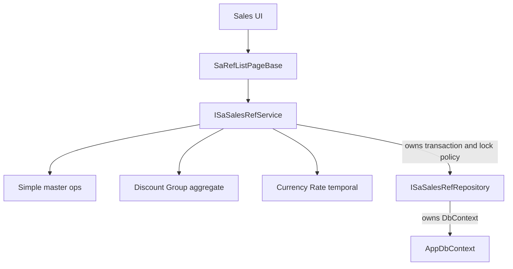

# Sales Master CRUD (revised)

**Agent rules**

- Never infer a business rule from a column name, existing scaffold, or a similar Inventory screen when Phase 0 can verify it from live SQL/data/code. When a rule is unknown, mark it **BLOCKED** and stop. The agent may implement **only** decisions marked **CONFIRMED** in [ErpWeb/docs/sales-master-phase0-findings.md](ErpWeb/docs/sales-master-phase0-findings.md).
- If Phase 0 discovers a mismatch with this plan, do **not** guess a fix. Record discrepancy + options in the findings file, **update this plan**, then continue.
- **Phase 0 PASS is binary.** Any missing, ambiguous, or contradictory required finding is **FAIL**. “Mostly confirmed” is not sufficient.

Clone [IvUomList.razor](ErpWeb.UI/Inventory/Masters/IvUomList.razor) for **simple** masters only. Do **not** inherit `IvRefListPageBase`. Do **not** force Discount Group or Currency Rate into Code/Description CRUD.

**Share infrastructure, not business behavior.**



**Transaction ownership:** the **service** begins/commits/rolls back the business transaction and defines locking policy. The **repository** executes queries/commands on the context owned by that unit of work. The repository must **not** begin and commit a nested transaction halfway through an aggregate or rate save.

**Repository boundary:** `ISaSalesRefRepository` must **not** take `AppDbContext` as a public parameter. If header + members must share a connection/transaction, use a unit-of-work the service opens (e.g. a scoped factory + ambient transaction, or a repository method `SaveDiscountGroupAggregateAsync(...)` that the service calls **inside** the service-owned transaction without leaking `DbContext`).

## Scope

**In:** `SaCustType`, `SaCustGroup`, `IvAreaCode`, `SaCountry`, `SaCurrency`; `SaDisGroup`+`SaDisCust`; `SaCurrRate`; menus/permissions; EF from CONFIRMED findings; delete-in-use; tests; Customer Profile combos after those masters exist.

**Out:** `SaCustomerType` UI; page CSS; export endpoints; **no new columns** in this implementation unless a follow-up plan adds an explicit SQL alter; leftover stamping without CONFIRMED site semantics.

**Menus**

- **Development:** ADMIN bypass may navigate and smoke-test.
- **Production:** menu + non-admin `RoleMenuPermission` only after that phase’s gate.
- **Rejected/unfinished:** no non-admin access. Deployment scripts must not grant permissions early.

---

## Phase 0 — binary gate

Create **[ErpWeb/docs/sales-master-phase0-findings.md](ErpWeb/docs/sales-master-phase0-findings.md)**.

**PASS** (all required):

- findings file exists
- every required decision = **CONFIRMED**
- no unresolved contradiction
- no required schema/data question unanswered

Otherwise **FAIL**. Phase 1 is forbidden.

### Required findings (each CONFIRMED or BLOCKED)

For `SaCustType`, `SaCustGroup`, `IvAreaCode`, `SaCountry`, `SaCurrency`, `SaDisGroup`, `SaDisCust`, `SaCurrRate`:

- Actual PK, unique indexes, FKs (exist or not)
- Company vs global **data** scope; security scope
- Global-master authorization (Country, and Currency if global): shared edit by any company admin vs dedicated global-admin permission — do not assume
- **Concurrency level A / B / C** (below)
- Audit columns and create/update mapping
- Active/Status: type, allowed values, source (free text / enum / code table / YN)
- Branch/Location: stamp vs unused vs key
- **Non-free-form columns** (DiscountType, GroupStatus, GroupLevel, Rate Status, etc.): Type, allowed values, source, validation; reuse an existing lookup/service if it is a code list — do not invent an enum/table
- **Numeric:** SQL `decimal(p,s)` (or float), CLR type, rounding, max; EF must match live SQL exactly — do not invent precision
- **SaCurrRate dates:** SQL type (date/datetime/datetime2), CLR type, time-of-day/timezone meaning, inclusive/exclusive; **if EDate is nullable**, define NULL/open-ended overlap **before** coding
- Currency Rate overlap **index** (`CompanyCode + CurrCode` or live equivalent) and chosen lock query (including empty-set / parent-row lock)
- `SaDisCust` PK/unique index; if missing, record the gap — **do not alter schema in this plan**; decide follow-up constraint vs accept race
- `SaDisCust` RowVersion (or not) and **aggregate lost-update strategy**
- Empty-lookup rule per master
- Delete matrix: DB FK? / App check? / Both
- **SaCust foreign-reference representation** for Type, Group, Area, Country, Currency, GroupDiscount: existing values vs expected master key, clean?, migration required?, compatibility fallback?
- Final EF mappings
- Open questions

Do not add unique/FK/rowversion columns on dirty data. Stop and update the plan (cleanup vs tolerate vs block-new-only).

### Scope hypotheses (replace with live PK)

- SaCustType / SaCustGroup: company, `CompanyCode + code`
- IvAreaCode: confirm company PK
- SaCountry: **global** `CountryCode`; no company filter on data
- SaCurrency / SaDisGroup / SaCurrRate / SaDisCust: confirm live keys; membership uses **complete parent identity**

---

## Concurrency levels (assign per table in findings)

These are **not** equivalent. UI/service must follow the assigned level.

- **Level A — RowVersion optimistic:** OriginalValue + `DbUpdateConcurrencyException`; UOM-style concurrency message.
- **Level B — transaction + key / affected-row:** update/delete must match the loaded key and check affected rows / existence inside the service-owned transaction. **Not** optimistic concurrency. Message: not-found / update failed / duplicate — never a fake RowVersion conflict.
- **Level C — no meaningful concurrent-update protection:** last writer wins. Document as CONFIRMED risk. UI must not claim concurrency control.

No new RowVersion column in this implementation. Level B/C is acceptable if intentional and CONFIRMED.

---

## Keys and tenancy

**Scope is part of repository identity even when it is not part of the physical PK.** `Code` is not globally unique for company-scoped masters.

- Company-scoped simple lookup identity: **`companyCode + Code` (+ RowVersion if Level A)**. Repository methods take `companyCode` from tenant context as a required argument. A client key cannot bypass company filtering. Ignore/overwrite client-supplied company.
- Global Country: **`Code` (+ RowVersion if Level A)**. `GetCountryAsync(code)` — no company data filter; permission still checked.

Do not name this `SaSimpleMasterKey` in a way that implies Code is globally unique. Prefer explicit types or names such as company-scoped token vs global token.

No concatenated tokens. Composite keys (`SaDisGroupKey`, `SaCurrRateKey`) match live PK fields; company on the key is still tenant-applied.

**Immutable keys:** after insert, every business-key component is read-only; save rejects changes. Currency Rate PK fields are not a silent delete+insert.

---

## Lookups

- `ListForMaintenance` / `ListForAssignment` / `ValidateExistingReference` / `ValidateNewAssignment`
- Unchanged Customer Profile field → existing-reference; changed → new-assignment
- Empty-list bypass: **legacy Type/Group only if CONFIRMED**. New masters: empty assignment list = **fail**, unless CONFIRMED otherwise

Phase 0 **ref-representation audit** applies to Type, Group, Area, Country, Currency, GroupDiscount — not Country alone. Combos bind the representation that matches live data, or a documented migration.

---

## Audit, Active, leftover, domain values

**Audit:** one mapping from findings (UOM-style create/update stamps if columns exist).

**Active:** maintenance shows both; assignment hides inactive; existing refs valid. `SetActive` only if CONFIRMED toggle.

**Leftover:** only if CONFIRMED site-stamp semantics.

**DiscountType / GroupStatus / GroupLevel / Status:** validate only CONFIRMED allowed values; reuse existing code-list services when that is the source.

---

## Delete algorithm

Application counts are **advisory** under concurrency. **Database FK is the strongest protection** when it exists.

**When a DB FK exists:**

1. BEGIN TRANSACTION (service-owned)
2. Authorization + scope
3. Application reference check (friendly InUse)
4. DELETE
5. If FK violation: rollback, return InUse
6. COMMIT

**When no FK exists:** findings document the race. Use an isolation/locking transaction: reference check then DELETE then COMMIT, so a concurrent insert cannot sneak in. Do not add an FK in this plan unless a follow-up SQL change is CONFIRMED.

---

## Foundation (only after Phase 0 PASS)

`SaRefListPageBase`; `ISaSalesRefService`; repository with companyCode, **no public `DbContext`**; service-owned transactions; split lookups; menus as ADMIN-smoke until gates.

EF fluent configs **only** from CONFIRMED mappings (precision, types, keys). No `SaCustomerType` DbSet.

---

## Phase 2 — Type + Group

UOM clone. Concurrency messaging matches Level A/B/C. Activate toolbar only if Active CONFIRMED.

---

## Phase 3 — Area, Country, Currency + Customer Profile

Live columns only. Country global query; auth from findings. Combos from ref-representation audit. Fail-closed empty lookup unless CONFIRMED.

---

## Phase 4 — Discount Group aggregate

Service-owned **one** transaction. Full parent identity on every membership row.

**Lost updates:** never replace the entire membership set blindly.

- If `SaDisCust` has RowVersion: membership-level concurrency (stale member tokens fail).
- Else: aggregate-level concurrency (header RowVersion if Level A, or a CONFIRMED transaction strategy that detects stale membership).
- Two users changing the same group: add a **SQL Server** concurrent-update test when Level A/B can detect it; if Level C, CONFIRMED last-writer-wins and do not fake a concurrency error.

Duplicates: application message + **database unique PK/index** when it exists. If no unique index, record the gap; do not add it in this implementation.

Validate: customer exists, same company, complete parent identity, no duplicate CustCode for that identity.

Failure rolls back header **and** members.

---

## Phase 5 — Currency Rate

**Save/update order (do not reorder):**

1. Validate immutable key components against the original snapshot
2. Reject any key change
3. Start service-owned transaction
4. Acquire company+currency lock (or CONFIRMED equivalent), including empty-set parent-row lock
5. Overlap check excluding the current row
6. Update **non-key** fields only
7. Commit

**Overlap (inclusive) when both ends are non-null:**

```
Existing.StartDate <= New.EndDate
AND Existing.EndDate >= New.StartDate
```

`01-Jan–31-Jan` vs `31-Jan–28-Feb` overlaps if inclusive dates CONFIRMED.

**If EDate is nullable and NULL means open-ended (only if CONFIRMED):**

```
Existing.StartDate <= NewEnd
AND (NewEnd is NULL OR Existing.EndDate is NULL OR Existing.EndDate >= NewStart)
```

If EDate is mandatory, do **not** add this; record the live rule.

Date/time precision from findings (date vs datetime vs datetime2; ignore time-of-day if SQL `date`). Rate and discounts: EF `decimal(p,s)` matches live SQL. Rate > 0 using that type.

SQL Server test: **two concurrent tasks**, not sequential calls.

---

## UI acceptance

Every master: list columns; new popup; required/duplicate errors; edit loads values; keys read-only after insert; inactive display; delete confirm; InUse message; concurrency message **only for Level A**; permission buttons hidden but server-enforced; `CommonDataGridEx` export.

Discount Group: add/remove membership; duplicate error; company-scoped customer lookup; rollback on save failure; stale-membership/aggregate concurrency per CONFIRMED level.

Currency Rate: invalid range; overlap and boundary; currency lookup; rate validation; key read-only.

---

## Tests (split)

**SQLite:** CRUD, validation, duplicates, delete-dependency logic, audit, active/inactive, membership transaction rollback, overlap **logic**, empty-lookup rules, company scope.

**SQL Server:** RowVersion (Level A), FK delete race, Currency Rate locking, concurrent overlapping inserts, Discount Group concurrent update if applicable, actual index/lock behavior.

Do not treat SQLite green as proof of SQL Server locking/FK/rowversion.

---

## Gates

- **Phase 0:** PASS binary; build still green
- **Foundation:** build + compile tests
- **Type/Group:** build + SQLite tests + UI smoke; ADMIN smoke only
- **Area/Country/Currency:** build + tests + Customer Profile lookup regression
- **Discount Group:** build + aggregate rollback tests (+ SQL Server concurrent update if applicable)
- **Currency Rate:** build + SQLite overlap + SQL Server concurrent inserts
- **Complete:** checklist below; production non-admin grants only after all gates

Do not start the next phase on a failed gate.

## Final acceptance checklist

- Phase 0 findings exist; every required decision CONFIRMED; no unresolved contradiction
- EF mappings match live SQL (keys, types, decimal p,s, dates)
- Company/global scope verified; global-master authorization verified
- Delete matrix verified; audit/active/leftover verified
- Concurrency level A/B/C assigned and UI/service match
- Simple CRUD tests pass; Discount Group transaction tests pass; Currency Rate overlap tests pass
- SQL Server concurrency tests pass; UI smoke pass; non-admin permission tests pass
- Customer Profile lookup regression pass
- Production menu permissions enabled only after gates

## Implementation order

1. Phase 0 findings (PASS required)
2. Foundation
3. Type + Group
4. Area + Country + Currency + SaCustEntry
5. Discount Group
6. Currency Rate
