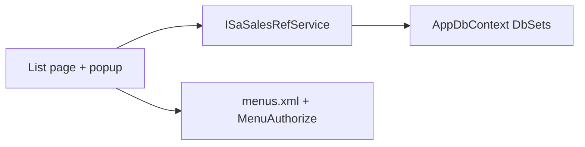

# Sales master UI for payment term, sales rep, tax group

Clone the existing sales-master list+popup pattern. There is no dedicated entry page: [SaAreaList.razor](ErpWeb.UI/Sales/Masters/SaAreaList.razor) + [SaCodeRefListPageBase.cs](ErpWeb.UI/Sales/Masters/SaCodeRefListPageBase.cs) is the shell. UI cannot work until [ISaSalesRefService.cs](ErpWeb.Core/Sales/ISaSalesRefService.cs) / [SaSalesRefService.cs](ErpWeb.Core/Sales/SaSalesRefService.cs) expose List/Get/Save/CanDelete/Delete (and activate where needed).

## Which clone to use

- **Payment term** — copy **Currency** ([SaCurrencyList.razor](ErpWeb.UI/Sales/Masters/SaCurrencyList.razor)): company-scoped `(CompanyCode, PayCode)`, `Active`, leftover branch/location stamp on create, `SupportsActivate = true`.
- **Sales rep** — same Currency pattern: company-scoped `(CompanyCode, SrepCode)`, `Active`, leftover stamp, activate toolbar. Extra address/contact/commission fields; popup ~50–60vw.
- **Tax group** — copy **Country** ([SaCountryList.razor](ErpWeb.UI/Sales/Masters/SaCountryList.razor)): global table, no Active, list **not** filtered by company; still requires a company session for menu rights.

Do **not** copy [SaCustTypeList](ErpWeb.UI/Sales/Masters/SaCustTypeList.razor) (`SaRefListPageBase` + `RowVersion`). These three entities have no rowversion.

## 1. Service layer

Add DTOs next to `SaAreaListRow` / `SaAreaEditVm` in [ISaSalesRefService.cs](ErpWeb.Core/Sales/ISaSalesRefService.cs):

- `SaPaymentTermListRow` / `SaPaymentTermEditVm` — `Code`, `Desc`, `Days`, `IsActive`
- `SaSalesRepListRow` / `SaSalesRepEditVm` — `Code` (`SrepCode`), `Name`, address/contact, `CommissionRate`, `IsActive`
- `SaTaxGroupListRow` / `SaTaxGroupEditVm` — `Code` (`TaxGrCode`), `Desc`, `Percentage`

Add matching methods on the interface and [SaSalesRefService.cs](ErpWeb.Core/Sales/SaSalesRefService.cs), cloned from Area/Currency/Country:

- List / Get / Save(`isNew`) / CanDelete / Delete
- `SetPaymentTermActiveAsync` / `SetSalesRepActiveAsync` (Currency-style)

Write rules to copy from existing masters:

- Company masters: filter `CompanyCode == ctx.CompanyCode`; create uses `InventoryLeftoverSite.Apply` — add overloads for `SaPaymentTerm` and `SaSalesRep` in [InventoryTenantContext.cs](ErpWeb.Core/Inventory/InventoryTenantContext.cs) beside `Apply(SaCurrency, ...)`.
- Tax group: no company filter, no leftover stamp (like Country).
- Code immutable after create; duplicate key / `DbUpdateException` same messages as Area.
- List Active as `IsActive != false` (null = active), same as Currency.
- Validation: code required (max 20); desc/name required; Days optional `>= 0`; Percentage required `>= 0` (no 100% cap); CommissionRate optional `>= 0`.

**Delete blocking** (app check, no DB FKs), same `Count*ReferencesBulkAsync` pattern:

- Payment term: `SaCust.PayCode`, `SaInvoice.PayCode`, `SaDisGroup.PayCode`
- Sales rep: `SaCust.SalesmanCode`, `SaInvoice.SalesmanCode`
- Tax group: `SaCust.TaxGrCode`, `SaInvoice.TaxGrCode`, `SaInvoiceDetail.TaxGrCode` (current-company refs, like Country)

## 2. UI pages

Add under [ErpWeb.UI/Sales/Masters](ErpWeb.UI/Sales/Masters):

- `SaPaymentTermList.razor` + `.razor.cs`
- `SaSalesRepList.razor` + `.razor.cs`
- `SaTaxGroupList.razor` + `.razor.cs`

Shared chrome: `@page`, `MenuAuthorize`, toasts, `iv-hero`, loading line, `CommonDataGridEx` (`KeyName` = `Code`, unique `GridKey`), edit popup, confirm-delete. Export stays built-in on the grid (no extra handler).

| Page | Grid | Popup |
|---|---|---|
| Payment terms | Code, Desc, Days, Active | Code (readonly in edit), Active, Desc, Days `DxSpinEdit<int?>` |
| Sales reps | Code, Name, Tel, Mobile, Email, Active | Code, Active, Name, Address1–3, City, State, Postal, Country, Tel, Mobile, Email, CommissionRate |
| Tax groups | Code, Desc, Percentage | Code, Desc, Percentage `DxSpinEdit<decimal>` |

New Active masters default `IsActive = true`. View can switch to Edit when the user has EDIT.

## 3. Menus

Add under `SA_MASTER` in [ErpWeb/Menus/menus.xml](ErpWeb/Menus/menus.xml):

- `SA_PAY_TERM` — Payment Terms — `/sales/payment-terms` — SortOrder 9
- `SA_SALES_REP` — Sales Reps — `/sales/sales-reps` — SortOrder 10
- `SA_TAX_GROUP` — Tax Groups — `/sales/tax-groups` — SortOrder 11

Constants in [MenuCodes.cs](ErpWeb.Core/Menus/MenuCodes.cs). ADD/EDIT/DELETE in [scripts/init-menu-access.sql](scripts/init-menu-access.sql) next to the other `SA_*` leaf menus.

## 4. Tests

Extend [SaSalesRefServiceTests.cs](ErpWeb.Tests/SaSalesRefServiceTests.cs):

- Create succeeds; duplicate rejected
- Pay term / sales rep filtered by company
- Tax group list **not** filtered by company (mirror `Country_List_NotFilteredByCompany`)
- Activate toggle
- Delete blocked when a customer (or invoice/dis-group) references the code

## Out of scope

Customer pay-code / tax-group combos still read `IvMsCode`. Invoice tax groups already use `SaTaxGroups`. Do **not** retarget lookups in this slice. `SaPaymentTerm` / `SaSalesRep` tables exist in [scripts/init-sales-masters.sql](scripts/init-sales-masters.sql) but must be applied to ERPWeb before the pages can save (manual DBA, not app startup).
