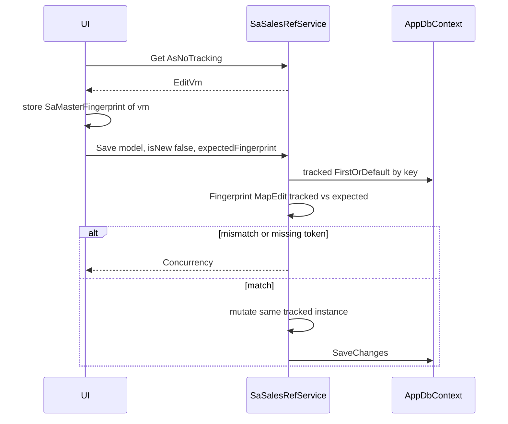

# Sales master UI — hardened v3 (review lock-in)

Closes the three 9.3 leftovers and the review P1/P2 ambiguities. Shell: [SaCurrencyList.razor](ErpWeb.UI/Sales/Masters/SaCurrencyList.razor) / [SaCountryList.razor](ErpWeb.UI/Sales/Masters/SaCountryList.razor) + [SaCodeRefListPageBase.cs](ErpWeb.UI/Sales/Masters/SaCodeRefListPageBase.cs). Service first on [ISaSalesRefService](ErpWeb.Core/Sales/ISaSalesRefService.cs) / [SaSalesRefService](ErpWeb.Core/Sales/SaSalesRefService.cs).

Clone map:

- Payment term → Currency: company-scoped `(CompanyCode, PayCode)`, Active yes, leftover Apply yes
- Sales rep → Currency: company-scoped `(CompanyCode, SrepCode)`, Active yes, leftover Apply yes, wide popup
- Tax group → Country: global `TaxGrCode`, no Active, no Apply

No `SaCustTypeList`, no SQL `RowVersion`, no new generic CRUD abstraction.

Entities, DbSets, and EF configs already exist. Do not recreate them. Keep `CommissionRate` / `Percentage` at **`HasPrecision(18, 6)`** (SQL + current configs). Do not change to `(9, 4)`.



---

## Implementation Rules — Do Not Deviate

- Copy Currency/Country patterns where this plan says to clone.
- Do not introduce a new generic CRUD abstraction, `PagedResult`, or SQL `RowVersion`.
- Do not use `InventoryTenantContext.Apply`. Call site is only `InventoryLeftoverSite.Apply(row, writeScope)`.
- Do not perform security or concurrency checks only in the UI.
- Do not assign immutable codes from edit VMs onto tracked entities.
- Do not invent a throwing `EnsureCompanyContext()`. Use existing `RequireCompanyScopeAsync` / `ValidateCompanyContext` (empty company → `IvMasterErrorCode.InvalidScope`, same as Currency).
- Do not throw for Duplicate/NotFound/Concurrency. Return `IvMasterOperationResult` / `DeleteCheckResult` like Currency.
- Do not modify Currency, Country, Area, or unrelated modules.
- DBA applies `init-sales-masters.sql` / `create-sainvoice.sql` manually. No IvMsCode retarget.

---

## 0. EF gate (verify only)

Confirm (already present):

- [SaPaymentTerm.cs](ErpWeb.Model/Entities/Sales/SaPaymentTerm.cs) + [SaPaymentTermConfiguration.cs](ErpWeb.Model/Configurations/Sales/SaPaymentTermConfiguration.cs)
- [SaSalesRep.cs](ErpWeb.Model/Entities/Sales/SaSalesRep.cs) + [SaSalesRepConfiguration.cs](ErpWeb.Model/Configurations/Sales/SaSalesRepConfiguration.cs) — `SrepName` max **200**, Tel/Mobile **50**, `CommissionRate` `(18,6)`
- [SaTaxGroup.cs](ErpWeb.Model/Entities/Sales/SaTaxGroup.cs) + config — `Percentage` `(18,6)`
- DbSets on [AppDbContext.cs](ErpWeb.Model/Data/AppDbContext.cs)

Lengths (match EF, not the old generic 100/30 table):

- Codes: 20. PayDesc / TaxGrDesc: 100. SrepName: 200.
- Address1–3: 100. City / State / Country: 50. PostalCode: 20. Tel / Mobile: 50. Email: 100.

---

## 1. Leftover stamp

Add overloads next to Currency’s in [InventoryTenantContext.cs](ErpWeb.Core/Inventory/InventoryTenantContext.cs) nested `InventoryLeftoverSite`:

```csharp
public static void Apply(SaPaymentTerm entity, InventoryTenantScope writeScope)
{
    entity.BranchCode = writeScope.BranchCode;
    entity.LocationCode = writeScope.LocationCode;
}
```

Same for `SaSalesRep`. Tax group: no overload, no call.

Create path (Currency exact): `TryWriteScope()` required; then `InventoryLeftoverSite.Apply(entity, writeScope); db.Add(entity);`. Update path: no Apply.

---

## 2. Fail-closed company — method matrix

Use `RequireCompanyScopeAsync(menu, permission)` at the start of every method below. Empty/`TryCompanyScope() == null` → `InvalidScope`. Never query without a company on company-scoped tables.

Company-scoped (payment term, sales rep) — every method filters `CompanyCode == ctx.CompanyCode`:

- List, Get, Save, CanDelete, Delete, SetActive (Activate)

Tax group (Country twin):

- List / Get / Save: **auth requires company**; entity queries are **not** filtered by `CompanyCode` (entity has none)
- CanDelete / Delete: auth requires company; **ref-count queries** filter `SaCust` / `SaInvoice` / `SaInvoiceDetail` by current `CompanyCode`
- Do not add `CompanyCode` to `SaTaxGroup` or fail because the row has none

Permissions: List/Get = Access; Save new = Add; Save edit = Edit; SetActive = Edit; CanDelete/Delete = Delete.

---

## 3. Fingerprint — one shared helper (P1)

Currency/Country have **no** fingerprint helper. Add one class, used by Get-side UI and Save, in `ErpWeb.Core/Sales/SaMasterFingerprint.cs`.

Rules:

- Canonical payload = a dedicated record of **mutable fields only** (declaration order stable).
- Serialize with `System.Text.Json` (`PropertyNamingPolicy = null`, do not ignore nulls).
- Hash: `Convert.ToHexString(SHA256.HashData(UTF8 bytes of JSON))`.
- Same function for page-after-Get and service-after-tracked-reload (`Fingerprint(MapEdit(tracked))`).
- Do **not** use pipe-delimited concatenation (`Desc` can contain `|`).
- Do **not** invent a different format per master.

Payloads:

- Payment term: `Desc`, `Days`, `IsActive`
- Sales rep: `Name`, `Address1`, `Address2`, `Address3`, `City`, `State`, `PostalCode`, `Country`, `Tel`, `Mobile`, `Email`, `CommissionRate`, `IsActive`
- Tax group: `Desc`, `Percentage`

UI: on popup open after Get (`AsNoTracking` OK), `_loadedFingerprint = SaMasterFingerprint.PaymentTerm(vm)`. Edit save passes that string. On `ErrorCode == Concurrency`: toast + reload Get. Service is the authority.

---

## 4. Save contract

```csharp
Task<IvMasterOperationResult<SaPaymentTermEditVm>> SavePaymentTermAsync(
    SaPaymentTermEditVm model,
    bool isNew,
    string? expectedFingerprint,
    CancellationToken ct = default);
```

Same shape for sales-rep and tax-group. (Currency’s `Save(model, isNew)` plus `expectedFingerprint`. Code lives on the VM.)

**Create:**

- Validate
- `AnyAsync` on natural key **before** Add (normalized code). Duplicate → `DuplicateKey`, same message style as Currency (`"{Entity} code already exists."`)
- New instance; set code from normalized `model.Code`; map mutables; `IsActive` default true when applicable
- Payment term / sales rep: `InventoryLeftoverSite.Apply` then Add
- `SaveChanges`; `DbUpdateException` duplicate translation remains belt-and-suspenders

**Update:**

- Missing/empty `expectedFingerprint` → `IvMasterErrorCode.Concurrency` (“Concurrency token is missing. Reload and try again.”) — not `ArgumentException`
- Tracked reload (`FirstOrDefault`, **no** `AsNoTracking`, **no** second Attach)
- Compare `SaMasterFingerprint.*(MapEdit(tracked))` to `expectedFingerprint`; mismatch → `Concurrency` (“This record was modified by another user.”)
- `KeysEqual` like Currency; never assign `PayCode` / `SrepCode` / `TaxGrCode` from the VM onto the entity
- Mutate the same tracked instance; `SaveChanges`

Code normalize for these three masters: `Trim` + `ToUpperInvariant` (stricter than Currency Trim-only; required so `abc` vs `ABC` is a duplicate). Lookup and `AnyAsync` use the normalized value.

List/Get reads: always `AsNoTracking()`. List returns `IReadOnlyList<TRow>` like Currency — **no** `PagedResult`, no Skip/Take.

---

## 5. Validation (P1 — explicit)

Reject with `IvMasterErrorCode.Validation` field errors. Do not silently truncate required fields; optional strings use existing `TruncateOptional`.

**Shared**

- `model` null → Validation
- Code: required, max 20, after normalize non-empty
- Optional strings: blank → null; max length per EF
- Email / phone: optional; **length only** (no format regex)
- Decimal scale: reject if `value != decimal.Round(value, 6, MidpointRounding.AwayFromZero)`. Values at scale 6 succeed. UI `DxSpinEdit` with 6 decimal places. Do not silently round in the service.

**Payment term**

- Desc required, max 100
- Days required, integer, range **0..9999** inclusive; negatives and null rejected
- IsActive required on VM (create defaults true)

**Sales rep**

- Name required, max 200
- Address/City/State/Country/Postal/Tel/Mobile/Email optional at EF max lengths
- CommissionRate optional; if set: **0..100** inclusive, scale ≤ 6
- IsActive required on VM (create defaults true)

**Tax group**

- Desc required, max 100
- Percentage required: **0..100** inclusive, scale ≤ 6 (0 is valid)

---

## 6. Delete race (P1) and UI authz

Reuse `DeleteCompanyByCodesAsync` (pay-term, sales-rep) and `DeleteGlobalByCodesAsync` (tax group) in [SaSalesRefService.cs](ErpWeb.Core/Sales/SaSalesRefService.cs). Those helpers already:

1. Re-run the CanDelete probe inside the transaction
2. Catch `DbUpdateException` when `IsForeignKey` → `IvMasterErrorCode.InUse` (“One or more records are in use.”)

That FK catch is authoritative if a reference appears after the UI CanDelete. Do not assume the first CanDelete guarantees delete.

UI inherits [SaCodeRefListPageBase](ErpWeb.UI/Sales/Masters/SaCodeRefListPageBase.cs): DELETE requires `PermissionCodes.Delete` then `CanDeleteCoreAsync` then `DeleteCoreAsync`. Activate/Deactivate = `PermissionCodes.Edit` via `SupportsActivate` + `SetActiveByCodesAsync` (payment term and sales rep only).

Pages:

- `SaPaymentTermList` — `/sales/payment-terms`
- `SaSalesRepList` — `/sales/sales-reps` (wide popup)
- `SaTaxGroupList` — `/sales/tax-groups`

Delete refs (current company):

- Pay term: `SaCust.PayCode`, `SaInvoice.PayCode`, `SaDisGroup.PayCode`
- Sales rep: `SaCust.SalesmanCode`, `SaInvoice.SalesmanCode`
- Tax group: `SaCust.TaxGrCode`, `SaInvoice.TaxGrCode`, `SaInvoiceDetail.TaxGrCode`

---

## 7. Menus

Add under `SA_MASTER` in [menus.xml](ErpWeb/Menus/menus.xml) (SortOrder 9–11): `SA_PAY_TERM`, `SA_SALES_REP`, `SA_TAX_GROUP`.

[MenuCodes.cs](ErpWeb.Core/Menus/MenuCodes.cs): `SalesPayTerm`, `SalesSalesRep`, `SalesTaxGroup`.

[init-menu-access.sql](scripts/init-menu-access.sql): add those three codes to the existing sales ADD/EDIT/DELETE `MenuCode IN (...)` list (same pattern as `SA_CURRENCY`).

---

## 8. Tests

Extend [SaSalesRefServiceTests.cs](ErpWeb.Tests/SaSalesRefServiceTests.cs) (or a sibling file). Keep [SaPaymentTermSalesRepMappingTests.cs](ErpWeb.Tests/SaPaymentTermSalesRepMappingTests.cs).

Required cases:

- Create succeeds; `AnyAsync` duplicate rejected; `abc` vs `ABC` duplicate after normalize
- Empty CompanyCode → `InvalidScope` (pay-term/sales-rep **and** tax-group auth); no mutate
- Cross-company Get/Save/Delete/SetActive → NotFound / no mutate
- Update changes mutables; code unchanged (assigning a different code on the VM must not rename the row)
- Stale fingerprint on tracked Save → `Concurrency`
- Missing `expectedFingerprint` on update → `Concurrency`
- Unchanged data: fingerprint from Get-mapped VM equals fingerprint from MapEdit of tracked row
- CanDelete true → Delete succeeds
- Delete after a new reference appears → `InUse` (FK or re-probe), not a raw exception
- Decimal: scale 6 succeeds; excess scale rejected; Percentage/CommissionRate out of 0..100 rejected; Days negative rejected
- List: `IReadOnlyList` contract (no `PagedResult`); reads use `AsNoTracking`
- Tax group List/Get/Save do not filter the tax-group table by CompanyCode
