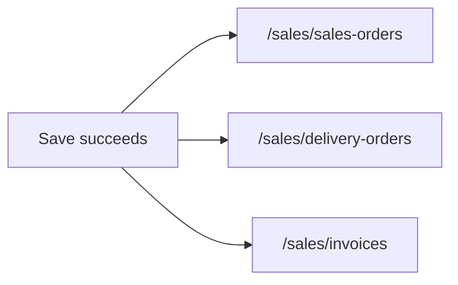

# After Save, return to list

## Problem

Successful Save currently navigates to the **edit** URL of the just-saved document. Cancel/Close already go to the list. A second Save then fails because:

- On `/new`, `IsNewMode` is still true, so `SaveNewAsync` runs again (DO/invoice from SO: remaining qty error).
- On `/edit/{no}`, `NavigateTo` the same URL is a no-op, `_rowVersion` is not refreshed, and `UpdateAsync` returns concurrency.

Inventory already does the right thing (`IvMiscIssue` → `/inventory/misc-issue`). Match that.

## Change (3 one-line replacements)

In each `OnSaveAsync`, keep validation, `HandleOperationResult(..., stayOnPage: true)` (errors stay on the form), and `_isDirty = false`. Only change the success navigation.

- [`ErpWeb.UI/Sales/Transactions/SaSo.razor.cs`](ErpWeb.UI/Sales/Transactions/SaSo.razor.cs) line 806  
  `Navigation.NavigateTo("/sales/sales-orders");`

- [`ErpWeb.UI/Sales/Transactions/SaDo.razor.cs`](ErpWeb.UI/Sales/Transactions/SaDo.razor.cs) line 927  
  `Navigation.NavigateTo("/sales/delivery-orders");`

- [`ErpWeb.UI/Sales/Transactions/SaInvoice.razor.cs`](ErpWeb.UI/Sales/Transactions/SaInvoice.razor.cs) line 1061  
  `Navigation.NavigateTo("/sales/invoices");`

Those routes already map to [`SaSoList.razor`](ErpWeb.UI/Sales/Transactions/SaSoList.razor), [`SaDoList.razor`](ErpWeb.UI/Sales/Transactions/SaDoList.razor), and [`SaInvoiceList.razor`](ErpWeb.UI/Sales/Transactions/SaInvoiceList.razor).

## Out of scope

- Do not change `OnClose` / `OnCancel` / `OnEditFromView` (already correct).
- Do not change services, `CanSave`, or `HandleOperationResult`.
- Do not navigate to view mode; the user asked for the list.

## Verify

Manually (browser, after the code change):

1. New SO → Save → lands on SO list; Save is gone (cannot double-save).
2. Edit an existing NEW SO → Save → lands on SO list.
3. Same for DO and Invoice (new + edit).
4. Failed save (empty lines / validation) stays on the form with the error.