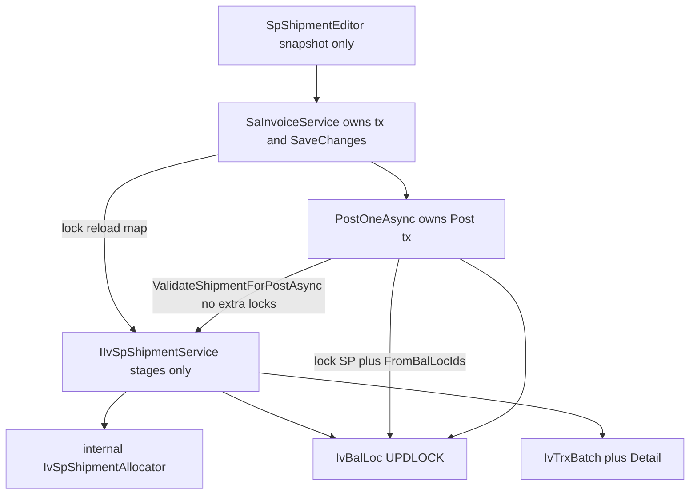

# Shared SP shipment for Invoice now, DO later

Keep the Blazor model: persist `IvTrxBatch` / `IvTrxBatchDetail` (`TrxType=SP`); reduce `IvBalLoc` only on **Post**. Copy V5.5 **rules**, not DataTables.

Work in `c:\wincom\net10projects`. Sources: [ShipmentHelper.cs](c:\wincom\ERPV55\ERP_5.5\ERPCommonUI\SalesForms\HelperClass\ShipmentHelper.cs), [SPShipment.ascx.cs](c:\wincom\ERPV55\ERP_5.5\ERPCommonUI\SalesForms\Controls\SPShipment.ascx.cs), [SaInvoiceService.AddShipmentAsync](c:\wincom\net10projects\ErpWeb.Core\Sales\SaInvoiceService.cs).

**Phase 3 and Phase 4 are one feature branch / one production rollout.** Do not ship the extracted FIFO without reservation. Today Add Shipment reloads piles per line from the DB and can persist 6+6 against a lot of 10.



**Invariant (end-to-end):**

```
Persisted SP
  → NEW = reservation
  → lock affected stock slices
  → reservation-aware FIFO (post-lock data only)
  → replace shipment atomically
  → Post locks SP batch + FromBalLocIds, then validates (no extra locks)
  → Post physically deducts stock AND marks SP POSTED in one commit
  → NEW → POSTED
```

A partially transitioned batch/detail/balance state must **never** be committed.

**Locked decisions (do not reopen):**

- Reservation SUM **must** `JOIN IvTrxBatch` on `batch.Id = detail.BatchId` and filter **the same write-scope tenant** on **batch and detail**: `CompanyCode`, `BranchCode`, and `LocationCode` (from `IInventoryTenantContext.TryWriteScope`), plus `batch.TrxType = 'SP'` and `batch.BatchStatus = 'NEW'`. There is no `IvTrxBatch.BatchId` column; PK is `Id`. Do not omit `LocationCode`.
- No set-based “select eligible FIFO with UPDLOCK” helper exists. Pattern is: unlocked discovery → lock **each** id via `LockBalLocByIdForTenantAsync` in `IvStockSliceKey` order → reload → SUM → allocate.
- **This slice does not expand the lock set mid-transaction.** Lock `distinct(releasedIds ∪ candidateIds)` where `candidateIds` use **`IvSpFifoEligibility.MatchesCandidate`**, which **is** the nine `LoadFifoPilesAsync` WHERE conditions (Company, Branch, ICode, warehouse/`WhCode`, tenant `LocationCode`, `StdQty > 0`, `IStatus = ACTIVE`, `TransDate != null`, `TransDate <= doc date`) and **nothing else**. Not a qty prefix. If still short after re-eval → per-line `ST000051`/`ST000059`. A later expand, if ever added, must merge ids, **re-sort the full union**, then lock only not-yet-locked ids in that order (never lock C before A). Add allocator and Post validation **must share this predicate**; Post must not use a weaker list.
- **`releasedIds`** contains every `FromBalLocId` currently referenced by the reservation rows being replaced or deleted, **regardless of whether those rows remain eligible under the current FIFO query**.
- **Add/overwrite is atomic at the shipment replacement level.** Successfully allocatable lines are persisted as the replacement result; failed lines are returned as per-line errors and are not persisted. Existing shipment details are removed only within the successful replacement transaction. Hard failure rolls back: original reservation unchanged.
- **Edit APPLY never persists a partial line replacement.** Submitted lots must `IvQty.Round(SUM(IssueQty)) ==` persisted line `StdQty`; otherwise return `QtyDoesNotMatchLineStdQty` (or `QtyExceedsAvailable` / `StaleQuantity` / `LotNoLongerEligible` as applicable) and **preserve the existing line reservation**. `ReplaceShipmentLineAsync.Succeeded` is true only when that line is fully replaced.
- `PostOneAsync` owns the transaction and locks the SP batch and all shipment `FromBalLocId`s **before** calling `ValidateShipmentForPostAsync`. Validation performs **no additional locking** and no mutation. Call it before `DecreaseBalLocQtyAsync`. Keep it out of `PostInventoryMICoreAsync`.
- **Every SP delete is a reservation-release:** lock `releasedIds` then delete. Paths: invoice `DeleteAsync`, identity-edit `DeleteSpDetailsAsync`, customer-change `DeleteSpBatchAsync`. Invoice has no `CANCELLED` status.
- GetEdit 10 → other NEW SP takes 6 → APPLY 8 must fail with `CurrentAvailableQty` 4; unsaved input is preserved.
- Reservation is **SP-vs-SP only**. MI/TR/SC/ADJ can still consume physical stock.
- `IsShipmentRequired`: `StockControl && StdQty > 0` on the **invoice line** (no `LinkDo` this slice). **`StockControl` is not a `LoadFifoPilesAsync` / `IvBalLoc` filter.** It selects which lines enter the allocator and which lines Post requires complete. Add, Edit, and Post all use `IsShipmentRequired` for that line set.
- `CurrentAvailableQty` (and all reservation qty in results) uses `IvQty.Round` (4 dp, `AwayFromZero`), same as `FrStdQty`.
- `IvSpShipmentResult.Succeeded` means the **operation committed** (or snapshot loaded), **not** that all required stock was allocated. CreateOrReplace may return `Succeeded = true` and `HasIncompleteLines = true`; adapter maps `ShipmentComplete = false`.
- `IvSpValidatePostResult` is internal. Map failures onto existing `PostOneAsync` / `SaInvoicePostingItemResult.Failed` messages. Do not invent new Post ST codes. Keep current strings for missing SP, date mismatch, and incomplete line qty.

---

## Verified facts

- V5.5 and current Blazor do **not** reserve unposted SP. This plan **adds reservation** because Blazor persists SP immediately.
- One SP batch per invoice: `LockSpBatchByInvoiceRefAsync`. Extra batches throw.
- Balance locks: [LockBalLocByIdForTenantAsync](c:\wincom\net10projects\ErpWeb.Model\Repositories\Inventory\IvStockPostingRepository.cs) — raw SQL `UPDLOCK, HOLDLOCK`. **Do not** emulate with EF LINQ. Extend [IvBalLocLockResult](c:\wincom\net10projects\ErpWeb.Model\Repositories\Inventory\IvBalLocLockResult.cs) with `LocationCode` and `TransDate` so `IvSpFifoEligibility` can run on **post-lock** data (today the projection has neither).
- Post lock order: `IvStockSliceKey` then `OrderBy(kv => kv.Value)` ([IvStockSliceKey](c:\wincom\net10projects\ErpWeb.Model\Repositories\Inventory\IvStockSliceKey.cs)). If `PostStockOutInTransactionAsync` currently reacquires the same rows in the same `IvStockSliceKey` order, **retain that behavior**. Do not change its lock order.
- Detail FK: `IvTrxBatchDetail.BatchId` → `IvTrxBatch.Id` (`OnDelete Restrict`). Reservation JOIN uses **`batch.Id = detail.BatchId`** (not BatchNo alone).
- `IvBalLoc.Id` is identity PK. Tenant write scope is `CompanyCode` + `BranchCode` + `LocationCode`. Stamp `LocationCode` on invoice, SP batch, SP detail, and FIFO `IvBalLoc` filter (already done in `LoadFifoPilesAsync`). Reservation SUM must use the same three columns on **both** batch and detail.
- `StdQty = Qty * StdPackSize` on **server** at invoice save. **`FrStdQty` is the canonical reservation quantity.** Never subtract selling `Qty`. Edit must not trust client `StdPackSize` / client-recalculated StdQty.
- `IvQty.Round` = 4 dp, `AwayFromZero`. `FrStdQty` precision 18,4.
- IStatus this slice: **ACTIVE only**. FIFO only. No LIFO.
- FIFO order: `TransDate, LotNo, Id`.
- Generate `BatchNo` only after required lines exist. Empty-header number gaps **acceptable**. Empty-detail NEW batch is allowed when all required lines fail FIFO.
- Indexes: no `FromBalLocId` on detail today. Phase 1 inspect aggregation plan; add index only if needed. Do not add speculative indexes.
- Optional P2: unique `(BatchId, SoLineNo, FromBalLocId)` if schema/replacement semantics allow; **not required** if validation already forbids duplicates.
- Catch weight / LIFO / Save+Add one tx / DO screens: out of scope.
- Edit UI is greenfield: no `SpShipmentEditor` and no Get/APPLY APIs on `ISaInvoiceService` today.

---

## 0. Transaction and persistence ownership

**One owner per operation.** `IIvSpShipmentService` never begins, commits, or rolls back a transaction and does **not** call `SaveChanges`. It only stages entities on the caller’s `db`. The caller owns transaction and persistence boundaries.

| Operation | Owner | Shipment |
|---|---|---|
| Add / overwrite | `SaInvoiceService.AddShipmentAsync` (tx + SaveChanges) | `CreateOrReplaceShipmentAsync(db, command)` stages only |
| Edit APPLY | `SaInvoiceService` wrapper (tx + SaveChanges) | `ReplaceShipmentLineAsync(db, command)` stages only |
| Delete invoice / identity-edit / customer-change | `SaInvoiceService` | Lock `releasedIds` then remove |
| Post | `PostOneAsync` | Locks first, then `ValidateShipmentForPostAsync(db, …)` — **NO MUTATION, NO LOCKS** |

Invoice save and add shipment stay separate UI requests.

**Post atomicity:** `NEW → POSTED` and `DecreaseBalLocQty` occur in **the same Post transaction**. Never commit POSTED without the deduction, or deduction without POSTED.

---

## 1. Reservation SUM (explicit join)

```sql
SUM(detail.FrStdQty)
FROM IvTrxBatchDetail detail
JOIN IvTrxBatch batch ON batch.Id = detail.BatchId
WHERE detail.CompanyCode  = @company
  AND detail.BranchCode   = @branch
  AND detail.LocationCode = @location
  AND detail.FromBalLocId = @balLocId
  AND batch.CompanyCode   = @company
  AND batch.BranchCode    = @branch
  AND batch.LocationCode  = @location
  AND batch.TrxType       = 'SP'
  AND batch.BatchStatus   = 'NEW'
```

`@company`, `@branch`, `@location` are the write-scope tenant (`TryWriteScope`). Do **not** SUM details without joining/filtering batch **and** detail on those three tenant columns plus type/`NEW`.

```
available = locked.IvBalLoc.StdQty − that SUM
            (excluding details this transaction will replace)
```

| Invoice | SP batch | Reservation? |
|---|---|---|
| NEW | NEW | Yes |
| POSTED | POSTED | No |
| deleted | deleted | No |
| mismatch NEW/POSTED | Fail; do not commit | |

Exclude while old rows still exist:

- Add overwrite: all details of this document’s SP batch
- Edit one line: this doc + `SoLineNo = edited line`
- Delete / identity-edit / customer-change: all details being removed

---

## 2. Lock protocol + post-lock authority (P0)

**Invariant:** any SP insert/delete that changes reserved qty for a `FromBalLocId` first locks that `IvBalLoc` via `LockBalLocByIdForTenantAsync`.

**Pre-lock data is discovery only.** No quantity, IStatus, eligibility, or reservation total computed **before** the balance lock is authoritative. Reload locked rows, then decide.

### releasedIds

`releasedIds` = every `FromBalLocId` on the reservation rows being replaced or deleted, even if that pile is no longer FIFO-eligible (wrong date, qty now 0, status changed).

### Add candidate set (avoid unlocked-FIFO race)

Do **not** lock only the first N lots that appear to cover `StdQty`.

```
releasedIds            // current SP details being replaced/deleted
provisional candidateIds   // IvSpFifoEligibility.MatchesCandidate; discovery only
allBalanceIds = distinct(releasedIds ∪ candidateIds)
              .OrderBy(IvStockSliceKey)   // same as Post
lock all via LockBalLocByIdForTenantAsync
reload locked rows
recompute eligibility + reservation SUM
allocate FIFO from the locked+reloaded set
```

If after re-eval the locked set cannot fill a line → `NoStock` / `Insufficient` on **that line**. **Do not expand the lock set in the same attempt.** User retries Add (rediscovery). Missing a pile inserted after discovery is acceptable (no over-allocate).

### Add/overwrite replacement semantics

Add/overwrite is atomic at the **shipment replacement** level:

- Successfully allocatable lines are persisted as the replacement result.
- Failed lines are returned as per-line errors (`IvSpLineResult`) and are **not** persisted.
- Existing shipment details are removed **only** inside that successful replacement transaction (after allocation is known; then delete old + insert allocated).
- Hard failure (concurrency, posted SP, deadlock, `SaveChanges` throw): rollback. Original details and reservation unchanged; no new reservation; no physical stock change; no orphan batch/detail.
- Per-line FIFO shortfall is **not** a hard failure. `Succeeded = true` means the replacement **committed**, not that every line is fully allocated. Pair with `HasIncompleteLines = true` and adapter `ShipmentComplete = false`. Empty-detail NEW batch is allowed when every required line fails FIFO.

### Edit APPLY

Never persist a partial line replacement.

- `IvQty.Round(SUM(submitted IssueQty))` must equal persisted invoice line `StdQty`. Example: line `StdQty = 10`, user submits lots totaling 8 that are physically available → **fail**, existing reservation unchanged. Do **not** treat this as Add-style `Incomplete`.
- Also fail (no persist) on `StaleQuantity`, `LotNoLongerEligible`, `DuplicateLot`, `QtyExceedsAvailable`.
- `Succeeded = false`; `ErrorKind = Validation` or `BusinessRule` as appropriate.

### Named FIFO eligibility (shared by Add, Edit re-eval, and Post)

Private static helper (name lock: `IvSpFifoEligibility`).

**`MatchesCandidate` is the `LoadFifoPilesAsync` WHERE clause, copied verbatim. Do not add, omit, or weaken any condition.** Source: [SaInvoiceService.cs](c:\wincom\net10projects\ErpWeb.Core\Sales\SaInvoiceService.cs) `LoadFifoPilesAsync` (lines 1477–1486). There are **no other eligibility conditions** on that query.

Locked predicate (`row` = `IvBalLoc` or post-lock `IvBalLocLockResult` with `LocationCode` + `TransDate`):

```
row.CompanyCode == company
&& row.BranchCode == branch
&& row.ICode == iCode
&& row.WhCode == warehouse          // invoice line FrWarehouse
&& row.LocationCode == location     // tenant site from TryWriteScope; NOT bin LocCode
&& row.StdQty > 0
&& row.IStatus == IvItemStatuses.Active   // "ACTIVE"
&& row.TransDate != null
&& row.TransDate <= docDate               // invoice InvDate.Date
```

Not in `MatchesCandidate` (do not sneak these in):

- `StockControl` — invoice-line `IsShipmentRequired` only
- bin `LocCode` / `LotNo` as discovery filters
- qty-prefix / “enough to cover StdQty”
- `IStatus` other than ACTIVE

FIFO **order** is not part of the predicate. Keep it separate, same as today: `OrderBy TransDate, ThenBy LotNo, ThenBy Id`.

`MatchesPersistedDetail(...)` = `MatchesCandidate(...)` **and** locked row still matches the SP detail identity: `ICode`, `WhCode`/`FrWarehouse`, `LocCode`/`FrLocation`, `LotNo`/`FrLotNo`, `IStatus`.

Allocator discovery, post-lock re-eval, and `ValidateShipmentForPostAsync` all call these helpers. Post must not use a shorter field list.

### Global order — Add/overwrite (do not reorder)

1. Lock invoice + RowVersion
2. Reload header/details; command from this snapshot (`StdQty` from DB, not client pack size)
3. Lock SP batch
4. Load current SP details → `releasedIds`
5. Provisional FIFO discovery (Add) or submitted ids (Edit)
6. Distinct ∪, `IvStockSliceKey` sort, **lock all**
7. Reload locked balances
8. Reservation SUM (join above; exclude replacement set)
9. Allocate / edit checks on **post-lock** data only
10. Delete old details
11. Insert new details (allocated lots only)
12. Caller `SaveChanges` + commit

### Global order — Post (do not reorder)

1. Lock invoice
2. `LockSpBatchByInvoiceRefAsync` (not unlocked `FindSpBatchAsync`)
3. Load SP details
4. Lock all this-batch `FromBalLocId`s in `IvStockSliceKey` order
5. `ValidateShipmentForPostAsync` — **no additional locks, no mutation**
6. `PostStockOutInTransactionAsync` — if it currently reacquires the same rows in the same `IvStockSliceKey` order, retain that; do not change its lock order
7. Caller `SaveChanges` + commit

---

## 3. Batch identity

One NEW SP batch per `Company+Branch+SP+RefNo=DocNo`. Repeating the same `CreateOrReplace` command must not accumulate duplicate NEW SP details or reservations.

---

## 4. Public contract

```
IIvSpShipmentService
  CreateOrReplaceShipmentAsync(db, command) → IvSpShipmentResult
  GetShipmentEditAsync(db, query)           → IvSpShipmentResult   // UI SNAPSHOT ONLY
  ReplaceShipmentLineAsync(db, command)     → IvSpShipmentResult
  ValidateShipmentForPostAsync(db, query)   → IvSpValidatePostResult
```

Private `IvSpShipmentAllocator` OK. No extra public interfaces. Register scoped in [CoreServiceCollectionExtensions.cs](c:\wincom\net10projects\ErpWeb.Core\CoreServiceCollectionExtensions.cs).

### Result shapes (lock these names)

`IvSpLineStatus`: `Allocated`, `Incomplete`, `NoStock` (`ST000051`), `Insufficient` (`ST000059`).

`IvSpLotFailReason`: `None`, `StaleQuantity`, `LotNoLongerEligible`, `DuplicateLot`, `QtyExceedsAvailable`, `QtyExceedsLineStdQty`, `QtyDoesNotMatchLineStdQty`.

`IvSpShipmentErrorKind`: `None`, `Validation`, `Concurrency`, `BusinessRule`, `Unexpected`.

**`IvSpShipmentResult`**

- `Succeeded` — the **operation committed** (CreateOrReplace staged; GetEdit loaded), **not** that all required stock was allocated. CreateOrReplace: `Succeeded = true` with `HasIncompleteLines = true` is the defined partial-FIFO outcome. ReplaceShipmentLine: `Succeeded` only when that line was fully replaced (`SUM(IssueQty) == persisted StdQty` and lots accepted). GetEdit: true when snapshot loaded.
- `HasIncompleteLines` — any required line with `AllocatedStdQty != RequestedStdQty`
- `ErrorMessage`, `ErrorKind`
- `BatchId`, `BatchNo`
- `Lines` — `IReadOnlyList<IvSpLineResult>`
- `Lots` — `IReadOnlyList<IvSpLotResult>` (persisted after replace; snapshot for GetEdit; submitted lots with fail reasons on APPLY fail, not persisted)

**`IvSpLineResult`:** `SoLineNo`, `Status`, `ErrorCode` (`ST000051` / `ST000059` / null), `RequestedStdQty`, `AllocatedStdQty`, `CurrentAvailableQty` (nullable; **`IvQty.Round`**, 4 dp).

**`IvSpLotResult`:** `SoLineNo`, `FromBalLocId`, `ICode`, `FrWarehouse`, `FrLocation`, `FrLotNo`, `IStatus`, `FrStdQty` (persisted or submitted `IssueQty`; **`IvQty.Round`**), `CurrentAvailableQty` (required on APPLY fail and GetEdit snapshot; **`IvQty.Round`**), `FailReason`.

**`IvSpValidatePostResult`:** `Succeeded`, `ErrorMessage` only. Internal. `PostOneAsync` maps this onto existing `SaInvoicePostingItemResult.Failed(invNo, reason)` and keeps current user-facing strings:

- no SP: `"Add shipment before posting."`
- SP date ≠ invoice date: `"Some shipment date is not updated, please add shipment."`
- required line `SUM(FrStdQty) != StdQty`: `"Shipment incomplete for line {line} (shipped {shipped}, required {StdQty})."`
- ineligible pile / reservation short / duplicate / mismatch: `Failed(invNo, validate.ErrorMessage)` — prose reason, **no new ST codes** for Post

Invoice adapter maps onto existing `SaInvoiceDocument` (`Shipment`, `ShipQty`, `ShipmentComplete`). AddShipment: `Succeeded = true` + `HasIncompleteLines = true` → document returned, `ShipmentComplete = false` (do not treat as operation failure).

### ValidateShipmentForPostAsync (inside Post tx, after locks)

Same reservation model as Add/Edit. Uses already-locked/reloaded `IvBalLoc` rows (pass in the query, or read from the same `db` without new UPDLOCK).

- Exactly one NEW SP batch for the invoice; every detail `BatchId` is that batch; no orphans; batch and details match write-scope `CompanyCode`/`BranchCode`/`LocationCode`
- Required lines = `IsShipmentRequired` (invoice `StockControl && StdQty > 0`): `SUM(FrStdQty) == persisted StdQty` (`IvQty.Round`)
- Per line: no duplicate `FromBalLocId`
- Each detail: `IvSpFifoEligibility.MatchesPersistedDetail` on the locked row (full candidate predicate **plus** identity match). Not a shorter ICode/WH/Loc/Lot/ACTIVE-only check
- Per pile: this batch `FrStdQty` ≤ `IvQty.Round(physical StdQty − other NEW SP)` (exclude this document’s own reservation; other SP SUM uses the LocationCode tenant SQL above)

### Duplicate `FromBalLocId` scope

| Scope | Allowed? |
|---|---|
| Same document **line** (`SoLineNo`), same `FromBalLocId` twice | **No** (submit and persist) |
| Same document, **different lines**, same `FromBalLocId` | **Yes** — shared pool, Line ascending |
| Duplicate submitted ids on Edit | **No** |

Enforced in the service, not only UI.

### Numeric / Edit qty

`IssueQty` 18,4; all qty fields including `CurrentAvailableQty` use `IvQty.Round`. Line total vs **persisted** invoice `StdQty` only. No client `StdPackSize`. Two-step overwrite + RowVersion. GetEdit never feeds APPLY on-hand. Edit submitted SUM must equal that `StdQty` (no partial APPLY).

---

## 5. Eligibility

Two layers — do not collapse them:

1. **`IsShipmentRequired` (invoice line):** `StockControl && StdQty > 0`. Not part of `LoadFifoPilesAsync`. Selects lines for Add/Edit/Post completeness.
2. **`IvSpFifoEligibility.MatchesCandidate` (balance pile):** exact `LoadFifoPilesAsync` predicates, including tenant `LocationCode`. Shared by allocator discovery, post-lock re-eval, and Post `MatchesPersistedDetail`.

No `LinkDo` this slice.

---

## 6. FIFO

From **reloaded locked** piles only. Order `TransDate, LotNo, Id`. Shared pool in persisted `Line` order.

---

## 7. Invoice adapter / UI / DO

Invoice: lock, reload, map, shipment `(db)` **stages**, caller `SaveChanges`, commit.

All three SP-delete paths: same balance-lock protocol before SP delete.

UI: thin `SpShipmentEditor`. GetEdit snapshot. APPLY fail if another NEW SP reserved the lot (`StaleQuantity` / `CurrentAvailableQty`). Do not auto-wipe unsaved input.

DO later: same service.

---

## 8. Implementation order

1. Verify FK/indexes/FIFO filter; inspect SUM plan.
2. Contracts (types above).
3–4. Same branch: FIFO + reservation + lock protocol + **all** SP-delete release locks.
5. Invoice adapter; caller SaveChanges; Post locks then validates then existing stock-out core.
6. Edit APPLY.
7. UI.
8. Tests.

---

## 9. Tests

Keep existing FIFO / post / rollback.

Add:

- **Two-tenant isolation:** same Company/Branch shape is allowed only if `LocationCode` differs (write-scope tenant). Equivalent `IvBalLoc` + NEW SP on tenant A must not reduce tenant B’s `CurrentAvailableQty` (SUM filters `LocationCode` on batch and detail)
- Opposite lock order → no deadlock (SQL Server)
- NEW+NEW reserves; POSTED+POSTED does not; mismatch fails
- Post: deduction + POSTED one commit (hook failure → neither)
- **Stale Post:** shipment reserved 10; another NEW SP reserves 6 **before this Post acquires balance locks**; Post validation fails before physical deduction; this SP remains NEW; physical stock unchanged
- Delete invoice **and** identity-edit **and** customer-change: reservation gone; concurrent Add cannot reuse released qty
- Duplicate `FromBalLocId` on one line rejected; two lines may share a lot via pool
- Repeating the same `CreateOrReplace` command does not accumulate duplicate NEW SP details or reservations
- `FrStdQty` not `Qty`
- Overwrite/edit replace reservation
- **Overwrite ineligible old lot:** existing SP reserves Lot A; Lot A later fails FIFO (`IStatus` or date); overwrite allocates another lot; Lot A is still in `releasedIds`; old reservation released; lock set not omitted
- **Edit overlapping lot:** line reserves Lot A = 4; APPLY Lot A = 6 (and fills the persisted `StdQty`); reservation SUM excludes the old 4 while evaluating; final reservation is 6, not 10 and not 2
- **No-candidate FIFO:** required line exists; no eligible piles; Add `Succeeded = true`, `HasIncompleteLines = true`, line `NoStock` / `ST000051`, no invalid detail persisted, `ShipmentComplete = false`
- Forced `SaveChanges` failure: original shipment details remain; original reservation remains; no new reservation remains; no physical stock change; no orphan SP batch/detail
- Line 6+6 vs lot 10 → 6 then 4
- **Stale APPLY:** GetEdit sees 10; other invoice reserves 6; APPLY 8 fails with `CurrentAvailableQty = 4` (`IvQty.Round`); unsaved user input is preserved (result lots still carry submitted 8)
- **Edit short submit:** persisted `StdQty = 10`; submit lots totaling 8 that are available → APPLY fails; old reservation unchanged; no `Incomplete` persist

SQLite covers FIFO math, shared pool, idempotent replace, and the rollback quintet. Lock-order, two-tenant UPDLOCK, snapshot-vs-APPLY, and concurrent release need SQL Server.

---

## Out of scope

Post rewrite (MI/TR/SC/ADJ), catch-weight, LIFO, extra UOM engine, Save+ship one tx, DO screens, Phase 3 without Phase 4, required unique index on `(BatchId, SoLineNo, FromBalLocId)`, hard reservation against non-SP stock-out types, changing `PostStockOutInTransactionAsync` lock order.
