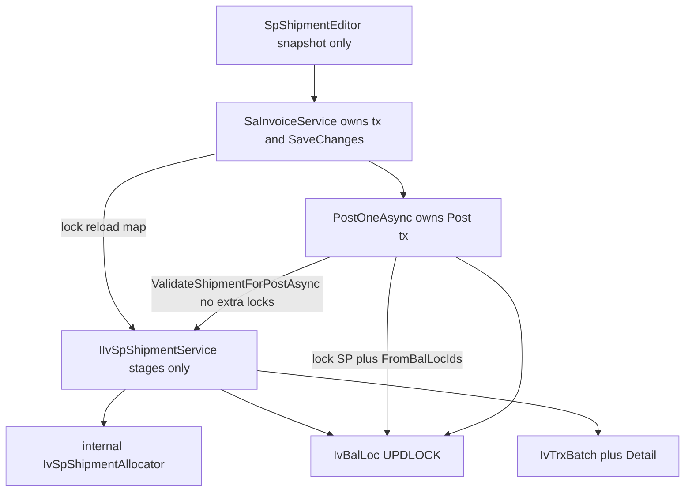

# Shared SP shipment for Invoice now, DO later

Keep the Blazor model: persist `IvTrxBatch` / `IvTrxBatchDetail` (`TrxType=SP`); reduce `IvBalLoc` only on **Post**. Copy V5.5 **rules**, not DataTables.

Work in `c:\wincom\net10projects`. Sources: V5.5 `ShipmentHelper.cs` / `SPShipment.ascx.cs`, and [ErpWeb.Core/Sales/SaInvoiceService.cs](ErpWeb.Core/Sales/SaInvoiceService.cs).

**Phase 3 and Phase 4 are one feature branch / one production rollout.** Do not ship extracted FIFO without reservation.



**Invariant:** persisted SP NEW = reservation → lock affected slices → reservation-aware FIFO from post-lock data → replace atomically → Post locks then validates → deduct and POSTED in one commit. Never commit a partial batch/detail/balance state.

Workspace source of truth: [plans/shared_sp_shipment.md](plans/shared_sp_shipment.md). The locked contracts below match that file.

## Locked decisions (do not reopen)

- Reservation SUM joins `batch.Id = detail.BatchId` and filters write-scope tenant on **both** sides: `CompanyCode`, `BranchCode`, **`LocationCode`** (`TryWriteScope`), plus `TrxType = SP` and `BatchStatus = NEW`.
- No set-based UPDLOCK helper. Unlock discovery → lock each id via `LockBalLocByIdForTenantAsync` in `IvStockSliceKey` order → reload → SUM → allocate.
- Do not expand the lock set mid-transaction. Lock `releasedIds ∪ candidateIds` where candidates use **`IvSpFifoEligibility.MatchesCandidate`**. Add and Post share this predicate.

## IvSpFifoEligibility.MatchesCandidate (lock this list)

This **is** the `LoadFifoPilesAsync` WHERE clause in [SaInvoiceService.cs](ErpWeb.Core/Sales/SaInvoiceService.cs). Copy it. **Do not add, omit, or weaken any condition.** There are no other eligibility filters on that query.

```
row.CompanyCode == company
&& row.BranchCode == branch
&& row.ICode == iCode
&& row.WhCode == warehouse              // invoice line FrWarehouse
&& row.LocationCode == location         // tenant site TryWriteScope; NOT bin LocCode
&& row.StdQty > 0
&& row.IStatus == IvItemStatuses.Active // "ACTIVE"
&& row.TransDate != null
&& row.TransDate <= docDate             // invoice InvDate.Date
```

Not in the predicate: `StockControl` (invoice-line `IsShipmentRequired` only), bin `LocCode`/`LotNo` as discovery filters, qty-prefix.

FIFO **order** is separate: `TransDate`, `LotNo`, `Id`.

`MatchesPersistedDetail` = `MatchesCandidate` plus SP detail identity match (`ICode`, `FrWarehouse`/`WhCode`, `FrLocation`/`LocCode`, `FrLotNo`/`LotNo`, `IStatus`).
- `releasedIds` = every `FromBalLocId` on rows being replaced or deleted, even if no longer FIFO-eligible.
- Add/overwrite is atomic at replacement level. Allocated lines persist; failed lines are per-line errors and are not persisted. Old details removed only in the successful replacement tx. Hard fail rolls back original reservation.
- Edit APPLY never persists a partial line. Submitted `SUM(IssueQty)` must equal persisted `StdQty`; else `QtyDoesNotMatchLineStdQty` and existing reservation remains.
- `PostOneAsync` locks SP batch and all `FromBalLocId`s before `ValidateShipmentForPostAsync`. Validation does no extra locks and no mutation.
- Every SP delete (invoice delete, identity-edit, customer-change) locks `releasedIds` first.
- Reservation is SP-vs-SP only.
- `IsShipmentRequired` is invoice-line `StockControl && StdQty > 0`. **Not** a `LoadFifoPilesAsync` filter.
- `CurrentAvailableQty` uses `IvQty.Round` (4 dp, AwayFromZero).
- `Succeeded` means the operation committed, not that all stock was allocated. CreateOrReplace may be `Succeeded = true` + `HasIncompleteLines = true` → `ShipmentComplete = false`.
- `IvSpValidatePostResult` is internal; map onto existing `PostOneAsync` Failed strings. No new Post ST codes.
- Extend `IvBalLocLockResult` with `LocationCode` and `TransDate`.
- If `PostStockOutInTransactionAsync` reacquires the same rows in the same `IvStockSliceKey` order, retain that. Do not change its lock order.

## Reservation SUM SQL

```sql
SUM(detail.FrStdQty)
FROM IvTrxBatchDetail detail
JOIN IvTrxBatch batch ON batch.Id = detail.BatchId
WHERE detail.CompanyCode  = @company
  AND detail.BranchCode   = @branch
  AND detail.LocationCode = @location
  AND detail.FromBalLocId = @balLocId
  AND batch.CompanyCode   = @company
  AND batch.BranchCode    = @branch
  AND batch.LocationCode  = @location
  AND batch.TrxType       = 'SP'
  AND batch.BatchStatus   = 'NEW'
```

## Ownership

Shipment service never begins/commits/rolls back and never calls `SaveChanges`. Caller owns tx and persistence.

## Tests to add

Two-tenant `LocationCode` isolation; lock-order; stale Post (other SP reserves 6 before this Post locks); no-candidate `ST000051` with `Succeeded = true`; overwrite of FIFO-ineligible old lot still in `releasedIds`; edit overlapping Lot A 4→6 excludes old 4 from SUM; edit short submit 8 of 10 fails; stale APPLY `CurrentAvailableQty = 4`; rollback quintet; idempotent CreateOrReplace.

## Out of scope

Post rewrite of MI/TR/SC/ADJ, catch-weight, LIFO, Save+ship one tx, DO screens, Phase 3 without Phase 4, unique index on `(BatchId, SoLineNo, FromBalLocId)`.
