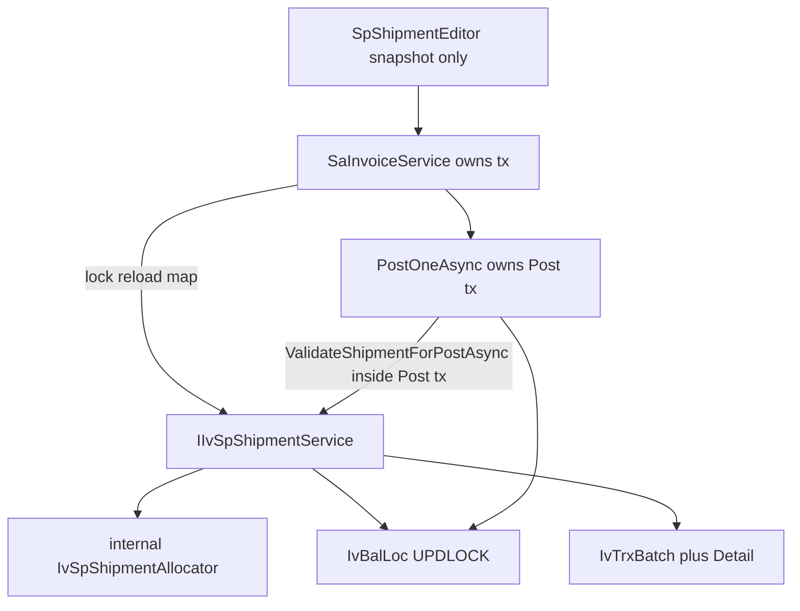

# Shared SP shipment for Invoice now, DO later

Keep the Blazor model: persist `IvTrxBatch` / `IvTrxBatchDetail` (`TrxType=SP`); reduce `IvBalLoc` only on **Post**. Copy V5.5 **rules**, not DataTables.

Work in `c:\wincom\net10projects`. Sources: [ShipmentHelper.cs](c:\wincom\ERPV55\ERP_5.5\ERPCommonUI\SalesForms\HelperClass\ShipmentHelper.cs), [SPShipment.ascx.cs](c:\wincom\ERPV55\ERP_5.5\ERPCommonUI\SalesForms\Controls\SPShipment.ascx.cs), [SaInvoiceService.AddShipmentAsync](c:\wincom\net10projects\ErpWeb.Core\Sales\SaInvoiceService.cs).

**Phase 3 and Phase 4 are one feature branch / one production rollout.** Do not ship the extracted FIFO without reservation.



**Invariant (end-to-end):**

```
Persisted SP
  → NEW = reservation
  → lock affected stock slices
  → reservation-aware FIFO (post-lock data only)
  → replace shipment atomically
  → Post validates under the Post transaction (same reservation model)
  → Post physically deducts stock AND marks SP POSTED in one commit
  → NEW → POSTED
```

A partially transitioned batch/detail/balance state must **never** be committed.

**Review 4 decisions (do not reopen):**

- Reservation SUM **must** `JOIN IvTrxBatch` on `batch.Id = detail.BatchId` and filter tenant/type/`NEW` on **batch and detail**. There is no `IvTrxBatch.BatchId` column; PK is `Id`.
- No set-based “select eligible FIFO with UPDLOCK” helper exists. Pattern is: unlocked discovery → lock **each** id via `LockBalLocByIdForTenantAsync` in `IvStockSliceKey` order → reload → SUM → allocate.
- **This slice does not expand the lock set mid-transaction.** Lock the **complete** eligible FIFO pile set (all ACTIVE matching ICode+WH, not a qty prefix). If lot C is needed, it was already in that set. If still short after re-eval → `ST000051`/`ST000059`; caller retries Add. A later expand, if ever added, must merge ids, **re-sort the full union**, then lock only not-yet-locked ids in that order (never lock C before A).
- `ValidateShipmentForPostAsync` uses the **same** SUM (exclude this document’s NEW SP) plus one-batch / eligibility / no duplicate lot-per-line / completeness.
- Delete/cancel invoice **is** the reservation-release transaction: lock balances → delete SP → commit.
- GetEdit 10 → other NEW SP takes 6 → APPLY 8 must fail with available 4.

---

## Verified facts

- V5.5 and current Blazor do **not** reserve unposted SP. This plan **adds reservation** because Blazor persists SP immediately.
- One SP batch per invoice: `LockSpBatchByInvoiceRefAsync`. Extra batches throw.
- Balance locks: [LockBalLocByIdForTenantAsync](c:\wincom\net10projects\ErpWeb.Model\Repositories\Inventory\IvStockPostingRepository.cs) — raw SQL `UPDLOCK, HOLDLOCK`. **Do not** emulate with EF LINQ.
- Post lock order: `IvStockSliceKey` then `OrderBy(kv => kv.Value)` ([IvStockSliceKey](c:\wincom\net10projects\ErpWeb.Model\Repositories\Inventory\IvStockSliceKey.cs)).
- Detail FK: `IvTrxBatchDetail.BatchId` → `IvTrxBatch.Id` (`OnDelete Restrict`). Reservation JOIN uses **`batch.Id = detail.BatchId`** (not BatchNo alone).
- `IvBalLoc.Id` is identity PK; still filter Company/Branch on both batch and detail.
- `StdQty = Qty * StdPackSize` on **server** at invoice save. **`FrStdQty` is the canonical reservation quantity.** Never subtract selling `Qty`. Edit must not trust client `StdPackSize` / client-recalculated StdQty.
- `IvQty.Round` = 4 dp, `AwayFromZero`. `FrStdQty` precision 18,4.
- IStatus this slice: **ACTIVE only**. FIFO only. No LIFO.
- FIFO order: `TransDate, LotNo, Id`.
- Generate `BatchNo` only after required lines exist. Empty-header number gaps **acceptable**.
- Indexes: no `FromBalLocId` on detail today. Phase 1 inspect aggregation plan; add index only if needed. Do not add speculative indexes.
- Optional P2: unique `(BatchId, SoLineNo, FromBalLocId)` if schema/replacement semantics allow; **not required** if validation already forbids duplicates.
- Catch weight / LIFO / Save+Add one tx / DO screens: out of scope.

---

## 0. Transaction ownership

**One owner per operation. Shipment service never `BeginTransaction`.**

| Operation | Owner | Shipment |
|---|---|---|
| Add / overwrite | `SaInvoiceService.AddShipmentAsync` | `CreateOrReplaceShipmentAsync(db, command)` |
| Edit APPLY | `SaInvoiceService` wrapper | `ReplaceShipmentLineAsync(db, command)` |
| Cancel / delete invoice (releases SP) | `SaInvoiceService.DeleteAsync` (or equivalent) | Same lock-before-delete protocol |
| Post | `PostOneAsync` | `ValidateShipmentForPostAsync(db, …)` **PURE VALIDATION — NO DATABASE MUTATION** |

Invoice save and add shipment stay separate UI requests.

**Post atomicity:** `NEW → POSTED` and `DecreaseBalLocQty` occur in **the same Post transaction**. Never commit POSTED without the deduction, or deduction without POSTED.

**Cancel/delete reservation release:** lock affected `FromBalLocId`s (slice-sorted) **before** deleting/cancelling SP details. Same invariant as Add/Edit writes. Otherwise cancel races with another Add.

---

## 1. Reservation SUM (explicit join)

Conceptual query (use real FK if names differ; today `BatchId` → `IvTrxBatch.Id`):

```sql
SUM(detail.FrStdQty)
FROM IvTrxBatchDetail detail
JOIN IvTrxBatch batch ON batch.Id = detail.BatchId
WHERE detail.CompanyCode = @company
  AND detail.BranchCode  = @branch
  AND detail.FromBalLocId = @balLocId
  AND batch.CompanyCode  = @company
  AND batch.BranchCode   = @branch
  AND batch.TrxType      = 'SP'
  AND batch.BatchStatus  = 'NEW'
```

Do **not** SUM details without joining/filtering the batch tenant/type/status.

```
available = locked.IvBalLoc.StdQty − that SUM
            (excluding details this transaction will replace)
```

| Invoice | SP batch | Reservation? |
|---|---|---|
| NEW | NEW | Yes |
| POSTED | POSTED | No |
| CANCELLED / deleted | CANCELLED / deleted | No |
| mismatch NEW/POSTED | Fail; do not commit |

Exclude while old rows still exist:

- Add overwrite: all details of this document’s SP batch
- Edit one line: this doc + `SoLineNo = edited line`

---

## 2. Lock protocol + post-lock authority (P0)

**Invariant:** any SP insert/delete that changes reserved qty for a `FromBalLocId` first locks that `IvBalLoc` via `LockBalLocByIdForTenantAsync`.

**Pre-lock data is discovery only.** No quantity, IStatus, eligibility, or reservation total computed **before** the balance lock is authoritative. Reload locked rows, then decide.

### Add candidate set (avoid unlocked-FIFO race)

Do **not** lock only the first N lots that appear to cover `StdQty`.

**Lock the complete eligible FIFO set** for each required line’s `ICode + FrWarehouse` (tenant, `StdQty>0`, `TransDate<=doc date`, `IStatus=ACTIVE` at discovery), union `releasedIds`, then:

```
provisional candidateIds   // unlocked query = discovery only
allBalanceIds = distinct(releasedIds ∪ candidateIds)
              .OrderBy(IvStockSliceKey)   // same as Post
lock all via LockBalLocByIdForTenantAsync
reload locked rows
recompute eligibility + reservation SUM
allocate FIFO from the locked+reloaded set
```

If after re-eval the locked set cannot fill a line → `NoStock` / `Insufficient`. **Do not expand the lock set in the same attempt** (avoids lock-order inversion / deadlock). User retries Add (rediscovery). Missing a pile inserted after discovery is acceptable (no over-allocate).

### Global order (do not reorder)

1. Lock invoice + RowVersion
2. Reload header/details; command from this snapshot (`StdQty` from DB, not client pack size)
3. Lock SP batch
4. Load current SP details
5. Provisional FIFO discovery (Add) or submitted ids (Edit) + released ids
6. Distinct ∪, `IvStockSliceKey` sort, **lock all**
7. Reload locked balances
8. Reservation SUM (join above; exclude replacement set)
9. Allocate / edit checks on **post-lock** data only
10. Delete old details
11. Insert new details
12. SaveChanges + commit

### Add overwrite

```
lock union(old lots, full eligible FIFO set)
  → SUM excluding this document’s SP
  → delete old details
  → allocate from post-lock pool (Line ascending)
  → insert
```

---

## 3. Batch identity

One NEW SP batch per `Company+Branch+SP+RefNo=DocNo`.

---

## 4. Public contract

```
IIvSpShipmentService
  CreateOrReplaceShipmentAsync(db, command)
  GetShipmentEditAsync(db, query)          // UI SNAPSHOT ONLY
  ReplaceShipmentLineAsync(db, command)
  ValidateShipmentForPostAsync(db, query)  // PURE VALIDATION — NO DATABASE MUTATION
```

Private `IvSpShipmentAllocator` OK. No extra public interfaces.

### ValidateShipmentForPostAsync (inside Post tx)

Same reservation model as Add/Edit:

- Exactly one NEW SP batch for the invoice; every detail `BatchId` is that batch; no orphans
- Required lines: `SUM(FrStdQty) == persisted StdQty` (`IvQty.Round`)
- Per line: no duplicate `FromBalLocId`
- Each detail still eligible vs **locked/reloaded** `IvBalLoc` (ICode/WH/Loc/Lot/`ACTIVE`)
- Per pile: `FrStdQty` of **this** batch ≤ `physical StdQty − other NEW SP` (exclude this document’s own reservation). Physical deduction still happens only in Post’s decrease step
- No mutation

### Duplicate `FromBalLocId` scope

| Scope | Allowed? |
|---|---|
| Same document **line** (`SoLineNo`), same `FromBalLocId` twice | **No** (submit and persist) |
| Same document, **different lines**, same `FromBalLocId` | **Yes** — shared pool, Line ascending |
| Duplicate submitted ids on Edit | **No** |

Enforced in the service, not only UI.

### LineStatus / lot fails / numeric

Unchanged: `NoStock` vs `Insufficient` (`ST000051`/`ST000059`); `StaleQuantity` vs `LotNoLongerEligible`; `IssueQty` 18,4; line total vs **persisted** `StdQty` only.

Edit requested stock qty = persisted invoice `StdQty`. Client `IssueQty` validated against that. No client `StdPackSize`.

### Add vs Edit

Two-step overwrite + RowVersion. GetEdit never feeds APPLY on-hand.

Edit APPLY: lock invoice → reload line → current SP → lock union(old, submitted) → post-lock editable available → replace that `SoLineNo`.

---

## 5. Eligibility

`IsShipmentRequired`: `StockControl && StdQty > 0 && not LinkDo`. Persisted rows under lock.

---

## 6. FIFO

From **reloaded locked** piles only. Order `TransDate, LotNo, Id`. Shared pool in persisted `Line` order.

---

## 7. Invoice adapter / UI / DO

Invoice: lock, reload, map, shipment `(db)`, SaveChanges, commit.

Delete invoice: same balance-lock protocol before SP delete.

UI: thin. GetEdit snapshot. APPLY fail if another NEW SP reserved the lot meanwhile (`StaleQuantity` / current available). Do not auto-wipe unsaved input.

DO later: same service.

---

## 8. Implementation order

1. Verify FK/indexes/plan.
2. Contracts.
3–4. Same branch: FIFO + reservation + lock protocol + cancel/delete release locks.
5. Invoice adapter.
6. Edit.
7. UI.
8. Tests.

---

## 9. Tests

Keep existing FIFO / post / rollback.

Add:

- Tenant isolation
- Opposite lock order → no deadlock
- NEW+NEW reserves; POSTED+POSTED does not; mismatch fails
- Post: deduction + POSTED one commit (hook failure → neither)
- Cancel/delete: reservation gone; concurrent Add cannot use cancelled qty incorrectly
- Duplicate `FromBalLocId` on one line rejected; two lines may share a lot via pool
- `FrStdQty` not `Qty`
- Overwrite/edit replace reservation
- Forced SaveChanges failure → original intact
- Line 6+6 vs lot 10 → 6 then 4
- **GetEdit shows 10; other invoice reserves 6; APPLY 8 → fail with CurrentAvailableQty 4** (reservation between snapshot and APPLY)

---

## Out of scope

Post rewrite, catch-weight, LIFO, extra UOM engine, Save+ship one tx, DO screens, Phase 3 without Phase 4, required unique index on `(BatchId, SoLineNo, FromBalLocId)`.
