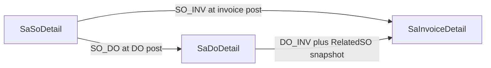

# ErpWeb SO / DO / Invoice Allocations

Port the invariants from [plans/so_do_invoice_allocations_dd795fa4.plan.md](plans/so_do_invoice_allocations_dd795fa4.plan.md) onto this Blazor stack. Do **not** implement WebForms files (`DocApplicationHelper`, `AdPara`, `vgridSO`, `OPEN`).

**Always-on.** No feature flag. After deploy, `SaDocApplication` is the only author of document relationships and applied qty. `DeliveredQty` / `InvoicedQty` / `ShippedQty` / `BalanceQty` / dual statuses are projections.



## Compatibility contract

Keep writing existing columns so current grids/reports still work:

- `DeliveredQty` = `SUM(SO_DO.AppliedQty)` for that SO line
- `InvoicedQty` = `SUM(SO_INV)` + `SUM(DO_INV where RelatedSO* = that SO line)`
- `ShippedQty` = `DeliveredQty` (so existing `CK_SaSODetail_BalanceQty` stays valid)
- `BalanceQty` = `OrderQty - DeliveredQty` (remaining **deliverable**; no `ReturnQty` column in this app)
- Keep `SoConsumedQty` on DO/invoice details as a denormalized copy of that line’s `AppliedQty` (display/debug only; reverse reads allocation rows)

**Intentional behavior change:** direct invoice no longer increments `ShippedQty`. A fully invoiced, never-delivered SO stays `NEW` with `BillingStatus=FULL`, `FulfillmentStatus=NONE`. Header `CLOSED` + `FULLY_CONSUMED` only when remaining deliverable **and** remaining billable are both 0.

## P0 — Transaction ownership

`SaDoService` / `SaInvoiceService` owns the transaction. `ISaDocApplication` is a participant, not a unit-of-work.

- Allocate / Reverse / Recalculate take the **caller’s** `AppDbContext` (already inside `BeginTransaction`).
- `ISaDocApplication` **MUST NOT** `CreateDbContext`, `BeginTransaction`, `Commit`, or `Rollback`.
- It **MUST NOT** call `SaveChanges` unless the caller has not yet done so and the method is documented as flushing tracked graphs — preferred: mutate tracked entities + insert rows; caller `SaveChanges` + `Commit` once.
- On validation/unique/recalc failure: return a fail result; **caller** rolls back the whole TX (target persist + allocations + projections + SP).
- All allocation, projection, posting, and rollback mutations for one document occur in **that same** transaction. No orphan target, no orphan allocation, no projection drift.

## P0 — Locking / transaction implementation

Do **not** use the WebForms plan’s SO-then-DO order. Today DO post already locks **DO header then SO headers**. Invoice-from-DO must match.

**Discover the complete affected DO/SO key set before acquiring any additional source locks.** Do not discover more source documents after partially acquiring locks.

1. Caller locks **target** document (`UPDLOCK, HOLDLOCK` via existing `LockForUpdateAsync`).
2. From the in-memory target lines (already loaded), **collect the full** source DO key set and source SO key set. RelatedSO for `DO_INV` is taken from each DO line’s frozen `SoNo`/`CustRel`/`SoLine` on those keys — still part of discovery, not a later walk.
3. Sort all additional DO keys (`DoNo` ascending); lock each (`UPDLOCK, HOLDLOCK`); skip the target if it is already that DO.
4. Sort all SO keys (`SoNo` ascending, `SaSoLockOrder`); lock each.
5. One batched SUM remaining from `SaDocApplication` for the locked keys.
6. Validate `AppliedQty <= remaining` (never clamp). Persist target lines if not already persisted in this TX.
7. Insert allocation rows. Unique source→target collision **or** target-line unique collision → **fail closed**; caller rolls back the whole transaction. Never upsert, never convert a collision into a successful retry, never treat it as idempotent apply of extra qty.
8. `RecalculateAffectedLines` (batched) + header statuses (same service).
9. Caller continues SP/stock work, then `SaveChanges` + `Commit`.

If a line’s source document is missing at discovery time, fail before any extra locks. Header locks serialize a document. 70+50 on the same SO/DO is handled by that plus the two unique keys below.

## P0 — Invariant classification

**Database-enforced**

- PK on `SaDocApplication.Id`
- `NOT NULL` on Company/Branch, doc type/id/line keys, RelatedSO*, AppliedQty
- `CHECK (AppliedQty > 0)`
- Unique source→target pair
- Unique **target line** (merge forbidden)

**Transaction/service-enforced** (not CHECK constraints)

- Company/branch isolation (scope from auth, never from client body as tenant)
- Document/business authorization (see below) — tenant visibility is **not** sufficient
- Customer/currency compatibility
- Same selling UOM (no conversion)
- Standalone DO cannot be a `DO_INV` source
- Line ownership
- Status eligibility matrix
- Remaining quantity caps
- Line immutability after allocation
- Document/line delete lifecycle
- RelatedSO snapshot consistency (copy at insert; never update)
- Projection equality after every mutation
- Split/merge cardinality beyond the unique keys (split is allowed because there is **no** unique on source-line-only)

UI pickers are untrusted. Allocate* re-validates company, branch, customer, currency, UOM, ownership, status, and remaining qty on the server.

## P0 — Authorization vs tenant isolation

Tenant isolation (`CompanyCode`/`BranchCode` from `ValidateUserContext` / `TryWriteScope`) is necessary and **not sufficient**.

Every `Allocate*`, `Reverse*`, `Post*`, `Save*`, and `Delete*` path must also enforce the **document-level business permission** already used by that document’s service (same `IAccessRights.CanAsync` + `MenuCodes` + `PermissionCodes` as today):

- SO save/delete/force-close: `MenuCodes` sales order + EDIT / DELETE / CLOSE
- DO post/rollback/save/delete: sales delivery order + POST / ROLLBACK / EDIT / DELETE
- Invoice post/rollback/save/delete: sales invoice + POST / ROLLBACK / EDIT / DELETE

`ISaDocApplication` does **not** re-check menus (it has no user UX). The **caller** (`SaSoService` / `SaDoService` / `SaInvoiceService`) must have already authorized the operation before entering the TX. Implementation must not add a new Allocate path that skips `CanAsync`. Denied permission → existing `Authorization` fail shape; wrong company/branch → `NotFound` (unchanged).

## P1 — Quantity / UOM semantics (Phase 1)

Allocation qty is the **same measure** on source and target. No conversion.

- Use selling qty already stored on the line (`SaSoDetail.OrderQty` / `SaDoDetail.Qty` / `SaInvoiceDetail.Qty`), rounded with existing `SaSoQty.RoundQty` (4 dp, AwayFromZero).
- Source and target **SellingUom must match** (same rule as today’s `SaSoFulfillment` UOM check). Empty/null UOM on both sides is treated as equal.
- Do **not** convert StdQty / pack size / WtQty into allocation qty. `AppliedQty` is selling qty.
- StdQty/SP posting stays on the inventory path and is independent of the ledger.
- If UOM conversion is needed later, that is a new change stream — do not invent it in Phase 1.

## Status mapping (do not import WebForms names)

- SO stays `NEW` / `SHIPPED` / `CLOSED`. Add `FulfillmentStatus` and `BillingStatus` (`NONE` / `PARTIAL` / `FULL`).
- `SHIPPED` = any `DeliveredQty > 0` and not both-full. Billing-only does **not** set `SHIPPED`.
- `CLOSED` + `FULLY_CONSUMED` = both remainings 0. `FORCE_CLOSED` unchanged; no new allocations or reverse from force-closed SO.
- DO stays `NEW` / `POSTED` / `CLOSED`. **`CLOSED` remains Force Close**, not “fully invoiced”. Add `BillingStatus` on `SaDo` instead. No DO `PARTIAL` status.
- Invoice stays `NEW` / `POSTED`.
- Eligible sources: SO `NEW` or `SHIPPED` (not `CLOSED`). DO `POSTED` only for `DO_INV` (not Force-Closed). Invoice `NEW` is the allocation target during that post TX only; already-`POSTED` retry fails before Allocate.

## P0 — Allocation cardinality (Phase 1)

**Split OK. Merge forbidden.**

Legal:

- One SO line → many DO lines / many invoice lines (`SO 100` → DO 60 + DO 40, or INV 60 + INV 40)
- One DO line → many invoice lines (`DO 100` → INV 60 + INV 40)

Illegal:

- Many SO lines → one invoice line
- Many DO lines → one invoice line
- Many SO lines → one DO line

Enforced by unique `(CompanyCode, BranchCode, TargetDocType, TargetDocId, TargetLineId)` plus Allocate* rejecting a second source for the same target line. Unique source+target pair still blocks duplicate apply of the same pair.

Phase 1 invoice mix: one invoice is **all** `SO_INV` or **all** `DO_INV`, not mixed. `LinkDo=false` → `SO_INV`. `LinkDo=true` → `DO_INV` + RelatedSO snapshot. Never both for one line.

## P0 — Qty mutation after allocation

Reject, never clamp.

- SO save/update: `OrderQty >= DeliveredQty` **and** `OrderQty >= InvoicedQty` (equivalently `OrderQty >= SUM(SO_DO)` and `OrderQty >= SUM(SO_INV)+SUM(DO_INV by RelatedSO*)`). Example: SO 100, DO 80 → OrderQty 50 **fails**.
- DO save/update: `Qty >= SUM(DO_INV)` for that line. Example: DO 100, invoice 80 → Qty 50 **fails**. Posted DO is already not editable; keep this on any save path as defense in depth (including if a later slice allows header-only posted edits).
- Invoice line qty on `NEW` is unconstrained by allocations (none exist yet). After post, qty/line edit is forbidden while allocations exist.
- Reduce allocated qty in place is **forbidden** — rollback the target document instead.

## P0 — Delete / line lifecycle

- **NEW** document, **no** allocation rows: header and lines may be deleted (today’s SO NEW / DO NEW / Invoice NEW delete).
- **Allocated line** (any `SaDocApplication` row with that line as source or target): **cannot be deleted**.
- **Posted** DO / Invoice: **cannot be deleted** (unchanged). Rollback first.
- **SO** with any `SO_DO` or `SO_INV`/`DO_INV` RelatedSO* row: **cannot be deleted**. Extend today’s “referenced by DO” check to allocation rows (covers direct-invoice-only SOs).
- **Rollback:** reverse allocations first (collect all distinct SO + DO keys from the rows, delete allocations, recalc, then stock reverse). Then the document is `NEW` and may be edited or deleted.
- **Force-closed SO / Force-closed DO:** no new Allocate; no Reverse (existing force-close rule).

If an implementation ever allows deleting a NEW target line that somehow has allocations, that is a bug — allocations are written only at post.

## 1. Schema

Add [scripts/create-sadocapplication.sql](scripts/create-sadocapplication.sql) and [scripts/alter-saso-allocation-columns.sql](scripts/alter-saso-allocation-columns.sql) (manual DBA, same pattern as [scripts/create-saso.sql](scripts/create-saso.sql)).

**`SaDocApplication`**

- `Id` identity PK
- `CompanyCode`, `BranchCode` required; every query filters both
- `SourceDocType`, `SourceDocId`, `SourceCustRel`, `SourceLineId`
- `TargetDocType`, `TargetDocId`, `TargetCustRel`, `TargetLineId`
- `RelatedSONo`, `RelatedCustRel`, `RelatedSOLine` — required; for `SO_DO`/`SO_INV` copy source SO identity; for `DO_INV` snapshot DO line’s SO identity **at insert and never update**
- `AppliedQty` `CHECK (AppliedQty > 0)`, decimal(18,4)
- `AppliedAmount` nullable snapshot of target line `NetAmount`; not used in remaining/status math
- `Created`, `CreatedUID`

Doc type constants: `SO`, `DO`, `INV`. SO `CustRel` is always `1` in this app; DO/INV **source or target** uses `CustRel = 0`.

**P1 — Target-line identity:** Phase 1 targets are only `DO` and `INV`. Those documents have **no revision**. `TargetDocId + TargetLineId` uniquely identifies a target line regardless of `TargetCustRel`. Therefore `UQ_SaDocApplication_TargetLine` does **not** include `TargetCustRel`. Allocate* always writes `TargetCustRel = 0` for DO/INV. If SO ever becomes an allocation target, `TargetCustRel` **must** be added to that unique key before that slice ships. Do not silently treat two SO revisions as one target line.

**Exact keys / indexes** (names required):

- `UQ_SaDocApplication_SourceTarget` UNIQUE `(CompanyCode, BranchCode, SourceDocType, SourceDocId, SourceCustRel, SourceLineId, TargetDocType, TargetDocId, TargetLineId)`
- `UQ_SaDocApplication_TargetLine` UNIQUE `(CompanyCode, BranchCode, TargetDocType, TargetDocId, TargetLineId)` INCLUDE (`AppliedQty`, `RelatedSONo`, `RelatedCustRel`, `RelatedSOLine`, `SourceDocType`, `SourceDocId`, `SourceLineId`, `TargetCustRel`)
- `IX_SaDocApplication_Source` `(CompanyCode, BranchCode, SourceDocType, SourceDocId, SourceCustRel, SourceLineId)` INCLUDE (`AppliedQty`, `TargetDocType`, `TargetDocId`, `TargetLineId`)
- `IX_SaDocApplication_RelatedSO` `(CompanyCode, BranchCode, TargetDocType, RelatedSONo, RelatedCustRel, RelatedSOLine)` INCLUDE (`AppliedQty`) — InvoicedQty SUM for `DO_INV` without joining live `SaDODetail`

Target unique already covers target-line lookup; do not add a redundant nonclustered target index with the same keys.

**`SaSO`:** `FulfillmentStatus`, `BillingStatus` nvarchar(10).

**`SaSODetail`:** `DeliveredQty`, `InvoicedQty` decimal(18,4) default 0. Keep `CK_SaSODetail_ShippedQty` and `CK_SaSODetail_BalanceQty`.

**`SaDO`:** `BillingStatus` nvarchar(10) default `NONE`.

**`SaInvoiceDetail`:** `DoNo` nvarchar(30) not null default `''`, `DoLine` smallint null. Header `DoNo` stays the invoice’s own number field — do not overload it.

### Backfill (idempotent)

Same scripts. **Rerun-safe.** Do not delete-and-rebuild.

1. Insert `SO_DO` from posted SO-linked DO lines (`AppliedQty` = `SoConsumedQty` if > 0 else `Qty`) **only if** the unique source+target key does not exist.
2. Insert `SO_INV` from posted invoices with `SoNo` and `LinkDo=0` if missing.
3. Insert `DO_INV` from posted `LinkDo=1` (should be none) with RelatedSO* from the DO line at backfill time, if missing.
4. Skip violators (over-qty, missing source, both SO_INV and DO_INV for one invoice line, standalone DO used as invoice source). Do **not** abort remaining inserts.
5. For every skip, insert one row into `SaDocApplicationBackfillSkip` (durable audit, not PRINT-only): `CompanyCode`, `BranchCode`, `DocType`, `DocId`, `Line`, `ViolationCode`, `Reason`, `SourceValues` (nvarchar, compact), `TargetValues` (nvarchar, compact), `CreatedUtc`. Unique `(CompanyCode, BranchCode, DocType, DocId, Line, ViolationCode)` so rerun does not duplicate skip rows.
6. Recalc projections for every SO/DO that has allocations **or** non-zero Delivered/Invoiced/Shipped.

Acceptance: run #1 produces expected allocation rows; run #2 inserts **zero** new allocations **and** zero new skip rows; run #2 leaves **identical** projections and statuses. Standalone DO (`SoNo` empty) writes **no** `SO_DO`.

## 2. Domain service

New `ISaDocApplication` in [ErpWeb.Core/CoreServiceCollectionExtensions.cs](ErpWeb.Core/CoreServiceCollectionExtensions.cs).

**Status / projection ownership (not an implementation choice):** `ISaDocApplication` owns allocation, reversal, projection recalculation, **and** header status derivation (`FulfillmentStatus`, `BillingStatus`, SO `NEW`/`SHIPPED`/`CLOSED`, DO `BillingStatus`). Move `RecalculateStatus` into this service. [SaSoFulfillment](ErpWeb.Core/Sales/ISaSoFulfillment.cs) becomes a compatibility facade that delegates to Allocate/Reverse, or is **removed** once `SaDoService` / `SaInvoiceService` call Allocate* only. Do not leave two types able to compute the same business state.

**Public API (semantic, not a generic ValidateAllocation):**

- `AllocateSOToDO`
- `AllocateSOToInvoice`
- `AllocateDOToInvoice`
- `ReverseDocumentAllocations(targetType, targetId)` — collect **all** distinct SO + DO keys from the rows **before** delete, then batched recalc
- `RecalculateAffectedLines(soKeys, doKeys)` — public only for backfill/tests; posting uses it internally

Internal engine (not public): a strongly typed `AllocationRequest` (`Source`, `Target`, `SourceLine`, `TargetLine`, `AppliedQty`, `RelatedSO`). Shared validate/lock/sum/insert/recalc. Do **not** expose `ValidateAllocation(...)` on the interface.

**N+1 prohibition:** `RecalculateAffectedLines` MUST NOT run one aggregation per SO/DO line. Batch affected keys and compute set-wise:

- one grouped SUM `SO_DO` for the SO key set
- one grouped SUM `SO_INV` for the SO key set
- one grouped SUM `DO_INV` by RelatedSO* for the SO key set
- one grouped SUM `DO_INV` by DO line for the DO key set

Then assign projections on tracked entities. Performance acceptance: one invoice spanning many DOs / many SO lines → those four aggregations (constant query count), not N.

**SQL execution-plan acceptance (SQL Server tests, not in-memory):** verify the four projection aggregation queries use the intended covering/indexed access paths (`IX_SaDocApplication_Source`, `UQ_SaDocApplication_TargetLine`, `IX_SaDocApplication_RelatedSO` as applicable) and do not regress into full-table scans at representative production-scale row counts (seed enough `SaDocApplication` rows that a scan would be obvious in `SET STATISTICS IO` / actual plan `IndexName`). Do not add extra indexes beyond the named set unless a measured plan proves a gap.

Caps (reject, never clamp):

- `SUM(SO_DO) <= OrderQty`
- `SUM(SO_INV) + SUM(DO_INV by RelatedSO*) <= OrderQty`
- `SUM(DO_INV) <= DO.Qty`
- `AllocateDOToInvoice` checks **both** remaining billable DO and remaining billable RelatedSO
- **Standalone DO cannot be invoiced via `DO_INV`.** `AllocateDOToInvoice` fails closed if the DO line has empty `SoNo` or `SoLine` is not > 0 (no RelatedSO source). Invoice prepare must reject `LinkDo=true` against a standalone DO **before** post. There is no other RelatedSO source in Phase 1.

Projection writer is `RecalculateAffectedLines` only. SO/DO/Invoice save must ignore client `ShippedQty`/`BalanceQty`/`DeliveredQty`/`InvoicedQty`/`FulfillmentStatus`/`BillingStatus`.

Entity + EF config + `DbSet` in [ErpWeb.Model/Data/AppDbContext.cs](ErpWeb.Model/Data/AppDbContext.cs).

## 3. Posting changes

**[ErpWeb.Core/Sales/SaDoService.cs](ErpWeb.Core/Sales/SaDoService.cs)** `PostOneAsync` (~1348): replace `ConsumeAsync` with `AllocateSOToDO` for `HasSoReference` lines. `RollbackOneAsync` (~1549): `ReverseDocumentAllocations(DO, doNo)` instead of `ReverseAsync`. **Lineage freeze:** any attempt to mutate `SaDoDetail.SoNo` / `CustRel` / `SoLine` must be rejected when a **persisted** `SaDocApplication` row exists for that DO line as source or target — not merely because the header is `POSTED`. After full reverse (zero allocation rows), lineage may change again on `NEW`. Inventory/SP path unchanged. Standalone DO still no-ops allocation. Enforce DO Qty floor and allocated-line delete rules on save/delete. Caller must keep existing POST/ROLLBACK `CanAsync` checks.

**[ErpWeb.Core/Sales/SaInvoiceService.cs](ErpWeb.Core/Sales/SaInvoiceService.cs)** `PostOneAsync` (~1301):

- `LinkDo=false` + SO ref → `AllocateSOToInvoice` only
- `LinkDo=true` → `AllocateDOToInvoice` only (copy RelatedSO* from DO line at insert). Reject if the DO line is standalone (no SO identity).
- Never both for one invoice line; merge onto one invoice line forbidden
- Remove `LinkDoNotSupported` in `PrepareLinesAsync` (~1720)
- Already-posted short-circuit before Allocate (existing NEW check)
- `LinkDo` keep-stock lines **skip** SP completeness / second stock-out (stock left on DO post). Non-LinkDo keep-stock still requires shipment
- Mix rule (Phase 1): one invoice is all `SO_INV` or all `DO_INV`, not mixed
- Rollback: reverse allocations first (collect SO+DO keys), then existing stock reverse

**[ErpWeb.Core/Sales/SaSoService.cs](ErpWeb.Core/Sales/SaSoService.cs):** OrderQty floor vs Delivered/Invoiced; cannot delete allocated lines or SOs with allocation rows. Do **not** call `SaSoFulfillment.RecalculateStatus` — status comes only from `ISaDocApplication` after allocation mutations (force-close still sets `FORCE_CLOSED` in `SaSoService` without changing qty).

## 4. Remaining-qty APIs and UI

Split remaining, because `BalanceQty` is deliverable-only after this change:

- DO picker: remaining **deliverable** (`OrderQty - DeliveredQty`) via existing [GetRemainingLinesAsync](ErpWeb.Core/Sales/SaSoService.cs) (keep filtering `BalanceQty > 0`)
- Invoice SO picker: remaining **billable** (`OrderQty - InvoicedQty`) — new `GetBillableLinesAsync` (or a purpose argument)
- Invoice DO picker: posted **SO-linked** DOs for the same customer/currency (exclude standalone); line remaining = `DO.Qty - SUM(DO_INV)`

UI:

- [ErpWeb.UI/Sales/Transactions/SaInvoice.razor](ErpWeb.UI/Sales/Transactions/SaInvoice.razor) + `.cs`: add posted-DO picker; stamp `LinkDo`, `DoNo`, `DoLine`, SO identity from the DO line; SO picker shows billable remaining
- [ErpWeb.UI/Sales/Transactions/SaDo.razor](ErpWeb.UI/Sales/Transactions/SaDo.razor): keep SO picker on deliverable remaining
- [ErpWeb.UI/Sales/Transactions/SaSo.razor](ErpWeb.UI/Sales/Transactions/SaSo.razor) + list: show `DeliveredQty`/`InvoicedQty` and fulfillment/billing % with `OrderQty=0 → 0%`
- Allocate* re-validates customer, currency, and UOM even if the UI filtered

Defer: DocFlow page, Create DO/Invoice buttons on SO list (pickers on DO/Invoice screens are enough).

## 5. Tests

Prefer automated tests in [ErpWeb.Tests](ErpWeb.Tests) (in-memory + existing SQL concurrency project). New `SaDocApplicationTests.cs` plus updates to [ErpWeb.Tests/SaSoServiceTests.cs](ErpWeb.Tests/SaSoServiceTests.cs).

**Allocation**

- SO 100 → DO 100 pass; DO 101 fail; 60+40 pass; 60+50 fail
- SO 100 → INV 100 pass; INV 101 fail
- DO 100 → INV 60 then 40 pass; 60 then 50 fail

**Cross-path / concurrency / rollback**

- INV 60 + DO 40 + DO→INV 40 pass; INV 60 + DO→INV 50 fail
- Concurrent 70+50: one fails, final 70 ([SaInvoiceSqlServerConcurrencyTests](ErpWeb.Tests/SaInvoiceSqlServerConcurrencyTests.cs) pattern)
- Overlapping multi-document concurrency: Invoice A posts DO1=60 + DO2=40 while Invoice B posts DO2=70 + DO3=30. One succeeds; the other fails closed on DO2 remaining; remaining qty on DO1/DO2/DO3 and related SOs match the ledger; lock discovery still sorts the full key set before extra locks. Assert projection oracle after both complete.
- Invoice spanning three DOs/SOs: rollback restores all remainings and statuses
- RelatedSO immutability: recalc uses snapshot, not live `SaDoDetail.SoNo`
- Double post / retry after commit: no duplicate allocation
- Target insert then allocation fail → full rollback (caller TX)
- Allocation insert then recalc fail → full rollback, no projection drift
- Standalone DO still does not touch SO
- Standalone DO + `LinkDo` invoice save/post → fail (`AllocateDOToInvoice` / prepare)
- SellingUom mismatch between SO and DO/INV → fail; matching UOM (including both empty) → pass
- Replace `Invoice_LinkDo_is_not_supported_on_save_or_post` with LinkDo happy path + mix reject
- Invoice post no longer increases `ShippedQty`; DO post still does via `DeliveredQty` projection
- Force-closed SO / Closed DO cannot allocate
- OrderQty=0 dashboard guard if list % is added

**P0 lifecycle**

- SO OrderQty reduced below Delivered or Invoiced → fail
- DO Qty reduced below SUM(DO_INV) → fail
- Delete allocated SO/DO/invoice line → fail
- Delete SO that only has SO_INV (no DO) → fail
- Delete NEW unallocated document → pass
- Many sources onto one target line → fail (merge)
- One source onto many targets → pass (split)

**P0 projection reconciliation** (assert after allocate, reverse, rollback, multi-DO invoice, concurrent post, and backfill):

```
Stored DeliveredQty == SUM(SO_DO.AppliedQty)
Stored InvoicedQty  == SUM(SO_INV) + SUM(DO_INV by RelatedSO*)
Stored ShippedQty   == DeliveredQty
Stored BalanceQty   == OrderQty - DeliveredQty
DO billed           == SUM(DO_INV) for that DO line
```

**P0 backfill:** run script twice in test (or equivalent insert helper); second run inserts 0 allocation rows and 0 new `SaDocApplicationBackfillSkip` rows; projections unchanged. A planted violator produces exactly one skip-audit row on run #1 and none extra on run #2.

**P0 N+1:** one invoice → many DOs → many SO lines uses a constant number of aggregation queries (assert via test spy or SQL logging), not one per line.

**P1 index plans:** SQL Server test seeds a representative `SaDocApplication` volume and asserts the four aggregation queries’ actual plans use the named indexes (no clustered/table scan on `SaDocApplication` as the primary access).

**P1 lock discovery:** Allocate* builds the full DO key list and full SO key list from target lines **before** the first additional `LockForUpdate` (unit-testable on a test double / ordered lock log).

**P1 authz:** Post/Save/Delete/Allocate entry still fail `Authorization` when the menu permission is denied (existing matrix); tenant-only access without POST must not post.

**P1 unique fail-closed:** seed a colliding source→target or target-line row; second insert fails; TX rolls back; qty unchanged.

**P1 lineage freeze:** posted DO with `SO_DO` row: changing `SoNo` on save fails even if a test tampers header status to `NEW` while the allocation row still exists. After rollback (allocations gone), lineage change on `NEW` succeeds.

## Out of this phase

Payments, CDN, sales-return allocations, `ReturnQty`, SO revise/`CustRel` > 1, grouped invoice print, mixing DO-stock + direct SO-stock on one invoice, DocFlow, WebForms clones, allocation archive jobs.

## Build order

1. SQL (CHECK, both uniques, four named indexes/keys, `SaDocApplicationBackfillSkip`) + EF entity/config + projection columns
2. `ISaDocApplication` (caller-owned TX, discover-all-keys-then-lock, AllocationRequest, batched SUM, fail-closed unique, projection **and** status derivation, standalone DO_INV reject, UOM match). Remove or facade `SaSoFulfillment`.
3. SO/DO save qty-floor + delete lifecycle + lineage freeze from persisted allocation rows + keep existing `CanAsync` on every mutation
4. DO post/rollback
5. Invoice `SO_INV` (stop fake shipment) then `DO_INV` + skip SP on LinkDo
6. Remaining APIs + invoice DO picker + SO list dual status
7. Tests: acceptance, projection oracle, N+1, overlapping A/B DOs, index plans, authz, backfill rerun
