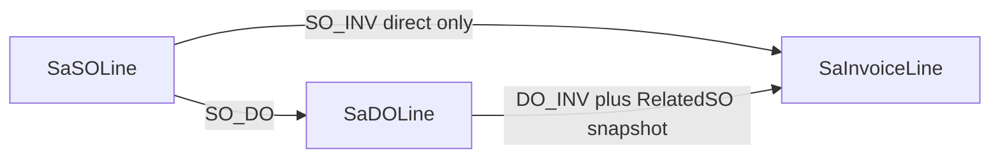

# Phase 1: Independent SO / DO / Invoice Allocations

Retrofit **standard** forms only (`SalesOrderStd`, `DOEntry`, `InvoiceEntry` and their helpers). Company clones (Phletora/MH/etc.) are out of scope. This is a **new change stream** — do not rewrite [docs/SO-Business-Logic-Spec.md](docs/SO-Business-Logic-Spec.md); add a companion spec that contains the invariants below.

Gate all new behavior with `AdPara.UseDocAllocation` (default **false**). Flag off = current `ShippedQty`/`BalanceQty`/`LinkDO` path.



**Canonical source of truth (flag on):** `SaDocApplication` is the only place document relationships and applied quantities are authored. `DeliveredQty`, `InvoicedQty`, `ShippedQty`, `BalanceQty`, `FulfillmentStatus`, `BillingStatus`, and header `Status` are **projections**. They must never be written except by allocation operations (`Allocate*` / `ReverseDocumentAllocations` → `RecalculateAffectedLines`). Posting helpers must not increment `ShippedQty` or `InvoicedQty` directly.

## Compatibility contract

Keep writing existing columns so reports that still read them do not go blank. They are projections, not a second ledger:

- `SaSODetail.DeliveredQty` := `SUM(SO_DO.AppliedQty)` for that SO line
- `SaSODetail.InvoicedQty` := `SUM(SO_INV.AppliedQty)` + `SUM(DO_INV.AppliedQty where RelatedSO* = that SO line)`
- `SaSODetail.ShippedQty` := `DeliveredQty`
- `SaSODetail.BalanceQty` := remaining deliverable (formula below)
- Keep `SaInvoiceDetail.LinkDO`, `DONo`, `DOLine`, `SONo`, `SOLine` as denormalized lineage copies of the allocation just written (UI only; not used to recompute InvoicedQty)

**Intentional behavior change when flag is on:**

- Direct invoice writes **SO_INV** only (no fake shipment)
- Invoice-from-DO writes **DO_INV** only
- Header `CLOSE` only when remaining deliverable **and** remaining billable are both 0 (or force-close)

## Canonical billing representation (no optional path)

| Invoice line origin | Allocation rows written | Not written |
|---|---|---|
| Direct from SO (`LinkDO=false`) | `SO_INV` only | `DO_INV` |
| From DO (`LinkDO=true`) | `DO_INV` only | `SO_INV` |

```
InvoicedQty(SO line) =
    SUM(SO_INV.AppliedQty where Source = that SO line)
  + SUM(DO_INV.AppliedQty where RelatedSONo/RelatedCustRel/RelatedSOLine = that SO line)
```

**P0 — DO_INV → SO mapping must not trust live DO lineage.**

`AllocateDOToInvoice` copies the DO line’s `SONo`/`CustRel`/`SOLine` onto the allocation row as **`RelatedSONo` / `RelatedCustRel` / `RelatedSOLine` at insert time**. Those RelatedSO columns are **never updated**. `RecalculateAffectedLines` and `InvoicedQty` **must SUM using RelatedSO\***, not `SaDODetail.SONo` at query time.

Additionally, once a DO line has any `SO_DO` or `DO_INV` row:

- `SaDODetail.SONo`, `CustRel`, `SOLine` and the DO header `CompanyCode`/`BranchCode` are **immutable**
- Entry/save/post must reject any attempt to change them

Do not duplicate the same qty as both `SO_INV` and `DO_INV`.

**AppliedAmount:** quantity is the **authoritative** allocation measure. `AppliedAmount` is a snapshot of the **target line** amount (`NetAmount` preferred) at allocation time. It is **not** used for remaining qty, status, or invoice-total reconciliation in Phase 1. Discounts, tax, FX, rounding, and price overrides do not create a second amount-allocation ledger.

---

## Allocation invariants and transaction contract

When `UseDocAllocation = true`:

**SO line (reject if violated; never clamp):**

```
SUM(SO_DO.AppliedQty)  <= OrderQty + ReturnQty
SUM(SO_INV.AppliedQty) + SUM(DO_INV.RelatedSO* = this line)  <= OrderQty
AppliedQty > 0
```

**DO line:**

```
SUM(DO_INV.AppliedQty)  <= DO.Qty
```

**Exact formulas**

```
DeliveredQty(SO)     = SUM(SO_DO.AppliedQty)
InvoicedQty(SO)      = SUM(SO_INV) + SUM(DO_INV by RelatedSO*)
RemainingDeliverable = OrderQty + ReturnQty - DeliveredQty
RemainingBillableSO  = OrderQty - InvoicedQty
RemainingBillableDO  = DO.Qty - SUM(DO_INV.AppliedQty)
```

If remaining would go negative, **abort the transaction**. Do not write the allocation. Do not clamp.

`AllocateDOToInvoice` checks **both** `RemainingBillableDO` and `RemainingBillableSO` for the RelatedSO line.

**Over-delivery (required reject):** SO=100, DO=120 fail; DO1=60 then DO2=50 fail.

**ReturnQty (Phase 1):** do not implement sales return. Honor existing `OrderQty + ReturnQty - ShippedQty` sign. Do not write `ReturnQty`.

**Eligible status matrix (single table; all Allocate\* use this, not local guesses):**

| Document | Status | May be **source** of new allocation | May be **target** while posting |
|---|---|---|---|
| SO | `RELEASE`, `SHIPPED`, `OPEN` | Yes (`OPEN` only if that overlay is the current edit lock on the same SO being posted downstream — prefer **reject OPEN** for Convert-from-SO to avoid P1-B races; **Phase 1 rule: reject SO `OPEN`, `CLOSE`, `PENDING`, `CLOSED`**) | N/A (SO is never allocation target in Phase 1) |
| SO | `CLOSE`, `CLOSED`, `PENDING` | No | N/A |
| DO | `NEW` (unposted) | `SO_DO` target during DO **post** only | Target of `SO_DO` at post |
| DO | `POSTED`, `PARTIAL` | Yes — `DO_INV` source | No further `SO_DO` |
| DO | `CLOSED` (fully invoiced) | No new `DO_INV` | No |
| DO | `NEW` after rollback | Same as unposted | — |
| Invoice | `NEW` (being posted) | No | Target of `SO_INV` / `DO_INV` **during that post TX** |
| Invoice | `POSTED` | No | No (already-posted retry must fail before Allocate*) |

**Single transaction:** target persist + allocation insert + projection recalc + status update in the **same** `SqlTransaction` as today’s post. If allocation insert fails or recalc throws: **`ROLLBACK` everything**. No orphan target, no orphan allocation, no projection drift.

**Concurrency:** a plain reload-and-check under READ COMMITTED does **not** stop 70+50.

Required:

```
BEGIN TRANSACTION
  Lock each participating source line in stable order
    SO: SaSODetail (SONo, CustRel, Line)
    then DO: SaDODetail (DONo, Line)
    SELECT ... WITH (UPDLOCK, HOLDLOCK)
  Batched SUM remaining from SaDocApplication
  Validate AppliedQty <= remaining
  Persist target document lines
  Insert allocation rows (unique key collision → fail closed, rollback)
  RecalculateAffectedLines from allocation truth (batched)
  Recalculate header statuses
COMMIT
```

`ROWLOCK` is a **hint**, not a guarantee (lock escalation can occur). The invariant is: **the source rows that determine remaining qty stay protected until COMMIT**. Implementation must confirm actual plans/locks; `UPDLOCK, HOLDLOCK` are required; `ROWLOCK` is optional.

`TrxPostingHelper` is not the over-allocation lock. Lock order: `SONo`,`CustRel`,`Line` then `DONo`,`Line` ascending.

**Idempotency / duplicate post:**

1. Existing `BatchStatusHelper.CheckIsPosted` (or equivalent) **before** Allocate*: posted document → error, no second allocation.
2. Unique key `(CompanyCode, BranchCode, SourceDocType, SourceDocId, SourceCustRel, SourceLineId, TargetDocType, TargetDocId, TargetLineId)` — duplicate insert **fails closed** (do not upsert extra qty).
3. Browser/network retry after successful commit: treated as already-posted, not a new apply.
4. Retry after rollback: new allocations allowed (new post of NEW document).

**Rollback / reversal:**

Collect **all distinct** affected keys **from the allocation rows themselves** (DO sources + RelatedSO* for DO_INV + SO sources for SO_INV) **before** delete. Then:

```
Delete allocations for TargetDocType/TargetDocId
        ↓
RecalculateAffectedLines for every collected SO line and DO line
        ↓
Recalculate those SO and DO header statuses
        ↓
COMMIT
```

Mandatory assertion: invoice spanning SO1/DO1, SO2/DO2, SO3/DO3 — rollback recalculates **all six** lines and their headers.

**Posted-document mutation:**

| Action | Rule |
|---|---|
| Header-only edit (remark, print) | Allowed if product already allows it |
| Qty/line edit on posted DO/INV | **Forbidden** if any allocation exists |
| Change DO `SONo`/`CustRel`/`SOLine` after alloc | **Forbidden** |
| Reduce allocated qty in place | **Forbidden** — rollback the target |
| Partially invoiced DO qty change | **Forbidden** — rollback invoices first |
| Void | Existing **Rollback** only |
| Repost after rollback | New allocations |

---

## 1. Schema

[ERPSQL_DB/DataTable](ERPSQL_DB/DataTable) + backfill.

**`SaDocApplication`:**

- `Id` identity PK
- `CompanyCode`, `BranchCode` (required; filter every query)
- `SourceDocType`, `SourceDocId`, `SourceCustRel`, `SourceLineId`
- `TargetDocType`, `TargetDocId`, `TargetCustRel`, `TargetLineId`
- `RelatedSONo`, `RelatedCustRel`, `RelatedSOLine` — **required for DO_INV**; for `SO_DO`/`SO_INV` copy the SO source identity (same values as Source*). **Never updated after insert**
- `AppliedQty` with **`CHECK (AppliedQty > 0)`**; aggregate caps stay in application/TX logic
- `AppliedAmount` nullable snapshot; not in remaining/status math
- `Created`, `CreatedUID`
- Unique: `(CompanyCode, BranchCode, SourceDocType, SourceDocId, SourceCustRel, SourceLineId, TargetDocType, TargetDocId, TargetLineId)`

Indexes (confirm with plans):

- `(CompanyCode, BranchCode, SourceDocType, SourceDocId, SourceCustRel, SourceLineId)` INCLUDE (`AppliedQty`, `TargetDocType`, `TargetDocId`)
- `(CompanyCode, BranchCode, TargetDocType, TargetDocId, TargetLineId)` INCLUDE (`AppliedQty`, `RelatedSONo`, `RelatedCustRel`, `RelatedSOLine`)
- `(CompanyCode, BranchCode, TargetDocType, RelatedSONo, RelatedCustRel, RelatedSOLine)` INCLUDE (`AppliedQty`) — **InvoicedQty SUM for DO_INV** without joining live `SaDODetail`

**`SaSODetail`:** `DeliveredQty`, `InvoicedQty`.

**`SaSO`:** `FulfillmentStatus`, `BillingStatus` (`NONE` / `PARTIAL` / `FULL`).

**`AdPara.UseDocAllocation`**, default 0.

**`vgridSO`:** fulfillment/billing % with `NULLIF(SUM(OrderQty),0)` so **OrderQty = 0 → 0** (never divide-by-zero). Phase 1 denominator is `OrderQty` only (no cancelled qty; ReturnQty is not in the denominator).

Backfill: `SO_DO` from posted DO; `DO_INV` from `LinkDO=1` **copying RelatedSO* from DO line at backfill time**; `SO_INV` from `LinkDO=0`. Skip/report invariant violations. Do not insert both SO_INV and DO_INV for the same invoice line.

**Operational (not Phase 1 code):** `SaDocApplication` is a growing transactional history table. After go-live, ops must plan statistics updates, index fragmentation, and later retention/archiving. Do not implement archive in Phase 1.

## 2. Domain helper

[ERPCommonUI/SalesForms/HelperClass/DocApplicationHelper.cs](ERPCommonUI/SalesForms/HelperClass/DocApplicationHelper.cs) + [CAdapter.SetSaDocApplication](ERPClasses/Classes/CAdapter.cs).

Public API only: `AllocateSOToDO`, `AllocateSOToInvoice`, `AllocateDOToInvoice`, `ReverseDocumentAllocations`, `ValidateAllocation`, `RecalculateAffectedLines` (batched SUM). Persistence private.

Each `Allocate*`: server-side company/branch/customer/currency; **status matrix above**; line ownership; type compatibility; qty; lock; batched SUM; insert; recalc. Unique-key violation → fail closed + rollback.

DO/Invoice helpers **must not** write projection qty columns.

ADO + `SqlTransaction`. No EF Core.

## 3. Posting changes

[DOTrxHelper](ERPCommonUI/SalesForms/HelperClass/DOTrxHelper.cs): `AllocateSOToDO`; freeze DO lineage after alloc; rollback via `ReverseDocumentAllocations`. Inventory unchanged.

[InvTrxHelper](ERPCommonUI/SalesForms/HelperClass/InvTrxHelper.cs): `AllocateSOToInvoice` or `AllocateDOToInvoice` (RelatedSO* snapshot); already-posted short-circuit; rollback collects all SO+DO keys first.

Entry remaining-qty matches helper formulas. Lookups filter customer; **Allocate\* re-validates**.

## 4. Phase 1 UI

- [SOView](ERP/SalesForms/SOView.aspx.cs) `CREATEDO` / `CREATEINV`
- [SalesOrderStd](ERP/SalesForms/SalesOrderStd.aspx) View actions
- Dashboard %: `OrderQty=0` → 0%; related docs from `SaDocApplication`
- `ERP/SalesForms/Inquiry/DocFlow.aspx`
- No grouped invoice lines
- SO Save cannot write projections; stale guard includes `DeliveredQty`/`InvoicedQty`

## 5. Acceptance matrix (must pass before Phase 1 is done)

Add [docs/SO-Allocation-Phase1-Checklist.md](docs/SO-Allocation-Phase1-Checklist.md). Prefer **automated** tests for rollback/idempotency/TX failure if a test project can host ADO helpers; otherwise scripted SQL+app tests with the same assertions. Manual UI remaining.

**Allocation**

- SO 100 → DO 100 PASS; DO 101 FAIL
- SO 100 → DO 60 + DO 40 PASS; DO 60 + DO 50 FAIL
- SO 100 → INV 100 PASS; INV 101 FAIL
- DO 100 → INV 60 then INV 40 PASS; INV 60 then INV 50 FAIL

**Cross-path**

- SO 100, direct INV 60, DO 40, DO→INV 40 PASS
- direct INV 60 + DO→INV 50 FAIL

**Concurrency**

- remaining 100; A=70, B=50 overlapping; B fails; final = 70

**Rollback**

- INV over DO1=30, DO2=40, DO3=30 (possibly three SOs): after rollback all three DO remainings, all SO projections, all SO/DO statuses restored from SUM

**RelatedSO immutability**

- After DO_INV, changing `SaDODetail.SONo` is rejected; InvoicedQty still maps to original RelatedSO even if someone updates DO lineage in SQL (app recalc uses RelatedSO*)

**Integrity**

- cross-company / branch / customer / currency FAIL
- wrong source line, wrong target line, wrong doc type FAIL
- SO `CLOSE` or `OPEN` as convert source FAIL (per matrix)

**Mutation**

- allocated DO/INV qty edit FAIL
- DO rollback / INV rollback PASS
- rollback + repost PASS

**Reliability**

- double post / retry after commit: no duplicate allocation, qty unchanged
- target insert then allocation fail → full rollback, no orphan INV/DO
- allocation insert then recalc fail → full rollback, no projection drift

**Other**

- ReturnQty=0 default; legacy ReturnQty honored, not written
- Dashboard OrderQty=0
- Flag off: legacy path unchanged

## Out of Phase 1

- Payments, CN, sales-return allocations
- Flow-policy matrix; mixing DO-stock + direct SO-stock on one invoice
- Clones; grouped invoice print; EF Core; allocation archive/retention jobs

## Build order

1. SQL + CHECK + RelatedSO columns + unique + indexes + backfill
2. Helper: lock, batched SUM on RelatedSO*, status matrix, ValidateAllocation, fail-closed unique
3. DO post/rollback + lineage freeze
4. Invoice post/rollback + RelatedSO snapshot
5. Status/UI + % zero-guard
6. Create DO/INV + DocFlow
7. Acceptance matrix including 70+50, multi-SO rollback, double-post, mid-TX rollback
