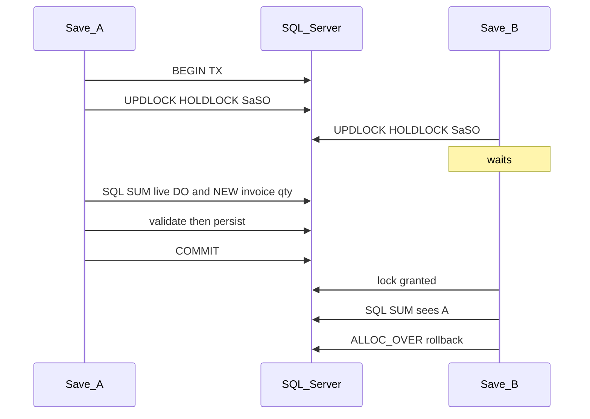

# Soft-reserve SO qty held on DOs

Ledger stays on **post**. Draft DOs do not insert `SO_DO`. Pickers are hints. **Save and post are the authority**, and remaining validation is a concurrency-safe operation on the SO line (not a second reservation table).



## Formal SO-line invariant (single source of truth)

All picker overlays, DO Save, Invoice Save (`!LinkDo`), `AllocateSOToDO`, and `AllocateSOToInvoice` use [`SaSoLineReserve`](ErpWeb.Core/Sales/SaSoLineReserve.cs). No path invents a local formula.

Per SO line (`CompanyCode`, `BranchCode`, `SoNo`, `SoLine`), after `SaSoQty.RoundQty`:

```
DeliveredQty  := SUM(SO_DO.AppliedQty)                    -- posted ledger only
PostedSoInv   := SUM(SO_INV.AppliedQty)                   -- posted ledger only
NewDoQty      := SUM(NEW DO line Qty)                     -- exclude self DO
LiveDoQty     := SUM(NEW+POSTED+CLOSED DO line Qty)       -- exclude self DO; SO-linked only
NewSoInvQty   := SUM(NEW !LinkDo invoice line Qty)        -- exclude self invoice

A  Deliverable:  DeliveredQty + NewDoQty + thisDoQty     <= OrderQty
B  Billable:     PostedSoInv + NewSoInvQty + LiveDoQty + thisSoInvQty <= OrderQty
```

`thisDoQty` / `thisSoInvQty` are the document being saved or posted (summed per SO line when several details share the same SO line). Zero on the other path.

**Do not collapse `DeliveredQty` and `LiveDoQty`.** They serve different invariants:

- `DeliveredQty` = posted `SO_DO` ledger (physical fulfillment already applied).
- `LiveDoQty` = DO-path qty that reserves **direct SO invoice** capacity (draft + posted + closed SO-linked DOs).

A uses posted fulfillment + other drafts. B uses the whole DO path so a NEW DO cannot be invoiced again via `SO_INV`. Using `InvoicedQty` in B would double-count `DO_INV`. Put this comment on the helper type and on `Evaluate`.

**Leftover (required):** SO 100, live DO 40 → remaining SO_INV = 60. Do not use “any DO exists → block Add Shipment”.

**Cross-path (required to keep):** posted DO 40 + direct SO_INV 60 + DO_INV 40 is valid (A=40, B=60+40=100).

**DO Save vs Invoice Save:** both must leave A and B true. Unposted direct invoices consume billable headroom. Sequential: draft invoice 100 then DO 100 → DO save `ALLOC_OVER`. Draft invoice 60 + NEW DO 40 → both OK.

Pickers (read-only, **no lock** — do not hold SQL locks while Blazor has a picker open):

```
RemainingForNewDo    = min(OrderQty - DeliveredQty - OtherNewDoQty,
                           OrderQty - PostedSoInv - OtherNewSoInv - OtherLiveDo)
RemainingForNewSoInv = OrderQty - PostedSoInv - OtherNewSoInv - LiveDoQty
```

Stale picker is allowed; save/post recompute under lock.

## Post-transition (required — evaluate post-state once)

At POST the row is still `NEW` in `SaDO` / `SaInvoice` until the same transaction flips status and writes the ledger. **Count this document exactly once.**

**DO POST** (`AllocateSOToDO` then status `POSTED` in one TX):

- `excludeDo` = this document’s `(Company, Branch, DoNo)` even though `Status` is still `NEW`.
- `NewDoQty` = **other** NEW DOs only. This DO is not in `NewDoQty`.
- `thisDoQty` = `SO_DO.AppliedQty` being inserted (post-state take).
- `DeliveredQty` = existing `SO_DO` only (this insert is not in the SUM yet; it is `thisDoQty`).
- After insert + recalc, `DeliveredQty` includes this take; `NewDoQty` no longer includes this DO.

Never: this DO in `NewDoQty` **and** `thisDoQty` / new `SO_DO`. That would double-count A.

**Invoice POST** (`AllocateSOToInvoice`):

- `excludeInv` = this invoice even though it is still `NEW`.
- `NewSoInvQty` = other NEW `!LinkDo` invoices only.
- `thisSoInvQty` = `SO_INV` being inserted.
- `LiveDoQty` = all live DOs (this invoice is not a DO).

**Explicit post-state, not EF flush timing.** SUM existing quantities with `excludeDo`/`excludeInv` **before** inserting `SaDocApplication`. Pass `thisDoQty`/`thisSoInvQty` into `Evaluate` as the post-transition take. Do not SUM after `Add`/`SaveChanges` and hope the current row is or is not visible. Visible in service code as: existing SUMs + this document + then persist ledger.

`AllocateSOToDO` enforces **A**. `AllocateSOToInvoice` enforces **B**. `AllocateDOToInvoice` unchanged.

## DO status lifecycle (soft-reserve)

Product statuses today: `NEW`, `POSTED`, `CLOSED` only. Do **not** invent `CANCELLED` / `VOID`.

| Status | In NewDoQty | In LiveDoQty | Notes |
|---|---|---|---|
| NEW | Yes | Yes | Draft / after rollback |
| POSTED | No (already in `DeliveredQty` via `SO_DO`) | Yes | Invoice from DO path |
| CLOSED | No | Yes | Fully invoiced **or** force-closed after post; still occupies the DO path |
| Deleted | No | No | Rows gone; qty returns |
| Standalone DO (no SO ref) | No | No | Ignored |

Rollback POSTED → NEW: live NEW reserve again. Force-closed CLOSED still in `LiveDoQty`.

## Concurrency (required — same TX as persist)

Existing architecture already starts a transaction and locks SOs with `SaSO WITH (UPDLOCK, HOLDLOCK)` via `LockSalesOrdersForSaveAsync` ([`SaDoService`](ErpWeb.Core/Sales/SaDoService.cs) ~2399, [`SaInvoiceService`](ErpWeb.Core/Sales/SaInvoiceService.cs) ~2188) in **stable `SaSoLockOrder`**. Allocation post already locks DO then SO ([`SaDocApplicationService.AllocateAsync`](ErpWeb.Core/Sales/SaDocApplicationService.cs)).

**Canonical lock order (P1 verify on every mutation path):** the same `SaSoLockOrder` for SO headers on DO Save, Invoice Save, DO Post, Invoice Post, and `Allocate*`. Never lock SO002 then SO001 on one path and the reverse on another. DO keys stay before SO keys where allocation already does that; SO-only saves keep SO order only.

**Save protocol (DO and direct SO invoice):**

```
BEGIN TRANSACTION
  Lock participating SaSO headers (Company+Branch+SoNo) UPDLOCK, HOLDLOCK, ordered
  Load SO details
  SQL SUM NewDoQty / LiveDoQty / NewSoInvQty (company+branch scoped)
  Validate A and B including this document's requested qty  -- never clamp
  Persist DO / Invoice
COMMIT
```

The SO rows that determine remaining stay locked until COMMIT. Second saver waits, first commits, second recalculates, then `ALLOC_OVER` if over.

**Deadlock (1205):** current save/update already rolls back the **entire** transaction and returns fail-closed “try again” ([`SaDoService`](ErpWeb.Core/Sales/SaDoService.cs) ~507, [`SaInvoiceService`](ErpWeb.Core/Sales/SaInvoiceService.cs) ~534). Keep that.

- Do **not** retry only the SUM query.
- Do **not** continue the same DbContext/TX after 1205.
- Client/user retries the **complete** save or post: new TX → re-acquire SO locks → re-SUM → re-validate → persist.
- If an in-process retry loop is added later, it must recreate that full sequence with a bounded retry count. Out of scope for this change unless already present.

SQLite tests prove formulas only (no UPDLOCK). Same-DO concurrent edit: `RowVersion` plus SO lock; exclude identity is `(CompanyCode, BranchCode, DoNo)`. Pickers do not take this lock.

## Tenant isolation (fail-closed, server-side)

- Filter `CompanyCode` + `BranchCode` from the authenticated write context (not client-supplied tenant).
- `excludeDo` / `excludeInv` match **Company + Branch + DocNo**.
- Missing SO after lock → fail.
- Qty `<= 0` already rejected; over-reserve → `ALLOC_OVER`, no clamp.

## Shared helper

[`ErpWeb.Core/Sales/SaSoLineReserve.cs`](ErpWeb.Core/Sales/SaSoLineReserve.cs) — not inside `SaDocApplicationService`.

- Batch by SO key list (one round-trip each for DOs and NEW invoices). SQL `SUM` / `GROUP BY SoNo, SoLine`. No per-line queries. No loading all DO details into memory.
- Predicates: company, branch, `SoNo IN (...)`, `SoLine IS NOT NULL`, `SoNo <> ''`, status filter, exclude identity.
- `Evaluate` returns a **structured** result (calculation owns numbers, callers format `ALLOC_OVER`): SO line key, `OrderQty`, `DeliveredQty`, `PostedSoInv`, `NewDoQty`, `LiveDoQty`, `NewSoInvQty`, `thisDoQty`, `thisSoInvQty`, `RemainingDeliverable`, `RemainingBillable`, `ErrorCode` (null or `ALLOC_OVER`). UI/service maps the code to the message.
- File-level comments: `DeliveredQty` vs `LiveDoQty` as above.

## Indexes

Reuse:

- [`IX_SaDODetail_Company_Branch_SoNo_SoLine`](ErpWeb.Model/Configurations/Sales/SaDoDetailConfiguration.cs)
- [`IX_SaInvoiceDetail_Company_Branch_SoNo_SoLine`](ErpWeb.Model/Configurations/Sales/SaInvoiceDetailConfiguration.cs)

Add `INCLUDE (Qty)` or a filtered index only if the seek is not covering. No speculative `SaDO.Status` index.

**Before production (not a coding blocker):** capture actual execution plans for the two aggregate queries at representative volumes (e.g. 10 SOs / 100 lines / 100k DO details, and 1M DO details), **cold-ish cache and warm cache**. Compare to the expected index seek + aggregate.

## Pickers

[`GetRemainingLinesAsync`](ErpWeb.Core/Sales/SaSoService.cs): optional exclude DO identity. Overlay picker `BalanceQty` with `RemainingForNewDo`; hide `<= 0`.

[`GetBillableLinesAsync`](ErpWeb.Core/Sales/SaSoService.cs): overlay `RemainingBillableQty` with `RemainingForNewSoInv`; hide `<= 0`.

[`SaDo.razor.cs`](ErpWeb.UI/Sales/Transactions/SaDo.razor.cs): pass current document identity when editing.

## Save / Post gates

[`SaDoService.PrepareLinesAsync`](ErpWeb.Core/Sales/SaDoService.cs): after SO lock, helper with `thisDoQty`; `excludeDo` on update.

[`SaInvoiceService.PrepareLinesAsync`](ErpWeb.Core/Sales/SaInvoiceService.cs): `!LinkDo` only; `thisSoInvQty`; `excludeInv` on update.

[`AllocateSOToDO`](ErpWeb.Core/Sales/SaDocApplicationService.cs): A with post-transition exclude (this section). [`AllocateSOToInvoice`](ErpWeb.Core/Sales/SaDocApplicationService.cs): B with `excludeInv`. Unique-key fail-closed.

## Tests

**Sequential** (SQLite OK) — [`SaDocApplicationTests`](ErpWeb.Tests/SaDocApplicationTests.cs):

- SO 100, NEW DO 60, second DO 50 → **save** reject.
- SO 100, DO 101 → **save** reject.
- Posted DO 40, direct 60 + DO_INV 40 → OK; direct 70 → save reject.
- NEW DO 100, direct invoice 100 → save reject; delete DO → invoice 100 OK.
- Edit DO 60→30 remaining 70; 60→70 remaining 30 (`excludeDo`).
- Two DO details same SO line: sum this document.
- Precision via `SaSoQty.RoundQty`.
- **NEW → POSTED:** after post, that DO is not in `NewDoQty`; `DeliveredQty` = posted qty; `LiveDoQty` unchanged. Helper during post must not double-count (A still holds, no `ALLOC_OVER` on a legal full post).

**Concurrency** (SQL Server only, [`SaInvoiceSqlServerConcurrencyTests`](ErpWeb.Tests/SaInvoiceSqlServerConcurrencyTests.cs) skip pattern). SQLite is **not** proof of locking.

- Two parallel NEW DO saves of 100 → one OK; committed live DO qty = 100.
- Parallel NEW DO 100 vs direct invoice 100 → never both committed.
- Two parallel direct invoice saves of 100 → one OK.
- Concurrent update of same DO → one `RowVersion` fail.
- **POST DO vs SAVE invoice:** SO 100, NEW DO 60 already saved. Parallel POST that DO vs SAVE invoice 50 → invoice must not commit (B remaining 40); post may succeed. Parallel POST DO 40 vs SAVE invoice 60 → both may succeed; A/B still hold after commit.
- **POST DO vs SAVE NEW DO:** SO 100, NEW DO 60. Parallel POST that DO vs SAVE second DO 50 → second save `ALLOC_OVER`; post succeeds; never delivered+new = 110.

**Lifecycle / isolation:** POSTED→CLOSED still in `LiveDoQty`; delete NEW returns qty; rollback POSTED→NEW still reserved; same `SoNo`/`DoNo` in another company/branch does not change this tenant; exclude from another company does not exclude this tenant’s DO.

## Out of scope

- `SaDocApplication` rows on DO/invoice save
- Billing unposted DOs
- Blocking DO post when SO is already fully billed (save-time B already blocks a NEW DO that would break B)
- New CANCELLED/VOID statuses
- Picker-level locking
- In-process deadlock retry loop (client retries the full operation)
- Production-scale index capture as a coding gate (do before go-live)
