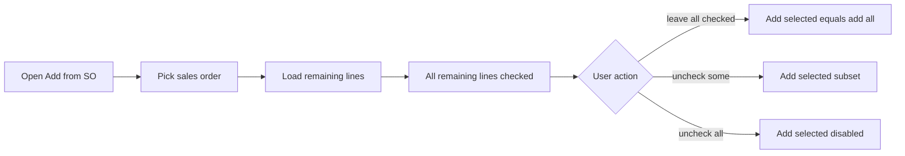

# Add-from-SO line selection

## Current behavior

[SaDo.razor](ErpWeb.UI/Sales/Transactions/SaDo.razor) popup shows remaining SO lines in a non-selectable `DxGrid`. [AddFromSo](ErpWeb.UI/Sales/Transactions/SaDo.razor.cs) always copies **every** remaining line.

Invoice has the same all-or-nothing pattern for **Add from SO** and **Add from DO**.

No backend or SQL change. `GetRemainingLinesAsync` / `GetBillableLinesAsync` already return remaining qty only.

## Target UX

- Checkbox column + header **Select all** (`GridSelectAllCheckboxMode.AllPages`).
- **Default: all remaining lines selected** when an SO (or DO list) loads — existing one-click “add everything” stays.
- Uncheck items to skip them.
- Primary button **Add selected** enabled only when at least one row is checked.
- Skip lines already on the document (`SoNo` + `SoLine` for SO; `DoNo` + `DoLine` for invoice-from-DO), same as today.
- Hide already-added remaining lines from the picker so they are not re-selected.

## UI changes (same pattern in three popups)

**1. DO Add from SO** — [SaDo.razor](ErpWeb.UI/Sales/Transactions/SaDo.razor) + [SaDo.razor.cs](ErpWeb.UI/Sales/Transactions/SaDo.razor.cs)

On the remaining-lines `DxGrid`:
- `SelectionMode="GridSelectionMode.Multiple"`
- `AllowSelectRowByClick="true"`
- `SelectAllCheckboxMode="GridSelectAllCheckboxMode.AllPages"`
- `@bind-SelectedDataItems` (or `SelectedDataItemsChanged`)
- `DxGridSelectionColumn` as first column
- `KeyFieldName="@nameof(SaSoLineDto.Line)"` (unique within one SO)

In code-behind:
- `IReadOnlyList<object> SelectedSoPickerItems`
- After `SoPickerLines = result.RemainingLines...`, filter out lines already on `Lines`, then **pre-select all**: `SelectedSoPickerItems = SoPickerLines.Cast<object>().ToList()`
- `AddFromSo()` iterates `SelectedSoPickerItems.OfType<SaSoLineDto>()` instead of `SoPickerLines`
- Enable **Add selected** when `SelectedSoPickerItems.Count > 0`
- Reset selection on SO change / close / `ResetSoPicker`

**2. Invoice Add from SO** — same as DO in [SaInvoice.razor](ErpWeb.UI/Sales/Transactions/SaInvoice.razor) + [SaInvoice.razor.cs](ErpWeb.UI/Sales/Transactions/SaInvoice.razor.cs) (`GetBillableLinesAsync`, still `SaSoLineDto`).

**3. Invoice Add from DO** — same checkbox UX on `DoPickerLines`. Do not set a single `KeyFieldName` (`Line` repeats across DOs); keep DTO instances so selection is by object identity. Filter already-added (`DoNo` + `Line`).

Footer copy (short): “All remaining lines are selected. Uncheck items to skip them.”

## Out of scope

- Changing qty in the picker (still edit qty on the DO/invoice line after add)
- Backend allocation / remaining-qty APIs
- New tests unless a tiny private filter helper is extracted (this is UI-only)

## Verify

- DO: pick SO with several remaining lines → Add selected with default (all) → all appear
- Uncheck two lines → only checked lines added
- Reopen picker → already-added remaining lines hidden; rest still selectable
- Select none → Add selected disabled
- Invoice Add from SO and Add from DO: same three cases
- Existing mix rule on invoice (cannot mix SO lines with LinkDo lines) unchanged
