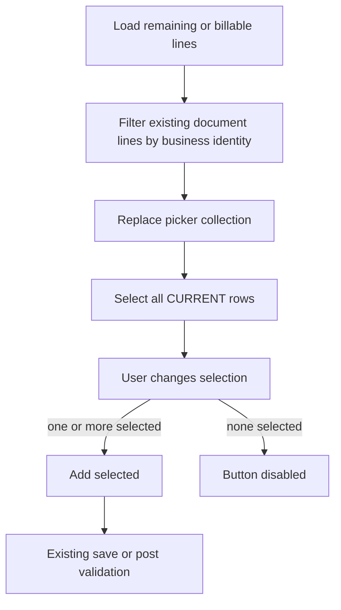

# Add-from-SO line selection (implementation contract)

Approved for implementation (9.2/10). Remaining items are implementation verification, not architecture changes.

Implement in this order: inspect APIs → helper + tests → **DO Add-from-SO (reference)** → verify DO → invoice Add-from-SO → invoice Add-from-DO → existing allocation/post tests → full browser pass.

## Current behavior

[SaDo.razor](ErpWeb.UI/Sales/Transactions/SaDo.razor) popup shows remaining SO lines in a non-selectable `DxGrid`. [AddFromSo](ErpWeb.UI/Sales/Transactions/SaDo.razor.cs) copies every remaining line into the in-memory document.

Invoice is the same for **Add from SO** and **Add from DO**.

Picker add is **draft-only**. Remaining qty is authoritative on **save/post** via existing `ISaDocApplication` / remaining-qty checks. No backend or SQL change.

`SaSoLineDto` has no `SoNo`. SO identity for a picker row is the currently selected SO (`SelectedSourceSoNo`) plus `Line`. Never infer `SoNo` from the DTO. `SaDoBillableLineDto` already has `DoNo` + `Line`.

## Target UX

- Checkbox column + header Select all.
- **Default: all remaining (not already on the document) lines selected** so one click still adds everything.
- Uncheck to skip. **Add selected** enabled only when `SelectedSoPickerLines.Count > 0` (or DO equivalent). Derive enabled from typed selection count — do not keep a separate `CanAddSelected` flag.
- Hide already-added remaining lines before building selection. Exact order: API result → filter already-added → assign **final** `SoPickerLines` → `SelectAllCurrent(final SoPickerLines)`. Never select-all from the unfiltered API result.

## Business identity (not CLR identity)

| Picker | Grid data invariant | Filter / add / already-on-document key |
|---|---|---|
| DO Add from SO | `SoPickerLines` is **exactly one** selected SO | `SelectedSourceSoNo` + `SaSoLineDto.Line` vs document `SoNo` + `SoLine` |
| Invoice Add from SO | Same: one selected SO | Same |
| Invoice Add from DO | Multiple DOs in one list | `SaDoBillableLineDto.DoNo` + `Line` vs document `DoNo` + `DoLine` (or LinkDo line refs) |

Do **not** treat two DTO instances as the same line because they are the same object. After any collection replace, rebuild selection from the **new** list.

`KeyFieldName` is a grid-row identity inside the current collection only:

- SO pickers: `KeyFieldName="@nameof(SaSoLineDto.Line)"` is valid **because** the grid contains one SO. Document that invariant in code.
- DO picker: `Line` is not unique. **Do not assume `KeyFieldNames` exists.** First inspect installed DevExpress 26.1.4 `DxGrid` (package in [ErpWeb.UI.csproj](ErpWeb.UI/ErpWeb.UI.csproj), existing `DxGrid` usage). If `KeyFieldNames` is present and takes `DoNo` + `Line`, use it. Otherwise a thin picker-row wrapper with stable `PickerKey` (`"{DoNo}:{Line}"`). Do not invent the API from memory. Do not rely on object-reference identity as the contract.

## Typed selection state

`DxGrid.SelectedDataItems` is `IReadOnlyList<object>`. **Do not bind** that parameter directly to `IReadOnlyList<SaSoLineDto>` if the types are incompatible.

Follow the existing adapter in [CommonDataGrid.razor.cs](ErpWeb.UI/Components/Common/DataGrid/CommonDataGrid.razor.cs) (`HandleSelectedItemsChanged` maps `IReadOnlyList<object>` → `OfType<T>()`). Inspect that code and copy the same event-boundary pattern. Component state stays typed:

- `IReadOnlyList<SaSoLineDto> SelectedSoPickerLines`
- `IReadOnlyList<SaDoBillableLineDto> SelectedDoPickerLines`

`AddFromSo` / `AddFromDo` iterate the typed lists, not `object`.

Checkbox change must update typed selection then re-render so **Add selected** enables/disables immediately.

## Grid data model (select-all semantics)

Pickers stay **fully materialized in-memory** lists:

- Client paging: `PageSize="10"` (rows not on the current page are still in `SoPickerLines` / `DoPickerLines`)
- `ShowFilterRow="false"`, `ShowSearchBox="false"` (unchanged — no filter+select-all in this change)
- No virtual scrolling, no remote/`GridDevExtremeDataSource`

`SelectAllCheckboxMode="GridSelectAllCheckboxMode.AllPages"` means **all remaining rows in the in-memory collection**, including other pages.

Do not enable filter/search in this change. If added later, selection-after-filter must be defined then.

## Selection lifecycle (all three pickers)

Whenever the picker data collection is replaced, selection must be rebuilt from the **new** collection. Never leave selection pointing at DTOs from an old list (Blazor Server circuit state).

**SO selected or changed (A to B):**

1. Clear SO-A selection (`SelectedSoPickerLines = []`)
2. Clear `SoPickerLines`
3. Load remaining/billable lines for SO-B
4. Filter by `SoNo + SoLine` already on the document
5. Replace `SoPickerLines` with the **filtered** list
6. `SelectedSoPickerLines = SelectAllCurrent(SoPickerLines)` — `SoPickerLines` here is the final filtered list
7. Render grid

No SO-A DTO may remain in selection after changing SO.

**Stale async load:** combo is already `Enabled="@(!SoPickerLoading)"` in [SaDo.razor](ErpWeb.UI/Sales/Transactions/SaDo.razor). Keep that (cannot change SO while loading). Also ignore a completed load if `SelectedSourceSoNo` no longer matches the requested SO (or `_disposed`). Same for invoice SO picker. Do not apply SO-A results after the user has moved to SO-B.

**Empty / disabled (not an Add failure):**

- No remaining rows after filter, including **all already on the document** → empty picker, **Add selected disabled**, existing informational message (“no remaining lines” / “already added”).
- User cannot execute Add in this state.

**Add outcomes:**

- Inspect current `AddFromSo` / `AddFromDo` for partial draft mutation before an error return. Preserve existing semantics; do not invent a new transaction around picker add. Picker add is in-memory only today.
- **Success:** close and `ResetSoPicker` after lines are copied and document recalc is done. Do **not** reset in `finally`.
- **True Add failure** (no SO selected, invoice mix rule): keep picker open; keep current selection and error. Mix rule runs **before** adding selected rows.
- Reopen after success: previously added lines hidden; remaining loaded; all current rows selected. Do not keep the previous session’s `Selected...` list.

## Small helper (no picker framework)

One small static helper used by DO and invoice pages, e.g. `SaDocPickerLines` in UI. Not a widget. Not responsible for DxGrid, dialogs, buttons, document mutation, allocation, or validation.

- `FilterRemainingSoLines(remaining, selectedSoNo, existing SoNo+SoLine keys)` — `selectedSoNo` is required; never read SoNo from `SaSoLineDto`.
- `FilterRemainingDoLines(remaining, existing DoNo+Line keys)`
- `SelectAllCurrent(IReadOnlyList<T> rows)` — **shallow list of the same row references** as the current picker collection. Do not clone DTOs. A new `List<T>` wrapping the current instances is required so selection is not the same mutable list instance as `SoPickerLines` if the grid mutates selection independently.

Unit-test the helper. Keep grid wiring in the two `.razor.cs` files.

## UI wiring (three popups)

**1. DO Add from SO** — [SaDo.razor](ErpWeb.UI/Sales/Transactions/SaDo.razor) + [SaDo.razor.cs](ErpWeb.UI/Sales/Transactions/SaDo.razor.cs) — **reference implementation**.

Grid: `SelectionMode="Multiple"`, `AllowSelectRowByClick`, `SelectAllCheckboxMode="AllPages"`, `DxGridSelectionColumn`, `KeyFieldName=Line`.

Two layers against duplicate document lines:

1. Picker filter (hide already-on-document)
2. `AddFromSo` second guard: skip by `SoNo + SoLine`

Button: `Enabled="@(!SoPickerLoading && SelectedSoPickerLines.Count > 0)"`.

**2. Invoice Add from SO** — same contract in [SaInvoice.razor](ErpWeb.UI/Sales/Transactions/SaInvoice.razor) + [SaInvoice.razor.cs](ErpWeb.UI/Sales/Transactions/SaInvoice.razor.cs). Mix rule (cannot add SO lines when LinkDo lines exist) unchanged and still runs **before** adding selected rows. Mix-rule failure does not reset the picker; selection remains.

**3. Invoice Add from DO** — same lifecycle; identity is `DoNo + Line`.

Short footer: “All remaining lines are selected. Uncheck items to skip them.”

## Server-side validation stays authoritative

UI selection is only the user’s requested subset for the **draft**.

Existing save/post allocation, remaining deliverable/billable qty, and concurrency (`RowVersion`) stay as they are. Example: User A’s picker still shows Line 1; User B posts it; User A Add selected puts it on the draft; User A post must still fail via current remaining-qty checks. No new allocation algorithm.

Confirm existing tests in [SaDocApplicationTests.cs](ErpWeb.Tests/SaDocApplicationTests.cs) / DO-invoice post tests still cover over-allocation. Do not weaken them.

## Out of scope

- Changing qty in the picker
- Enabling filter/search on the picker grid
- Backend remaining-qty APIs
- A generic picker component framework

## Verify

**Before coding (agent):** inspect DevExpress 26.1.4 `DxGrid` for `KeyFieldNames`; inspect `CommonDataGrid` selection adapter and copy that pattern; confirm SO combo stays disabled while `SoPickerLoading`; inspect `AddFromSo`/`AddFromDo` for partial mutation.

**Helper (automated):** filter none/some/all already added; SO key ignores other SOs’ same `Line`; helper requires `selectedSoNo` (does not read it from the DTO); DO key distinguishes same `Line` on two DOs; `SelectAllCurrent` returns a new list with the same instances.

**Selection (browser):** one line; many lines; default all selected; uncheck one/many/all; reselect; select-all after manual changes.

**Paging:** 20+ lines, select-all on page 1, Add selected adds all 20. Select some rows, change page, return, selection retained. Select all on page 1, go to page 2, uncheck one, Add selected count is 19. Then return to page 1: header checkbox indeterminate, selected count 19.

**Data state:** zero remaining / all already on document → empty picker, Add disabled, info message (not an Add failure). Some remaining; change SO while open; close/reopen; successful add then reopen (added hidden, rest selected). Mix-rule Add failure leaves picker open with selection.

**Invoice:** Add from SO; Add from DO; two DOs sharing `Line`; mix restriction unchanged.

**Stale data:** picker can be stale; save/post still rejects invalid remaining qty (existing tests).
