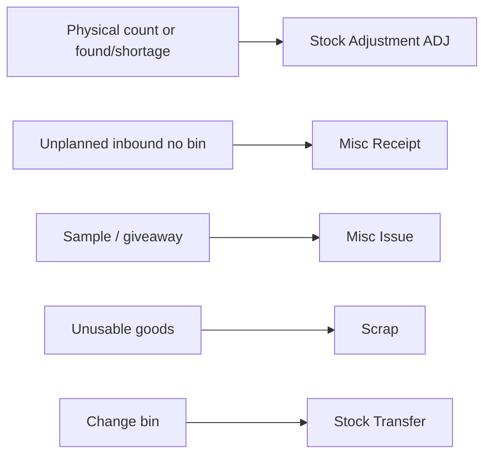
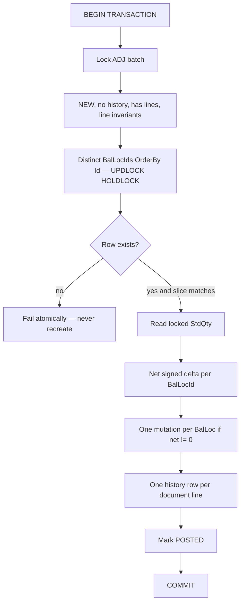

# Stock Adjustment (ADJ)

Review lock: **9.4/10 — approved for implementation** after the additions below. Do not infer costing, rollback identity, lock SQL, or posting quantity from the UI snapshot.

## AI-agent rule (required)

Before modifying code, inspect existing MI, MR, Scrap, Transfer posting and the repository locking/history helpers. **Reuse established patterns where this plan names them. Do not create parallel infrastructure** (new lock helper, history helper, permission helper, quantity helper) when an existing helper already provides the required semantics.

Named reuse:

- [IvStockPostingRepository.cs](ErpWeb.Model/Repositories/Inventory/IvStockPostingRepository.cs): `LockBatchForUpdateAsync`, `LockBalLocByIdForTenantAsync`, `DecreaseBalLocQtyAsync`, `IncreaseBalLocQtyAsync`, history add/load/remove
- [IvInventoryPostingService.cs](ErpWeb.Core/Inventory/IvInventoryPostingService.cs): `DispatchAsync` permission + concurrency mapping (no new retry loop)
- [IvMiscIssueService.cs](ErpWeb.Core/Inventory/IvMiscIssueService.cs) / [IvScrapService.cs](ErpWeb.Core/Inventory/IvScrapService.cs): lifecycle, remarks, reason parse

## Product decision (locked)

Stock Adjustment is a **same-bin quantity correction against an existing `IvBalLoc`**. It is not Misc Receipt and not Misc Issue.

- ADJ **only** operates on an existing `IvBalLoc`.
- ADJ **never** creates a new `IvBalLoc`, lot, or bin (that remains Misc Receipt).
- ADJ **never** moves stock between bins (that remains Transfer).
- ADJ **never** writes off unusable goods (that remains Scrap).
- Do **not** implement ADJ by calling `PostInventoryMRAsync` or `PostInventoryMIAsync`.
- Do **not** ship UI that posts through MI/MR.



Zero-qty **existing** bins may be increased. Brand-new slices may not.

## Lifecycle state matrix (follow MI exactly)

| Current | Edit | Delete | Cancel | Post | Rollback |
|---|---|---|---|---|---|
| NEW | Yes | Yes | Yes | Yes | No |
| POSTED | No | No | No | No | Yes |
| CANCELLED | No | No | No | No | No |

Duplicate POST is rejected (not NEW / history exists). Duplicate ROLLBACK is rejected (not POSTED / no history).

## ADJ line invariant (required — Create, Update, Save, and Post)

Defense in depth: the same helper must run on **Create, Update, Save, and Post**. Do not validate only at Post.

Every ADJ detail must be **exactly one** of:

**A) Increase**

- `ToBalLocId != null`
- `ToStdQty > 0` (after `IvQty.Round`)
- `FromBalLocId == null`
- `FrStdQty` is null or 0
- To warehouse/location/lot copied from the selected existing balance

**B) Decrease**

- `FromBalLocId != null`
- `FrStdQty > 0` (after `IvQty.Round`)
- `ToBalLocId == null`
- `ToStdQty` is null or 0
- From warehouse/location/lot copied from the selected existing balance

Reject if a line has both directions, neither direction, or rounded qty 0.

`IStatus` / `IClassCode` / `ExpiryDate` are copied from the selected balance and are not user-editable. Reason is stored like Scrap: `Remarks = "{REASON}: {user remark}"` via `CombineRemarks` / `ParseStoredRemarks`.

Do **not** persist UI CurrentQty on the detail. Do not add a CurrentQty property that posting later reads. CurrentQty is not a posting input.

## CurrentQty is a snapshot (required)

- **CurrentQty in the UI is informational/snapshot only.**
- Save may re-read `IvBalLoc.StdQty` for early feedback. That save-time qty is still not the posting source of truth.
- **Posting MUST use the authoritative quantity from the locked database `IvBalLoc` row.**
- Never compute posted stock as `UI_Current + Adjust`.

Example: UI Current = 100, Adjust = −30. Another user posts −20, on-hand becomes 80. This ADJ post must result in **80 − 30 = 50**, not 70. If Adjust = −80 against locked on-hand 60, POST fails and stock stays 60.

Barcode / picker: reuse `IvStockMasterPicker`, `ResolveItemAsync`, `IvBalLocPicker`. The UI picker does not authorize stock. **Server must validate the final BalLocId** is an existing, tenant-owned row for the selected item even if the UI already picked it.

**BalLoc switch (UI):** when the selected item or BalLoc changes, reset Current snapshot, Adjust, New, and Reason together. Do not carry Bin A’s Adjust −20 onto Bin B.

## Unit price / valuation (locked — informational)

**Option A.** `UnitPrice` and `Amount = AdjustQty × UnitPrice` are **informational / audit only**.

- Persist `UnitPrice` on `IvTrxBatchDetail` and `IvTrxHistory` so the document can show who stated what value.
- ADJ **must not** change `IvBalLoc.Cost`, `IvBalLoc.UnitPrice`, or inventory valuation.
- ADJ **must not** post GL in v1.
- Default the field from `IvBalLoc.UnitPrice` then item purchase price (same as MI). Must be ≥ 0.
- Do **not** add `VIEW_COST` gating in v1.

**Verify existing primitives (do not assume from names):** current [IncreaseBalLocQtyAsync](ErpWeb.Model/Repositories/Inventory/IvStockPostingRepository.cs) / [DecreaseBalLocQtyAsync](ErpWeb.Model/Repositories/Inventory/IvStockPostingRepository.cs) update only `StdQty`, `TransDate`, and `Updated`/`ModifiedDate`. They do **not** set `Cost` or `UnitPrice`. ADJ must call these as-is. If a future change adds average-cost logic to those methods, ADJ must not pick up valuation side effects — add a test that `IvBalLoc.Cost` and `IvBalLoc.UnitPrice` are unchanged after ADJ post/rollback.

## Reasons

```csharp
public static class IvAdjustmentReasons
{
    public const string Count = "COUNT";
    public const string Found = "FOUND";
    public const string Shrinkage = "SHRINKAGE";
    public const string Damage = "DAMAGE";
    public const string Data = "DATA";
    public const string Other = "OTHER";
}
```

Required on every line; must be in `All`; `OTHER` requires remark.

**DAMAGE vs Scrap:** `DAMAGE` means a **quantity discrepancy attributed to damage discovered at count**. Actual disposal / write-off **must use Scrap**. ADJ DAMAGE does not scrap, does not change item status, and does not destroy the balance row.

## UX

Clone the Misc Issue shell, not the old WinForms form.

- List: copy [IvMiscIssueList.razor](ErpWeb.UI/Inventory/Transactions/IvMiscIssueList.razor) + `.cs` + `.css` (`iv-page`).
- Entry: copy [IvMiscIssue.razor](ErpWeb.UI/Inventory/Transactions/IvMiscIssue.razor) + `.cs` + `.css`, prefix `sa-`.
- Routes: `/inventory/stock-adjustment`, `/inventory/stock-adjustment/{new|edit|view}/{BatchNo?}`.
- Menu: `INV_STOCK_ADJUSTMENT` under Transactions, SortOrder 6.

**Header:** transaction date, status, ref no, remark.

**Line grid:** item, warehouse/location/lot, current qty (snapshot), **adjust qty** (signed; visually distinguish negative), new qty preview, reason, unit price, informational amount. KPI = net informational value.

**Line popup:**

1. Item — `IvStockMasterPicker` + barcode (`ResolveItemAsync`).
2. Existing BalLoc — `IvBalLocPicker`. After select, fill warehouse/location/lot/UOM/class/status/expiry/**current qty** as read-only.
3. Adjustment — Current (ro snapshot), Adjust (signed, source of truth), New (derived/editable). Reason required. Remark.

**Guarded dual-bind (required):** source of truth is Adjust. `New = SnapshotCurrent + Adjust`; typing New writes `Adjust = New − SnapshotCurrent`; reentrancy guard ignores the echo. Decrease cannot preview New below 0.

Footer/actions match MI. List buttons: NEW, POST, ROLLBACK, CANCEL, DELETE. Those buttons must call `IIvStockAdjustmentService` / `PostAsync("ADJ", …)` only.

## Permissions (server-side required)

Hiding the menu is not authorization.

| Action | Permission |
|---|---|
| Open list/entry | `ACCESS` |
| New | `ADD` |
| Edit NEW | `EDIT` |
| Delete NEW | `DELETE` |
| Cancel NEW | `CANCEL` |
| Post | `POST` |
| Rollback | `ROLLBACK` |

`IvStockAdjustmentService` and `IvInventoryPostingService.DispatchAsync` for ADJ must check `MenuCodes.InventoryStockAdjustment` + the matching `PermissionCodes` on every write/post/rollback. **Automated test:** user lacks `POST` → call `PostAsync` / `PostInventoryADJAsync` directly → authorization failure → no stock mutation.

## Core service

New [IIvStockAdjustmentService.cs](ErpWeb.Core/Inventory/IIvStockAdjustmentService.cs) + [IvStockAdjustmentService.cs](ErpWeb.Core/Inventory/IvStockAdjustmentService.cs), cloned from MI with Scrap-style reason validation and the shared ADJ invariant helper.

Register in [CoreServiceCollectionExtensions.cs](ErpWeb.Core/CoreServiceCollectionExtensions.cs). Menu in [MenuCodes.cs](ErpWeb.Core/Menus/MenuCodes.cs) and [menus.xml](ErpWeb/Menus/menus.xml). Type `IvTrxTypes.StockAdjustment = "ADJ"`. Shared numbering `RunningNumberKeys.IvBatch`. No schema change.

**Save / Update validation:**

- At least one line; stock-controlled item; BalLoc exists for tenant and belongs to the item.
- Warehouse/location/lot/status match the **re-read** balance row.
- Line invariant (exactly one direction).
- Adjust ≠ 0 after round; preview New = save-time StdQty + Adjust ≥ 0 (early feedback).
- Document-level early check: net decrease vs save-time on-hand. Post re-validates after lock.
- Reason required / valid; `OTHER` needs remark.
- Unit price ≥ 0.
- Increase **is allowed** when `StdQty == 0`. No BalLoc → fail (use MR).

## Posting (required)

Add `PostInventoryADJAsync` / `RollBackInventoryADJAsync` in [IvInventoryPostingService.cs](ErpWeb.Core/Inventory/IvInventoryPostingService.cs). Wire in `DispatchAsync` with `MenuCodes.InventoryStockAdjustment`.

### SQL lock / isolation semantics (required)

Use **existing** `LockBalLocByIdForTenantAsync`. On SQL Server it already selects with `WITH (UPDLOCK, HOLDLOCK)` scoped by Id + CompanyCode + BranchCode. That is the production lock for ADJ.

- Do **not** replace it with a normal `SELECT` / `AsNoTracking` query and call that a lock.
- Do **not** add an ADJ-specific lock helper.
- ADJ must get the **same update/serialization lock semantics** already used by MI rollback and Transfer posting.

**Deadlock policy:** follow existing inventory posting. `DispatchAsync` maps `DbUpdateConcurrencyException` to `"Stock was modified by another user. Retry."` There is **no** standard deadlock-retry loop. Deterministic `OrderBy(Id)` locking is the ADJ contention strategy (Option A). **Do not introduce an ADJ-specific retry strategy.**

### Duplicate-BalLoc netting (required)

Multiple lines may reference the same BalLocId.

- Collect **distinct** referenced BalLoc IDs.
- **Lock each Id once** (ascending Id).
- Calculate **all** lines against that same locked row’s `StdQty`.
- Apply **one** physical mutation per BalLoc (`Increase` or `Decrease` of `|net|`, or skip if net == 0).
- Write **one history row per document line**.

Do **not** lock/update per line (`line1 update, line2 update, line3 update`).

### Missing / mismatched BalLoc (required)

ADJ is **identity-based**.

- If the referenced `FromBalLocId` / `ToBalLocId` **no longer exists** → POST fails atomically. **Never recreate. Never substitute** a different row with the same item/warehouse/location/lot.
- If the row exists but slice attributes (item/wh/loc/lot/status) no longer match the detail → POST fails atomically. Do not re-resolve.



**Post algorithm (one DB transaction; whole batch fails atomically):**

1. Lock ADJ batch. Must be NEW. No existing history. Has lines.
2. Enforce line invariant on every detail.
3. Distinct BalLoc IDs from From/To. Lock `OrderBy(id)` via `LockBalLocByIdForTenantAsync`. Null lock result = missing BalLoc = fail. Slice must match.
4. Authoritative `StdQty` from locked rows only.
5. Net `+ToStdQty − FrStdQty` per BalLocId. Net decrease > on-hand → fail entire batch.
6. One mutate per BalLoc if net ≠ 0. **If net == 0, do not mutate `IvBalLoc`.**
7. One `IvTrxHistory` per document line (`TrxType = ADJ`), including zero-net. History is document-line intent, **not** 1:1 with physical mutations. Stamp original BalLocId + LotId on detail and history.
8. Set POSTED + `PostingOperationId`.

**Zero-net:** +10 and −10 → no qty change, POST succeeds, two history rows, rollback allowed, stock unchanged. Audit/reports must treat those rows as ADJ **document lines**, not as two physical stock mutations.

**History must answer:** who, when, which batch, which line, which BalLocId, how much, why. Reuse existing audit fields. No new schema.

## Rollback (required)

One DB transaction. Atomic. Only POSTED.

**Integrity checklist — every history row vs its detail before any stock change.** If any item fails, rollback fails atomically and stock is unchanged. Never partially trust history.

- BatchNo / company / branch match
- History line maps to the matching detail (`TrxLineNo`)
- `TrxType = ADJ`
- BalLocId matches the detail’s From or To Id (per direction)
- Direction matches the detail invariant (increase vs decrease)
- Quantity matches the detail (`FrStdQty` / `ToStdQty`)
- LotId matches the detail

Then:

- Reverse against the **original BalLocId** on history/detail. Do **not** re-resolve by slice. Missing original BalLoc = hard failure; never recreate/substitute.
- Inverse-net per original BalLocId → lock `OrderBy(Id)` once each → validate reverse decreases against locked qty → **one mutation per BalLoc**.
- Reverse-decrease that would go negative fails the entire rollback.
- Applies inverse **deltas to current stock**, not a pre-ADJ snapshot.

Example: 100 → ADJ +30 → 130 → other −50 → 80 → rollback ADJ → **50**.

Then remove history the same way MI rollback does; restore NEW.

Test multiple history lines against the **same** BalLoc (not only one-line rollback).

## Tests

Follow [IvScrapPostingServiceTests.cs](ErpWeb.Tests/IvScrapPostingServiceTests.cs) + [IvMiscIssuePostingServiceTests.cs](ErpWeb.Tests/IvMiscIssuePostingServiceTests.cs) (Sqlite). Concurrency tests in [IvInventoryPostingSqlServerConcurrencyTests.cs](ErpWeb.Tests/IvInventoryPostingSqlServerConcurrencyTests.cs).

**Sqlite / sequential**

- Save writes `TrxType = ADJ`, NEW. Update of NEW re-runs invariant.
- Missing/blank/invalid reason fails; OTHER without remark fails.
- Adjust 0 fails; preview New &lt; 0 fails.
- Line with both From and To fails at save and at post (stock unchanged).
- Decrease over save-time on-hand fails at save.
- **Stale UI:** seed 100, save ADJ −80, set BalLoc to 60, POST fails, stock remains 60.
- **Missing BalLoc during post:** save ADJ, delete referenced BalLoc, POST fails atomically, never recreates.
- **BalLoc mismatch:** change slice attributes after save; POST fails.
- Post decrease 100 → 70; post increase 100 → 115; Cost and UnitPrice on BalLoc unchanged.
- **Duplicate BalLoc many lines:** +10, −3, +5, −2 on same bin → **one** physical mutation (net +10), **four** history rows.
- Mixed +10 / −3 same bin → 107; two history rows; rollback → 100 (same-BalLoc multi-line rollback).
- Mixed over-qty fails atomically.
- **Zero-net:** +10/−10 → stock unchanged, POST ok, two history, rollback ok, stock unchanged.
- Increase on zero-qty existing bin succeeds. No BalLoc fails.
- Cannot post POSTED twice; cannot rollback NEW; cannot edit/delete/cancel POSTED.
- **Rollback after later movement:** 100 → ADJ +30 → 130 → other −50 → 80 → rollback → 50 on original BalLocId.
- **Rollback history mismatch:** corrupt one history/detail relationship; rollback fails; stock unchanged.
- **Direct post without POST permission:** fail; no stock mutation.
- Lot-controlled: lot must match balance.

**SQL Server concurrency**

- Concurrent decreases: on-hand 100; A −70 and B −50. Exactly one succeeds; stock never negative.
- Opposite-order multi-BalLoc locks: two batches, same two BalLocs, reverse line order. Deterministic lock order serializes; no deadlock-induced corruption. No ADJ-specific retry.

Also extend [IvInventoryPostingServiceTests.cs](ErpWeb.Tests/IvInventoryPostingServiceTests.cs): unknown type still fails; ADJ is accepted.

**UI (when entry exists):** BalLoc switch resets Adjust/New/Reason so Bin A’s −20 cannot leak onto Bin B.

## Out of scope

- Creating a new warehouse/location/lot from Adjustment (Misc Receipt).
- Changing item status on the line.
- Approval thresholds, GL, inventory valuation, cycle-count sessions.
- `VIEW_COST` gating.
- Dual UOM / purchase qty.
- ADJ-specific deadlock retry.

## Implementation order (required)

1. Constants / menu / DI
2. ADJ data mapping + shared line-invariant helper
3. Service Save/Search/Get/Update/Delete/Cancel (MI lifecycle)
4. Posting validation (existing UPDLOCK helper, authoritative qty, missing BalLoc hard-fail)
5. ADJ posting (distinct lock-once, net-once, history per line)
6. ADJ rollback (integrity checklist, original BalLocIds)
7. Unit/integration tests
8. SQL Server concurrency tests
9. List UI
10. Entry UI (guarded bind + BalLoc-switch reset)

**Mandatory:** do not ship UI that posts through MI/MR.

## Final approval checklist

- ADJ only operates on an existing `IvBalLoc`.
- ADJ never creates or substitutes a `IvBalLoc`.
- Missing original BalLoc at post or rollback is a hard atomic failure.
- Each line is exactly one increase or decrease; invariant on Create, Update, Save, and Post.
- CurrentQty is a snapshot only and is never persisted as a posting input.
- Posting reads locked authoritative `StdQty`.
- Locks use existing `LockBalLocByIdForTenantAsync` (`UPDLOCK, HOLDLOCK` on SQL Server), not a normal SELECT.
- Distinct BalLocs locked once in `OrderBy(Id)` inside one DB transaction.
- One net mutation per BalLoc; one history row per document line.
- Insufficient stock / missing row / slice mismatch fails the whole batch atomically.
- Zero-net produces history and does not mutate stock.
- History retains original BalLoc identity; rollback uses those IDs after an integrity checklist.
- Rollback is atomic; reverse-decrease that would go negative fails entirely.
- Duplicate POST / ROLLBACK rejected; NEW/POSTED matrix matches MI.
- `IncreaseBalLocQtyAsync` / `DecreaseBalLocQtyAsync` used as-is; BalLoc Cost/UnitPrice unchanged.
- No ADJ-specific lock, history, permission, qty, or deadlock-retry helper.
- Concurrency, stale-UI, missing-BalLoc, history-mismatch, and direct permission-denied tests exist.
- Server-side permissions enforced on every write/post/rollback.
