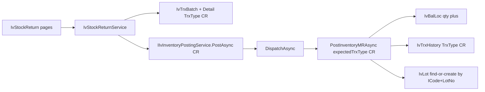

# Stock Return (CR) — clone MR, not MI

Follow [ErpWeb/docs/inventory-trx-pattern.md](ErpWeb/docs/inventory-trx-pattern.md). This is **stock IN**: qty returns to a warehouse / location / lot. Do **not** clone [IvMiscIssue](ErpWeb.UI/Inventory/Transactions/IvMiscIssue.razor) (`FromBalLocId` would **decrease** stock).

Cancel: **no** (same as MR). Architecture is unchanged. Do not invent a new transaction type, posting engine, costing rule, rollback mechanism, locking mechanism, or inventory architecture.

## Identity (do not invent a second code)

- TrxType: `IvTrxTypes.CustomerReturn` (`"CR"`) — already in [IvTrxConstants.cs](ErpWeb.Core/Inventory/IvTrxConstants.cs)
- Menu: `INV_STOCK_RETURN`
- Routes: `/inventory/stock-return`, `/inventory/stock-return/{new|edit|view}/{BatchNo}`
- CSS prefix: `sr-` (document); list keeps `iv-` like MR list
- Titles: Stock Return
- GridKey: `inv-stock-return-list`
- Batch numbers: `RunningNumberKeys.IvBatch`
- Permissions: ACCESS, ADD, EDIT, DELETE, POST, ROLLBACK — **no CANCEL**

`IvReturnReasons` must follow the **exact** `IvScrapReasons` pattern in [IvTrxConstants.cs](ErpWeb.Core/Inventory/IvTrxConstants.cs): named `const string` values plus `public static readonly IReadOnlyList<string> All`. Codes: `RETURN`, `EXCESS`, `QC_REJECT`, `WRONG_ITEM`, `OTHER`. Do not use `IvTrxReasons` and do not invent a dictionary/enum.

## Clone from MR (then rename)

Copy these, then rename types/strings/CSS:

- [IvMiscReceiptList.razor](ErpWeb.UI/Inventory/Transactions/IvMiscReceiptList.razor) (+ `.cs` + `.css`) → `IvStockReturnList.*`
- [IvMiscReceipt.razor](ErpWeb.UI/Inventory/Transactions/IvMiscReceipt.razor) (+ `.cs` + `.css`) → `IvStockReturn.*`
- [IIvMiscReceiptService.cs](ErpWeb.Core/Inventory/IIvMiscReceiptService.cs) / [IvMiscReceiptService.cs](ErpWeb.Core/Inventory/IvMiscReceiptService.cs) → `IIvStockReturnService` / `IvStockReturnService`
- Tests: clone [IvMiscReceiptServiceTests.cs](ErpWeb.Tests/IvMiscReceiptServiceTests.cs) into `IvStockReturnServiceTests.cs`, plus CR post/rollback cases modeled on [IvScrapPostingServiceTests.cs](ErpWeb.Tests/IvScrapPostingServiceTests.cs) and [IvInventoryPostingServiceTests.cs](ErpWeb.Tests/IvInventoryPostingServiceTests.cs)

Always-touch:

- [MenuCodes.cs](ErpWeb.Core/Menus/MenuCodes.cs) — `InventoryStockReturn = "INV_STOCK_RETURN"`
- [menus.xml](ErpWeb/Menus/menus.xml) — under INVENTORY, SortOrder 12 after Scrap
- [CoreServiceCollectionExtensions.cs](ErpWeb.Core/CoreServiceCollectionExtensions.cs) — `AddScoped<IIvStockReturnService, IvStockReturnService>()`

Keep layout, modes, list filters, dirty-check, lot helper `InventoryLotEntryState` + `IvLotNumberGenerator`. No new tables, no shared document base class.

## Deltas only (everything else stays MR)

**1. Required return reason on every NEW save and update**

Default `RETURN` in the popup. Server is authoritative: reject missing/unknown reason on **both** `SaveNew` and `Update` while the batch is `NEW` (same `ValidateLinesAsync` path MR already calls from both methods). An update must not bypass reason.

Persist with Scrap’s `CombineRemarks` / `ParseStoredRemarks` **copied as-is**. Do not create a CR-specific storage format. Stored value is `{CODE}` or `{CODE}: {remark}`. MR Get currently hard-sets `Reason = null` ([IvMiscReceiptService.cs](ErpWeb.Core/Inventory/IvMiscReceiptService.cs) ~line 231) — **do not copy that**.

**2. Item class from master, read-only**

UI: `DxTextBox` from item pick. Server: use `item.IClassCode`, ignore request override.

**3. Item status default `ACTIVE`**

Keep MR status combo so a return can land as `DAMAGED` / `QCHOLD`. Default `ACTIVE`. Server validates against active `IvStatus`.

**4. UOM from master, read-only**

UI: read-only from item. Server: use `item.StdUom`, ignore request override, still require the UOM to be an active master row.

**5. Copy, not Cancel**

List buttons: NEW / POST / ROLLBACK / DELETE only. No `CancelAsync`.

**Popup groups** (keep Blazor grouped layout; do not pixel-match WinForms): Item (code picker, read-only desc, read-only class) → Receive to (warehouse, location, lot, expiry) → Qty and value (qty, read-only UOM, unit price, amount) → Status + reason + remark.

Lot: same as MR — auto `yyMMdd###` when lot-controlled; user may edit; expiry required when lot-controlled.

**Expiry “today”** is `ICurrentDateService.Today` (company timezone via [CurrentDateService](ErpWeb.Core/Services/CurrentDateService.cs)), **not** browser-local `DateTime.Today`. Server uses `_dates.Today.Date` the same way MR already does. UI `AppToday` also injects `ICurrentDateService`; the server check is the authority.

Out of scope: customer/invoice link, barcode, `FromBalLocId`, new trx code `SR`, extracting a shared base.

## Additional ERP invariants (inherit MR engine — do not invent)

### Quantity

- Server: `Qty > 0` required. `Qty = 0` and `Qty < 0` reject. Do not rely on UI `MinValue`.
- Apply `IvQty.Round` (4 dp, away-from-zero) to the **stored** quantity field `IvTrxBatchDetail.ToStdQty` on SaveNew and Update, same as MR. Posting uses that stored qty; do not apply a different rounding in the UI model only.

### Valuation (same as MR — no CR-specific costing)

Stock Return **uses the existing MR valuation rule**. `Cost`, `CostPrice`, and `BaseUnitPrices` follow **MR save/post semantics exactly**. CR introduces **no new costing calculation**.

What MR actually does today (copy this, do not “improve” it):

- User enters `UnitPrice`. `UnitPrice < 0` reject. `UnitPrice = 0` allowed.
- Persist `UnitPrice` with `IvQty.Round` (4 dp) on `IvTrxBatchDetail`.
- MR `AddDetails` does **not** set `Cost`, `CostPrice`, or `BaseUnitPrices` (they remain null unless already on the entity).
- `PostInventoryMRAsync` copies those detail fields onto `IvTrxHistory` as-is (`UnitPrice`, `Cost`, `CostPrice`, `BaseUnitPrices`). It does not compute cost from `IvBalLoc`.
- Display / list amount = `Qty × UnitPrice`, list `TotalAmount` rounded to 2 dp.

### Document lifecycle

No Cancel on this type, so `CANCELLED` is not a reachable CR state.

- **NEW**: Edit YES, Delete YES, Post YES, Rollback NO
- **POSTED**: Edit NO, Delete NO, Post NO, Rollback YES

**NEW Update is atomic across all lines** (same as MR `UpdateAsync`): lock batch, validate **every** requested line first; on any validation failure, abort the transaction and leave existing details unchanged. On success, replace the entire detail set in the same transaction (`RemoveRange` then `AddDetails`). Never persist a mixed old/new line set.

UI: hide/disable invalid buttons (same as MR list/entry). Server still rejects every invalid transition.

Error-message tests follow the **existing project convention**: `Assert.Equal` for cloned lifecycle/not-found strings (rewrite “miscellaneous receipt” → “stock return”); `Assert.Contains` for validation fragments (reason, qty, expiry). Do not invent error codes.

### Atomic posting (whole batch, all lines)

A CR batch is posted **as one unit**. `PostInventoryMRAsync` already plans every line, then applies, then commits. CR must stay on that method.

**Post-time revalidation:** posting must revalidate all mutable master-dependent fields from live masters (not the stale NEW draft): item exists and is active, UOM/warehouse/location/status still active, lot-control rules still apply. This is `BuildMrPostLineAsync` today — do not skip it for CR.

One successful post updates, for **all lines together**:

- `IvBalLoc` qty
- `IvTrxHistory` (one row per line, `TrxType = CR`)
- `IvLot` via existing `FindOrCreateLotAsync` when lot-controlled (see lot uniqueness below)
- `IvTrxBatch` inherits **all MR posted audit fields unchanged**: `BatchStatus = POSTED`, `PostedDate`, `PostedBy`, `PostedCount += 1`, `PostingOperationId`, plus `ModifiedDate` / `ModifiedBy`

If **any line** fails validation or apply, roll back **all** line movements and all related history/lot changes. No leftover history, no qty bump on any slice, no lot insert, batch stays `NEW`.

**Lot uniqueness (verify against MR, do not redesign):** `IvLot` unique key is `CompanyCode + ICode + LotNo` (`UQ_IvLot_Company_ICode_LotNo`). `SourceType` is **not** part of uniqueness. `FindOrCreateLotAsync` locks by that key; if the lot exists, **reuse it** and return it unchanged (`SourceType` is set only on insert). CR posting still passes `expectedTrxType` as `sourceType` for **new** lots. If an MR lot already exists for the same item+lot, CR must reuse that row — do not insert a second lot and do not overwrite `SourceType`. Same reuse behavior as MR `Lot_controlled_creates_and_reuses_lot`.

### Concurrent posting — exact existing lock path

CR must call the **same** MR transaction and SQL Server locking path. Do **not** implement a CR-specific lock, `RowVersion` check, or extra `UPDLOCK` in `IvStockReturnService`.

That path is: document service `PostAsync` → `_posting.PostAsync(CR)` → `DispatchAsync` → `PostInventoryMRAsync` → `LockBatchForUpdateAsync` (`UPDLOCK, HOLDLOCK` on SQL Server in [IvStockPostingRepository.cs](ErpWeb.Model/Repositories/Inventory/IvStockPostingRepository.cs)) → re-read batch → require `NEW` + `expectedTrxType` **before** inventory mutation → `HistoryExistsForBatchAsync` fence.

`DispatchAsync` already maps `DbUpdateConcurrencyException` to “Stock was modified by another user. Retry.”

Invariant: two concurrent posts of the same CR batch → exactly one succeeds, exactly one inventory movement, final status `POSTED`.

SQLite cannot prove `UPDLOCK`. Add a SQL Server concurrent-post case for CR next to [IvInventoryPostingSqlServerConcurrencyTests.cs](ErpWeb.Tests/IvInventoryPostingSqlServerConcurrencyTests.cs) (skip when SQL Server is unavailable). Sqlite tests still cover sequential double-post (`Post_twice_fails_qty_unchanged`).

### Rollback safety — existing MR field-clearing, unchanged

Use the existing MR rollback behavior **unchanged**. Do not keep `ToBalLocId`/`ToLotId` on NEW draft lines for “audit”; posted audit lives on `IvTrxHistory` while the batch is POSTED, and MR **deletes** those history rows on successful rollback.

`RollBackInventoryMRAsync` already:

- subtracts posted qty (rejects if any slice would go negative — all-or-nothing)
- deletes history
- sets each detail `ToBalLocId = null` and `ToLotId = null` ([IvInventoryPostingService.cs](ErpWeb.Core/Inventory/IvInventoryPostingService.cs) ~473–477)
- sets batch `NEW` and increments `RollbackCount`

**Subsequent consumption:** if reversing the CR qty would make the destination `IvBalLoc` negative, **reject** rollback. Leave batch `POSTED`, history intact, `RollbackCount = 0`, on-hand unchanged. Do not silently reverse a partial qty.

### Cross-transaction protection

Before any inventory mutation: `batch.TrxType == expectedTrxType`.

- CR batch posted as MR → reject, no qty change
- MR batch posted as CR → reject, no qty change
- CR batch posted as MI / SC / TR → reject

A CR batch may only move stock through `PostAsync(CR)` / `RollbackAsync(CR)` with menu `INV_STOCK_RETURN`.

### Permissions

Every CRUD/posting `CanAsync` uses `MenuCodes.InventoryStockReturn`, **never** `MenuCodes.InventoryMiscReceipt`. Clone the MR `CreateSut` permission matrix (Access, Add, Edit, Delete, Post, Rollback) onto the CR menu. Tests: deny each permission independently (not only Post/Rollback).

## Posting — dispatch into MR, do not copy the engine

[DispatchAsync](ErpWeb.Core/Inventory/IvInventoryPostingService.cs) today: `MR`, `MI`, `SC`, `TR`. Add `CR`.

Mirror how scrap parametrized MI:

- `isCr` → menu `MenuCodes.InventoryStockReturn`
- `isMr || isCr` → `PostInventoryMRAsync` / `RollBackInventoryMRAsync` with `expectedTrxType`
- Add `expectedTrxType` to those two methods (today they hard-check `IvTrxTypes.MiscellaneousReceipt`)
- Write history `TrxType` and lot `SourceType` as `expectedTrxType`
- User-facing errors: “Stock return was not found.” / “Only NEW stock returns can be posted.” etc.

Do **not** duplicate `PostInventoryMRAsync`. Document service calls `_posting.PostAsync(IvTrxTypes.CustomerReturn, …)` — no balance SQL in the page or document service.

## Tests that must pass

Clone MR coverage, then assert every invariant below. Existing [IvMiscReceiptServiceTests](ErpWeb.Tests/IvMiscReceiptServiceTests.cs) and [IvInventoryPostingServiceTests](ErpWeb.Tests/IvInventoryPostingServiceTests.cs) stay green after `expectedTrxType` refactor.

**Service**

- SaveNew / Get / Update / Delete
- Saved `TrxType = CR`
- Every `CanAsync` uses `INV_STOCK_RETURN` (clone MR permission matrix)
- No `CancelAsync` on the interface

**Validation (server, not UI)**

- Missing reason reject on SaveNew **and** on Update
- Unknown reason reject
- Valid reason save; valid reason + remark Get returns both; Update keeps reason/remark split
- Invalid item / inactive item reject
- Invalid / inactive UOM reject
- Qty 0 reject; Qty < 0 reject; Qty > 0 allowed; 4 dp rounding
- UnitPrice < 0 reject; UnitPrice 0 allowed; Amount = Qty × UnitPrice (list 2 dp)
- Item class always from master (request override ignored)
- UOM always from master (request override ignored)
- Lot-controlled: lot + expiry required; expiry not before `_dates.Today`
- Non-lot: lot and expiry forbidden
- Draft save does not create `IvLot` or change `IvBalLoc`

**Lifecycle**

- NEW: edit, delete, post succeed
- NEW: rollback rejected
- POSTED: edit rejected, delete rejected, post again rejected
- POSTED: rollback succeeds when on-hand still holds the returned qty

**Posting**

- CR post increases `IvBalLoc` by line qty
- History `TrxType = CR`; new lots get `SourceType = CR`; reused lots keep existing `SourceType`
- Batch `POSTED` with MR audit fields: `PostedDate`, `PostedBy`, `PostedCount = 1`, `PostingOperationId`
- Sequential double post: second fails, qty and history unchanged
- **Multi-line post atomicity:** save three valid CR lines; then make line 3’s item inactive (posting re-reads masters in `BuildMrPostLineAsync`); post fails → no `IvBalLoc` change for any line, no history, no lot, batch remains `NEW`
- **Multi-line save:** two valid lines + one invalid (qty 0) → whole SaveNew fails, no batch
- **Multi-line Update atomicity:** existing NEW batch with two valid lines; Update with two valid + one invalid → fails, original two lines unchanged
- CR post of a new lot: `IvLot.SourceType = CR`
- CR post of an existing lot (same Company+ICode+LotNo already created by MR): **one** `IvLot` row reused; original `SourceType` unchanged (MR); qty still increases

**Rollback**

- Reverses qty, deletes history, batch `NEW`, detail `ToBalLocId`/`ToLotId` null
- Rollback of NEW rejected
- Subsequent consumption: reduce on-hand below CR qty → rollback rejected, still POSTED
- **Multi-line rollback atomicity:** post two CR lines; rollback reverses **both** together (both qty restored, all history gone, batch NEW). If a consumption makes one slice negative, **neither** line reverses (clone MR negative-rollback: stay POSTED, history intact)

**Cross-type / security**

- `PostAsync(MR)` on CR batch fails; qty unchanged
- `PostAsync(CR)` on MR batch fails; qty unchanged
- Deny Access / Add / Edit / Delete / Post / Rollback on `INV_STOCK_RETURN` each fails the matching operation

**Concurrency**

- SQL Server: two simultaneous posts of the same CR batch → one success, one failure, one movement, final `POSTED`. Skip when SQL Server unavailable.

**Regression**

- Existing MR tests remain green
- MR post still writes history `TrxType = MR` and lot `SourceType = MR` after parametrization

## Verification

Run `dotnet test` on `ErpWeb.Tests` (CR tests, MR tests, posting tests). Browser flow:

1. List → New → Add line (lot auto-fill, class/UOM from master, default reason RETURN / status ACTIVE)
2. Save → View: reason survives, class equals item master, UOM equals item master
3. Confirm POSTED/NEW buttons: NEW shows Edit/Save paths; after Post, Edit/Delete unavailable
4. Post → on-hand increases; history `CR`; new lot `SourceType` `CR` (or reused lot unchanged)
5. Rollback → reversal
6. (If test data allows) consume some returned qty, then rollback must fail without changing stock
