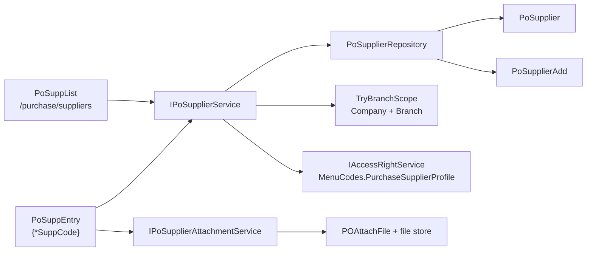

# Purchase Supplier Master (Purchase / Master / Supplier)

Clone **Customer Profile** (`SaCustList` / `SaCustEntry`), **not** Item Master and not Stock Return.

**Agent guardrails:** read `PoSupplier`, `PoSupplierAdd`, `PoSupplierConfiguration`, `PoSupplierAddConfiguration` and the live `POSupplier` / `POSupplierAdd` / `POAttachFile` schema before coding; do not assume the supplier shape matches the customer shape; do not re-create entities, EF configurations, DbSets or DDL that already exist; implement service and tests before Razor UI; do not modify unrelated ERP modules.

## What already exists — do not re-create

| Artifact | Location | Notes |
|---|---|---|
| `PoSupplier` entity | [PoSupplier.cs](ErpWeb.Model/Entities/Purchase/PoSupplier.cs) | Full header, incl. `RowVersion` |
| `PoSupplierAdd` entity | [PoSupplierAdd.cs](ErpWeb.Model/Entities/Purchase/PoSupplierAdd.cs) | Address child; child PK includes `Line` |
| EF configurations | [PoSupplierConfiguration.cs](ErpWeb.Model/Configurations/Purchase/PoSupplierConfiguration.cs), [PoSupplierAddConfiguration.cs](ErpWeb.Model/Configurations/Purchase/PoSupplierAddConfiguration.cs) | Table names, lengths, indexes, cascade FK |
| DbSets | [AppDbContext.cs](ErpWeb.Model/Data/AppDbContext.cs) lines 79–80 | `PoSuppliers`, `PoSupplierAdds` |
| DDL | [create-po-masters.sql](scripts/create-po-masters.sql) lines 261–377 | `POSupplier` + `POSupplierAdd` |
| `POAttachFile` entity/config/DbSet/DDL | [PoAttachFile.cs](ErpWeb.Model/Entities/Purchase/PoAttachFile.cs), [PoAttachFileConfiguration.cs](ErpWeb.Model/Configurations/Purchase/PoAttachFileConfiguration.cs), [create-po-order.sql](scripts/create-po-order.sql) lines 143–172 | PK `(CompanyCode, BranchCode, DocID, DocName)` |
| `PoCategory`, `PoBuyingTerm`, `PoAuthorised`, `PoBuyer`, `PoVendor` | `ErpWeb.Model/Entities/Purchase/` | Available; `PoBuyingTerm` is used for the Buying Term dropdown |

**Verified keys (do not change):**

- `POSupplier` PK `(CompanyCode, BranchCode, SuppCode)` — `SuppCode` nvarchar(60), `SuppName` nvarchar(200) NOT NULL, `RowVersion` rowversion, `Active` bit NOT NULL default 1.
- `POSupplierAdd` PK `(CompanyCode, BranchCode, SuppCode, Line)` + cascade FK to `POSupplier`.
- **`POSupplier` has no `LocationCode`.** Never call `TryWriteScope()`.
- **Nothing in the codebase references `SuppCode`** (grep-verified) — `CountReferencesBulkAsync` is a no-op today, exactly like `SaCustRepository`.

## Locked decisions

1. **`GlCode` is added** — `GlCode nvarchar(20) NULL` on `POSupplier`, additive and idempotent. It is the only mockup field with no existing column.
2. **Group and Sub Group are plain text boxes** bound to `CategoryCode` and `CreditorSubGroup`. A supplier-only group master will be introduced later; do not build a lookup now and do not reuse the customer `SaCustGroup` master.
3. **Attachments ship in this phase** — upload, list, download, delete, despite there being no pre-existing upload infrastructure in the repo.
4. **New top-level `PURCHASE` menu section**, mirroring Sales and Inventory.
5. **Branch-scoped only** — `IInventoryTenantContext.TryBranchScope()`. Company and Branch are never accepted from the route, query string, or request body.
6. **Two-phase header/child save** — one concurrency-aware header `SaveChanges` as the gate, then the child replace, in one transaction. Cloned from `SaCustService.SaveAsync`.
7. **`RowVersion` lives only on the header.** Children are never concurrency-guarded individually; they are replaced wholesale behind the header gate.
8. **Route uses the wildcard** `{*SuppCode}` — supplier codes contain `/` (e.g. `4000/P001`).
9. **Legacy unused columns stay null** — `TaxGroup`, `CreditorGroup`, `StateCode`, `CountryCode`, `Suspend`. `State` / `Country` are authoritative (as in `SaCust`).

## Mockup to column mapping

### Header (left / right columns)

| Mockup | Column | Notes |
|---|---|---|
| Vendor Code* | `SuppCode` | 60, immutable on edit, PK part |
| Vendor Name* | `SuppName` | 200, required |
| Short Name | `SuppShortName` | 100 |
| COM REG NO | `SupplierBrn` | 50 (`SupplierBRN` in DB) |
| Group | `CategoryCode` | 20, **text box** (decision 2) |
| Area Code | `AreaCode` | 20, lookup `IvAreaCode` |
| REG TYPE | `RegType` | 20 |
| Type | `SuppType` | 20 |
| PO Prefix | `PoPrefix` | 20 (`POPrefix` in DB) |
| Active | `IsActive` | `Active` bit |
| LMW/ATS | `Lmw` | `LMW` bit |
| Sub Group | `CreditorSubGroup` | 20, **text box** (decision 2) |
| MSIC Code | `MiscCode` | 20 (`MISCCode` in DB); label it "MSIC Code" |

### GENERAL tab

`Address1`..`Address4` (100), `Tel` (50), `Email` (100), `Website` (100), `PostalCode` (20), `City` (50), `State` (50), `Country` (50), `Fax` (50), `Telex` (50).

### SHIPPING ADDRESS tab — the "Contact List" grid is `PoSupplierAdd`

Your mockup's Name / Address / Postal Code / City / State / Country / Tel / Fax table maps 1:1 onto `PoSupplierAdd`: `Line`, `SuppName`, `Address1`..`Address4`, `City`, `State`, `PostalCode`, `Country`, `Tel`, `Fax`. Server assigns `Line` 1..N on save.

**Important:** unlike `SaCustAdd`, there is **no `DeliverTo` / `AddName` pair** — only `SuppName`. Do not add a "Deliver to" column to the grid or the popup.

### CONTACT tab — four fixed header slots, not a child table

| Tab | Columns |
|---|---|
| FIRST CONTACT | `ContactPerson`, `Title`, `Department`, `ContactEmail`, `ContactTelp`, `ContactFax` |
| SECOND CONTACT | `ContactPerson2`, `Title2`, `Department2`, `ContactEmail2`, `ContactTelp2`, `ContactFax2` |
| THIRD CONTACT | `…3` variants |
| FOURTH CONTACT | `…4` variants |

Store all four slots independently. Do **not** copy the customer's "line-1 contact mirrors the header columns" promotion rule — the supplier header has four dedicated column sets, so that rule would corrupt data.

### PAYMENT INFORMATION tab

| Mockup | Column |
|---|---|
| Taxable | `Taxable` (bit?) |
| Tax Group | `TaxGrCode` (20) — lookup `IvMsCode` type `TAX` |
| Tax Reg No | `GstregNo` (50, `GSTRegNo` in DB) |
| Bank Name | `BankName` (100) |
| Bank Account | `AccountNo` (50) |
| Statement Type | `StatementType` (20) — radio, new constants |
| Payment Term | `PayCode` (20) — lookup `IvMsCode` type `PAYCODE` |
| Currency* | `Currency` (20), required — lookup `SaCurrency` |
| Buying Term | `BuyingTerm` (20) — lookup `PoBuyingTerm` |
| GLCode* | `GlCode` (20) — **new column, decision 1** |
| Aging Type | `AgingType` (20) — radio, reuse `SaCustPaymentOptions` strings |
| Credit Limit | `CreditLimit` (decimal 18,2) |

`PoSupplierPaymentOptions` constants:

- `StatementOpenItem = "OPEN_ITEM"`, `StatementBalanceForward = "BALANCE_FORWARD"`, `StatementNone = "NO_STATEMENT"`.
- Aging Type reuses `SaCustPaymentOptions.AgingInvoice` (`"INVOICE DATE"`) and `SaCustPaymentOptions.AgingDue` (`"DUE DATE"`) — do not invent parallel strings.

### REMARK tab

`Remark` (500), `BizDesc` (200).

### ATTACHMENT tab

`POAttachFile` rows — see the attachment section below.

## Tenant and schema

- Read and write scope is `_tenant.TryBranchScope()` (Company + Branch required). Null scope → `InvalidScope` with **no query and no write**.
- Every repository filter and sort includes **both** `CompanyCode` and `BranchCode`.
- Add to `InventoryLeftoverSite` in [InventoryTenantContext.cs](ErpWeb.Core/Inventory/InventoryTenantContext.cs):

  - `Apply(PoSupplier entity, InventoryTenantScope writeScope)` → `entity.BranchCode = writeScope.BranchCode;`
  - `Apply(PoSupplierAdd entity, InventoryTenantScope writeScope)` → `entity.BranchCode = writeScope.BranchCode;`

  There is no `LocationCode` on either entity — do not stamp one.

### Migration: `scripts/alter-posupplier-profile.sql`

- Additive only: `GlCode nvarchar(20) NULL` when the column does not exist.
- Idempotent, re-runnable, `SET XACT_ABORT ON` with `TRY/CATCH`, `ROLLBACK` and `THROW`.
- No key, index, FK, or NOT NULL changes. Do not touch `POSupplierAdd`.
- Print `POSUPPLIER_GLCODE_APPLIED` or `POSUPPLIER_GLCODE_PRESENT` — no silent outcome.

## Backend

### Repository — `ErpWeb.Model/Repositories/Purchase/PoSupplierRepository.cs`

Mirror `ISaCustRepository` / `SaCustRepository`:

- `GetByCodeAsync(db, companyCode, branchCode, suppCode, includeChildren)` — `AsNoTracking`, `Include(x => x.Addresses.OrderBy(a => a.Line))` when `includeChildren`.
- `GetTrackedAsync(db, companyCode, branchCode, suppCode)`.
- `ExistsAsync(companyCode, branchCode, suppCode)` — UX-only duplicate pre-check; the PK is the final authority.
- `SearchPagedAsync` / `ListExportAsync` with `MaxPageSize = 100` and `MaxExportRows = 50_000`.
- `CountReferencesBulkAsync` → empty dictionary with a comment stating nothing references `SuppCode` yet.
- Sort whitelist via `PoSupplierSortFields.Allowed`, falling back to `SuppCode` when unrecognised.
- Search covers `SuppCode`, `SuppName`, `SuppShortName`, `City`, `Tel`, `Email`; filters `IsActive`, `SuppType`, `CategoryCode`, `AreaCode`.

### Service — `ErpWeb.Core/Purchase/PoSupplierService.cs`

`SearchAsync`, `GetAsync`, `SaveAsync`, `SetActiveAsync`, `CanDeleteBulkAsync`, `DeleteAsync`, `ExportRowsAsync`. Every entry point re-checks `IAccessRightService.CanAsync(MenuCodes.PurchaseSupplierProfile, permission)`; the UI `MenuAuthorize` / `PermissionAuthorize` is not sufficient on its own.

**Save mechanics (clone `SaCustService.SaveAsync` exactly):**

1. Resolve write scope via `TryBranchScope()`; fail closed.
2. Validate model and lookups; for `isNew` run the `ExistsAsync` duplicate pre-check.
3. `BeginTransactionAsync`.
4. **New:** construct `PoSupplier` with `CompanyCode` / `BranchCode` / `SuppCode`, call `InventoryLeftoverSite.Apply`, apply header fields and contact slots 1–4, `SaveChanges` #1, then `ReplaceChildrenAsync` (add `PoSupplierAdd` with `Line` 1..N), `SaveChanges` #2, commit, reload.
5. **Edit:** load tracked; return `Concurrency` if `RowVersion` differs; set `entry.Property(x => x.RowVersion).OriginalValue = model.RowVersion`; apply header; **`SaveChanges` #1 header-only** — this is the concurrency gate and must run while **no child entity is tracked**; on success replace children; `SaveChanges` #2; commit; reload.
6. Assert the invariant: a failed gate means **zero** child DELETE, **zero** child INSERT and **zero** persisted header change.
7. Never mutate a `PoSupplier` scalar after the gate — that would emit a second header UPDATE.
8. Catch `DbUpdateConcurrencyException` → `Concurrency`; `DbUpdateException` on a duplicate key → `DuplicateKey`; rollback the whole transaction either way.

**Bulk:** load every target with its caller-supplied `RowVersion` first; if any row is missing, stale, or referenced, fail the whole batch with **no mutations**; otherwise mutate all in one transaction, each row using that row's token.

**Required fields:** New → `SuppCode`, `SuppName`, `Currency`, `GlCode`. Edit always → `SuppName`, `Currency`. Edit `GlCode` required **iff** any payment or credit field changed (`PayCode`, `Currency`, `Taxable`, `TaxGrCode`, `GstregNo`, `BankName`, `AccountNo`, `StatementType`, `BuyingTerm`, `AgingType`, `CreditLimit`, `GlCode`) — reuse the snapshot rule from `SaCustService`. Telephone, address, contact, name and active changes are not triggers.

### Lookups — `ErpWeb.Core/Purchase/PoSupplierLookupService.cs`

| UI field | Source | Reuse |
|---|---|---|
| Area Code | `IvAreaCodes` (company) | logic from `SaCustLookupService` |
| State | `IvMsCodes` type `STATE` | reuse |
| Tax Group | `IvMsCodes` type `TAX` | reuse |
| Payment Term | `IvMsCodes` type `PAYCODE` | reuse |
| Country | `SaCountries` (global) | reuse |
| Currency | `SaCurrencies` (company, active) | reuse |
| Buying Term | `PoBuyingTerms` (company, active) | new query |
| Type / Reg Type / Statement Type / Aging Type | no master | text or radio |
| **Group / Sub Group** | — | **text boxes, decision 2** |

Validate lookups fail-closed using the `ValidateLegacyOrFailClosed` pattern, allowing a legacy unchanged code to pass and empty values to pass only where the field is optional.

## Attachments

There is **no** existing upload infrastructure: no `IFormFile`, `IBrowserFile`, `InputFile`, `UseStaticFiles`, or `uploads` folder anywhere. `app.UseAntiforgery()` **is** enabled and `app.MapStaticAssets()` is used. There is no `MaximumReceiveMessageSize` configuration, so the Blazor Server hub default of 32 KB applies.

### Metadata

`POAttachFile`, PK `(CompanyCode, BranchCode, DocID, DocName)`:

| Column | Value | Limit |
|---|---|---|
| `DocKey` | `"SUPPLIER"` constant | 30 |
| `DocId` | supplier code | 50 |
| `DocName` | sanitized original file name | 200 |
| `DocPath` | relative path under the storage root | 500 |
| `RevNo` | null | 20 |
| `Created` / `UserID` | from write scope | — |

`POAttachFile` has no FK to `POSupplier`, so the Attachment tab is **read-only/disabled in New mode** until the supplier has been saved.

### Storage

Files land under a configured root **outside** `wwwroot` (for example an `Attachments:RootPath` setting defaulting to `App_Data/attachments`), laid out as `{company}/{branch}/{docId}/{docName}`. Every resolved path is re-validated to stay under the root after `Path.GetFullPath` — reject any traversal attempt. Files are never publicly served.

### Endpoints — `ErpWeb/Purchase/PoSupplierAttachmentEndpoints.cs`

- `POST /purchase/suppliers/{suppCode}/attachments` — `ADD` permission, multipart, branch scope validated, filename sanitized, size and extension checked, file written then row inserted (delete the file if the row insert fails).
- `GET /purchase/suppliers/{suppCode}/attachments/{docName}` — `ACCESS` permission, streamed with `Content-Disposition: attachment`.
- `DELETE /purchase/suppliers/{suppCode}/attachments/{docName}` — `EDIT` permission, row removed then file deleted.

Recommended limits: 10 MB per file, 20 attachments per supplier, block `.exe/.dll/.bat/.cmd/.ps1/.js` and require an allow-list for documents and images.

### Upload transport (decide before implementing)

- **Option A (recommended):** Blazor `InputFile` + `IBrowserFile.OpenReadStream(maxAllowedSize)`, raise the SignalR hub limit to ~25 MB via `AddHubOptions`, persist through `IPoSupplierAttachmentService`, download via the `GET` endpoint. Least code, no CSRF token plumbing; file bytes traverse the circuit.
- **Option B:** a small `wwwroot/js` module posts `FormData` with a `RequestVerificationToken` header to the multipart endpoint. Better for large files, more moving parts because `UseAntiforgery` is enabled.
- **Option C:** `InputFile` relayed to the HTTP endpoint through JS interop.

## Menu and permissions

[menus.xml](ErpWeb/Menus/menus.xml) — insert the Purchase section after Sales and bump the tail sort orders (Operations 4→5, Security 5→6, Change password 6→7):

- `PURCHASE` "Purchase" SortOrder 4
  - `PO_MASTER` "Master" SortOrder 1
    - `PO_SUPPLIER` "Supplier" Route `/purchase/suppliers` SortOrder 1
  - `PO_TRANSACTIONS` "Transactions" SortOrder 2 (placeholder for later)

[MenuCodes.cs](ErpWeb.Core/Menus/MenuCodes.cs): `Purchase = "PURCHASE"`, `PurchaseMaster = "PO_MASTER"`, `PurchaseSupplierProfile = "PO_SUPPLIER"`.

`MenuSyncService` inserts the menus and their `ACCESS` `MenuPermission` rows at startup. **`ADD` / `EDIT` / `DELETE` / `EXPORT` are not auto-granted** — they must be granted through the Role Permissions admin screen after the sync, then the user re-logs in. This is a manual post-deploy step.

## UI

### `ErpWeb.UI/Purchase/_Imports.razor`

Required because Razor `_Imports.razor` is hierarchical: `ErpWeb.Core.Purchase`, `ErpWeb.Core.Menus`, `ErpWeb.Core.Security`, `ErpWeb.Core.Inventory`, `ErpWeb.UI.Components.Common.DataGrid`, `ErpWeb.UI.Components.Pages`, `ErpWeb.UI.Components.Security`, `ErpWeb.UI.Inventory.Lookups`, `ErpWeb.UI.Purchase.Masters`, `DevExpress.Blazor`.

### List — `PoSuppList.razor` / `.razor.cs` / `.razor.css`

Clone [SaCustList.razor](ErpWeb.UI/Sales/Masters/SaCustList.razor) and [SaCustList.razor.cs](ErpWeb.UI/Sales/Masters/SaCustList.razor.cs):

- `@page "/purchase/suppliers"`, `@inherits PageBase`, wrapped in `<MenuAuthorize MenuCode="@MenuCodes.PurchaseSupplierProfile">`.
- Hero with count chip and KPI, debounced search (400 ms, versioned to drop stale responses), Filter popup for Status / Type / Area (Group is a text box, so it can be a free-text filter or omitted from the popup).
- `CommonDataGridEx T="PoSupplierListRow"` with a `PoSuppGridDataSource : GridCustomDataSource` for server paging, plus the compact list for mobile.
- Buttons `NEW / COPY / ACTIVATE / DEACTIVATE / DELETE / EXPORT`; row actions `VIEW / EDIT`.
- Rows: Code, Name, Type, Group, Area, City, Tel, Active.
- `IsSubmitting` wrapped in try/finally; `_selectedRows` drives bulk actions.

### Entry — `PoSuppEntry.razor` / `.razor.cs` / `.razor.css`

Clone [SaCustEntry.razor](ErpWeb.UI/Sales/Masters/SaCustEntry.razor) and [SaCustEntry.razor.cs](ErpWeb.UI/Sales/Masters/SaCustEntry.razor.cs):

- `@page "/purchase/suppliers/{Mode:regex(^(new|edit|view)$)}"` **and** `@page "/purchase/suppliers/{Mode:regex(^(new|edit|view)$)}/{*SuppCode}"`. The wildcard is mandatory — codes contain slashes.
- `[SupplyParameterFromQuery(Name = "copy")]` for the COPY action.
- Two-column identity card (left: code, name, short name, COM REG NO, Group, Area, Reg Type; right: Type, PO Prefix, Active, LMW/ATS, Sub Group, MSIC Code).
- Tabs: `GENERAL`, `SHIPPING ADDRESS`, `CONTACT`, `PAYMENT INFORMATION`, `REMARK`, `ATTACHMENT`.
- SHIPPING ADDRESS: `DxGrid` over `Addresses` with an add/edit popup and delete confirm; NEW button disabled while submitting.
- CONTACT: four contact panels bound to the header slots.
- PAYMENT: radios for Statement Type and Aging Type following the `sa-cust-radio` pattern already in the customer entry.
- ATTACHMENT: grid of `#`, File Name, Uploaded On; BROWSE and UPLOAD actions; disabled in New mode.
- Footer with `PermissionAuthorize` (`ADD` when new, `EDIT` otherwise), CANCEL with discard confirmation, and the concurrency popup offering **Reload latest** or **Keep my changes**. Unknown save outcome → reload, never retry Save.
- `IsDirty` via a serialized clean snapshot, exactly as the customer entry does it.

### CSS — required workaround

`.iv-page`, `.iv-hero`, `.iv-card`, `.iv-form-grid`, `.iv-detail-grid`, `.iv-toast`, `.iv-popup-*`, `.iv-skeleton` are **global** in [inventory-chrome.css](ErpWeb/wwwroot/css/inventory-chrome.css) and can be reused as-is.

`.sa-cust-identity`, `.sa-cust-tab`, `.sa-cust-pay-stack`, `.sa-cust-grid`, `.sa-cust-radio*` are defined inside `SaCustEntry.razor.css`, which is **CSS-isolated to the `SaCustEntry` component** and cannot be reused. Either copy those rules into `PoSuppEntry.razor.css` under `.po-supp-*` names (recommended for this phase), or promote the generic two-column identity and pay-stack rules into `inventory-chrome.css` and have both components use them.

### Export — `ErpWeb/Purchase/PoSupplierExportEndpoints.cs`

Clone [SaCustExportEndpoints.cs](ErpWeb/Sales/SaCustExportEndpoints.cs): `MapGet("/purchase/suppliers/export")`, `.RequireAuthorization()`, `EXPORT` permission checked server-side, `OpenXml` xlsx build, `MaxExportRows = 50_000` with a helpful over-limit message, filename `PoSupplier_{DateTime.Now:yyMMddHHmmss}.xlsx`. The query never binds `CompanyCode` or `BranchCode`. Map it in [Program.cs](ErpWeb/Program.cs) alongside `MapSaCustExportEndpoints()`.

## Tests

**`ErpWeb.Tests/PoSupplierServiceTests.cs`** (SQLite, modelled on `SaCustServiceTests.cs`):

- Required fields: `SuppCode`, `SuppName`, `Currency`, `GlCode`.
- Duplicate code → `DuplicateKey`; `SuppCode` trimmed and immutable on edit.
- Tenant: `CompanyCode` and `BranchCode` always from scope; a row in another branch is invisible and immutable; null scope → `InvalidScope` with **zero** queries and zero writes.
- Access denied for ACCESS / ADD / EDIT / DELETE / EXPORT.
- Address child replace assigns `Line` 1..N; a child failure rolls back the header gate.
- Contact slots 1–4 round-trip independently — assert slot 1 is **not** copied into slots 2–4.
- `SetActive` / `Delete` with stale tokens are all-or-nothing with no mutations.
- Sort whitelist fallback; export ignores request-supplied tenant.
- `GlCode` required only when a payment/credit field changed; a phone-only edit with an empty `GlCode` saves successfully.

**`ErpWeb.Tests/PoSupplierSqlServerConcurrencyTests.cs`** (modelled on `SaCustSqlServerConcurrencyTests.cs`):

- B saves header, then A with a stale token → `Concurrency`, and assert **zero** child DELETE/INSERT and zero header change.
- B address-only edit then A stale edit → `Concurrency`.
- Unique/PK violation surfaces as `DuplicateKey`. SQLite is not proof of `rowversion` behaviour — this class is required.

**`ErpWeb.Tests/PoSupplierAttachmentServiceTests.cs`:**

- Path traversal (`..\`, absolute paths, unicode separators) rejected.
- Size cap and extension block-list enforced.
- Cross-branch upload, download and delete denied.
- `DocKey` is `"SUPPLIER"`; `DocName` sanitized and truncated to 200.
- Row insert failure removes the written file.

## Files

**New:** `scripts/alter-posupplier-profile.sql`, `ErpWeb.Model/Repositories/Purchase/PoSupplierRepository.cs`, `ErpWeb.Model/Repositories/Purchase/PoSupplierSearchArgs.cs`, `ErpWeb.Core/Purchase/*` (`IPoSupplierService`, `PoSupplierService`, `PoSupplierResults`, `PoSupplierSortFields`, `PoSupplierPaymentOptions`, `IPoSupplierLookupService`, `PoSupplierLookupService`, `IPoSupplierAttachmentService`, `PoSupplierAttachmentService`), `ErpWeb/Purchase/PoSupplierExportEndpoints.cs`, `ErpWeb/Purchase/PoSupplierAttachmentEndpoints.cs`, `ErpWeb.UI/Purchase/_Imports.razor`, `ErpWeb.UI/Purchase/Masters/PoSuppList.razor(.cs/.css)`, `ErpWeb.UI/Purchase/Masters/PoSuppEntry.razor(.cs/.css)`, three test classes.

**Modified:** [PoSupplier.cs](ErpWeb.Model/Entities/Purchase/PoSupplier.cs), [PoSupplierConfiguration.cs](ErpWeb.Model/Configurations/Purchase/PoSupplierConfiguration.cs), [InventoryTenantContext.cs](ErpWeb.Core/Inventory/InventoryTenantContext.cs), [CoreServiceCollectionExtensions.cs](ErpWeb.Core/CoreServiceCollectionExtensions.cs), [menus.xml](ErpWeb/Menus/menus.xml), [MenuCodes.cs](ErpWeb.Core/Menus/MenuCodes.cs), [Program.cs](ErpWeb/Program.cs), and `appsettings*.json` for the attachment root plus hub size.

## Implementation order

1. Lock the upload transport option and the attachment root path.
2. `alter-posupplier-profile.sql`; verify against a live `POSupplier` dump.
3. `GlCode` on the entity and EF configuration; build.
4. `PoSupplierSearchArgs`, `PoSupplierRepository`.
5. `PoSupplierResults`, `PoSupplierSortFields`, `PoSupplierPaymentOptions`.
6. `PoSupplierLookupService`.
7. `PoSupplierService` with the two-phase save.
8. `InventoryLeftoverSite` overloads and DI registration; build.
9. SQLite tests, then SQL Server concurrency tests.
10. Menus and `MenuCodes`; start the app once to sync; grant role permissions.
11. `PoSuppList` → export endpoint → `PoSuppEntry` (General, Shipping, Contact, Payment, Remark).
12. Attachment service, endpoints, then the Attachment tab; attachment tests.
13. Browser verification and DBA review.

## Verification

1. `dotnet build ErpWeb.slnx` and the full `ErpWeb.Tests` suite pass, including the SQL Server concurrency class.
2. Menu sync inserts `PURCHASE` / `PO_MASTER` / `PO_SUPPLIER` with `ACCESS`; ADD / EDIT / DELETE / EXPORT granted via Role Permissions; re-login reflects them.
3. Create supplier `4000/P001`, save, then open `/purchase/suppliers/view/4000%2FP001` and `/purchase/suppliers/edit/4000/P001` — the wildcard must handle both forms.
4. Switch the user's branch: the supplier disappears from the list and a direct URL does not load it.
5. Two browsers, same supplier: B saves, then A saves → conflict popup; Reload latest loads B's version; Keep my changes retains A's edits.
6. Double-click SAVE → exactly one set of `PoSupplierAdd` rows, no duplicates.
7. Attachments: upload, list, download, delete; a second branch is denied on all four; a `..\` filename is rejected.
8. State, Country, Tax Group, Payment Term, Buying Term, Currency dropdowns persist correctly; Statement Type and Aging Type radios round-trip.
9. Contact slots 1–4 persist independently and are not cross-populated.
10. Compact/mobile list and the collapsing identity card render correctly below the breakpoint.

## Risks

- **Entity drift:** the supplier entity does not mirror `SaCust`; copying customer code without adapting `BranchCode`/`LocationCode`, the contact model, or the child columns will produce silent data loss.
- **Migration scope:** keep `alter-posupplier-profile.sql` strictly additive. Adding a NOT NULL column to a populated table, or touching keys, requires its own review.
- **Concurrency gate:** mixing header and children in a single `SaveChanges` can emit child DELETEs before the guard UPDATE. Keep the two saves separate and assert the child-zero invariant in tests.
- **Slash codes:** any route without `{*SuppCode}` will break `4000/P001`. Verify both navigation and the COPY query.
- **Attachment security:** no existing upload pattern to copy. Path traversal, size, extension, tenant and authorization checks are all new code and need explicit tests.
- **CSS isolation:** reusing `sa-cust-*` class names in a new component will silently render unstyled.
- **Role grants:** the menu sync grants only ACCESS; forgetting the manual role grants looks like a permissions bug in testing.
- Do not change unrelated ERP modules.
